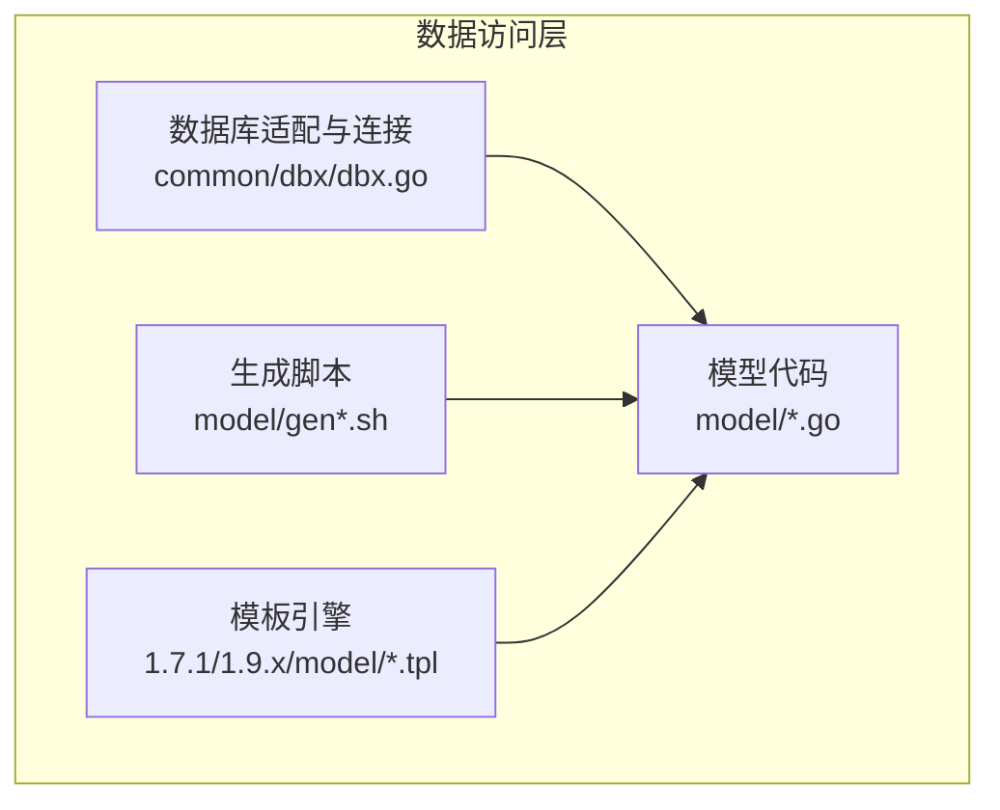
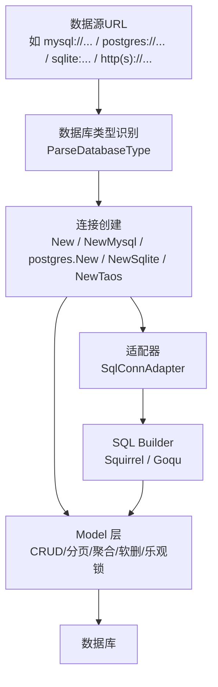
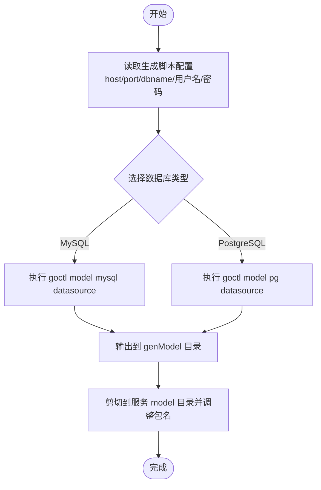
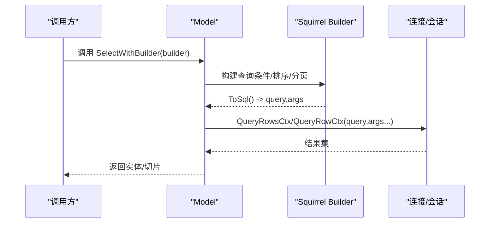
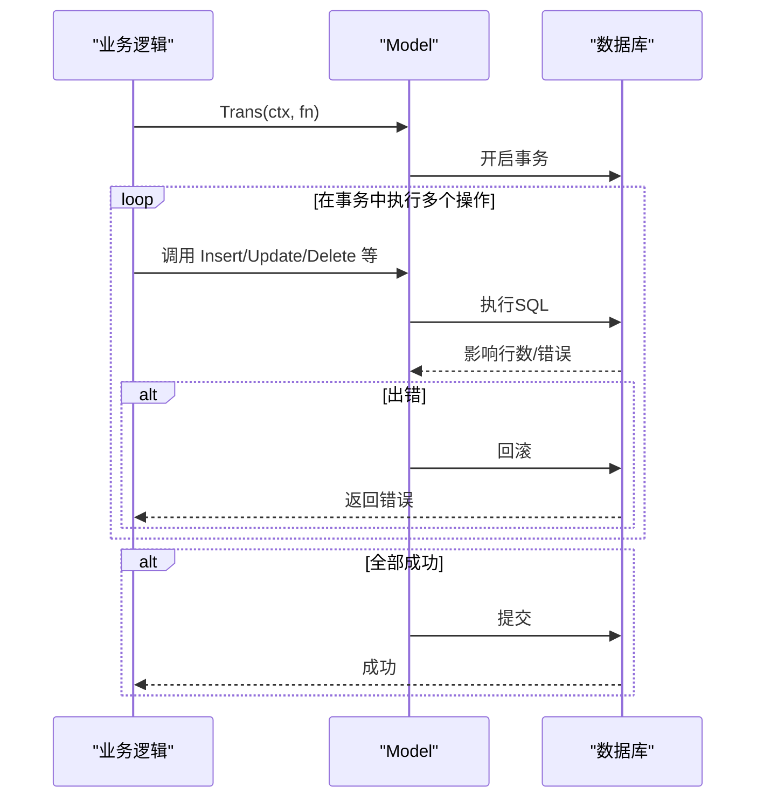
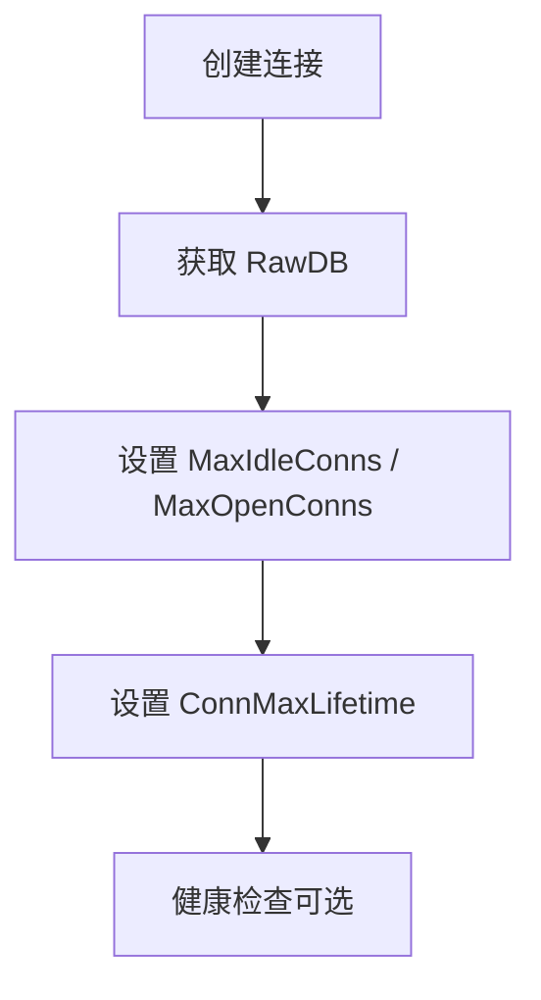
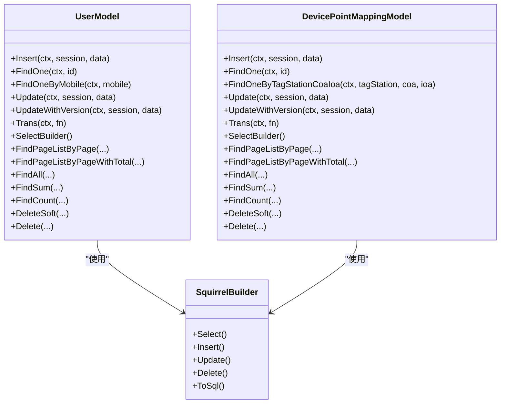
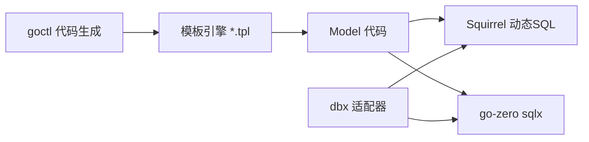

# 数据访问层

<cite>
**本文引用的文件**
- [common/dbx/dbx.go](file://common/dbx/dbx.go)
- [model/vars.go](file://model/vars.go)
- [model/usermodel_gen.go](file://model/usermodel_gen.go)
- [model/devicepointmappingmodel_gen.go](file://model/devicepointmappingmodel_gen.go)
- [model/modbusslaveconfigmodel_gen.go](file://model/modbusslaveconfigmodel_gen.go)
- [model/planexecitemmodel_gen.go](file://model/planexecitemmodel_gen.go)
- [model/genModel.sh](file://model/genModel.sh)
- [model/genPgModel.sh](file://model/genPgModel.sh)
- [1.7.1/model/update.tpl](file://1.7.1/model/update.tpl)
- [1.9.x/model/update.tpl](file://1.9.x/model/update.tpl)
- [.trae/skills/zero-skills/references/database-patterns.md](file://.trae/skills/zero-skills/references/database-patterns.md)
</cite>

## 目录
1. [简介](#简介)
2. [项目结构](#项目结构)
3. [核心组件](#核心组件)
4. [架构总览](#架构总览)
5. [详细组件分析](#详细组件分析)
6. [依赖分析](#依赖分析)
7. [性能考虑](#性能考虑)
8. [故障排查指南](#故障排查指南)
9. [结论](#结论)
10. [附录](#附录)

## 简介
本文件面向 Zero-Service 的数据访问层，系统性阐述以下内容：
- Model 生成工具的使用方法、工作原理、配置选项与自定义扩展机制
- SQL Builder 的集成与使用，包括动态 SQL 构建、参数绑定与查询优化技巧
- 事务管理机制，覆盖事务边界控制、嵌套事务处理与异常回滚策略
- 连接池配置与管理，涵盖连接数限制、超时设置与健康检查机制
- 数据访问层的抽象设计，包括接口定义、实现分离与依赖注入模式
- 数据访问最佳实践，包括查询优化、批量操作与缓存策略
- 完整的数据访问 API 文档与使用示例，帮助开发者正确使用数据访问层

## 项目结构
数据访问层主要由三部分组成：
- 通用数据库适配与连接封装：位于 common/dbx，负责根据数据源自动识别数据库类型并创建连接，同时提供适配器以支持第三方 SQL Builder（如 squirrel、goqu）。
- Model 层：位于 model，采用 goctl 自动生成，统一提供 CRUD、分页、聚合统计、软删除、乐观锁更新等能力，并通过 Squirrel 动态构建 SQL。
- 生成脚本：位于 model，提供 MySQL 与 PostgreSQL 的一键生成脚本，便于快速产出 Model 文件。

**图表来源**
- [common/dbx/dbx.go:1-155](file://common/dbx/dbx.go#L1-L155)
- [model/usermodel_gen.go:1-386](file://model/usermodel_gen.go#L1-L386)
- [model/devicepointmappingmodel_gen.go:1-549](file://model/devicepointmappingmodel_gen.go#L1-L549)
- [model/modbusslaveconfigmodel_gen.go:1-565](file://model/modbusslaveconfigmodel_gen.go#L1-L565)
- [model/genModel.sh:1-25](file://model/genModel.sh#L1-L25)
- [model/genPgModel.sh:1-27](file://model/genPgModel.sh#L1-L27)
- [1.7.1/model/update.tpl:260-378](file://1.7.1/model/update.tpl#L260-L378)
- [1.9.x/model/update.tpl:282-353](file://1.9.x/model/update.tpl#L282-L353)

**章节来源**
- [common/dbx/dbx.go:1-155](file://common/dbx/dbx.go#L1-L155)
- [model/vars.go:1-318](file://model/vars.go#L1-L318)
- [model/genModel.sh:1-25](file://model/genModel.sh#L1-L25)
- [model/genPgModel.sh:1-27](file://model/genPgModel.sh#L1-L27)

## 核心组件
- 数据库类型与通用选项
  - 统一的数据库类型枚举与 Model 选项，支持 MySQL、PostgreSQL、SQLite、TAOS。
  - 提供 WithDBType 等选项函数，便于在构造 Model 时显式指定数据库类型。
- 通用工具函数
  - 结构体字段元信息反射缓存、列名包装、SQL 占位符适配、插入/更新列与占位符生成、PostgreSQL 返回值适配等。
- Model 接口与实现
  - 统一接口：Insert、FindOne、Update、UpdateWithVersion、Trans、ExecCtx、SelectWithBuilder、SelectOneWithBuilder、InsertWithBuilder、UpdateWithBuilder、DeleteWithBuilder、SelectBuilder、InsertBuilder、UpdateBuilder、DeleteBuilder、DeleteSoft、FindSum、FindCount、FindAll、FindPageListByPage、FindPageListByPageWithTotal、FindPageListByIdDESC、FindPageListByIdASC、Delete。
  - 实现细节：各 Model 在不同数据库类型下对占位符、返回值、软删除、乐观锁等进行差异化处理；提供基于 Squirrel 的动态 SQL 构建与执行。

**章节来源**
- [model/vars.go:49-88](file://model/vars.go#L49-L88)
- [model/vars.go:155-318](file://model/vars.go#L155-L318)
- [model/usermodel_gen.go:28-46](file://model/usermodel_gen.go#L28-L46)
- [model/devicepointmappingmodel_gen.go:23-50](file://model/devicepointmappingmodel_gen.go#L23-L50)
- [model/modbusslaveconfigmodel_gen.go:23-50](file://model/modbusslaveconfigmodel_gen.go#L23-L50)

## 架构总览
数据访问层整体架构如下：
- 适配层：根据数据源 URL 自动识别数据库类型，创建相应连接；提供适配器以兼容第三方 SQL Builder。
- 模板与生成：通过 goctl 与模板引擎生成 Model 代码，统一 CRUD、分页、聚合、软删除、乐观锁等能力。
- 运行时：Model 通过统一接口执行 SQL，支持上下文、会话、事务与错误处理。

**图表来源**
- [common/dbx/dbx.go:31-64](file://common/dbx/dbx.go#L31-L64)
- [common/dbx/dbx.go:71-104](file://common/dbx/dbx.go#L71-L104)
- [model/vars.go:68-88](file://model/vars.go#L68-L88)

**章节来源**
- [common/dbx/dbx.go:1-155](file://common/dbx/dbx.go#L1-L155)
- [model/vars.go:1-318](file://model/vars.go#L1-L318)

## 详细组件分析

### Model 生成工具
- 工作原理
  - 使用 goctl 读取数据源，扫描表结构，结合模板引擎生成 Model 代码。
  - 模板覆盖基础 CRUD、分页、聚合、软删除、乐观锁、Builder 方法等。
- 配置选项
  - MySQL：通过 genModel.sh 指定 host、port、dbname、username、passwd，调用 goctl model mysql datasource 生成。
  - PostgreSQL：通过 genPgModel.sh 指定 host、port、dbname、username、passwd、schema，调用 goctl model pg datasource 生成。
  - 通用参数：-cache=false 控制是否启用缓存；--style=gozero 指定风格；--home 指向模板版本（如 1.9.x）。
- 自定义扩展机制
  - 通过模板文件（如 update.tpl、find-one.tpl 等）扩展生成逻辑，支持自定义方法与字段映射。
  - 生成后的代码位于 genModel 目录，需手动剪切到对应服务的 model 目录并调整 package 名称。

**图表来源**
- [model/genModel.sh:14-24](file://model/genModel.sh#L14-L24)
- [model/genPgModel.sh:20-27](file://model/genPgModel.sh#L20-L27)
- [1.7.1/model/update.tpl:260-378](file://1.7.1/model/update.tpl#L260-L378)
- [1.9.x/model/update.tpl:282-353](file://1.9.x/model/update.tpl#L282-L353)

**章节来源**
- [model/genModel.sh:1-25](file://model/genModel.sh#L1-L25)
- [model/genPgModel.sh:1-27](file://model/genPgModel.sh#L1-L27)
- [1.7.1/model/update.tpl:260-378](file://1.7.1/model/update.tpl#L260-L378)
- [1.9.x/model/update.tpl:282-353](file://1.9.x/model/update.tpl#L282-L353)

### SQL Builder 集成与使用
- 动态 SQL 构建
  - 各 Model 提供 SelectBuilder、InsertBuilder、UpdateBuilder、DeleteBuilder，支持链式调用拼装条件、排序、分页。
  - PostgreSQL 下自动切换占位符格式（$1/$2…），确保跨数据库兼容。
- 参数绑定
  - 通过 ToSql 获取最终 SQL 与参数列表，再交由底层连接执行，避免 SQL 注入风险。
- 查询优化技巧
  - 使用 Columns 明确选择字段，避免 SELECT *。
  - 使用 Where 条件与 Limit/Offset 实现分页，必要时配合 Count 聚合获取总数。
  - 对高频查询使用软删除过滤（del_state=0）与索引列条件。

**图表来源**
- [model/devicepointmappingmodel_gen.go:458-488](file://model/devicepointmappingmodel_gen.go#L458-L488)
- [model/modbusslaveconfigmodel_gen.go:455-485](file://model/modbusslaveconfigmodel_gen.go#L455-L485)
- [model/usermodel_gen.go:225-282](file://model/usermodel_gen.go#L225-L282)

**章节来源**
- [model/devicepointmappingmodel_gen.go:514-544](file://model/devicepointmappingmodel_gen.go#L514-L544)
- [model/modbusslaveconfigmodel_gen.go:530-560](file://model/modbusslaveconfigmodel_gen.go#L530-L560)
- [model/usermodel_gen.go:379-381](file://model/usermodel_gen.go#L379-L381)

### 事务管理机制
- 事务边界控制
  - Model 提供 Trans 方法，内部委托底层连接的 TransactCtx，在单个事务中执行多个操作。
- 嵌套事务处理
  - 采用数据库原生事务语义，遵循外层事务提交/回滚规则；若需要细粒度控制，可在同一事务中复用 Session。
- 异常回滚策略
  - 任一操作返回错误即触发回滚；建议在事务内先校验前置条件（如余额充足），再执行写操作。

**图表来源**
- [model/usermodel_gen.go:371-377](file://model/usermodel_gen.go#L371-L377)
- [model/devicepointmappingmodel_gen.go:443-449](file://model/devicepointmappingmodel_gen.go#L443-L449)
- [model/modbusslaveconfigmodel_gen.go:440-446](file://model/modbusslaveconfigmodel_gen.go#L440-L446)

**章节来源**
- [.trae/skills/zero-skills/references/database-patterns.md:271-365](file://.trae/skills/zero-skills/references/database-patterns.md#L271-L365)

### 连接池配置与管理
- 默认连接池配置
  - go-zero 默认 MaxIdleConns 与 MaxOpenConns 为 64，ConnMaxLifetime 为 1 分钟。
- 自定义连接池
  - 通过 RawDB 获取底层 *sql.DB 并设置最大空闲连接数、最大打开连接数、连接最大生命周期等。
- 健康检查机制
  - 建议定期执行轻量查询（如 SELECT 1）验证连接可用性；在高并发场景下结合熔断与限流策略。

**图表来源**
- [.trae/skills/zero-skills/references/database-patterns.md:448-480](file://.trae/skills/zero-skills/references/database-patterns.md#L448-L480)

**章节来源**
- [.trae/skills/zero-skills/references/database-patterns.md:448-480](file://.trae/skills/zero-skills/references/database-patterns.md#L448-L480)

### 数据访问层抽象设计
- 接口定义
  - Model 接口统一了 CRUD、分页、聚合、软删除、乐观锁、Builder 方法等能力，便于替换实现与测试替身。
- 实现分离
  - 不同数据库类型在生成代码中针对差异点（占位符、返回值、软删条件）分别处理，保持接口一致。
- 依赖注入模式
  - 通过构造函数注入 sqlx.SqlConn 与 ModelOption（含数据库类型），在服务上下文中按需装配。

**图表来源**
- [model/usermodel_gen.go:28-46](file://model/usermodel_gen.go#L28-L46)
- [model/devicepointmappingmodel_gen.go:23-50](file://model/devicepointmappingmodel_gen.go#L23-L50)

**章节来源**
- [model/usermodel_gen.go:1-386](file://model/usermodel_gen.go#L1-L386)
- [model/devicepointmappingmodel_gen.go:1-549](file://model/devicepointmappingmodel_gen.go#L1-L549)

### 数据访问 API 文档与使用示例
- 基础 CRUD
  - Insert：支持普通插入与 PostgreSQL RETURNING id 的特殊处理。
  - FindOne/FindOneByMobile/FindOneByTagStationCoaIoa：带软删除过滤与 ErrNotFound 处理。
  - Update/UpdateWithVersion：支持乐观锁版本递增与无变更保护。
  - Delete/DeleteSoft：软删除与硬删除。
- 分页与聚合
  - FindAll/FindPageListByPage/FindPageListByPageWithTotal：支持按 id DESC/ASC 的游标分页。
  - FindSum/FindCount：聚合统计，PostgreSQL 与 MySQL 语法差异通过适配函数处理。
- 事务与会话
  - Trans：在单个事务中执行多个操作，保证原子性。
  - ExecCtx/SelectWithBuilder/SelectOneWithBuilder/InsertWithBuilder/UpdateWithBuilder/DeleteWithBuilder：统一执行入口，支持传入 Session。
- 使用示例（步骤说明）
  - 生成：运行 genModel.sh 或 genPgModel.sh 生成模型代码。
  - 配置：在服务上下文中创建连接并注入 Model。
  - 调用：通过 Model 接口执行业务操作，必要时开启事务。

**章节来源**
- [model/usermodel_gen.go:79-173](file://model/usermodel_gen.go#L79-L173)
- [model/usermodel_gen.go:225-369](file://model/usermodel_gen.go#L225-L369)
- [model/devicepointmappingmodel_gen.go:99-275](file://model/devicepointmappingmodel_gen.go#L99-L275)
- [model/devicepointmappingmodel_gen.go:317-441](file://model/devicepointmappingmodel_gen.go#L317-L441)
- [model/modbusslaveconfigmodel_gen.go:96-272](file://model/modbusslaveconfigmodel_gen.go#L96-L272)
- [model/modbusslaveconfigmodel_gen.go:317-438](file://model/modbusslaveconfigmodel_gen.go#L317-L438)

## 依赖分析
- 组件耦合与内聚
  - Model 与数据库类型解耦，通过 WithDBType 与适配函数实现跨数据库兼容。
  - Model 与 SQL Builder 解耦，通过 SelectBuilder/InsertBuilder 等方法暴露动态构建能力。
- 外部依赖
  - goctl 与模板引擎：用于代码生成。
  - Squirrel：用于动态 SQL 构建。
  - go-zero sqlx：提供连接、事务、查询执行与缓存接口。
  - goqu：可选的 SQL Builder，通过适配器桥接。

**图表来源**
- [1.7.1/model/update.tpl:1-17](file://1.7.1/model/update.tpl#L1-L17)
- [1.9.x/model/update.tpl:1-17](file://1.9.x/model/update.tpl#L1-L17)
- [common/dbx/dbx.go:106-138](file://common/dbx/dbx.go#L106-L138)

**章节来源**
- [common/dbx/dbx.go:1-155](file://common/dbx/dbx.go#L1-L155)
- [model/vars.go:1-318](file://model/vars.go#L1-L318)

## 性能考虑
- 查询优化
  - 使用明确的列选择与必要的索引列条件，避免全表扫描。
  - 分页使用 LIMIT/OFFSET，必要时使用基于游标的分页（如按 id DESC/ASC）减少偏移开销。
- 批量操作
  - 将多次单条写操作合并为批量写，减少往返与事务次数。
- 缓存策略
  - 对热点读取使用缓存（如 Redis），结合软删除过滤与版本号更新策略。
- 连接池优化
  - 根据业务并发与响应时间调整 MaxOpenConns、MaxIdleConns、ConnMaxLifetime，避免连接争用与泄漏。

## 故障排查指南
- 常见错误
  - ErrNotFound：查询不到记录时返回，需在上层做空值处理。
  - ErrNoRowsUpdate：乐观锁更新无变更，需提示业务冲突或重试。
- 事务回滚
  - 任一操作失败即回滚，检查前置校验与参数绑定。
- 占位符与数据库类型
  - PostgreSQL 使用 $n 占位符，MySQL 使用 ?，确保生成代码与数据库类型匹配。
- 连接问题
  - 检查连接池配置与健康检查，确认网络可达与凭据正确。

**章节来源**
- [model/vars.go:18-21](file://model/vars.go#L18-L21)
- [.trae/skills/zero-skills/references/database-patterns.md:271-365](file://.trae/skills/zero-skills/references/database-patterns.md#L271-L365)
- [model/vars.go:201-206](file://model/vars.go#L201-L206)

## 结论
Zero-Service 的数据访问层通过 goctl 与模板引擎实现了高度标准化的 Model 生成，结合 Squirrel 动态 SQL 与 go-zero sqlx 的统一抽象，提供了良好的跨数据库兼容性、事务一致性与可维护性。配合合理的连接池配置与缓存策略，能够满足生产环境的性能与稳定性要求。建议在实际项目中：
- 规范使用生成脚本与模板扩展，统一 CRUD 与分页规范。
- 在复杂业务中优先使用事务包裹，确保数据一致性。
- 结合业务特点优化查询与缓存，持续监控连接池与慢查询。

## 附录
- 生成脚本使用要点
  - 修改数据库连接参数后运行 genModel.sh 或 genPgModel.sh，将生成的文件剪切至目标服务的 model 目录并调整包名。
- 模板扩展参考
  - 参考 1.7.1 与 1.9.x 的模板文件，按需添加自定义方法与字段映射。

**章节来源**
- [model/genModel.sh:1-25](file://model/genModel.sh#L1-L25)
- [model/genPgModel.sh:1-27](file://model/genPgModel.sh#L1-L27)
- [1.7.1/model/update.tpl:1-17](file://1.7.1/model/update.tpl#L1-L17)
- [1.9.x/model/update.tpl:1-17](file://1.9.x/model/update.tpl#L1-L17)