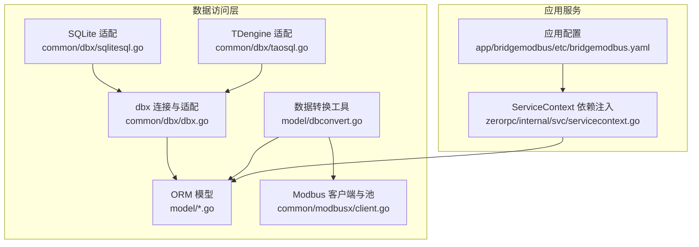
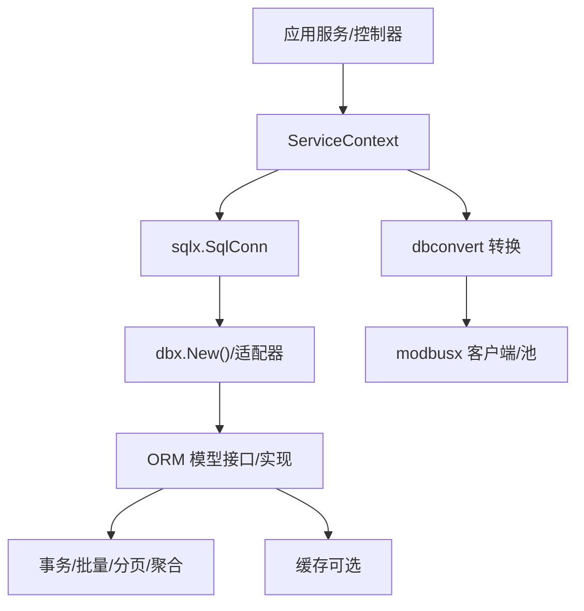
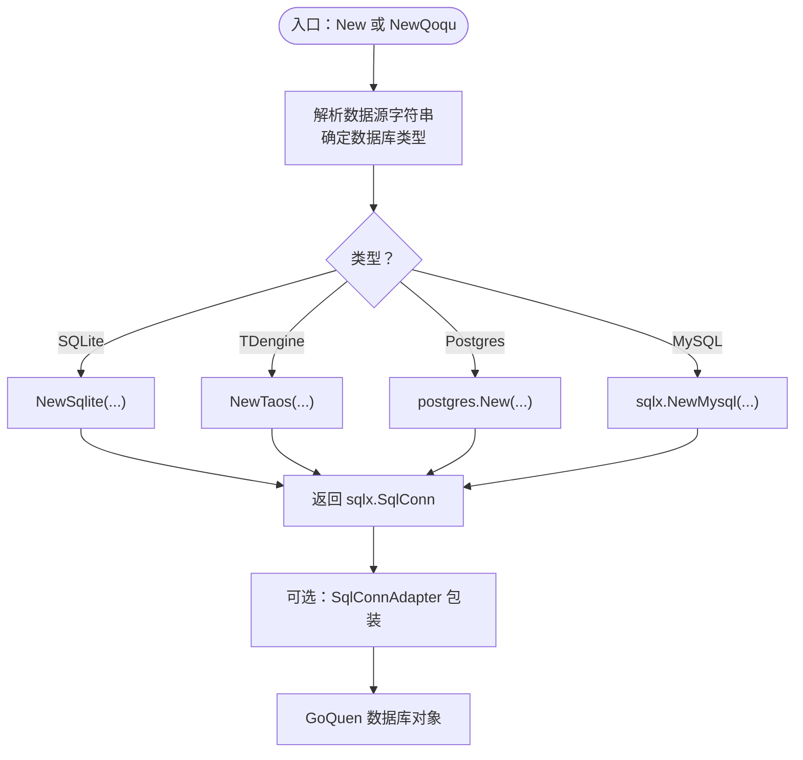
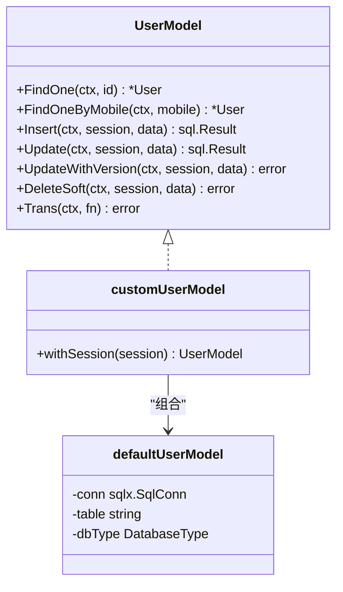
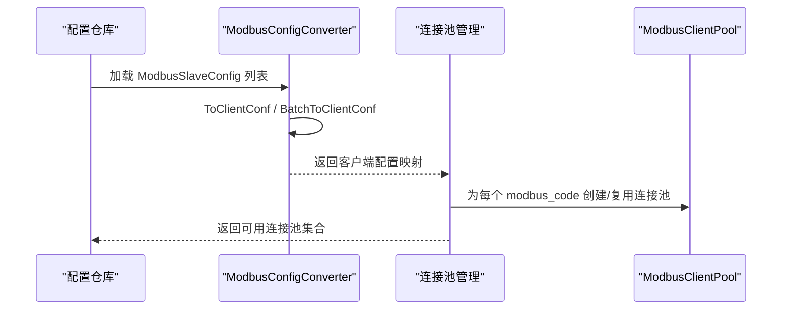
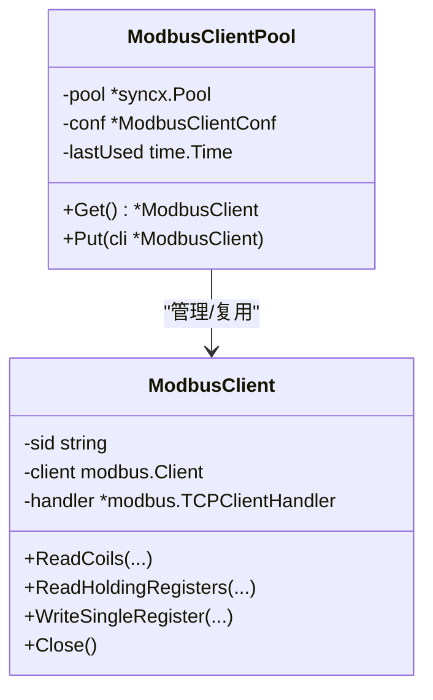
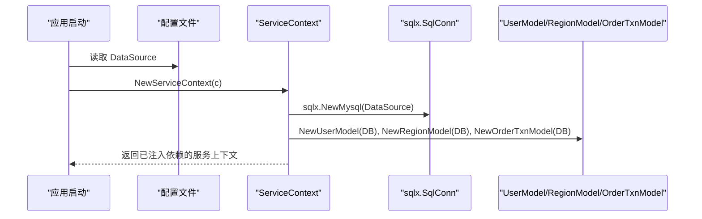
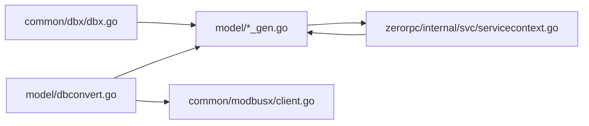

# 数据访问模式

<cite>
**本文引用的文件**
- [model/dbconvert.go](file://model/dbconvert.go)
- [model/genModel.sh](file://model/genModel.sh)
- [model/genModelSql.sh](file://model/genModelSql.sh)
- [model/genPgModel.sh](file://model/genPgModel.sh)
- [common/dbx/dbx.go](file://common/dbx/dbx.go)
- [common/dbx/sqlitesql.go](file://common/dbx/sqlitesql.go)
- [common/dbx/taossql.go](file://common/dbx/taossql.go)
- [model/modbusslaveconfigmodel.go](file://model/modbusslaveconfigmodel.go)
- [model/modbusslaveconfigmodel_gen.go](file://model/modbusslaveconfigmodel_gen.go)
- [model/usermodel.go](file://model/usermodel.go)
- [model/usermodel_gen.go](file://model/usermodel_gen.go)
- [common/modbusx/client.go](file://common/modbusx/client.go)
- [zerorpc/internal/svc/servicecontext.go](file://zerorpc/internal/svc/servicecontext.go)
- [.trae/skills/zero-skills/references/database-patterns.md](file://.trae/skills/zero-skills/references/database-patterns.md)
- [app/bridgemodbus/etc/bridgemodbus.yaml](file://app/bridgemodbus/etc/bridgemodbus.yaml)
- [.trae/skills/zero-skills/best-practices/overview.md](file://.trae/skills/zero-skills/best-practices/overview.md)
</cite>

## 目录
1. [简介](#简介)
2. [项目结构](#项目结构)
3. [核心组件](#核心组件)
4. [架构总览](#架构总览)
5. [组件详解](#组件详解)
6. [依赖关系分析](#依赖关系分析)
7. [性能考量](#性能考量)
8. [故障排查指南](#故障排查指南)
9. [结论](#结论)
10. [附录](#附录)

## 简介
本技术文档围绕数据访问层的设计与实现展开，系统性阐述以下主题：
- 数据访问层设计模式与实现策略：Model-View-Controller 分离、数据映射、事务管理
- 数据库连接管理、连接池配置与并发控制
- 数据转换工具（dbconvert）的使用与转换规则
- 数据模型生成脚本（genModel.sh、genModelSql.sh、genPgModel.sh）的使用与定制
- 缓存策略、查询优化与批量操作
- 数据一致性保证、锁机制与并发冲突处理
- 测试策略、Mock 数据与集成测试方案
- 性能监控、慢查询分析与优化建议

## 项目结构
数据访问相关的关键目录与文件：
- common/dbx：数据库连接与适配层，支持 MySQL、PostgreSQL、SQLite、TDengine 等
- model：基于 goctl 生成的 ORM 模型与转换工具
- common/modbusx：Modbus 客户端与连接池封装
- 应用服务中的 ServiceContext：集中注入数据访问依赖
- 脚本：genModel.sh、genModelSql.sh、genPgModel.sh 用于自动生成模型代码
- 配置：各应用的 etc 配置文件中包含数据库连接串等

图表来源
- [common/dbx/dbx.go:1-155](file://common/dbx/dbx.go#L1-L155)
- [common/dbx/sqlitesql.go:1-13](file://common/dbx/sqlitesql.go#L1-L13)
- [common/dbx/taossql.go:1-14](file://common/dbx/taossql.go#L1-L14)
- [model/modbusslaveconfigmodel_gen.go:1-200](file://model/modbusslaveconfigmodel_gen.go#L1-L200)
- [model/dbconvert.go:1-56](file://model/dbconvert.go#L1-L56)
- [common/modbusx/client.go:1-200](file://common/modbusx/client.go#L1-L200)
- [zerorpc/internal/svc/servicecontext.go:1-102](file://zerorpc/internal/svc/servicecontext.go#L1-L102)
- [app/bridgemodbus/etc/bridgemodbus.yaml:1-26](file://app/bridgemodbus/etc/bridgemodbus.yaml#L1-L26)

章节来源
- [common/dbx/dbx.go:1-155](file://common/dbx/dbx.go#L1-L155)
- [model/modbusslaveconfigmodel_gen.go:1-200](file://model/modbusslaveconfigmodel_gen.go#L1-L200)
- [model/dbconvert.go:1-56](file://model/dbconvert.go#L1-L56)
- [common/modbusx/client.go:1-200](file://common/modbusx/client.go#L1-L200)
- [zerorpc/internal/svc/servicecontext.go:1-102](file://zerorpc/internal/svc/servicecontext.go#L1-L102)
- [app/bridgemodbus/etc/bridgemodbus.yaml:1-26](file://app/bridgemodbus/etc/bridgemodbus.yaml#L1-L26)

## 核心组件
- 数据库连接与适配（dbx）
  - 自动识别数据库类型并创建连接，支持 MySQL、PostgreSQL、SQLite、TDengine
  - 提供 GoQuen 查询构建器适配与日志桥接
- ORM 模型（model）
  - 基于 goctl 生成的模型接口与默认实现，统一 CRUD、分页、聚合、软删除、乐观锁更新
- 数据转换工具（dbconvert）
  - 将数据库模型转换为 Modbus 客户端配置，支持批量转换
- Modbus 客户端与连接池（modbusx）
  - 封装 modbus.Client，提供连接池、TLS、超时与恢复策略
- 服务上下文（ServiceContext）
  - 在应用启动时注入数据库连接与模型实例，遵循 MVC 分离

章节来源
- [common/dbx/dbx.go:1-155](file://common/dbx/dbx.go#L1-L155)
- [model/modbusslaveconfigmodel_gen.go:1-200](file://model/modbusslaveconfigmodel_gen.go#L1-L200)
- [model/dbconvert.go:1-56](file://model/dbconvert.go#L1-L56)
- [common/modbusx/client.go:1-200](file://common/modbusx/client.go#L1-L200)
- [zerorpc/internal/svc/servicecontext.go:1-102](file://zerorpc/internal/svc/servicecontext.go#L1-L102)

## 架构总览
数据访问层采用“适配层 + ORM 模型 + 转换工具 + 连接池”的分层设计，配合应用服务的 ServiceContext 实现依赖注入与生命周期管理。

图表来源
- [zerorpc/internal/svc/servicecontext.go:19-100](file://zerorpc/internal/svc/servicecontext.go#L19-L100)
- [common/dbx/dbx.go:46-64](file://common/dbx/dbx.go#L46-L64)
- [model/modbusslaveconfigmodel_gen.go:24-50](file://model/modbusslaveconfigmodel_gen.go#L24-L50)
- [model/dbconvert.go:5-56](file://model/dbconvert.go#L5-L56)
- [common/modbusx/client.go:146-191](file://common/modbusx/client.go#L146-L191)

## 组件详解

### 数据库连接与适配（dbx）
- 自动识别数据库类型：通过数据源字符串解析，支持 SQLite、TDengine、MySQL、PostgreSQL
- 统一连接创建：根据类型选择相应 New 方法；提供适配器包装以兼容 GoQuen
- 查询日志：桥接到 logx，便于统一日志输出

图表来源
- [common/dbx/dbx.go:31-64](file://common/dbx/dbx.go#L31-L64)
- [common/dbx/dbx.go:112-138](file://common/dbx/dbx.go#L112-L138)
- [common/dbx/sqlitesql.go:10-12](file://common/dbx/sqlitesql.go#L10-L12)
- [common/dbx/taossql.go:11-13](file://common/dbx/taossql.go#L11-L13)

章节来源
- [common/dbx/dbx.go:1-155](file://common/dbx/dbx.go#L1-L155)
- [common/dbx/sqlitesql.go:1-13](file://common/dbx/sqlitesql.go#L1-L13)
- [common/dbx/taossql.go:1-14](file://common/dbx/taossql.go#L1-L14)

### ORM 模型与事务管理
- 接口与实现：每个模型提供 defaultXxxModel 与 customXxxModel，custom 模型通过 withSession 支持事务会话
- 事务支持：Trans(ctx, fn) 在单连接上执行多条 SQL，确保原子性
- 并发控制：乐观锁 UpdateWithVersion 基于 version 字段防并发覆盖
- 软删除：DeleteSoft 通过标记 del_state 与 delete_time 实现
- 分页与聚合：提供分页、求和、计数等常用能力

图表来源
- [model/usermodel.go:7-32](file://model/usermodel.go#L7-L32)
- [model/usermodel_gen.go:28-77](file://model/usermodel_gen.go#L28-L77)
- [model/usermodel_gen.go:137-164](file://model/usermodel_gen.go#L137-L164)
- [model/usermodel_gen.go:166-173](file://model/usermodel_gen.go#L166-L173)

章节来源
- [model/usermodel.go:1-32](file://model/usermodel.go#L1-L32)
- [model/usermodel_gen.go:1-200](file://model/usermodel_gen.go#L1-L200)
- [.trae/skills/zero-skills/references/database-patterns.md:271-365](file://.trae/skills/zero-skills/references/database-patterns.md#L271-L365)

### 数据转换工具（dbconvert）
- 功能：将数据库模型转换为 Modbus 客户端配置，支持单个与批量转换
- 规则：基础字段映射、TLS 开关与证书路径映射、批量按 modbus_code 建立映射表
- 使用场景：从配置表加载后直接初始化连接池

图表来源
- [model/dbconvert.go:13-56](file://model/dbconvert.go#L13-L56)
- [common/modbusx/client.go:146-191](file://common/modbusx/client.go#L146-L191)

章节来源
- [model/dbconvert.go:1-56](file://model/dbconvert.go#L1-L56)
- [common/modbusx/client.go:1-200](file://common/modbusx/client.go#L1-L200)

### Modbus 客户端与连接池
- 客户端封装：对 modbus.Client 进行薄封装，暴露常用功能码方法
- TLS 支持：可按需加载证书与 CA，建立安全连接
- 连接池：基于 syncx.Pool 实现，支持最大空闲时间、自动回收
- 并发控制：Get/Put 生命周期管理，避免资源泄露

图表来源
- [common/modbusx/client.go:20-143](file://common/modbusx/client.go#L20-L143)
- [common/modbusx/client.go:145-191](file://common/modbusx/client.go#L145-L191)

章节来源
- [common/modbusx/client.go:1-200](file://common/modbusx/client.go#L1-L200)

### 服务上下文与依赖注入
- ServiceContext 在应用启动时创建 Redis、RPC 客户端、Alarm 客户端等，并注入 UserModel、RegionModel、OrderTxnModel 等
- 数据库连接通过 sqlx.NewMysql 从配置文件的 DataSource 获取

图表来源
- [zerorpc/internal/svc/servicecontext.go:35-100](file://zerorpc/internal/svc/servicecontext.go#L35-L100)
- [app/bridgemodbus/etc/bridgemodbus.yaml:20-22](file://app/bridgemodbus/etc/bridgemodbus.yaml#L20-L22)

章节来源
- [zerorpc/internal/svc/servicecontext.go:1-102](file://zerorpc/internal/svc/servicecontext.go#L1-L102)
- [app/bridgemodbus/etc/bridgemodbus.yaml:1-26](file://app/bridgemodbus/etc/bridgemodbus.yaml#L1-L26)

### 数据模型生成脚本
- genModel.sh：基于 goctl 生成 MySQL 模型，支持指定库与表、禁用缓存、GoZero 风格
- genModelSql.sh：基于 DDL 文件生成模型
- genPgModel.sh：基于 goctl 生成 PostgreSQL 模型，支持 schema、禁用缓存、GoZero 风格

章节来源
- [model/genModel.sh:1-25](file://model/genModel.sh#L1-L25)
- [model/genModelSql.sh:1-6](file://model/genModelSql.sh#L1-L6)
- [model/genPgModel.sh:1-27](file://model/genPgModel.sh#L1-L27)

## 依赖关系分析
- dbx 作为统一适配层，向上提供 sqlx.SqlConn 与 GoQuen 适配
- 模型层依赖 sqlx.SqlConn，提供事务、分页、聚合等能力
- 转换工具依赖模型与 modbusx 配置结构
- 应用服务通过 ServiceContext 注入模型与连接

图表来源
- [common/dbx/dbx.go:1-155](file://common/dbx/dbx.go#L1-L155)
- [model/modbusslaveconfigmodel_gen.go:1-200](file://model/modbusslaveconfigmodel_gen.go#L1-L200)
- [model/dbconvert.go:1-56](file://model/dbconvert.go#L1-L56)
- [common/modbusx/client.go:1-200](file://common/modbusx/client.go#L1-L200)
- [zerorpc/internal/svc/servicecontext.go:1-102](file://zerorpc/internal/svc/servicecontext.go#L1-L102)

章节来源
- [common/dbx/dbx.go:1-155](file://common/dbx/dbx.go#L1-L155)
- [model/modbusslaveconfigmodel_gen.go:1-200](file://model/modbusslaveconfigmodel_gen.go#L1-L200)
- [model/dbconvert.go:1-56](file://model/dbconvert.go#L1-L56)
- [common/modbusx/client.go:1-200](file://common/modbusx/client.go#L1-L200)
- [zerorpc/internal/svc/servicecontext.go:1-102](file://zerorpc/internal/svc/servicecontext.go#L1-L102)

## 性能考量
- 连接池配置
  - 默认池参数：最大空闲连接与打开连接数、连接最大生命周期
  - 可在 ServiceContext 中获取底层 *sql.DB 并自定义池参数
- 查询优化
  - 使用 Squirrel 构建器生成 SQL，避免手写拼接
  - 合理使用索引字段进行过滤与排序，避免全表扫描
- 批量操作
  - 优先使用 TransCtx 在单事务内批量执行插入/更新
  - 对于高吞吐场景，结合连接池与并发控制
- 缓存策略
  - 可结合缓存组件进行热点数据读取加速
  - 注意缓存与数据库的一致性，必要时采用写穿透或失效策略

章节来源
- [.trae/skills/zero-skills/references/database-patterns.md:448-480](file://.trae/skills/zero-skills/references/database-patterns.md#L448-L480)
- [model/modbusslaveconfigmodel_gen.go:32-50](file://model/modbusslaveconfigmodel_gen.go#L32-L50)

## 故障排查指南
- 事务失败
  - 检查 TransCtx 回调内的错误传播与回滚条件
  - 关注乐观锁版本冲突（UpdateWithVersion RowsAffected 为 0）
- 连接问题
  - 核对 DataSource 配置与网络可达性
  - 检查连接池参数与最大连接数限制
- Modbus 连接池
  - 确认 AddPool 参数校验（modbusCode、conf、poolSize）
  - 使用 Get/Put 正确归还资源，避免泄漏
- 日志与监控
  - dbx 的 GoQuen 日志桥接到 logx，便于定位 SQL 与耗时
  - 结合应用日志与慢查询分析工具定位瓶颈

章节来源
- [.trae/skills/zero-skills/references/database-patterns.md:271-365](file://.trae/skills/zero-skills/references/database-patterns.md#L271-L365)
- [common/dbx/dbx.go:140-146](file://common/dbx/dbx.go#L140-L146)
- [common/modbusx/client.go:146-191](file://common/modbusx/client.go#L146-L191)

## 结论
本数据访问层通过“适配层 + ORM 模型 + 转换工具 + 连接池”的架构，实现了对多种数据库与外部协议（Modbus）的统一接入。配合事务、乐观锁、软删除与分页聚合等能力，满足高并发与一致性要求。借助脚本化模型生成与标准化配置，提升开发效率与维护性。

## 附录
- 测试策略
  - 单元测试：Mock 模型接口，验证业务逻辑
  - 集成测试：使用真实数据库连接，验证 CRUD、事务与分页
  - 参考最佳实践中的示例与断言方式
- 性能监控与慢查询
  - 结合应用日志与数据库慢查询日志进行分析
  - 通过连接池参数与批量操作策略持续优化

章节来源
- [.trae/skills/zero-skills/best-practices/overview.md:357-424](file://.trae/skills/zero-skills/best-practices/overview.md#L357-L424)