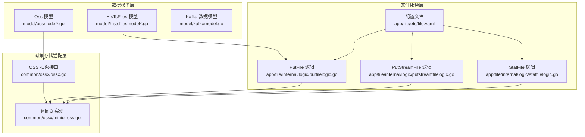
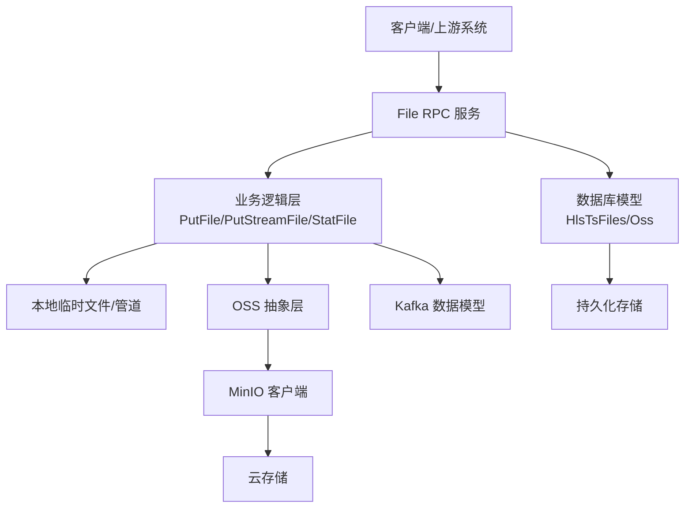
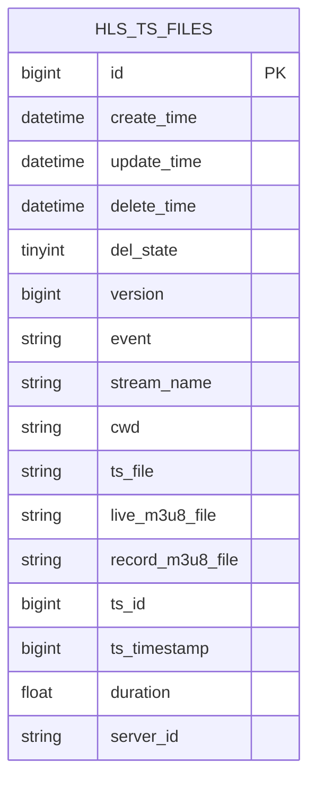
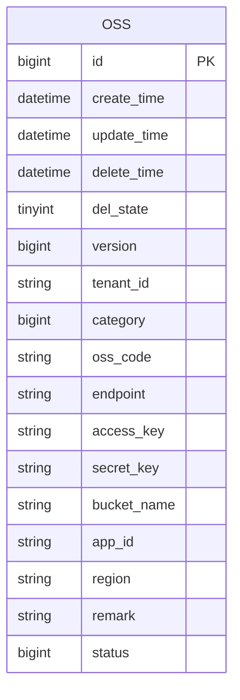
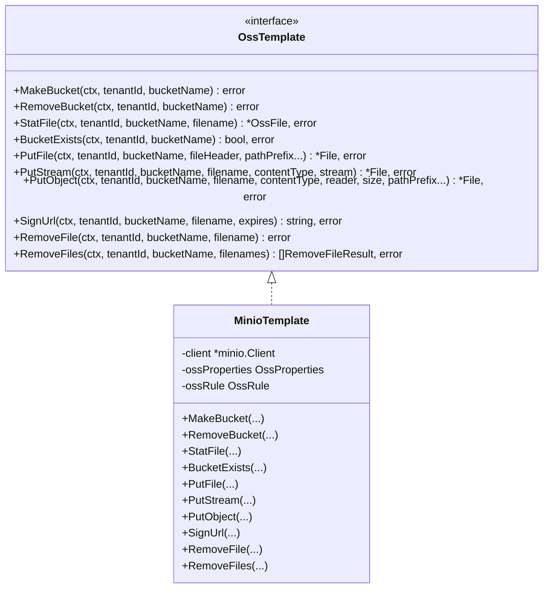
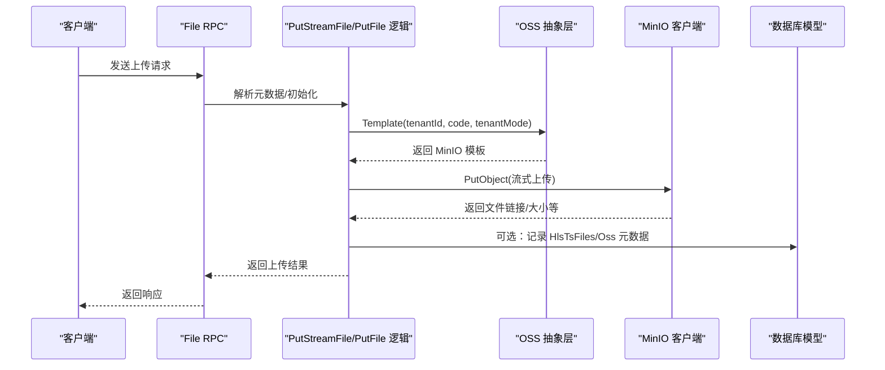
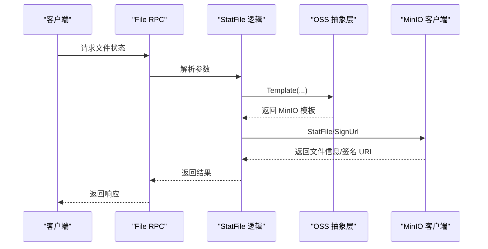
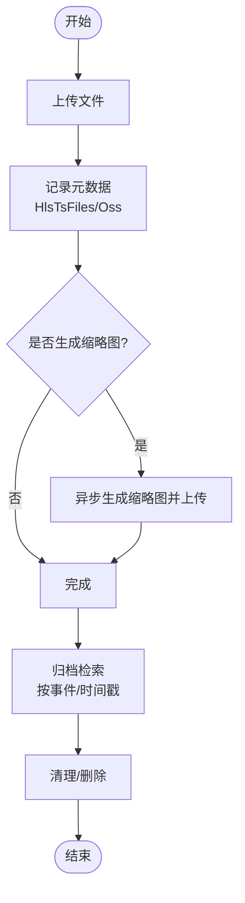
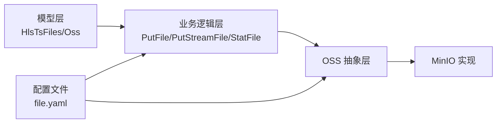

# 文件存储数据模型

<cite>
**本文引用的文件**
- [hlstsfilesmodel.go](file://model/hlstsfilesmodel.go)
- [hlstsfilesmodel_gen.go](file://model/hlstsfilesmodel_gen.go)
- [ossmodel.go](file://model/ossmodel.go)
- [ossmodel_gen.go](file://model/ossmodel_gen.go)
- [kafkamodel.go](file://model/kafkamodel.go)
- [ossx.go](file://common/ossx/ossx.go)
- [minio_oss.go](file://common/ossx/minio_oss.go)
- [putfilelogic.go](file://app/file/internal/logic/putfilelogic.go)
- [putstreamfilelogic.go](file://app/file/internal/logic/putstreamfilelogic.go)
- [statfilelogic.go](file://app/file/internal/logic/statfilelogic.go)
- [file.yaml](file://app/file/etc/file.yaml)
- [ossconfig.go](file://common/ossx/osssconfig/ossconfig.go)
- [file.sql](file://model/sql/file.sql)
</cite>

## 目录
1. [简介](#简介)
2. [项目结构](#项目结构)
3. [核心组件](#核心组件)
4. [架构总览](#架构总览)
5. [详细组件分析](#详细组件分析)
6. [依赖分析](#依赖分析)
7. [性能考虑](#性能考虑)
8. [故障排查指南](#故障排查指南)
9. [结论](#结论)
10. [附录](#附录)

## 简介
本技术文档聚焦 Zero-Service 的文件存储数据模型与实现，围绕以下目标展开：
- 深入解析直播文件管理模型 HlsTsFiles 的设计与用途
- 详述对象存储配置模型 Oss 的数据结构与租户隔离策略
- 说明消息队列相关模型 KafkaModel 的数据结构与业务映射
- 阐述文件存储的业务场景与数据需求：视频文件元数据管理、对象存储配置信息、消息队列连接参数
- 构建文件存储的架构设计：本地存储、云存储与消息队列的集成策略
- 解释文件状态管理机制：上传、转码、归档与清理的生命周期
- 提供性能优化设计：分片存储、并行上传与缓存策略
- 给出使用示例：文件上传、下载与状态查询等常见操作
- 提供完整的文件存储流程图与数据模型关系图

## 项目结构
文件存储能力主要分布在以下模块：
- 数据模型层：model 目录下的 HlsTsFiles 与 Oss 模型及其代码生成文件
- 对象存储适配层：common/ossx 下的 OSS 抽象与 MinIO 实现
- 文件服务层：app/file 下的 RPC 接口与业务逻辑
- 配置与脚本：app/file/etc/file.yaml 与 model/sql/file.sql

**图表来源**
- [hlstsfilesmodel_gen.go:54-71](file://model/hlstsfilesmodel_gen.go#L54-L71)
- [ossmodel_gen.go:63-81](file://model/ossmodel_gen.go#L63-L81)
- [ossx.go:28-39](file://common/ossx/ossx.go#L28-L39)
- [minio_oss.go:20-24](file://common/ossx/minio_oss.go#L20-L24)
- [putfilelogic.go:33-77](file://app/file/internal/logic/putfilelogic.go#L33-L77)
- [putstreamfilelogic.go:43-286](file://app/file/internal/logic/putstreamfilelogic.go#L43-L286)
- [statfilelogic.go:29-58](file://app/file/internal/logic/statfilelogic.go#L29-L58)
- [file.yaml:17-20](file://app/file/etc/file.yaml#L17-L20)

**章节来源**
- [file.yaml:1-23](file://app/file/etc/file.yaml#L1-L23)
- [file.sql:1-28](file://model/sql/file.sql#L1-L28)

## 核心组件
- HlsTsFiles 模型：用于记录 HLS 直播 TS 文件的元数据，包括事件状态、流名称、工作目录、TS 文件路径、m3u8 文件路径、TS ID、时间戳、时长与服务器节点 ID 等字段，支持软删除与乐观锁版本控制。
- Oss 模型：用于存储对象存储配置，包含租户 ID、分类（MinIO/Qiniu/Ali/Tencent）、资源编号、Endpoint、AccessKey、SecretKey、BucketName、AppId、Region、备注与状态等字段。
- KafkaModel：定义了终端绑定、事件数据、终端数据、报警数据等结构体，用于与消息队列交互的数据载体。

**章节来源**
- [hlstsfilesmodel_gen.go:54-71](file://model/hlstsfilesmodel_gen.go#L54-L71)
- [ossmodel_gen.go:63-81](file://model/ossmodel_gen.go#L63-L81)
- [kafkamodel.go:3-185](file://model/kafkamodel.go#L3-L185)

## 架构总览
文件存储架构由三层组成：
- 本地存储：通过 PutStreamFile 逻辑将数据先写入本地临时文件，再并发上传至对象存储；同时计算 MD5 并按需生成缩略图。
- 云存储：OSS 抽象层根据租户与资源编号动态选择合适的模板（当前实现为 MinIO），统一提供创建存储桶、上传文件、签名 URL、删除文件等能力。
- 消息队列：KafkaModel 定义了与外部系统交互的数据结构，便于后续扩展消息推送与事件处理。

**图表来源**
- [putstreamfilelogic.go:43-286](file://app/file/internal/logic/putstreamfilelogic.go#L43-L286)
- [ossx.go:28-39](file://common/ossx/ossx.go#L28-L39)
- [minio_oss.go:20-24](file://common/ossx/minio_oss.go#L20-L24)
- [hlstsfilesmodel_gen.go:54-71](file://model/hlstsfilesmodel_gen.go#L54-L71)
- [ossmodel_gen.go:63-81](file://model/ossmodel_gen.go#L63-L81)
- [kafkamodel.go:3-185](file://model/kafkamodel.go#L3-L185)

## 详细组件分析

### HlsTsFiles 模型
HlsTsFiles 用于记录 HLS 直播 TS 文件的生命周期关键信息，支持：
- 事件状态：open/close，表示 TS 文件创建与写入完成
- 流名称与工作目录：便于定位与检索
- TS 文件路径与 m3u8 文件路径：直播与录制的索引文件
- TS ID 与时间戳：线性递增 ID 与时间戳，便于区间查询
- 时长：事件为 close 时有效
- 服务器节点 ID：用于分布式节点追踪

**图表来源**
- [hlstsfilesmodel_gen.go:54-71](file://model/hlstsfilesmodel_gen.go#L54-L71)

**章节来源**
- [hlstsfilesmodel.go:1-32](file://model/hlstsfilesmodel.go#L1-L32)
- [hlstsfilesmodel_gen.go:54-71](file://model/hlstsfilesmodel_gen.go#L54-L71)

### Oss 模型
Oss 模型用于存储对象存储配置，支持：
- 租户隔离：tenant_id + oss_code 唯一约束
- 存储提供商分类：MinIO/Qiniu/Ali/Tencent
- 连接参数：Endpoint、AccessKey、SecretKey、BucketName、AppId、Region
- 状态控制：启用/禁用
- 版本控制与软删除：配合乐观锁与逻辑删除

**图表来源**
- [ossmodel_gen.go:63-81](file://model/ossmodel_gen.go#L63-L81)

**章节来源**
- [ossmodel.go:1-32](file://model/ossmodel.go#L1-L32)
- [ossmodel_gen.go:63-81](file://model/ossmodel_gen.go#L63-L81)
- [file.sql:1-28](file://model/sql/file.sql#L1-L28)

### KafkaModel 数据结构
KafkaModel 定义了与外部系统交互的数据载体，包括：
- 终端绑定：绑定/解绑动作、终端 ID、员工身份证号、跟踪对象信息、操作时间
- 事件数据：事件 ID、标题、类型、服务端/终端时间、终端信息、位置
- 终端数据：终端信息、定位时间、位置、建筑信息、设备状态
- 报警数据：报警 ID、名称、编号、类型、等级、终端列表、跟踪对象、位置围栏、起止时间与持续时长、状态

这些结构体为后续与消息队列集成提供数据契约。

**章节来源**
- [kafkamodel.go:3-185](file://model/kafkamodel.go#L3-L185)

### OSS 抽象与 MinIO 实现
OSS 抽象层通过 OssTemplate 接口统一对象存储能力，当前实现支持 MinIO：
- 创建/删除存储桶
- 文件统计、上传（文件/流/Reader）、签名 URL、删除单个/批量文件
- 路径规则：支持租户模式与自定义路径前缀
- 模板池：基于租户维度缓存模板与配置，避免重复初始化

**图表来源**
- [ossx.go:28-39](file://common/ossx/ossx.go#L28-L39)
- [minio_oss.go:20-24](file://common/ossx/minio_oss.go#L20-L24)

**章节来源**
- [ossx.go:28-152](file://common/ossx/ossx.go#L28-L152)
- [minio_oss.go:20-243](file://common/ossx/minio_oss.go#L20-L243)

### 文件上传流程（PutFile 与 PutStreamFile）
- PutFile：从本地路径读取文件，探测内容类型，调用 OSS 抽象上传，支持图片 EXIF 元数据提取。
- PutStreamFile：基于 gRPC 流式传输，使用管道与临时文件实现边收边传，支持 MD5 计算、缩略图异步生成与进度日志。

**图表来源**
- [putfilelogic.go:33-77](file://app/file/internal/logic/putfilelogic.go#L33-L77)
- [putstreamfilelogic.go:43-286](file://app/file/internal/logic/putstreamfilelogic.go#L43-L286)
- [ossx.go:109-151](file://common/ossx/ossx.go#L109-L151)
- [minio_oss.go:124-148](file://common/ossx/minio_oss.go#L124-L148)

**章节来源**
- [putfilelogic.go:33-77](file://app/file/internal/logic/putfilelogic.go#L33-L77)
- [putstreamfilelogic.go:43-286](file://app/file/internal/logic/putstreamfilelogic.go#L43-L286)

### 文件状态查询（StatFile）
- 通过 OSS 抽象层查询对象信息，支持生成带过期时间的签名 URL，便于安全下载。

**图表来源**
- [statfilelogic.go:29-58](file://app/file/internal/logic/statfilelogic.go#L29-L58)
- [ossx.go:109-151](file://common/ossx/ossx.go#L109-L151)
- [minio_oss.go:40-162](file://common/ossx/minio_oss.go#L40-L162)

**章节来源**
- [statfilelogic.go:29-58](file://app/file/internal/logic/statfilelogic.go#L29-L58)

### 文件状态管理机制
- 上传：记录文件元数据，生成访问链接与可选缩略图
- 转码：通过异步任务生成缩略图并上传
- 归档：结合 HlsTsFiles 的事件状态与时间戳进行归档检索
- 清理：支持软删除与批量删除，结合 OSS 抽象层的删除接口

[此图为概念流程图，不直接映射具体源码文件]

## 依赖分析
- 模型依赖：HlsTsFiles 与 Oss 模型分别由各自的 defaultHlsTsFilesModel/defaultOssModel 提供 CRUD 与分页查询能力
- 服务依赖：File RPC 服务依赖业务逻辑层，业务逻辑层依赖 OSS 抽象层与数据库模型
- 配置依赖：OSS 租户模式由配置文件控制，模板池按租户维度缓存

**图表来源**
- [hlstsfilesmodel_gen.go:28-46](file://model/hlstsfilesmodel_gen.go#L28-L46)
- [ossmodel_gen.go:28-55](file://model/ossmodel_gen.go#L28-L55)
- [putstreamfilelogic.go:123-136](file://app/file/internal/logic/putstreamfilelogic.go#L123-L136)
- [ossx.go:109-151](file://common/ossx/ossx.go#L109-L151)
- [file.yaml:17-20](file://app/file/etc/file.yaml#L17-L20)

**章节来源**
- [ossconfig.go:4-7](file://common/ossx/osssconfig/ossconfig.go#L4-L7)
- [file.yaml:17-20](file://app/file/etc/file.yaml#L17-L20)

## 性能考虑
- 分片存储：通过流式上传与管道机制，避免一次性加载大文件到内存
- 并行上传：利用 goroutine 与管道并发写入 OSS，提升吞吐
- 缓存策略：模板池按租户维度缓存 OSS 配置与客户端，减少重复初始化
- 进度日志：对大文件上传进行分段日志记录，便于监控与问题定位
- 异步缩略图：生成缩略图采用异步任务，不影响主流程

**章节来源**
- [putstreamfilelogic.go:43-286](file://app/file/internal/logic/putstreamfilelogic.go#L43-L286)
- [ossx.go:109-151](file://common/ossx/ossx.go#L109-L151)

## 故障排查指南
- OSS 客户端为空：检查 Endpoint、AccessKey、SecretKey 配置是否正确
- 上传失败：查看 MinIO 客户端初始化错误与 PutObject 返回的错误
- 签名 URL 失败：确认存储桶存在与文件存在，以及过期时间设置
- 缩略图生成失败：检查临时文件路径与异步任务调度器状态

**章节来源**
- [minio_oss.go:237-242](file://common/ossx/minio_oss.go#L237-L242)
- [putstreamfilelogic.go:243-265](file://app/file/internal/logic/putstreamfilelogic.go#L243-L265)

## 结论
本文档系统梳理了 Zero-Service 的文件存储数据模型与实现，覆盖了直播文件管理、对象存储配置与消息队列数据结构，并给出了架构设计、状态管理机制、性能优化与使用示例。通过抽象层与模板池的设计，系统具备良好的扩展性与可维护性，能够支撑多租户与多云存储提供商的复杂场景。

## 附录
- 使用示例（路径指引）：
  - 文件上传：[PutFile 请求:1684-1738](file://app/file/file/file.pb.go#L1684-L1738)，[PutFile 逻辑:33-77](file://app/file/internal/logic/putfilelogic.go#L33-L77)
  - 流式上传：[PutStreamFile 逻辑:43-286](file://app/file/internal/logic/putstreamfilelogic.go#L43-L286)
  - 文件状态查询：[StatFile 请求:150-158](file://app/file/file/file_grpc.pb.go#L150-L158)，[StatFile 逻辑:29-58](file://app/file/internal/logic/statfilelogic.go#L29-L58)
- 配置参考：
  - [file.yaml 中的 OSS 租户模式:17-20](file://app/file/etc/file.yaml#L17-L20)
  - [Oss 配置结构:4-7](file://common/ossx/osssconfig/ossconfig.go#L4-L7)
- 数据库脚本：
  - [Oss 表结构与初始化数据:1-28](file://model/sql/file.sql#L1-L28)