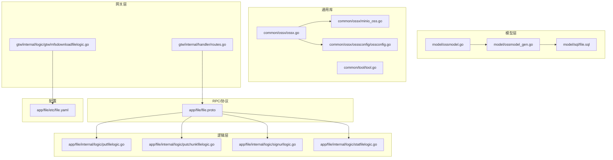
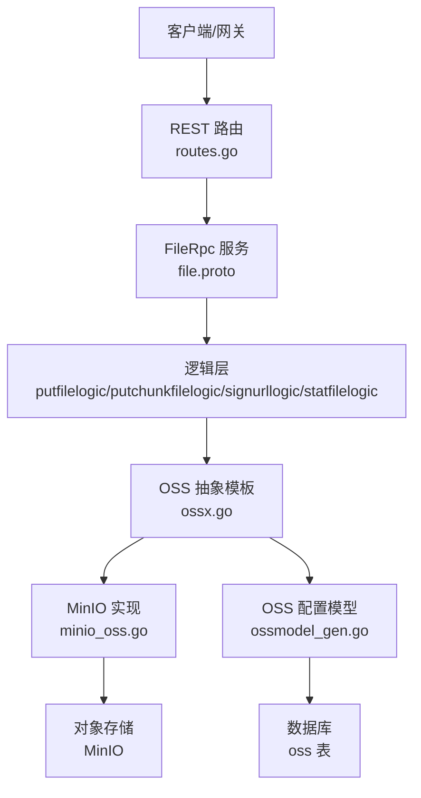
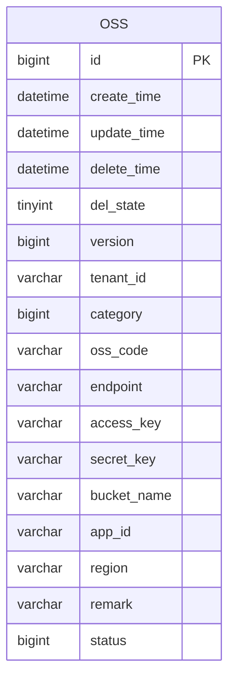
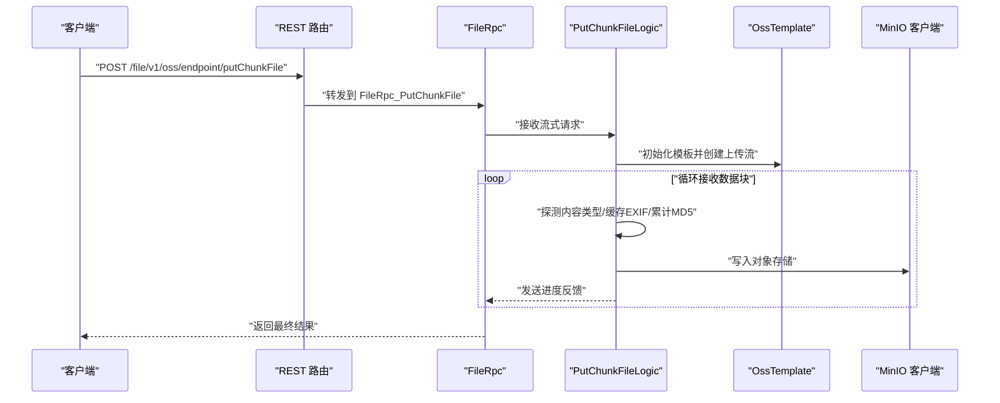
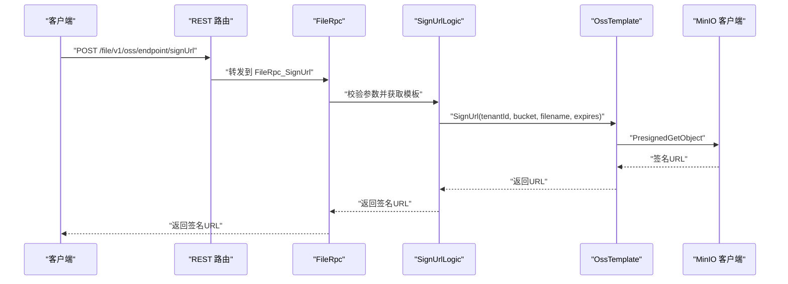
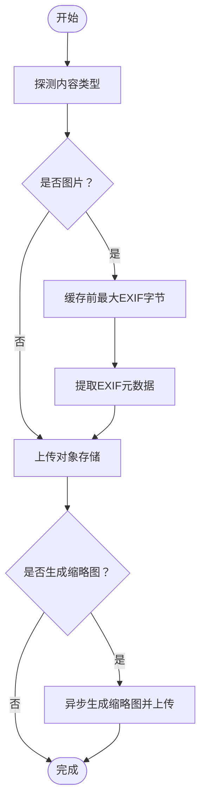
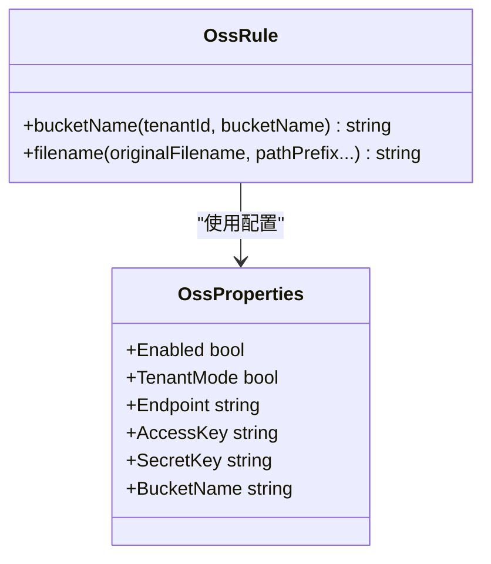
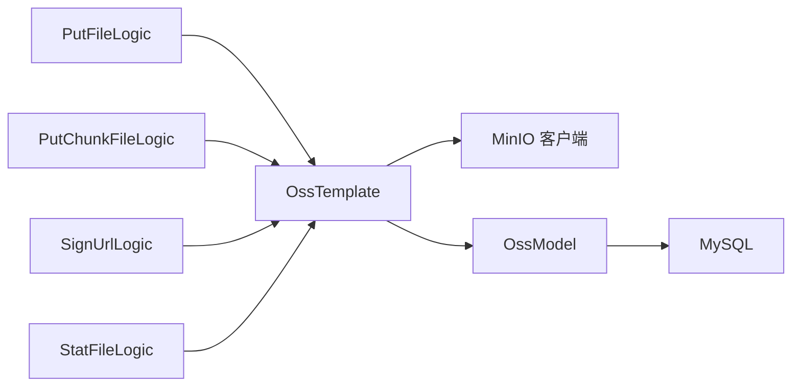

# 文件存储模型

<cite>
**本文引用的文件**
- [ossmodel.go](file://model/ossmodel.go)
- [ossmodel_gen.go](file://model/ossmodel_gen.go)
- [ossconfig.go](file://common/ossx/osssconfig/ossconfig.go)
- [ossx.go](file://common/ossx/ossx.go)
- [minio_oss.go](file://common/ossx/minio_oss.go)
- [file.proto](file://app/file/file.proto)
- [putfilelogic.go](file://app/file/internal/logic/putfilelogic.go)
- [putchunkfilelogic.go](file://app/file/internal/logic/putchunkfilelogic.go)
- [signurllogic.go](file://app/file/internal/logic/signurllogic.go)
- [statfilelogic.go](file://app/file/internal/logic/statfilelogic.go)
- [file.yaml](file://app/file/etc/file.yaml)
- [routes.go](file://gtw/internal/handler/routes.go)
- [mfsdownloadfilelogic.go](file://gtw/internal/logic/gtw/mfsdownloadfilelogic.go)
- [file.sql](file://model/sql/file.sql)
- [tool.go](file://common/tool/tool.go)
</cite>

## 目录
1. [简介](#简介)
2. [项目结构](#项目结构)
3. [核心组件](#核心组件)
4. [架构总览](#架构总览)
5. [详细组件分析](#详细组件分析)
6. [依赖分析](#依赖分析)
7. [性能考虑](#性能考虑)
8. [故障排查指南](#故障排查指南)
9. [结论](#结论)
10. [附录](#附录)

## 简介
本文件围绕“文件存储模型（OssFile）”展开，系统性梳理该模块在零服务中的设计与实现，覆盖以下方面：
- 对象存储集成：对接 MinIO 等存储系统，抽象统一的模板接口，支持租户隔离与多存储源管理。
- 文件模型字段与业务规则：明确文件链接、存储路径、大小、内容类型、上传时间等字段及约束。
- 上传流程：本地文件上传、流式上传（单向/双向）、分片上传、并发与断点续传能力边界。
- 下载与预览：签名 URL 生成、访问有效期控制、前端直连与网关代理下载。
- 元数据与标签：图像 EXIF 元数据抽取、缩略图生成与异步任务调度。
- 安全与访问控制：租户模式、签名 URL 过期控制、最小权限原则。
- 生命周期与成本优化：基于对象存储的生命周期策略与成本控制建议。

## 项目结构
围绕文件存储的关键目录与文件如下：
- 模型层：定义 OSS 配置表结构与查询模型，支撑租户维度的存储源选择。
- 通用库：封装 OSS 抽象模板、MinIO 实现、规则与工具函数。
- RPC 层：定义文件服务协议，暴露上传、签名、统计、删除等能力。
- 逻辑层：各业务逻辑封装上传、签名、统计、分片上传等操作。
- 网关层：REST 路由映射到 RPC 方法，提供 HTTP 入口。
- 配置与数据库：服务配置与 OSS 表结构定义。

**图表来源**
- [ossmodel.go:1-32](file://model/ossmodel.go#L1-L32)
- [ossmodel_gen.go:63-81](file://model/ossmodel_gen.go#L63-L81)
- [ossconfig.go:1-8](file://common/ossx/osssconfig/ossconfig.go#L1-L8)
- [ossx.go:28-152](file://common/ossx/ossx.go#L28-L152)
- [minio_oss.go:20-243](file://common/ossx/minio_oss.go#L20-L243)
- [file.proto:17-67](file://app/file/file.proto#L17-L67)
- [putfilelogic.go:33-77](file://app/file/internal/logic/putfilelogic.go#L33-L77)
- [putchunkfilelogic.go:38-269](file://app/file/internal/logic/putchunkfilelogic.go#L38-L269)
- [signurllogic.go:29-60](file://app/file/internal/logic/signurllogic.go#L29-L60)
- [statfilelogic.go:29-58](file://app/file/internal/logic/statfilelogic.go#L29-L58)
- [routes.go:39-74](file://gtw/internal/handler/routes.go#L39-L74)
- [mfsdownloadfilelogic.go:33-53](file://gtw/internal/logic/gtw/mfsdownloadfilelogic.go#L33-L53)
- [file.yaml:17-19](file://app/file/etc/file.yaml#L17-L19)
- [file.sql:1-22](file://model/sql/file.sql#L1-L22)

**章节来源**
- [ossmodel.go:1-32](file://model/ossmodel.go#L1-L32)
- [ossmodel_gen.go:63-81](file://model/ossmodel_gen.go#L63-L81)
- [ossx.go:1-152](file://common/ossx/ossx.go#L1-L152)
- [minio_oss.go:1-243](file://common/ossx/minio_oss.go#L1-L243)
- [file.proto:1-287](file://app/file/file.proto#L1-L287)
- [putfilelogic.go:1-78](file://app/file/internal/logic/putfilelogic.go#L1-L78)
- [putchunkfilelogic.go:1-270](file://app/file/internal/logic/putchunkfilelogic.go#L1-L270)
- [signurllogic.go:1-61](file://app/file/internal/logic/signurllogic.go#L1-L61)
- [statfilelogic.go:1-59](file://app/file/internal/logic/statfilelogic.go#L1-L59)
- [routes.go:39-98](file://gtw/internal/handler/routes.go#L39-L98)
- [mfsdownloadfilelogic.go:1-54](file://gtw/internal/logic/gtw/mfsdownloadfilelogic.go#L1-L54)
- [file.yaml:1-23](file://app/file/etc/file.yaml#L1-L23)
- [file.sql:1-28](file://model/sql/file.sql#L1-L28)

## 核心组件
- Oss 模型与查询
  - 结构体包含租户 ID、分类（MinIO/Qiniu/Ali/Tencent）、Endpoint、AccessKey、SecretKey、BucketName、AppId、Region、Remark、Status 等字段。
  - 提供按租户与资源编号查询、分页、软删除、乐观锁版本控制等方法。
- OSS 抽象模板
  - 定义统一接口：创建/删除存储桶、统计文件、存在性检查、上传文件（表单/流/Reader）、签名 URL、删除单个/批量文件。
  - 规则类负责桶命名与文件名生成策略（可选租户前缀、UUID+日期路径、扩展名保留）。
- MinIO 实现
  - 基于 minio-go v7 客户端，实现上述接口；支持 PutObject、PresignedGetObject、批量删除等。
- 协议与消息
  - 定义 Oss、File、OssFile、各类请求/响应消息，涵盖上传、签名、统计、删除、分片上传等。
- 逻辑层
  - PutFile：本地文件上传，检测内容类型，可提取图像 EXIF 并返回元数据。
  - PutChunkFile：双向流分片上传，支持进度反馈、MD5 计算、EXIF 缓冲、缩略图异步生成。
  - SignUrl：生成带过期时间的签名 URL。
  - StatFile：获取文件信息，可选同时生成签名 URL。
- 网关路由
  - REST 路由映射到 RPC 方法，提供 HTTP 入口。
- 工具与配置
  - OSS 配置开关（租户模式），文件名生成工具，缩略图并发任务配置。

**章节来源**
- [ossmodel_gen.go:63-81](file://model/ossmodel_gen.go#L63-L81)
- [ossx.go:28-152](file://common/ossx/ossx.go#L28-L152)
- [minio_oss.go:20-243](file://common/ossx/minio_oss.go#L20-L243)
- [file.proto:17-67](file://app/file/file.proto#L17-L67)
- [putfilelogic.go:33-77](file://app/file/internal/logic/putfilelogic.go#L33-L77)
- [putchunkfilelogic.go:38-269](file://app/file/internal/logic/putchunkfilelogic.go#L38-L269)
- [signurllogic.go:29-60](file://app/file/internal/logic/signurllogic.go#L29-L60)
- [statfilelogic.go:29-58](file://app/file/internal/logic/statfilelogic.go#L29-L58)
- [routes.go:39-74](file://gtw/internal/handler/routes.go#L39-L74)
- [ossconfig.go:1-8](file://common/ossx/osssconfig/ossconfig.go#L1-L8)
- [tool.go:126-131](file://common/tool/tool.go#L126-L131)
- [file.yaml:17-20](file://app/file/etc/file.yaml#L17-L20)

## 架构总览
整体采用“协议驱动 + 适配器模式”，通过抽象模板屏蔽具体存储差异，结合租户维度的配置模型实现多租户隔离与动态切换。

**图表来源**
- [routes.go:39-74](file://gtw/internal/handler/routes.go#L39-L74)
- [file.proto:270-287](file://app/file/file.proto#L270-L287)
- [putfilelogic.go:33-77](file://app/file/internal/logic/putfilelogic.go#L33-L77)
- [putchunkfilelogic.go:38-269](file://app/file/internal/logic/putchunkfilelogic.go#L38-L269)
- [signurllogic.go:29-60](file://app/file/internal/logic/signurllogic.go#L29-L60)
- [statfilelogic.go:29-58](file://app/file/internal/logic/statfilelogic.go#L29-L58)
- [ossx.go:28-152](file://common/ossx/ossx.go#L28-L152)
- [minio_oss.go:20-243](file://common/ossx/minio_oss.go#L20-L243)
- [ossmodel_gen.go:116-128](file://model/ossmodel_gen.go#L116-L128)
- [file.sql:1-22](file://model/sql/file.sql#L1-L22)

## 详细组件分析

### 数据模型与字段定义
- Oss（存储源配置）
  - 关键字段：tenant_id、category、oss_code、endpoint、access_key、secret_key、bucket_name、app_id、region、status。
  - 约束：租户+资源编号唯一索引；软删除与乐观锁版本字段。
- File（上传返回）
  - 关键字段：link、domain、name、size、formatSize、originalName、attachId、md5、meta、thumbLink、thumbName。
  - 业务规则：formatSize 由工具函数格式化；md5 字段在协议中定义，实际计算可在上传侧补充。
- OssFile（文件信息）
  - 关键字段：link、name、size、formatSize、putTime、contentType、signUrl。
  - 业务规则：putTime 为上传时间；signUrl 可选生成。

**图表来源**
- [ossmodel_gen.go:63-81](file://model/ossmodel_gen.go#L63-L81)
- [file.sql:1-22](file://model/sql/file.sql#L1-L22)

**章节来源**
- [ossmodel_gen.go:63-81](file://model/ossmodel_gen.go#L63-L81)
- [file.proto:17-67](file://app/file/file.proto#L17-L67)
- [file.sql:1-22](file://model/sql/file.sql#L1-L22)

### 上传流程（本地文件与流式上传）
- 本地文件上传（PutFile）
  - 读取本地文件，探测内容类型，调用模板 PutObject 上传，返回 File 结构。
  - 若为图片，提取 EXIF 元数据并回填到响应。
- 流式上传（单向/双向）
  - 单向流：PutStreamFile，适合一次性传输。
  - 双向流：PutChunkFile，支持进度反馈、MD5 计算、EXIF 缓冲、缩略图异步生成。
- 并发与断点续传
  - 当前实现未见标准分片上传与断点续传机制；双向流通过管道与临时文件实现边收边传，具备一定并发能力，但非标准分片。

**图表来源**
- [routes.go:39-74](file://gtw/internal/handler/routes.go#L39-L74)
- [file.proto:209-225](file://app/file/file.proto#L209-L225)
- [putchunkfilelogic.go:38-269](file://app/file/internal/logic/putchunkfilelogic.go#L38-L269)
- [minio_oss.go:124-148](file://common/ossx/minio_oss.go#L124-L148)

**章节来源**
- [putfilelogic.go:33-77](file://app/file/internal/logic/putfilelogic.go#L33-L77)
- [putchunkfilelogic.go:38-269](file://app/file/internal/logic/putchunkfilelogic.go#L38-L269)
- [file.proto:176-225](file://app/file/file.proto#L176-L225)

### 下载与预览（签名 URL 与网关下载）
- 签名 URL
  - SignUrlLogic 校验必填参数，按租户与资源编号获取模板，生成带过期时间的 URL。
- 网关下载
  - MFS 下载逻辑通过 HTTP 直接读取本地文件并输出，适用于本地文件场景；对象存储文件通常通过签名 URL 或 CDN 预览。

**图表来源**
- [routes.go:60-64](file://gtw/internal/handler/routes.go#L60-L64)
- [file.proto:164-174](file://app/file/file.proto#L164-L174)
- [signurllogic.go:29-60](file://app/file/internal/logic/signurllogic.go#L29-L60)
- [minio_oss.go:150-162](file://common/ossx/minio_oss.go#L150-L162)

**章节来源**
- [signurllogic.go:29-60](file://app/file/internal/logic/signurllogic.go#L29-L60)
- [mfsdownloadfilelogic.go:33-53](file://gtw/internal/logic/gtw/mfsdownloadfilelogic.go#L33-L53)

### 文件元数据与缩略图
- EXIF 元数据
  - 在上传侧对图片内容进行 EXIF 提取，并回填到 File.meta。
- 缩略图
  - 可选生成缩略图，异步任务上传至对象存储，返回缩略图链接与文件名。

**图表来源**
- [putchunkfilelogic.go:161-256](file://app/file/internal/logic/putchunkfilelogic.go#L161-L256)
- [tool.go:126-131](file://common/tool/tool.go#L126-L131)

**章节来源**
- [putchunkfilelogic.go:161-256](file://app/file/internal/logic/putchunkfilelogic.go#L161-L256)
- [tool.go:126-131](file://common/tool/tool.go#L126-L131)

### 安全策略与访问控制
- 租户模式
  - 通过配置开关开启，桶命名与文件名生成可加入租户前缀，实现多租户隔离。
- 签名 URL
  - 生成带过期时间的 URL，限制公开访问窗口。
- 最小权限
  - AccessKey/SecretKey 与 BucketName 由配置模型管理，避免硬编码。

**图表来源**
- [ossx.go:43-68](file://common/ossx/ossx.go#L43-L68)
- [ossx.go:94-105](file://common/ossx/ossx.go#L94-L105)

**章节来源**
- [ossconfig.go:1-8](file://common/ossx/osssconfig/ossconfig.go#L1-L8)
- [ossx.go:43-68](file://common/ossx/ossx.go#L43-L68)
- [ossx.go:94-105](file://common/ossx/ossx.go#L94-L105)

### 生命周期管理与成本优化
- 生命周期策略
  - 建议在对象存储侧设置生命周期规则（如冷热分层、归档、删除策略），结合业务热点与合规要求。
- 成本优化
  - 通过签名 URL 降低服务端带宽压力；对静态资源使用 CDN 加速；缩略图按需生成与缓存。

[本节为通用指导，无需特定文件引用]

## 依赖分析
- 组件耦合
  - 逻辑层依赖抽象模板与配置模型；模板依赖 MinIO 客户端；协议定义前后端契约。
- 外部依赖
  - MinIO Go SDK、Copier、UUID、时间与格式化工具等。
- 潜在循环依赖
  - 未发现明显循环依赖；模板与实现通过接口解耦。

**图表来源**
- [putfilelogic.go:33-77](file://app/file/internal/logic/putfilelogic.go#L33-L77)
- [putchunkfilelogic.go:115-127](file://app/file/internal/logic/putchunkfilelogic.go#L115-L127)
- [signurllogic.go:39-41](file://app/file/internal/logic/signurllogic.go#L39-L41)
- [statfilelogic.go:30-32](file://app/file/internal/logic/statfilelogic.go#L30-L32)
- [ossx.go:109-151](file://common/ossx/ossx.go#L109-L151)
- [ossmodel_gen.go:116-128](file://model/ossmodel_gen.go#L116-L128)

**章节来源**
- [ossx.go:109-151](file://common/ossx/ossx.go#L109-L151)
- [ossmodel_gen.go:116-128](file://model/ossmodel_gen.go#L116-L128)

## 性能考虑
- 并发与背压
  - 双向流上传通过管道与 goroutine 实现并发写入，注意磁盘与网络带宽瓶颈。
- 临时文件与 IO
  - 临时文件与 MD5 计算增加 IO，建议在 SSD 或内存盘上操作。
- 缩略图异步化
  - 异步生成与上传，避免阻塞主流程；可通过配置并发度平衡吞吐与资源占用。
- 签名 URL
  - 减少服务端转发开销，提升下载吞吐。

[本节为通用指导，无需特定文件引用]

## 故障排查指南
- 无法连接对象存储
  - 检查 Endpoint、AccessKey、SecretKey 与 BucketName；确认网络可达。
- 上传失败
  - 查看 MinIO 客户端错误；确认桶存在与权限；检查文件大小与内容类型。
- 签名 URL 失效
  - 检查过期时间参数；确认时间同步；核对桶与文件名。
- 缩略图未生成
  - 检查异步任务调度器运行状态；确认图片内容与 EXIF 缓冲大小。

**章节来源**
- [minio_oss.go:237-242](file://common/ossx/minio_oss.go#L237-L242)
- [putchunkfilelogic.go:130-146](file://app/file/internal/logic/putchunkfilelogic.go#L130-L146)
- [signurllogic.go:53-56](file://app/file/internal/logic/signurllogic.go#L53-L56)

## 结论
该文件存储模型通过抽象模板与配置模型实现了对 MinIO 的统一接入，并提供了上传、签名、统计与删除等核心能力。当前实现侧重于流式上传与签名 URL，未内置标准分片与断点续传机制；通过租户模式与签名 URL 达成安全与隔离目标。后续可在对象存储侧完善生命周期策略与 CDN 加速，进一步优化成本与性能。

[本节为总结性内容，无需特定文件引用]

## 附录
- 配置项
  - file.yaml 中的 Oss.TenantMode 控制租户模式开关；ThumbTaskConcurrency 控制缩略图并发度。
- 数据库初始化
  - oss 表包含默认示例数据，便于快速测试。

**章节来源**
- [file.yaml:17-20](file://app/file/etc/file.yaml#L17-L20)
- [file.sql:24-28](file://model/sql/file.sql#L24-L28)