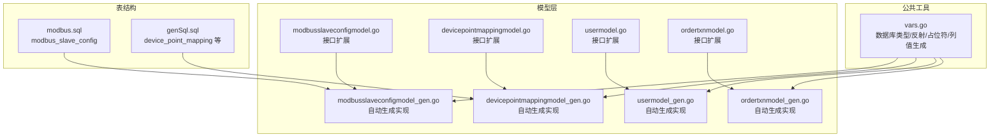
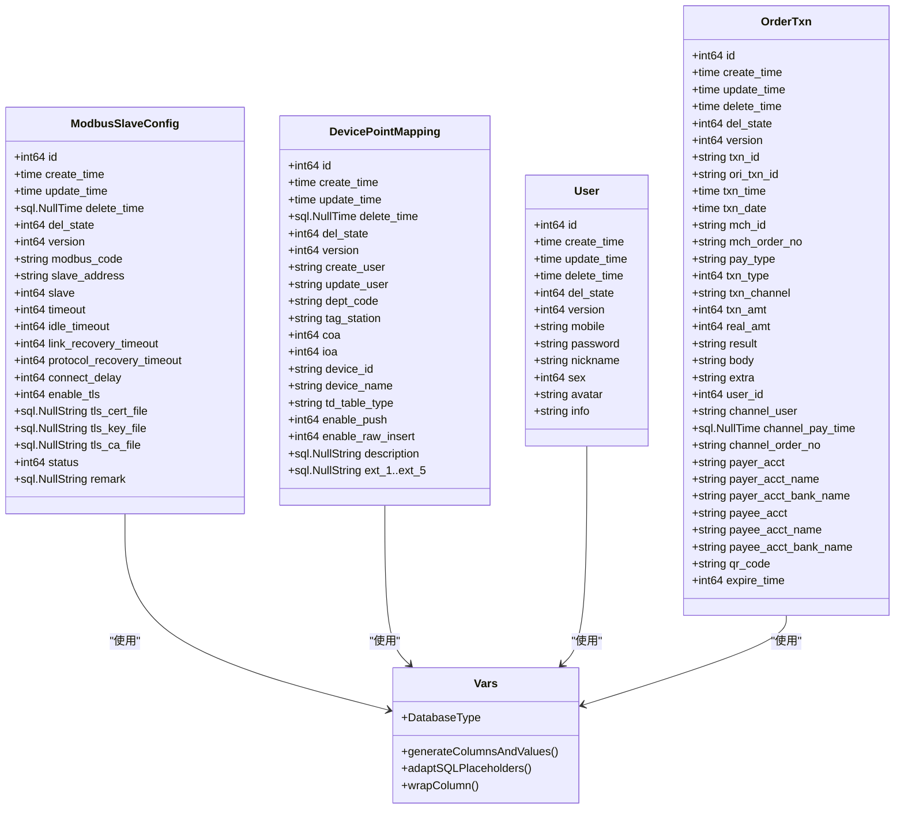
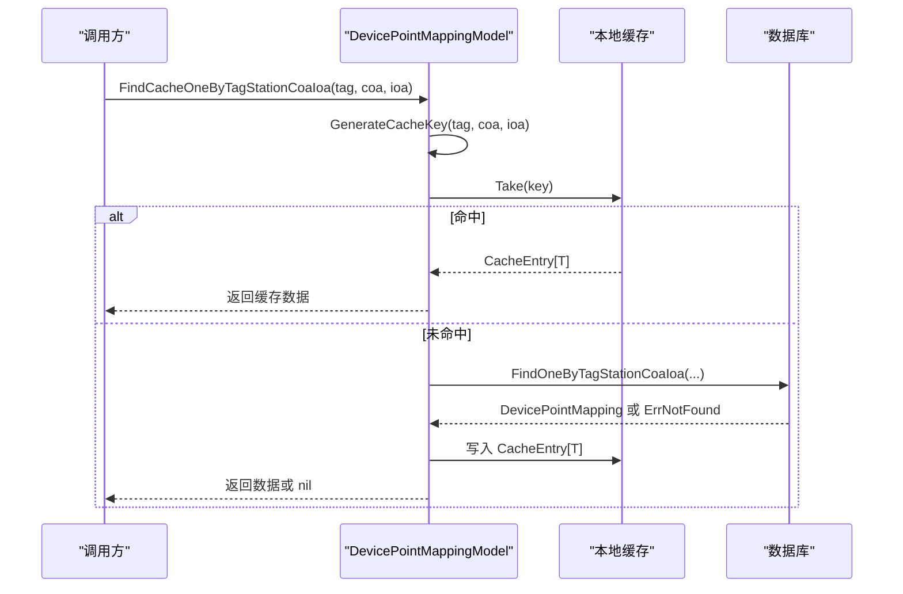
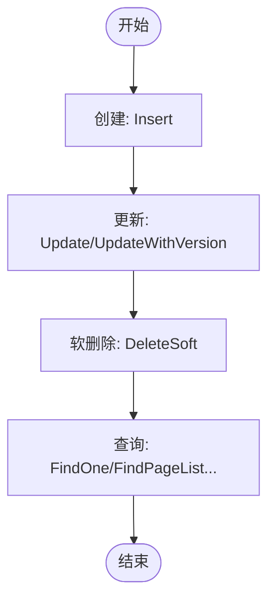
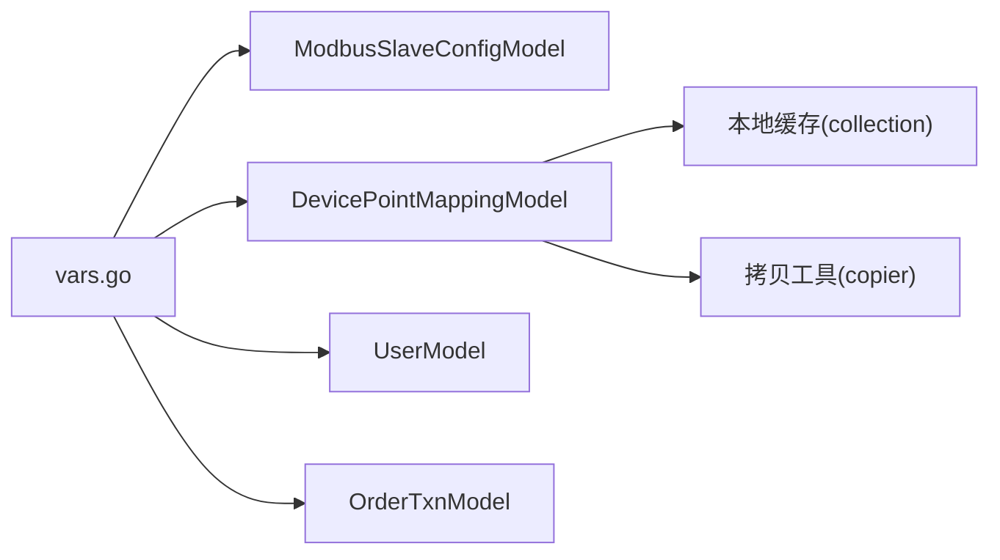
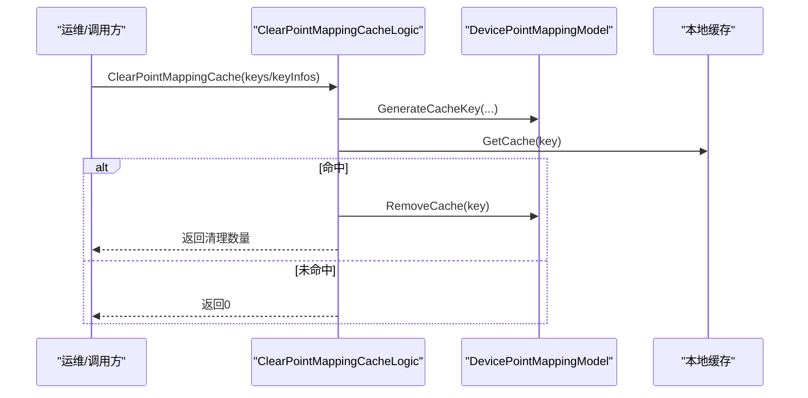

# 核心数据模型

<cite>
**本文引用的文件**
- [modbusslaveconfigmodel.go](file://model/modbusslaveconfigmodel.go)
- [modbusslaveconfigmodel_gen.go](file://model/modbusslaveconfigmodel_gen.go)
- [devicepointmappingmodel.go](file://model/devicepointmappingmodel.go)
- [devicepointmappingmodel_gen.go](file://model/devicepointmappingmodel_gen.go)
- [usermodel.go](file://model/usermodel.go)
- [usermodel_gen.go](file://model/usermodel_gen.go)
- [ordertxnmodel.go](file://model/ordertxnmodel.go)
- [ordertxnmodel_gen.go](file://model/ordertxnmodel_gen.go)
- [vars.go](file://model/vars.go)
- [modbus.sql](file://model/sql/modbus.sql)
- [genSql.sql](file://model/sql/genSql.sql)
- [clearpointmappingcachelogic.go](file://app/ieccaller/internal/logic/clearpointmappingcachelogic.go)
- [ieccaller.pb.go](file://app/ieccaller/ieccaller/ieccaller.pb.go)
</cite>

## 目录
1. [简介](#简介)
2. [项目结构](#项目结构)
3. [核心组件](#核心组件)
4. [架构总览](#架构总览)
5. [详细组件分析](#详细组件分析)
6. [依赖分析](#依赖分析)
7. [性能考虑](#性能考虑)
8. [故障排查指南](#故障排查指南)
9. [结论](#结论)
10. [附录](#附录)

## 简介
本文件面向 Zero-Service 的核心数据模型，聚焦以下业务实体：
- ModbusSlaveConfig：设备配置管理，承载 Modbus 从站连接参数与运行态配置
- DevicePointMapping：设备点位映射，建立设备与 IEC104/TDengine 点位的映射关系
- User：用户信息管理，支撑登录与权限体系
- OrderTxn：订单事务处理，记录支付相关交易流水

文档将从字段定义、数据类型、业务含义、主外键关系、软删除策略、乐观锁、序列化与反序列化、生命周期管理、模型间关系、最佳实践与使用示例等方面进行系统性说明。

## 项目结构
核心数据模型位于 model 目录，采用“手写接口 + 自动生成实现”的分层设计：
- 接口层：在 *.go 中声明自定义接口，注入 withSession、缓存方法等扩展能力
- 实现层：在 *_gen.go 中由 goctl 生成，包含 CRUD、分页、聚合、软删除、乐观锁等通用能力
- 公共工具：vars.go 提供数据库类型、反射元信息、占位符适配、列值生成等通用能力
- 表结构：sql/*.sql 定义真实表结构与索引

图表来源
- [modbusslaveconfigmodel.go:1-32](file://model/modbusslaveconfigmodel.go#L1-L32)
- [modbusslaveconfigmodel_gen.go:1-565](file://model/modbusslaveconfigmodel_gen.go#L1-L565)
- [devicepointmappingmodel.go:1-108](file://model/devicepointmappingmodel.go#L1-L108)
- [devicepointmappingmodel_gen.go:1-549](file://model/devicepointmappingmodel_gen.go#L1-L549)
- [usermodel.go:1-32](file://model/usermodel.go#L1-L32)
- [usermodel_gen.go:1-386](file://model/usermodel_gen.go#L1-L386)
- [ordertxnmodel.go:1-32](file://model/ordertxnmodel.go#L1-L32)
- [ordertxnmodel_gen.go:1-421](file://model/ordertxnmodel_gen.go#L1-L421)
- [vars.go:1-318](file://model/vars.go#L1-L318)
- [modbus.sql:1-32](file://model/sql/modbus.sql#L1-L32)
- [genSql.sql:1-193](file://model/sql/genSql.sql#L1-L193)

章节来源
- [modbusslaveconfigmodel.go:1-32](file://model/modbusslaveconfigmodel.go#L1-L32)
- [devicepointmappingmodel.go:1-108](file://model/devicepointmappingmodel.go#L1-L108)
- [usermodel.go:1-32](file://model/usermodel.go#L1-L32)
- [ordertxnmodel.go:1-32](file://model/ordertxnmodel.go#L1-L32)
- [vars.go:1-318](file://model/vars.go#L1-L318)
- [modbus.sql:1-32](file://model/sql/modbus.sql#L1-L32)
- [genSql.sql:1-193](file://model/sql/genSql.sql#L1-L193)

## 核心组件
本节概述四大模型的职责边界与关键字段。

- ModbusSlaveConfig
  - 职责：管理 Modbus 从站连接配置，含网络参数、超时、TLS、状态与备注
  - 关键字段：modbus_code（唯一编码）、slave_address、slave、timeout、idle_timeout、link_recovery_timeout、protocol_recovery_timeout、connect_delay、enable_tls、tls_*、status、remark
  - 约束：modbus_code 唯一索引；软删除 del_state + delete_time；乐观锁 version

- DevicePointMapping
  - 职责：建立设备与 IEC104/TDengine 点位映射，支持推送与原始数据插入控制
  - 关键字段：tag_station、coa、ioa（联合唯一）、device_id、device_name、td_table_type、enable_push、enable_raw_insert、ext_* 扩展字段
  - 约束：uk_station_coa_ioa 联合唯一；软删除 del_state + delete_time；乐观锁 version

- User
  - 职责：用户基本信息与认证凭据
  - 关键字段：mobile（唯一）、password、nickname、sex、avatar、info
  - 约束：软删除 del_state + delete_time；乐观锁 version

- OrderTxn
  - 职责：支付订单事务流水，记录商户订单号、支付渠道、金额、结果等
  - 关键字段：txn_id、ori_txn_id、txn_time、txn_date、mch_id、mch_order_no、pay_type、txn_type、txn_channel、txn_amt、real_amt、result、body、extra、user_id、channel_*、qr_code、expire_time
  - 约束：软删除 del_state + delete_time；乐观锁 version

章节来源
- [modbusslaveconfigmodel_gen.go:59-80](file://model/modbusslaveconfigmodel_gen.go#L59-L80)
- [devicepointmappingmodel_gen.go:59-83](file://model/devicepointmappingmodel_gen.go#L59-L83)
- [usermodel_gen.go:54-67](file://model/usermodel_gen.go#L54-L67)
- [ordertxnmodel_gen.go:55-88](file://model/ordertxnmodel_gen.go#L55-L88)

## 架构总览
四大模型共享统一的基础设施：
- 统一的软删除与乐观锁策略
- 统一的分页查询与聚合函数
- 统一的 Squirrel 查询构建器
- 统一的 MySQL/Postgres 占位符适配
- 统一的列名与值生成反射机制

图表来源
- [modbusslaveconfigmodel_gen.go:59-80](file://model/modbusslaveconfigmodel_gen.go#L59-L80)
- [devicepointmappingmodel_gen.go:59-83](file://model/devicepointmappingmodel_gen.go#L59-L83)
- [usermodel_gen.go:54-67](file://model/usermodel_gen.go#L54-L67)
- [ordertxnmodel_gen.go:55-88](file://model/ordertxnmodel_gen.go#L55-L88)
- [vars.go:49-318](file://model/vars.go#L49-L318)

## 详细组件分析

### ModbusSlaveConfig 模型
- 字段与业务含义
  - modbus_code：全局唯一配置编码，作为外部识别码
  - slave_address：IP:Port 格式的目标设备地址
  - slave：从站地址（Unit ID）
  - timeout/idle_timeout/link_recovery_timeout/protocol_recovery_timeout/connect_delay：连接与协议行为参数
  - enable_tls/tls_*：TLS 开关与证书链路径
  - status：启用/禁用状态
  - remark：备注说明
- 主键与索引
  - 主键：id（自增）
  - 索引：idx_modbus_code（唯一）
- 软删除与乐观锁
  - del_state + delete_time：软删除
  - version：乐观锁，UpdateWithVersion 基于 id + version 条件更新
- 生命周期
  - 创建：Insert 设置 delete_time 为空、del_state=0
  - 更新：Update 清空 delete_time、del_state=0；UpdateWithVersion 增加 version 并校验 RowsAffected
  - 删除：DeleteSoft 将 del_state=1、delete_time=now
  - 查询：FindOne/FindOneByModbusCode 自动过滤 del_state=0
- 序列化与反序列化
  - db 标签映射到 mysql 字段；Postgres 下占位符格式由 adaptSQLPlaceholders 适配
- 使用示例
  - 新建模型实例：NewModbusSlaveConfigModel(conn, WithDBType(...))
  - 事务：Trans(fn) 包裹多个操作
  - 分页：FindPageListByPage/FindPageListByPageWithTotal
  - Builder：SelectBuilder/InsertBuilder/UpdateBuilder/DeleteBuilder 组合复杂查询

章节来源
- [modbusslaveconfigmodel.go:1-32](file://model/modbusslaveconfigmodel.go#L1-L32)
- [modbusslaveconfigmodel_gen.go:1-565](file://model/modbusslaveconfigmodel_gen.go#L1-L565)
- [modbus.sql:1-32](file://model/sql/modbus.sql#L1-L32)
- [vars.go:18-318](file://model/vars.go#L18-L318)

### DevicePointMapping 模型
- 字段与业务含义
  - tag_station/coa/ioa：与 TDengine 的 tag_station/coa/ioa 对应，联合唯一
  - device_id/device_name：设备标识与名称
  - td_table_type：遥信/遥测等表类型集合
  - enable_push/enable_raw_insert：推送与原始数据插入开关
  - ext_1..ext_5：扩展字段，用于主题拆分等
- 主键与索引
  - 主键：id（自增）
  - 索引：uk_station_coa_ioa（联合唯一）
- 缓存策略
  - 内置本地缓存：pointMappingCache，支持 GetCache、RemoveCache、RemoveCacheByTagStationCoaIoa、FindCacheOneByTagStationCoaIoa
  - 缓存键：pm:{tag_station}:{coa}:{ioa}
  - 缓存条目：CacheEntry[T]，包含 Data 与 Valid 标记
- 软删除与乐观锁
  - del_state + delete_time：软删除
  - version：乐观锁，UpdateWithVersion 基于 id + version 条件更新
- 生命周期
  - 创建/更新：Insert/Update 清空 delete_time、del_state=0；UpdateWithVersion 增加 version
  - 删除：DeleteSoft 将 del_state=1、delete_time=now
  - 查询：FindOne/FindOneByTagStationCoaIoa 自动过滤 del_state=0
- 使用示例
  - 获取缓存：GenerateCacheKey + GetCache
  - 命中未命中：FindCacheOneByTagStationCoaIoa 返回缓存数据或 nil
  - 清理缓存：RemoveCache/RemoveCacheByTagStationCoaIoa

图表来源
- [devicepointmappingmodel.go:70-107](file://model/devicepointmappingmodel.go#L70-L107)
- [devicepointmappingmodel_gen.go:134-153](file://model/devicepointmappingmodel_gen.go#L134-L153)

章节来源
- [devicepointmappingmodel.go:1-108](file://model/devicepointmappingmodel.go#L1-L108)
- [devicepointmappingmodel_gen.go:1-549](file://model/devicepointmappingmodel_gen.go#L1-L549)
- [genSql.sql:1-27](file://model/sql/genSql.sql#L1-L27)
- [vars.go:18-318](file://model/vars.go#L18-L318)

### User 模型
- 字段与业务含义
  - mobile：唯一手机号，作为登录入口
  - password：密码
  - nickname/sex/avatar/info：用户资料
- 主键与索引
  - 主键：id（自增）
  - 索引：mobile（唯一）
- 软删除与乐观锁
  - del_state + delete_time：软删除
  - version：乐观锁，UpdateWithVersion 基于 id + version 条件更新
- 生命周期
  - 创建/更新：Insert/Update 清空 delete_time、del_state=0；UpdateWithVersion 增加 version
  - 删除：DeleteSoft 将 del_state=1、delete_time=now
  - 查询：FindOne/FindOneByMobile 自动过滤 del_state=0

章节来源
- [usermodel.go:1-32](file://model/usermodel.go#L1-L32)
- [usermodel_gen.go:1-386](file://model/usermodel_gen.go#L1-L386)
- [vars.go:18-318](file://model/vars.go#L18-L318)

### OrderTxn 模型
- 字段与业务含义
  - txn_id/ori_txn_id：订单号与原订单号
  - txn_time/txn_date：订单时间与日期
  - mch_id/mch_order_no：商户与商户订单号
  - pay_type/txn_type/txn_channel：支付类型、交易类型与渠道
  - txn_amt/real_amt：订单金额与实付金额（分）
  - result：交易结果状态
  - body/extra：商品描述与额外参数
  - user_id/channel_*：用户与渠道侧信息
  - qr_code/expire_time：二维码与失效时间
- 主键与索引
  - 主键：id（自增）
  - 索引：txn_id、mch_id+mch_order_no 等复合索引
- 软删除与乐观锁
  - del_state + delete_time：软删除
  - version：乐观锁，UpdateWithVersion 基于 id + version 条件更新
- 生命周期
  - 创建/更新：Insert/Update 清空 delete_time、del_state=0；UpdateWithVersion 增加 version
  - 删除：DeleteSoft 将 del_state=1、delete_time=now
  - 查询：FindOne/FindOneByTxnId/FindOneByMchIdMchOrderNo 自动过滤 del_state=0

章节来源
- [ordertxnmodel.go:1-32](file://model/ordertxnmodel.go#L1-L32)
- [ordertxnmodel_gen.go:1-421](file://model/ordertxnmodel_gen.go#L1-L421)
- [vars.go:18-318](file://model/vars.go#L18-L318)

### 模型关系设计
- 一对一/一对多/多对多
  - 当前四个模型未显式声明外键关系；DevicePointMapping 的 tag_station/coa/ioa 与 TDengine/IEC104 点位存在语义关联，但未在数据库层面建立外键约束
  - OrderTxn 通过 user_id 与 User 存在语义关联，同样未建立外键约束
- 关系实现建议
  - 若需要强一致性，可在数据库层添加外键约束
  - 若追求高可用与解耦，维持现有无外键设计，通过应用层保证一致性

章节来源
- [devicepointmappingmodel_gen.go:59-83](file://model/devicepointmappingmodel_gen.go#L59-L83)
- [ordertxnmodel_gen.go:55-88](file://model/ordertxnmodel_gen.go#L55-L88)

### 序列化与反序列化机制
- 数据库标签映射
  - 结构体字段通过 db 标签映射到表字段，支持大小写与下划线转换
- 占位符适配
  - MySQL 使用 ?，Postgres 使用 $n，adaptSQLPlaceholders 动态替换
- 列名与值生成
  - generateColumnsAndValues/generateUpdatePlaceholders 基于反射生成列名与占位符，自动忽略自增与时间戳字段
- JSON 标签
  - 代码中未见 JSON 标签定义，序列化以数据库标签为主

章节来源
- [vars.go:90-318](file://model/vars.go#L90-L318)
- [modbusslaveconfigmodel_gen.go:530-560](file://model/modbusslaveconfigmodel_gen.go#L530-L560)
- [devicepointmappingmodel_gen.go:514-544](file://model/devicepointmappingmodel_gen.go#L514-L544)
- [usermodel_gen.go:380-381](file://model/usermodel_gen.go#L380-L381)
- [ordertxnmodel_gen.go:414-416](file://model/ordertxnmodel_gen.go#L414-L416)

### 生命周期管理
- 创建：Insert 设置 delete_time 为空、del_state=0
- 更新：Update 清空 delete_time、del_state=0；UpdateWithVersion 增加 version 并校验 RowsAffected
- 删除：DeleteSoft 将 del_state=1、delete_time=now
- 查询：FindOne/FindOneByXxx 自动过滤 del_state=0
- 事务：Trans(ctx, fn) 支持跨模型事务

图表来源
- [modbusslaveconfigmodel_gen.go:152-272](file://model/modbusslaveconfigmodel_gen.go#L152-L272)
- [devicepointmappingmodel_gen.go:155-275](file://model/devicepointmappingmodel_gen.go#L155-L275)
- [usermodel_gen.go:116-173](file://model/usermodel_gen.go#L116-L173)
- [ordertxnmodel_gen.go:151-208](file://model/ordertxnmodel_gen.go#L151-L208)

## 依赖分析
- 组件耦合
  - 四个模型均依赖 vars.go 的通用能力（数据库类型、占位符适配、列值生成、反射缓存）
  - DevicePointMappingModel 依赖本地缓存与拷贝工具
- 外部依赖
  - go-zero sqlx、squirrel、copier、collection
- 潜在风险
  - 未建立外键约束，需在应用层保证一致性
  - Postgres 与 MySQL 占位符差异通过 adaptSQLPlaceholders 处理

图表来源
- [vars.go:1-318](file://model/vars.go#L1-L318)
- [devicepointmappingmodel.go:1-108](file://model/devicepointmappingmodel.go#L1-L108)

章节来源
- [vars.go:1-318](file://model/vars.go#L1-L318)
- [devicepointmappingmodel.go:1-108](file://model/devicepointmappingmodel.go#L1-L108)

## 性能考虑
- 索引与查询
  - 为高频查询字段建立合适索引（如 idx_modbus_code、uk_station_coa_ioa、mch_id+mch_order_no）
- 分页与排序
  - 默认按 id DESC 排序，避免全表扫描
- 缓存
  - DevicePointMapping 内置本地缓存，显著降低热点查询延迟
- 乐观锁
  - UpdateWithVersion 减少并发更新冲突导致的覆盖
- 占位符与反射
  - 通过反射缓存与正则替换减少重复计算

## 故障排查指南
- 常见错误
  - ErrNotFound：查询不到记录
  - ErrNoRowsUpdate：UpdateWithVersion 未影响任何行（并发冲突或版本不匹配）
- 排查步骤
  - 确认 del_state=0 的过滤条件是否正确
  - 检查版本号是否被其他进程更新
  - 核对索引是否存在且有效
  - 检查 Postgres/MySQL 占位符是否正确适配
- 缓存问题
  - 清理缓存：RemoveCache/RemoveCacheByTagStationCoaIoa
  - 广播清理：通过 RPC ClearPointMappingCacheReq 广播清理

图表来源
- [clearpointmappingcachelogic.go:26-60](file://app/ieccaller/internal/logic/clearpointmappingcachelogic.go#L26-L60)
- [ieccaller.pb.go:1152-1172](file://app/ieccaller/ieccaller/ieccaller.pb.go#L1152-L1172)

章节来源
- [vars.go:18-21](file://model/vars.go#L18-L21)
- [clearpointmappingcachelogic.go:26-60](file://app/ieccaller/internal/logic/clearpointmappingcachelogic.go#L26-L60)
- [ieccaller.pb.go:1152-1172](file://app/ieccaller/ieccaller/ieccaller.pb.go#L1152-L1172)

## 结论
本项目通过“接口扩展 + 自动生成实现 + 通用工具”的模式，实现了统一、可扩展、高性能的核心数据模型层。四大模型具备完善的软删除、乐观锁、分页、聚合与缓存能力，满足生产环境对一致性与性能的要求。建议在后续演进中根据业务需要引入外键约束与更细粒度的鉴权策略。

## 附录
- 最佳实践
  - 优先使用 UpdateWithVersion 进行更新，避免并发覆盖
  - 为高频查询字段建立索引，结合分页与排序优化
  - 合理利用 DevicePointMapping 的本地缓存，必要时广播清理
  - 在事务中组合多个模型操作，确保原子性
- 使用示例（路径指引）
  - Modbus 配置：[NewModbusSlaveConfigModel:21-25](file://model/modbusslaveconfigmodel.go#L21-L25)
  - 设备点位映射：[NewDevicePointMappingModel:39-44](file://model/devicepointmappingmodel.go#L39-L44)、[FindCacheOneByTagStationCoaIoa:74-107](file://model/devicepointmappingmodel.go#L74-L107)
  - 用户：[NewUserModel:21-25](file://model/usermodel.go#L21-L25)
  - 订单：[NewOrderTxnModel:21-25](file://model/ordertxnmodel.go#L21-L25)
  - 事务：[Trans:440-446](file://model/modbusslaveconfigmodel_gen.go#L440-L446)