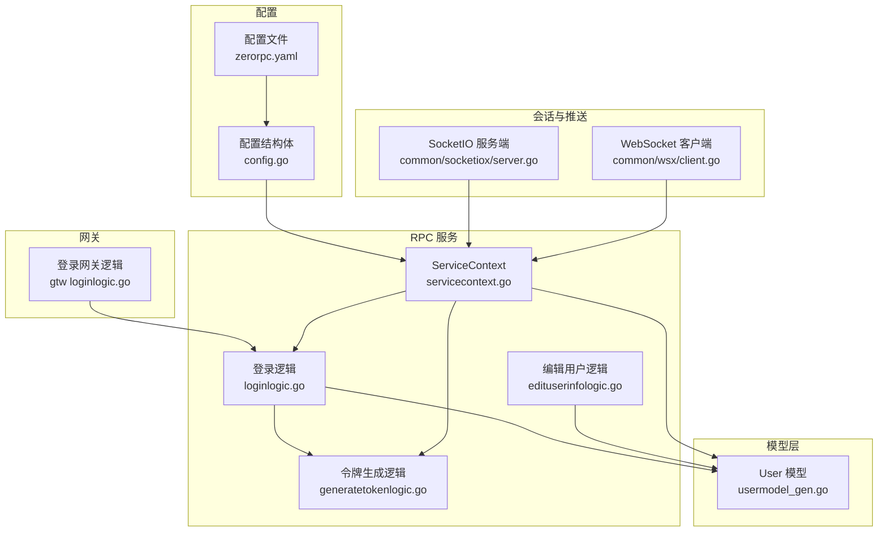
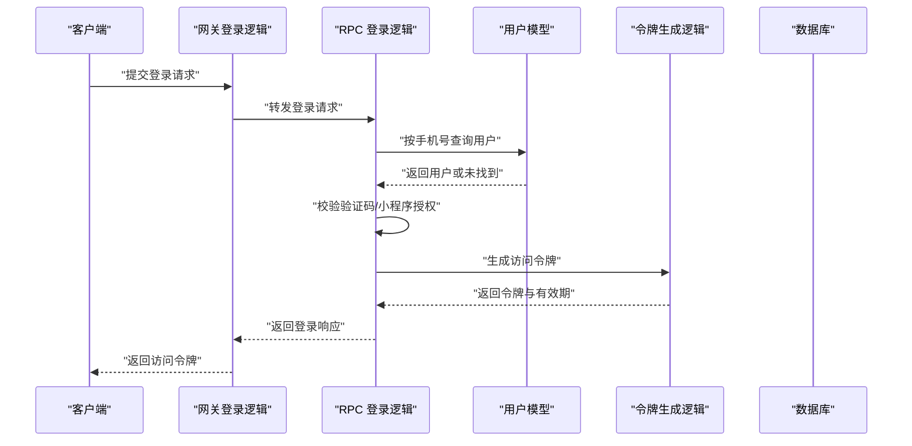
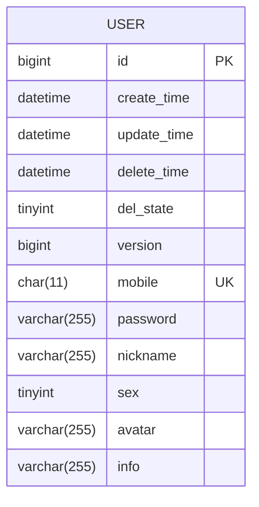
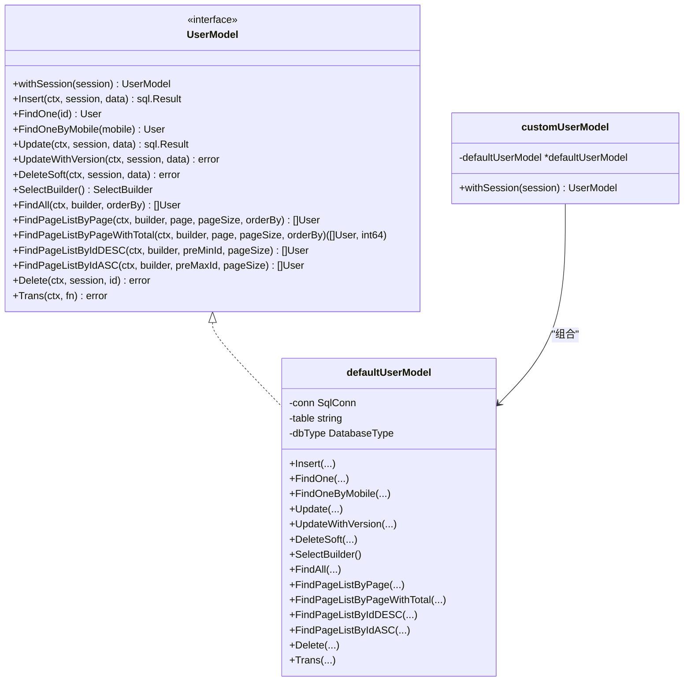
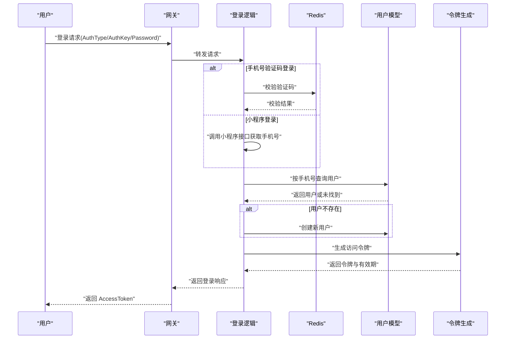
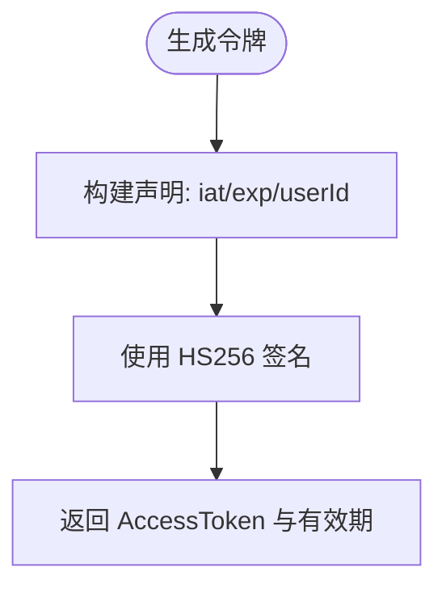
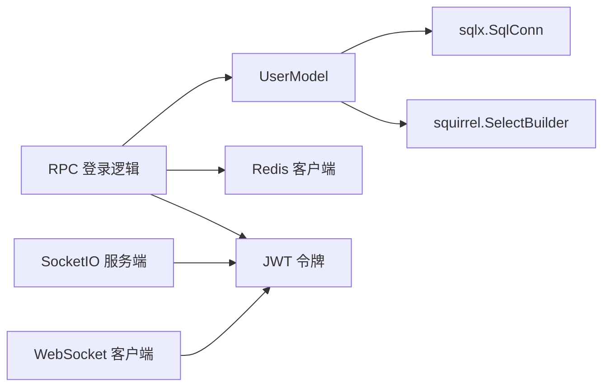

# 用户管理模型

<cite>
**本文引用的文件**
- [model/usermodel.go](file://model/usermodel.go)
- [model/usermodel_gen.go](file://model/usermodel_gen.go)
- [model/sql/test.sql](file://model/sql/test.sql)
- [zerorpc/internal/logic/loginlogic.go](file://zerorpc/internal/logic/loginlogic.go)
- [zerorpc/internal/logic/generatetokenlogic.go](file://zerorpc/internal/logic/generatetokenlogic.go)
- [zerorpc/internal/logic/edituserinfologic.go](file://zerorpc/internal/logic/edituserinfologic.go)
- [zerorpc/internal/svc/servicecontext.go](file://zerorpc/internal/svc/servicecontext.go)
- [zerorpc/etc/zerorpc.yaml](file://zerorpc/etc/zerorpc.yaml)
- [zerorpc/internal/config/config.go](file://zerorpc/internal/config/config.go)
- [gtw/internal/logic/user/loginlogic.go](file://gtw/internal/logic/user/loginlogic.go)
- [.trae/skills/zero-skills/best-practices/overview.md](file://.trae/skills/zero-skills/best-practices/overview.md)
- [common/socketiox/server.go](file://common/socketiox/server.go)
- [common/wsx/client.go](file://common/wsx/client.go)
</cite>

## 目录
1. [简介](#简介)
2. [项目结构](#项目结构)
3. [核心组件](#核心组件)
4. [架构总览](#架构总览)
5. [详细组件分析](#详细组件分析)
6. [依赖分析](#依赖分析)
7. [性能考量](#性能考量)
8. [故障排查指南](#故障排查指南)
9. [结论](#结论)
10. [附录](#附录)

## 简介
本文件围绕用户管理模型（User）进行系统化技术文档编制，覆盖设计理念与安全考量，包括身份认证、权限控制与会话管理；详述用户字段定义、数据类型与业务规则；阐述权限体系与访问控制思路；提供注册、登录、密码管理与账户安全实现要点；解释会话管理机制、令牌生成与过期处理；并给出用户数据保护、隐私合规与审计日志建议及最佳实践。

## 项目结构
用户模型位于 model 层，配套的 RPC 服务在 zerorpc 内部提供登录、令牌生成与用户信息编辑能力；网关层 gtw 提供对外登录入口；配置位于 zerorpc/etc/zerorpc.yaml；通用组件如 SocketIO 与 WebSocket 客户端提供会话与令牌刷新能力。

图表来源
- [model/usermodel_gen.go:54-67](file://model/usermodel_gen.go#L54-L67)
- [zerorpc/internal/svc/servicecontext.go:19-33](file://zerorpc/internal/svc/servicecontext.go#L19-L33)
- [zerorpc/internal/logic/loginlogic.go:30-109](file://zerorpc/internal/logic/loginlogic.go#L30-L109)
- [zerorpc/internal/logic/generatetokenlogic.go:30-52](file://zerorpc/internal/logic/generatetokenlogic.go#L30-L52)
- [zerorpc/internal/logic/edituserinfologic.go:28-48](file://zerorpc/internal/logic/edituserinfologic.go#L28-L48)
- [zerorpc/etc/zerorpc.yaml:33-35](file://zerorpc/etc/zerorpc.yaml#L33-L35)
- [zerorpc/internal/config/config.go:8-24](file://zerorpc/internal/config/config.go#L8-L24)
- [common/socketiox/server.go:337-380](file://common/socketiox/server.go#L337-L380)
- [common/wsx/client.go:700-747](file://common/wsx/client.go#L700-L747)

章节来源
- [model/usermodel.go:1-32](file://model/usermodel.go#L1-L32)
- [model/usermodel_gen.go:54-67](file://model/usermodel_gen.go#L54-L67)
- [zerorpc/etc/zerorpc.yaml:1-39](file://zerorpc/etc/zerorpc.yaml#L1-L39)
- [zerorpc/internal/config/config.go:8-24](file://zerorpc/internal/config/config.go#L8-L24)

## 核心组件
- 用户模型 User：包含主键、时间戳、软删除、乐观锁版本号以及手机号、密码、昵称、性别、头像、扩展信息等字段。
- 用户模型接口与默认实现：提供插入、查询、分页、软删除、乐观锁更新等方法。
- 登录流程：支持手机号验证码登录、小程序登录等，统一生成 JWT 令牌。
- 令牌生成：基于 HS256 签名，包含签发时间、过期时间与用户标识。
- 会话与推送：SocketIO 与 WebSocket 客户端均支持基于令牌的认证与自动刷新。

章节来源
- [model/usermodel_gen.go:54-67](file://model/usermodel_gen.go#L54-L67)
- [model/usermodel_gen.go:116-164](file://model/usermodel_gen.go#L116-L164)
- [zerorpc/internal/logic/loginlogic.go:30-109](file://zerorpc/internal/logic/loginlogic.go#L30-L109)
- [zerorpc/internal/logic/generatetokenlogic.go:30-52](file://zerorpc/internal/logic/generatetokenlogic.go#L30-L52)
- [common/socketiox/server.go:337-380](file://common/socketiox/server.go#L337-L380)
- [common/wsx/client.go:700-747](file://common/wsx/client.go#L700-L747)

## 架构总览
用户管理贯穿“网关 -> RPC 服务 -> 模型层 -> 数据库”的链路，同时通过 SocketIO/WS 客户端实现会话与令牌刷新。

图表来源
- [gtw/internal/logic/user/loginlogic.go:28-42](file://gtw/internal/logic/user/loginlogic.go#L28-L42)
- [zerorpc/internal/logic/loginlogic.go:30-109](file://zerorpc/internal/logic/loginlogic.go#L30-L109)
- [zerorpc/internal/logic/generatetokenlogic.go:30-52](file://zerorpc/internal/logic/generatetokenlogic.go#L30-L52)
- [model/usermodel_gen.go:102-114](file://model/usermodel_gen.go#L102-L114)

## 详细组件分析

### 用户模型与字段定义
- 字段与类型
  - 主键与时间戳：id、create_time、update_time、delete_time
  - 软删除与版本控制：del_state、version
  - 身份与资料：mobile（char(11)）、password（varchar(255)）、nickname（varchar(255)）、sex（tinyint(1)，0:男 1:女）、avatar（varchar(255)）、info（varchar(255)）
- 约束与索引
  - 唯一索引：mobile
  - 表注释：用户表
- 业务规则
  - 查询默认过滤 del_state=0 的记录
  - 插入/更新时对 delete_time、del_state、version 进行规范化处理
  - 支持乐观锁更新（version 自增）

图表来源
- [model/sql/test.sql:5-21](file://model/sql/test.sql#L5-L21)
- [model/usermodel_gen.go:54-67](file://model/usermodel_gen.go#L54-L67)

章节来源
- [model/sql/test.sql:5-21](file://model/sql/test.sql#L5-L21)
- [model/usermodel_gen.go:21-26](file://model/usermodel_gen.go#L21-L26)
- [model/usermodel_gen.go:116-164](file://model/usermodel_gen.go#L116-L164)

### 用户模型接口与实现
- 接口方法族
  - Insert/FindOne/FindOneByMobile/Update/UpdateWithVersion/DeleteSoft/SelectBuilder/FindAll/FindPageListByPage/FindPageListByPageWithTotal/FindPageListByIdDESC/FindPageListByIdASC/Delete/Trans
- 实现要点
  - 默认实现 defaultUserModel 维护连接、表名与数据库类型
  - FindOne/FindOneByMobile 在查询时自动过滤 del_state=0
  - UpdateWithVersion 基于 version 字段执行条件更新，并返回受影响行数以判断是否发生更新

图表来源
- [model/usermodel.go:10-17](file://model/usermodel.go#L10-L17)
- [model/usermodel.go:21-31](file://model/usermodel.go#L21-L31)
- [model/usermodel_gen.go:29-52](file://model/usermodel_gen.go#L29-L52)
- [model/usermodel_gen.go:116-164](file://model/usermodel_gen.go#L116-L164)

章节来源
- [model/usermodel.go:10-31](file://model/usermodel.go#L10-L31)
- [model/usermodel_gen.go:29-52](file://model/usermodel_gen.go#L29-L52)
- [model/usermodel_gen.go:116-164](file://model/usermodel_gen.go#L116-L164)

### 登录与认证流程
- 支持方式
  - 手机号验证码登录：从 Redis 校验验证码后按手机号查找用户
  - 小程序登录：通过小程序接口获取手机号并按手机号查找用户
  - 未注册用户：自动创建匿名昵称的用户并返回其 ID
- 令牌发放
  - 登录成功后调用令牌生成逻辑，返回 AccessToken、AccessExpire、RefreshAfter

图表来源
- [zerorpc/internal/logic/loginlogic.go:30-109](file://zerorpc/internal/logic/loginlogic.go#L30-L109)
- [model/usermodel_gen.go:102-114](file://model/usermodel_gen.go#L102-L114)
- [zerorpc/internal/logic/generatetokenlogic.go:30-52](file://zerorpc/internal/logic/generatetokenlogic.go#L30-L52)

章节来源
- [zerorpc/internal/logic/loginlogic.go:30-109](file://zerorpc/internal/logic/loginlogic.go#L30-L109)
- [zerorpc/internal/logic/generatetokenlogic.go:30-52](file://zerorpc/internal/logic/generatetokenlogic.go#L30-L52)

### 令牌生成与会话管理
- 令牌内容
  - 包含签发时间（iat）、过期时间（exp）、用户标识（userId）
  - 使用 HS256 签名，密钥来自配置
- 刷新策略
  - WebSocket 客户端支持定时刷新令牌（可配置刷新周期）
  - SocketIO 服务端在握手阶段校验令牌有效性
- 配置项
  - AccessSecret、AccessExpire 来源于配置文件与配置结构体

图表来源
- [zerorpc/internal/logic/generatetokenlogic.go:30-52](file://zerorpc/internal/logic/generatetokenlogic.go#L30-L52)
- [zerorpc/etc/zerorpc.yaml:33-35](file://zerorpc/etc/zerorpc.yaml#L33-L35)
- [zerorpc/internal/config/config.go:11-14](file://zerorpc/internal/config/config.go#L11-L14)

章节来源
- [zerorpc/internal/logic/generatetokenlogic.go:30-52](file://zerorpc/internal/logic/generatetokenlogic.go#L30-L52)
- [zerorpc/etc/zerorpc.yaml:33-35](file://zerorpc/etc/zerorpc.yaml#L33-L35)
- [zerorpc/internal/config/config.go:11-14](file://zerorpc/internal/config/config.go#L11-L14)
- [common/wsx/client.go:700-747](file://common/wsx/client.go#L700-L747)
- [common/socketiox/server.go:337-380](file://common/socketiox/server.go#L337-L380)

### 用户信息编辑
- 功能：根据用户 ID 查询并更新手机号、昵称、性别、头像等字段
- 注意：密码字段保持不变，避免误改

章节来源
- [zerorpc/internal/logic/edituserinfologic.go:28-48](file://zerorpc/internal/logic/edituserinfologic.go#L28-L48)
- [model/usermodel_gen.go:127-135](file://model/usermodel_gen.go#L127-L135)

### 权限体系与访问控制
- 当前仓库未提供显式角色/权限表与 ACL 实现
- 建议在现有 JWT 机制基础上扩展：
  - 在令牌中加入角色/权限声明
  - 在 RPC/网关层增加中间件校验
  - 引入 RBAC 或 ABAC 模型并落地到数据库

章节来源
- [.trae/skills/zero-skills/best-practices/overview.md:546-669](file://.trae/skills/zero-skills/best-practices/overview.md#L546-L669)

### 数据保护、隐私合规与审计日志
- 密码处理：应采用强哈希（如 bcrypt）存储，避免明文或弱加密
- 输入校验：对手机号、昵称等字段进行长度与格式校验
- 敏感信息脱敏：日志与错误响应中避免输出敏感字段
- 审计日志：记录关键操作（登录、修改资料、令牌刷新）上下文与用户标识
- 隐私合规：遵循最小必要原则收集与处理个人信息，提供用户撤回同意与删除权

章节来源
- [.trae/skills/zero-skills/best-practices/overview.md:546-669](file://.trae/skills/zero-skills/best-practices/overview.md#L546-L669)

## 依赖分析
- 模型层依赖 go-zero 的 sqlx 与 squirrel，提供 SQL 构建与执行
- RPC 服务依赖 Redis 存储验证码、MySQL 存储用户数据
- 会话层依赖 JWT 令牌与 SocketIO/WS 客户端

图表来源
- [model/usermodel_gen.go:7-19](file://model/usermodel_gen.go#L7-L19)
- [zerorpc/internal/logic/loginlogic.go:30-109](file://zerorpc/internal/logic/loginlogic.go#L30-L109)
- [zerorpc/internal/svc/servicecontext.go:25-26](file://zerorpc/internal/svc/servicecontext.go#L25-L26)
- [common/socketiox/server.go:337-380](file://common/socketiox/server.go#L337-L380)
- [common/wsx/client.go:700-747](file://common/wsx/client.go#L700-L747)

章节来源
- [model/usermodel_gen.go:7-19](file://model/usermodel_gen.go#L7-L19)
- [zerorpc/internal/svc/servicecontext.go:25-26](file://zerorpc/internal/svc/servicecontext.go#L25-L26)

## 性能考量
- 分页查询：提供按 id 正序/倒序的游标分页方法，减少全表扫描
- 软删除：通过 del_state 过滤，避免物理删除带来的维护成本
- 乐观锁：UpdateWithVersion 降低并发写冲突导致的数据覆盖
- 缓存：结合 Redis 缓存热点用户数据与验证码，降低数据库压力

章节来源
- [model/usermodel_gen.go:252-319](file://model/usermodel_gen.go#L252-L319)
- [model/usermodel_gen.go:137-164](file://model/usermodel_gen.go#L137-L164)

## 故障排查指南
- 登录失败
  - 校验验证码是否正确且未过期
  - 检查 Redis 中验证码键是否存在与值匹配
  - 查看用户是否存在，若不存在确认是否触发了自动创建逻辑
- 令牌无效
  - 核对 AccessSecret 与 PrevAccessSecret 配置
  - 检查令牌签名算法与过期时间
- 会话异常
  - WebSocket 客户端检查 Token 刷新循环与重连策略
  - SocketIO 服务端确认握手阶段的令牌校验逻辑

章节来源
- [zerorpc/internal/logic/loginlogic.go:49-68](file://zerorpc/internal/logic/loginlogic.go#L49-L68)
- [zerorpc/etc/zerorpc.yaml:33-35](file://zerorpc/etc/zerorpc.yaml#L33-L35)
- [common/wsx/client.go:700-747](file://common/wsx/client.go#L700-L747)
- [common/socketiox/server.go:337-380](file://common/socketiox/server.go#L337-L380)

## 结论
用户管理模型以简洁的 User 结构与完善的 CRUD/分页/软删除/乐观锁能力为基础，配合 RPC 登录与 JWT 令牌机制，满足常见用户场景。建议在现有基础上补充密码哈希、输入校验、权限体系与审计日志，以提升安全性与可运维性。

## 附录
- 最佳实践参考：输入校验、密码处理、JWT 安全与反模式示例
- 会话与推送：SocketIO 与 WebSocket 客户端的认证与令牌刷新机制

章节来源
- [.trae/skills/zero-skills/best-practices/overview.md:546-669](file://.trae/skills/zero-skills/best-practices/overview.md#L546-L669)
- [common/socketiox/server.go:337-380](file://common/socketiox/server.go#L337-L380)
- [common/wsx/client.go:700-747](file://common/wsx/client.go#L700-L747)