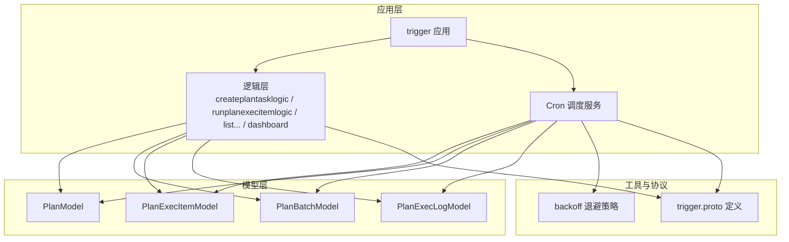
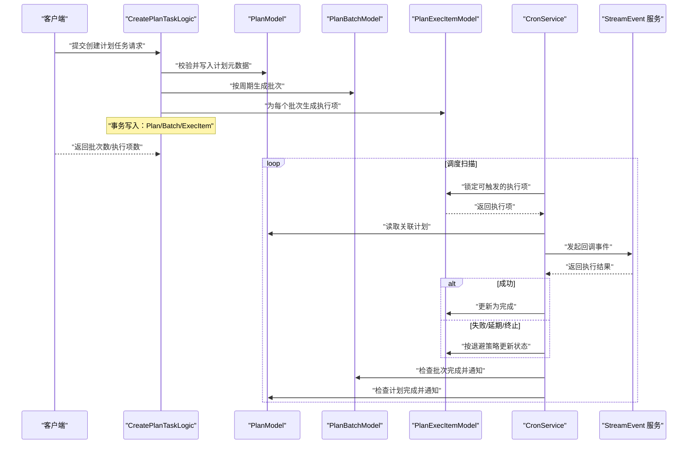
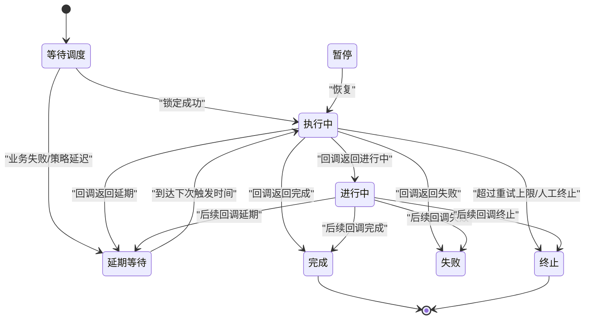
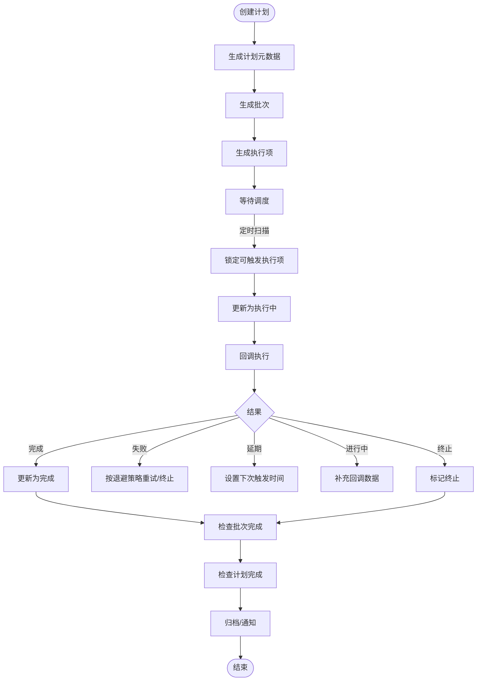
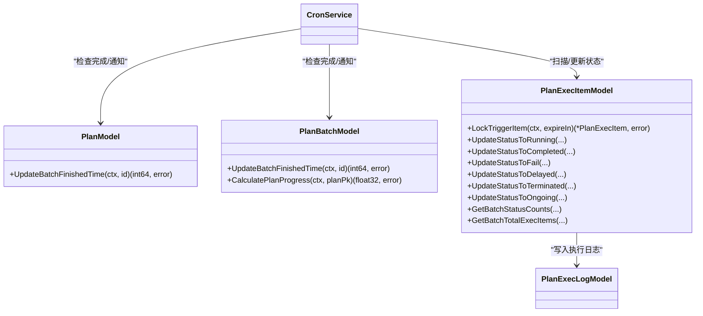

# 计划任务模型

<cite>
**本文引用的文件**
- [planbatchmodel.go](file://model/planbatchmodel.go)
- [planexecitemmodel.go](file://model/planexecitemmodel.go)
- [planexeclogmodel.go](file://model/planexeclogmodel.go)
- [planmodel.go](file://model/planmodel.go)
- [vars.go](file://model/vars.go)
- [createplantasklogic.go](file://app/trigger/internal/logic/createplantasklogic.go)
- [runplanexecitemlogic.go](file://app/trigger/internal/logic/runplanexecitemlogic.go)
- [listplanexecitemslogic.go](file://app/trigger/internal/logic/listplanexecitemslogic.go)
- [listplanexeclogslogic.go](file://app/trigger/internal/logic/listplanexeclogslogic.go)
- [getexecitemdashboardlogic.go](file://app/trigger/internal/logic/getexecitemdashboardlogic.go)
- [cronservice.go](file://app/trigger/cron/cronservice.go)
- [backoff.go](file://common/tool/backoff.go)
- [trigger.proto](file://app/trigger/trigger/trigger.proto)
- [test.sql](file://model/sql/test.sql)
</cite>

## 目录
1. [简介](#简介)
2. [项目结构](#项目结构)
3. [核心组件](#核心组件)
4. [架构总览](#架构总览)
5. [详细组件分析](#详细组件分析)
6. [依赖关系分析](#依赖关系分析)
7. [性能与并发控制](#性能与并发控制)
8. [故障与异常处理](#故障与异常处理)
9. [监控与运维](#监控与运维)
10. [最佳实践与优化建议](#最佳实践与优化建议)
11. [结论](#结论)

## 简介
本文件围绕计划任务相关模型与实现，系统性梳理 PlanBatch（计划批次）、PlanExecItem（执行项）与 PlanExecLog（执行日志）三者的关系与数据流转；解释计划任务生命周期（创建、调度、执行、完成、归档）的状态转换；阐述任务优先级、重试机制与失败处理策略；给出调度算法、并发控制与资源分配机制说明；并覆盖监控指标、性能统计与异常告警配置、持久化策略、数据一致性与故障恢复机制，以及最佳实践与优化建议。

## 项目结构
计划任务模块位于应用层 trigger 的内部逻辑与 cron 调度服务，配合 model 层的数据模型与工具层的退避策略，形成“计划生成—批次拆分—执行项调度—回调执行—日志记录—进度与完成归档”的完整闭环。

图表来源
- [cronservice.go:25-79](file://app/trigger/cron/cronservice.go#L25-L79)
- [createplantasklogic.go:38-250](file://app/trigger/internal/logic/createplantasklogic.go#L38-L250)
- [planexecitemmodel.go:18-435](file://model/planexecitemmodel.go#L18-L435)
- [planbatchmodel.go:13-94](file://model/planbatchmodel.go#L13-L94)
- [planexeclogmodel.go:7-31](file://model/planexeclogmodel.go#L7-L31)
- [backoff.go:9-41](file://common/tool/backoff.go#L9-L41)
- [trigger.proto:1116-1143](file://app/trigger/trigger/trigger.proto#L1116-L1143)

章节来源
- [cronservice.go:25-79](file://app/trigger/cron/cronservice.go#L25-L79)
- [createplantasklogic.go:38-250](file://app/trigger/internal/logic/createplantasklogic.go#L38-L250)
- [planexecitemmodel.go:18-435](file://model/planexecitemmodel.go#L18-L435)
- [planbatchmodel.go:13-94](file://model/planbatchmodel.go#L13-L94)
- [planexeclogmodel.go:7-31](file://model/planexeclogmodel.go#L7-L31)
- [backoff.go:9-41](file://common/tool/backoff.go#L9-L41)
- [trigger.proto:1116-1143](file://app/trigger/trigger/trigger.proto#L1116-L1143)

## 核心组件
- 计划（Plan）：描述计划任务的元信息、规则、状态与时间窗口。
- 批次（PlanBatch）：按计划周期生成的批次，承载同一时间点的多个执行项。
- 执行项（PlanExecItem）：具体的调度单元，包含触发时间、状态、重试计数、回调负载等。
- 执行日志（PlanExecLog）：记录每次触发的执行结果、消息与原因，便于审计与回放。

章节来源
- [planmodel.go:13-65](file://model/planmodel.go#L13-L65)
- [planbatchmodel.go:13-94](file://model/planbatchmodel.go#L13-L94)
- [planexecitemmodel.go:18-435](file://model/planexecitemmodel.go#L18-L435)
- [planexeclogmodel.go:7-31](file://model/planexeclogmodel.go#L7-L31)
- [vars.go:123-153](file://model/vars.go#L123-L153)

## 架构总览
下图展示从“创建计划任务”到“调度执行并归档”的端到端流程。

图表来源
- [createplantasklogic.go:143-239](file://app/trigger/internal/logic/createplantasklogic.go#L143-L239)
- [cronservice.go:81-184](file://app/trigger/cron/cronservice.go#L81-L184)
- [cronservice.go:203-468](file://app/trigger/cron/cronservice.go#L203-L468)

## 详细组件分析

### 计划（Plan）与批次（PlanBatch）
- 计划（Plan）：存储计划 ID、名称、类型、规则、起止时间、状态与扩展字段；提供“批量完成时间”更新能力，用于在所有批次完成后标记计划完成。
- 批次（PlanBatch）：按计划周期生成，包含批次 ID、编号、名称、计划触发时间、状态与完成时间；提供“批量完成时间”更新能力，用于在所有执行项完成后标记批次完成。

章节来源
- [planmodel.go:13-65](file://model/planmodel.go#L13-L65)
- [planbatchmodel.go:13-94](file://model/planbatchmodel.go#L13-L94)

### 执行项（PlanExecItem）与状态机
- 状态枚举：等待调度（0）、延期等待（10）、执行中（100）、暂停（150）、完成（200）、终止（300）。
- 业务结果：完成（completed）、终止（terminated）、失败（failed）、延期（delayed）、进行中（ongoing）。
- 关键行为：
  - 锁定可触发执行项：限定状态、时间窗口、关联计划/批次启用状态，并通过版本号与状态集合进行 CAS 更新。
  - 状态迁移：运行中、完成、失败（含退避与终止判定）、延期、终止、进行中（补充回调数据）。
  - 统计接口：按批次统计状态分布与总数，支持仪表板聚合。

图表来源
- [vars.go:135-153](file://model/vars.go#L135-L153)
- [planexecitemmodel.go:74-144](file://model/planexecitemmodel.go#L74-L144)
- [planexecitemmodel.go:146-430](file://model/planexecitemmodel.go#L146-L430)

章节来源
- [vars.go:123-153](file://model/vars.go#L123-L153)
- [planexecitemmodel.go:18-435](file://model/planexecitemmodel.go#L18-L435)

### 执行日志（PlanExecLog）
- 记录每次触发的计划/批次/执行项标识、触发时间、TraceID、执行结果、消息与原因，支持按计划、执行项、时间范围与结果类型分页查询。
- 日志作为审计与问题回溯的重要依据，建议保留一定周期并结合索引优化查询。

章节来源
- [planexeclogmodel.go:7-31](file://model/planexeclogmodel.go#L7-L31)
- [listplanexeclogslogic.go:27-102](file://app/trigger/internal/logic/listplanexeclogslogic.go#L27-L102)

### 生命周期与数据流转
- 创建阶段：解析 RRULE 规则，生成计划、批次与执行项，事务落库。
- 调度阶段：CronService 扫描锁定可触发执行项，更新为执行中，发起回调。
- 执行阶段：回调返回不同结果，驱动状态迁移与下次触发时间计算。
- 完成阶段：执行项完成后更新批次与计划的完成时间，必要时通知事件通道。
- 归档阶段：完成/终止状态不再参与调度，进入历史归档视图。

图表来源
- [createplantasklogic.go:143-239](file://app/trigger/internal/logic/createplantasklogic.go#L143-L239)
- [cronservice.go:81-184](file://app/trigger/cron/cronservice.go#L81-L184)
- [cronservice.go:203-468](file://app/trigger/cron/cronservice.go#L203-L468)

章节来源
- [createplantasklogic.go:38-250](file://app/trigger/internal/logic/createplantasklogic.go#L38-L250)
- [cronservice.go:81-184](file://app/trigger/cron/cronservice.go#L81-L184)
- [cronservice.go:203-468](file://app/trigger/cron/cronservice.go#L203-L468)

### 任务优先级、重试机制与失败处理
- 优先级：当前实现未显式区分优先级字段，调度采用随机顺序（MySQL 使用 RAND()/Postgres 使用 RANDOM()），可通过业务层面在执行项层面做差异化处理。
- 重试机制：失败后按退避策略计算下次触发时间，指数退避上限至半小时，超过阈值自动终止；同时支持手动“立即执行”将下次触发时间设为当前。
- 失败处理：失败转延期或终止，终止原因可记录；进行中状态可用于异步回调场景。

章节来源
- [planexecitemmodel.go:74-144](file://model/planexecitemmodel.go#L74-L144)
- [planexecitemmodel.go:202-271](file://model/planexecitemmodel.go#L202-L271)
- [runplanexecitemlogic.go:72-91](file://app/trigger/internal/logic/runplanexecitemlogic.go#L72-L91)
- [backoff.go:9-41](file://common/tool/backoff.go#L9-L41)

### 调度算法与并发控制
- 调度算法：基于时间窗口与状态集合的“锁定+CAS”扫描，确保单个执行项在同一时刻仅被一个消费者处理。
- 并发控制：CronService 内置 TaskRunner 并发池（默认 16），Redis 分布式锁保障同一执行项的幂等处理；扫描循环自适应休眠（10–2000ms 随机）以降低竞争与抖动。

章节来源
- [cronservice.go:25-79](file://app/trigger/cron/cronservice.go#L25-L79)
- [cronservice.go:129-184](file://app/trigger/cron/cronservice.go#L129-L184)
- [cronservice.go:262-280](file://app/trigger/cron/cronservice.go#L262-L280)

### 资源分配与限流
- 资源分配：通过并发池大小与 Redis 锁粒度控制执行项并发；回调超时由执行项 RequestTimeout 控制，避免阻塞。
- 限流策略：扫描间隔自适应、随机抖动；可结合业务在执行项层面增加速率限制（例如批次内串行或分批并发）。

章节来源
- [cronservice.go:208-216](file://app/trigger/cron/cronservice.go#L208-L216)
- [cronservice.go:262-280](file://app/trigger/cron/cronservice.go#L262-L280)

### 监控指标、性能统计与异常告警
- 指标来源：执行项仪表板统计（按计划类型汇总总数、完成数、待完成数、延期数、终止数）；执行日志分页查询支持按结果与时间过滤。
- 性能统计：扫描循环处理条数与休眠时长；回调耗时与超时；批次/计划完成时间更新。
- 异常告警：回调失败、锁获取失败、无效延迟时间、超过最大触发次数自动终止等均记录错误日志并更新状态。

章节来源
- [getexecitemdashboardlogic.go:26-143](file://app/trigger/internal/logic/getexecitemdashboardlogic.go#L26-L143)
- [listplanexeclogslogic.go:27-102](file://app/trigger/internal/logic/listplanexeclogslogic.go#L27-L102)
- [cronservice.go:282-316](file://app/trigger/cron/cronservice.go#L282-L316)
- [cronservice.go:354-433](file://app/trigger/cron/cronservice.go#L354-L433)

### 持久化策略、一致性与故障恢复
- 持久化：创建计划任务使用事务写入 Plan/Batch/ExecItem；状态更新采用带状态集合与版本号的 CAS 更新，保证并发安全。
- 一致性：通过“完成时间”字段与 EXISTS/NOT EXISTS 子查询判断批次/计划是否全部完成，避免竞态导致重复更新。
- 故障恢复：失败项按退避策略延后；超过阈值自动终止；可人工“立即执行”或“恢复”；日志可回放定位问题。

章节来源
- [createplantasklogic.go:143-239](file://app/trigger/internal/logic/createplantasklogic.go#L143-L239)
- [planbatchmodel.go:41-66](file://model/planbatchmodel.go#L41-L66)
- [planmodel.go:39-64](file://model/planmodel.go#L39-L64)
- [planexecitemmodel.go:116-140](file://model/planexecitemmodel.go#L116-L140)

## 依赖关系分析

图表来源
- [planexecitemmodel.go:18-435](file://model/planexecitemmodel.go#L18-L435)
- [planbatchmodel.go:13-94](file://model/planbatchmodel.go#L13-L94)
- [planexeclogmodel.go:7-31](file://model/planexeclogmodel.go#L7-L31)
- [cronservice.go:81-184](file://app/trigger/cron/cronservice.go#L81-L184)

章节来源
- [planexecitemmodel.go:18-435](file://model/planexecitemmodel.go#L18-L435)
- [planbatchmodel.go:13-94](file://model/planbatchmodel.go#L13-L94)
- [planexeclogmodel.go:7-31](file://model/planexeclogmodel.go#L7-L31)
- [cronservice.go:81-184](file://app/trigger/cron/cronservice.go#L81-L184)

## 性能与并发控制
- 扫描频率：10ms 快速扫描与 1–2s 随机休眠自适应，降低热点竞争。
- 并发池：默认 16 并发，可根据回调耗时与资源情况调整。
- 锁粒度：Redis 分布式锁确保同一执行项幂等；数据库层 CAS 保证状态迁移原子性。
- 查询优化：按计划/批次/执行项维度建立索引；日志查询按时间范围与结果类型过滤。

章节来源
- [cronservice.go:25-79](file://app/trigger/cron/cronservice.go#L25-L79)
- [cronservice.go:262-280](file://app/trigger/cron/cronservice.go#L262-L280)
- [listplanexecitemslogic.go:27-134](file://app/trigger/internal/logic/listplanexecitemslogic.go#L27-L134)
- [listplanexeclogslogic.go:27-102](file://app/trigger/internal/logic/listplanexeclogslogic.go#L27-L102)

## 故障与异常处理
- 回调失败：记录日志并按退避策略更新为延期或终止；若状态为“进行中”，保持进行中状态直至后续回调。
- 锁失败：获取 Redis 锁失败时记录错误并跳过该执行项，避免重复执行。
- 延迟时间非法：校验延迟时间格式与未来时间，否则使用默认延迟时间。
- 超过最大触发次数：自动终止并记录终止原因。

章节来源
- [cronservice.go:282-316](file://app/trigger/cron/cronservice.go#L282-L316)
- [cronservice.go:354-433](file://app/trigger/cron/cronservice.go#L354-L433)
- [backoff.go:9-41](file://common/tool/backoff.go#L9-L41)

## 监控与运维
- 仪表板：按计划类型统计总数、完成数、待完成数、延期数与终止数，支持按部门/用户/类型过滤。
- 日志查询：支持按计划/执行项/时间范围/结果类型分页查询，便于问题定位。
- 事件通知：批次/计划完成时通过事件通道通知外部系统。

章节来源
- [getexecitemdashboardlogic.go:26-143](file://app/trigger/internal/logic/getexecitemdashboardlogic.go#L26-L143)
- [listplanexeclogslogic.go:27-102](file://app/trigger/internal/logic/listplanexeclogslogic.go#L27-L102)
- [cronservice.go:444-466](file://app/trigger/cron/cronservice.go#L444-L466)

## 最佳实践与优化建议
- 任务规模控制：创建时对时间段内的触发次数与执行项数量进行上限校验，避免一次性生成过多任务。
- 批次内并发：建议在批次内串行或小批量并发，避免回调风暴；可通过业务在执行项层面增加速率限制。
- 超时与重试：合理设置 RequestTimeout 与退避策略，避免长时间阻塞；对高频失败的执行项单独隔离。
- 监控与告警：对回调失败率、平均耗时、锁获取失败率、延迟项占比建立阈值告警。
- 数据清理：定期归档历史日志与完成/终止状态的任务，减少查询压力。
- 索引优化：为计划/批次/执行项的关键查询字段建立合适索引（如 plan_id、batch_id、next_trigger_time、status、trigger_time）。

章节来源
- [createplantasklogic.go:113-115](file://app/trigger/internal/logic/createplantasklogic.go#L113-L115)
- [cronservice.go:208-216](file://app/trigger/cron/cronservice.go#L208-L216)
- [backoff.go:9-41](file://common/tool/backoff.go#L9-L41)
- [test.sql:95-129](file://model/sql/test.sql#L95-L129)

## 结论
该计划任务体系以 Plan、Batch、ExecItem 为核心，辅以 Cron 调度与回调执行，形成完整的生命周期闭环。通过 CAS 状态更新、Redis 分布式锁与退避重试机制，保障了高并发下的数据一致性与可靠性。配合仪表板与日志查询，能够有效支撑监控与运维。建议在任务规模、并发控制与索引设计方面持续优化，以获得更优的吞吐与稳定性。