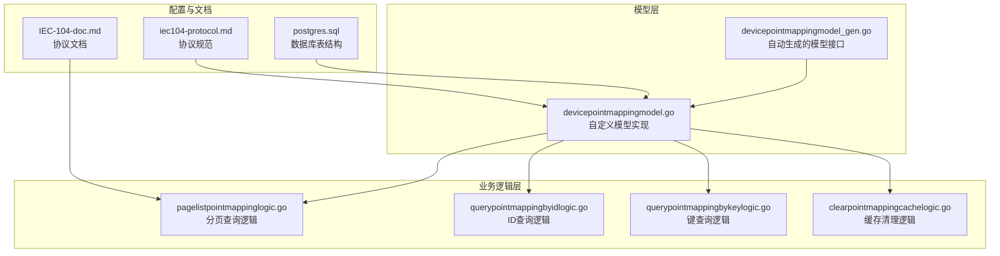
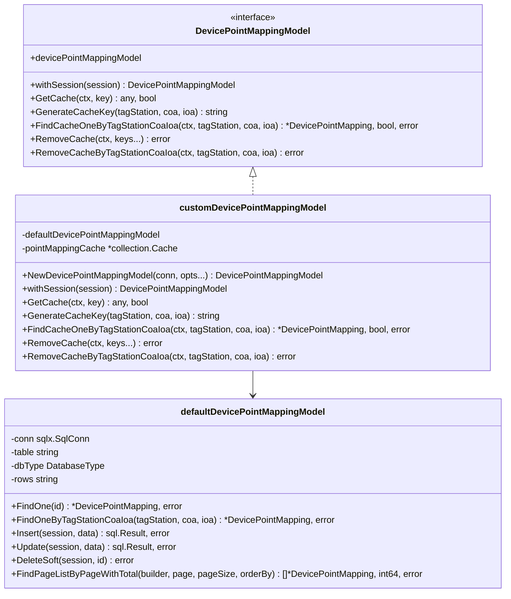
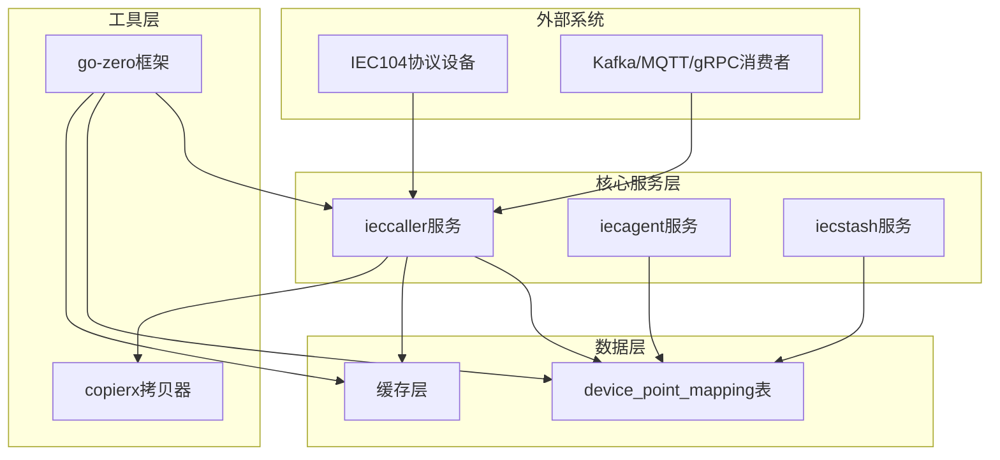
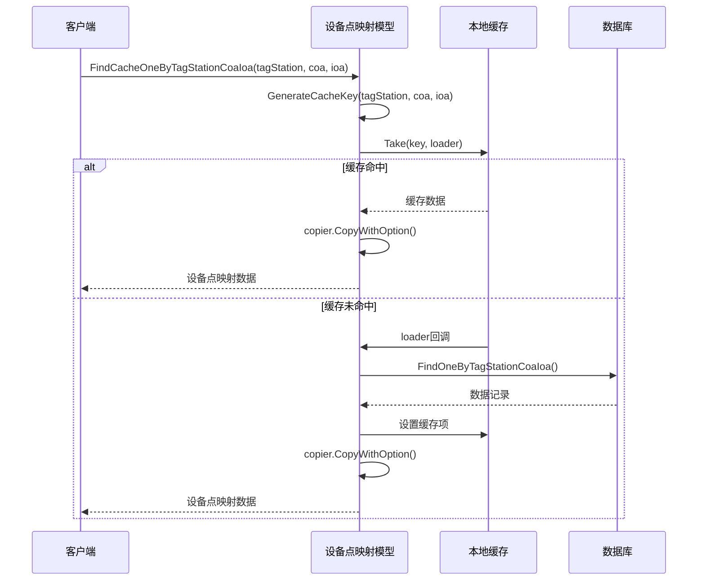
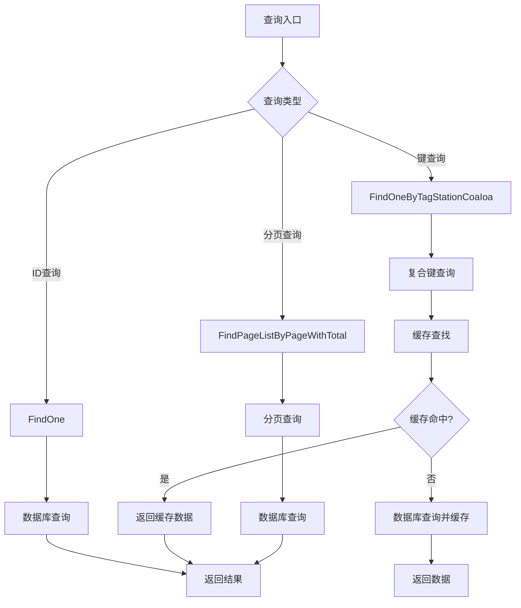
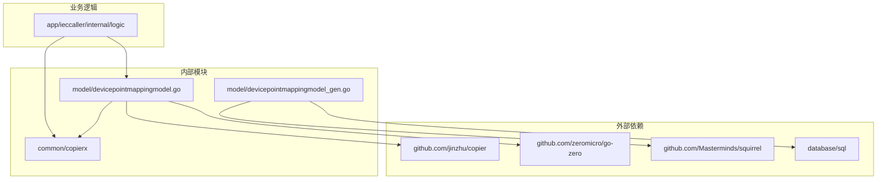

# 设备点映射模型

<cite>
**本文档引用的文件**
- [devicepointmappingmodel.go](file://model/devicepointmappingmodel.go)
- [devicepointmappingmodel_gen.go](file://model/devicepointmappingmodel_gen.go)
- [pagelistpointmappinglogic.go](file://app/ieccaller/internal/logic/pagelistpointmappinglogic.go)
- [querypointmappingbyidlogic.go](file://app/ieccaller/internal/logic/querypointmappingbyidlogic.go)
- [querypointmappingbykeylogic.go](file://app/ieccaller/internal/logic/querypointmappingbykeylogic.go)
- [clearpointmappingcachelogic.go](file://app/ieccaller/internal/logic/clearpointmappingcachelogic.go)
- [postgres.sql](file://model/sql/postgres.sql)
- [IEC-104-doc.md](file://common/iec104/IEC-104-doc.md)
- [iec104-protocol.md](file://docs/iec104-protocol.md)
</cite>

## 目录
1. [简介](#简介)
2. [项目结构](#项目结构)
3. [核心组件](#核心组件)
4. [架构概览](#架构概览)
5. [详细组件分析](#详细组件分析)
6. [依赖分析](#依赖分析)
7. [性能考虑](#性能考虑)
8. [故障排除指南](#故障排除指南)
9. [结论](#结论)
10. [附录](#附录)

## 简介

设备点映射模型（DevicePointMapping）是零服务架构中的核心数据模型，负责将IEC 60870-5-104协议中的物理设备点位映射到系统中的逻辑标识。该模型在智能电网监控、工业自动化等领域发挥着关键作用，通过建立从站地址（COA）、信息对象地址（IOA）到设备标识的映射关系，实现了协议数据与业务系统的无缝对接。

该模型不仅提供了完整的数据库持久化能力，还集成了高效的缓存机制，支持基于tag_station、coa、ioa的复合键缓存策略，显著提升了系统的响应性能和并发处理能力。

## 项目结构

设备点映射模型在项目中的组织结构如下：

**图表来源**
- [devicepointmappingmodel.go:1-108](file://model/devicepointmappingmodel.go#L1-L108)
- [devicepointmappingmodel_gen.go:1-549](file://model/devicepointmappingmodel_gen.go#L1-L549)

**章节来源**
- [devicepointmappingmodel.go:1-108](file://model/devicepointmappingmodel.go#L1-L108)
- [devicepointmappingmodel_gen.go:1-549](file://model/devicepointmappingmodel_gen.go#L1-L549)

## 核心组件

### 主要接口定义

设备点映射模型采用接口分离的设计模式，将基础数据库操作与自定义缓存功能分离：

**图表来源**
- [devicepointmappingmodel.go:17-33](file://model/devicepointmappingmodel.go#L17-L33)
- [devicepointmappingmodel_gen.go:23-57](file://model/devicepointmappingmodel_gen.go#L23-L57)

### 数据模型结构

设备点映射模型的核心数据结构定义如下：

| 字段名 | 类型 | 约束 | 说明 |
|--------|------|------|------|
| id | int64 | 主键, 自增 | 自增主键ID |
| create_time | time.Time | 非空 | 创建时间 |
| update_time | time.Time | 非空 | 更新时间 |
| delete_time | sql.NullTime | 可空 | 删除时间（软删除标记） |
| del_state | int64 | 非空, 默认0 | 删除状态：0-未删除，1-已删除 |
| version | int64 | 非空, 默认0 | 版本号（乐观锁） |
| create_user | string | 非空, 默认'' | 创建人 |
| update_user | string | 非空, 默认'' | 更新人 |
| dept_code | string | 非空, 默认'' | 机构code |
| tag_station | string | 非空, 默认'', 唯一索引 | 与TDengine tag_station对应 |
| coa | int64 | 非空, 默认0, 唯一索引 | 与TDengine coa对应 |
| ioa | int64 | 非空, 默认0, 唯一索引 | 与TDengine ioa对应 |
| device_id | string | 非空, 默认'' | 设备编号/ID |
| device_name | string | 非空, 默认'' | 设备名称 |
| td_table_type | string | 非空, 默认'' | TDengine表类型（遥信表/遥测表等，逗号分隔） |
| enable_push | int64 | 非空, 默认1 | 是否允许caller服务推送数据：0-不允许，1-允许 |
| enable_raw_insert | int64 | 非空, 默认1 | 是否允许插入raw原生数据：0-否，1-是 |
| description | sql.NullString | 可空 | 备注信息 |
| ext_1 | sql.NullString | 可空 | 扩展字段1，如：alarm, normal, control等 |
| ext_2 | sql.NullString | 可空 | 扩展字段2 |
| ext_3 | sql.NullString | 可空 | 扩展字段3 |
| ext_4 | sql.NullString | 可空 | 扩展字段4 |
| ext_5 | sql.NullString | 可空 | 扩展字段5 |

**章节来源**
- [devicepointmappingmodel_gen.go:59-83](file://model/devicepointmappingmodel_gen.go#L59-L83)
- [postgres.sql:24-48](file://model/sql/postgres.sql#L24-L48)

## 架构概览

设备点映射模型在整个系统架构中的位置和交互关系：

**图表来源**
- [devicepointmappingmodel.go:39-44](file://model/devicepointmappingmodel.go#L39-L44)
- [pagelistpointmappinglogic.go:30-60](file://app/ieccaller/internal/logic/pagelistpointmappinglogic.go#L30-L60)

## 详细组件分析

### 缓存机制实现

设备点映射模型采用了高效的本地缓存策略，通过go-zero的collection.Cache实现：

**图表来源**
- [devicepointmappingmodel.go:74-107](file://model/devicepointmappingmodel.go#L74-L107)

#### 缓存键生成策略

缓存键采用统一的命名规范：`pm:{tag_station}:{coa}:{ioa}`，确保了键的唯一性和可预测性。

#### 缓存失效时间

默认缓存过期时间为24小时，适用于大多数场景下的性能平衡。

#### 缓存更新机制

缓存更新采用懒加载策略，首次访问时从数据库加载并缓存，后续访问直接从缓存获取。

**章节来源**
- [devicepointmappingmodel.go:36-107](file://model/devicepointmappingmodel.go#L36-L107)

### CRUD操作实现

#### 查询操作

**图表来源**
- [devicepointmappingmodel_gen.go:113-153](file://model/devicepointmappingmodel_gen.go#L113-L153)
- [pagelistpointmappinglogic.go:30-60](file://app/ieccaller/internal/logic/pagelistpointmappinglogic.go#L30-L60)

#### 写入操作

写入操作支持普通更新和版本控制更新两种模式：

- **普通更新**：直接更新指定字段
- **版本更新**：使用乐观锁机制，防止并发更新冲突

**章节来源**
- [devicepointmappingmodel_gen.go:197-259](file://model/devicepointmappingmodel_gen.go#L197-L259)

### 业务逻辑集成

#### 分页查询逻辑

分页查询逻辑支持多条件过滤，包括tag_station、coa、device_id等字段的精确匹配。

#### ID查询逻辑

ID查询逻辑提供单条记录的快速检索，适用于已知主键的场景。

#### 键查询逻辑

键查询逻辑基于复合键（tag_station、coa、ioa）进行精确匹配，这是IEC104协议场景下的核心查询方式。

**章节来源**
- [pagelistpointmappinglogic.go:29-60](file://app/ieccaller/internal/logic/pagelistpointmappinglogic.go#L29-L60)
- [querypointmappingbyidlogic.go:29-45](file://app/ieccaller/internal/logic/querypointmappingbyidlogic.go#L29-L45)
- [querypointmappingbykeylogic.go:29-45](file://app/ieccaller/internal/logic/querypointmappingbykeylogic.go#L29-L45)

## 依赖分析

设备点映射模型的依赖关系图：

**图表来源**
- [devicepointmappingmodel.go:3-12](file://model/devicepointmappingmodel.go#L3-L12)
- [devicepointmappingmodel_gen.go:7-16](file://model/devicepointmappingmodel_gen.go#L7-L16)

**章节来源**
- [devicepointmappingmodel.go:3-12](file://model/devicepointmappingmodel.go#L3-L12)
- [devicepointmappingmodel_gen.go:7-16](file://model/devicepointmappingmodel_gen.go#L7-L16)

## 性能考虑

### 缓存策略优化

1. **缓存预热**：对于热点数据，可以预先加载到缓存中
2. **批量查询**：支持批量键查询，减少数据库访问次数
3. **缓存淘汰**：合理设置缓存过期时间，平衡内存使用和查询性能

### 数据库优化

1. **索引设计**：复合索引（tag_station, coa, ioa）确保查询性能
2. **查询优化**：使用LIMIT和分页机制避免大量数据传输
3. **连接池**：利用go-zero的连接池机制提升并发性能

### 并发处理

1. **乐观锁**：版本控制机制防止并发更新冲突
2. **事务支持**：支持数据库事务操作
3. **会话管理**：支持数据库会话的传递和管理

## 故障排除指南

### 常见问题及解决方案

#### 缓存相关问题

1. **缓存未命中**：检查缓存键生成是否正确
2. **缓存数据过期**：调整缓存过期时间或手动刷新缓存
3. **缓存内存不足**：监控缓存使用情况，必要时增加内存或调整缓存策略

#### 数据库相关问题

1. **查询超时**：检查复合索引是否生效，优化查询条件
2. **并发冲突**：使用版本更新机制，避免乐观锁异常
3. **连接池耗尽**：增加连接池大小或优化查询性能

#### 协议相关问题

1. **IEC104数据映射错误**：验证tag_station、coa、ioa的对应关系
2. **Topic生成异常**：检查扩展字段（ext_1-ext_5）的配置
3. **消息推送失败**：验证目标系统的连接配置

**章节来源**
- [clearpointmappingcachelogic.go:26-60](file://app/ieccaller/internal/logic/clearpointmappingcachelogic.go#L26-L60)

## 结论

设备点映射模型通过精心设计的数据结构、高效的缓存机制和完善的业务逻辑，为IEC104协议的数据处理提供了坚实的基础。该模型不仅满足了实时监控系统对性能的要求，还通过灵活的扩展字段支持了多样化的业务场景。

模型的关键优势包括：
- **高性能缓存**：显著降低数据库访问压力
- **强一致性**：通过版本控制确保数据一致性
- **灵活扩展**：支持多种查询条件和业务场景
- **协议兼容**：完美适配IEC104协议规范

## 附录

### IEC104协议对应关系

| IEC104字段 | 设备点映射字段 | 说明 |
|------------|----------------|------|
| COA | coa | 公共地址，标识RTU、子站或子系统 |
| IOA | ioa | 信息对象地址，标识具体的信息对象 |
| 从站IP | tag_station | 设备分组标识，对应TDengine的tag_station |
| 设备ID | device_id | 设备唯一标识符 |
| 设备名称 | device_name | 设备显示名称 |
| ASDU类型 | td_table_type | TDengine表类型，用于数据存储分类 |

### 最佳实践建议

1. **缓存管理**：定期监控缓存命中率，及时清理过期数据
2. **索引优化**：根据查询模式调整索引策略
3. **错误处理**：完善异常处理机制，确保系统稳定性
4. **性能监控**：建立完善的性能监控体系，及时发现和解决问题

**章节来源**
- [IEC-104-doc.md:1-800](file://common/iec104/IEC-104-doc.md#L1-L800)
- [iec104-protocol.md:147-163](file://docs/iec104-protocol.md#L147-L163)