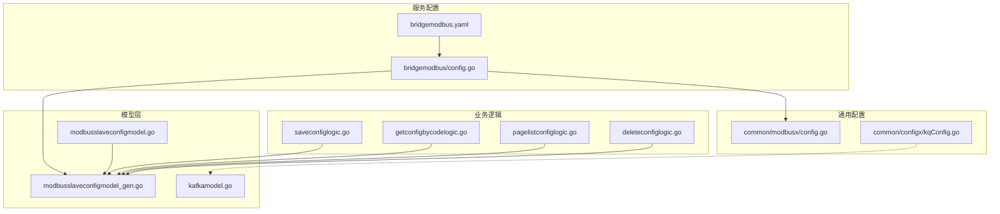
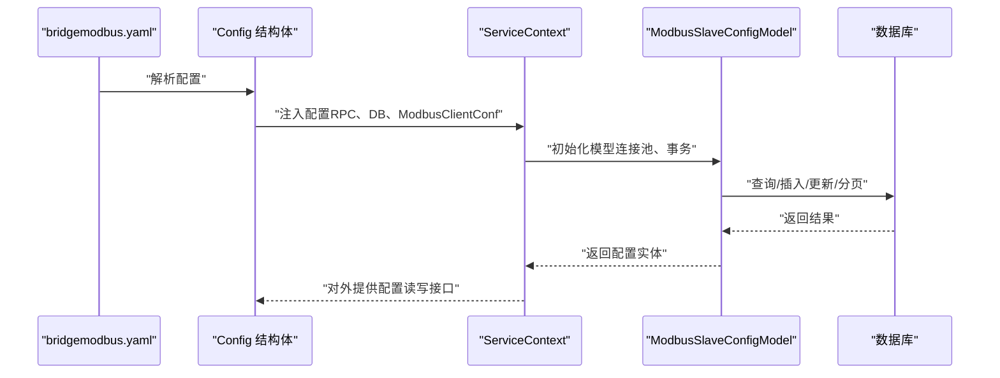
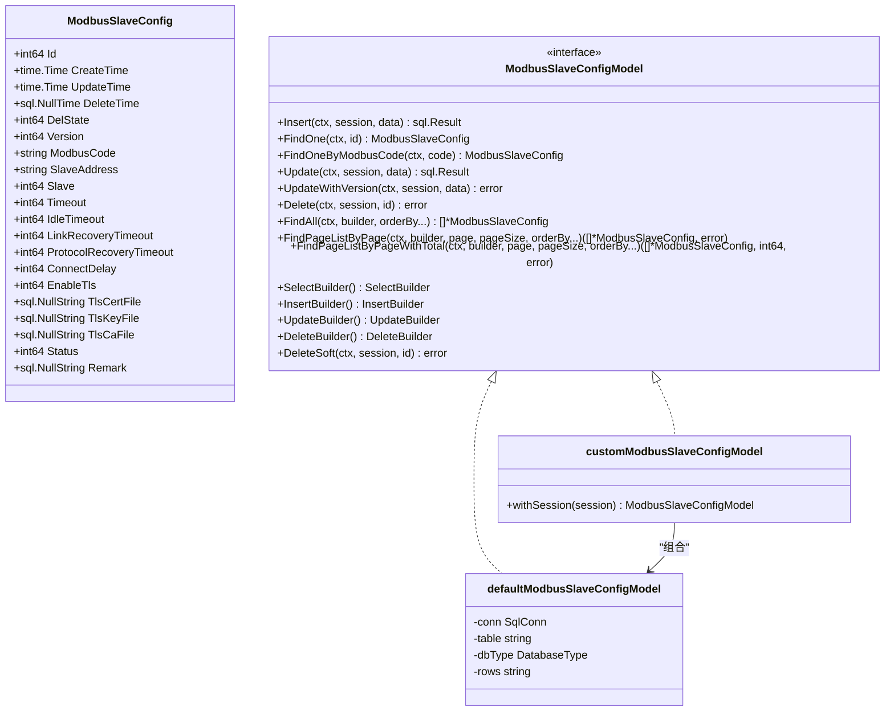
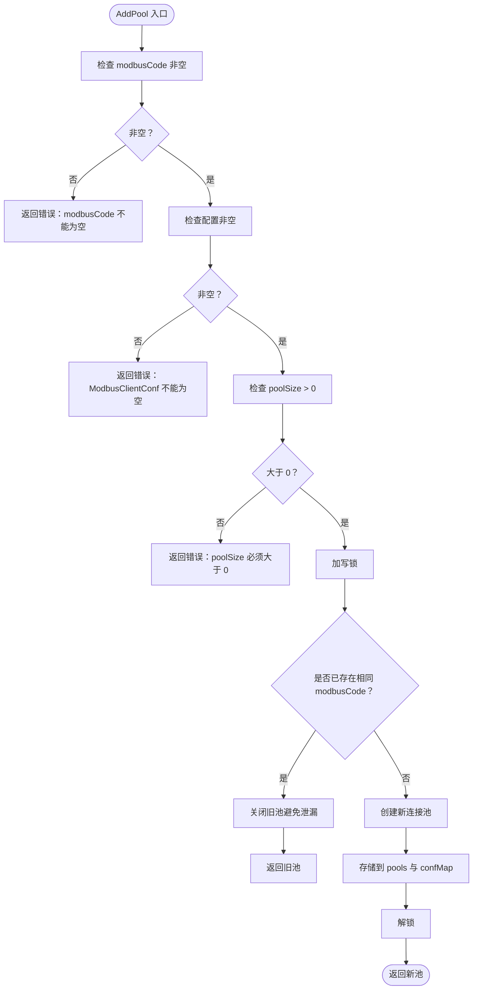
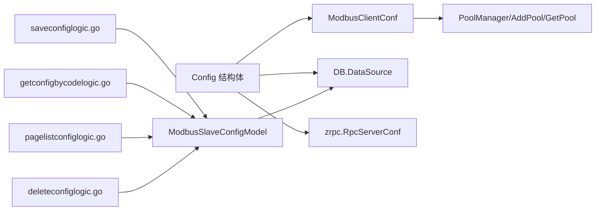

# 配置管理模型

<cite>
**本文引用的文件**
- [model/modbusslaveconfigmodel.go](file://model/modbusslaveconfigmodel.go)
- [model/modbusslaveconfigmodel_gen.go](file://model/modbusslaveconfigmodel_gen.go)
- [common/modbusx/config.go](file://common/modbusx/config.go)
- [app/bridgemodbus/internal/config/config.go](file://app/bridgemodbus/internal/config/config.go)
- [app/bridgemodbus/etc/bridgemodbus.yaml](file://app/bridgemodbus/etc/bridgemodbus.yaml)
- [app/bridgemodbus/internal/logic/saveconfiglogic.go](file://app/bridgemodbus/internal/logic/saveconfiglogic.go)
- [app/bridgemodbus/internal/logic/getconfigbycodelogic.go](file://app/bridgemodbus/internal/logic/getconfigbycodelogic.go)
- [app/bridgemodbus/internal/logic/pagelistconfiglogic.go](file://app/bridgemodbus/internal/logic/pagelistconfiglogic.go)
- [app/bridgemodbus/internal/logic/deleteconfiglogic.go](file://app/bridgemodbus/internal/logic/deleteconfiglogic.go)
- [common/configx/kqConfig.go](file://common/configx/kqConfig.go)
- [model/kafkamodel.go](file://model/kafkamodel.go)
- [util/config.yaml](file://util/config.yaml)
</cite>

## 目录
1. [引言](#引言)
2. [项目结构](#项目结构)
3. [核心组件](#核心组件)
4. [架构总览](#架构总览)
5. [详细组件分析](#详细组件分析)
6. [依赖分析](#依赖分析)
7. [性能考量](#性能考量)
8. [故障排查指南](#故障排查指南)
9. [结论](#结论)
10. [附录](#附录)

## 引言
本技术文档围绕配置管理相关模型展开，重点覆盖以下内容：
- Modbus 从站配置模型（ModbusSlaveConfig）的设计与实现，包括设备配置、寄存器映射相关参数、通信参数设置与数据库持久化策略。
- Kafka 配置模型的用途与字段定义，涵盖主题配置、消费者组设置与集群连接参数。
- 配置数据的存储策略、版本管理与热更新机制。
- 配置验证规则、默认值设置与错误处理方案。
- 配置与服务启动的关系、动态配置加载与配置变更通知机制。
- 配置安全性考虑、敏感信息加密与访问控制。
- 配置管理的最佳实践与运维建议。

## 项目结构
本仓库采用多服务架构，每个服务在 etc 下维护独立的 YAML 配置文件；通用配置模型位于 model 层，Modbus 通信配置位于 common/modbusx；部分服务通过逻辑层对配置进行增删改查操作。

图表来源
- [app/bridgemodbus/etc/bridgemodbus.yaml:1-26](file://app/bridgemodbus/etc/bridgemodbus.yaml#L1-L26)
- [app/bridgemodbus/internal/config/config.go:1-26](file://app/bridgemodbus/internal/config/config.go#L1-L26)
- [common/modbusx/config.go:1-125](file://common/modbusx/config.go#L1-L125)
- [model/modbusslaveconfigmodel_gen.go:1-565](file://model/modbusslaveconfigmodel_gen.go#L1-L565)
- [model/modbusslaveconfigmodel.go:1-32](file://model/modbusslaveconfigmodel.go#L1-L32)
- [model/kafkamodel.go:1-185](file://model/kafkamodel.go#L1-L185)
- [common/configx/kqConfig.go:1-7](file://common/configx/kqConfig.go#L1-L7)
- [app/bridgemodbus/internal/logic/saveconfiglogic.go:1-62](file://app/bridgemodbus/internal/logic/saveconfiglogic.go#L1-L62)
- [app/bridgemodbus/internal/logic/getconfigbycodelogic.go:1-40](file://app/bridgemodbus/internal/logic/getconfigbycodelogic.go#L1-L40)
- [app/bridgemodbus/internal/logic/pagelistconfiglogic.go:1-53](file://app/bridgemodbus/internal/logic/pagelistconfiglogic.go#L1-L53)
- [app/bridgemodbus/internal/logic/deleteconfiglogic.go:1-37](file://app/bridgemodbus/internal/logic/deleteconfiglogic.go#L1-L37)

章节来源
- [app/bridgemodbus/etc/bridgemodbus.yaml:1-26](file://app/bridgemodbus/etc/bridgemodbus.yaml#L1-L26)
- [app/bridgemodbus/internal/config/config.go:1-26](file://app/bridgemodbus/internal/config/config.go#L1-L26)
- [common/modbusx/config.go:1-125](file://common/modbusx/config.go#L1-L125)
- [model/modbusslaveconfigmodel_gen.go:1-565](file://model/modbusslaveconfigmodel_gen.go#L1-L565)
- [model/modbusslaveconfigmodel.go:1-32](file://model/modbusslaveconfigmodel.go#L1-L32)
- [model/kafkamodel.go:1-185](file://model/kafkamodel.go#L1-L185)
- [common/configx/kqConfig.go:1-7](file://common/configx/kqConfig.go#L1-L7)
- [app/bridgemodbus/internal/logic/saveconfiglogic.go:1-62](file://app/bridgemodbus/internal/logic/saveconfiglogic.go#L1-L62)
- [app/bridgemodbus/internal/logic/getconfigbycodelogic.go:1-40](file://app/bridgemodbus/internal/logic/getconfigbycodelogic.go#L1-L40)
- [app/bridgemodbus/internal/logic/pagelistconfiglogic.go:1-53](file://app/bridgemodbus/internal/logic/pagelistconfiglogic.go#L1-L53)
- [app/bridgemodbus/internal/logic/deleteconfiglogic.go:1-37](file://app/bridgemodbus/internal/logic/deleteconfiglogic.go#L1-L37)

## 核心组件
- Modbus 从站配置模型（ModbusSlaveConfig）
  - 数据库表映射与 CRUD 接口：通过生成的 defaultModbusSlaveConfigModel 提供插入、查询、分页、软删除、带版本号的更新等能力。
  - 自定义扩展：customModbusSlaveConfigModel 实现 ModbusSlaveConfigModel 接口，并支持 withSession 在事务中传递会话。
  - 字段覆盖：包含主键、时间戳、软删除、版本号、唯一编码、从站地址、超时与重连参数、TLS 开关与证书路径、状态与备注等。
- Modbus 通信配置（ModbusClientConf）
  - 地址与从站：Address（IP:Port）、Slave（Unit ID）。
  - 超时与重连：Timeout、IdleTimeout、LinkRecoveryTimeout、ProtocolRecoveryTimeout。
  - 连接延迟：ConnectDelay。
  - TLS：Enable、CertFile、KeyFile、CAFile。
- Kafka 配置模型
  - 通用结构：KqConfig（Brokers、Topic）。
  - 业务数据结构：TerminalBind、EventData、TerminalData、AlarmData 及其子结构（TerminalInfo、Location、Position、Status 等），用于描述终端绑定、事件、位置与报警等场景的数据载体。
- 服务配置（bridgemodbus）
  - RPC 服务配置：继承 zrpc.RpcServerConf，包含服务名、监听地址、超时、日志级别等。
  - 连接池：ModbusPool（默认 32）。
  - 注册中心：NacosConfig（可选开关、主机、端口、用户名、密码、命名空间、服务名）。
  - 数据源：DB.DataSource（MySQL 示例）。
  - Modbus 客户端配置：ModbusClientConf（Address、Slave 等）。

章节来源
- [model/modbusslaveconfigmodel_gen.go:59-81](file://model/modbusslaveconfigmodel_gen.go#L59-L81)
- [model/modbusslaveconfigmodel.go:10-31](file://model/modbusslaveconfigmodel.go#L10-L31)
- [common/modbusx/config.go:32-61](file://common/modbusx/config.go#L32-L61)
- [common/configx/kqConfig.go:1-7](file://common/configx/kqConfig.go#L1-L7)
- [model/kafkamodel.go:3-185](file://model/kafkamodel.go#L3-L185)
- [app/bridgemodbus/internal/config/config.go:9-25](file://app/bridgemodbus/internal/config/config.go#L9-L25)
- [app/bridgemodbus/etc/bridgemodbus.yaml:1-26](file://app/bridgemodbus/etc/bridgemodbus.yaml#L1-L26)

## 架构总览
下图展示配置在服务中的流转：YAML 配置被解析为服务配置结构体，服务启动时加载数据库连接与 Modbus 客户端配置；业务逻辑通过模型层对配置进行持久化与查询。

图表来源
- [app/bridgemodbus/etc/bridgemodbus.yaml:1-26](file://app/bridgemodbus/etc/bridgemodbus.yaml#L1-L26)
- [app/bridgemodbus/internal/config/config.go:9-25](file://app/bridgemodbus/internal/config/config.go#L9-L25)
- [model/modbusslaveconfigmodel_gen.go:83-94](file://model/modbusslaveconfigmodel_gen.go#L83-L94)
- [model/modbusslaveconfigmodel.go:21-31](file://model/modbusslaveconfigmodel.go#L21-L31)

## 详细组件分析

### Modbus 从站配置模型（ModbusSlaveConfig）
- 设计要点
  - 表结构与字段：主键、时间戳、软删除、版本号、唯一编码、从站地址、超时与重连参数、TLS 开关与证书路径、状态与备注。
  - 接口契约：提供 Insert、FindOne、FindOneByModbusCode、Update、UpdateWithVersion、Delete、FindAll、FindPageListByPage、FindPageListByPageWithTotal、SelectBuilder/InsertBuilder/UpdateBuilder/DeleteBuilder 等方法。
  - 事务与会话：withSession 支持在事务中传递会话，保证一致性。
  - 版本控制：UpdateWithVersion 使用乐观锁，基于 version 字段防止并发覆盖。
  - 软删除：DeleteSoft 将 DelState 置 1 并记录 DeleteTime，查询时自动过滤 del_state=0。
- 数据流
  - 保存配置：业务逻辑调用 FindOneByModbusCode 判断是否存在，存在则 Update，否则 Insert。
  - 查询配置：GetConfigByCode 通过 FindOneByModbusCode 获取并转换为 PB 结构。
  - 分页列表：Paginate 使用 SelectBuilder 动态拼接 where 条件，返回列表与总数。
  - 删除配置：Delete 支持批量删除。

图表来源
- [model/modbusslaveconfigmodel_gen.go:24-81](file://model/modbusslaveconfigmodel_gen.go#L24-L81)
- [model/modbusslaveconfigmodel.go:10-31](file://model/modbusslaveconfigmodel.go#L10-L31)

章节来源
- [model/modbusslaveconfigmodel_gen.go:59-81](file://model/modbusslaveconfigmodel_gen.go#L59-L81)
- [model/modbusslaveconfigmodel_gen.go:152-256](file://model/modbusslaveconfigmodel_gen.go#L152-L256)
- [model/modbusslaveconfigmodel_gen.go:317-396](file://model/modbusslaveconfigmodel_gen.go#L317-L396)
- [model/modbusslaveconfigmodel_gen.go:440-453](file://model/modbusslaveconfigmodel_gen.go#L440-L453)
- [model/modbusslaveconfigmodel.go:21-31](file://model/modbusslaveconfigmodel.go#L21-L31)

### Modbus 通信配置（ModbusClientConf）
- 字段定义
  - Address：TCP 设备地址（IP:Port）。
  - Slave：从站地址（Unit ID），默认 1。
  - Timeout：发送/接收超时（毫秒），默认 10000。
  - IdleTimeout：空闲连接自动关闭时间（毫秒），默认 60000。
  - LinkRecoveryTimeout：TCP 连接出错重连间隔（毫秒），默认 3000。
  - ProtocolRecoveryTimeout：协议异常重试间隔（毫秒），默认 2000。
  - ConnectDelay：连接建立后等待时间（毫秒），默认 100。
  - TLS：Enable、CertFile、KeyFile、CAFile。
- 默认值与校验
  - 默认值通过 JSON tag 的 default 指示，运行时由框架解析。
  - 校验逻辑在 PoolManager.AddPool 中体现：modbusCode 非空、配置非空、池大小必须大于 0。
- 连接池管理
  - PoolManager 维护 modbusCode -> Pool 映射与配置映射，支持并发安全的 AddPool 与 GetPool。

图表来源
- [common/modbusx/config.go:81-107](file://common/modbusx/config.go#L81-L107)

章节来源
- [common/modbusx/config.go:32-61](file://common/modbusx/config.go#L32-L61)
- [common/modbusx/config.go:81-125](file://common/modbusx/config.go#L81-L125)

### Kafka 配置模型
- 通用配置
  - KqConfig：包含 Brokers（集群地址列表）与 Topic（主题）。
- 业务数据结构
  - TerminalBind：终端绑定/解绑事件，包含数据标签、动作、终端 ID/编号、员工身份证号、跟踪对象 ID/编号/类型/名称、操作时间等。
  - EventData：事件数据，包含事件 ID/标题/编码、服务端/终端时间、终端信息、位置信息。
  - TerminalData：终端实时数据，包含终端信息、上报时间、位置、建筑信息、设备状态。
  - AlarmData：报警数据，包含报警 ID/名称/编号/编码/等级、关联终端编号列表、跟踪主体信息、监控对象类型、触发位置、起始/结束围栏、起止时间、持续时长、状态。
  - 子结构：TerminalInfo、Location、Position、Status、LocationPosition、FenceInfo 等。
- 用途
  - 作为跨服务间的消息载体，用于终端绑定、事件推送、位置上报与报警联动等场景。

章节来源
- [common/configx/kqConfig.go:1-7](file://common/configx/kqConfig.go#L1-L7)
- [model/kafkamodel.go:3-185](file://model/kafkamodel.go#L3-L185)

### 服务配置与启动关系
- bridgemodbus 服务配置
  - RPC 服务配置：Name、ListenOn、Timeout、Mode、Log 等。
  - 连接池：ModbusPool（默认 32）。
  - 注册中心：NacosConfig（可选）。
  - 数据库：DB.DataSource（MySQL 示例）。
  - Modbus 客户端配置：ModbusClientConf（Address、Slave 等）。
- 启动流程
  - 读取 YAML -> 解析 Config -> 初始化 RPC 服务、数据库连接、Modbus 客户端配置。
  - 业务逻辑通过 ServiceContext 获取 ModbusSlaveConfigModel 执行配置管理。

章节来源
- [app/bridgemodbus/etc/bridgemodbus.yaml:1-26](file://app/bridgemodbus/etc/bridgemodbus.yaml#L1-L26)
- [app/bridgemodbus/internal/config/config.go:9-25](file://app/bridgemodbus/internal/config/config.go#L9-L25)

### 动态配置加载与变更通知
- 动态加载
  - 通过 YAML 配置文件在服务启动时一次性加载，运行期不直接热更新。
  - 如需热更新，可在业务层引入配置中心（如 Nacos）拉取最新配置并重建连接池或刷新缓存。
- 变更通知
  - 未见内置的配置变更广播机制；可通过外部消息队列或注册中心事件实现变更通知。

章节来源
- [app/bridgemodbus/etc/bridgemodbus.yaml:1-26](file://app/bridgemodbus/etc/bridgemodbus.yaml#L1-L26)
- [app/bridgemodbus/internal/config/config.go:12-20](file://app/bridgemodbus/internal/config/config.go#L12-L20)

## 依赖分析
- 组件耦合
  - 业务逻辑依赖 ServiceContext，ServiceContext 依赖模型层（ModbusSlaveConfigModel）。
  - 服务配置（Config）依赖 ModbusClientConf 与数据库连接。
  - Kafka 模型与 KqConfig 为松耦合，用于消息传输。
- 外部依赖
  - 数据库：sqlx、squirrel。
  - 序列化与拷贝：PB、copier。
  - 日志：logx。

图表来源
- [app/bridgemodbus/internal/config/config.go:9-25](file://app/bridgemodbus/internal/config/config.go#L9-L25)
- [common/modbusx/config.go:64-125](file://common/modbusx/config.go#L64-L125)
- [app/bridgemodbus/internal/logic/saveconfiglogic.go:28-61](file://app/bridgemodbus/internal/logic/saveconfiglogic.go#L28-L61)
- [app/bridgemodbus/internal/logic/getconfigbycodelogic.go:29-38](file://app/bridgemodbus/internal/logic/getconfigbycodelogic.go#L29-L38)
- [app/bridgemodbus/internal/logic/pagelistconfiglogic.go:30-51](file://app/bridgemodbus/internal/logic/pagelistconfiglogic.go#L30-L51)
- [app/bridgemodbus/internal/logic/deleteconfiglogic.go:26-36](file://app/bridgemodbus/internal/logic/deleteconfiglogic.go#L26-L36)
- [model/modbusslaveconfigmodel_gen.go:83-94](file://model/modbusslaveconfigmodel_gen.go#L83-L94)

章节来源
- [app/bridgemodbus/internal/config/config.go:9-25](file://app/bridgemodbus/internal/config/config.go#L9-L25)
- [common/modbusx/config.go:64-125](file://common/modbusx/config.go#L64-L125)
- [app/bridgemodbus/internal/logic/saveconfiglogic.go:28-61](file://app/bridgemodbus/internal/logic/saveconfiglogic.go#L28-L61)
- [app/bridgemodbus/internal/logic/getconfigbycodelogic.go:29-38](file://app/bridgemodbus/internal/logic/getconfigbycodelogic.go#L29-L38)
- [app/bridgemodbus/internal/logic/pagelistconfiglogic.go:30-51](file://app/bridgemodbus/internal/logic/pagelistconfiglogic.go#L30-L51)
- [app/bridgemodbus/internal/logic/deleteconfiglogic.go:26-36](file://app/bridgemodbus/internal/logic/deleteconfiglogic.go#L26-L36)
- [model/modbusslaveconfigmodel_gen.go:83-94](file://model/modbusslaveconfigmodel_gen.go#L83-L94)

## 性能考量
- 连接池规模：ModbusPool 默认 32，应根据设备并发访问量与网络状况调整。
- 查询优化：分页查询使用按 id 排序，建议在 modbus_code、status 等常用过滤字段上建立索引以提升性能。
- 事务与会话：使用 withSession 在事务中执行多步操作，减少锁竞争与重复连接成本。
- 超时参数：合理设置 Timeout、IdleTimeout、LinkRecoveryTimeout、ProtocolRecoveryTimeout，避免频繁重试与资源占用。
- TLS：启用 TLS 会增加握手与加解密开销，仅在需要安全传输时开启。

## 故障排查指南
- 常见错误与处理
  - 未找到配置：FindOne/FindOneByModbusCode 返回 ErrNotFound，需确认 modbus_code 是否正确或是否已被软删除。
  - 并发更新失败：UpdateWithVersion 返回 ErrNoRowsUpdate，提示版本冲突，需重试或回退。
  - 删除失败：DeleteSoft 内部封装错误信息，检查软删除条件与事务提交。
  - 连接池问题：AddPool 校验失败时返回明确错误，检查 modbusCode、配置与池大小。
- 日志与可观测性
  - 服务日志：Log.Path、Log.Level、Log.KeepDays 控制日志输出路径、级别与保留天数。
  - 连接池日志：PoolManager 在创建与覆盖旧池时输出 Info/错误日志，便于定位问题。

章节来源
- [model/modbusslaveconfigmodel_gen.go:110-150](file://model/modbusslaveconfigmodel_gen.go#L110-L150)
- [model/modbusslaveconfigmodel_gen.go:220-256](file://model/modbusslaveconfigmodel_gen.go#L220-L256)
- [model/modbusslaveconfigmodel_gen.go:258-272](file://model/modbusslaveconfigmodel_gen.go#L258-L272)
- [common/modbusx/config.go:81-107](file://common/modbusx/config.go#L81-L107)
- [app/bridgemodbus/etc/bridgemodbus.yaml:5-11](file://app/bridgemodbus/etc/bridgemodbus.yaml#L5-L11)

## 结论
本配置管理体系以 YAML 为入口，结合通用 Modbus 配置与模型层持久化能力，实现了从站配置的全生命周期管理。通过版本控制与软删除保障数据一致性，通过连接池与超时参数优化性能与稳定性。建议在生产环境中引入配置中心与变更通知机制，配合 TLS 加密与最小权限原则，确保配置安全与可追溯。

## 附录
- 最佳实践
  - 配置中心：将 YAML 替换为配置中心（如 Nacos），支持热更新与灰度发布。
  - 安全性：敏感信息（证书、密码）通过环境变量或密文存储，避免明文写入配置文件。
  - 监控告警：对连接池使用率、超时与重试次数、数据库慢查询进行监控。
  - 备份与回滚：对配置变更进行版本化管理，支持一键回滚。
- 运维建议
  - 规范命名：modbus_code 唯一且语义清晰，便于检索与排障。
  - 参数调优：根据设备响应时间与网络质量调整超时与重连参数。
  - 日志轮转：合理设置 Log.KeepDays，避免磁盘占满。
  - 数据库索引：为高频查询字段建立索引，降低查询延迟。