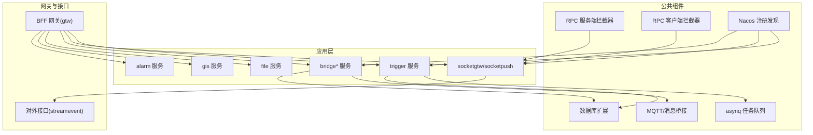
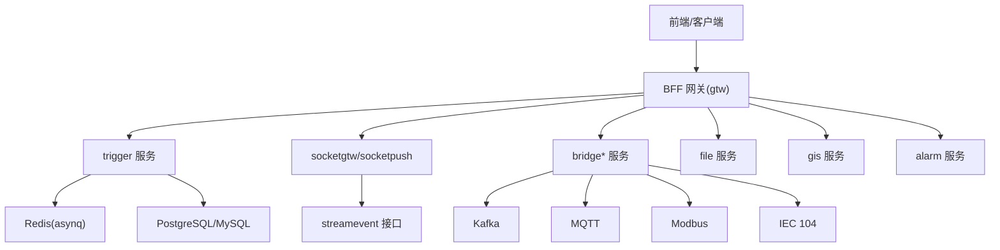
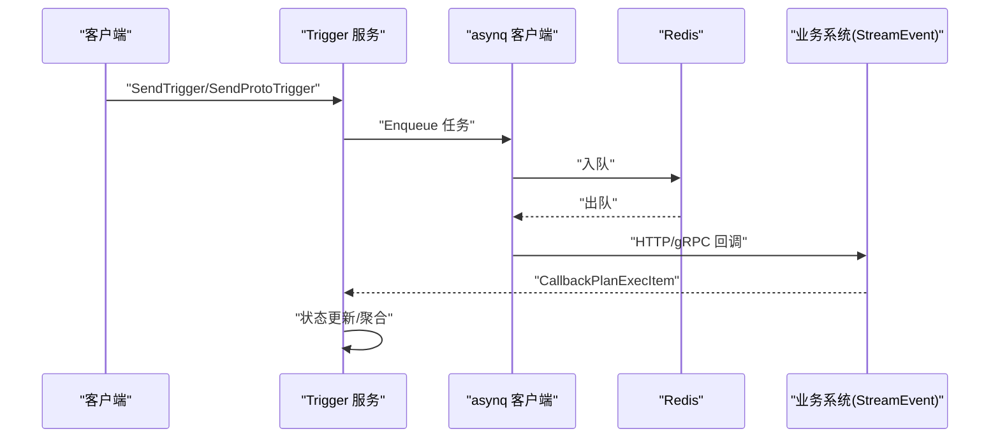
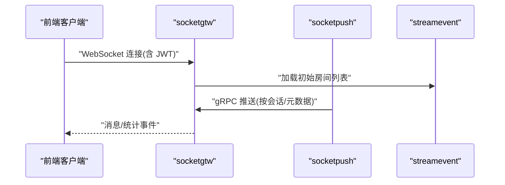
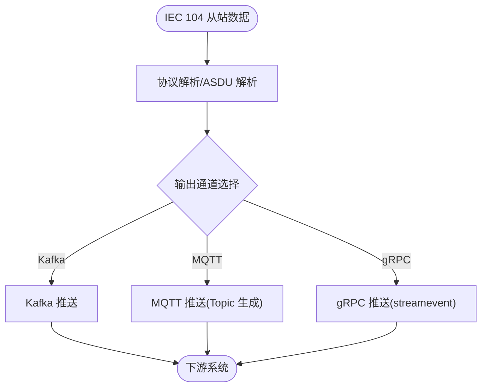
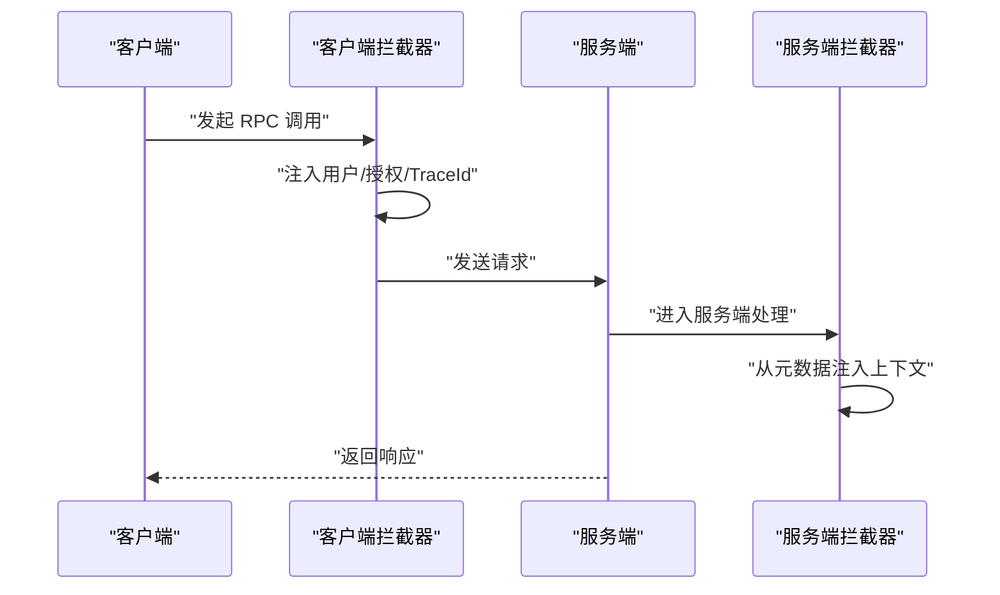
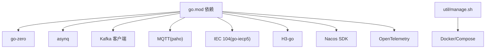

# 代码审查流程

<cite>
**本文引用的文件**   
- [README.md](file://README.md)
- [code.md](file://code.md)
- [common/iec104/IEC-104-doc.md](file://common/iec104/IEC-104-doc.md)
- [docs/trigger.md](file://docs/trigger.md)
- [docs/socketiox-documentation.md](file://docs/socketiox-documentation.md)
- [app/trigger/etc/trigger.yaml](file://app/trigger/etc/trigger.yaml)
- [app/trigger/internal/logic/sendtriggerlogic.go](file://app/trigger/internal/logic/sendtriggerlogic.go)
- [app/trigger/internal/logic/archivetasklogic.go](file://app/trigger/internal/logic/archivetasklogic.go)
- [common/Interceptor/rpcserver/loggerInterceptor.go](file://common/Interceptor/rpcserver/loggerInterceptor.go)
- [common/Interceptor/rpcclient/metadataInterceptor.go](file://common/Interceptor/rpcclient/metadataInterceptor.go)
- [go.mod](file://go.mod)
- [util/manage.sh](file://util/manage.sh)
</cite>

## 目录
1. [引言](#引言)
2. [项目结构](#项目结构)
3. [核心组件](#核心组件)
4. [架构总览](#架构总览)
5. [详细组件分析](#详细组件分析)
6. [依赖分析](#依赖分析)
7. [性能考量](#性能考量)
8. [故障排查指南](#故障排查指南)
9. [结论](#结论)
10. [附录](#附录)

## 引言
本指南面向 zero-service 项目，提供一套系统化的代码审查流程与标准，覆盖提交前检查、审查请求创建、审查者分配、审查结果处理、审查清单、工具使用、同行评议机制以及常见问题与案例。目标是提升代码质量、安全性、性能与可维护性，降低回归风险，保障多协议接入、实时通信、任务调度与数据处理等关键能力的稳定性。

## 项目结构
zero-service 采用 go-zero 微服务架构，围绕 IEC 104 数采、异步任务调度、实时通信、容器管理、地理信息、协议桥接等能力组织模块。项目包含：
- app/*：核心微服务（trigger、socketapp、bridge*、file、gis、alarm 等）
- common/*：公共组件（拦截器、asynq 扩展、Nacos、Modbus、MQTT、OSS、DB 扩展、SocketIO 封装等）
- facade/*：对外接口层（streamevent）
- gtw：BFF 网关
- model：数据库模型与 SQL
- deploy：Docker Compose 编排
- docs/swagger/third_party：文档、Swagger、第三方 proto
- util：运维脚本

图表来源
- [README.md:15-51](file://README.md#L15-L51)
- [docs/trigger.md:12-14](file://docs/trigger.md#L12-L14)
- [docs/socketiox-documentation.md:16-27](file://docs/socketiox-documentation.md#L16-L27)

章节来源
- [README.md:59-108](file://README.md#L59-L108)

## 核心组件
- Trigger 异步任务调度与计划任务引擎：支持 asynq 队列与自研数据库扫描引擎，提供 HTTP/gRPC 回调、重试与状态机管理。
- SocketIO 实时通信：socketgtw + socketpush，支持 JWT 鉴权、房间管理、MQTT 桥接与 gRPC 推送。
- 协议桥接：Modbus、MQTT、IEC 104 等协议接入与消息推送，支持 Kafka/MQTT/gRPC 三通道。
- 文件与地理信息：分片上传、OSS 集成、H3/GeoHash/坐标转换。
- 公共拦截器：RPC 请求上下文注入与日志拦截，统一 TraceId 传播。

章节来源
- [docs/trigger.md:1-284](file://docs/trigger.md#L1-L284)
- [docs/socketiox-documentation.md:1-656](file://docs/socketiox-documentation.md#L1-L656)
- [common/iec104/IEC-104-doc.md:1-903](file://common/iec104/IEC-104-doc.md#L1-L903)

## 架构总览
下图展示零代码服务的整体架构与关键交互路径，涵盖 BFF 网关、微服务、消息中间件、任务队列与外部协议。

图表来源
- [README.md:15-51](file://README.md#L15-L51)
- [docs/trigger.md:22-31](file://docs/trigger.md#L22-L31)
- [docs/socketiox-documentation.md:16-27](file://docs/socketiox-documentation.md#L16-L27)

## 详细组件分析

### 组件 A：Trigger 异步任务调度与计划任务引擎
- 异步任务：基于 asynq 的 Redis 队列，支持延迟/定时任务、HTTP/gRPC 回调、指数退避重试、队列权重与并发控制。
- 计划任务：自研数据库扫描引擎，三级模型 Plan/Batch/ExecItem，状态机 WAITING/RUNNING/COMPLETED/DELAYED/PAUSED/TERMINATED，分布式锁防重与回调聚合。
- 配置：Redis、数据库、StreamEvent 回调端点、Nacos 注册（可选）。

图表来源
- [docs/trigger.md:22-62](file://docs/trigger.md#L22-L62)
- [docs/trigger.md:95-158](file://docs/trigger.md#L95-L158)

章节来源
- [docs/trigger.md:14-176](file://docs/trigger.md#L14-L176)
- [app/trigger/etc/trigger.yaml:19-37](file://app/trigger/etc/trigger.yaml#L19-L37)
- [app/trigger/internal/logic/sendtriggerlogic.go:37-104](file://app/trigger/internal/logic/sendtriggerlogic.go#L37-L104)
- [app/trigger/internal/logic/archivetasklogic.go:26-36](file://app/trigger/internal/logic/archivetasklogic.go#L26-L36)

### 组件 B：SocketIO 实时通信（socketgtw + socketpush）
- socketgtw：WebSocket 连接管理、房间管理、消息路由、JWT 鉴权、统计推送。
- socketpush：Token 生成/验证、按会话/元数据寻址推送、全局广播、服务端控制房间。
- MQTT 桥接：将 MQTT Topic 映射到 SocketIO Room，事件映射配置支持通配符。

图表来源
- [docs/socketiox-documentation.md:16-27](file://docs/socketiox-documentation.md#L16-L27)
- [docs/socketiox-documentation.md:628-644](file://docs/socketiox-documentation.md#L628-L644)

章节来源
- [docs/socketiox-documentation.md:1-656](file://docs/socketiox-documentation.md#L1-L656)

### 组件 C：协议桥接与消息推送（IEC 104、Modbus、MQTT）
- IEC 104：支持多从站、Kafka/MQTT/gRPC 三通道推送，动态 Topic 生成，ASDU 类型映射与消息体结构。
- Modbus：线圈/寄存器读写、设备配置管理、gRPC 集成。
- MQTT：消息发布/订阅、带追踪推送、事件映射。

图表来源
- [common/iec104/IEC-104-doc.md:26-44](file://common/iec104/IEC-104-doc.md#L26-L44)
- [common/iec104/IEC-104-doc.md:123-175](file://common/iec104/IEC-104-doc.md#L123-L175)

章节来源
- [common/iec104/IEC-104-doc.md:1-903](file://common/iec104/IEC-104-doc.md#L1-L903)

### 组件 D：公共拦截器与上下文传播
- 服务端拦截器：从 gRPC 元数据注入用户/部门/授权/TraceId 到上下文，统一错误日志。
- 客户端拦截器：将上下文中的用户/授权/TraceId 注入出站元数据，贯穿链路追踪。

图表来源
- [common/Interceptor/rpcclient/metadataInterceptor.go:11-32](file://common/Interceptor/rpcclient/metadataInterceptor.go#L11-L32)
- [common/Interceptor/rpcserver/loggerInterceptor.go:12-44](file://common/Interceptor/rpcserver/loggerInterceptor.go#L12-L44)

章节来源
- [common/Interceptor/rpcclient/metadataInterceptor.go:1-56](file://common/Interceptor/rpcclient/metadataInterceptor.go#L1-L56)
- [common/Interceptor/rpcserver/loggerInterceptor.go:1-45](file://common/Interceptor/rpcserver/loggerInterceptor.go#L1-L45)

## 依赖分析
- 技术栈：go-zero、gRPC + grpc-gateway、asynq + Redis、Kafka、SocketIO、IEC 104/Modbus/MQTT、Nacos、H3/GeoHash、Docker、OpenTelemetry/Prometheus。
- 外部依赖：通过 go.mod 管理，包含 go-zero、asynq、paho.mqtt、go-iecp5、h3-go、minio、nacos-sdk-go 等。
- 运维脚本：util/manage.sh 通过 Taskfile 批量管理服务启停与重启。

图表来源
- [go.mod:5-62](file://go.mod#L5-L62)
- [util/manage.sh:1-35](file://util/manage.sh#L1-L35)

章节来源
- [go.mod:1-245](file://go.mod#L1-L245)
- [util/manage.sh:1-35](file://util/manage.sh#L1-L35)

## 性能考量
- 异步任务：asynq 并发与队列权重、指数退避重试、任务 ID 与 TraceId 传播，避免热点队列与抖动。
- 计划任务：数据库扫描频率与索引（next_trigger_time、状态），乐观锁与分布式锁防重，减少重复执行。
- 实时通信：SocketIO 房间管理与统计推送，MQTT 桥接 Topic 映射，避免广播风暴。
- 协议桥接：Kafka/MQTT/gRPC 三通道并行，Topic 模板动态生成，注意消息大小与分区策略。
- 日志与追踪：拦截器统一注入 TraceId，OpenTelemetry 集成，避免高频日志影响性能。

## 故障排查指南
- 错误码映射：遵循 google.rpc.Code，HTTP 与 gRPC 错误码映射与建议的错误详细信息。
- 日志拦截：服务端拦截器在错误时输出统一格式日志，便于定位。
- 配置检查：Trigger 服务 Redis、数据库、StreamEvent 端点、Nacos 注册配置。
- 常见问题：
  - 任务触发时间无效：检查 triggerTime 与 processIn 的合法性。
  - 回调结果处理：completed/failed/delayed/ongoing/terminated 的状态转移与重试上限。
  - SocketIO 房间加载错误：通过 __stat_down__ 事件检测并处理。

章节来源
- [code.md:1-66](file://code.md#L1-L66)
- [common/Interceptor/rpcserver/loggerInterceptor.go:40-42](file://common/Interceptor/rpcserver/loggerInterceptor.go#L40-L42)
- [app/trigger/etc/trigger.yaml:19-37](file://app/trigger/etc/trigger.yaml#L19-L37)
- [docs/trigger.md:141-158](file://docs/trigger.md#L141-L158)
- [docs/socketiox-documentation.md:411-440](file://docs/socketiox-documentation.md#L411-L440)

## 结论
通过标准化的代码审查流程与工具链，结合组件级的审查要点与常见问题处理，可以有效提升 zero-service 的整体质量与稳定性。建议在团队内推广 PR 模板、自动化检查与评审清单，形成持续改进的文化。

## 附录

### 代码审查流程与标准
- 提交前检查
  - 单元测试与集成测试覆盖率达标
  - 本地构建与依赖更新（go mod tidy）
  - 配置文件与环境变量检查
  - 性能与安全基线检查（日志、超时、重试、鉴权）
- 审查请求创建
  - PR 描述包含变更动机、影响面、测试结果与回滚预案
  - 关联 Issue 与相关文档链接
- 审查者分配
  - 按模块/组件负责人或领域专家分配
  - 关键路径（任务调度、实时通信、协议桥接）至少两名资深工程师
- 审查结果处理
  - 通过：合并前确保 CI 通过、文档同步更新
  - 需要修改：明确修改点与验收标准，二次审查
  - 拒绝：重大安全/性能问题或违反规范

### 代码审查清单
- 功能性验证
  - 接口行为符合 API 定义与协议规范
  - 边界条件与异常路径覆盖
  - 回调与状态机（Trigger）正确性
- 安全性检查
  - JWT 鉴权与权限控制
  - 元数据注入与敏感信息脱敏
  - 网络与协议安全（IEC 104、MQTT、Modbus）
- 性能评估
  - 任务队列与重试策略合理性
  - 数据库查询与索引使用
  - 广播与房间管理的负载
- 可维护性评价
  - 代码结构与分层（Handler/Logic/Model）
  - 日志与追踪（TraceId、拦截器）
  - 配置与环境变量管理

### 审查工具使用
- GitHub Pull Request 流程
  - 使用 PR 模板与检查清单
  - CI 自动化（构建、测试、依赖扫描）
- Diff 工具
  - 逐行审阅，关注新增/删除逻辑与边界
  - 关注配置文件变更与依赖更新
- 自动化检查
  - gofmt、go vet、静态分析
  - 协议与配置校验（proto、YAML）

### 同行评议机制
- 审查者选择
  - 模块负责人优先，跨模块邀请相关专家
- 反馈收集
  - 明确、可操作的评论与建议
  - 争议问题升级至技术负责人
- 问题跟踪
  - 将问题转化为 Issue 并关联 PR
  - 跟踪修复进度与回归验证

### 审查案例与常见问题
- 案例 1：Trigger 任务触发时间非法
  - 现象：触发时间早于当前时间导致错误
  - 处理：校验 triggerTime/processIn，返回 INVALID_ARGUMENT
  - 参考：[app/trigger/internal/logic/sendtriggerlogic.go:80-92](file://app/trigger/internal/logic/sendtriggerlogic.go#L80-L92)
- 案例 2：SocketIO 房间加载失败
  - 现象：__stat_down__ 包含 roomLoadError
  - 处理：断联重连或提示用户刷新
  - 参考：[docs/socketiox-documentation.md:411-440](file://docs/socketiox-documentation.md#L411-L440)
- 案例 3：IEC 104 动态 Topic 生成失败
  - 现象：模板解析失败回落为原始字符串
  - 处理：检查模板语法与字段名一致性
  - 参考：[common/iec104/IEC-104-doc.md:45-74](file://common/iec104/IEC-104-doc.md#L45-L74)