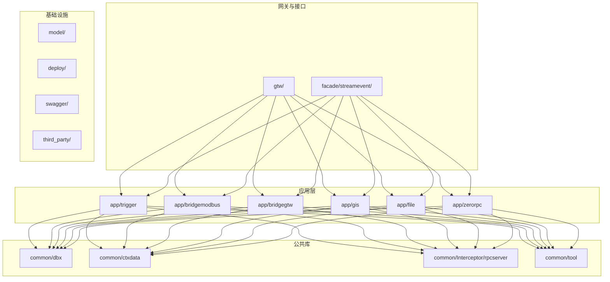
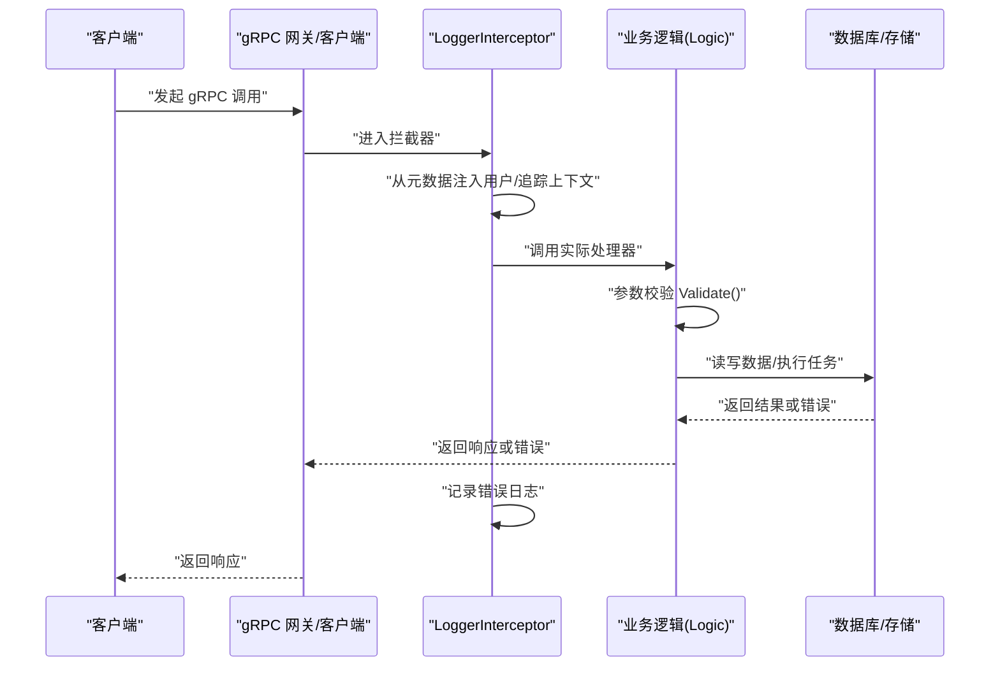
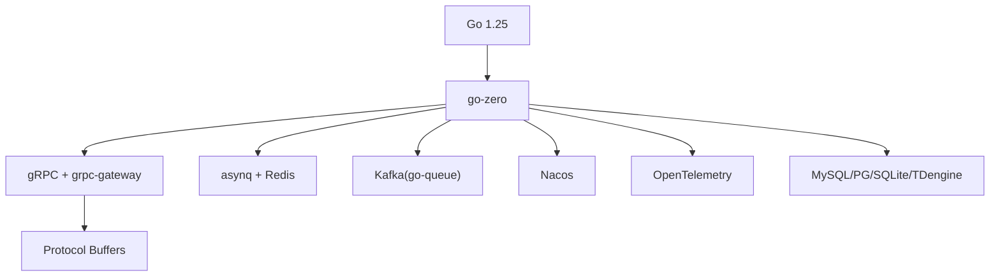

# 代码规范与风格

<cite>
**本文引用的文件**   
- [go.mod](file://go.mod)
- [README.md](file://README.md)
- [code.md](file://code.md)
- [app/trigger/etc/trigger.yaml](file://app/trigger/etc/trigger.yaml)
- [zerorpc/internal/config/config.go](file://zerorpc/internal/config/config.go)
- [common/ctxdata/ctxData.go](file://common/ctxdata/ctxData.go)
- [common/dbx/dbx.go](file://common/dbx/dbx.go)
- [common/Interceptor/rpcserver/loggerInterceptor.go](file://common/Interceptor/rpcserver/loggerInterceptor.go)
- [common/tool/errorutil.go](file://common/tool/errorutil.go)
- [app/trigger/internal/logic/runplanexecitemlogic.go](file://app/trigger/internal/logic/runplanexecitemlogic.go)
- [app/trigger/internal/logic/archivetasklogic.go](file://app/trigger/internal/logic/archivetasklogic.go)
- [util/main.go](file://util/main.go)
</cite>

## 目录
1. [简介](#简介)
2. [项目结构](#项目结构)
3. [核心组件](#核心组件)
4. [架构总览](#架构总览)
5. [详细组件分析](#详细组件分析)
6. [依赖分析](#依赖分析)
7. [性能考虑](#性能考虑)
8. [故障排查指南](#故障排查指南)
9. [结论](#结论)
10. [附录](#附录)

## 简介
本指南面向 zero-service 项目，提供统一的 Go 语言编码规范与风格建议，涵盖命名约定、代码格式化、注释与文档、项目结构组织、模块划分与依赖管理，并结合仓库中的真实组件给出错误处理、日志记录、配置管理的最佳实践示例与代码片段路径。同时，提供代码审查标准与检查清单，帮助团队建立一致的开发与协作流程。

## 项目结构
- 采用按功能域划分的多服务微架构，每个服务位于 app/{service}/ 目录下，遵循 go-zero 的目录约定：internal/config、internal/logic、internal/server、internal/svc、etc 等。
- common/ 提供跨服务复用的公共组件（拦截器、上下文数据、数据库适配、工具等）。
- facade/ 与 gtw/ 提供对外接口层与 BFF 网关。
- model/ 提供数据库模型与 SQL 脚本。
- swagger/ 生成 API 文档。
- third_party/ 收纳第三方 proto 定义。
- deploy/ 提供 Docker Compose 编排。
- util/ 提供辅助工具脚本与 CLI。

**章节来源**
- [README.md: 59-108:59-108](file://README.md#L59-L108)

## 核心组件
- 配置管理：服务配置集中于 etc/{service}.yaml，Go 侧通过 internal/config/*.go 结构体解析，如 trigger 的配置示例与 zerorpc 的配置结构。
- 上下文与元数据：ctxdata 定义了跨 gRPC 传递的用户与追踪上下文键，拦截器在服务端注入到 context。
- 数据库抽象：dbx 根据数据源自动识别数据库类型并创建连接，支持 MySQL、PostgreSQL、SQLite、TDengine。
- 错误与状态：统一遵循 google.rpc.Code 错误码映射，errorutil 提供基于扩展 proto 的错误构造与判定。
- 日志与拦截：LoggerInterceptor 在服务端统一注入上下文并记录错误；logx.WithContext 提供结构化日志。
- 业务逻辑：logic 层负责具体业务，遵循 go-zero 的 ServiceContext 注入与 Validate 校验。

**章节来源**
- [app/trigger/etc/trigger.yaml: 1-37:1-37](file://app/trigger/etc/trigger.yaml#L1-L37)
- [zerorpc/internal/config/config.go: 8-24:8-24](file://zerorpc/internal/config/config.go#L8-L24)
- [common/ctxdata/ctxData.go: 9-24:9-24](file://common/ctxdata/ctxData.go#L9-L24)
- [common/dbx/dbx.go: 31-64:31-64](file://common/dbx/dbx.go#L31-L64)
- [common/tool/errorutil.go: 12-59:12-59](file://common/tool/errorutil.go#L12-L59)
- [common/Interceptor/rpcserver/loggerInterceptor.go: 12-44:12-44](file://common/Interceptor/rpcserver/loggerInterceptor.go#L12-L44)

## 架构总览
以下序列图展示了 gRPC 请求在服务端的处理链路：拦截器注入上下文、业务逻辑校验与执行、错误转换与日志记录。

**图表来源**
- [common/Interceptor/rpcserver/loggerInterceptor.go: 12-44:12-44](file://common/Interceptor/rpcserver/loggerInterceptor.go#L12-L44)
- [app/trigger/internal/logic/runplanexecitemlogic.go: 35-92:35-92](file://app/trigger/internal/logic/runplanexecitemlogic.go#L35-L92)

**章节来源**
- [common/Interceptor/rpcserver/loggerInterceptor.go: 12-44:12-44](file://common/Interceptor/rpcserver/loggerInterceptor.go#L12-L44)
- [app/trigger/internal/logic/runplanexecitemlogic.go: 35-92:35-92](file://app/trigger/internal/logic/runplanexecitemlogic.go#L35-L92)

## 详细组件分析

### 命名约定与代码风格
- 包名：使用小写、简洁、语义明确的名词短语，避免缩写，如 common/dbx、common/ctxdata。
- 变量与函数：采用驼峰命名，函数名以动词开头体现动作，如 NewSqlConnAdapter、BeginTx。
- 常量与类型：常量使用 UPPER_SNAKE_CASE，类型首字母大写，如 DatabaseType、SqlConnAdapter。
- 文件命名：服务入口文件通常为 {service}.go，配置文件为 etc/{service}.yaml，proto 文件为 {service}.proto。
- 目录结构：遵循 go-zero 约定，内部实现置于 internal/ 下，避免外部导入。

**章节来源**
- [common/dbx/dbx.go: 22-29:22-29](file://common/dbx/dbx.go#L22-L29)
- [common/dbx/dbx.go: 66-104:66-104](file://common/dbx/dbx.go#L66-L104)

### 代码格式化与注释规范
- 格式化：统一使用 gofmt，保持一致性；建议在 IDE 中启用保存时格式化。
- 注释：包注释、导出类型与方法注释应清晰描述用途；复杂逻辑处添加行内注释说明关键步骤。
- TODO/NOTE：使用 TODO/NOTE 标记待办事项与注意事项，便于后续跟踪。

（本节为通用规范说明，不直接分析具体文件）

### 项目结构组织原则
- 模块划分：按业务域拆分服务，公共能力下沉至 common；对外统一通过 gtw 聚合。
- 目录布局：每个服务包含 internal/config、internal/logic、internal/server、internal/svc、etc、Dockerfile、gen.sh 等。
- 依赖管理：go.mod 统一声明版本与替换规则，确保依赖一致性与可追溯性。

**章节来源**
- [README.md: 59-108:59-108](file://README.md#L59-L108)
- [go.mod: 3](file://go.mod#L3)
- [go.mod: 244](file://go.mod#L244)

### 配置管理最佳实践
- 配置文件：服务配置位于 etc/{service}.yaml，包含日志、Redis、DB、Nacos 等关键项。
- 配置结构：在 internal/config/*.go 中定义结构体，使用 go-zero 的配置加载机制。
- 示例路径：
  - [app/trigger/etc/trigger.yaml:1-37](file://app/trigger/etc/trigger.yaml#L1-L37)
  - [zerorpc/internal/config/config.go:8-24](file://zerorpc/internal/config/config.go#L8-L24)

**章节来源**
- [app/trigger/etc/trigger.yaml: 1-37:1-37](file://app/trigger/etc/trigger.yaml#L1-L37)
- [zerorpc/internal/config/config.go: 8-24:8-24](file://zerorpc/internal/config/config.go#L8-L24)

### 错误处理模式
- 统一错误码：遵循 google.rpc.Code，错误消息与 HTTP 映射关系见 code.md。
- 错误构造：通过 errorutil.NewErrorByPbCode 根据扩展 proto Code 生成对应 gokit 错误。
- 错误判定：使用 IsErrorByPbCode 判断错误原因码。
- 示例路径：
  - [code.md: 1-66:1-66](file://code.md#L1-L66)
  - [common/tool/errorutil.go: 12-59:12-59](file://common/tool/errorutil.go#L12-L59)
  - [common/tool/errorutil.go: 83-90:83-90](file://common/tool/errorutil.go#L83-L90)

**章节来源**
- [code.md: 1-66:1-66](file://code.md#L1-L66)
- [common/tool/errorutil.go: 12-59:12-59](file://common/tool/errorutil.go#L12-L59)
- [common/tool/errorutil.go: 83-90:83-90](file://common/tool/errorutil.go#L83-L90)

### 日志记录规范
- 结构化日志：使用 logx.WithContext(ctx)，在拦截器中注入用户与追踪上下文，便于链路追踪。
- 错误日志：拦截器在处理异常时统一记录错误日志，便于问题定位。
- 示例路径：
  - [common/ctxdata/ctxData.go: 42-75:42-75](file://common/ctxdata/ctxData.go#L42-L75)
  - [common/Interceptor/rpcserver/loggerInterceptor.go: 12-44:12-44](file://common/Interceptor/rpcserver/loggerInterceptor.go#L12-L44)

**章节来源**
- [common/ctxdata/ctxData.go: 42-75:42-75](file://common/ctxdata/ctxData.go#L42-L75)
- [common/Interceptor/rpcserver/loggerInterceptor.go: 12-44:12-44](file://common/Interceptor/rpcserver/loggerInterceptor.go#L12-L44)

### 数据库访问与适配
- 自动识别：根据数据源前缀自动判断数据库类型（MySQL、PostgreSQL、SQLite、TDengine）。
- 连接适配：通过 SqlConnAdapter 将 sqlx.SqlConn 适配为标准 sql.DB 接口，支持 Begin/Tx/Query/Exec 等。
- 示例路径：
  - [common/dbx/dbx.go: 31-64:31-64](file://common/dbx/dbx.go#L31-L64)
  - [common/dbx/dbx.go: 66-104:66-104](file://common/dbx/dbx.go#L66-L104)

**章节来源**
- [common/dbx/dbx.go: 31-64:31-64](file://common/dbx/dbx.go#L31-L64)
- [common/dbx/dbx.go: 66-104:66-104](file://common/dbx/dbx.go#L66-L104)

### 业务逻辑与校验
- 校验优先：在逻辑层先 Validate()，再进行数据库查询与更新。
- 状态控制：对计划任务等状态机进行严格校验，避免非法状态变更。
- 示例路径：
  - [app/trigger/internal/logic/runplanexecitemlogic.go: 35-92:35-92](file://app/trigger/internal/logic/runplanexecitemlogic.go#L35-L92)
  - [app/trigger/internal/logic/archivetasklogic.go: 27-36:27-36](file://app/trigger/internal/logic/archivetasklogic.go#L27-L36)

**章节来源**
- [app/trigger/internal/logic/runplanexecitemlogic.go: 35-92:35-92](file://app/trigger/internal/logic/runplanexecitemlogic.go#L35-L92)
- [app/trigger/internal/logic/archivetasklogic.go: 27-36:27-36](file://app/trigger/internal/logic/archivetasklogic.go#L27-L36)

### 代码生成与工具
- 代码生成：每个服务提供 gen.sh 生成框架代码，减少重复劳动。
- 辅助工具：util/main.go 提供服务管理 CLI，支持远程执行 docker compose、查看日志、进入容器等。

**章节来源**
- [README.md: 273-286:273-286](file://README.md#L273-L286)
- [util/main.go: 46-136:46-136](file://util/main.go#L46-L136)

## 依赖分析
- 语言与框架：Go 1.25，go-zero 微服务框架。
- RPC 与协议：gRPC + grpc-gateway + Protocol Buffers，支持 OpenAPI 文档生成。
- 消息与任务：Kafka（go-queue），asynq + Redis 分布式任务队列。
- 协议与计算：IEC 104（go-iecp5）、Modbus（grid-x/modbus）、MQTT（eclipse/paho.mqtt.golang）、地理计算（H3、GeoHash、orb、go-geom）。
- 数据库：MySQL、PostgreSQL、SQLite、TDengine。
- 容器与监控：Docker SDK、OpenTelemetry、Prometheus、Nacos。

**章节来源**
- [go.mod: 5-62:5-62](file://go.mod#L5-L62)
- [README.md: 207-224:207-224](file://README.md#L207-L224)

## 性能考虑
- 连接池与超时：合理设置数据库与 Redis 连接池大小与超时，避免阻塞。
- 日志级别：生产环境使用 info 或更高级别，避免高频 debug 输出影响性能。
- 序列化：gRPC 默认使用 protobuf，具备高效序列化优势；注意字段命名与嵌套层级。
- 并发与限流：在网关层与业务层结合限流策略，防止雪崩。
- 监控与追踪：开启 OpenTelemetry，结合 Prometheus/Grafana 观测关键指标。

（本节为通用指导，不直接分析具体文件）

## 故障排查指南
- 日志定位：通过 LoggerInterceptor 注入的 TraceId 与用户信息快速定位请求链路。
- 错误码对照：参考 code.md 中 HTTP 与 gRPC 错误码映射，快速判断问题类型。
- 配置核对：检查 etc/{service}.yaml 中 Redis、DB、Nacos 等关键配置是否正确。
- 数据库诊断：使用 dbx 的自动识别能力确认连接类型与参数，必要时开启 SQL 日志辅助排查。
- 示例路径：
  - [common/Interceptor/rpcserver/loggerInterceptor.go: 12-44:12-44](file://common/Interceptor/rpcserver/loggerInterceptor.go#L12-L44)
  - [code.md: 1-66:1-66](file://code.md#L1-L66)
  - [app/trigger/etc/trigger.yaml: 19-37:19-37](file://app/trigger/etc/trigger.yaml#L19-L37)
  - [common/dbx/dbx.go: 31-64:31-64](file://common/dbx/dbx.go#L31-L64)

**章节来源**
- [common/Interceptor/rpcserver/loggerInterceptor.go: 12-44:12-44](file://common/Interceptor/rpcserver/loggerInterceptor.go#L12-L44)
- [code.md: 1-66:1-66](file://code.md#L1-L66)
- [app/trigger/etc/trigger.yaml: 19-37:19-37](file://app/trigger/etc/trigger.yaml#L19-L37)
- [common/dbx/dbx.go: 31-64:31-64](file://common/dbx/dbx.go#L31-L64)

## 结论
本规范以 zero-service 实际代码为依据，总结了命名、结构、配置、错误处理、日志与依赖等方面的最佳实践。建议团队在日常开发中严格执行，配合 CI/CD 与静态分析工具，持续提升代码质量与交付效率。

## 附录

### 代码审查清单
- 命名与结构：包名、类型、变量、函数是否符合约定；目录结构是否清晰。
- 配置与安全：配置文件是否齐全；敏感信息是否脱敏；默认值是否合理。
- 错误处理：是否使用统一错误码；错误消息是否可读；是否记录上下文。
- 日志与追踪：是否注入 TraceId 与用户信息；错误日志是否充分。
- 数据库访问：是否使用 dbx 自动识别；事务边界是否清晰；SQL 是否可优化。
- 并发与资源：是否正确使用并发原语；资源释放是否及时。
- 文档与注释：包与导出项注释是否完整；复杂逻辑是否有说明。
- 测试与验证：单元测试是否覆盖关键分支；集成测试是否包含错误路径。

### 静态分析与工具
- 格式化：gofmt
- 静态检查：revive、golangci-lint
- 安全扫描：gosec
- 依赖审计：govulncheck
- 协议与 API：buf（proto）、swagger 文档生成

（本节为通用指导，不直接分析具体文件）