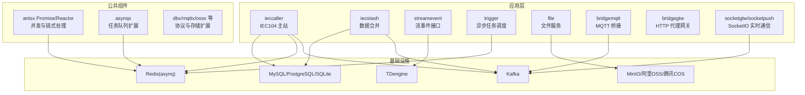
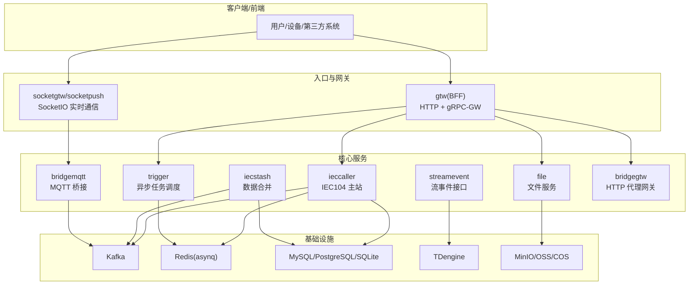
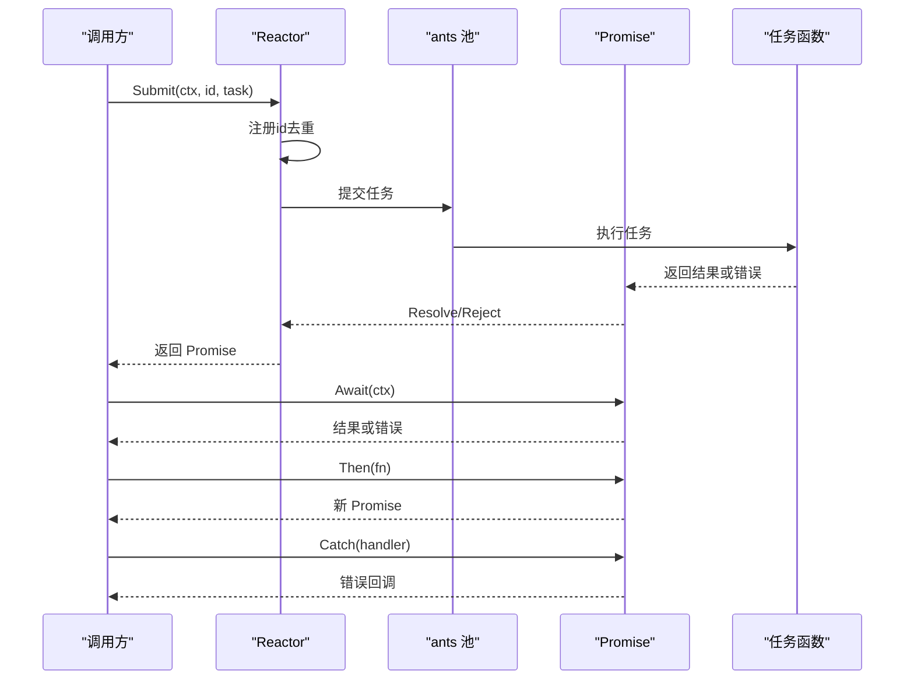
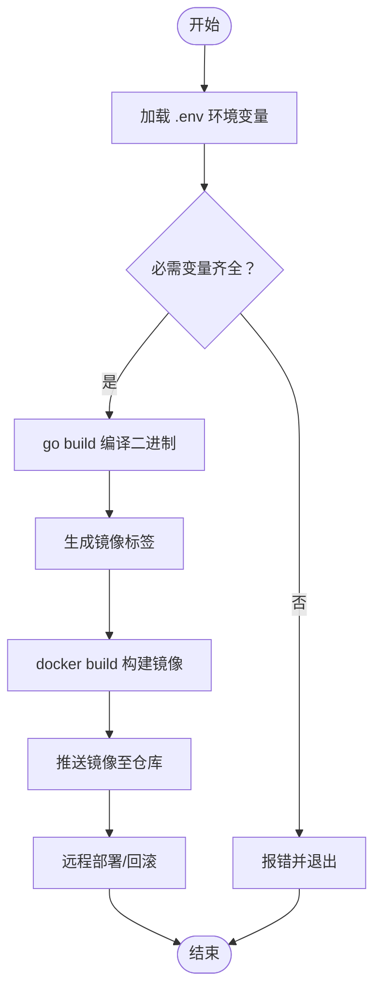
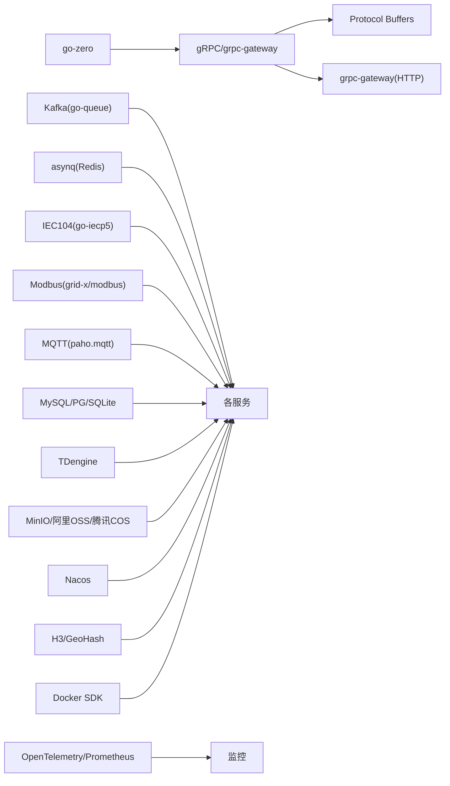

# 代码质量保证

<cite>
**本文引用的文件**
- [README.md](file://README.md)
- [code.md](file://code.md)
- [go.mod](file://go.mod)
- [deploy/docker-compose.yml](file://deploy/docker-compose.yml)
- [app/trigger/etc/trigger.yaml](file://app/trigger/etc/trigger.yaml)
- [app/ieccaller/etc/ieccaller.yaml](file://app/ieccaller/etc/ieccaller.yaml)
- [app/bridgemqtt/etc/bridgemqtt.yaml](file://app/bridgemqtt/etc/bridgemqtt.yaml)
- [common/antsx/antsx.go](file://common/antsx/antsx.go)
- [common/antsx/antsx_test.go](file://common/antsx/antsx_test.go)
- [.trae/skills/zero-skills/best-practices/overview.md](file://.trae/skills/zero-skills/best-practices/overview.md)
- [.trae/skills/zero-skills/references/rest-api-patterns.md](file://.trae/skills/zero-skills/references/rest-api-patterns.md)
- [app/trigger/deploy.sh](file://app/trigger/deploy.sh)
</cite>

## 目录
1. [引言](#引言)
2. [项目结构](#项目结构)
3. [核心组件](#核心组件)
4. [架构总览](#架构总览)
5. [详细组件分析](#详细组件分析)
6. [依赖分析](#依赖分析)
7. [性能考虑](#性能考虑)
8. [故障排查指南](#故障排查指南)
9. [结论](#结论)
10. [附录](#附录)

## 引言
本指南面向 zero-service 项目，围绕代码质量保证提出一套可落地的最佳实践，涵盖代码规范与风格、注释与文档、静态分析与质量门禁、测试策略（单元/集成/端到端）、代码评审流程、CI/CD 流水线、以及技术债务管理与重构实践。目标是帮助团队在快速迭代的同时，保持高质量、可维护、可演进的工程能力。

## 项目结构
zero-service 是基于 go-zero 的工业级微服务脚手架，覆盖 IEC 104 数采、异步任务调度、实时通信、容器管理、地理信息、协议桥接、BFF 网关等场景。项目采用多服务、多协议、多存储的混合架构，服务间通过 gRPC、Kafka、MQTT、HTTP 等多种通道交互，并通过 Docker Compose 提供一键编排。

图表来源
- [README.md:15-51](file://README.md#L15-L51)
- [README.md:59-108](file://README.md#L59-L108)

章节来源
- [README.md:15-51](file://README.md#L15-L51)
- [README.md:59-108](file://README.md#L59-L108)

## 核心组件
- 服务配置与运行
  - 各服务均提供 YAML 配置文件，集中管理日志、超时、Redis、数据库、Nacos、Kafka/MQTT 等关键参数。
  - 示例：trigger、ieccaller、bridgemqtt 的配置文件展示了服务监听、超时、日志、Redis、DB、协议相关参数的组织方式。
- 并发与链式处理
  - antsx 提供 Promise/Reactor 能力，支持链式转换、错误捕获、FireAndForget 等，便于在服务中进行异步任务编排与结果传递。
- 错误码规范
  - 统一遵循 google.rpc.Code，HTTP 与 gRPC 错误码映射清晰，便于跨协议一致的错误表达与治理。

章节来源
- [app/trigger/etc/trigger.yaml:1-37](file://app/trigger/etc/trigger.yaml#L1-L37)
- [app/ieccaller/etc/ieccaller.yaml:1-79](file://app/ieccaller/etc/ieccaller.yaml#L1-L79)
- [app/bridgemqtt/etc/bridgemqtt.yaml:1-48](file://app/bridgemqtt/etc/bridgemqtt.yaml#L1-L48)
- [common/antsx/antsx.go:1-214](file://common/antsx/antsx.go#L1-L214)
- [code.md:1-66](file://code.md#L1-L66)

## 架构总览
下图展示服务间的交互路径与数据流，体现多协议、多存储、多通道的复杂拓扑。

图表来源
- [README.md:15-51](file://README.md#L15-L51)
- [README.md:112-131](file://README.md#L112-L131)
- [README.md:189-206](file://README.md#L189-L206)

## 详细组件分析

### 组件 A：并发与链式处理（antsx）
- 设计要点
  - Promise 封装异步结果，支持 Await、Then、Catch、Resolve/Reject、FireAndForget。
  - Reactor 基于 ants 池，提供 Submit（带 id 去重）与 Post（fire-and-forget）两类提交方式。
  - 通过 sync.Map 注册去重，避免重复 id 的任务提交。
- 关键流程（Promise/Await/Then/Catch）

图表来源
- [common/antsx/antsx.go:168-193](file://common/antsx/antsx.go#L168-L193)
- [common/antsx/antsx.go:43-65](file://common/antsx/antsx.go#L43-L65)
- [common/antsx/antsx.go:67-88](file://common/antsx/antsx.go#L67-L88)
- [common/antsx/antsx.go:90-103](file://common/antsx/antsx.go#L90-L103)

- 测试策略
  - 单测覆盖链式转换、错误捕获、FireAndForget 等行为，确保 Promise 生命周期与并发安全。
  - 示例参考：[common/antsx/antsx_test.go:12-79](file://common/antsx/antsx_test.go#L12-L79)、[common/antsx/antsx_test.go:81-107](file://common/antsx/antsx_test.go#L81-L107)

章节来源
- [common/antsx/antsx.go:1-214](file://common/antsx/antsx.go#L1-L214)
- [common/antsx/antsx_test.go:1-108](file://common/antsx/antsx_test.go#L1-L108)

### 组件 B：配置与部署（以 trigger/ieccaller/bridgemqtt 为例）
- 配置要点
  - 服务名、监听地址、超时、日志级别与路径、Redis 连接、数据库连接、Nacos 注册、Kafka/MQTT 等。
  - 示例：trigger 的 StreamEventConf、ieccaller 的 IecServerConfig/KafkaConfig/MqttConfig、bridgemqtt 的 MqttConfig/SocketPushConf。
- 部署要点
  - 提供独立 Dockerfile 与部署脚本，支持本地构建镜像、tar 包导出、远程部署与回滚策略（通过环境变量控制标签与保留份数）。

图表来源
- [app/trigger/deploy.sh:1-50](file://app/trigger/deploy.sh#L1-L50)

章节来源
- [app/trigger/etc/trigger.yaml:1-37](file://app/trigger/etc/trigger.yaml#L1-L37)
- [app/ieccaller/etc/ieccaller.yaml:1-79](file://app/ieccaller/etc/ieccaller.yaml#L1-L79)
- [app/bridgemqtt/etc/bridgemqtt.yaml:1-48](file://app/bridgemqtt/etc/bridgemqtt.yaml#L1-L48)
- [app/trigger/deploy.sh:1-50](file://app/trigger/deploy.sh#L1-L50)

## 依赖分析
- 技术栈与依赖
  - 微服务框架：go-zero
  - RPC：gRPC + grpc-gateway + Protocol Buffers
  - 消息队列：Kafka（go-queue）
  - 任务队列：asynq + Redis
  - 实时通信：SocketIO（fork）
  - 工业协议：IEC 60870-5-104、Modbus、MQTT
  - 数据库：MySQL/PostgreSQL/SQLite
  - 时序数据库：TDengine
  - 对象存储：MinIO/阿里OSS/腾讯COS
  - 服务发现：Nacos
  - 地理计算：H3/GeoHash/orb/go-geom
  - 容器管理：Docker SDK
  - 监控追踪：OpenTelemetry/Prometheus
  - 编排：Docker Compose/Kubernetes（可选）
- 依赖关系可视化

图表来源
- [README.md:207-225](file://README.md#L207-L225)
- [go.mod:5-62](file://go.mod#L5-L62)

章节来源
- [README.md:207-225](file://README.md#L207-L225)
- [go.mod:1-245](file://go.mod#L1-L245)

## 性能考虑
- 并发与吞吐
  - 使用 Reactor + ants 池控制并发度，避免过度竞争；对高并发场景建议结合限流与熔断。
- 序列化与网络
  - gRPC 默认 Protobuf，序列化效率高；注意字段命名与版本兼容。
- 存储与查询
  - 数据库连接池与事务控制；针对高频查询建立索引；时序数据写入 TDengine 时注意批量化与分区。
- 监控与可观测性
  - OpenTelemetry + Prometheus + Grafana；为关键服务埋点，关注延迟、错误率、并发度。
- 配置优化
  - Kafka/MQTT/Redis/DB 连接参数、超时与重试策略应结合压测结果调整。

## 故障排查指南
- 错误码一致性
  - 统一使用 google.rpc.Code，HTTP 与 gRPC 映射明确，便于定位问题来源与传播。
- 日志与追踪
  - 各服务配置日志路径与级别；结合 OpenTelemetry 追踪请求链路。
- 配置核对
  - 核对 Redis、DB、Kafka、MQTT、Nacos 等连接参数是否与部署环境一致。
- 部署与回滚
  - 使用部署脚本的镜像标签与保留策略，出现问题可快速回滚至上一个稳定版本。

章节来源
- [code.md:1-66](file://code.md#L1-L66)
- [app/trigger/etc/trigger.yaml:1-37](file://app/trigger/etc/trigger.yaml#L1-L37)
- [app/ieccaller/etc/ieccaller.yaml:1-79](file://app/ieccaller/etc/ieccaller.yaml#L1-L79)
- [app/bridgemqtt/etc/bridgemqtt.yaml:1-48](file://app/bridgemqtt/etc/bridgemqtt.yaml#L1-L48)
- [app/trigger/deploy.sh:1-50](file://app/trigger/deploy.sh#L1-L50)

## 结论
通过统一的错误码规范、完善的配置与部署流程、并发与链式处理能力、以及基于 go-zero 的微服务架构，zero-service 在复杂工业场景下具备良好的可维护性与扩展性。建议在现有基础上进一步完善静态分析与质量门禁、测试金字塔与覆盖率、代码评审与 CI/CD 流水线，持续降低技术债务并提升交付质量。

## 附录

### 代码规范与编码标准
- 命名约定
  - Go 包名、结构体、方法、常量、变量遵循 go-zero 习惯；服务名、配置项使用小驼峰或下划线风格，保持一致性。
- 代码风格
  - 使用 gofmt/goimports；长函数拆分、错误尽早返回；避免魔法数字与字符串硬编码。
- 注释规范
  - 包注释、导出类型/方法注释、关键逻辑注释；对外 API 使用 swagger 注释。
- 文档编写
  - README、各服务 README、错误码文档、部署文档、API 文档（swagger）。

章节来源
- [README.md:296-299](file://README.md#L296-L299)
- [.trae/skills/zero-skills/references/rest-api-patterns.md:502-523](file://.trae/skills/zero-skills/references/rest-api-patterns.md#L502-L523)

### 静态代码分析与质量门禁
- 工具建议
  - vet、staticcheck、golangci-lint；结合 Protobuf 与 validate 规则。
- 质量门禁
  - 代码提交前强制执行；阈值：致命/严重/警告数量上限；禁止新增 TODO/FIXME。
- 代码覆盖率
  - 单元测试覆盖率不低于 80%，关键路径与边界条件覆盖。
- 复杂度控制
  - 函数圈复杂度不超过 10；方法长度不超过 60 行；分支深度不超过 4。

章节来源
- [.trae/skills/zero-skills/best-practices/overview.md:283-424](file://.trae/skills/zero-skills/best-practices/overview.md#L283-L424)

### 单元测试与测试策略
- 测试金字塔
  - 单元测试为主，集成测试为辅，端到端测试聚焦关键路径。
- TDD 实践
  - 先写失败用例，再实现最小逻辑，最后重构。
- Mock 使用
  - 使用 gomock/uber/multierr 管理依赖；对数据库/缓存/外部服务进行隔离。
- 测试数据管理
  - 使用临时数据库/内存存储；测试前构造，测试后清理；避免共享状态。

章节来源
- [.trae/skills/zero-skills/best-practices/overview.md:283-424](file://.trae/skills/zero-skills/best-practices/overview.md#L283-L424)

### 集成测试与端到端测试
- 测试环境搭建
  - Docker Compose 启动 Kafka/Redis/DB/OSS 等依赖；服务间通过 localhost 或 host 网络互通。
- 测试数据准备
  - 初始化数据库结构与种子数据；Kafka/MQTT 发布/订阅验证。
- API 测试
  - gRPC/HTTP 接口测试，覆盖正常/异常/边界场景；使用 grpcurl/swagger 验证。
- UI 测试
  - SocketIO/WebSocket 事件与房间管理；MQTT 桥接事件映射。

章节来源
- [deploy/docker-compose.yml:1-110](file://deploy/docker-compose.yml#L1-L110)
- [README.md:288-295](file://README.md#L288-L295)

### 代码评审流程与标准
- 评审清单
  - 代码可读性、健壮性、性能影响、安全性、兼容性、文档与注释、测试覆盖。
- 评审工具
  - GitHub/GitLab MR/Draft；lint/测试结果作为必须通过项。
- 同行评议
  - 至少一名 reviewer；复杂改动需多人参与。
- 质量反馈
  - 评审意见闭环；修复后重新评审；记录常见问题与改进建议。

章节来源
- [.trae/skills/zero-skills/references/rest-api-patterns.md:502-523](file://.trae/skills/zero-skills/references/rest-api-patterns.md#L502-L523)

### 持续集成与持续部署（CI/CD）
- 流水线设计
  - 触发：PR/MR/主干推送；步骤：依赖安装、代码扫描、单元测试、集成测试、打包镜像、推送制品库。
- 自动化测试
  - 单测覆盖率报告；集成测试与 API 测试；端到端测试（可选）。
- 部署策略
  - 蓝绿/金丝雀；灰度发布；回滚机制（镜像标签与保留份数）。
- 回滚机制
  - 通过部署脚本的环境变量控制镜像标签与保留份数，快速回滚至上一个稳定版本。

章节来源
- [app/trigger/deploy.sh:1-50](file://app/trigger/deploy.sh#L1-L50)

### 技术债务管理与重构实践
- 债务识别
  - 复杂度高、重复代码、紧耦合、缺失测试、配置分散、文档缺失。
- 优先级排序
  - 影响面大、风险高、回归成本低的优先。
- 渐进式改进
  - 小步快跑；引入测试；逐步解耦；统一规范与工具链。

章节来源
- [.trae/skills/zero-skills/best-practices/overview.md:283-424](file://.trae/skills/zero-skills/best-practices/overview.md#L283-L424)