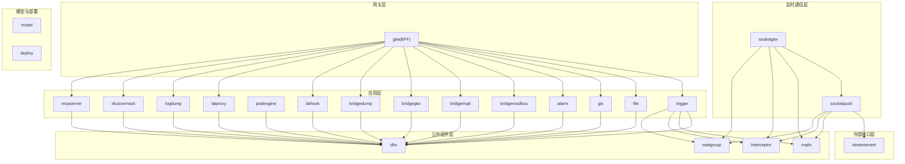
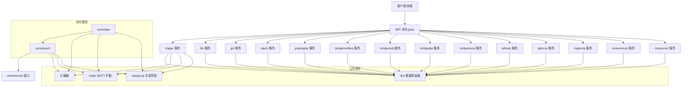
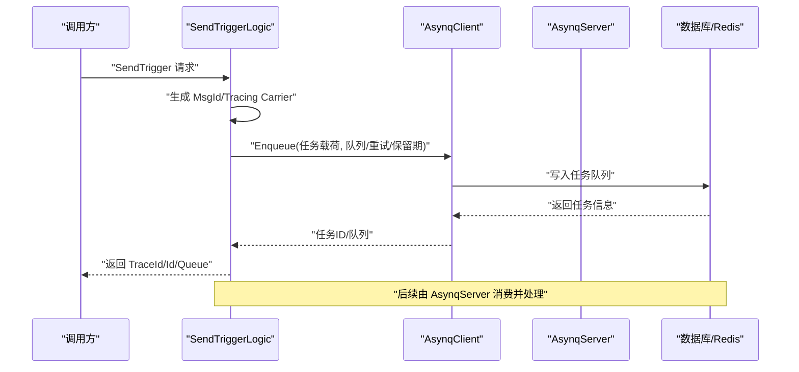
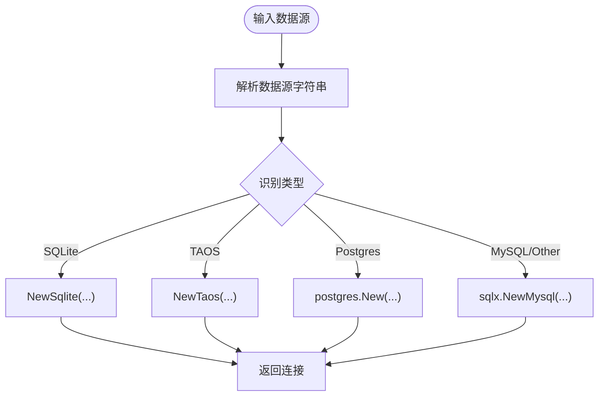
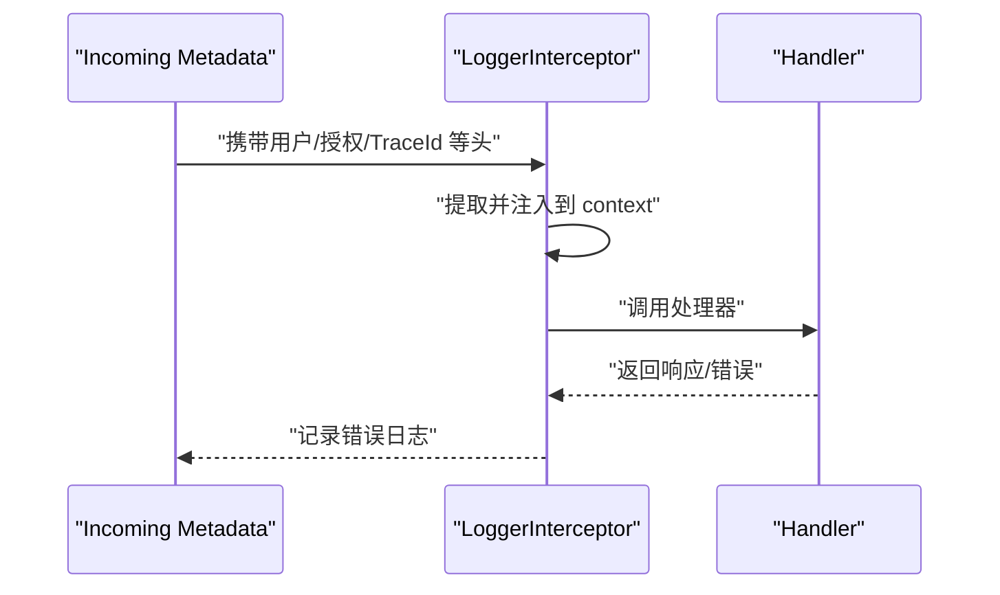
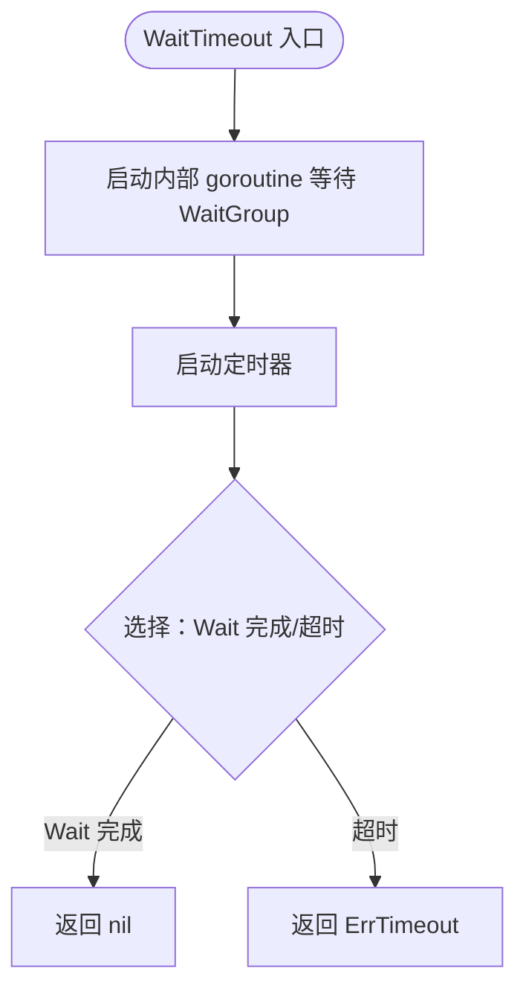
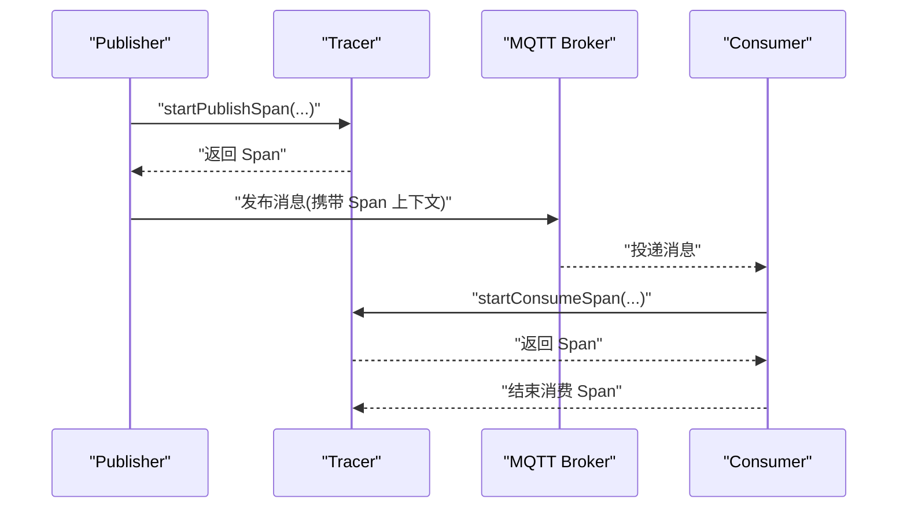
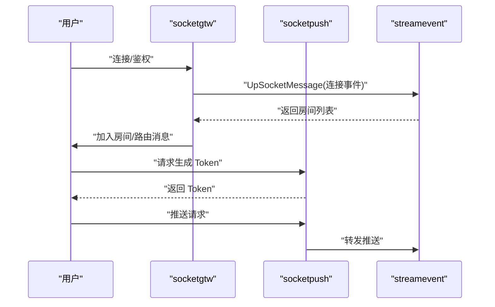
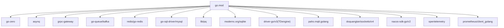

# 技术债务管理

<cite>
**本文引用的文件**
- [README.md](file://README.md)
- [go.mod](file://go.mod)
- [app/trigger/internal/config/config.go](file://app/trigger/internal/config/config.go)
- [app/trigger/internal/svc/servicecontext.go](file://app/trigger/internal/svc/servicecontext.go)
- [app/trigger/internal/logic/sendtriggerlogic.go](file://app/trigger/internal/logic/sendtriggerlogic.go)
- [app/trigger/internal/logic/runplanexecitemlogic.go](file://app/trigger/internal/logic/runplanexecitemlogic.go)
- [common/dbx/dbx.go](file://common/dbx/dbx.go)
- [common/Interceptor/rpcserver/loggerInterceptor.go](file://common/Interceptor/rpcserver/loggerInterceptor.go)
- [common/iec104/waitgroup/waitgroup.go](file://common/iec104/waitgroup/waitgroup.go)
- [common/mqttx/mqttx.go](file://common/mqttx/mqttx.go)
- [socketapp/socketgtw/internal/svc/servicecontext.go](file://socketapp/socketgtw/internal/svc/servicecontext.go)
- [socketapp/socketpush/internal/logic/gentokenlogic.go](file://socketapp/socketpush/internal/logic/gentokenlogic.go)
- [deploy/stat_analyzer.html](file://deploy/stat_analyzer.html)
- [docs/trigger.md](file://docs/trigger.md)
- [.trae/skills/zero-skills/best-practices/overview.md](file://.trae/skills/zero-skills/best-practices/overview.md)
- [.trae/skills/zero-skills/troubleshooting/common-issues.md](file://.trae/skills/zero-skills/troubleshooting/common-issues.md)
- [.trae/skills/zero-skills/references/database-patterns.md](file://.trae/skills/zero-skills/references/database-patterns.md)
- [app/logdump/logdump/logdump.pb.go](file://app/logdump/logdump/logdump.pb.go)
</cite>

## 目录
1. [简介](#简介)
2. [项目结构](#项目结构)
3. [核心组件](#核心组件)
4. [架构总览](#架构总览)
5. [详细组件分析](#详细组件分析)
6. [依赖分析](#依赖分析)
7. [性能考量](#性能考量)
8. [故障排查指南](#故障排查指南)
9. [结论](#结论)
10. [附录](#附录)

## 简介
本指南面向 zero-service 的技术债务识别与重构实践，目标是帮助团队建立系统化的债务评估、分类、优先级排序与渐进式改进机制。通过对项目架构、公共组件、服务实现与运维工具的深入分析，提出可落地的重构策略与最佳实践，确保在保持高可用的同时逐步降低技术债，提升可维护性、稳定性与性能。

## 项目结构
zero-service 采用 go-zero 微服务脚手架，围绕 IEC 104 数采、异步任务调度、实时通信、容器管理、地理信息、协议桥接等场景构建。整体分为以下层次：
- 应用层：多个独立微服务，如 trigger、file、gis、alarm、podengine、bridgemodbus、bridgemqtt、bridgegtw、bridgedump、lalhook、lalproxy、logdump、xfusionmock、mcpserver 等
- 实时通信层：socketapp/socketgtw 与 socketapp/socketpush
- 网关层：gtw（BFF 聚合网关）
- 外部接口层：facade/streamevent（跨语言流数据事件协议）
- 公共组件层：common（数据库、协议、MQTT、SocketIO、Nacos、任务队列、工具等）
- 模型与部署：model（数据库模型与 SQL）、deploy（Docker Compose 编排）

图表来源
- [README.md:59-108](file://README.md#L59-L108)

章节来源
- [README.md:1-350](file://README.md#L1-L350)

## 核心组件
- 触发与计划任务引擎（trigger）：基于 asynq 的分布式任务队列与自研计划任务管理，支持 HTTP/gRPC 回调、定时/延时任务、自动重试与生命周期管理。
- 数据库抽象（dbx）：根据数据源自动识别数据库类型（MySQL/Postgres/SQLite/TAOS），并提供连接、事务与查询构建器适配。
- RPC 拦截器（Interceptor/rpcserver/loggerInterceptor.go）：统一注入用户上下文与错误日志记录。
- IEC 104 协议与并发控制（common/iec104/waitgroup/waitgroup.go）：提供带超时的等待组，防止 goroutine 泄漏。
- MQTT 扩展（common/mqttx/mqttx.go）：提供 OpenTelemetry 跨进程传播与生产/消费 Span。
- SocketIO 网关与推送（socketapp/socketgtw/socketpush）：Token 鉴权、房间管理、MQTT 桥接与 gRPC 推送。
- 网关（gtw）：统一入口，聚合 gRPC 与 HTTP，提供认证、文件上传与跨域支持。
- 外部接口（facade/streamevent）：跨语言流数据事件协议，支持多种上游协议汇聚。

章节来源
- [docs/trigger.md:40-86](file://docs/trigger.md#L40-L86)
- [common/dbx/dbx.go:31-64](file://common/dbx/dbx.go#L31-L64)
- [common/Interceptor/rpcserver/loggerInterceptor.go:12-44](file://common/Interceptor/rpcserver/loggerInterceptor.go#L12-L44)
- [common/iec104/waitgroup/waitgroup.go:27-43](file://common/iec104/waitgroup/waitgroup.go#L27-L43)
- [common/mqttx/mqttx.go:361-388](file://common/mqttx/mqttx.go#L361-L388)
- [socketapp/socketgtw/internal/svc/servicecontext.go:59-102](file://socketapp/socketgtw/internal/svc/servicecontext.go#L59-L102)
- [README.md:189-206](file://README.md#L189-L206)

## 架构总览
系统采用“网关 + 多微服务 + 公共组件”的分层架构，服务间通过 gRPC/HTTP、Kafka、Redis、数据库等进行交互。Trigger 服务承担异步与计划任务的核心职责；实时通信通过 SocketIO 与 MQTT 桥接；公共组件提供数据库、协议与可观测性支撑。

图表来源
- [README.md:15-51](file://README.md#L15-L51)
- [README.md:189-206](file://README.md#L189-L206)

## 详细组件分析

### 触发与计划任务引擎（trigger）
- 任务队列：基于 asynq，支持 Redis 存储、队列权重、自动重试与指数退避。
- 计划任务：自研 Plan -> Batch -> ExecItem 三层模型，支持分布式锁、状态机与执行日志追踪。
- 配置与上下文：集中配置、验证器、数据库连接、Redis、StreamEvent 客户端等。
- 业务逻辑示例：发送触发任务（支持延迟/定时）、立即执行计划项（状态检查与更新）。

图表来源
- [app/trigger/internal/logic/sendtriggerlogic.go:37-104](file://app/trigger/internal/logic/sendtriggerlogic.go#L37-L104)
- [app/trigger/internal/svc/servicecontext.go:50-90](file://app/trigger/internal/svc/servicecontext.go#L50-L90)
- [docs/trigger.md:40-86](file://docs/trigger.md#L40-L86)

章节来源
- [app/trigger/internal/logic/sendtriggerlogic.go:1-105](file://app/trigger/internal/logic/sendtriggerlogic.go#L1-L105)
- [app/trigger/internal/logic/runplanexecitemlogic.go:1-93](file://app/trigger/internal/logic/runplanexecitemlogic.go#L1-L93)
- [app/trigger/internal/config/config.go:1-28](file://app/trigger/internal/config/config.go#L1-L28)
- [app/trigger/internal/svc/servicecontext.go:1-91](file://app/trigger/internal/svc/servicecontext.go#L1-L91)
- [docs/trigger.md:40-86](file://docs/trigger.md#L40-L86)

### 数据库抽象（dbx）
- 自动识别数据库类型（SQLite/TAOS/MySQL/Postgres），并创建相应连接与查询构建器。
- 提供适配器以兼容不同数据库方言，统一日志输出。

图表来源
- [common/dbx/dbx.go:31-64](file://common/dbx/dbx.go#L31-L64)

章节来源
- [common/dbx/dbx.go:1-155](file://common/dbx/dbx.go#L1-L155)

### RPC 拦截器与日志
- 在服务端拦截请求，提取用户上下文信息并注入到请求上下文，统一错误日志记录，便于追踪与审计。

图表来源
- [common/Interceptor/rpcserver/loggerInterceptor.go:12-44](file://common/Interceptor/rpcserver/loggerInterceptor.go#L12-L44)

章节来源
- [common/Interceptor/rpcserver/loggerInterceptor.go:1-45](file://common/Interceptor/rpcserver/loggerInterceptor.go#L1-L45)

### 并发控制与超时
- WaitGroup 包装器提供 WaitTimeout，避免长时间阻塞导致的泄漏，适用于 goroutine 生命周期管理。

图表来源
- [common/iec104/waitgroup/waitgroup.go:27-43](file://common/iec104/waitgroup/waitgroup.go#L27-L43)

章节来源
- [common/iec104/waitgroup/waitgroup.go:1-112](file://common/iec104/waitgroup/waitgroup.go#L1-L112)

### MQTT 跨进程传播与追踪
- 在 MQTT 生产/消费路径上开启 OpenTelemetry Span，保证跨服务链路可观测性。

图表来源
- [common/mqttx/mqttx.go:361-388](file://common/mqttx/mqttx.go#L361-L388)

章节来源
- [common/mqttx/mqttx.go:361-388](file://common/mqttx/mqttx.go#L361-L388)

### SocketIO 网关与推送
- 网关侧鉴权与房间管理，推送侧 Token 生成与 gRPC 推送，支持 MQTT 桥接。

图表来源
- [socketapp/socketgtw/internal/svc/servicecontext.go:59-102](file://socketapp/socketgtw/internal/svc/servicecontext.go#L59-L102)
- [socketapp/socketpush/internal/logic/gentokenlogic.go:57-78](file://socketapp/socketpush/internal/logic/gentokenlogic.go#L57-L78)

章节来源
- [socketapp/socketgtw/internal/svc/servicecontext.go:59-102](file://socketapp/socketgtw/internal/svc/servicecontext.go#L59-L102)
- [socketapp/socketpush/internal/logic/gentokenlogic.go:57-78](file://socketapp/socketpush/internal/logic/gentokenlogic.go#L57-L78)

## 依赖分析
- 技术栈与外部依赖：go-zero、gRPC/grpc-gateway、asynq、Kafka、Redis、MySQL/Postgres/SQLite、TDengine、MQTT、SocketIO、Nacos、OpenTelemetry、Prometheus/Grafana、Docker/Kubernetes 等。
- 依赖关系：服务之间通过 gRPC/HTTP、Kafka、Redis、数据库耦合；公共组件（dbx、mqttx、Interceptor、waitgroup）被广泛复用。

图表来源
- [go.mod:5-62](file://go.mod#L5-L62)

章节来源
- [go.mod:1-245](file://go.mod#L1-L245)

## 性能考量
- 观测与分析：提供统计分析页面（deploy/stat_analyzer.html），支持按分钟粒度聚合 QPS、丢弃、响应时间、系统指标与缓存命中率等，便于定位性能瓶颈。
- 关键指标建议：CPU 使用率、内存分配/系统内存、GC 次数、每类 QPS 的均值/中位/P90/P99/P999、缓存命中率、限流丢弃统计。
- 优化方向：连接池与超时控制、批量处理与压缩（如 Kafka/ASDU）、异步队列背压与重试策略、数据库索引与查询优化、并发与超时控制（waitgroup）。

章节来源
- [deploy/stat_analyzer.html:862-888](file://deploy/stat_analyzer.html#L862-L888)
- [deploy/stat_analyzer.html:1145-1327](file://deploy/stat_analyzer.html#L1145-L1327)

## 故障排查指南
- 配置问题：检查配置文件路径与必填字段，确保 YAML 中 required 字段齐全，避免因缺失导致启动失败。
- 性能问题：排查 goroutine 泄漏、未设置超时、无限循环、未释放资源等问题，参考最佳实践中的“Never Do”清单。
- 错误处理：统一错误包装与响应，避免将内部错误直接暴露给客户端；使用结构化日志与 TraceID 追踪。

章节来源
- [.trae/skills/zero-skills/troubleshooting/common-issues.md:623-713](file://.trae/skills/zero-skills/troubleshooting/common-issues.md#L623-L713)
- [.trae/skills/zero-skills/best-practices/overview.md:756-781](file://.trae/skills/zero-skills/best-practices/overview.md#L756-L781)

## 结论
通过系统化的技术债务识别与重构实践，zero-service 可在保持现有业务能力的同时，逐步提升系统的稳定性、可维护性与性能。建议以“小步快跑”的方式推进，优先解决高风险与高频问题，结合自动化工具与最佳实践，形成可持续的债务管理闭环。

## 附录

### 技术债务识别清单（示例）
- 代码质量
  - 缺失输入校验与错误包装
  - 未使用统一拦截器注入上下文
  - 未对敏感信息脱敏记录
- 架构缺陷
  - 服务间强耦合（硬编码依赖某实现）
  - 缺少统一的错误码与响应规范
  - 配置分散，缺乏环境变量覆盖
- 性能瓶颈
  - 未启用连接池或超时控制
  - 未做批量处理与压缩
  - 未对热点数据做缓存

章节来源
- [.trae/skills/zero-skills/best-practices/overview.md:140-212](file://.trae/skills/zero-skills/best-practices/overview.md#L140-L212)
- [.trae/skills/zero-skills/best-practices/overview.md:610-669](file://.trae/skills/zero-skills/best-practices/overview.md#L610-L669)
- [.trae/skills/zero-skills/troubleshooting/common-issues.md:676-713](file://.trae/skills/zero-skills/troubleshooting/common-issues.md#L676-L713)

### 债务分类与优先级排序
- 风险评估维度
  - 影响范围：影响面越大风险越高
  - 失效概率：越频繁出现风险越高
  - 修复成本：成本越低优先级越高
- 优先级策略
  - P0：影响核心链路（如 trigger、streamevent）
  - P1：影响关键功能（如 file、gis、alarm）
  - P2：影响一般功能（如 bridge 系列、lal 系列）
  - P3：影响较小或非关键路径

### 渐进式改进方法
- 小步快跑
  - 每次迭代聚焦 1-2 个具体问题，快速验证效果
- 渐进式迁移
  - 逐步替换旧实现（如数据库方言、协议栈）
- 持续优化
  - 引入自动化测试、静态检查、性能回归监控

### 重构工具与技巧
- 自动化重构
  - 使用 gofmt/gofumpt、静态检查（golangci-lint）、单元测试覆盖率
- 代码重构
  - 提取公共逻辑（如 dbx、waitgroup、Interceptor）
  - 统一错误处理与响应格式
- 架构演进
  - 引入适配器模式与接口抽象，降低耦合
  - 逐步引入熔断、限流、降级与可观测性

### 典型债务管理案例
- 案例1：触发任务延迟与重试异常
  - 识别：任务积压、重试指数退避未生效
  - 修复：统一配置与日志、增加健康检查与告警
  - 验证：通过统计分析页面观察 QPS 与响应时间变化
- 案例2：数据库连接泄漏
  - 识别：内存持续增长、GC 次数上升
  - 修复：引入连接池与超时控制、统一资源释放
  - 验证：监控系统指标与 GC 统计

章节来源
- [deploy/stat_analyzer.html:1145-1327](file://deploy/stat_analyzer.html#L1145-L1327)
- [.trae/skills/zero-skills/references/database-patterns.md:271-365](file://.trae/skills/zero-skills/references/database-patterns.md#L271-L365)