# 持续集成与部署

<cite>
**本文引用的文件**
- [README.md](file://README.md)
- [go.mod](file://go.mod)
- [deploy/docker-compose.yml](file://deploy/docker-compose.yml)
- [util/Taskfile.yml](file://util/Taskfile.yml)
- [util/Taskfile-docker.yml](file://util/Taskfile-docker.yml)
- [.trae/skills/dev-environment/SKILL.md](file://.trae/skills/dev-environment/SKILL.md)
- [.trae/skills/zero-skills/best-practices/overview.md](file://.trae/skills/zero-skills/best-practices/overview.md)
- [app/trigger/etc/trigger.yaml](file://app/trigger/etc/trigger.yaml)
- [app/ieccaller/etc/ieccaller.yaml](file://app/ieccaller/etc/ieccaller.yaml)
- [app/trigger/deploy.sh](file://app/trigger/deploy.sh)
</cite>

## 目录
1. [简介](#简介)
2. [项目结构](#项目结构)
3. [核心组件](#核心组件)
4. [架构总览](#架构总览)
5. [详细组件分析](#详细组件分析)
6. [依赖分析](#依赖分析)
7. [性能考虑](#性能考虑)
8. [故障排查指南](#故障排查指南)
9. [结论](#结论)
10. [附录](#附录)

## 简介
本指南面向 zero-service 项目，提供一套可落地的持续集成与持续部署（CI/CD）方案。内容涵盖流水线设计原则、构建与测试阶段、打包与部署阶段、自动化测试集成（单元测试、集成测试、性能测试）、部署策略（蓝绿部署、滚动更新、金丝雀发布）、回滚与灾难恢复（版本管理、配置回滚、数据备份），以及具体工具配置与最佳实践。

## 项目结构
zero-service 采用多服务微架构，基于 go-zero 框架，服务以独立模块组织，每个服务均提供：
- gRPC/HTTP 接口定义与代码生成脚本
- Dockerfile 与部署脚本
- 独立配置文件（etc/*.yaml）
- 可选的 Swagger 文档

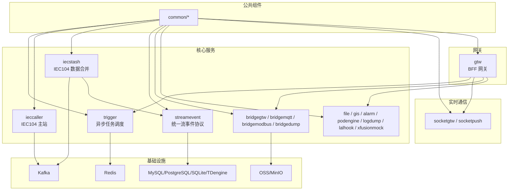

图表来源
- [README.md:15-51](file://README.md#L15-L51)
- [README.md:59-108](file://README.md#L59-L108)

章节来源
- [README.md:15-51](file://README.md#L15-L51)
- [README.md:59-108](file://README.md#L59-L108)

## 核心组件
- 微服务框架：go-zero
- RPC 与协议：gRPC + grpc-gateway + Protocol Buffers
- 消息队列：Kafka（go-queue）
- 任务队列：asynq + Redis
- 实时通信：SocketIO（fork of socket.io-golang）
- 工业协议：IEC 60870-5-104（go-iecp5）、Modbus（grid-x/modbus）、MQTT（paho.mqtt）
- 数据库：MySQL / PostgreSQL / SQLite / TDengine
- 对象存储：MinIO / 阿里 OSS / 腾讯 COS
- 服务发现：Nacos
- 监控追踪：OpenTelemetry / Prometheus
- 容器编排：Docker Compose / Kubernetes（可选）

章节来源
- [README.md:207-225](file://README.md#L207-L225)

## 架构总览
下图展示 CI/CD 在整体架构中的位置与交互：

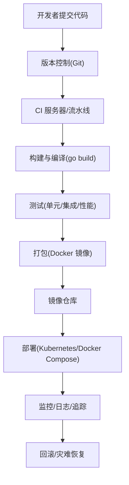

## 详细组件分析

### 流水线设计原则
- 分阶段解耦：构建、测试、打包、部署四阶段职责清晰，避免串行阻塞
- 可观测性：每个阶段输出明确产物与报告，便于定位问题
- 可重复性：所有步骤通过脚本与配置驱动，确保环境一致性
- 并行化：在保证一致性的前提下，尽量并行执行不依赖的阶段
- 权限最小化：CI/CD 账户仅具备必要权限，镜像仓库与部署账户分离

### 构建阶段
- 交叉编译：针对 Linux 平台进行 amd64/arm64 交叉编译，确保与生产环境一致
- 依赖管理：使用 go mod tidy，确保依赖锁定与一致性
- 产物标准化：输出二进制文件与 Docker 镜像，镜像标签包含时间戳与版本信息

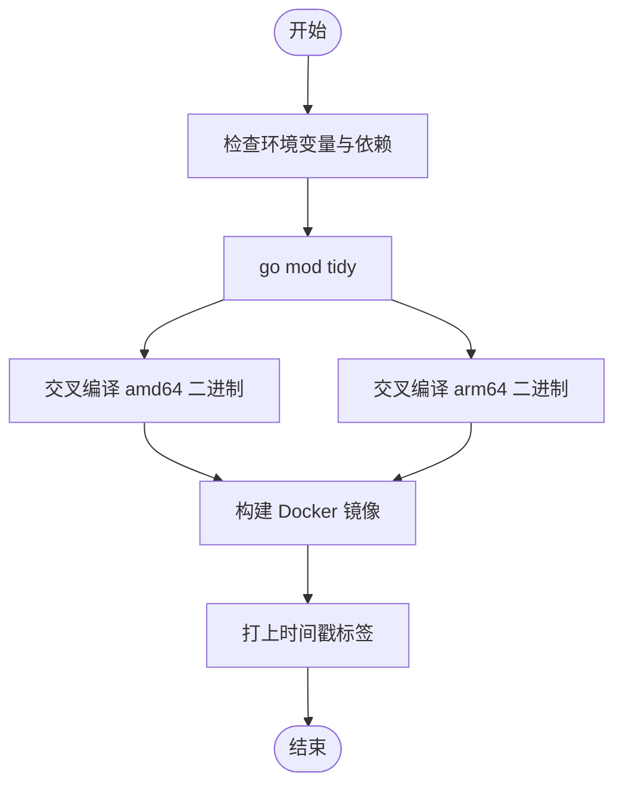

章节来源
- [.trae/skills/dev-environment/SKILL.md:112-148](file://.trae/skills/dev-environment/SKILL.md#L112-L148)
- [go.mod:1-245](file://go.mod#L1-L245)

### 测试阶段
- 单元测试：使用 testify 断言，覆盖边界与错误路径
- 集成测试：连接真实数据库或使用测试数据库，验证服务间协作
- 性能测试：对关键路径（如 IEC104 数据合并、任务调度）进行基准测试
- 配置校验：对各服务配置文件进行语法与连通性校验

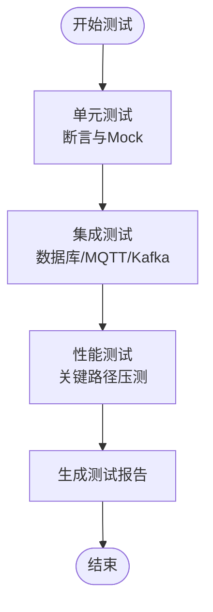

章节来源
- [.trae/skills/zero-skills/best-practices/overview.md:283-424](file://.trae/skills/zero-skills/best-practices/overview.md#L283-L424)

### 打包阶段
- Docker 镜像：基于服务目录下的 Dockerfile 构建，镜像名包含服务名与版本
- 镜像导出：可选导出为 tar 文件，便于离线部署或跨环境迁移
- 标签策略：建议采用语义化版本 + 时间戳，便于回溯与审计

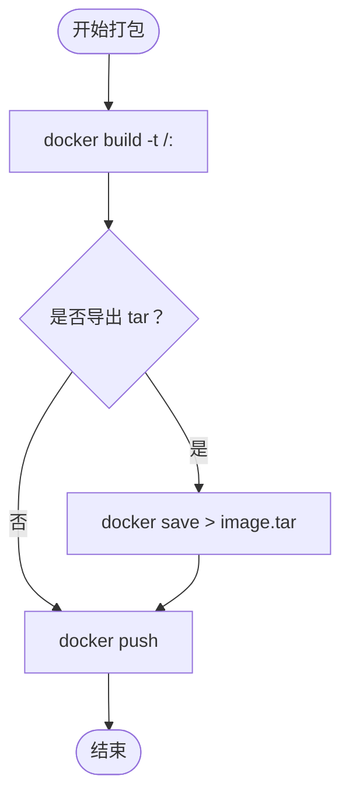

章节来源
- [.trae/skills/dev-environment/SKILL.md:95-111](file://.trae/skills/dev-environment/SKILL.md#L95-L111)

### 部署阶段
- Docker Compose：适用于开发与测试环境，一键启动核心服务链路
- Kubernetes：适用于生产环境，支持副本扩缩容、滚动更新、就绪探针
- 远程部署：通过 sshpass + docker compose 远程控制远端服务

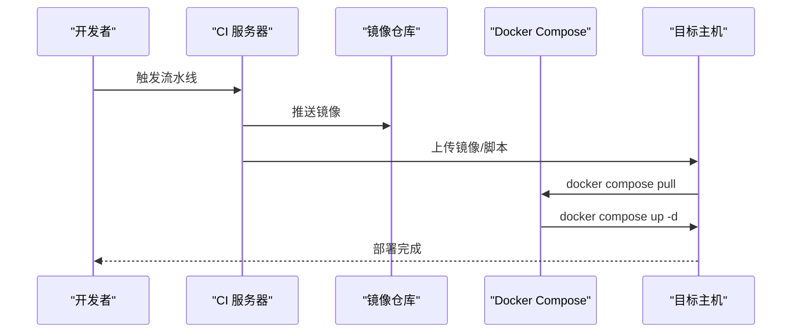

章节来源
- [deploy/docker-compose.yml:1-110](file://deploy/docker-compose.yml#L1-L110)
- [util/Taskfile-docker.yml:1-37](file://util/Taskfile-docker.yml#L1-L37)

### 自动化测试集成方案
- 单元测试：在各服务 internal/logic 中编写测试，使用 testify 断言；对依赖使用 gomock 进行 Mock
- 集成测试：通过配置文件启用数据库连接，使用真实或内存数据库进行端到端验证
- 性能测试：对 trigger、ieccaller、iecstash 等关键服务进行并发与延迟测试，记录指标并生成报告

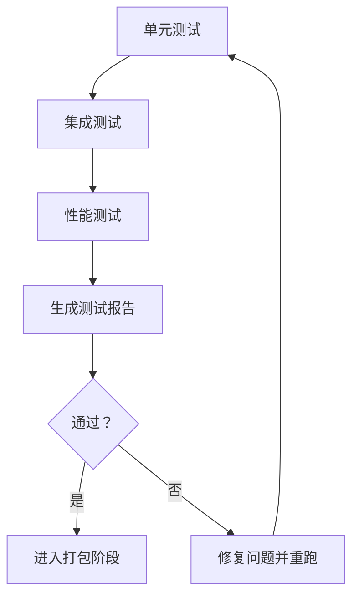

章节来源
- [.trae/skills/zero-skills/best-practices/overview.md:283-424](file://.trae/skills/zero-skills/best-practices/overview.md#L283-L424)

### 部署策略
- 蓝绿部署：准备两套完全相同的环境，流量在两者间切换，降低风险
- 滚动更新：逐步替换实例，保持服务可用性
- 金丝雀发布：先对小部分流量放量，观察指标后再扩大范围

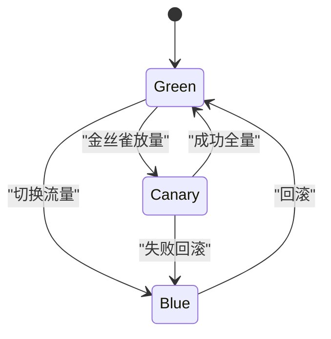

### 回滚机制与灾难恢复
- 版本管理：镜像标签包含时间戳与版本号，便于快速回滚
- 配置回滚：通过 Git 管理配置文件，变更前保留快照，回滚时恢复
- 数据备份：对 MySQL/PostgreSQL/TDengine 进行定期备份，结合 Kafka/Redis 快速恢复
- 配置文件示例：参考 trigger 与 ieccaller 的配置，确保连接参数正确

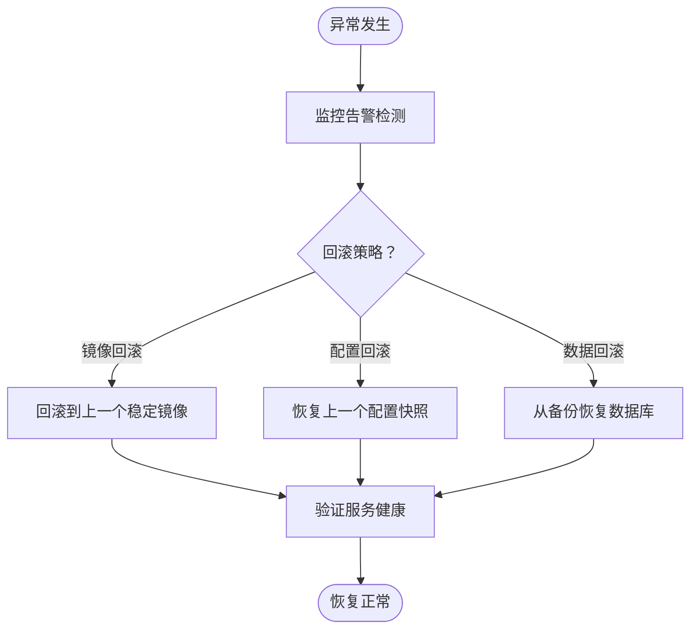

章节来源
- [app/trigger/etc/trigger.yaml:1-37](file://app/trigger/etc/trigger.yaml#L1-L37)
- [app/ieccaller/etc/ieccaller.yaml:1-79](file://app/ieccaller/etc/ieccaller.yaml#L1-L79)

### CI/CD 工具与最佳实践
- 版本控制：Git（含分支保护、PR 审批）
- CI 服务器：GitHub Actions/Jenkins（推荐使用 GitHub Actions）
- 依赖更新：update_deps.sh 或 depu 工具
- 部署脚本：deploy.sh 支持 dev/test 环境自动化部署
- 远程运维：Taskfile-docker.yml 提供远程 docker compose 控制

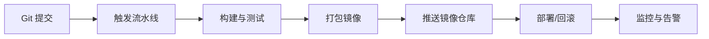

章节来源
- [.trae/skills/dev-environment/SKILL.md:175-200](file://.trae/skills/dev-environment/SKILL.md#L175-L200)
- [util/Taskfile.yml:1-33](file://util/Taskfile.yml#L1-L33)
- [util/Taskfile-docker.yml:1-37](file://util/Taskfile-docker.yml#L1-L37)
- [app/trigger/deploy.sh:1-50](file://app/trigger/deploy.sh#L1-L50)

## 依赖分析
- 语言与框架：Go 1.25 + go-zero
- RPC 与协议：gRPC + grpc-gateway + protobuf
- 消息与任务：Kafka(asynq) + Redis
- 数据库：MySQL/PostgreSQL/SQLite/TDengine
- 实时通信：SocketIO + MQTT
- 监控：OpenTelemetry + Prometheus

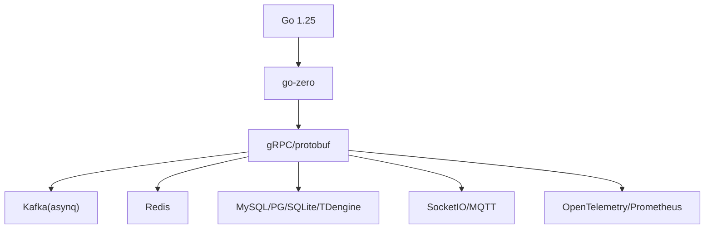

章节来源
- [go.mod:1-245](file://go.mod#L1-L245)
- [README.md:207-225](file://README.md#L207-L225)

## 性能考虑
- 构建阶段：启用 CGO 优化与并行编译，减少镜像体积（多阶段构建）
- 测试阶段：对数据库与外部系统使用连接池与超时控制，避免测试相互干扰
- 部署阶段：合理设置副本数与资源限制，开启就绪/存活探针，配合滚动更新
- 监控阶段：对关键指标（QPS、P95/P99、错误率、队列长度）建立阈值告警

## 故障排查指南
- 配置问题：核对 etc/*.yaml 中的连接参数（数据库、Kafka、Redis、MQTT），确保与部署环境一致
- 依赖缺失：执行 go mod tidy，确认第三方依赖版本兼容
- 镜像问题：检查 Dockerfile 构建上下文与缓存，必要时清理缓存后重试
- 远程部署：使用 Taskfile-docker.yml 提供的远程 up/restart/stop/start 命令，确认 SSH 凭据与 docker-compose 路径

章节来源
- [app/trigger/etc/trigger.yaml:1-37](file://app/trigger/etc/trigger.yaml#L1-L37)
- [app/ieccaller/etc/ieccaller.yaml:1-79](file://app/ieccaller/etc/ieccaller.yaml#L1-L79)
- [util/Taskfile-docker.yml:1-37](file://util/Taskfile-docker.yml#L1-L37)

## 结论
通过将构建、测试、打包、部署四阶段解耦并自动化，结合蓝绿/滚动/金丝雀等部署策略与完善的回滚与灾难恢复机制，zero-service 可实现高效、安全、可观测的交付流程。建议在团队内推广统一的脚本与规范，持续优化测试覆盖率与性能指标。

## 附录
- 快速开始与部署参考：README 中的“快速开始”、“部署”章节
- 服务配置参考：各服务 etc/*.yaml 示例
- 远程运维参考：util/Taskfile-docker.yml 与 deploy.sh

章节来源
- [README.md:226-350](file://README.md#L226-L350)