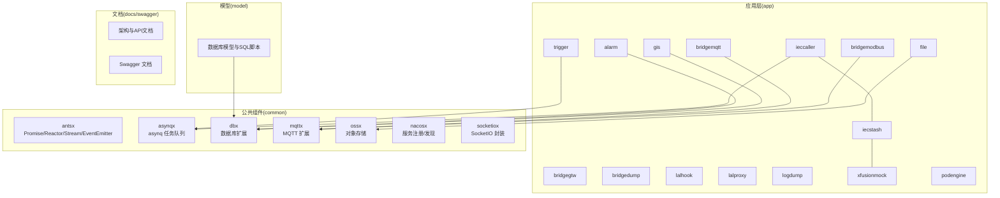
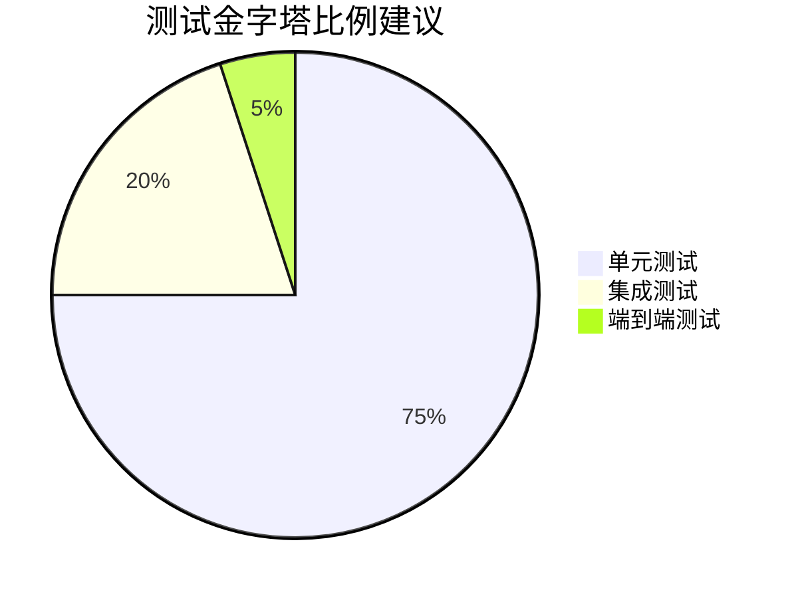
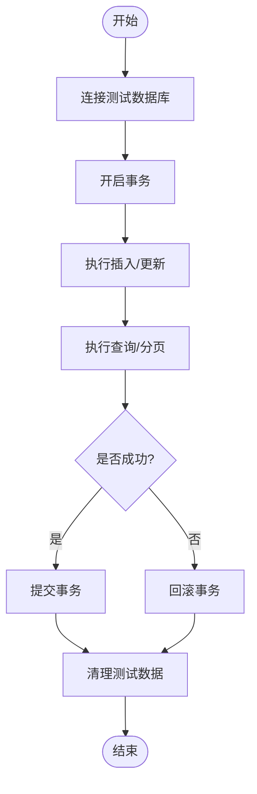
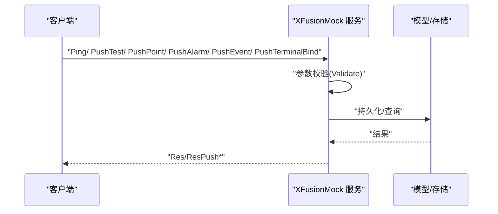
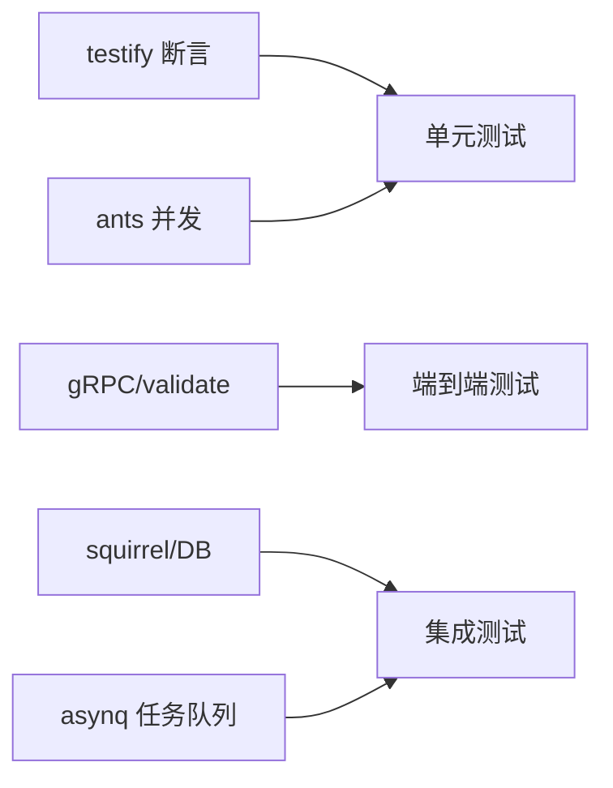

# 测试策略与实践

<cite>
**本文引用的文件**
- [go.mod](file://go.mod)
- [README.md](file://README.md)
- [overview.md](file://.trae/skills/zero-skills/best-practices/overview.md)
- [antsx_test.go](file://common/antsx/antsx_test.go)
- [antsx.go](file://common/antsx/antsx.go)
- [emitter.go](file://common/antsx/emitter.go)
- [stream.go](file://common/antsx/stream.go)
- [trigger.md](file://docs/trigger.md)
- [genModel.sh](file://model/genModel.sh)
- [ordertxnmodel_gen.go](file://model/ordertxnmodel_gen.go)
- [planbatchmodel_gen.go](file://model/planbatchmodel_gen.go)
- [xfusionmock_grpc.pb.go](file://app/xfusionmock/xfusionmock/xfusionmock_grpc.pb.go)
- [xfusionmock.pb.go](file://app/xfusionmock/xfusionmock/xfusionmock.pb.go)
- [xfusionmock.pb.validate.go](file://app/xfusionmock/xfusionmock/xfusionmock.pb.validate.go)
</cite>

## 目录
1. [引言](#引言)
2. [项目结构](#项目结构)
3. [核心组件](#核心组件)
4. [架构总览](#架构总览)
5. [详细组件分析](#详细组件分析)
6. [依赖分析](#依赖分析)
7. [性能考量](#性能考量)
8. [故障排查指南](#故障排查指南)
9. [结论](#结论)
10. [附录](#附录)

## 引言
本指南围绕 zero-service 项目，系统化地构建“测试金字塔”与“测试实践”，涵盖单元测试、集成测试与端到端测试的比例建议与实施策略；结合 TDD（测试驱动开发）理念，给出测试先行的开发流程、重构技巧与测试用例设计要点；提供 Mock 使用指南（接口模拟、依赖注入、测试替身）；并总结测试数据管理（准备、隔离、清理）的最佳实践。文中所有技术细节均来自仓库现有源码与文档，确保可落地、可复用。

## 项目结构
zero-service 采用 go-zero 微服务脚手架，服务以“app/服务名”组织，公共能力集中在 common/，数据库模型在 model/，文档与 Swagger 在 docs/swagger/。整体呈现“多服务 + 公共组件 + 模型 + 文档”的分层结构。



图表来源
- [README.md:59-108](file://README.md#L59-L108)
- [go.mod:5-62](file://go.mod#L5-L62)

章节来源
- [README.md:59-108](file://README.md#L59-L108)
- [go.mod:5-62](file://go.mod#L5-L62)

## 核心组件
- 测试框架与断言：项目中明确使用 testify 断言库进行单元测试断言，参考最佳实践文档中的示例。
- 并发与响应式：common/antsx 提供 Promise/Reactor/Stream/EventEmitter 等并发与响应式原语，便于编写高并发场景下的单元测试。
- 数据库与事务：model 层提供基于 squirrel 的查询构造器与事务封装，适合集成测试与数据库测试。
- gRPC 与协议：app/*/xfusionmock 等服务提供 gRPC 接口与 proto 定义，适合端到端测试与契约测试。
- 任务队列：asynq 用于异步任务调度，适合集成测试中对 Redis/队列行为的验证。

章节来源
- [overview.md:283-424](file://.trae/skills/zero-skills/best-practices/overview.md#L283-L424)
- [antsx.go:1-214](file://common/antsx/antsx.go#L1-L214)
- [antsx_test.go:1-109](file://common/antsx/antsx_test.go#L1-L109)
- [ordertxnmodel_gen.go:406-412](file://model/ordertxnmodel_gen.go#L406-L412)
- [planbatchmodel_gen.go:537-555](file://model/planbatchmodel_gen.go#L537-L555)
- [xfusionmock_grpc.pb.go:30-58](file://app/xfusionmock/xfusionmock/xfusionmock_grpc.pb.go#L30-L58)

## 架构总览
测试金字塔在 zero-service 中的落地建议：
- 单元测试（70%~80%）：针对 common/antsx 的 Promise/Reactor/Stream/EventEmitter、工具函数与纯函数；以及 app/* 内部逻辑层（internal/logic）的无外部依赖单元逻辑。
- 集成测试（15%~25%）：数据库事务、gRPC 服务间调用、Kafka/Redis 等外部依赖的最小组合验证。
- 端到端测试（5%~10%）：跨服务链路验证（如 IEC 104 数采链路、Trigger 回调链路），侧重真实环境与契约一致性。



## 详细组件分析

### 单元测试：并发与响应式原语（common/antsx）
- 目标：验证 Promise/Reactor/Stream/EventEmitter 的正确性与边界条件。
- 方法：利用 Submit/Post 提交任务，Then 链式转换，Catch 错误处理，Await 结果等待；验证成功与失败路径、并发安全、资源释放。
- 示例参考：[antsx_test.go:13-109](file://common/antsx/antsx_test.go#L13-L109)，[antsx.go:168-193](file://common/antsx/antsx.go#L168-L193)。

```mermaid
classDiagram
class Promise {
+string id
+Await(ctx) T,error
+Then(ctx, fn) Promise
+Catch(fn) Promise
+Resolve(val) void
+Reject(err) void
+FireAndForget(ctx) void
}
class Reactor {
+Submit(ctx, id, task) Promise
+Post(ctx, task) error
+Release() void
+ActiveCount() int
}
class Stream {
+Send(val) bool
+SendBlocking(val) bool
+Receive() <-chan T
+Done() <-chan struct{}
+Close() void
+IsClosed() bool
+Pipe(fn, size) Stream
+Filter(fn, size) Stream
}
class EventEmitter {
+Subscribe(topic, bufSize) <-chan T, func()
+Emit(topic, value) void
+TopicCount() int
+SubscriberCount(topic) int
+Close() void
}
Reactor --> Promise : "提交任务返回"
Stream --> Stream : "管道/过滤"
EventEmitter --> Subscriber : "发布/订阅"
```

图表来源
- [antsx.go:15-214](file://common/antsx/antsx.go#L15-L214)
- [emitter.go:13-118](file://common/antsx/emitter.go#L13-L118)
- [stream.go:7-147](file://common/antsx/stream.go#L7-L147)

章节来源
- [antsx_test.go:13-109](file://common/antsx/antsx_test.go#L13-L109)
- [antsx.go:168-193](file://common/antsx/antsx.go#L168-L193)
- [emitter.go:27-83](file://common/antsx/emitter.go#L27-L83)
- [stream.go:80-146](file://common/antsx/stream.go#L80-L146)

### 集成测试：数据库与事务（model）
- 目标：验证模型层的查询、分页、事务一致性与 builder 使用。
- 方法：使用 TransactCtx 进行事务包裹，验证插入、查询、分页与异常回滚；结合测试数据库清理策略。
- 示例参考：[ordertxnmodel_gen.go:406-412](file://model/ordertxnmodel_gen.go#L406-L412)、[planbatchmodel_gen.go:537-555](file://model/planbatchmodel_gen.go#L537-L555)。



图表来源
- [ordertxnmodel_gen.go:406-412](file://model/ordertxnmodel_gen.go#L406-L412)
- [planbatchmodel_gen.go:537-555](file://model/planbatchmodel_gen.go#L537-L555)

章节来源
- [ordertxnmodel_gen.go:406-412](file://model/ordertxnmodel_gen.go#L406-L412)
- [planbatchmodel_gen.go:537-555](file://model/planbatchmodel_gen.go#L537-L555)

### 端到端测试：gRPC 与服务链路（app/xfusionmock）
- 目标：验证 gRPC 接口契约、参数校验与服务间调用链路。
- 方法：使用生成的 gRPC 客户端调用 Ping/Push* 接口，结合 proto 验证规则，覆盖正常与异常输入。
- 示例参考：[xfusionmock_grpc.pb.go:30-58](file://app/xfusionmock/xfusionmock/xfusionmock_grpc.pb.go#L30-L58)、[xfusionmock.pb.go:27-101](file://app/xfusionmock/xfusionmock/xfusionmock.pb.go#L27-L101)、[xfusionmock.pb.validate.go:247-276](file://app/xfusionmock/xfusionmock/xfusionmock.pb.validate.go#L247-L276)。



图表来源
- [xfusionmock_grpc.pb.go:30-58](file://app/xfusionmock/xfusionmock/xfusionmock_grpc.pb.go#L30-L58)
- [xfusionmock.pb.go:27-101](file://app/xfusionmock/xfusionmock/xfusionmock.pb.go#L27-L101)
- [xfusionmock.pb.validate.go:247-276](file://app/xfusionmock/xfusionmock/xfusionmock.pb.validate.go#L247-L276)

章节来源
- [xfusionmock_grpc.pb.go:30-58](file://app/xfusionmock/xfusionmock/xfusionmock_grpc.pb.go#L30-L58)
- [xfusionmock.pb.go:27-101](file://app/xfusionmock/xfusionmock/xfusionmock.pb.go#L27-L101)
- [xfusionmock.pb.validate.go:247-276](file://app/xfusionmock/xfusionmock/xfusionmock.pb.validate.go#L247-L276)

### TDD 实践：测试先行与重构
- 测试先行：先编写断言明确需求，再实现逻辑；参考最佳实践中的单元测试模板与断言风格。
- 重构技巧：利用 common/antsx 的 Promise/Reactor/Stream/EventEmitter 作为可测试的并发抽象，降低耦合；将复杂逻辑拆分为纯函数与可注入依赖。
- 测试用例设计：覆盖正常路径、边界条件、异常路径；对 gRPC 参数使用 proto 验证规则进行边界覆盖。

章节来源
- [overview.md:283-424](file://.trae/skills/zero-skills/best-practices/overview.md#L283-L424)
- [antsx.go:1-214](file://common/antsx/antsx.go#L1-L214)

### Mock 使用指南：接口模拟与依赖注入
- 接口模拟：使用 go.uber.org/mock/gomock 生成接口 Mock，并在 ServiceContext 中注入，隔离外部依赖。
- 依赖注入：在测试中以接口形式注入 Mock，避免直接依赖具体实现或外部服务。
- 测试替身：对 Kafka/Redis/DB 等外部依赖，使用轻量替身（如 SQLite/内存 Redis）或容器化替代。

章节来源
- [overview.md:392-424](file://.trae/skills/zero-skills/best-practices/overview.md#L392-L424)

### 测试数据管理：准备、隔离与清理
- 准备：使用 model/genModel.sh 生成模型与 SQL，结合测试数据库初始化脚本。
- 隔离：每个测试使用独立数据库或表空间，避免并发干扰；使用事务包裹测试，失败即回滚。
- 清理：测试结束后删除临时数据或回滚事务；对 gRPC/HTTP 接口测试，清理缓存与队列状态。

章节来源
- [genModel.sh:1-25](file://model/genModel.sh#L1-L25)
- [ordertxnmodel_gen.go:406-412](file://model/ordertxnmodel_gen.go#L406-L412)

## 依赖分析
- 测试框架与断言：github.com/stretchr/testify（在最佳实践示例中使用）。
- 并发与响应式：github.com/panjf2000/ants/v2（antsx 使用）。
- gRPC 与验证：google.golang.org/grpc、github.com/envoyproxy/protoc-gen-validate（xfusionmock 使用）。
- 数据库与事务：Masterminds/squirrel、go-sql-driver/mysql/postgres（model 层使用）。
- 任务队列：github.com/hibiken/asynq（Trigger 服务使用）。



图表来源
- [go.mod:5-62](file://go.mod#L5-L62)
- [overview.md:283-424](file://.trae/skills/zero-skills/best-practices/overview.md#L283-L424)

章节来源
- [go.mod:5-62](file://go.mod#L5-L62)

## 性能考量
- 单元测试：优先使用内存替身，避免 IO；对并发组件（Promise/Reactor/Stream/EventEmitter）进行超时与上下文控制。
- 集成测试：使用最小化外部依赖（SQLite/内存 Redis），缩短测试时长；对数据库事务进行合理拆分，避免长事务。
- 端到端测试：尽量减少真实外部系统依赖，必要时使用容器化替代；对 gRPC/HTTP 接口设置合理超时与重试策略。

## 故障排查指南
- gRPC 参数校验失败：检查 proto 验证规则与输入数据，参考 xfusionmock 的验证实现。
- 事务未生效或回滚异常：确认 TransactCtx 使用正确，异常路径是否提前返回；核对受影响行数与错误信息。
- 并发竞态：关注 Promise/Reactor/Stream/EventEmitter 的并发安全，确保通道关闭与资源释放顺序正确。

章节来源
- [xfusionmock.pb.validate.go:247-276](file://app/xfusionmock/xfusionmock/xfusionmock.pb.validate.go#L247-L276)
- [ordertxnmodel_gen.go:406-412](file://model/ordertxnmodel_gen.go#L406-L412)
- [antsx.go:168-193](file://common/antsx/antsx.go#L168-L193)

## 结论
通过在 zero-service 中落实测试金字塔、TDD 流程与 Mock/测试数据管理，可以显著提升代码质量与交付效率。建议以 common/antsx 的并发原语与 model 的事务封装为基础，逐步完善单元与集成测试；以 gRPC 与服务链路为切入点，建设端到端测试，最终形成稳定、可演进的测试体系。

## 附录
- 测试框架与断言示例参考：[overview.md:283-424](file://.trae/skills/zero-skills/best-practices/overview.md#L283-L424)
- 并发与响应式单元测试参考：[antsx_test.go:13-109](file://common/antsx/antsx_test.go#L13-L109)
- 数据库事务与模型参考：[ordertxnmodel_gen.go:406-412](file://model/ordertxnmodel_gen.go#L406-L412)、[planbatchmodel_gen.go:537-555](file://model/planbatchmodel_gen.go#L537-L555)
- gRPC 与协议验证参考：[xfusionmock_grpc.pb.go:30-58](file://app/xfusionmock/xfusionmock/xfusionmock_grpc.pb.go#L30-L58)、[xfusionmock.pb.go:27-101](file://app/xfusionmock/xfusionmock/xfusionmock.pb.go#L27-L101)、[xfusionmock.pb.validate.go:247-276](file://app/xfusionmock/xfusionmock/xfusionmock.pb.validate.go#L247-L276)
- 模型生成与初始化参考：[genModel.sh:1-25](file://model/genModel.sh#L1-L25)
- Trigger 服务架构与测试建议参考：[trigger.md:1-38](file://docs/trigger.md#L1-L38)