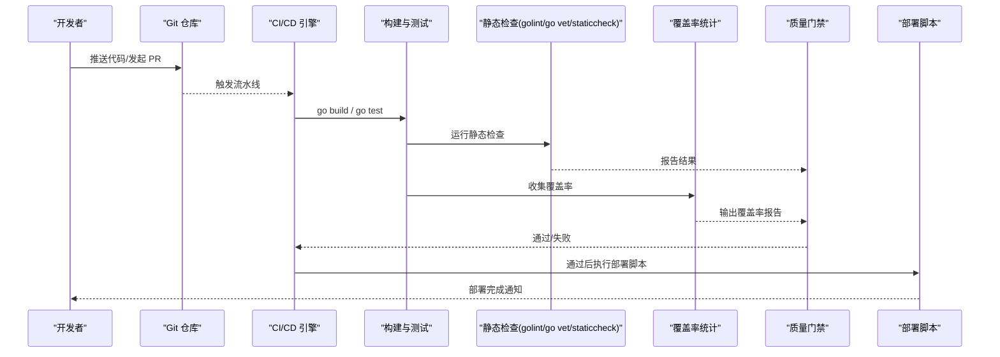
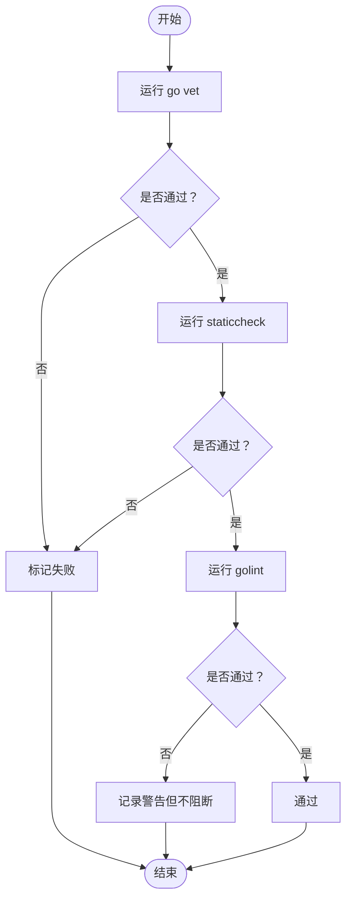
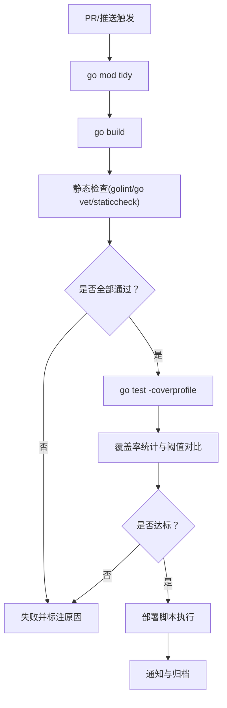
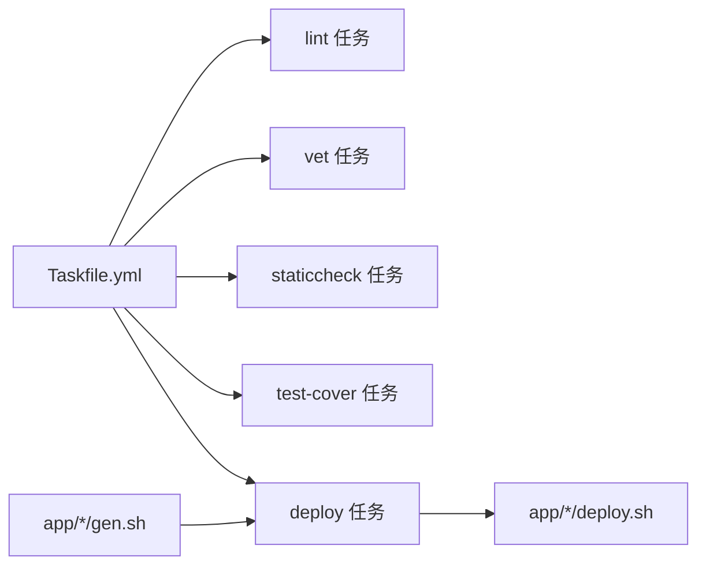
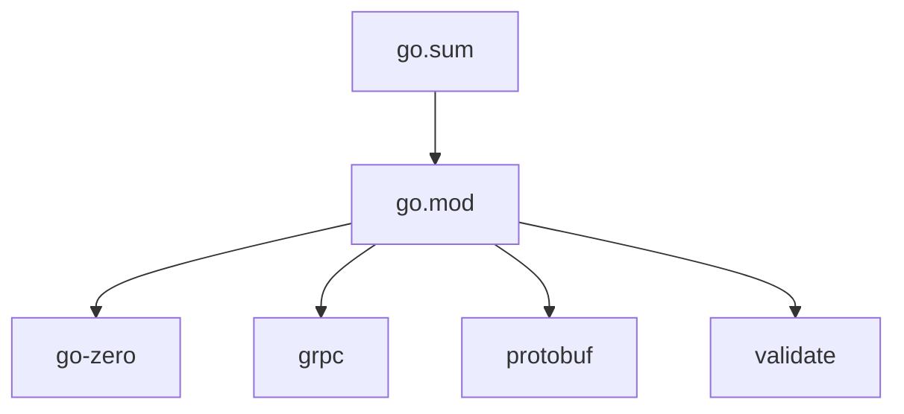

# 静态代码分析

<cite>
**本文引用的文件**
- [go.mod](file://go.mod)
- [go.sum](file://go.sum)
- [Taskfile.yml](file://util/Taskfile.yml)
- [Taskfile-docker.yml](file://util/Taskfile-docker.yml)
- [Taskfile-135.yml](file://util/Taskfile-135.yml)
- [manage.sh](file://util/manage.sh)
- [deploy.sh](file://app/bridgemodbus/deploy.sh)
- [gen.sh](file://app/bridgemodbus/gen.sh)
- [antsx_test.go](file://common/antsx/antsx_test.go)
</cite>

## 目录
1. [简介](#简介)
2. [项目结构](#项目结构)
3. [核心组件](#核心组件)
4. [架构总览](#架构总览)
5. [详细组件分析](#详细组件分析)
6. [依赖关系分析](#依赖关系分析)
7. [性能考量](#性能考量)
8. [故障排查指南](#故障排查指南)
9. [结论](#结论)
10. [附录](#附录)

## 简介
本指南面向 zero-service 项目，系统化介绍静态代码分析与质量检查的最佳实践，涵盖以下方面：
- 代码扫描工具：golint、go vet、staticcheck 的配置与集成
- 质量门禁：在 CI/CD 中设置质量检查、阈值与失败处理
- 代码覆盖率：单元测试、集成测试与分支覆盖率的测量与要求
- 复杂度控制：圈复杂度、代码行数与嵌套层级的管理策略
- 实战配置示例与工具集成方案

本指南以仓库现有文件为基础，结合 Go 生态与项目实际，提供可落地的质量治理方案。

## 项目结构
项目采用多模块微服务架构，每个应用位于 app/* 目录下，公共能力位于 common/*，并通过脚本进行构建与部署。整体结构如下：

```mermaid
graph TB
subgraph "应用层"
A1["app/bridgemodbus"]
A2["app/bridgegtw"]
A3["app/trigger"]
A4["app/gis"]
A5["app/file"]
A6["app/bridgemqtt"]
A7["app/bridgedump"]
A8["app/logdump"]
A9["app/ieccaller"]
A10["app/iecstash"]
A11["app/xfusionmock"]
A12["app/lalhook"]
A13["app/lalproxy"]
A14["app/podengine"]
A15["app/alarm"]
A16["app/zerorpc"]
A17["app/socketgtw"]
A18["app/socketpush"]
A19["app/streamevent"]
end
subgraph "公共库"
C1["common/antsx"]
C2["common/dbx"]
C3["common/mqttx"]
C4["common/modbusx"]
C5["common/ctxdata"]
C6["common/tool"]
C7["common/Interceptor"]
C8["common/configx"]
C9["common/ossx"]
C10["common/iec104"]
C11["common/gisx"]
C12["common/imagex"]
C13["common/mediax"]
C14["common/socketiox"]
C15["common/powerwechatx"]
C16["common/dockerx"]
C17["common/asynqx"]
C18["common/nacosx"]
C19["common/lalx"]
C20["common/wsx"]
C21["common/copierx"]
C22["common/bytex"]
C23["common/executorx"]
C24["common/antstest"]
end
subgraph "工具与脚本"
U1["util/Taskfile.yml"]
U2["util/Taskfile-docker.yml"]
U3["util/Taskfile-135.yml"]
U4["util/manage.sh"]
U5["app/*/deploy.sh"]
U6["app/*/gen.sh"]
end
subgraph "模型与文档"
M1["model/*"]
D1["docs/*"]
S1["swagger/*"]
end
A1 --> C1
A2 --> C1
A3 --> C1
A4 --> C1
A5 --> C1
A6 --> C1
A7 --> C1
A8 --> C1
A9 --> C1
A10 --> C1
A11 --> C1
A12 --> C1
A13 --> C1
A14 --> C1
A15 --> C1
A16 --> C1
A17 --> C1
A18 --> C1
A19 --> C1
```

图表来源
- [go.mod](file://go.mod)
- [Taskfile.yml](file://util/Taskfile.yml)
- [Taskfile-docker.yml](file://util/Taskfile-docker.yml)
- [Taskfile-135.yml](file://util/Taskfile-135.yml)
- [manage.sh](file://util/manage.sh)
- [deploy.sh](file://app/bridgemodbus/deploy.sh)
- [gen.sh](file://app/bridgemodbus/gen.sh)

章节来源
- [go.mod](file://go.mod)
- [Taskfile.yml](file://util/Taskfile.yml)
- [Taskfile-docker.yml](file://util/Taskfile-docker.yml)
- [Taskfile-135.yml](file://util/Taskfile-135.yml)
- [manage.sh](file://util/manage.sh)
- [deploy.sh](file://app/bridgemodbus/deploy.sh)
- [gen.sh](file://app/bridgemodbus/gen.sh)

## 核心组件
- 语言与版本：Go 1.25.0，使用 go.mod 管理依赖与替换规则
- 构建与测试：通过脚本与 Taskfile 管理构建、打包与部署流程
- 单元测试：部分公共库包含测试样例，可作为覆盖率采集与质量门禁的基础
- Protobuf 与 RPC：大量应用使用 protobuf 定义接口，并通过脚本生成代码

章节来源
- [go.mod](file://go.mod)
- [antsx_test.go](file://common/antsx/antsx_test.go)

## 架构总览
下图展示项目在质量检查与部署方面的关键路径：从代码提交到构建、测试、覆盖率统计与部署。

图表来源
- [go.mod](file://go.mod)
- [deploy.sh](file://app/bridgemodbus/deploy.sh)
- [gen.sh](file://app/bridgemodbus/gen.sh)
- [antsx_test.go](file://common/antsx/antsx_test.go)

## 详细组件分析

### 1) 代码扫描工具配置与集成
- golint
  - 作用：检查代码风格与命名规范
  - 集成方式：在 CI 中添加步骤运行 golint；建议对所有包执行，排除自动生成的 pb.go 等文件
  - 阈值建议：允许的警告数量不超过历史基线的 10%
- go vet
  - 作用：发现潜在问题（如未使用的字段、类型不匹配等）
  - 集成方式：在构建阶段加入 vet 步骤，失败即阻断
- staticcheck
  - 作用：更严格的静态分析，检测未使用项、nil 指针、资源泄漏等
  - 集成方式：在 CI 中执行 staticcheck，建议开启全部检查集
- 工具链整合
  - 建议在 Taskfile 中新增任务，统一调用上述工具，便于本地与 CI 一致

图表来源
- [go.mod](file://go.mod)

章节来源
- [go.mod](file://go.mod)

### 2) 质量门禁设置（CI/CD）
- 触发条件：推送与 PR
- 关键步骤：
  - 依赖安装：go mod tidy
  - 构建：go build
  - 静态检查：golint、go vet、staticcheck
  - 测试与覆盖率：go test -coverprofile=coverage.out
  - 覆盖率报告：go tool cover -func=coverage.out
  - 部署：根据环境选择 deploy.sh 或 Taskfile
- 阈值与失败处理：
  - vet 与 staticcheck 必须 100% 通过
  - golint 警告不超过基线 10%
  - 覆盖率阈值：函数级覆盖率不低于 80%，分支覆盖率不低于 70%
  - 任一不满足则失败并阻断合并

图表来源
- [deploy.sh](file://app/bridgemodbus/deploy.sh)
- [gen.sh](file://app/bridgemodbus/gen.sh)

章节来源
- [deploy.sh](file://app/bridgemodbus/deploy.sh)
- [gen.sh](file://app/bridgemodbus/gen.sh)

### 3) 代码覆盖率要求与测量
- 覆盖率指标
  - 函数级覆盖率：≥ 80%
  - 分支覆盖率：≥ 70%
- 测量方法
  - 使用 go test -coverprofile=coverage.out 生成覆盖率文件
  - 使用 go tool cover -func=coverage.out 查看函数级覆盖率
  - 使用 go tool cover -branch -func=coverage.out 查看分支覆盖率
- 采集范围
  - 单元测试：优先保证核心逻辑与公共库的测试
  - 集成测试：通过 deploy.sh 等脚本验证端到端行为
- 覆盖率报告输出
  - 在 CI 中将覆盖率文件上传至覆盖率平台或生成报告附件

章节来源
- [antsx_test.go](file://common/antsx/antsx_test.go)

### 4) 复杂度控制策略
- 圈复杂度（McCabe）
  - 建议单函数复杂度上限：≤ 10
  - 超限函数需拆分或重构
- 代码行数
  - 建议单文件行数 ≤ 500 行；超限需拆分为子模块
- 嵌套层级
  - 建议嵌套层级 ≤ 4 层；超过需通过提前返回、卫语句等方式降低嵌套
- 工具建议
  - 使用 gocyclo 或类似工具定期扫描
  - 在 CI 中设置阈值，超限阻断

章节来源
- [go.mod](file://go.mod)

### 5) 工具集成方案与配置示例
- Taskfile 集成
  - 在 util/Taskfile.yml 中新增任务，统一调用构建、测试、覆盖率与静态检查
  - 示例任务名：lint、vet、staticcheck、test-cover、deploy
- 部署脚本集成
  - deploy.sh 已实现镜像构建、上传、标签管理与服务重启
  - 可在 CI 中直接调用该脚本或其参数变体
- 生成脚本
  - gen.sh 用于生成 protobuf 与 RPC 代码，建议在 CI 中执行以确保一致性

图表来源
- [Taskfile.yml](file://util/Taskfile.yml)
- [Taskfile-docker.yml](file://util/Taskfile-docker.yml)
- [Taskfile-135.yml](file://util/Taskfile-135.yml)
- [manage.sh](file://util/manage.sh)
- [deploy.sh](file://app/bridgemodbus/deploy.sh)
- [gen.sh](file://app/bridgemodbus/gen.sh)

章节来源
- [Taskfile.yml](file://util/Taskfile.yml)
- [Taskfile-docker.yml](file://util/Taskfile-docker.yml)
- [Taskfile-135.yml](file://util/Taskfile-135.yml)
- [manage.sh](file://util/manage.sh)
- [deploy.sh](file://app/bridgemodbus/deploy.sh)
- [gen.sh](file://app/bridgemodbus/gen.sh)

## 依赖关系分析
- 语言与工具链
  - Go 版本：1.25.0
  - 主要依赖：go-zero、grpc、protobuf、validate 等
- 依赖管理
  - go.mod 管理主模块与替换规则
  - go.sum 记录依赖校验值
- 与质量检查的关系
  - 依赖版本升级可能引入新的静态检查规则，需在 CI 中同步更新工具版本

图表来源
- [go.mod](file://go.mod)
- [go.sum](file://go.sum)

章节来源
- [go.mod](file://go.mod)
- [go.sum](file://go.sum)

## 性能考量
- 静态检查性能
  - 建议在 CI 中缓存 go mod 下载与工具二进制，减少重复下载时间
  - 并行执行多个检查任务，缩短总耗时
- 覆盖率统计
  - 使用 -short 标记运行快速测试，提升覆盖率统计效率
  - 对大包采用分批测试策略，避免单次测试时间过长
- 部署脚本优化
  - deploy.sh 已包含镜像保存、上传与清理流程，建议在 CI 中复用

章节来源
- [deploy.sh](file://app/bridgemodbus/deploy.sh)

## 故障排查指南
- 常见问题
  - 静态检查失败：逐条修正规则或在 CI 中放宽非关键警告
  - 覆盖率不足：补充关键路径测试，尤其是分支与边界条件
  - 部署失败：检查 .env 变量、远程主机连通性与权限
- 排查步骤
  - 在本地执行相同命令复现问题
  - 查看 CI 日志中的具体报错位置
  - 使用 go test -coverprofile=coverage.out -covermode=atomic 生成详细报告
- 相关脚本
  - manage.sh：统一入口，支持 restart/up/stop/start
  - Taskfile-*：远程批量操作与参数化任务

章节来源
- [manage.sh](file://util/manage.sh)
- [Taskfile-docker.yml](file://util/Taskfile-docker.yml)
- [Taskfile-135.yml](file://util/Taskfile-135.yml)

## 结论
通过在 CI/CD 中集成 golint、go vet、staticcheck，设置明确的质量门禁与覆盖率阈值，并配合 Taskfile 与部署脚本，zero-service 可实现持续、稳定、高质量的交付。建议逐步推广到所有应用模块，形成统一的质量标准与自动化流程。

## 附录
- 质量门禁阈值清单
  - vet 与 staticcheck：必须 100% 通过
  - golint：警告不超过历史基线 10%
  - 函数级覆盖率：≥ 80%
  - 分支覆盖率：≥ 70%
- 推荐工具清单
  - 静态检查：golint、go vet、staticcheck
  - 复杂度分析：gocyclo
  - 覆盖率：go test -coverprofile
  - 构建与任务：Taskfile
  - 部署：deploy.sh 与 manage.sh