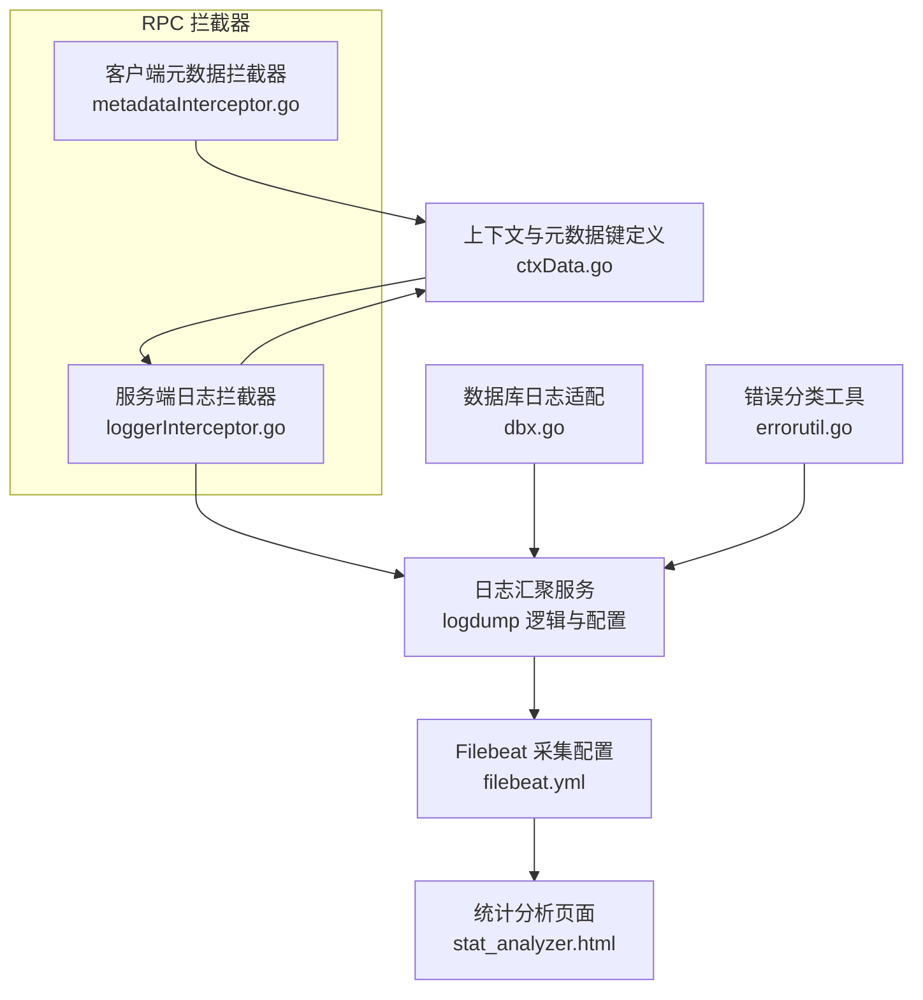
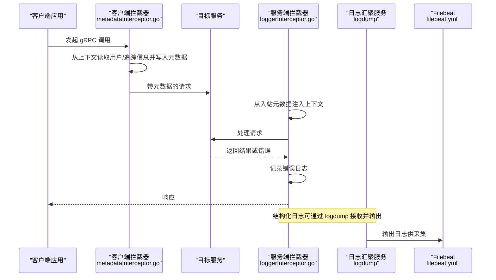
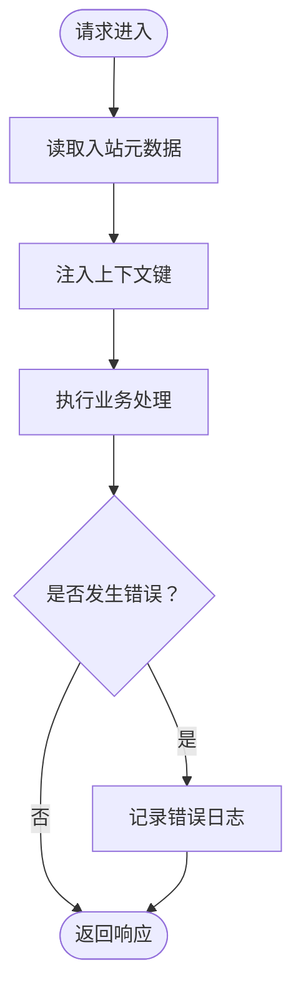
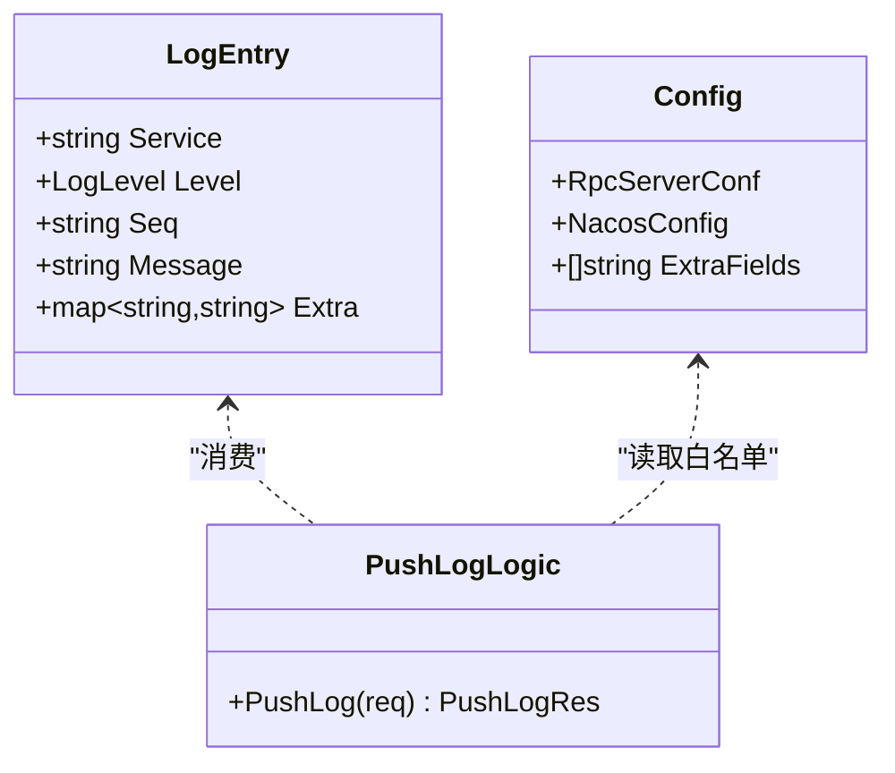
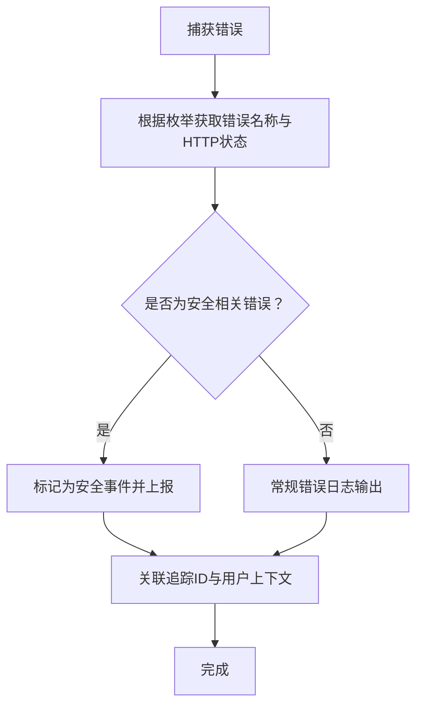
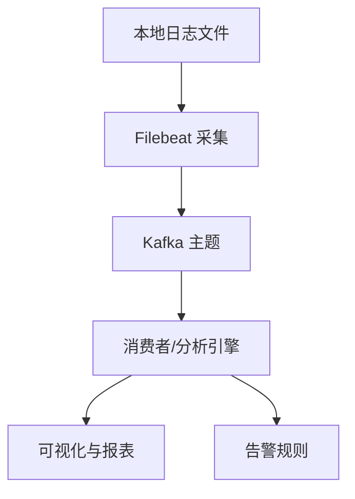
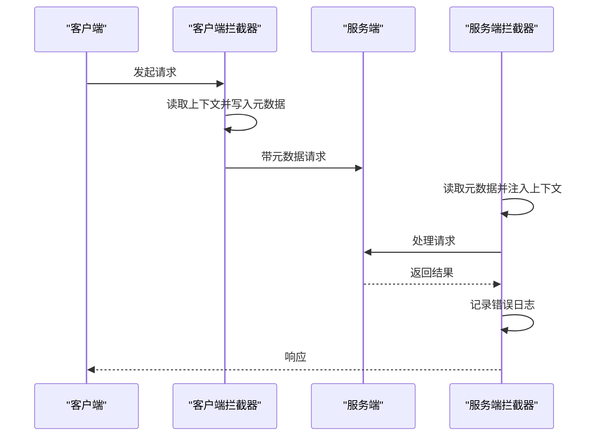
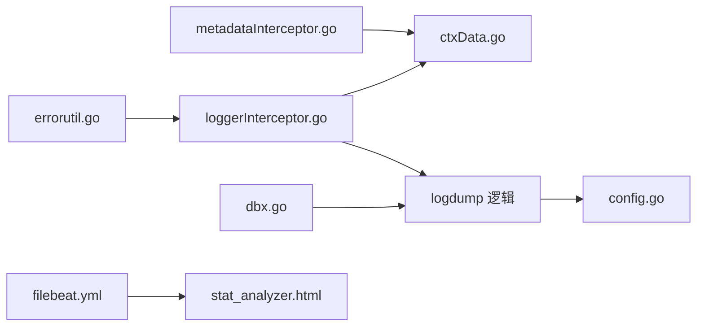

# 安全审计与日志记录

<cite>
**本文引用的文件**   
- [loggerInterceptor.go](file://common/Interceptor/rpcserver/loggerInterceptor.go)
- [metadataInterceptor.go](file://common/Interceptor/rpcclient/metadataInterceptor.go)
- [ctxData.go](file://common/ctxdata/ctxData.go)
- [config.go](file://app/logdump/internal/config/config.go)
- [logdump.pb.go](file://app/logdump/logdump/logdump.pb.go)
- [logdump_grpc.pb.go](file://app/logdump/logdump/logdump_grpc.pb.go)
- [pushloglogic.go](file://app/logdump/internal/logic/pushloglogic.go)
- [pinglogic.go](file://app/logdump/internal/logic/pinglogic.go)
- [dbx.go](file://common/dbx/dbx.go)
- [errorutil.go](file://common/tool/errorutil.go)
- [tool.go](file://common/tool/tool.go)
- [filebeat.yml](file://deploy/filebeat/conf/filebeat.yml)
- [stat_analyzer.html](file://deploy/stat_analyzer.html)
</cite>

## 目录
1. [简介](#简介)
2. [项目结构](#项目结构)
3. [核心组件](#核心组件)
4. [架构总览](#架构总览)
5. [详细组件分析](#详细组件分析)
6. [依赖分析](#依赖分析)
7. [性能考量](#性能考量)
8. [故障排查指南](#故障排查指南)
9. [结论](#结论)
10. [附录](#附录)

## 简介
本文件面向 zero-service 的安全审计与日志记录实践，围绕访问日志、操作日志、异常日志、合规与脱敏、日志聚合与分析、存储与取证以及日志拦截器与元数据传递机制展开，帮助读者在不直接阅读代码的前提下理解整体设计与落地要点，并提供可操作的实施建议。

## 项目结构
从仓库中与日志与审计相关的关键位置如下：
- RPC 侧拦截器：客户端与服务端分别负责元数据注入与透传、上下文注入与错误记录
- 上下文与元数据：统一的 Header 键与上下文键定义，便于跨服务传递用户与追踪信息
- 日志采集与投递：Filebeat 配置用于将桥接 dump 产生的文本日志采集并投递至 Kafka
- 日志汇聚服务：logdump 服务接收结构化日志条目，按级别输出到统一日志通道
- 数据库日志：数据库查询日志通过适配器映射到统一日志框架
- 异常与错误：基于 protobuf 枚举的错误分类与 HTTP 映射工具
- 工具函数：通用工具中包含 JWT 解析、时间戳生成、短路径生成等辅助能力

**图示来源**
- [loggerInterceptor.go:12-44](file://common/Interceptor/rpcserver/loggerInterceptor.go#L12-L44)
- [metadataInterceptor.go:11-32](file://common/Interceptor/rpcclient/metadataInterceptor.go#L11-L32)
- [ctxData.go:9-24](file://common/ctxdata/ctxData.go#L9-L24)
- [config.go:5-17](file://app/logdump/internal/config/config.go#L5-L17)
- [dbx.go:140-145](file://common/dbx/dbx.go#L140-L145)
- [errorutil.go:12-58](file://common/tool/errorutil.go#L12-L58)
- [filebeat.yml:1-122](file://deploy/filebeat/conf/filebeat.yml#L1-L122)
- [stat_analyzer.html:785-1036](file://deploy/stat_analyzer.html#L785-L1036)

**章节来源**
- [loggerInterceptor.go:12-44](file://common/Interceptor/rpcserver/loggerInterceptor.go#L12-L44)
- [metadataInterceptor.go:11-32](file://common/Interceptor/rpcclient/metadataInterceptor.go#L11-L32)
- [ctxData.go:9-24](file://common/ctxdata/ctxData.go#L9-L24)
- [config.go:5-17](file://app/logdump/internal/config/config.go#L5-L17)
- [dbx.go:140-145](file://common/dbx/dbx.go#L140-L145)
- [errorutil.go:12-58](file://common/tool/errorutil.go#L12-L58)
- [filebeat.yml:1-122](file://deploy/filebeat/conf/filebeat.yml#L1-L122)
- [stat_analyzer.html:785-1036](file://deploy/stat_analyzer.html#L785-L1036)

## 核心组件
- 访问日志与追踪
  - 服务端拦截器在请求进入时从 gRPC 元数据读取用户与追踪信息，注入到上下文，并在处理完成后记录错误日志，形成访问审计与响应跟踪的基础
  - 客户端拦截器在发起调用前将上下文中的用户与追踪信息写入出站元数据，确保跨服务链路可追踪
- 操作日志与审计轨迹
  - logdump 服务接收结构化日志条目，按级别输出；通过配置允许的 extra 字段白名单，控制可记录的结构化字段，形成可审计的操作轨迹
- 异常日志与错误分类
  - 基于 protobuf 枚举的错误名称与 HTTP 状态映射，统一错误分类；服务端拦截器对异常进行集中记录，便于统一告警与分析
- 日志采集与聚合
  - Filebeat 采集桥接 dump 的文本日志，解析 JSON 并投递到 Kafka；前端统计分析页面可加载并可视化日志数据
- 数据库日志
  - ORM 查询日志通过适配器映射到统一日志框架，便于统一收集与分析
- 元数据与上下文
  - 统一的 Header 键与上下文键，确保用户 ID、用户名、部门编码、授权信息、追踪 ID 等在服务间一致传递

**章节来源**
- [loggerInterceptor.go:12-44](file://common/Interceptor/rpcserver/loggerInterceptor.go#L12-L44)
- [metadataInterceptor.go:11-32](file://common/Interceptor/rpcclient/metadataInterceptor.go#L11-L32)
- [ctxData.go:9-24](file://common/ctxdata/ctxData.go#L9-L24)
- [pushloglogic.go:28-67](file://app/logdump/internal/logic/pushloglogic.go#L28-L67)
- [config.go:16-17](file://app/logdump/internal/config/config.go#L16-L17)
- [errorutil.go:12-58](file://common/tool/errorutil.go#L12-L58)
- [filebeat.yml:1-122](file://deploy/filebeat/conf/filebeat.yml#L1-L122)
- [dbx.go:140-145](file://common/dbx/dbx.go#L140-L145)

## 架构总览
下图展示了从 RPC 请求到日志汇聚与采集的整体流程，包括元数据传递、上下文注入、结构化日志输出与外部采集投递。

**图示来源**
- [metadataInterceptor.go:11-32](file://common/Interceptor/rpcclient/metadataInterceptor.go#L11-L32)
- [loggerInterceptor.go:12-44](file://common/Interceptor/rpcserver/loggerInterceptor.go#L12-L44)
- [filebeat.yml:1-122](file://deploy/filebeat/conf/filebeat.yml#L1-L122)

## 详细组件分析

### 访问日志与用户行为分析
- 元数据拦截器
  - 客户端拦截器在出站请求中将用户 ID、用户名、部门编码、授权信息、追踪 ID 写入元数据，保证跨服务链路可追踪
  - 服务端拦截器在入站请求中读取上述元数据并注入到上下文，便于后续日志与业务逻辑使用
- 用户行为分析
  - 通过上下文中的用户与追踪信息，可在日志中关联用户行为与请求轨迹，结合 logdump 的结构化字段白名单，实现细粒度的行为审计

**图示来源**
- [loggerInterceptor.go:12-44](file://common/Interceptor/rpcserver/loggerInterceptor.go#L12-L44)

**章节来源**
- [metadataInterceptor.go:11-32](file://common/Interceptor/rpcclient/metadataInterceptor.go#L11-L32)
- [loggerInterceptor.go:12-44](file://common/Interceptor/rpcserver/loggerInterceptor.go#L12-L44)
- [ctxData.go:9-24](file://common/ctxdata/ctxData.go#L9-L24)

### 操作日志与审计轨迹
- 结构化日志模型
  - 日志条目包含服务名、级别、序列号、消息体与额外字段映射；通过配置允许的 extra 字段白名单，限制可记录的结构化字段
- 日志输出
  - 根据日志级别输出到统一日志通道；错误级别单独分支，便于统一告警
- 审计轨迹
  - 通过追踪 ID 与用户上下文，将一次业务操作的请求、处理与响应串联为完整审计轨迹

**图示来源**
- [logdump.pb.go:113-146](file://app/logdump/logdump/logdump.pb.go#L113-L146)
- [config.go:5-17](file://app/logdump/internal/config/config.go#L5-L17)
- [pushloglogic.go:28-67](file://app/logdump/internal/logic/pushloglogic.go#L28-L67)

**章节来源**
- [logdump.pb.go:113-146](file://app/logdump/logdump/logdump.pb.go#L113-L146)
- [config.go:16-17](file://app/logdump/internal/config/config.go#L16-L17)
- [pushloglogic.go:28-67](file://app/logdump/internal/logic/pushloglogic.go#L28-L67)

### 异常日志处理与安全事件报告
- 错误分类
  - 基于 protobuf 枚举的错误名称与 HTTP 状态映射，将错误归类为客户端错误、鉴权错误、服务端错误等
- 异常记录
  - 服务端拦截器在处理过程中捕获异常并记录，便于统一告警与安全事件上报
- 安全事件报告
  - 建议将特定错误类别（如鉴权失败、权限不足、参数校验失败）纳入安全事件上报流程，结合追踪 ID 进行关联分析

**图示来源**
- [errorutil.go:12-58](file://common/tool/errorutil.go#L12-L58)
- [loggerInterceptor.go:40-42](file://common/Interceptor/rpcserver/loggerInterceptor.go#L40-L42)

**章节来源**
- [errorutil.go:12-58](file://common/tool/errorutil.go#L12-L58)
- [loggerInterceptor.go:40-42](file://common/Interceptor/rpcserver/loggerInterceptor.go#L40-L42)

### 日志脱敏策略与合规性
- 敏感字段脱敏
  - 在日志输出前对敏感字段进行脱敏处理；结合 logdump 的 extra 字段白名单，仅允许必要字段进入结构化日志
- PII 保护
  - 严格限制用户身份与个人数据在日志中的出现；必要时以哈希或掩码形式替代
- 日志格式标准化
  - 使用统一的日志结构（服务名、级别、序列号、消息、额外字段），便于检索与分析
- 合规遵循
  - 遵循数据保护法规与行业标准，建立最小化日志原则与访问控制；定期审查日志策略与白名单

**章节来源**
- [pushloglogic.go:28-67](file://app/logdump/internal/logic/pushloglogic.go#L28-L67)
- [config.go:16-17](file://app/logdump/internal/config/config.go#L16-L17)

### 日志聚合、分析与告警
- 聚合与投递
  - Filebeat 采集本地日志文件，解析 JSON 并投递到 Kafka；支持多输入源与多主题映射
- 分析与可视化
  - 前端统计分析页面可加载日志数据，进行服务维度统计与可视化展示
- 告警机制
  - 建议在 Kafka 消费端或 ELK 管道中设置规则，对错误级别与安全事件进行实时告警

**图示来源**
- [filebeat.yml:1-122](file://deploy/filebeat/conf/filebeat.yml#L1-L122)
- [stat_analyzer.html:785-1036](file://deploy/stat_analyzer.html#L785-L1036)

**章节来源**
- [filebeat.yml:1-122](file://deploy/filebeat/conf/filebeat.yml#L1-L122)
- [stat_analyzer.html:785-1036](file://deploy/stat_analyzer.html#L785-L1036)

### 日志存储安全、保留策略与取证支持
- 存储安全
  - 日志存储需加密传输与静态存储；访问控制与最小权限原则；定期轮换密钥与审计访问日志
- 保留策略
  - 基于法规与业务需求设定保留周期；到期清理与归档策略明确
- 取证支持
  - 保证日志完整性与不可否认性；支持时间戳精确到毫秒级；保留足够的上下文与追踪信息以便回溯

**章节来源**
- [filebeat.yml:1-122](file://deploy/filebeat/conf/filebeat.yml#L1-L122)

### 日志拦截器实现与元数据传递机制
- 元数据键与上下文键
  - 统一定义 Header 键与上下文键，确保跨语言与跨服务一致性
- 客户端拦截器
  - 在出站请求中注入用户与追踪信息，支持流式与单次调用
- 服务端拦截器
  - 在入站请求中读取元数据并注入上下文，处理完成后记录错误日志

**图示来源**
- [metadataInterceptor.go:11-32](file://common/Interceptor/rpcclient/metadataInterceptor.go#L11-L32)
- [loggerInterceptor.go:12-44](file://common/Interceptor/rpcserver/loggerInterceptor.go#L12-L44)
- [ctxData.go:9-24](file://common/ctxdata/ctxData.go#L9-L24)

**章节来源**
- [metadataInterceptor.go:11-32](file://common/Interceptor/rpcclient/metadataInterceptor.go#L11-L32)
- [loggerInterceptor.go:12-44](file://common/Interceptor/rpcserver/loggerInterceptor.go#L12-L44)
- [ctxData.go:9-24](file://common/ctxdata/ctxData.go#L9-L24)

## 依赖分析
- 组件耦合
  - 拦截器与上下文模块高度内聚，通过统一键实现跨服务传递
  - 日志汇聚服务依赖配置白名单与日志框架；数据库日志通过适配器与统一日志框架对接
- 外部依赖
  - gRPC 元数据、OpenTelemetry HeaderCarrier、go-zero 日志框架、Kafka/ELK 生态

**图示来源**
- [metadataInterceptor.go:11-32](file://common/Interceptor/rpcclient/metadataInterceptor.go#L11-L32)
- [loggerInterceptor.go:12-44](file://common/Interceptor/rpcserver/loggerInterceptor.go#L12-L44)
- [ctxData.go:9-24](file://common/ctxdata/ctxData.go#L9-L24)
- [pushloglogic.go:28-67](file://app/logdump/internal/logic/pushloglogic.go#L28-L67)
- [config.go:5-17](file://app/logdump/internal/config/config.go#L5-L17)
- [dbx.go:140-145](file://common/dbx/dbx.go#L140-L145)
- [errorutil.go:12-58](file://common/tool/errorutil.go#L12-L58)
- [filebeat.yml:1-122](file://deploy/filebeat/conf/filebeat.yml#L1-L122)
- [stat_analyzer.html:785-1036](file://deploy/stat_analyzer.html#L785-L1036)

**章节来源**
- [metadataInterceptor.go:11-32](file://common/Interceptor/rpcclient/metadataInterceptor.go#L11-L32)
- [loggerInterceptor.go:12-44](file://common/Interceptor/rpcserver/loggerInterceptor.go#L12-L44)
- [ctxData.go:9-24](file://common/ctxdata/ctxData.go#L9-L24)
- [pushloglogic.go:28-67](file://app/logdump/internal/logic/pushloglogic.go#L28-L67)
- [config.go:5-17](file://app/logdump/internal/config/config.go#L5-L17)
- [dbx.go:140-145](file://common/dbx/dbx.go#L140-L145)
- [errorutil.go:12-58](file://common/tool/errorutil.go#L12-L58)
- [filebeat.yml:1-122](file://deploy/filebeat/conf/filebeat.yml#L1-L122)
- [stat_analyzer.html:785-1036](file://deploy/stat_analyzer.html#L785-L1036)

## 性能考量
- 日志输出
  - 控制日志级别与字段数量，避免过度结构化导致 IO 压力
- 采集与投递
  - Filebeat 扫描频率、关闭策略与 Kafka 分区策略需结合吞吐量调整
- 数据库日志
  - ORM 日志映射到统一日志框架，注意避免高频查询日志对性能的影响

[本节为通用指导，无需列出具体文件来源]

## 故障排查指南
- RPC 调用无用户信息
  - 检查客户端拦截器是否正确写入元数据，服务端拦截器是否正确注入上下文
- 日志未被采集
  - 检查 Filebeat 输入路径、JSON 解析与 Kafka 输出配置
- 日志级别异常
  - 检查 logdump 的日志级别分支与输出逻辑
- 错误分类不准确
  - 检查 protobuf 枚举与错误映射工具的配置

**章节来源**
- [metadataInterceptor.go:11-32](file://common/Interceptor/rpcclient/metadataInterceptor.go#L11-L32)
- [loggerInterceptor.go:12-44](file://common/Interceptor/rpcserver/loggerInterceptor.go#L12-L44)
- [filebeat.yml:1-122](file://deploy/filebeat/conf/filebeat.yml#L1-L122)
- [pushloglogic.go:28-67](file://app/logdump/internal/logic/pushloglogic.go#L28-L67)
- [errorutil.go:12-58](file://common/tool/errorutil.go#L12-L58)

## 结论
通过统一的拦截器与上下文机制，zero-service 实现了跨服务的访问审计与追踪；借助 logdump 的结构化日志与白名单机制，形成可控的操作日志与审计轨迹；配合 Filebeat 采集与前端分析页面，构建了完整的日志聚合、分析与可视化闭环。建议在此基础上进一步完善脱敏策略、合规审查与告警机制，确保满足安全审计与合规要求。

[本节为总结性内容，无需列出具体文件来源]

## 附录
- 关键接口与数据模型参考
  - 日志条目结构与方法定义
  - RPC 服务描述与注册
  - 配置项与白名单字段
  - 数据库日志适配器与 ORM 日志映射
  - 错误分类与 HTTP 状态映射
  - Filebeat 采集配置与前端分析页面

**章节来源**
- [logdump.pb.go:113-146](file://app/logdump/logdump/logdump.pb.go#L113-L146)
- [logdump_grpc.pb.go:80-105](file://app/logdump/logdump/logdump_grpc.pb.go#L80-L105)
- [config.go:5-17](file://app/logdump/internal/config/config.go#L5-L17)
- [dbx.go:140-145](file://common/dbx/dbx.go#L140-L145)
- [errorutil.go:12-58](file://common/tool/errorutil.go#L12-L58)
- [filebeat.yml:1-122](file://deploy/filebeat/conf/filebeat.yml#L1-L122)
- [stat_analyzer.html:785-1036](file://deploy/stat_analyzer.html#L785-L1036)