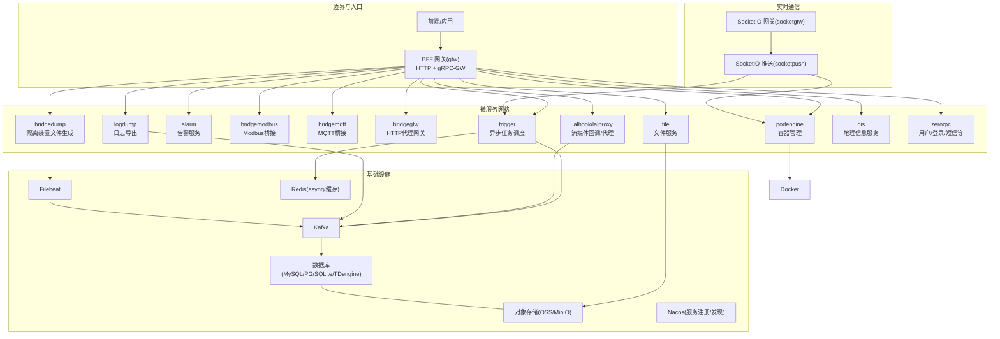
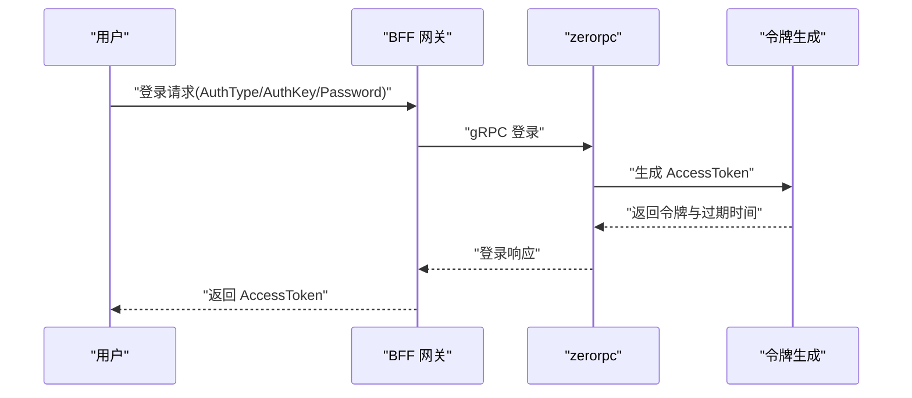
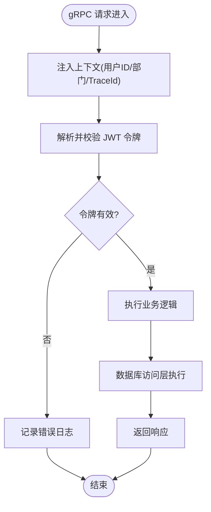
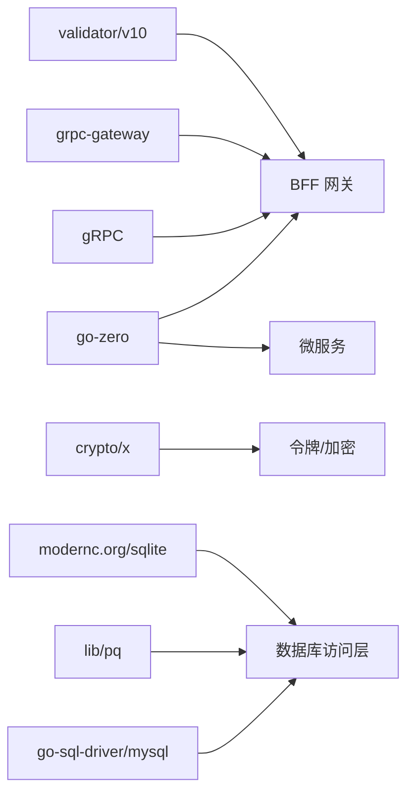

# 安全防护实践

<cite>
**本文引用的文件**
- [go.mod](file://go.mod)
- [README.md](file://README.md)
- [docker-compose.yml](file://deploy/docker-compose.yml)
- [loggerInterceptor.go](file://common/Interceptor/rpcserver/loggerInterceptor.go)
- [metadataInterceptor.go](file://common/Interceptor/rpcclient/metadataInterceptor.go)
- [config.go](file://zerorpc/internal/config/config.go)
- [config.go](file://gtw/internal/config/config.go)
- [loginlogic.go](file://zerorpc/internal/logic/loginlogic.go)
- [generatetokenlogic.go](file://zerorpc/internal/logic/generatetokenlogic.go)
- [getuserinfologic.go](file://zerorpc/internal/logic/getuserinfologic.go)
- [dbx.go](file://common/dbx/dbx.go)
- [tool.go](file://common/tool/tool.go)
</cite>

## 目录
1. [简介](#简介)
2. [项目结构](#项目结构)
3. [核心组件](#核心组件)
4. [架构总览](#架构总览)
5. [详细组件分析](#详细组件分析)
6. [依赖分析](#依赖分析)
7. [性能考虑](#性能考虑)
8. [故障排查指南](#故障排查指南)
9. [结论](#结论)
10. [附录](#附录)

## 简介
本指南围绕 zero-service 的微服务架构，系统梳理安全防护最佳实践，覆盖输入验证与数据清理、身份认证与授权、数据加密与密钥管理、安全审计与日志、网络安全防护、敏感信息保护以及安全测试等内容。文档结合仓库中已实现的组件（如 gRPC 拦截器、JWT 令牌、数据库访问层、工具库等）进行落地说明，并提供可视化图示帮助理解。

## 项目结构
- 采用 go-zero 微服务框架，服务通过 gRPC 与 grpc-gateway 提供 HTTP 访问，统一由 BFF 网关（gtw）聚合。
- 实时通信模块基于 SocketIO，具备 Token 鉴权与会话管理能力。
- 多协议接入（IEC 104、Modbus、MQTT）与任务队列（asynq）、消息队列（Kafka）、对象存储（OSS）等基础设施贯穿全链路。
- 安全相关能力在公共组件与服务逻辑中逐步体现：拦截器传递上下文、JWT 令牌签发与解析、数据库访问抽象、工具库中的通用安全辅助方法等。

图表来源
- [README.md:15-51](file://README.md#L15-L51)
- [docker-compose.yml:1-110](file://deploy/docker-compose.yml#L1-L110)

章节来源
- [README.md:1-350](file://README.md#L1-L350)
- [docker-compose.yml:1-110](file://deploy/docker-compose.yml#L1-L110)

## 核心组件
- gRPC 拦截器：在服务端与客户端侧传递用户标识、授权信息、TraceId 等上下文，便于统一审计与追踪。
- JWT 令牌：zerorpc 服务负责登录与令牌签发，提供 AccessToken 与过期时间。
- 数据库访问层：根据数据源自动识别数据库类型，统一适配 SQL 构造与执行。
- 工具库：提供通用安全辅助方法（如令牌解析、路径生成、时间戳生成等）。

章节来源
- [loggerInterceptor.go:12-44](file://common/Interceptor/rpcserver/loggerInterceptor.go#L12-L44)
- [metadataInterceptor.go:11-32](file://common/Interceptor/rpcclient/metadataInterceptor.go#L11-L32)
- [generatetokenlogic.go:30-52](file://zerorpc/internal/logic/generatetokenlogic.go#L30-L52)
- [dbx.go:46-64](file://common/dbx/dbx.go#L46-L64)
- [tool.go:35-65](file://common/tool/tool.go#L35-L65)

## 架构总览
下图展示安全相关的关键交互：请求经 BFF 网关进入，通过 gRPC 拦截器注入上下文；zerorpc 登录成功后签发 JWT；后续请求携带令牌，服务端解析并校验；数据库访问通过统一适配层执行；日志与审计贯穿全链路。

```mermaid
sequenceDiagram
participant C as "客户端"
participant GW as "BFF 网关(gtw)"
participant Z as "zerorpc(登录/令牌)"
participant S as "业务服务(含拦截器)"
participant DB as "数据库访问层(dbx)"
C->>GW : "HTTP 请求"
GW->>Z : "gRPC 调用(登录/用户信息)"
Z-->>GW : "返回 AccessToken/用户信息"
GW-->>C : "响应(含令牌)"
C->>GW : "携带 Authorization 的后续请求"
GW->>S : "gRPC 调用(带元数据)"
S->>S : "拦截器注入上下文(用户ID/部门/TraceId)"
S->>S : "解析并校验 JWT 令牌"
S->>DB : "执行查询/更新"
DB-->>S : "结果"
S-->>GW : "响应"
GW-->>C : "响应"
```

图表来源
- [loggerInterceptor.go:12-44](file://common/Interceptor/rpcserver/loggerInterceptor.go#L12-L44)
- [metadataInterceptor.go:11-32](file://common/Interceptor/rpcclient/metadataInterceptor.go#L11-L32)
- [generatetokenlogic.go:30-52](file://zerorpc/internal/logic/generatetokenlogic.go#L30-L52)
- [dbx.go:46-64](file://common/dbx/dbx.go#L46-L64)

## 详细组件分析

### 输入验证与数据清理
- 参数验证与清理建议
  - 在 BFF 网关与各服务的 handler/logic 层对入参进行白名单校验与裁剪，避免注入与越界。
  - 使用 go-playground/validator 等库进行结构化校验（参考 go.mod 中依赖）。
  - 对路径参数与文件名进行规范化处理，禁止路径遍历字符序列。
  - 对用户输入进行 HTML 转义或模板渲染时使用安全上下文，防止 XSS。
  - 对数据库查询使用参数化语句或 ORM 查询构造器，避免拼接 SQL。
- 代码层面的支撑
  - 工具库提供时间戳、UUID、Base62 编码等通用方法，可用于生成安全标识与短路径，降低冲突与歧义风险。
  - 数据库访问层根据数据源自动选择方言，统一 SQL 执行入口，减少手工拼接。

章节来源
- [tool.go:142-154](file://common/tool/tool.go#L142-L154)
- [dbx.go:106-138](file://common/dbx/dbx.go#L106-L138)

### 身份认证与授权机制
- JWT 令牌管理
  - 登录流程：zerorpc 登录逻辑根据认证类型（如小程序、手机验证码）完成用户校验后，调用令牌生成逻辑签发 AccessToken。
  - 令牌签发：使用 HS256 签名，包含签发时间、过期时间与用户标识等声明。
  - 令牌解析：工具库提供 ParseToken 方法，支持多种密钥轮换与前缀剥离。
- OAuth2 集成
  - 项目中存在微信小程序登录与会话调用，可作为 OAuth2/OpenID Connect 的参考实现，建议在网关层统一接入第三方授权。
- RBAC 权限控制
  - 建议在拦截器或中间件中引入角色/权限矩阵，结合用户标识与 TraceId 进行细粒度授权判定。
- 会话管理
  - SocketIO 网关具备 Token 鉴权与房间管理能力，可结合 Redis 实现会话持久化与踢人策略。

图表来源
- [loginlogic.go:30-109](file://zerorpc/internal/logic/loginlogic.go#L30-L109)
- [generatetokenlogic.go:30-52](file://zerorpc/internal/logic/generatetokenlogic.go#L30-L52)

章节来源
- [loginlogic.go:30-109](file://zerorpc/internal/logic/loginlogic.go#L30-L109)
- [generatetokenlogic.go:30-52](file://zerorpc/internal/logic/generatetokenlogic.go#L30-L52)
- [tool.go:35-65](file://common/tool/tool.go#L35-L65)

### 数据加密与密钥管理
- 传输加密
  - 建议在生产环境强制启用 TLS/HTTPS，确保 gRPC 与 HTTP 通道加密。
- 存储加密
  - 对敏感字段（如密码、手机号）在入库前进行哈希或加盐处理；避免明文存储。
- 对称加密与非对称加密
  - 可使用 golang.org/x/crypto 提供的现代加密原语；对令牌与密钥采用非对称加密保护，密钥材料使用硬件/云密钥服务（DKMS）管理。
- 密钥轮换
  - 通过工具库 ParseToken 支持多密钥校验，便于平滑轮换。

章节来源
- [go.mod:54-58](file://go.mod#L54-L58)
- [tool.go:35-65](file://common/tool/tool.go#L35-L65)

### 安全审计与日志记录
- 访问日志与操作日志
  - gRPC 服务端拦截器在进入与退出时记录上下文与错误，便于定位问题与审计。
- 异常日志
  - 拦截器在发生错误时输出标准化错误日志，建议统一结构化输出并接入集中式日志系统。
- 合规性审计
  - 结合 TraceId 与用户标识，形成端到端审计轨迹；对敏感操作（如用户信息变更、文件删除）增加专项审计。

图表来源
- [loggerInterceptor.go:12-44](file://common/Interceptor/rpcserver/loggerInterceptor.go#L12-L44)
- [metadataInterceptor.go:11-32](file://common/Interceptor/rpcclient/metadataInterceptor.go#L11-L32)
- [generatetokenlogic.go:30-52](file://zerorpc/internal/logic/generatetokenlogic.go#L30-L52)

章节来源
- [loggerInterceptor.go:12-44](file://common/Interceptor/rpcserver/loggerInterceptor.go#L12-L44)
- [metadataInterceptor.go:11-32](file://common/Interceptor/rpcclient/metadataInterceptor.go#L11-L32)

### 网络安全防护
- 防火墙与网络隔离
  - 生产环境建议使用主机防火墙限制暴露端口；容器编排采用 host 网络模式时应配合网络策略与命名空间隔离。
- DDoS 防护
  - 在网关层前置抗 DDoS 设备或云厂商防护服务，限制请求速率与并发。
- WAF 集成
  - 在 BFF 网关前接入 Web 应用防火墙，阻断常见攻击载荷。
- 网络隔离
  - Kafka、Redis、数据库等敏感组件置于内网子网，仅开放必要端口。

章节来源
- [docker-compose.yml:63-75](file://deploy/docker-compose.yml#L63-L75)

### 敏感信息保护
- 密码哈希与令牌管理
  - 使用强哈希算法（如 bcrypt、scrypt）存储密码；令牌采用短期有效期与刷新策略。
- 日志脱敏
  - 对日志中的敏感字段（如手机号、身份证号）进行脱敏处理；避免在错误日志中打印明文令牌。
- 数据最小化
  - 仅收集与业务必要的数据，遵循最小权限原则与数据保留期限。

章节来源
- [loginlogic.go:84-96](file://zerorpc/internal/logic/loginlogic.go#L84-L96)
- [getuserinfologic.go:27-41](file://zerorpc/internal/logic/getuserinfologic.go#L27-L41)

### 安全漏洞扫描与渗透测试
- 漏洞扫描
  - 使用 trivy、Clair 等工具扫描镜像与依赖漏洞；定期扫描第三方依赖版本。
- 渗透测试
  - 在沙箱环境对 BFF 网关、zerorpc 服务进行黑盒/灰盒测试，重点验证 JWT 令牌绕过、SQL 注入、路径遍历、XSS 等。
- 安全基线
  - 建立容器安全基线（只读根文件系统、Drop Capabilities、非 root 用户运行），并纳入 CI/CD 安全检查。

## 依赖分析
- go-zero 提供微服务基础能力（路由、中间件、配置、日志）。
- gRPC 与 grpc-gateway 实现多协议互通。
- go-playground/validator 用于结构化参数校验。
- golang.org/x/crypto 提供加密原语。
- go-sql-driver/mysql、lib/pq、modernc.org/sqlite 等驱动支持多数据库。
- go-iecp5、grid-x/modbus、paho.mqtt 等工业协议栈。

图表来源
- [go.mod:5-62](file://go.mod#L5-L62)

章节来源
- [go.mod:5-62](file://go.mod#L5-L62)

## 性能考虑
- 令牌解析与数据库访问应尽量复用连接池与缓存，避免频繁握手与查询。
- 日志输出建议异步化，避免阻塞请求处理。
- 对高频接口开启压缩与限流，防止资源耗尽。

## 故障排查指南
- 令牌相关
  - 若出现“无效令牌”错误，检查令牌前缀、签名密钥与过期时间；使用工具库 ParseToken 进行多密钥尝试。
- 数据库访问
  - 若出现方言不匹配或连接异常，确认数据源字符串与 dbx 解析逻辑是否正确。
- 日志与追踪
  - 通过拦截器输出的 TraceId 串联请求链路，定位具体服务与错误点。

章节来源
- [tool.go:35-65](file://common/tool/tool.go#L35-L65)
- [dbx.go:31-44](file://common/dbx/dbx.go#L31-L44)
- [loggerInterceptor.go:40-42](file://common/Interceptor/rpcserver/loggerInterceptor.go#L40-L42)

## 结论
zero-service 在微服务与多协议接入方面具备良好基础，安全防护可通过以下路径持续强化：完善参数校验与输入清理、加强 JWT 令牌与 RBAC 控制、落实传输与存储加密、健全审计与日志体系、加固网络边界与隔离、规范敏感信息处理，并将漏洞扫描与渗透测试纳入常态化流程。上述实践与现有组件（拦截器、令牌、数据库访问层、工具库）相互呼应，可形成闭环的安全保障体系。

## 附录
- 配置要点
  - JWT 密钥与过期时间在 zerorpc 配置中定义，建议在不同环境区分配置。
  - BFF 网关配置包含 JWT 密钥与客户端 RPC 配置，确保与后端服务一致。
- 建议的配置项清单
  - JWT 密钥 AccessSecret、AccessExpire
  - 数据库连接 DataSource
  - 缓存 Cache 配置
  - 文件下载与 OSS 相关路径

章节来源
- [config.go:8-24](file://zerorpc/internal/config/config.go#L8-L24)
- [config.go:8-20](file://gtw/internal/config/config.go#L8-L20)