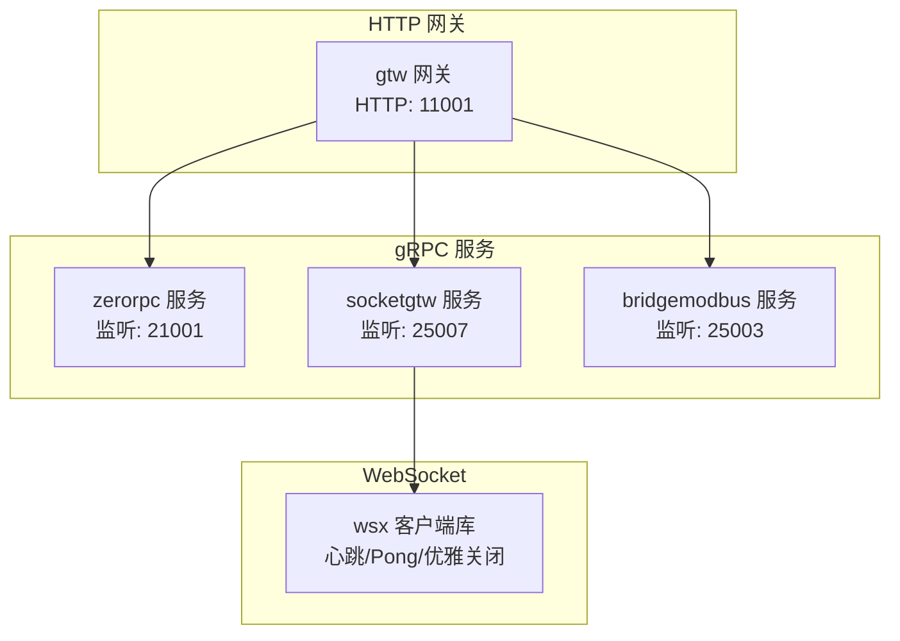
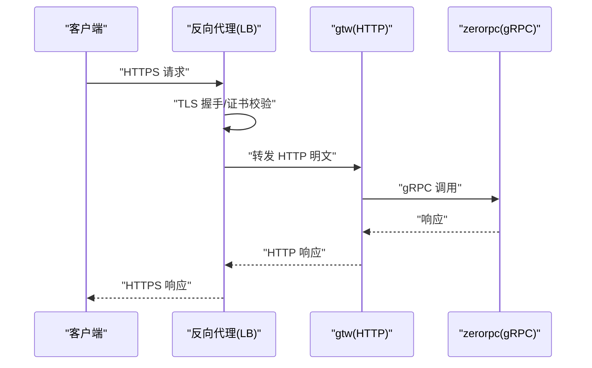
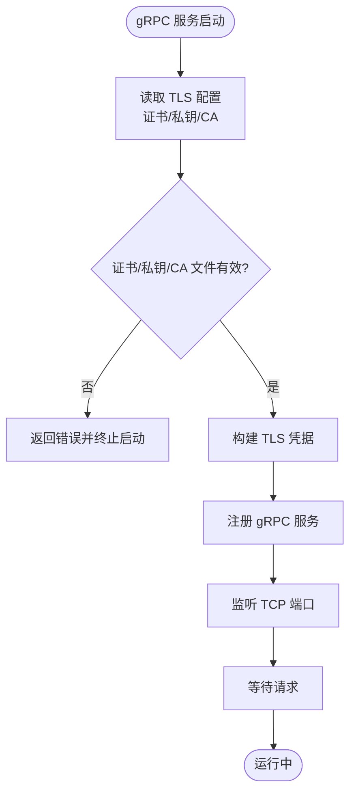
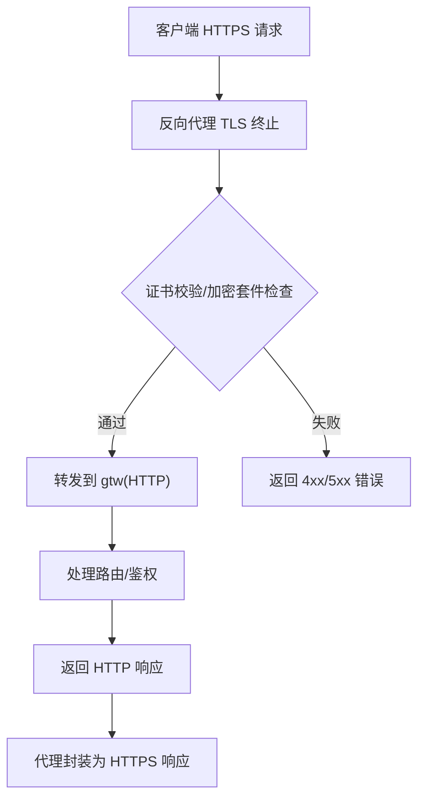
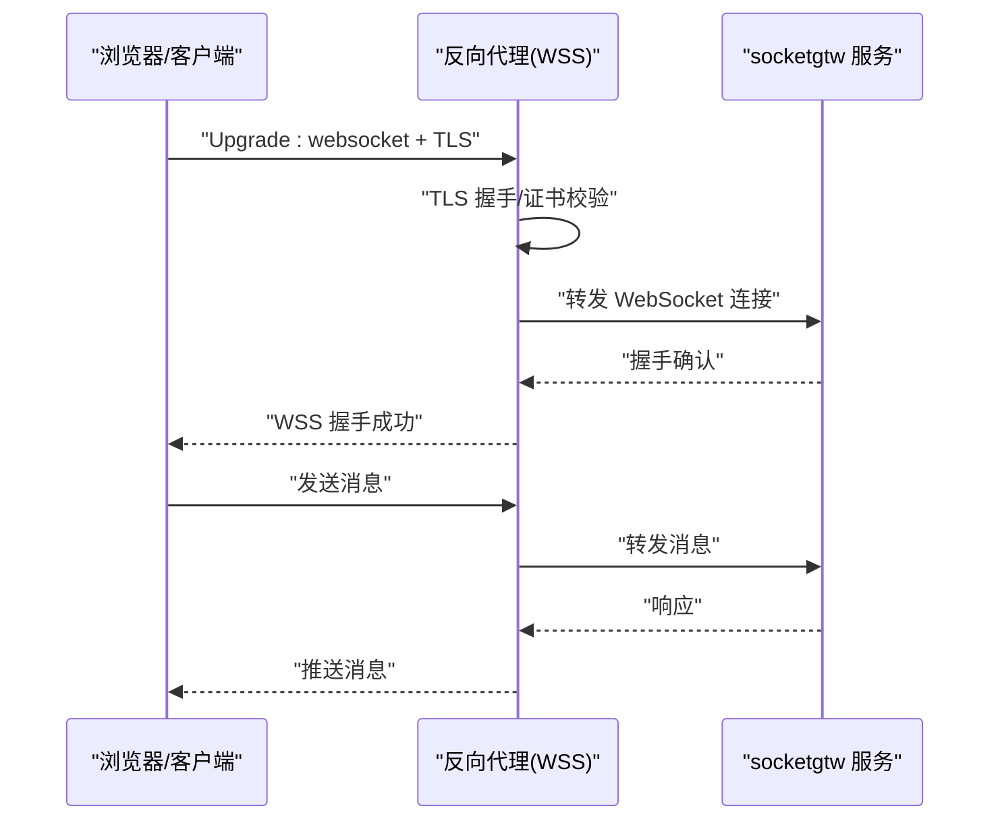
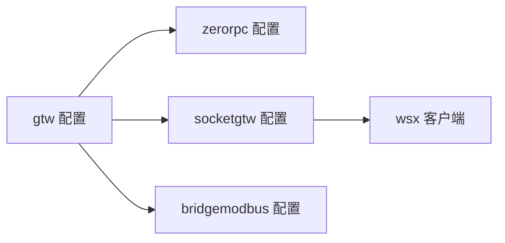

# 传输加密

<cite>
**本文引用的文件**
- [app/bridgemodbus/bridgemodbus/bridgemodbus.pb.go](file://app/bridgemodbus/bridgemodbus/bridgemodbus.pb.go)
- [common/wsx/client.go](file://common/wsx/client.go)
- [socketapp/socketgtw/socketgtw/socketgtw_grpc.pb.go](file://socketapp/socketgtw/socketgtw/socketgtw_grpc.pb.go)
- [socketapp/socketgtw/etc/socketgtw.yaml](file://socketapp/socketgtw/etc/socketgtw.yaml)
- [socketapp/socketgtw/internal/config/config.go](file://socketapp/socketgtw/internal/config/config.go)
- [zerorpc/etc/zerorpc.yaml](file://zerorpc/etc/zerorpc.yaml)
- [zerorpc/internal/config/config.go](file://zerorpc/internal/config/config.go)
- [gtw/etc/gtw.yaml](file://gtw/etc/gtw.yaml)
- [gtw/internal/config/config.go](file://gtw/internal/config/config.go)
- [app/bridgemodbus/etc/bridgemodbus.yaml](file://app/bridgemodbus/etc/bridgemodbus.yaml)
- [app/bridgemodbus/internal/config/config.go](file://app/bridgemodbus/internal/config/config.go)
- [socketapp/socketpush/etc/socketpush.yaml](file://socketapp/socketpush/etc/socketpush.yaml)
- [socketapp/socketpush/internal/config/config.go](file://socketapp/socketpush/internal/config/config.go)
- [facade/streamevent/etc/streamevent.yaml](file://facade/streamevent/etc/streamevent.yaml)
- [facade/streamevent/internal/config/config.go](file://facade/streamevent/internal/config/config.go)
</cite>

## 目录
1. [简介](#简介)
2. [项目结构](#项目结构)
3. [核心组件](#核心组件)
4. [架构总览](#架构总览)
5. [详细组件分析](#详细组件分析)
6. [依赖关系分析](#依赖关系分析)
7. [性能考虑](#性能考虑)
8. [故障排查指南](#故障排查指南)
9. [结论](#结论)
10. [附录](#附录)

## 简介
本文件面向 zero-service 的传输加密实现，系统性说明 TLS/SSL 配置方案、gRPC 双向 TLS、HTTP API 的 HTTPS 支持、WebSocket 的 WSS 加密，以及性能优化与常见问题排查。文档以仓库现有实现为依据，结合配置文件与代码结构，给出可操作的实施建议与最佳实践。

## 项目结构
- gRPC 服务与配置
  - gRPC 服务端：zerorpc、socketgtw、bridgemodbus 等模块均基于 go-zero 的 zrpc 构建，具备统一的配置入口与启动流程。
  - 配置文件：各模块在 etc/ 目录下提供 YAML 配置，包含监听地址、日志、鉴权等参数。
- HTTP 网关与 API
  - gtw 提供 REST 网关能力，通过 rest.RestConf 配置 HTTP 服务；部分模块同时暴露 gRPC 与 HTTP。
- WebSocket
  - common/wsx 提供 WebSocket 客户端实现，支持心跳、Pong 处理与优雅关闭；WSS 由上游代理或网关负责终止。

图表来源
- [zerorpc/etc/zerorpc.yaml:1-39](file://zerorpc/etc/zerorpc.yaml#L1-L39)
- [socketapp/socketgtw/etc/socketgtw.yaml:1-37](file://socketapp/socketgtw/etc/socketgtw.yaml#L1-L37)
- [app/bridgemodbus/etc/bridgemodbus.yaml:1-26](file://app/bridgemodbus/etc/bridgemodbus.yaml#L1-L26)
- [gtw/etc/gtw.yaml:1-61](file://gtw/etc/gtw.yaml#L1-L61)
- [common/wsx/client.go:489-894](file://common/wsx/client.go#L489-L894)

章节来源
- [zerorpc/etc/zerorpc.yaml:1-39](file://zerorpc/etc/zerorpc.yaml#L1-L39)
- [socketapp/socketgtw/etc/socketgtw.yaml:1-37](file://socketapp/socketgtw/etc/socketgtw.yaml#L1-L37)
- [app/bridgemodbus/etc/bridgemodbus.yaml:1-26](file://app/bridgemodbus/etc/bridgemodbus.yaml#L1-L26)
- [gtw/etc/gtw.yaml:1-61](file://gtw/etc/gtw.yaml#L1-L61)
- [common/wsx/client.go:489-894](file://common/wsx/client.go#L489-L894)

## 核心组件
- gRPC 服务端配置
  - zerorpc、socketgtw、bridgemodbus 等模块使用 zrpc.RpcServerConf，支持监听地址、超时、日志等通用配置。
- HTTP 网关配置
  - gtw 使用 rest.RestConf，提供 HTTP 服务监听、超时、日志等参数。
- WebSocket 客户端
  - wsx 提供连接建立、心跳、Pong 处理与优雅关闭流程，便于在 gRPC/HTTP 层之上构建安全的实时通道。

章节来源
- [zerorpc/internal/config/config.go:1-25](file://zerorpc/internal/config/config.go#L1-L25)
- [socketapp/socketgtw/internal/config/config.go:1-28](file://socketapp/socketgtw/internal/config/config.go#L1-L28)
- [app/bridgemodbus/internal/config/config.go:1-26](file://app/bridgemodbus/internal/config/config.go#L1-L26)
- [gtw/internal/config/config.go:1-21](file://gtw/internal/config/config.go#L1-L21)
- [common/wsx/client.go:489-894](file://common/wsx/client.go#L489-L894)

## 架构总览
- 传输加密现状
  - gRPC 服务端未直接在配置中启用 TLS；可通过外部负载均衡器或反向代理终止 TLS 并转发至 gRPC。
  - HTTP 网关未显式启用 HTTPS；建议在反向代理层开启 TLS。
  - WebSocket 客户端支持 WSS，握手与会话保护由上游代理完成。
- 推荐的加密边界
  - 入口层（反向代理/Nginx/TLS 终止）：统一管理证书、加密套件与安全头。
  - 内部服务间：可选 mTLS 或明文（内网），视合规要求而定。
  - 客户端到入口：TLS 1.2+/1.3，禁用弱套件，启用 OCSP Stapling 与 HSTS。

图表来源
- [gtw/etc/gtw.yaml:1-61](file://gtw/etc/gtw.yaml#L1-L61)
- [zerorpc/etc/zerorpc.yaml:1-39](file://zerorpc/etc/zerorpc.yaml#L1-L39)

## 详细组件分析

### gRPC 传输加密（服务端证书、客户端认证、双向 TLS）
- 现状与限制
  - 代码中存在 EnableTls、TlsCertFile、TlsKeyFile、TlsCaFile 字段，表明协议定义支持 TLS 参数，但当前配置文件未启用。
- 实施建议
  - 服务端证书配置
    - 在各模块的 etc/*.yaml 中新增 TLS 字段，指向证书与私钥文件路径。
    - 服务端启动时加载证书与私钥，创建 TLS 凭据并注册到 gRPC 服务器。
  - 客户端认证与双向 TLS
    - 客户端需配置 CA 证书以验证服务端身份。
    - 如启用 mTLS，服务端需配置客户端证书校验策略，客户端提供客户端证书与私钥。
  - 证书轮换与热更新
    - 通过定期重新加载证书文件或使用外部证书管理服务，实现平滑轮换。
- 关键流程图（服务端 TLS 初始化）

图表来源
- [app/bridgemodbus/bridgemodbus/bridgemodbus.pb.go:36-40](file://app/bridgemodbus/bridgemodbus/bridgemodbus.pb.go#L36-L40)
- [app/bridgemodbus/etc/bridgemodbus.yaml:1-26](file://app/bridgemodbus/etc/bridgemodbus.yaml#L1-L26)

章节来源
- [app/bridgemodbus/bridgemodbus/bridgemodbus.pb.go:36-40](file://app/bridgemodbus/bridgemodbus/bridgemodbus.pb.go#L36-L40)
- [app/bridgemodbus/etc/bridgemodbus.yaml:1-26](file://app/bridgemodbus/etc/bridgemodbus.yaml#L1-L26)

### HTTP API 的 HTTPS 支持（证书绑定、加密套件、安全头）
- 现状
  - gtw 使用 rest.RestConf 配置 HTTP 服务，当前未见显式的 HTTPS 开关与证书配置。
- 实施建议
  - 反向代理终止 TLS
    - 在 Nginx/Traefik/Caddy 等代理上配置证书绑定、加密套件与安全头（如 HSTS、HPKP、X-Frame-Options 等）。
    - gtw 监听本地明文 HTTP，代理负责外网 HTTPS。
  - 证书与套件
    - 使用现代加密套件（TLS 1.2+/1.3），禁用 RC4、3DES、AES-CBC 等弱算法。
    - 启用 OCSP Stapling，缩短证书验证链路。
  - 安全头
    - HSTS、X-Content-Type-Options、X-Frame-Options、Referrer-Policy 等。
- 流程图（HTTP 到 HTTPS 的代理转发）

图表来源
- [gtw/etc/gtw.yaml:1-61](file://gtw/etc/gtw.yaml#L1-L61)

章节来源
- [gtw/etc/gtw.yaml:1-61](file://gtw/etc/gtw.yaml#L1-L61)
- [gtw/internal/config/config.go:1-21](file://gtw/internal/config/config.go#L1-L21)

### WebSocket 连接的 WSS 加密（握手、会话保护）
- 现状
  - wsx 客户端实现包含心跳与 Pong 处理，支持优雅关闭；未见显式的 TLS/WSS 参数配置。
- 实施建议
  - WSS 终止位置
    - 建议在反向代理层终止 WSS，代理负责证书与握手，后端维持明文连接。
  - 握手与会话保护
    - 代理侧完成 TLS 握手与证书校验；客户端与代理之间采用 WSS。
    - 代理将升级后的 WebSocket 连接转发给后端服务，保持会话完整性。
- 序列图（WSS 握手与会话）

图表来源
- [common/wsx/client.go:489-894](file://common/wsx/client.go#L489-L894)
- [socketapp/socketgtw/etc/socketgtw.yaml:13-17](file://socketapp/socketgtw/etc/socketgtw.yaml#L13-L17)

章节来源
- [common/wsx/client.go:489-894](file://common/wsx/client.go#L489-L894)
- [socketapp/socketgtw/etc/socketgtw.yaml:13-17](file://socketapp/socketgtw/etc/socketgtw.yaml#L13-L17)

### 证书生成、配置与验证流程
- 证书生成
  - 使用自签名或受信 CA 生成服务端证书与私钥；如启用 mTLS，准备客户端证书与 CA。
- 配置与部署
  - 将证书与私钥放置于受控目录，确保仅授予进程读权限。
  - 在各模块配置文件中添加 TLS 字段，指向证书/私钥/CA 路径。
- 验证流程
  - 启动前进行文件存在性与格式校验。
  - 通过健康检查与日志确认 TLS 成功加载与握手通过。
  - 定期检查证书有效期与吊销状态。

章节来源
- [app/bridgemodbus/bridgemodbus/bridgemodbus.pb.go:36-40](file://app/bridgemodbus/bridgemodbus/bridgemodbus.pb.go#L36-L40)
- [app/bridgemodbus/etc/bridgemodbus.yaml:1-26](file://app/bridgemodbus/etc/bridgemodbus.yaml#L1-L26)

## 依赖关系分析
- 模块间依赖
  - gtw 作为网关，调用 zerorpc、socketgtw、bridgemodbus 等服务。
  - socketgtw 与 WebSocket 客户端协作，承载实时消息。
- 配置耦合点
  - 各模块的 etc/*.yaml 与 internal/config/config.go 形成配置契约，变更需同步。

图表来源
- [gtw/etc/gtw.yaml:1-61](file://gtw/etc/gtw.yaml#L1-L61)
- [zerorpc/etc/zerorpc.yaml:1-39](file://zerorpc/etc/zerorpc.yaml#L1-L39)
- [socketapp/socketgtw/etc/socketgtw.yaml:1-37](file://socketapp/socketgtw/etc/socketgtw.yaml#L1-L37)
- [app/bridgemodbus/etc/bridgemodbus.yaml:1-26](file://app/bridgemodbus/etc/bridgemodbus.yaml#L1-L26)
- [common/wsx/client.go:489-894](file://common/wsx/client.go#L489-L894)

章节来源
- [gtw/etc/gtw.yaml:1-61](file://gtw/etc/gtw.yaml#L1-L61)
- [zerorpc/etc/zerorpc.yaml:1-39](file://zerorpc/etc/zerorpc.yaml#L1-L39)
- [socketapp/socketgtw/etc/socketgtw.yaml:1-37](file://socketapp/socketgtw/etc/socketgtw.yaml#L1-L37)
- [app/bridgemodbus/etc/bridgemodbus.yaml:1-26](file://app/bridgemodbus/etc/bridgemodbus.yaml#L1-L26)
- [common/wsx/client.go:489-894](file://common/wsx/client.go#L489-L894)

## 性能考虑
- 会话复用
  - 启用 TLS 会话复用与 ALPN，减少握手开销。
- 证书缓存与预热
  - 在启动阶段加载并缓存证书，避免运行时 IO。
- 连接池与并发
  - 合理设置 gRPC/HTTP 连接池大小与超时，避免拥塞。
- 代理层优化
  - 在反向代理层启用 HTTP/2、压缩与连接复用，提升整体吞吐。

## 故障排查指南
- gRPC TLS 启动失败
  - 检查证书/私钥路径与权限；确认证书链完整且未过期。
  - 查看启动日志中的 TLS 初始化错误信息。
- HTTP 网关访问异常
  - 确认反向代理已正确配置证书与加密套件；检查代理到后端的明文转发。
- WebSocket WSS 握手失败
  - 核对代理的 WSS 终止配置与证书；确认客户端使用正确的 WSS 地址。
- 证书轮换问题
  - 确保新旧证书过渡期间无中断；验证 OCSP Stapling 配置。

章节来源
- [zerorpc/etc/zerorpc.yaml:1-39](file://zerorpc/etc/zerorpc.yaml#L1-L39)
- [gtw/etc/gtw.yaml:1-61](file://gtw/etc/gtw.yaml#L1-L61)
- [socketapp/socketgtw/etc/socketgtw.yaml:1-37](file://socketapp/socketgtw/etc/socketgtw.yaml#L1-L37)
- [common/wsx/client.go:489-894](file://common/wsx/client.go#L489-L894)

## 结论
- 当前项目在传输加密方面主要依赖入口层反向代理完成 TLS 终止，内部服务间通信多为明文或由代理统一加密。
- 建议在入口层完善证书管理、加密套件与安全头配置，并在需要的模块中启用 gRPC TLS 与双向认证。
- WebSocket 通过 WSS 与代理协作实现端到端加密，配合心跳与优雅关闭机制保障会话稳定。

## 附录
- 配置参考
  - zerorpc：监听端口、JWT 密钥、数据库与缓存等。
  - socketgtw：gRPC 监听、HTTP 监听、Nacos 注册、Socket 元数据与事件流配置。
  - bridgemodbus：gRPC 监听、Modbus 客户端配置与 TLS 参数预留。
  - gtw：REST 监听、JWT 密钥、RPC 上游与下载地址等。

章节来源
- [zerorpc/etc/zerorpc.yaml:1-39](file://zerorpc/etc/zerorpc.yaml#L1-L39)
- [socketapp/socketgtw/etc/socketgtw.yaml:1-37](file://socketapp/socketgtw/etc/socketgtw.yaml#L1-L37)
- [app/bridgemodbus/etc/bridgemodbus.yaml:1-26](file://app/bridgemodbus/etc/bridgemodbus.yaml#L1-L26)
- [gtw/etc/gtw.yaml:1-61](file://gtw/etc/gtw.yaml#L1-L61)
- [socketapp/socketpush/etc/socketpush.yaml](file://socketapp/socketpush/etc/socketpush.yaml)
- [facade/streamevent/etc/streamevent.yaml](file://facade/streamevent/etc/streamevent.yaml)