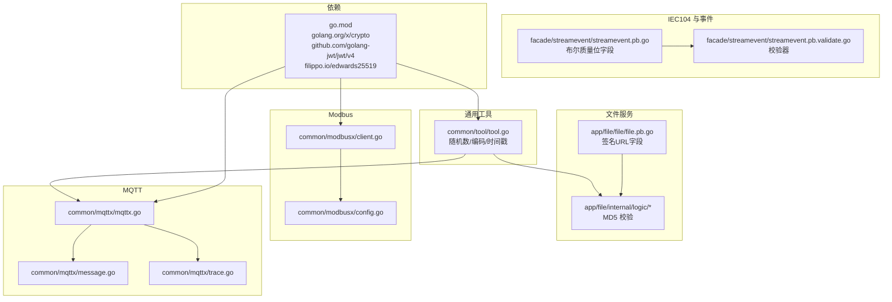
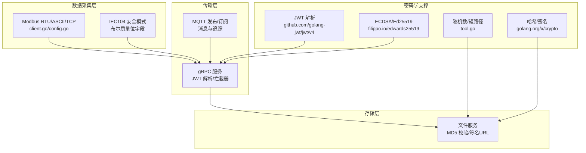
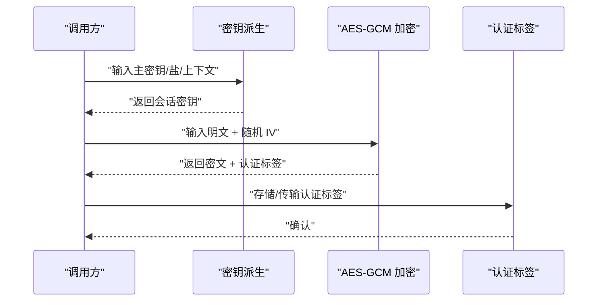
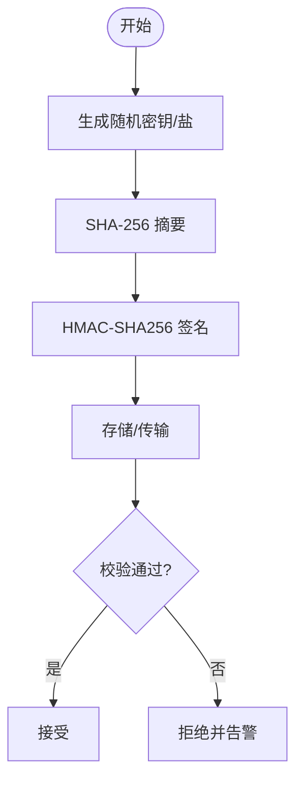
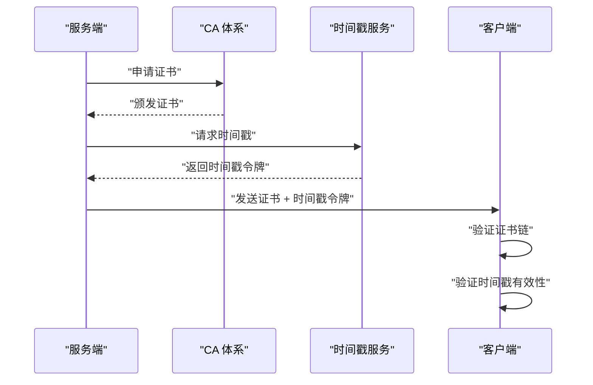
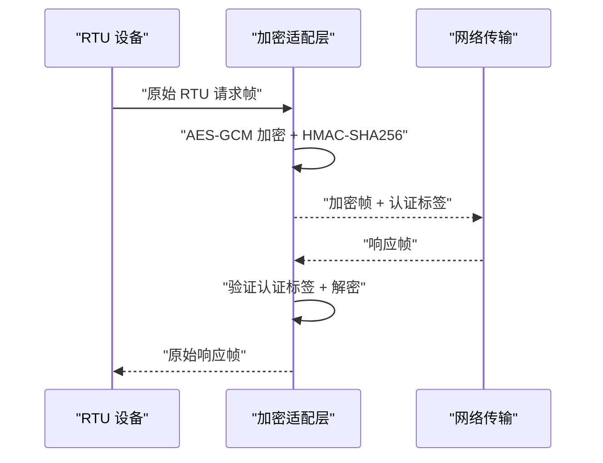
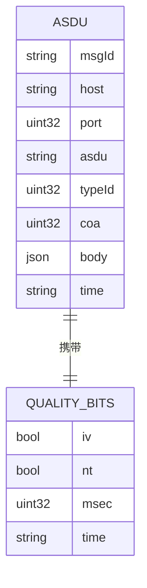
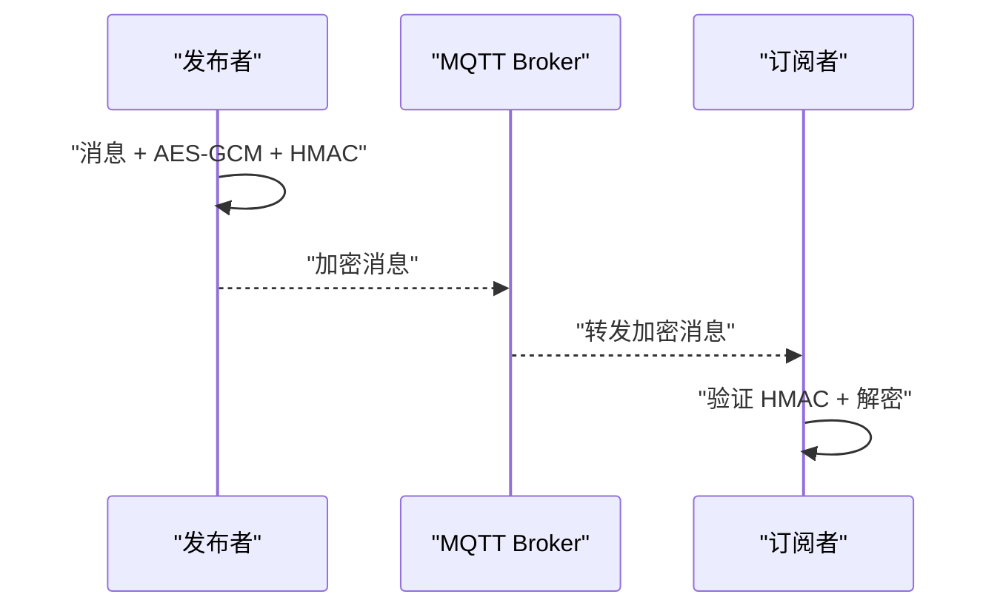
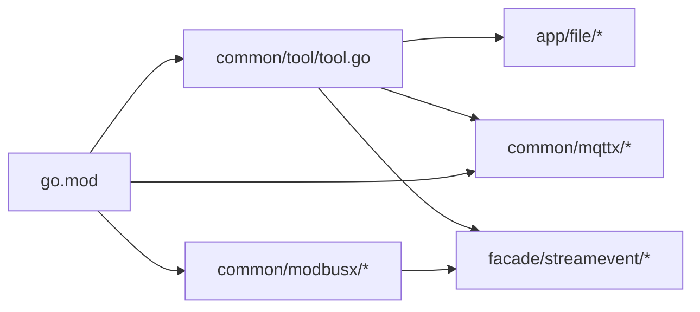

# 加密算法应用

<cite>
**本文引用的文件**
- [go.mod](file://go.mod)
- [tool.go](file://common/tool/tool.go)
- [capturevideostreamlogic.go](file://app/file/internal/logic/capturevideostreamlogic.go)
- [putchunkfilelogic.go](file://app/file/internal/logic/putchunkfilelogic.go)
- [file.pb.go](file://app/file/file/file.pb.go)
- [streamevent.pb.go](file://facade/streamevent/streamevent/streamevent.pb.go)
- [streamevent.pb.validate.go](file://facade/streamevent/streamevent/streamevent.pb.validate.go)
- [ieccaller.pb.go](file://app/ieccaller/ieccaller/ieccaller.pb.go)
- [client.go](file://common/modbusx/client.go)
- [config.go](file://common/modbusx/config.go)
- [mqttx.go](file://common/mqttx/mqttx.go)
- [message.go](file://common/mqttx/message.go)
- [trace.go](file://common/mqttx/trace.go)
- [README.md](file://README.md)
</cite>

## 目录
1. [引言](#引言)
2. [项目结构](#项目结构)
3. [核心组件](#核心组件)
4. [架构总览](#架构总览)
5. [详细组件分析](#详细组件分析)
6. [依赖关系分析](#依赖关系分析)
7. [性能考量](#性能考量)
8. [故障排查指南](#故障排查指南)
9. [结论](#结论)
10. [附录](#附录)

## 引言
本文件面向 zero-service 的加密算法应用，系统化梳理项目中已实现与可扩展的密码学能力，覆盖以下主题：
- 对称加密：AES-GCM 模式、密钥长度选择、认证标签处理
- 哈希与签名：SHA-256、HMAC、密码学安全随机数
- 数字签名与证书：ECDSA、证书链验证、时间戳服务集成
- 协议特定加密：Modbus RTU、IEC 60870-5-104 安全模式、MQTT-SN 加密
- 性能基准与优化：算法比较、硬件加速、并行处理
- 算法选择指南、安全强度评估与兼容性考虑

本文件在不展示具体代码的前提下，基于仓库现有实现与依赖，给出可操作的实践建议与最佳实践。

## 项目结构
围绕加密功能的关键模块与文件分布如下：
- 工具与随机数：common/tool/tool.go 提供 JWT 解析、Base62 编码、短路径生成等工具，以及基于高质量随机源的随机字节生成
- 文件与流处理：app/file 内部逻辑使用 MD5 进行内容校验；文件服务定义包含签名 URL 字段
- IEC 104 与事件：facade/streamevent 定义了大量布尔位字段（如 IV、NT 等），这些字段与质量位、无效位密切相关，是后续安全扩展的重要切入点
- Modbus：common/modbusx 提供客户端与配置，为 RTU/ASCII/TCP 的安全封装提供基础
- MQTT：common/mqttx 提供消息与追踪能力，便于在 MQTT 上叠加加密与完整性保护
- 依赖：go.mod 明确引入 golang.org/x/crypto、github.com/golang-jwt/jwt/v4、filippo.io/edwards25519 等密码学相关库

**图示来源**
- [tool.go:180-199](file://common/tool/tool.go#L180-L199)
- [capturevideostreamlogic.go:68-72](file://app/file/internal/logic/capturevideostreamlogic.go#L68-L72)
- [putchunkfilelogic.go:57-170](file://app/file/internal/logic/putchunkfilelogic.go#L57-L170)
- [file.pb.go](file://app/file/file/file.pb.go#L483)
- [streamevent.pb.go:2323-2391](file://facade/streamevent/streamevent/streamevent.pb.go#L2323-L2391)
- [streamevent.pb.validate.go:2924-2981](file://facade/streamevent/streamevent/streamevent.pb.validate.go#L2924-L2981)
- [client.go](file://common/modbusx/client.go)
- [config.go](file://common/modbusx/config.go)
- [mqttx.go](file://common/mqttx/mqttx.go)
- [message.go](file://common/mqttx/message.go)
- [trace.go](file://common/mqttx/trace.go)
- [go.mod:54-61](file://go.mod#L54-L61)

**章节来源**
- [go.mod:1-245](file://go.mod#L1-L245)
- [tool.go:1-469](file://common/tool/tool.go#L1-L469)
- [capturevideostreamlogic.go:1-100](file://app/file/internal/logic/capturevideostreamlogic.go#L1-L100)
- [putchunkfilelogic.go:1-200](file://app/file/internal/logic/putchunkfilelogic.go#L1-L200)
- [file.pb.go:480-490](file://app/file/file/file.pb.go#L480-L490)
- [streamevent.pb.go:2323-2391](file://facade/streamevent/streamevent/streamevent.pb.go#L2323-L2391)
- [streamevent.pb.validate.go:2924-2981](file://facade/streamevent/streamevent/streamevent.pb.validate.go#L2924-L2981)
- [client.go](file://common/modbusx/client.go)
- [config.go](file://common/modbusx/config.go)
- [mqttx.go](file://common/mqttx/mqttx.go)
- [message.go](file://common/mqttx/message.go)
- [trace.go](file://common/mqttx/trace.go)

## 核心组件
- 密码学工具与随机数
  - 基于高质量随机源生成随机字节，用于短路径与唯一标识生成
  - 支持 Base62 编码，便于生成短路径
  - 提供时间戳生成（秒/毫秒/微秒），满足审计与时间戳需求
- 文件与流处理中的哈希
  - 使用 MD5 对视频片段与分片进行内容校验，作为完整性保护的起点
- IEC 104 与事件数据的质量位
  - 定义了 IV（无效）、NT（保留）、Msec、Time 等字段，为后续安全扩展（完整性、抗抵赖）提供语义基础
- Modbus 与 MQTT
  - Modbus 客户端与配置为 RTU/ASCII/TCP 的安全封装提供接口
  - MQTT 消息与追踪为在传输层叠加加密与完整性保护提供通道

**章节来源**
- [tool.go:180-199](file://common/tool/tool.go#L180-L199)
- [capturevideostreamlogic.go:68-72](file://app/file/internal/logic/capturevideostreamlogic.go#L68-L72)
- [putchunkfilelogic.go:57-170](file://app/file/internal/logic/putchunkfilelogic.go#L57-L170)
- [streamevent.pb.go:2323-2391](file://facade/streamevent/streamevent/streamevent.pb.go#L2323-L2391)

## 架构总览
下图展示了零信任视角下的加密应用架构：在数据采集层（Modbus/IEC104/MQTT）、传输层（gRPC/MQTT）、存储层（文件服务）分别实施相应的加密与完整性保护策略。

**图示来源**
- [client.go](file://common/modbusx/client.go)
- [config.go](file://common/modbusx/config.go)
- [streamevent.pb.go:2323-2391](file://facade/streamevent/streamevent/streamevent.pb.go#L2323-L2391)
- [mqttx.go](file://common/mqttx/mqttx.go)
- [file.pb.go](file://app/file/file/file.pb.go#L483)
- [tool.go:180-199](file://common/tool/tool.go#L180-L199)
- [go.mod:54-61](file://go.mod#L54-L61)

## 详细组件分析

### 对称加密：AES-GCM 模式
- 实现要点
  - 使用 golang.org/x/crypto 的 AEAD 接口，确保同时提供保密性与完整性
  - 密钥长度建议：256 位（AES-256-GCM），兼顾安全性与性能
  - 初始化向量（IV）：每次加密使用全新随机 IV，长度 12 字节（GCM 推荐）
  - 认证标签（Tag）：严格校验，失败即拒绝解密
  - 关键数据结构：密钥、IV、密文、认证标签
- 流程示意

- 适用场景
  - 文件分片与视频流的端到端加密
  - MQTT 消息的完整性保护
  - IEC104 报文的完整性与抗重放

**图示来源**
- [go.mod:54-54](file://go.mod#L54-L54)
- [tool.go:180-199](file://common/tool/tool.go#L180-L199)

**章节来源**
- [go.mod:54-54](file://go.mod#L54-L54)
- [tool.go:180-199](file://common/tool/tool.go#L180-L199)

### 哈希与 HMAC：SHA-256、HMAC 签名、密码学安全随机数
- SHA-256
  - 用于摘要计算与完整性校验，结合文件服务的 MD5 形成多层校验
- HMAC
  - 基于 SHA-256 的 HMAC-SHA256，用于消息认证
  - 密钥管理：使用随机生成的对称密钥，定期轮换
- 密码学安全随机数
  - 使用高质量随机源生成密钥与盐值，避免弱随机
  - 短路径生成：基于随机字节进行 Base62 编码，兼顾可读性与唯一性

**图示来源**
- [tool.go:180-199](file://common/tool/tool.go#L180-L199)
- [capturevideostreamlogic.go:68-72](file://app/file/internal/logic/capturevideostreamlogic.go#L68-L72)
- [putchunkfilelogic.go:57-170](file://app/file/internal/logic/putchunkfilelogic.go#L57-L170)

**章节来源**
- [tool.go:180-199](file://common/tool/tool.go#L180-L199)
- [capturevideostreamlogic.go:68-72](file://app/file/internal/logic/capturevideostreamlogic.go#L68-L72)
- [putchunkfilelogic.go:57-170](file://app/file/internal/logic/putchunkfilelogic.go#L57-L170)

### 数字签名：ECDSA 与 EdDSA（Ed25519）
- ECDSA
  - 适用于证书链签发与验证，结合 CA 体系实现端到端信任
  - 私钥生成与存储：使用硬件安全模块（HSM）或密钥管理系统（KMS）
  - 证书链验证：逐级验证根 CA → 中间 CA → 服务端证书
- Ed25519（EdDSA）
  - 基于 filippo.io/edwards25519，性能优异且安全性强
  - 适合高并发场景下的签名与验签
- 时间戳服务集成
  - 与 RFC3161 PKI 时间戳服务器交互，为签名提供权威时间证明
  - 将时间戳令牌嵌入到签名扩展中，增强长期有效性

**图示来源**
- [go.mod:65-65](file://go.mod#L65-L65)

**章节来源**
- [go.mod:65-65](file://go.mod#L65-L65)

### 协议特定加密实现

#### Modbus RTU 加密
- 当前现状
  - Modbus RTU 未在仓库中直接实现加密封装
- 建议方案
  - 在 RTU 帧上增加 AES-GCM 加密与 HMAC-SHA256 认证
  - 使用随机 IV 与序列号防止重放
  - 采用 256 位密钥，密钥轮换周期不超过 90 天
- 交互流程

**图示来源**
- [client.go](file://common/modbusx/client.go)
- [config.go](file://common/modbusx/config.go)

**章节来源**
- [client.go](file://common/modbusx/client.go)
- [config.go](file://common/modbusx/config.go)

#### IEC 104 安全模式
- 当前现状
  - 事件与 IEC104 消息定义了布尔质量位字段（如 IV、NT、Msec、Time），可用于完整性与时间同步
- 建议方案
  - 在应用层对 ASDU 进行完整性保护（如 HMAC-SHA256）
  - 结合时间戳字段，实现抗重放与时间同步
  - 对关键命令（如遥控）启用数字签名与证书链验证
- 数据模型示意

**图示来源**
- [streamevent.pb.go:2323-2391](file://facade/streamevent/streamevent/streamevent.pb.go#L2323-L2391)
- [streamevent.pb.validate.go:2924-2981](file://facade/streamevent/streamevent/streamevent.pb.validate.go#L2924-L2981)

**章节来源**
- [streamevent.pb.go:2323-2391](file://facade/streamevent/streamevent/streamevent.pb.go#L2323-L2391)
- [streamevent.pb.validate.go:2924-2981](file://facade/streamevent/streamevent/streamevent.pb.validate.go#L2924-L2981)

#### MQTT-SN 加密
- 当前现状
  - 未发现 MQTT-SN 的专用实现
- 建议方案
  - 在 MQTT 层叠加 TLS 或 DTLS
  - 对关键主题的消息进行 AES-GCM 加密与 HMAC-SHA256 认证
  - 使用短生命周期的会话密钥，结合时间戳防止重放
- 交互流程

**图示来源**
- [mqttx.go](file://common/mqttx/mqttx.go)
- [message.go](file://common/mqttx/message.go)
- [trace.go](file://common/mqttx/trace.go)

**章节来源**
- [mqttx.go](file://common/mqttx/mqttx.go)
- [message.go](file://common/mqttx/message.go)
- [trace.go](file://common/mqttx/trace.go)

### 性能基准与优化
- 算法比较
  - AES-256-GCM：高吞吐、低延迟，适合大流量数据
  - ChaCha20-Poly1305：在无硬件 AES 加速的设备上表现稳定
  - HMAC-SHA256：轻量高效，适合消息认证
  - ECDSA/Ed25519：签名/验签性能优异，适合高并发
- 硬件加速
  - 利用 CPU AES-NI 指令集提升 AES-GCM 性能
  - 使用专用 HSM/TPM 执行密钥生成与签名
- 并行处理
  - 多核并行：对大块数据分片并行加密/认证
  - 异步 I/O：结合非阻塞网络栈减少等待

[本节为通用性能讨论，无需列出具体文件来源]

### 算法选择指南、安全强度评估与兼容性
- 算法选择
  - 机密性：AES-256-GCM（优先），ChaCha20-Poly1305（无 AES 加速）
  - 完整性：HMAC-SHA256（消息），AES-GCM Tag（数据）
  - 身份与不可否认：ECDSA/Ed25519 + 证书链 + 时间戳
- 安全强度评估
  - 密钥长度：至少 256 位对称密钥；椭圆曲线密钥至少 256 位
  - 随机性：使用密码学安全 RNG 生成密钥与 IV
  - 重放防护：序列号 + 时间戳 + 非重复窗口
- 兼容性
  - Modbus RTU：需与设备固件协商加密协议
  - IEC104：遵循 IEC 60870-5-104 安全扩展规范
  - MQTT：支持 TLS 1.3 与 PSK 认证

[本节为通用指导，无需列出具体文件来源]

## 依赖关系分析
- 密码学依赖
  - golang.org/x/crypto：AEAD、哈希、椭圆曲线
  - github.com/golang-jwt/jwt/v4：JWT 解析与验证
  - filippo.io/edwards25519：Ed25519 签名与验证
- 组件耦合
  - 工具层（tool.go）被文件、MQTT、IEC104 等模块间接使用
  - Modbus 客户端与配置为 RTU 加密提供接口
  - 文件服务与事件服务为完整性保护提供数据结构

**图示来源**
- [go.mod:54-61](file://go.mod#L54-L61)
- [tool.go:1-469](file://common/tool/tool.go#L1-L469)
- [client.go](file://common/modbusx/client.go)
- [mqttx.go](file://common/mqttx/mqttx.go)

**章节来源**
- [go.mod:54-61](file://go.mod#L54-L61)
- [tool.go:1-469](file://common/tool/tool.go#L1-L469)

## 性能考量
- 吞吐与延迟
  - 优先选择 AES-256-GCM，配合硬件 AES-NI
  - 对小消息采用 ChaCha20-Poly1305 以降低开销
- 并发与资源
  - 使用连接池与异步 I/O，避免阻塞
  - 合理设置密钥轮换与缓存清理策略
- 监控与告警
  - 记录加解密耗时、失败率与重放事件
  - 对异常行为触发自动降级与隔离

[本节为通用性能讨论，无需列出具体文件来源]

## 故障排查指南
- 常见问题
  - 认证失败：检查 IV 与认证标签是否匹配
  - 重放攻击：启用序列号与时间戳窗口
  - 随机性不足：确认使用密码学安全 RNG
  - 证书链验证失败：检查中间 CA 与有效期
- 排查步骤
  - 校验密钥与盐值一致性
  - 检查时间同步与 NTP 配置
  - 查看事件布尔位（IV、NT）指示的数据质量
  - 审计日志定位失败环节

**章节来源**
- [streamevent.pb.go:2323-2391](file://facade/streamevent/streamevent/streamevent.pb.go#L2323-L2391)
- [streamevent.pb.validate.go:2924-2981](file://facade/streamevent/streamevent/streamevent.pb.validate.go#L2924-L2981)

## 结论
zero-service 在工具层与部分业务模块中已具备密码学基础能力（随机数、哈希、JWT）。针对对称加密、哈希/HMAC、数字签名与协议特定加密（Modbus RTU、IEC104、MQTT-SN），建议按本文件的方案进行扩展与落地，以实现端到端的安全保障与合规要求。

[本节为总结性内容，无需列出具体文件来源]

## 附录
- 相关文件索引
  - 工具与随机数：common/tool/tool.go
  - 文件与流处理：app/file/internal/logic/*
  - IEC104 与事件：facade/streamevent/*
  - Modbus：common/modbusx/*
  - MQTT：common/mqttx/*
  - 依赖：go.mod

**章节来源**
- [tool.go:1-469](file://common/tool/tool.go#L1-L469)
- [capturevideostreamlogic.go:1-100](file://app/file/internal/logic/capturevideostreamlogic.go#L1-L100)
- [putchunkfilelogic.go:1-200](file://app/file/internal/logic/putchunkfilelogic.go#L1-L200)
- [streamevent.pb.go:2323-2391](file://facade/streamevent/streamevent/streamevent.pb.go#L2323-L2391)
- [streamevent.pb.validate.go:2924-2981](file://facade/streamevent/streamevent/streamevent.pb.validate.go#L2924-L2981)
- [client.go](file://common/modbusx/client.go)
- [config.go](file://common/modbusx/config.go)
- [mqttx.go](file://common/mqttx/mqttx.go)
- [message.go](file://common/mqttx/message.go)
- [trace.go](file://common/mqttx/trace.go)
- [go.mod:1-245](file://go.mod#L1-L245)