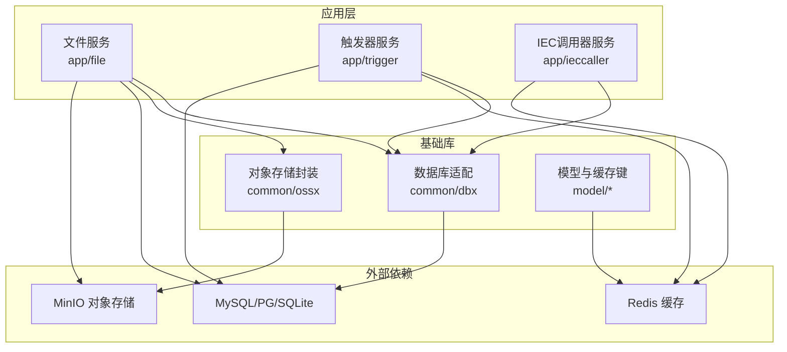
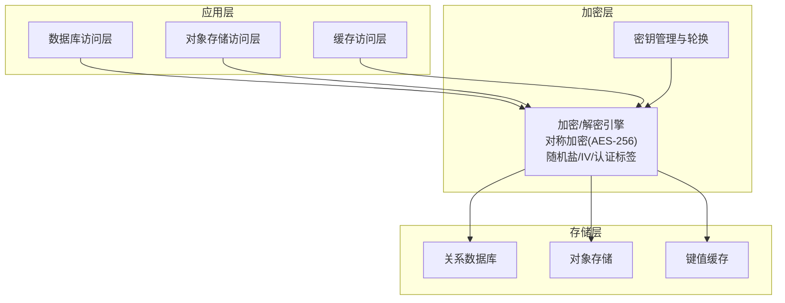
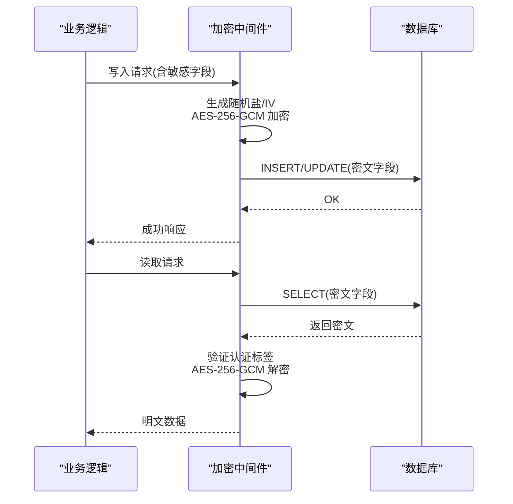
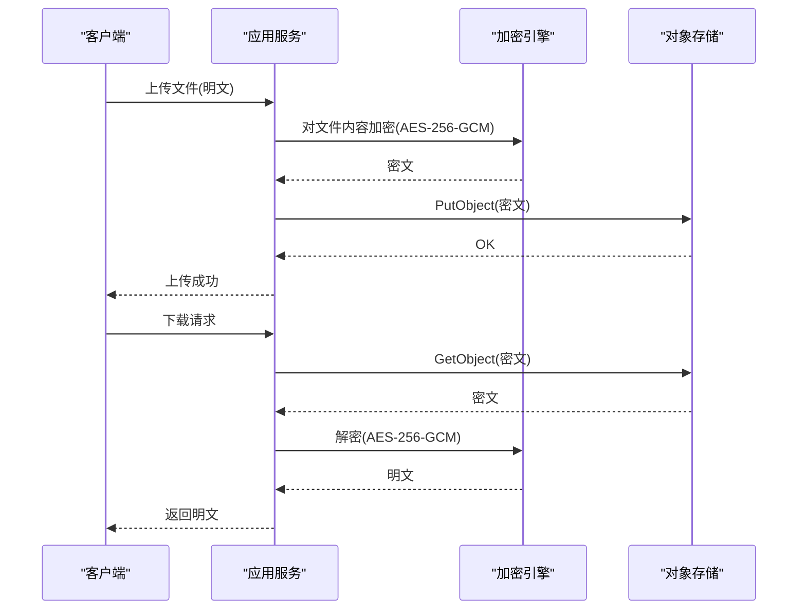
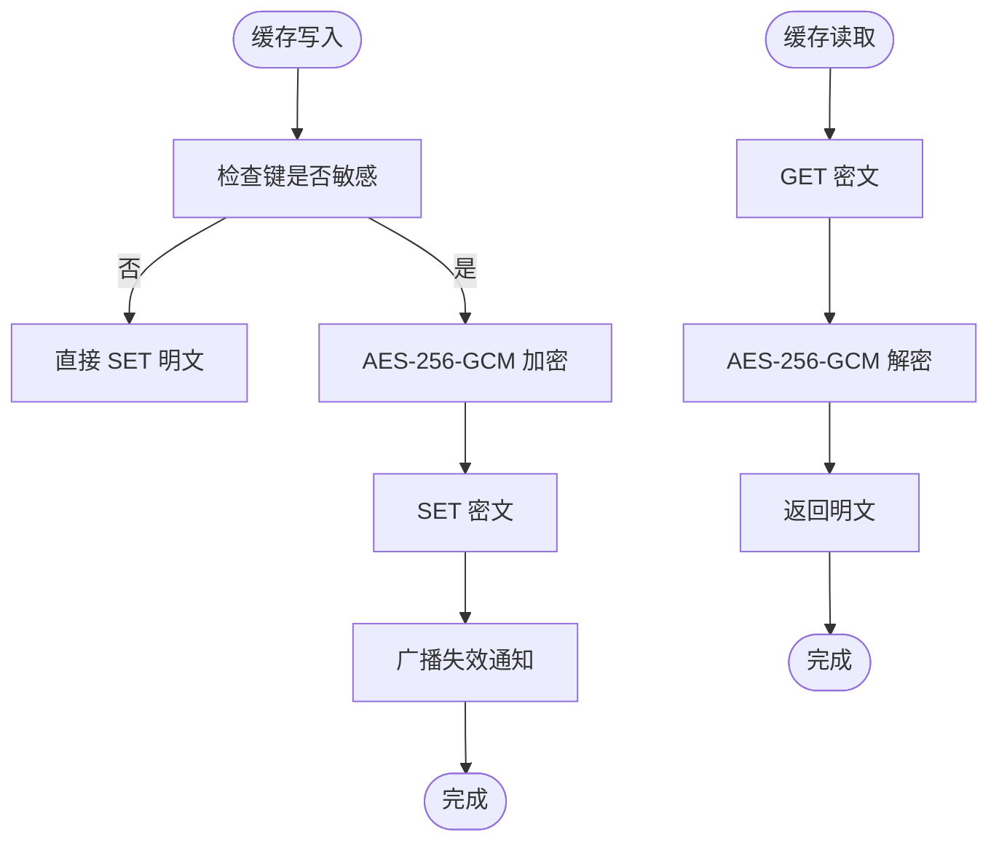
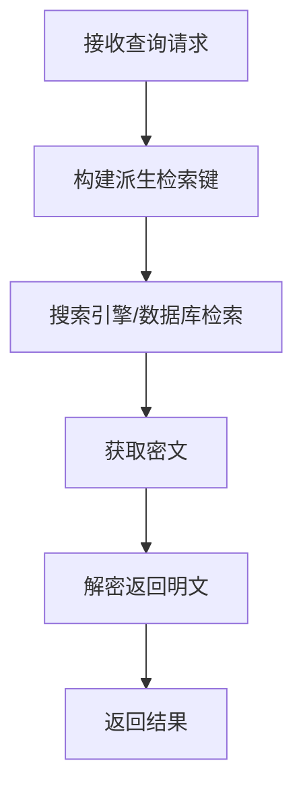
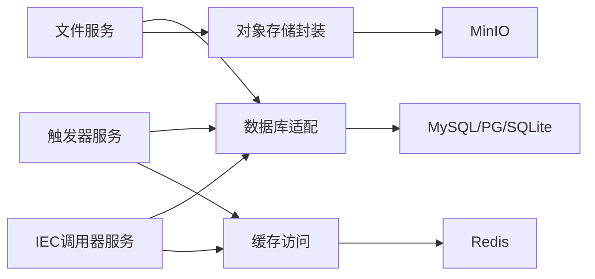

# 存储加密

<cite>
**本文引用的文件**
- [common/dbx/dbx.go](file://common/dbx/dbx.go)
- [common/ossx/ossx.go](file://common/ossx/ossx.go)
- [common/ossx/minio_oss.go](file://common/ossx/minio_oss.go)
- [model/ossmodel.go](file://model/ossmodel.go)
- [app/file/etc/file.yaml](file://app/file/etc/file.yaml)
- [app/trigger/etc/trigger.yaml](file://app/trigger/etc/trigger.yaml)
- [app/ieccaller/etc/ieccaller.yaml](file://app/ieccaller/etc/ieccaller.yaml)
- [app/ieccaller/internal/logic/clearpointmappingcachelogic.go](file://app/ieccaller/internal/logic/clearpointmappingcachelogic.go)
- [model/devicepointmappingmodel.go](file://model/devicepointmappingmodel.go)
- [.trae/skills/zero-skills/references/database-patterns.md](file://.trae/skills/zero-skills/references/database-patterns.md)
- [.trae/skills/zero-skills/best-practices/overview.md](file://.trae/skills/zero-skills/best-practices/overview.md)
- [.trae/skills/zero-skills/references/resilience-patterns.md](file://.trae/skills/zero-skills/references/resilience-patterns.md)
</cite>

## 目录
1. [简介](#简介)
2. [项目结构](#项目结构)
3. [核心组件](#核心组件)
4. [架构总览](#架构总览)
5. [详细组件分析](#详细组件分析)
6. [依赖关系分析](#依赖关系分析)
7. [性能考量](#性能考量)
8. [故障排查指南](#故障排查指南)
9. [结论](#结论)
10. [附录](#附录)

## 简介
本指南围绕 zero-service 的存储加密实现进行系统性梳理，覆盖数据库字段级加密、对象存储加密、缓存敏感数据保护、加密数据检索与索引优化、性能优化策略以及密钥管理与迁移恢复流程。当前仓库未内置通用的透明字段加密/解密层，因此本指南在不引入具体第三方库的前提下，给出可落地的工程化方案与最佳实践，帮助在不破坏现有架构的基础上安全地扩展加密能力。

## 项目结构
- 数据库连接与方言适配：通过统一入口按数据源类型自动选择连接与 SQL 方言，便于后续在 ORM 层或自定义模型中注入加密/解密逻辑。
- 对象存储封装：抽象 OSS 模板接口，当前实现基于 MinIO；上传/下载/签名等操作均在传输链路中完成，适合在业务侧增加端到端加密。
- 缓存与热点数据：Redis 配置与缓存键空间设计已存在，可在缓存层对敏感值进行加密存储，结合广播失效策略保障一致性。
- 配置中心：各应用通过 YAML 配置 Redis、数据库、OSS 等外部依赖，便于集中管理密钥与凭据。

**图示来源**
- [common/dbx/dbx.go:46-64](file://common/dbx/dbx.go#L46-L64)
- [common/ossx/ossx.go:109-151](file://common/ossx/ossx.go#L109-L151)
- [common/ossx/minio_oss.go:214-235](file://common/ossx/minio_oss.go#L214-L235)
- [app/file/etc/file.yaml:17-22](file://app/file/etc/file.yaml#L17-L22)
- [app/trigger/etc/trigger.yaml:19-24](file://app/trigger/etc/trigger.yaml#L19-L24)
- [app/ieccaller/etc/ieccaller.yaml:1-79](file://app/ieccaller/etc/ieccaller.yaml#L1-L79)

**章节来源**
- [common/dbx/dbx.go:1-155](file://common/dbx/dbx.go#L1-L155)
- [common/ossx/ossx.go:1-152](file://common/ossx/ossx.go#L1-L152)
- [common/ossx/minio_oss.go:1-243](file://common/ossx/minio_oss.go#L1-L243)
- [app/file/etc/file.yaml:1-23](file://app/file/etc/file.yaml#L1-L23)
- [app/trigger/etc/trigger.yaml:1-37](file://app/trigger/etc/trigger.yaml#L1-L37)
- [app/ieccaller/etc/ieccaller.yaml:1-79](file://app/ieccaller/etc/ieccaller.yaml#L1-L79)

## 核心组件
- 数据库连接与方言适配：根据数据源 URL 自动识别类型并创建连接，为后续在模型层或 ORM 层注入加密/解密提供统一入口。
- 对象存储模板：抽象出统一的 OSS 操作接口，当前实现基于 MinIO；上传/下载/签名等操作均在传输链路中完成，适合在业务侧增加端到端加密。
- 缓存与键空间：Redis 配置与缓存键生成策略已存在，可在缓存层对敏感值进行加密存储，结合广播失效策略保障一致性。
- 配置与密钥：各应用通过 YAML 配置 Redis、数据库、OSS 等外部依赖，便于集中管理密钥与凭据。

**章节来源**
- [common/dbx/dbx.go:31-64](file://common/dbx/dbx.go#L31-L64)
- [common/ossx/ossx.go:28-39](file://common/ossx/ossx.go#L28-L39)
- [common/ossx/minio_oss.go:20-24](file://common/ossx/minio_oss.go#L20-L24)
- [app/trigger/etc/trigger.yaml:19-24](file://app/trigger/etc/trigger.yaml#L19-L24)
- [app/ieccaller/etc/ieccaller.yaml:1-79](file://app/ieccaller/etc/ieccaller.yaml#L1-L79)

## 架构总览
下图展示零信任视角下的存储加密架构：数据库、对象存储与缓存三类存储均在应用层进行加密/解密处理，确保明文不出边界；同时通过配置中心集中管理密钥与凭据，配合密钥轮换与审计日志实现全生命周期治理。

[此图为概念性架构示意，无需“图示来源”]

## 详细组件分析

### 数据库字段级加密方案
- 敏感字段识别与映射
  - 在模型层为每个实体建立敏感字段清单（如手机号、身份证、支付账号、密钥材料等），并定义字段到加密策略的映射表。
  - 通过中间件或 ORM 层拦截读写请求，在入库前对敏感字段执行加密，在出库时解密，保持业务代码透明。
- 加密算法与密钥
  - 推荐使用对称加密算法 AES-256-GCM，具备认证标签，防止篡改；为每条记录生成随机盐与初始化向量（IV），避免重放与统计分析。
  - 密钥采用主密钥（KM）+ 数据密钥（DK）分层策略：KM 存储于 KMS 或硬件安全模块（HSM），DK 由 KM 派生并随记录存储，定期轮换。
- 自动加密/解密流程
  - 写入流程：业务写入明文 → 加密层生成随机盐/IV → AES-256-GCM 加密 → 写入数据库。
  - 读取流程：数据库读取密文 → 解密层验证认证标签 → AES-256-GCM 解密 → 返回明文给业务。
- 查询与索引优化
  - 精确查询：对需要等值匹配的敏感字段，采用确定性加密（如格式保留加密 FPE）或派生列（派生字段存储哈希/前缀），但需权衡安全性与性能。
  - 范围/模糊查询：建议使用带外索引或搜索索引（如 Elasticsearch）存储派生检索键，数据库仅存密文。
- 性能影响与优化
  - 批量写入：合并加密批次，减少随机数生成与上下文切换开销。
  - 连接池与并发：限制并发加密任务，避免 CPU 竞争；对大字段采用流式加密。
  - 硬件加速：优先使用带有 AES-NI 的 CPU 或专用加密卡提升吞吐。
- 可观测性
  - 记录加密/解密耗时、错误率与密钥轮换事件，结合审计日志追踪异常行为。

[此图为概念性流程示意，无需“图示来源”]

**章节来源**
- [common/dbx/dbx.go:31-64](file://common/dbx/dbx.go#L31-L64)
- [.trae/skills/zero-skills/references/database-patterns.md:367-429](file://.trae/skills/zero-skills/references/database-patterns.md#L367-L429)

### 对象存储加密实现
- 端到端加密策略
  - 在上传前对文件内容进行对称加密（例如 AES-256-GCM），并将密文写入对象存储；元数据（如文件名、大小、上传时间）保持明文或仅存储派生摘要。
  - 将密钥材料与密文分离：密钥材料可存储于 KMS/HSM，密文存储于对象存储；或采用密钥派生（DKIM）策略，密钥材料不落盘。
- 传输与访问控制
  - 使用 HTTPS/TLS 传输，结合签名 URL 与过期时间控制访问；签名 URL 可附加版本号与校验参数，防止篡改。
  - 对象 ACL 与 IAM 策略最小权限原则，避免公开访问。
- 与现有 OSS 封装集成
  - 在 OSS 模板的 PutObject/PutStream 流程中插入加密步骤；签名 URL 生成时可附加版本号与校验参数。
  - 通过配置中心集中管理 Endpoint、AccessKey/SecretKey、BucketName 等，便于密钥轮换与多环境隔离。

**图示来源**
- [common/ossx/ossx.go:28-39](file://common/ossx/ossx.go#L28-L39)
- [common/ossx/minio_oss.go:65-148](file://common/ossx/minio_oss.go#L65-L148)
- [app/file/etc/file.yaml:17-22](file://app/file/etc/file.yaml#L17-L22)

**章节来源**
- [common/ossx/ossx.go:1-152](file://common/ossx/ossx.go#L1-L152)
- [common/ossx/minio_oss.go:1-243](file://common/ossx/minio_oss.go#L1-L243)
- [model/ossmodel.go:1-32](file://model/ossmodel.go#L1-L32)
- [app/file/etc/file.yaml:1-23](file://app/file/etc/file.yaml#L1-L23)

### 缓存数据加密策略
- 敏感数据加密存储
  - 对 Redis 中的敏感键值进行 AES-256-GCM 加密存储；密钥材料由 KMS/HSM 管理，定期轮换。
  - 对于需要检索的字段，采用派生检索键（如哈希/前缀）与密文分离存储，保证查询效率与安全性。
- 内存保护与失效策略
  - 缓存键空间遵循最小暴露原则，避免在日志与监控中泄露明文；缓存更新/删除时同步广播，确保多实例一致性。
  - 结合现有广播机制（如清除点位映射缓存）实现批量失效，降低一致性成本。
- 配置与密钥管理
  - Redis 连接信息与密钥通过配置中心集中管理，支持多环境与动态刷新。

**图示来源**
- [app/ieccaller/etc/ieccaller.yaml:1-79](file://app/ieccaller/etc/ieccaller.yaml#L1-L79)
- [app/ieccaller/internal/logic/clearpointmappingcachelogic.go:26-60](file://app/ieccaller/internal/logic/clearpointmappingcachelogic.go#L26-L60)
- [model/devicepointmappingmodel.go:66-107](file://model/devicepointmappingmodel.go#L66-L107)
- [app/trigger/etc/trigger.yaml:19-24](file://app/trigger/etc/trigger.yaml#L19-L24)

**章节来源**
- [app/ieccaller/internal/logic/clearpointmappingcachelogic.go:26-60](file://app/ieccaller/internal/logic/clearpointmappingcachelogic.go#L26-L60)
- [model/devicepointmappingmodel.go:66-107](file://model/devicepointmappingmodel.go#L66-L107)
- [app/trigger/etc/trigger.yaml:19-24](file://app/trigger/etc/trigger.yaml#L19-L24)
- [app/ieccaller/etc/ieccaller.yaml:1-79](file://app/ieccaller/etc/ieccaller.yaml#L1-L79)

### 加密数据的检索与处理机制
- 查询条件加密
  - 对等值查询字段采用确定性加密或派生检索键；对范围/模糊查询采用带外索引或搜索索引存储派生检索键。
- 索引优化
  - 数据库层面：对派生检索键建立索引；对密文字段不建索引，避免泄露统计信息。
  - 搜索引擎层面：对派生检索键建立倒排索引，支持复杂查询。
- 处理流程
  - 查询请求先转换为派生检索键，再在搜索引擎或数据库中定位密文，最后在应用层解密返回。

[此图为概念性流程示意，无需“图示来源”]

**章节来源**
- [.trae/skills/zero-skills/references/database-patterns.md:367-429](file://.trae/skills/zero-skills/references/database-patterns.md#L367-L429)

### 性能优化方案
- 批量加密
  - 合并小文件加密批次，减少随机数生成与上下文切换；对大文件采用流式加密与分块处理。
- 并发与限流
  - 使用工作池与 MapReduce 控制并发，避免资源争用；对加密任务设置背压与超时。
- 硬件加速
  - 利用 AES-NI 或专用加密卡提升吞吐；在高并发场景下考虑 GPU/TPU 加速。
- 缓存与预热
  - 对热点密钥与派生检索键进行缓存预热，降低冷启动开销。

**章节来源**
- [.trae/skills/zero-skills/best-practices/overview.md:490-544](file://.trae/skills/zero-skills/best-practices/overview.md#L490-L544)
- [.trae/skills/zero-skills/references/resilience-patterns.md:491-563](file://.trae/skills/zero-skills/references/resilience-patterns.md#L491-L563)

### 密钥管理与迁移恢复
- 密钥管理
  - 主密钥（KM）存放于 KMS/HSM，数据密钥（DK）由 KM 派生并与记录关联；定期轮换，旧密钥保留至过渡期结束。
  - 密钥材料不落盘，通过配置中心动态加载；支持密钥备份与灾难恢复。
- 数据迁移
  - 迁移前先冻结写入，导出明文数据，批量加密后导入新库；校验完整性与一致性。
- 备份与恢复
  - 备份介质加密存储；恢复时先解密再加载；对密钥与数据分别制定恢复策略。
- 审计与合规
  - 记录密钥轮换、访问与解密事件；定期审计密钥使用情况与异常行为。

**章节来源**
- [common/ossx/ossx.go:94-105](file://common/ossx/ossx.go#L94-L105)
- [common/ossx/minio_oss.go:214-235](file://common/ossx/minio_oss.go#L214-L235)
- [app/file/etc/file.yaml:17-22](file://app/file/etc/file.yaml#L17-L22)

## 依赖关系分析
- 组件耦合
  - 数据库适配与模型层松耦合，便于在模型层注入加密逻辑。
  - OSS 封装与 MinIO 实现解耦，便于替换供应商或增加端到端加密。
  - 缓存层与广播机制解耦，便于扩展加密与失效策略。
- 外部依赖
  - MySQL/PG/SQLite、MinIO、Redis 作为外部依赖，通过配置中心集中管理，便于密钥轮换与多环境部署。

**图示来源**
- [common/dbx/dbx.go:46-64](file://common/dbx/dbx.go#L46-L64)
- [common/ossx/ossx.go:109-151](file://common/ossx/ossx.go#L109-L151)
- [common/ossx/minio_oss.go:214-235](file://common/ossx/minio_oss.go#L214-L235)
- [app/trigger/etc/trigger.yaml:19-24](file://app/trigger/etc/trigger.yaml#L19-L24)
- [app/ieccaller/etc/ieccaller.yaml:1-79](file://app/ieccaller/etc/ieccaller.yaml#L1-L79)

**章节来源**
- [common/dbx/dbx.go:1-155](file://common/dbx/dbx.go#L1-L155)
- [common/ossx/ossx.go:1-152](file://common/ossx/ossx.go#L1-L152)
- [common/ossx/minio_oss.go:1-243](file://common/ossx/minio_oss.go#L1-L243)
- [app/trigger/etc/trigger.yaml:1-37](file://app/trigger/etc/trigger.yaml#L1-L37)
- [app/ieccaller/etc/ieccaller.yaml:1-79](file://app/ieccaller/etc/ieccaller.yaml#L1-L79)

## 性能考量
- 批量与并发
  - 使用 MapReduce 与工作池控制并发，避免 N+1 查询与无界 goroutine。
- 缓存命中率
  - 对热点数据进行缓存预热，结合广播失效策略降低重复解密成本。
- 硬件加速
  - 在高并发场景下启用 AES-NI 或专用加密卡，显著提升吞吐。

**章节来源**
- [.trae/skills/zero-skills/best-practices/overview.md:490-544](file://.trae/skills/zero-skills/best-practices/overview.md#L490-L544)
- [.trae/skills/zero-skills/references/resilience-patterns.md:491-563](file://.trae/skills/zero-skills/references/resilience-patterns.md#L491-L563)

## 故障排查指南
- 数据库
  - 检查加密/解密中间件日志与错误码，确认密钥可用性与认证标签校验。
- 对象存储
  - 核对签名 URL 参数与过期时间，确认对象 ACL 与网络连通性。
- 缓存
  - 关注缓存命中率与失效广播，排查多实例一致性问题。

**章节来源**
- [app/trigger/etc/trigger.yaml:19-24](file://app/trigger/etc/trigger.yaml#L19-L24)
- [app/ieccaller/etc/ieccaller.yaml:1-79](file://app/ieccaller/etc/ieccaller.yaml#L1-L79)

## 结论
通过在应用层统一注入加密/解密能力，并结合配置中心与密钥管理策略，zero-service 可在不改变现有数据模型与访问路径的前提下，实现数据库、对象存储与缓存的全面加密。建议优先采用 AES-256-GCM 与主密钥/数据密钥分层架构，配合派生检索键与带外索引满足查询需求，并通过批量加密、并发控制与硬件加速优化性能。

## 附录
- 配置项参考
  - Redis：主机、类型、密钥、密码、DB 索引
  - 数据库：数据源 URL
  - OSS：租户模式、Endpoint、AccessKey/SecretKey、BucketName
- 最佳实践
  - 批量操作与并发控制
  - 缓存键空间与失效广播
  - 硬件加速与密钥轮换

**章节来源**
- [app/trigger/etc/trigger.yaml:19-24](file://app/trigger/etc/trigger.yaml#L19-L24)
- [app/file/etc/file.yaml:17-22](file://app/file/etc/file.yaml#L17-L22)
- [.trae/skills/zero-skills/references/database-patterns.md:367-429](file://.trae/skills/zero-skills/references/database-patterns.md#L367-L429)
- [.trae/skills/zero-skills/best-practices/overview.md:490-544](file://.trae/skills/zero-skills/best-practices/overview.md#L490-L544)
- [.trae/skills/zero-skills/references/resilience-patterns.md:491-563](file://.trae/skills/zero-skills/references/resilience-patterns.md#L491-L563)