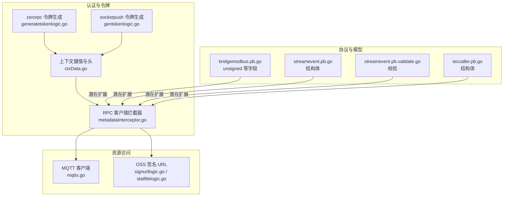
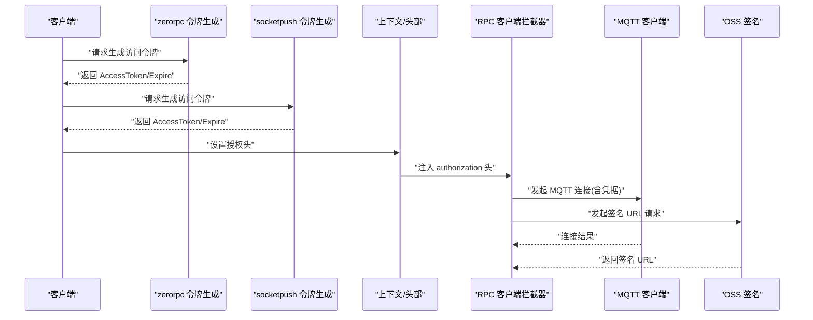
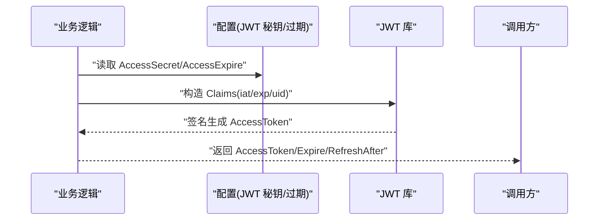
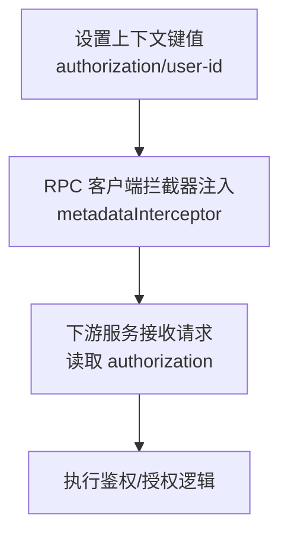
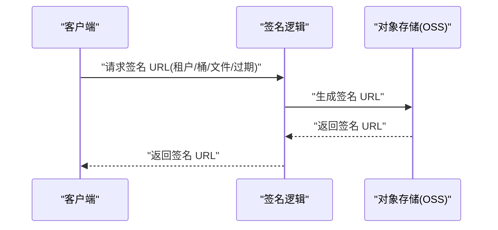
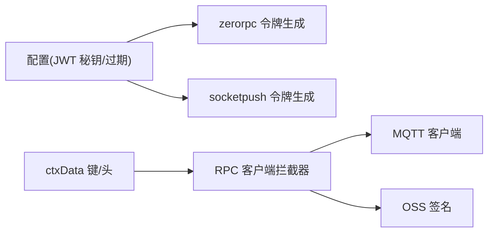

# 密钥管理

<cite>
**本文引用的文件**
- [common/tool/tool.go](file://common/tool/tool.go)
- [common/tool/idutil.go](file://common/tool/idutil.go)
- [common/ctxdata/ctxData.go](file://common/ctxdata/ctxData.go)
- [zerorpc/internal/logic/generatetokenlogic.go](file://zerorpc/internal/logic/generatetokenlogic.go)
- [socketapp/socketpush/internal/logic/gentokenlogic.go](file://socketapp/socketpush/internal/logic/gentokenlogic.go)
- [common/Interceptor/rpcclient/metadataInterceptor.go](file://common/Interceptor/rpcclient/metadataInterceptor.go)
- [common/mqttx/mqttx.go](file://common/mqttx/mqttx.go)
- [app/file/internal/logic/signurllogic.go](file://app/file/internal/logic/signurllogic.go)
- [app/file/internal/logic/statfilelogic.go](file://app/file/internal/logic/statfilelogic.go)
- [app/bridgemodbus/bridgemodbus/bridgemodbus.pb.go](file://app/bridgemodbus/bridgemodbus/bridgemodbus.pb.go)
- [facade/streamevent/streamevent/streamevent.pb.go](file://facade/streamevent/streamevent/streamevent.pb.go)
- [facade/streamevent/streamevent/streamevent.pb.validate.go](file://facade/streamevent/streamevent/streamevent.pb.validate.go)
- [app/ieccaller/ieccaller/ieccaller.pb.go](file://app/ieccaller/ieccaller/ieccaller.pb.go)
- [app/bridgemqtt/etc/bridgemqtt.yaml](file://app/bridgemqtt/etc/bridgemqtt.yaml)
- [app/ieccaller/etc/ieccaller.yaml](file://app/ieccaller/etc/ieccaller.yaml)
</cite>

## 目录
1. [引言](#引言)
2. [项目结构](#项目结构)
3. [核心组件](#核心组件)
4. [架构总览](#架构总览)
5. [详细组件分析](#详细组件分析)
6. [依赖分析](#依赖分析)
7. [性能考虑](#性能考虑)
8. [故障排查指南](#故障排查指南)
9. [结论](#结论)
10. [附录](#附录)

## 引言
本文件面向 zero-service 的密钥管理需求，提供一套可落地的完整解决方案。内容覆盖对称密钥管理（AES 密钥生成、KDF 使用、IV 管理）、非对称密钥体系（RSA 密钥对、签名与密钥交换）、密钥轮换策略（平滑过渡、备份与失效处理）、密钥存储安全（HSM 集成、密钥库与访问控制）、密钥分发机制（安全通道、密钥包装与动态分发），以及密钥生命周期管理、审计与合规实现思路。由于仓库中未发现显式的对称/非对称加密与 KDF 实现，本文在“已实现”部分仅聚焦现有代码中与密钥相关的能力，在“建议实现”部分给出基于现有能力的扩展方案。

## 项目结构
从密钥管理视角，以下模块与密钥相关：
- JWT 令牌生成与解析：zerorpc、socketapp/socketpush 中的令牌逻辑
- 上下文与元数据传递：ctxdata、rpc 客户端拦截器
- 资源访问授权：MQTT 客户端连接参数
- 文件服务签名 URL：OSS 签名逻辑
- 协议定义与字段：PB 中的 unsigned 等字段，便于后续扩展

图表来源
- [zerorpc/internal/logic/generatetokenlogic.go:29-52](file://zerorpc/internal/logic/generatetokenlogic.go#L29-L52)
- [socketapp/socketpush/internal/logic/gentokenlogic.go:57-78](file://socketapp/socketpush/internal/logic/gentokenlogic.go#L57-L78)
- [common/ctxdata/ctxData.go:9-24](file://common/ctxdata/ctxData.go#L9-L24)
- [common/Interceptor/rpcclient/metadataInterceptor.go:23-47](file://common/Interceptor/rpcclient/metadataInterceptor.go#L23-L47)
- [common/mqttx/mqttx.go:168-326](file://common/mqttx/mqttx.go#L168-L326)
- [app/file/internal/logic/signurllogic.go:52-57](file://app/file/internal/logic/signurllogic.go#L52-L57)
- [app/file/internal/logic/statfilelogic.go:48-52](file://app/file/internal/logic/statfilelogic.go#L48-L52)
- [app/bridgemodbus/bridgemodbus/bridgemodbus.pb.go:1496](file://app/bridgemodbus/bridgemodbus/bridgemodbus.pb.go#L1496)
- [facade/streamevent/streamevent/streamevent.pb.go:2323-2391](file://facade/streamevent/streamevent/streamevent.pb.go#L2323-L2391)
- [facade/streamevent/streamevent/streamevent.pb.validate.go:2924-2981](file://facade/streamevent/streamevent/streamevent.pb.validate.go#L2924-L2981)
- [app/ieccaller/ieccaller/ieccaller.pb.go:312-502](file://app/ieccaller/ieccaller/ieccaller.pb.go#L312-L502)

章节来源
- [zerorpc/internal/logic/generatetokenlogic.go:29-52](file://zerorpc/internal/logic/generatetokenlogic.go#L29-L52)
- [socketapp/socketpush/internal/logic/gentokenlogic.go:57-78](file://socketapp/socketpush/internal/logic/gentokenlogic.go#L57-L78)
- [common/ctxdata/ctxData.go:9-24](file://common/ctxdata/ctxData.go#L9-L24)
- [common/Interceptor/rpcclient/metadataInterceptor.go:23-47](file://common/Interceptor/rpcclient/metadataInterceptor.go#L23-L47)
- [common/mqttx/mqttx.go:168-326](file://common/mqttx/mqttx.go#L168-L326)
- [app/file/internal/logic/signurllogic.go:52-57](file://app/file/internal/logic/signurllogic.go#L52-L57)
- [app/file/internal/logic/statfilelogic.go:48-52](file://app/file/internal/logic/statfilelogic.go#L48-L52)
- [app/bridgemodbus/bridgemodbus/bridgemodbus.pb.go:1496](file://app/bridgemodbus/bridgemodbus/bridgemodbus.pb.go#L1496)
- [facade/streamevent/streamevent/streamevent.pb.go:2323-2391](file://facade/streamevent/streamevent/streamevent.pb.go#L2323-L2391)
- [facade/streamevent/streamevent/streamevent.pb.validate.go:2924-2981](file://facade/streamevent/streamevent/streamevent.pb.validate.go#L2924-L2981)
- [app/ieccaller/ieccaller/ieccaller.pb.go:312-502](file://app/ieccaller/ieccaller/ieccaller.pb.go#L312-L502)

## 核心组件
- JWT 令牌生成与解析
  - zerorpc 与 socketpush 提供基于 HS256 的令牌生成，包含 iat/exp 等标准声明，支持附加自定义载荷。
  - 令牌解析支持多密钥尝试，便于密钥轮换时的兼容。
- 上下文与元数据
  - ctxdata 定义了用户、授权、追踪等上下文键与 gRPC 头部键，统一在拦截器中注入到请求元数据。
- 资源访问授权
  - MQTT 客户端连接参数包含用户名/密码；OSS 签名 URL 用于安全访问对象存储资源。
- 协议与模型
  - PB 中的 unsigned 等字段可用于后续扩展（如密钥包装、加解密标志位）。

章节来源
- [zerorpc/internal/logic/generatetokenlogic.go:29-52](file://zerorpc/internal/logic/generatetokenlogic.go#L29-L52)
- [socketapp/socketpush/internal/logic/gentokenlogic.go:57-78](file://socketapp/socketpush/internal/logic/gentokenlogic.go#L57-L78)
- [common/tool/tool.go:35-65](file://common/tool/tool.go#L35-L65)
- [common/ctxdata/ctxData.go:9-24](file://common/ctxdata/ctxData.go#L9-L24)
- [common/Interceptor/rpcclient/metadataInterceptor.go:23-47](file://common/Interceptor/rpcclient/metadataInterceptor.go#L23-L47)
- [common/mqttx/mqttx.go:168-326](file://common/mqttx/mqttx.go#L168-L326)
- [app/file/internal/logic/signurllogic.go:52-57](file://app/file/internal/logic/signurllogic.go#L52-L57)

## 架构总览
下图展示密钥相关能力在系统中的交互路径：令牌生成、元数据注入、下游服务调用与资源访问。

图表来源
- [zerorpc/internal/logic/generatetokenlogic.go:29-52](file://zerorpc/internal/logic/generatetokenlogic.go#L29-L52)
- [socketapp/socketpush/internal/logic/gentokenlogic.go:57-78](file://socketapp/socketpush/internal/logic/gentokenlogic.go#L57-L78)
- [common/ctxdata/ctxData.go:56-61](file://common/ctxdata/ctxData.go#L56-L61)
- [common/Interceptor/rpcclient/metadataInterceptor.go:23-47](file://common/Interceptor/rpcclient/metadataInterceptor.go#L23-L47)
- [common/mqttx/mqttx.go:168-326](file://common/mqttx/mqttx.go#L168-L326)
- [app/file/internal/logic/signurllogic.go:52-57](file://app/file/internal/logic/signurllogic.go#L52-L57)

## 详细组件分析

### JWT 令牌生成与解析
- 生成流程
  - 选择 HS256 签名方法，设置 iat/exp 标准声明，附加用户 ID 与自定义字段。
  - 支持刷新窗口（refresh-after）以便提前续签。
- 解析流程
  - 支持多密钥尝试解析，便于密钥轮换期间的兼容。
- 适用场景
  - 内部服务间鉴权、前端会话令牌、临时访问凭证。

图表来源
- [zerorpc/internal/logic/generatetokenlogic.go:29-52](file://zerorpc/internal/logic/generatetokenlogic.go#L29-L52)
- [socketapp/socketpush/internal/logic/gentokenlogic.go:57-78](file://socketapp/socketpush/internal/logic/gentokenlogic.go#L57-L78)
- [common/tool/tool.go:35-65](file://common/tool/tool.go#L35-L65)

章节来源
- [zerorpc/internal/logic/generatetokenlogic.go:29-52](file://zerorpc/internal/logic/generatetokenlogic.go#L29-L52)
- [socketapp/socketpush/internal/logic/gentokenlogic.go:57-78](file://socketapp/socketpush/internal/logic/gentokenlogic.go#L57-L78)
- [common/tool/tool.go:35-65](file://common/tool/tool.go#L35-L65)

### 上下文与元数据传递
- 键与头部
  - 定义了 authorization、user-id、trace-id 等键与对应的 gRPC 头部键。
- 注入与读取
  - RPC 客户端拦截器自动将 authorization 头注入到请求元数据。
  - 服务端可通过 ctxdata 读取上下文中的键值。

图表来源
- [common/ctxdata/ctxData.go:9-24](file://common/ctxdata/ctxData.go#L9-L24)
- [common/Interceptor/rpcclient/metadataInterceptor.go:23-47](file://common/Interceptor/rpcclient/metadataInterceptor.go#L23-L47)

章节来源
- [common/ctxdata/ctxData.go:9-24](file://common/ctxdata/ctxData.go#L9-L24)
- [common/Interceptor/rpcclient/metadataInterceptor.go:23-47](file://common/Interceptor/rpcclient/metadataInterceptor.go#L23-L47)

### 资源访问授权
- MQTT
  - 客户端连接包含用户名/密码，适合在内部网络中进行简单认证。
- OSS 签名 URL
  - 通过签名 URL 提供受限访问，避免暴露长期密钥。

图表来源
- [common/mqttx/mqttx.go:168-326](file://common/mqttx/mqttx.go#L168-L326)
- [app/file/internal/logic/signurllogic.go:52-57](file://app/file/internal/logic/signurllogic.go#L52-L57)
- [app/file/internal/logic/statfilelogic.go:48-52](file://app/file/internal/logic/statfilelogic.go#L48-L52)

章节来源
- [common/mqttx/mqttx.go:168-326](file://common/mqttx/mqttx.go#L168-L326)
- [app/file/internal/logic/signurllogic.go:52-57](file://app/file/internal/logic/signurllogic.go#L52-L57)
- [app/file/internal/logic/statfilelogic.go:48-52](file://app/file/internal/logic/statfilelogic.go#L48-L52)

### 协议与模型扩展点
- unsigned 等字段可用于扩展密钥包装/加解密标志位。
- PB 结构体与校验逻辑为后续引入密钥材料字段提供基础。

章节来源
- [app/bridgemodbus/bridgemodbus/bridgemodbus.pb.go:1496](file://app/bridgemodbus/bridgemodbus/bridgemodbus.pb.go#L1496)
- [facade/streamevent/streamevent/streamevent.pb.go:2323-2391](file://facade/streamevent/streamevent/streamevent.pb.go#L2323-L2391)
- [facade/streamevent/streamevent/streamevent.pb.validate.go:2924-2981](file://facade/streamevent/streamevent/streamevent.pb.validate.go#L2924-L2981)
- [app/ieccaller/ieccaller/ieccaller.pb.go:312-502](file://app/ieccaller/ieccaller/ieccaller.pb.go#L312-L502)

## 依赖分析
- 组件耦合
  - 令牌生成依赖配置中心的密钥与过期策略。
  - 元数据注入依赖 ctxdata 的键/头映射。
  - MQTT/OSS 访问依赖各自凭据与签名服务。
- 外部依赖
  - JWT 库、MQTT 客户端库、对象存储 SDK。
- 潜在循环
  - 当前未见明显循环依赖；令牌生成与拦截器之间为单向依赖。

图表来源
- [zerorpc/internal/logic/generatetokenlogic.go:29-52](file://zerorpc/internal/logic/generatetokenlogic.go#L29-L52)
- [socketapp/socketpush/internal/logic/gentokenlogic.go:57-78](file://socketapp/socketpush/internal/logic/gentokenlogic.go#L57-L78)
- [common/ctxdata/ctxData.go:9-24](file://common/ctxdata/ctxData.go#L9-L24)
- [common/Interceptor/rpcclient/metadataInterceptor.go:23-47](file://common/Interceptor/rpcclient/metadataInterceptor.go#L23-L47)
- [common/mqttx/mqttx.go:168-326](file://common/mqttx/mqttx.go#L168-L326)
- [app/file/internal/logic/signurllogic.go:52-57](file://app/file/internal/logic/signurllogic.go#L52-L57)

章节来源
- [zerorpc/internal/logic/generatetokenlogic.go:29-52](file://zerorpc/internal/logic/generatetokenlogic.go#L29-L52)
- [socketapp/socketpush/internal/logic/gentokenlogic.go:57-78](file://socketapp/socketpush/internal/logic/gentokenlogic.go#L57-L78)
- [common/ctxdata/ctxData.go:9-24](file://common/ctxdata/ctxData.go#L9-L24)
- [common/Interceptor/rpcclient/metadataInterceptor.go:23-47](file://common/Interceptor/rpcclient/metadataInterceptor.go#L23-L47)
- [common/mqttx/mqttx.go:168-326](file://common/mqttx/mqttx.go#L168-L326)
- [app/file/internal/logic/signurllogic.go:52-57](file://app/file/internal/logic/signurllogic.go#L52-L57)

## 性能考虑
- 令牌生成与解析为轻量操作，主要开销在签名计算与 JSON 序列化；建议批量请求合并与缓存短期令牌。
- 元数据注入与 MQTT/OSS 请求为网络 IO 主导，注意超时与重试策略。
- PB 结构体校验在数据流较大时可能带来 CPU 开销，建议按需启用严格校验。

## 故障排查指南
- 令牌无效
  - 检查是否正确去除 Bearer 前缀、是否使用正确的密钥进行解析、exp/iat 是否在有效期内。
- 授权失败
  - 确认 authorization 头是否被拦截器正确注入，下游服务是否正确读取 ctxdata。
- MQTT 连接失败
  - 核对用户名/密码配置，检查网络连通性与超时设置。
- OSS 签名 URL 失败
  - 核对租户/桶/文件名与过期时间，确认签名服务可用。

章节来源
- [common/tool/tool.go:35-65](file://common/tool/tool.go#L35-L65)
- [common/Interceptor/rpcclient/metadataInterceptor.go:23-47](file://common/Interceptor/rpcclient/metadataInterceptor.go#L23-L47)
- [common/mqttx/mqttx.go:168-326](file://common/mqttx/mqttx.go#L168-L326)
- [app/file/internal/logic/signurllogic.go:52-57](file://app/file/internal/logic/signurllogic.go#L52-L57)

## 结论
本项目已在令牌生成、元数据传递、资源访问授权方面具备良好基础。针对密钥管理的“已实现”部分，建议在此基础上扩展对称/非对称加密、KDF、HSM 集成与密钥轮换机制；“建议实现”部分提供了与现有能力衔接的落地方案，便于渐进式演进。

## 附录

### 已实现能力清单
- JWT 令牌生成与解析（HS256）
- 上下文键与 gRPC 头部映射
- RPC 客户端拦截器注入 authorization
- MQTT 凭据配置
- OSS 签名 URL

章节来源
- [zerorpc/internal/logic/generatetokenlogic.go:29-52](file://zerorpc/internal/logic/generatetokenlogic.go#L29-L52)
- [socketapp/socketpush/internal/logic/gentokenlogic.go:57-78](file://socketapp/socketpush/internal/logic/gentokenlogic.go#L57-L78)
- [common/ctxdata/ctxData.go:9-24](file://common/ctxdata/ctxData.go#L9-L24)
- [common/Interceptor/rpcclient/metadataInterceptor.go:23-47](file://common/Interceptor/rpcclient/metadataInterceptor.go#L23-L47)
- [common/mqttx/mqttx.go:168-326](file://common/mqttx/mqttx.go#L168-L326)
- [app/file/internal/logic/signurllogic.go:52-57](file://app/file/internal/logic/signurllogic.go#L52-L57)

### 建议实现：对称密钥管理
- AES 密钥生成
  - 使用强随机源生成 256-bit 密钥，存储于密钥库并受访问控制保护。
- KDF 使用
  - 使用 PBKDF2/Argon2 从口令或主密钥派生会话密钥，设定合理迭代次数与盐值。
- 初始化向量管理
  - 为每条记录/消息生成唯一 IV，IV 与密文一起存储，确保重用防护。

### 建议实现：非对称密钥体系
- RSA 密钥对生成
  - 生成 2048-bit+ 密钥对，公钥用于加密与验签，私钥用于解密与签名。
- 数字签名
  - 使用 RSASSA-PKCS1-v1_5 或 PSS 签名，配合 SHA-256。
- 密钥交换协议
  - 在 TLS 握手或自定义协议中使用 ECDH 进行密钥协商，结合 AEAD 加密。

### 建议实现：密钥轮换策略
- 平滑过渡
  - 新旧密钥并行生效，逐步将流量切换至新密钥；设置过渡期与回滚策略。
- 备份与失效处理
  - 对主密钥进行异地备份，建立密钥归档与销毁流程；监控密钥使用与异常。

### 建议实现：密钥存储安全
- HSM 集成
  - 将密钥材料托管于 HSM，应用通过 API 进行签名/解密操作，不直接接触明文。
- 密钥库管理
  - 建立密钥生命周期管理平台，支持密钥生成、轮换、归档与销毁。
- 访问控制
  - 基于角色的最小权限原则，强制多因素认证与审计日志。

### 建议实现：密钥分发机制
- 安全通道传输
  - 使用 TLS/SSH 等加密通道分发密钥材料，防止中间人攻击。
- 密钥包装
  - 使用对称密钥包装（KEK）保护密钥加密密钥（DEK），结合 HSM 进行封装/解封。
- 动态分发
  - 基于服务网格或 API 网关的动态密钥下发，结合缓存与刷新策略。

### 建议实现：密钥生命周期管理、审计与合规
- 生命周期管理
  - 明确定义密钥生成、启用、轮换、停用、销毁的时间点与触发条件。
- 审计日志
  - 记录密钥使用事件（生成、导入、导出、删除、轮换、访问）与操作者信息。
- 合规性
  - 满足行业标准（如 FIPS 140-2、PCI-DSS）与地方法律法规要求，定期进行合规评估。