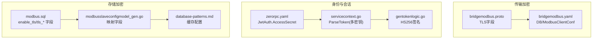
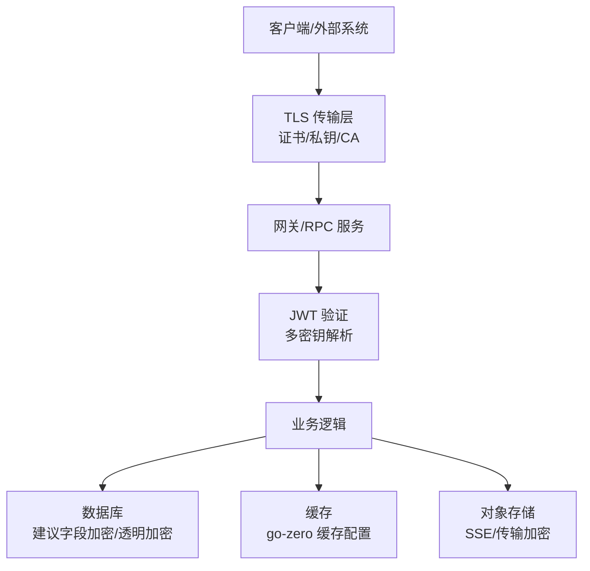
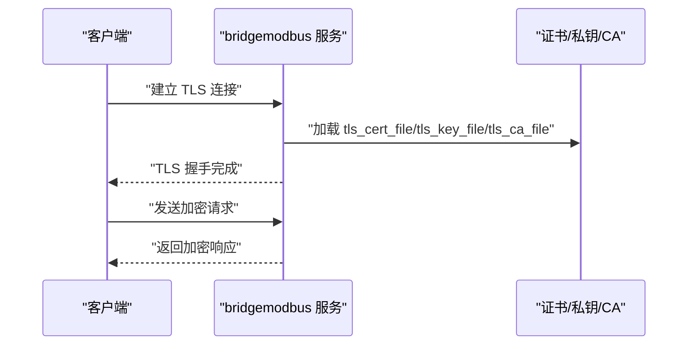
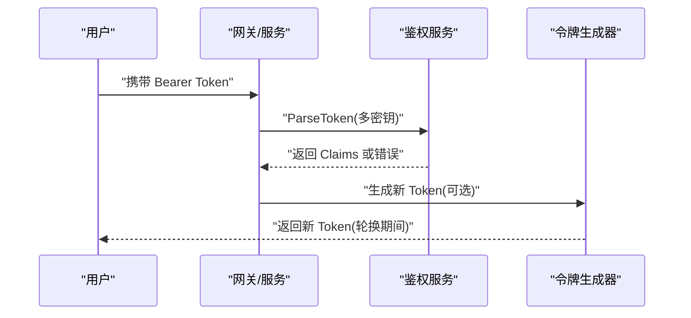
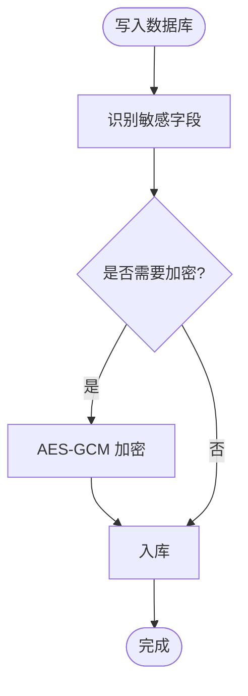
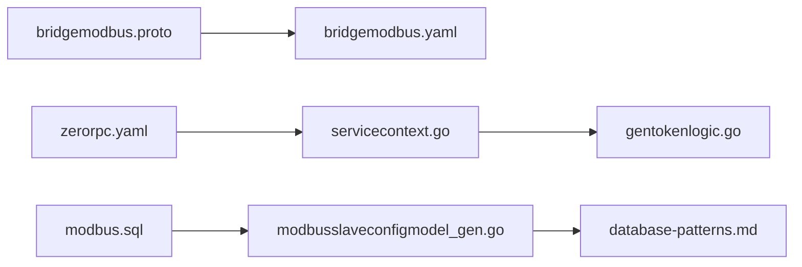

# 数据加密与密钥管理

<cite>
**本文引用的文件**
- [app/bridgemodbus/bridgemodbus/bridgemodbus.pb.go](file://app/bridgemodbus/bridgemodbus/bridgemodbus.pb.go)
- [model/modbusslaveconfigmodel_gen.go](file://model/modbusslaveconfigmodel_gen.go)
- [model/sql/modbus.sql](file://model/sql/modbus.sql)
- [app/bridgemodbus/etc/bridgemodbus.yaml](file://app/bridgemodbus/etc/bridgemodbus.yaml)
- [zerorpc/etc/zerorpc.yaml](file://zerorpc/etc/zerorpc.yaml)
- [socketapp/socketgtw/internal/svc/servicecontext.go](file://socketapp/socketgtw/internal/svc/servicecontext.go)
- [socketapp/socketpush/internal/logic/gentokenlogic.go](file://socketapp/socketpush/internal/logic/gentokenlogic.go)
- [common/tool/tool.go](file://common/tool/tool.go)
- [.trae/skills/zero-skills/best-practices/overview.md](file://.trae/skills/zero-skills/best-practices/overview.md)
- [.trae/skills/zero-skills/references/database-patterns.md](file://.trae/skills/zero-skills/references/database-patterns.md)
</cite>

## 目录
1. [简介](#简介)
2. [项目结构](#项目结构)
3. [核心组件](#核心组件)
4. [架构总览](#架构总览)
5. [详细组件分析](#详细组件分析)
6. [依赖分析](#依赖分析)
7. [性能考量](#性能考量)
8. [故障排查指南](#故障排查指南)
9. [结论](#结论)
10. [附录](#附录)

## 简介
本文件面向 zero-service 的数据加密与密钥管理，系统化梳理传输加密（TLS）、存储加密（数据库/文件/缓存）、对称与非对称加密的应用场景与最佳实践，并给出密钥轮换、密钥存储与分发策略，以及性能优化、错误处理与兼容性建议。文档同时覆盖敏感数据识别、加密上下文管理与解密流程的安全实现。

## 项目结构
围绕加密与密钥管理的关键位置如下：
- 传输加密：Modbus/TLS 配置在 gRPC 协议定义中体现，数据库连接与 RPC/HTTP 网关配置中体现明文风险点。
- 存储加密：数据库字段与表结构中存在明文存储的敏感项；缓存层使用 go-zero 缓存配置；文件存储通过 OSS/MinIO 抽象。
- 身份与会话：JWT 密钥在配置文件中集中管理，支持多密钥轮换解析。
- 工具与通用能力：通用工具库提供 UUID、Base62、时间戳等辅助能力，支撑密钥与令牌生成。

**图表来源**
- [app/bridgemodbus/bridgemodbus/bridgemodbus.pb.go:33-40](file://app/bridgemodbus/bridgemodbus/bridgemodbus.pb.go#L33-L40)
- [app/bridgemodbus/etc/bridgemodbus.yaml:20-26](file://app/bridgemodbus/etc/bridgemodbus.yaml#L20-L26)
- [zerorpc/etc/zerorpc.yaml:33-35](file://zerorpc/etc/zerorpc.yaml#L33-L35)
- [socketapp/socketgtw/internal/svc/servicecontext.go:59-74](file://socketapp/socketgtw/internal/svc/servicecontext.go#L59-L74)
- [socketapp/socketpush/internal/logic/gentokenlogic.go:57-78](file://socketapp/socketpush/internal/logic/gentokenlogic.go#L57-L78)
- [model/sql/modbus.sql:14-25](file://model/sql/modbus.sql#L14-L25)
- [model/modbusslaveconfigmodel_gen.go:71-81](file://model/modbusslaveconfigmodel_gen.go#L71-L81)
- [.trae/skills/zero-skills/references/database-patterns.md:367-429](file://.trae/skills/zero-skills/references/database-patterns.md#L367-L429)

**章节来源**
- [app/bridgemodbus/bridgemodbus/bridgemodbus.pb.go:33-40](file://app/bridgemodbus/bridgemodbus/bridgemodbus.pb.go#L33-L40)
- [app/bridgemodbus/etc/bridgemodbus.yaml:20-26](file://app/bridgemodbus/etc/bridgemodbus.yaml#L20-L26)
- [zerorpc/etc/zerorpc.yaml:33-35](file://zerorpc/etc/zerorpc.yaml#L33-L35)
- [socketapp/socketgtw/internal/svc/servicecontext.go:59-74](file://socketapp/socketgtw/internal/svc/servicecontext.go#L59-L74)
- [socketapp/socketpush/internal/logic/gentokenlogic.go:57-78](file://socketapp/socketpush/internal/logic/gentokenlogic.go#L57-L78)
- [model/sql/modbus.sql:14-25](file://model/sql/modbus.sql#L14-L25)
- [model/modbusslaveconfigmodel_gen.go:71-81](file://model/modbusslaveconfigmodel_gen.go#L71-L81)
- [.trae/skills/zero-skills/references/database-patterns.md:367-429](file://.trae/skills/zero-skills/references/database-patterns.md#L367-L429)

## 核心组件
- 传输加密（TLS）：在 Modbus 客户端配置中暴露 enable_tls、tls_cert_file、tls_key_file、tls_ca_file 字段，用于开启 TLS 并指定证书链。
- 身份与会话：JWT 使用 HS256 签名，密钥在配置中集中管理，服务端支持多密钥解析以实现密钥轮换。
- 存储加密：数据库层存在明文存储的敏感字段（如密码、密钥材料等），需通过应用层加密或数据库透明加密（TDE）解决；缓存层使用 go-zero 缓存配置，注意缓存中的敏感数据生命周期。
- 文件与对象存储：通过 OSS/MinIO 抽象，建议在上传/下载时启用传输加密与服务端加密（SSE）。

**章节来源**
- [app/bridgemodbus/bridgemodbus/bridgemodbus.pb.go:33-40](file://app/bridgemodbus/bridgemodbus/bridgemodbus.pb.go#L33-L40)
- [model/sql/modbus.sql:14-25](file://model/sql/modbus.sql#L14-L25)
- [model/modbusslaveconfigmodel_gen.go:71-81](file://model/modbusslaveconfigmodel_gen.go#L71-L81)
- [zerorpc/etc/zerorpc.yaml:33-35](file://zerorpc/etc/zerorpc.yaml#L33-L35)
- [.trae/skills/zero-skills/references/database-patterns.md:367-429](file://.trae/skills/zero-skills/references/database-patterns.md#L367-L429)

## 架构总览
下图展示零信任视角下的加密与密钥管理架构：传输层采用 TLS，身份层采用 JWT（HS256），存储层建议引入应用层字段加密与数据库/对象存储的加密能力，并配合密钥轮换与最小权限访问。

[此图为概念性架构示意，无需图表来源]

## 详细组件分析

### 传输加密（TLS）实现
- 协议与字段：Modbus 客户端配置包含 enable_tls、tls_cert_file、tls_key_file、tls_ca_file 字段，用于控制 TLS 启用与证书链加载。
- 配置位置：bridgemodbus 服务通过 etc 配置文件设置数据库连接串与 Modbus 客户端地址，TLS 证书相关参数在协议定义中声明。
- 建议：
  - 强制启用 TLS，禁止明文传输。
  - 使用受信 CA 签发的证书，定期轮换证书与私钥。
  - 在客户端和服务端均校验证书链与主机名匹配。
  - 结合网关/反向代理统一管理证书与 TLS 参数，减少重复配置。

**图表来源**
- [app/bridgemodbus/bridgemodbus/bridgemodbus.pb.go:33-40](file://app/bridgemodbus/bridgemodbus/bridgemodbus.pb.go#L33-L40)
- [app/bridgemodbus/etc/bridgemodbus.yaml:20-26](file://app/bridgemodbus/etc/bridgemodbus.yaml#L20-L26)

**章节来源**
- [app/bridgemodbus/bridgemodbus/bridgemodbus.pb.go:33-40](file://app/bridgemodbus/bridgemodbus/bridgemodbus.pb.go#L33-L40)
- [app/bridgemodbus/etc/bridgemodbus.yaml:20-26](file://app/bridgemodbus/etc/bridgemodbus.yaml#L20-L26)

### 身份与会话（JWT）
- 密钥管理：zerorpc.yaml 中集中配置 JwtAuth.AccessSecret 与 AccessExpire，支持密钥轮换（PrevAccessSecret）。
- 多密钥解析：服务端解析 JWT 时尝试多个密钥，实现平滑轮换。
- 签名算法：gentokenlogic 使用 HS256 签名，生成与验证流程清晰。

**图表来源**
- [zerorpc/etc/zerorpc.yaml:33-35](file://zerorpc/etc/zerorpc.yaml#L33-L35)
- [socketapp/socketgtw/internal/svc/servicecontext.go:59-74](file://socketapp/socketgtw/internal/svc/servicecontext.go#L59-L74)
- [socketapp/socketpush/internal/logic/gentokenlogic.go:57-78](file://socketapp/socketpush/internal/logic/gentokenlogic.go#L57-L78)
- [.trae/skills/zero-skills/best-practices/overview.md:610-669](file://.trae/skills/zero-skills/best-practices/overview.md#L610-L669)

**章节来源**
- [zerorpc/etc/zerorpc.yaml:33-35](file://zerorpc/etc/zerorpc.yaml#L33-L35)
- [socketapp/socketgtw/internal/svc/servicecontext.go:59-74](file://socketapp/socketgtw/internal/svc/servicecontext.go#L59-L74)
- [socketapp/socketpush/internal/logic/gentokenlogic.go:57-78](file://socketapp/socketpush/internal/logic/gentokenlogic.go#L57-L78)
- [.trae/skills/zero-skills/best-practices/overview.md:610-669](file://.trae/skills/zero-skills/best-practices/overview.md#L610-L669)

### 存储加密（数据库/文件/缓存）
- 数据库字段加密：当前表结构中存在明文存储的敏感字段（如密码、密钥材料等）。建议在应用层对敏感字段进行对称加密（AES-GCM）并在入库前加密、出库后解密。
- 数据库透明加密（TDE）：若数据库支持（如 MySQL/TiDB 的 TDE），可作为补充手段，但需结合密钥管理系统与审计。
- 文件与对象存储：建议在上传/下载时启用传输加密与服务端加密（SSE），并确保密钥由密钥管理服务托管。
- 缓存加密：缓存层使用 go-zero 缓存配置，建议对敏感键值进行加密存储，并严格控制缓存生命周期与失效策略。

**图表来源**
- [model/sql/modbus.sql:14-25](file://model/sql/modbus.sql#L14-L25)
- [model/modbusslaveconfigmodel_gen.go:71-81](file://model/modbusslaveconfigmodel_gen.go#L71-L81)
- [.trae/skills/zero-skills/references/database-patterns.md:367-429](file://.trae/skills/zero-skills/references/database-patterns.md#L367-L429)

**章节来源**
- [model/sql/modbus.sql:14-25](file://model/sql/modbus.sql#L14-L25)
- [model/modbusslaveconfigmodel_gen.go:71-81](file://model/modbusslaveconfigmodel_gen.go#L71-L81)
- [.trae/skills/zero-skills/references/database-patterns.md:367-429](file://.trae/skills/zero-skills/references/database-patterns.md#L367-L429)

### 对称加密与密钥管理
- AES 应用：建议对数据库敏感字段采用 AES-GCM，提供机密性与完整性保护；密钥长度使用 256 位，IV 建议每次随机生成并随密文存储。
- 密钥派生：可使用 PBKDF2/HKDF 从主密钥派生工作密钥，隔离不同表/字段的密钥。
- 初始化向量（IV）：IV 必须随机且不可预测，长度至少 96 位；与密文一起存储，但不与密钥相同。
- 密钥轮换：采用“先加密新密钥、再解密旧密钥、最后删除旧密钥”的渐进式策略；在读取阶段同时支持新旧密钥解密，写入阶段切换到新密钥。

[本节为通用实践说明，无需章节来源]

### 非对称加密与密钥交换
- RSA 场景：适用于密钥封装（RSAES-OAEP）与数字签名（RSASSA-PKCS1-v1_5/ PSS），可用于保护静态密钥材料或签名校验。
- 密钥交换：TLS 握手已内置 ECDHE，建议在需要额外密钥封装或审计时，结合 RSA/ECDSA 实现附加保护。
- 最佳实践：私钥必须安全存储（HSM/TPM/KMS），公钥可公开分发；签名与验签流程需严格校验算法与参数。

[本节为通用实践说明，无需章节来源]

### 密钥存储与分发
- 密钥存储：优先使用硬件安全模块（HSM）或托管密钥服务（KMS），避免将密钥硬编码在配置文件中。
- 密钥分发：通过受控通道（如 Vault/OpenKMS）按需下发，限制访问权限与审计日志。
- 配置示例：zerorpc.yaml 中的 JwtAuth.AccessSecret 属于敏感配置，应迁移到 KMS/密钥管理服务，避免明文落盘。

**章节来源**
- [zerorpc/etc/zerorpc.yaml:33-35](file://zerorpc/etc/zerorpc.yaml#L33-L35)

## 依赖分析
- 传输层依赖：Modbus 客户端配置依赖 TLS 字段与证书文件；网关/服务依赖配置文件中的数据库连接串与 Modbus 客户端地址。
- 身份层依赖：JWT 验证依赖配置文件中的密钥与有效期；多密钥解析依赖配置文件中的备用密钥。
- 存储层依赖：数据库表结构与模型映射依赖明文存储的敏感字段；缓存层依赖 go-zero 缓存配置。

**图表来源**
- [app/bridgemodbus/bridgemodbus/bridgemodbus.pb.go:33-40](file://app/bridgemodbus/bridgemodbus/bridgemodbus.pb.go#L33-L40)
- [app/bridgemodbus/etc/bridgemodbus.yaml:20-26](file://app/bridgemodbus/etc/bridgemodbus.yaml#L20-L26)
- [zerorpc/etc/zerorpc.yaml:33-35](file://zerorpc/etc/zerorpc.yaml#L33-L35)
- [socketapp/socketgtw/internal/svc/servicecontext.go:59-74](file://socketapp/socketgtw/internal/svc/servicecontext.go#L59-L74)
- [socketapp/socketpush/internal/logic/gentokenlogic.go:57-78](file://socketapp/socketpush/internal/logic/gentokenlogic.go#L57-L78)
- [model/sql/modbus.sql:14-25](file://model/sql/modbus.sql#L14-L25)
- [model/modbusslaveconfigmodel_gen.go:71-81](file://model/modbusslaveconfigmodel_gen.go#L71-L81)
- [.trae/skills/zero-skills/references/database-patterns.md:367-429](file://.trae/skills/zero-skills/references/database-patterns.md#L367-L429)

**章节来源**
- [app/bridgemodbus/bridgemodbus/bridgemodbus.pb.go:33-40](file://app/bridgemodbus/bridgemodbus/bridgemodbus.pb.go#L33-L40)
- [app/bridgemodbus/etc/bridgemodbus.yaml:20-26](file://app/bridgemodbus/etc/bridgemodbus.yaml#L20-L26)
- [zerorpc/etc/zerorpc.yaml:33-35](file://zerorpc/etc/zerorpc.yaml#L33-L35)
- [socketapp/socketgtw/internal/svc/servicecontext.go:59-74](file://socketapp/socketgtw/internal/svc/servicecontext.go#L59-L74)
- [socketapp/socketpush/internal/logic/gentokenlogic.go:57-78](file://socketapp/socketpush/internal/logic/gentokenlogic.go#L57-L78)
- [model/sql/modbus.sql:14-25](file://model/sql/modbus.sql#L14-L25)
- [model/modbusslaveconfigmodel_gen.go:71-81](file://model/modbusslaveconfigmodel_gen.go#L71-L81)
- [.trae/skills/zero-skills/references/database-patterns.md:367-429](file://.trae/skills/zero-skills/references/database-patterns.md#L367-L429)

## 性能考量
- TLS 性能：合理复用连接与会话复用，减少握手开销；证书链优化与 OCSP Stapling 可降低握手延迟。
- AES 性能：优先使用硬件加速 AES 指令集；批量处理与内存对齐可提升吞吐；避免在热路径频繁分配临时缓冲区。
- 缓存命中率：对热点数据进行缓存，减少数据库与磁盘 IO；敏感数据缓存需加密与短 TTL。
- 密钥轮换：采用渐进式策略，避免大规模重加密带来的峰值压力；离峰时段执行密钥轮换。

[本节为通用指导，无需章节来源]

## 故障排查指南
- TLS 握手失败：检查证书/私钥/CA 文件路径与权限；确认主机名与 SAN 匹配；核对 TLS 版本与套件。
- JWT 验证失败：确认配置文件中的密钥是否正确；多密钥轮换期间，确保备用密钥可用；避免直接比较错误类型，使用 gRPC 状态码处理。
- 缓存问题：关注缓存键冲突与类型不匹配；更新后及时失效缓存；必要时自定义缓存键规则。
- 数据库连接：核对连接串格式与特殊字符编码；在容器环境使用正确的主机名解析。

**章节来源**
- [.trae/skills/zero-skills/troubleshooting/common-issues.md:383-471](file://.trae/skills/zero-skills/troubleshooting/common-issues.md#L383-L471)

## 结论
zero-service 在传输层具备 TLS 能力，在身份层采用 JWT HS256 并支持多密钥轮换。存储层当前存在明文敏感字段，建议引入应用层 AES 加密与数据库透明加密（TDE），并完善密钥管理与分发机制。通过渐进式密钥轮换、严格的证书与密钥生命周期管理，以及缓存与对象存储的加密策略，可显著提升整体安全性与合规性。

## 附录
- 敏感数据识别清单（建议）：用户密码、支付凭证、设备密钥、证书私钥、API 密钥、审计日志中的敏感字段。
- 加密上下文管理：在业务逻辑层统一注入加密上下文（密钥 ID、算法、IV、认证标签），确保解密流程可追溯。
- 兼容性考虑：TLS 版本与套件需与客户端兼容；JWT 算法与密钥长度需满足历史版本要求；数据库迁移需保证新旧版本共存期的数据一致性。