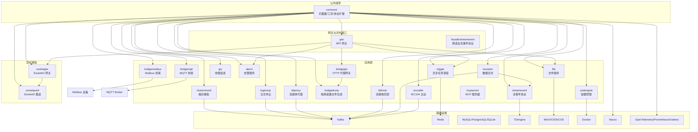
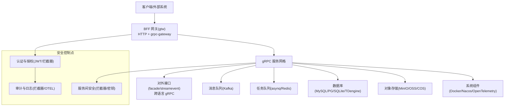
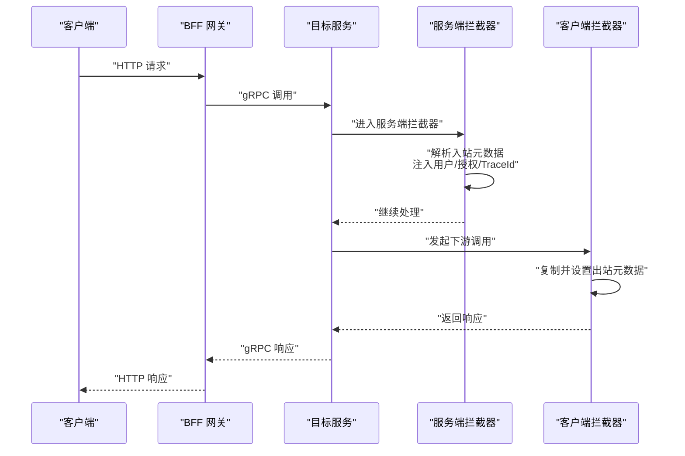
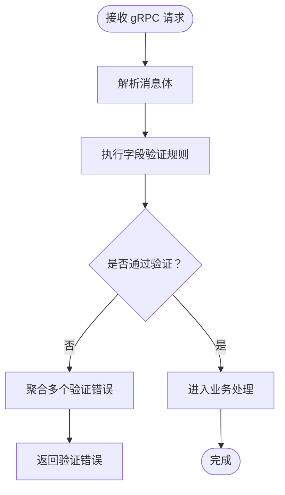
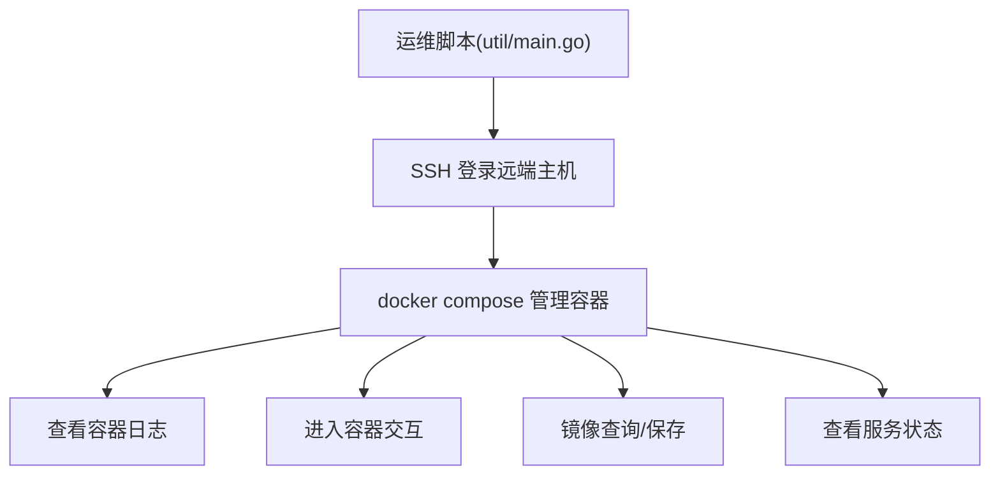
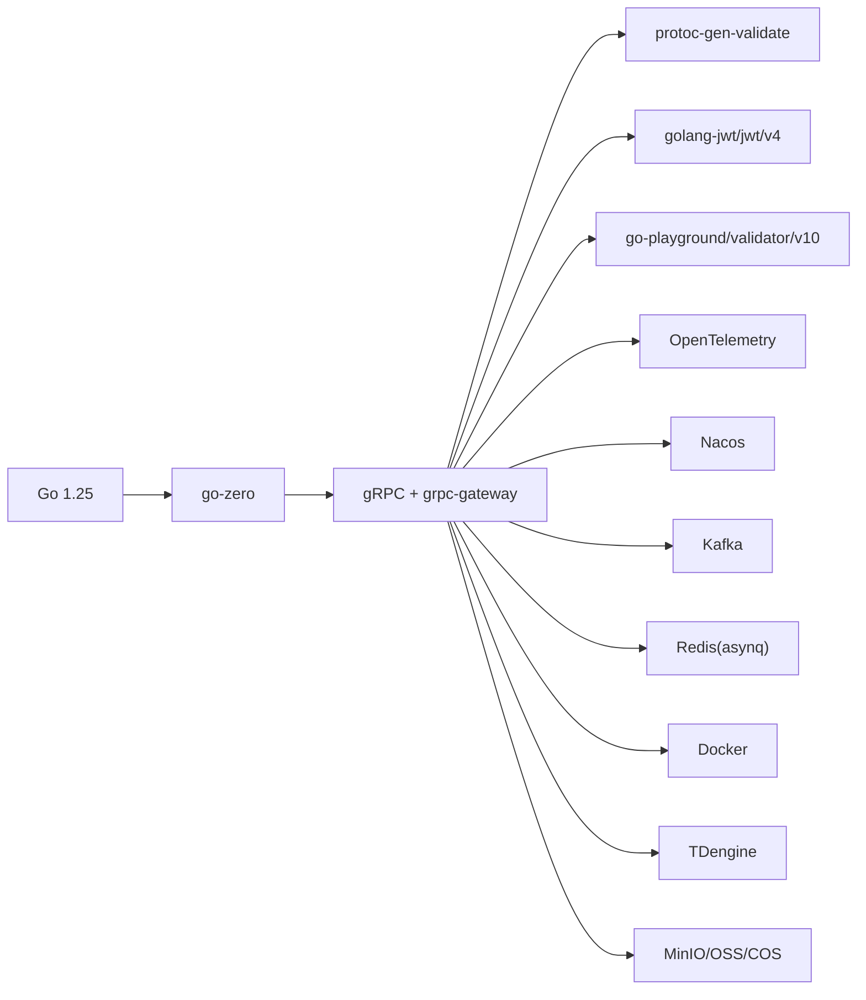

# 漏洞管理与渗透测试

<cite>
**本文引用的文件**
- [README.md](file://README.md)
- [go.mod](file://go.mod)
- [deploy/docker-compose.yml](file://deploy/docker-compose.yml)
- [util/main.go](file://util/main.go)
- [util/manage.sh](file://util/manage.sh)
- [common/Interceptor/rpcserver/loggerInterceptor.go](file://common/Interceptor/rpcserver/loggerInterceptor.go)
- [common/Interceptor/rpcclient/metadataInterceptor.go](file://common/Interceptor/rpcclient/metadataInterceptor.go)
- [socketapp/socketpush/internal/logic/gentokenlogic.go](file://socketapp/socketpush/internal/logic/gentokenlogic.go)
- [.trae/skills/zero-skills/best-practices/overview.md](file://.trae/skills/zero-skills/best-practices/overview.md)
- [facade/streamevent/streamevent/streamevent.pb.validate.go](file://facade/streamevent/streamevent/streamevent.pb.validate.go)
- [app/xfusionmock/xfusionmock/xfusionmock.pb.validate.go](file://app/xfusionmock/xfusionmock/xfusionmock.pb.validate.go)
</cite>

## 目录
1. [简介](#简介)
2. [项目结构](#项目结构)
3. [核心组件](#核心组件)
4. [架构总览](#架构总览)
5. [详细组件分析](#详细组件分析)
6. [依赖分析](#依赖分析)
7. [性能考虑](#性能考虑)
8. [故障排查指南](#故障排查指南)
9. [结论](#结论)
10. [附录](#附录)

## 简介
本文件面向 zero-service 项目，提供一套系统化的漏洞管理与渗透测试安全实践方案。内容覆盖静态代码分析、依赖项扫描、运行时漏洞检测、渗透测试策略、补丁管理流程、安全测试自动化、威胁建模方法、安全度量指标与合规检查、漏洞生命周期管理与应急响应、以及安全工具集成与测试脚本实现。目标是帮助开发与安全部门在持续交付中融入安全左移与深度防御。

## 项目结构
zero-service 是基于 go-zero 的工业级微服务脚手架，围绕 IEC 104 数采、异步任务调度、实时通信、容器管理、地理信息、BFF 网关等能力构建。其服务形态以 gRPC/HTTP 聚合为主，广泛使用 Kafka、Redis、MySQL/PostgreSQL/SQLite、TDengine、MQTT、Docker 等基础设施。

**图表来源**
- [README.md:15-51](file://README.md#L15-L51)
- [README.md:110-188](file://README.md#L110-L188)
- [README.md:189-206](file://README.md#L189-L206)

**章节来源**
- [README.md:15-51](file://README.md#L15-L51)
- [README.md:110-188](file://README.md#L110-L188)
- [README.md:189-206](file://README.md#L189-L206)

## 核心组件
- 微服务与协议栈：gRPC + grpc-gateway + Protocol Buffers；Kafka 消息队列；asynq + Redis 任务队列；SocketIO 实时通信；IEC 60870-5-104 / Modbus / MQTT；Nacos 服务发现；OpenTelemetry/Prometheus/Grafana 监控。
- 关键服务：ieccaller（IEC104 主站）、iecstash（数据合并）、streamevent（流事件协议）、trigger（异步任务调度）、file（文件服务）、gis（地理信息）、alarm（告警）、podengine（容器管理）、bridgemodbus/bridgemqtt/bridgegtw/bridgedump、lalhook/lalproxy/logdump、xfusionmock、mcpserver。
- 网关与对外接口：gtw（BFF 网关，HTTP/gRPC 聚合）、facade/streamevent（跨语言流事件协议）。

**章节来源**
- [README.md:110-188](file://README.md#L110-L188)
- [README.md:189-206](file://README.md#L189-L206)

## 架构总览
零信任边界内的服务网格，通过网关统一入口，内部以 gRPC 为主、HTTP 为辅，结合消息中间件与任务队列实现解耦与弹性。安全控制点贯穿于网关、拦截器、服务间调用链与基础设施。

**图表来源**
- [README.md:189-206](file://README.md#L189-L206)
- [common/Interceptor/rpcserver/loggerInterceptor.go:12-44](file://common/Interceptor/rpcserver/loggerInterceptor.go#L12-L44)
- [common/Interceptor/rpcclient/metadataInterceptor.go:11-32](file://common/Interceptor/rpcclient/metadataInterceptor.go#L11-L32)

**章节来源**
- [README.md:189-206](file://README.md#L189-L206)
- [common/Interceptor/rpcserver/loggerInterceptor.go:12-44](file://common/Interceptor/rpcserver/loggerInterceptor.go#L12-L44)
- [common/Interceptor/rpcclient/metadataInterceptor.go:11-32](file://common/Interceptor/rpcclient/metadataInterceptor.go#L11-L32)

## 详细组件分析

### 组件 A：认证与拦截器（服务间安全与可观测）
- 服务端拦截器：从 gRPC 入站元数据提取用户标识、部门、授权令牌、TraceId，并注入上下文，异常时记录错误日志。
- 客户端拦截器：在出站请求中携带用户标识、部门、授权令牌、TraceId，支持 Unary 与 Stream。
- JWT 生成：在 socketpush 中生成 Token，包含签发时间、过期时间与用户标识，payload 支持扩展字段。

**图表来源**
- [common/Interceptor/rpcserver/loggerInterceptor.go:12-44](file://common/Interceptor/rpcserver/loggerInterceptor.go#L12-L44)
- [common/Interceptor/rpcclient/metadataInterceptor.go:11-32](file://common/Interceptor/rpcclient/metadataInterceptor.go#L11-L32)

**章节来源**
- [common/Interceptor/rpcserver/loggerInterceptor.go:12-44](file://common/Interceptor/rpcserver/loggerInterceptor.go#L12-L44)
- [common/Interceptor/rpcclient/metadataInterceptor.go:11-32](file://common/Interceptor/rpcclient/metadataInterceptor.go#L11-L32)
- [socketapp/socketpush/internal/logic/gentokenlogic.go:57-78](file://socketapp/socketpush/internal/logic/gentokenlogic.go#L57-L78)

### 组件 B：协议与数据验证（输入校验与安全边界）
- streamevent.proto 生成的验证器对消息字段进行约束检查，多错误聚合返回，便于在边界处阻断异常或恶意输入。
- xfusionmock.proto 亦具备验证器，确保测试与仿真场景的数据一致性与安全性。

**图表来源**
- [facade/streamevent/streamevent/streamevent.pb.validate.go:1480-1528](file://facade/streamevent/streamevent/streamevent.pb.validate.go#L1480-L1528)
- [app/xfusionmock/xfusionmock/xfusionmock.pb.validate.go:363-412](file://app/xfusionmock/xfusionmock/xfusionmock.pb.validate.go#L363-L412)

**章节来源**
- [facade/streamevent/streamevent/streamevent.pb.validate.go:1480-1528](file://facade/streamevent/streamevent/streamevent.pb.validate.go#L1480-L1528)
- [app/xfusionmock/xfusionmock/xfusionmock.pb.validate.go:363-412](file://app/xfusionmock/xfusionmock/xfusionmock.pb.validate.go#L363-L412)

### 组件 C：部署与运维（容器与编排）
- docker-compose 定义了 Kafka、Filebeat、ieccaller、bridgegtw、bridgedump、iecstash、kafdrop 等服务，部分服务使用 host 网络模式，需关注端口暴露与主机隔离。
- util/main.go 提供远程运维工具，支持 SSH 登录、容器日志查看、进入容器、镜像保存等操作，便于安全审计与取证。

**图表来源**
- [util/main.go:446-526](file://util/main.go#L446-L526)
- [deploy/docker-compose.yml:1-110](file://deploy/docker-compose.yml#L1-L110)

**章节来源**
- [util/main.go:446-526](file://util/main.go#L446-L526)
- [deploy/docker-compose.yml:1-110](file://deploy/docker-compose.yml#L1-L110)

## 依赖分析
- 语言与框架：Go 1.25+，go-zero，grpc-gateway，Protocol Buffers，OpenTelemetry。
- 协议与中间件：Kafka、asynq/Redis、SocketIO、IEC 104、Modbus、MQTT、Nacos、TDengine、MinIO/OSS/COS、Docker。
- 安全相关依赖：golang-jwt/jwt/v4（JWT），go-playground/validator/v10（验证），envoyproxy/protoc-gen-validate（proto 验证插件）。

**图表来源**
- [go.mod:5-62](file://go.mod#L5-L62)
- [go.mod:64-242](file://go.mod#L64-L242)

**章节来源**
- [go.mod:5-62](file://go.mod#L5-L62)
- [go.mod:64-242](file://go.mod#L64-L242)

## 性能考虑
- 服务间调用链路长、消息吞吐大，建议启用 gRPC 压缩、连接池复用、限流与熔断，避免放大效应。
- Kafka/Redis 集群规模与副本策略直接影响可用性与延迟，需结合 SLA 评估。
- 容器资源限制与 host 网络模式下的端口冲突需谨慎规划，避免资源争用与安全暴露面扩大。

## 故障排查指南
- 日志与追踪：利用服务端拦截器记录错误上下文，结合 OpenTelemetry 追踪链路定位问题。
- 远程运维：通过 util/main.go 的 SSH 登录、日志查看、进入容器、镜像保存等功能快速定位与取证。
- 配置检查：核对 docker-compose 中的端口映射、环境变量与卷挂载，确认 host 网络模式下的安全边界。

**章节来源**
- [common/Interceptor/rpcserver/loggerInterceptor.go:12-44](file://common/Interceptor/rpcserver/loggerInterceptor.go#L12-L44)
- [util/main.go:446-526](file://util/main.go#L446-L526)
- [deploy/docker-compose.yml:1-110](file://deploy/docker-compose.yml#L1-L110)

## 结论
通过将安全控制点前置至拦截器、协议验证与网关层，结合容器化编排与可观测性，zero-service 已具备良好的安全基线。建议在此基础上完善自动化漏洞扫描、渗透测试与补丁管理流程，建立闭环的安全度量与合规检查机制，持续提升整体韧性。

## 附录

### A. 安全实践清单（建议落地）
- 静态代码分析：启用 go vet、ineffassign、misspell、gofmt、gci、revive 等工具；结合 golangci-lint 配置规则。
- 依赖项扫描：使用 govulncheck 或类似工具定期扫描已知漏洞；结合 go.mod/go.sum 审核第三方依赖版本。
- 运行时漏洞检测：在网关与服务端拦截器中增加速率限制、IP 白名单、敏感参数脱敏与异常行为检测。
- 渗透测试：制定测试计划，覆盖 API、gRPC、WebSocket、MQTT 等攻击面；使用 Burp Suite、grpcurl、k6 等工具。
- 补丁管理：建立漏洞识别、修复验证、灰度发布与回滚流程；结合 CI/CD 自动化扫描与阻断。
- 安全测试自动化：在 CI 中集成静态分析、依赖扫描、单元测试、集成测试与安全回归测试。
- 威胁建模：绘制攻击树，识别关键资产与依赖，制定缓解策略（加密传输、最小权限、审计留痕）。
- 安全度量与合规：建立 CVSS 分级、修复时效、漏洞趋势、合规检查清单与审计报告模板。
- 应急响应：明确事件分级、处置流程、沟通机制与事后复盘；定期演练。

### B. 渗透测试策略（示例）
- 测试计划：确定范围（API、gRPC、MQTT、WebSocket）、目标（ieccaller/trigger/file 等）、时间窗与准入条件。
- 攻击向量：未授权访问、参数注入、越权操作、敏感信息泄露、DoS、协议滥用（IEC104/Modbus/MQTT）。
- 风险评估：基于 OWASP Top 10、CVSS 评分与业务影响进行分级。

### C. 补丁管理流程（示例）
- 识别：CI 触发依赖扫描与漏洞扫描，生成工单。
- 修复：选择升级/降级/替代方案，最小化影响面。
- 验证：本地与集成测试，重点验证认证、授权、输入校验与协议兼容性。
- 发布：灰度发布，监控告警与日志，准备回滚预案。
- 跟踪：修复闭环与知识沉淀。

### D. 安全测试自动化（示例）
- CI 集成：在流水线中添加静态分析、依赖扫描、单元测试、集成测试与安全回归。
- 自动化扫描：针对 gRPC/HTTP/MQTT 接口编写自动化测试脚本，覆盖正常与异常路径。
- 回归测试：每次变更触发回归测试，确保安全控制点不被绕过。

### E. 威胁建模方法（示例）
- 攻击树：以“拒绝服务/窃取数据/篡改配置”为目标，分解攻击路径与依赖。
- 威胁识别：识别内部与外部威胁源、攻击媒介（网络/协议/配置）。
- 缓解策略：传输加密、访问控制、输入验证、审计与告警、最小权限与纵深防御。

### F. 安全度量指标与合规检查（示例）
- 指标：漏洞总数与时效、高危漏洞修复率、扫描覆盖率、误报率、告警准确率。
- 合规：遵循 ISO 27001、等保 2.0、GDPR/CCPA 等要求，保留审计日志与证据链。

### G. 漏洞生命周期管理与应急响应（示例）
- 生命周期：识别→评估→修复→验证→发布→监控→复盘。
- 应急响应：事件分类分级、处置团队、沟通渠道、恢复与复盘。

### H. 安全工具集成与测试脚本实现（参考）
- 工具集成：golangci-lint、govulncheck、grpcurl、k6、Burp Suite、OpenTelemetry。
- 测试脚本：基于 util/main.go 的运维脚本思路，扩展安全测试命令（如批量探测、压测、日志分析）。

**章节来源**
- [.trae/skills/zero-skills/best-practices/overview.md:610-669](file://.trae/skills/zero-skills/best-practices/overview.md#L610-L669)
- [util/manage.sh:1-35](file://util/manage.sh#L1-L35)