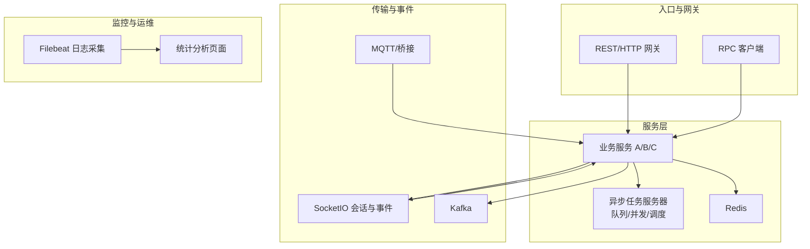
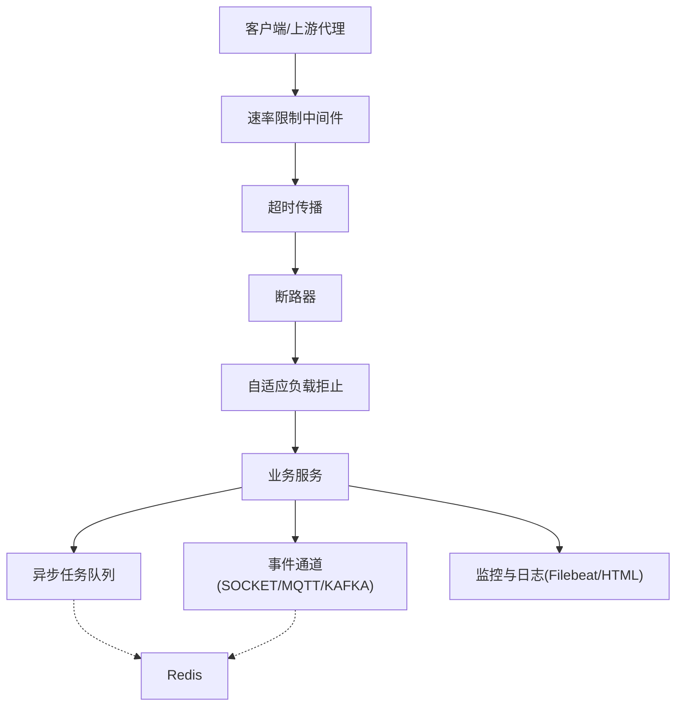
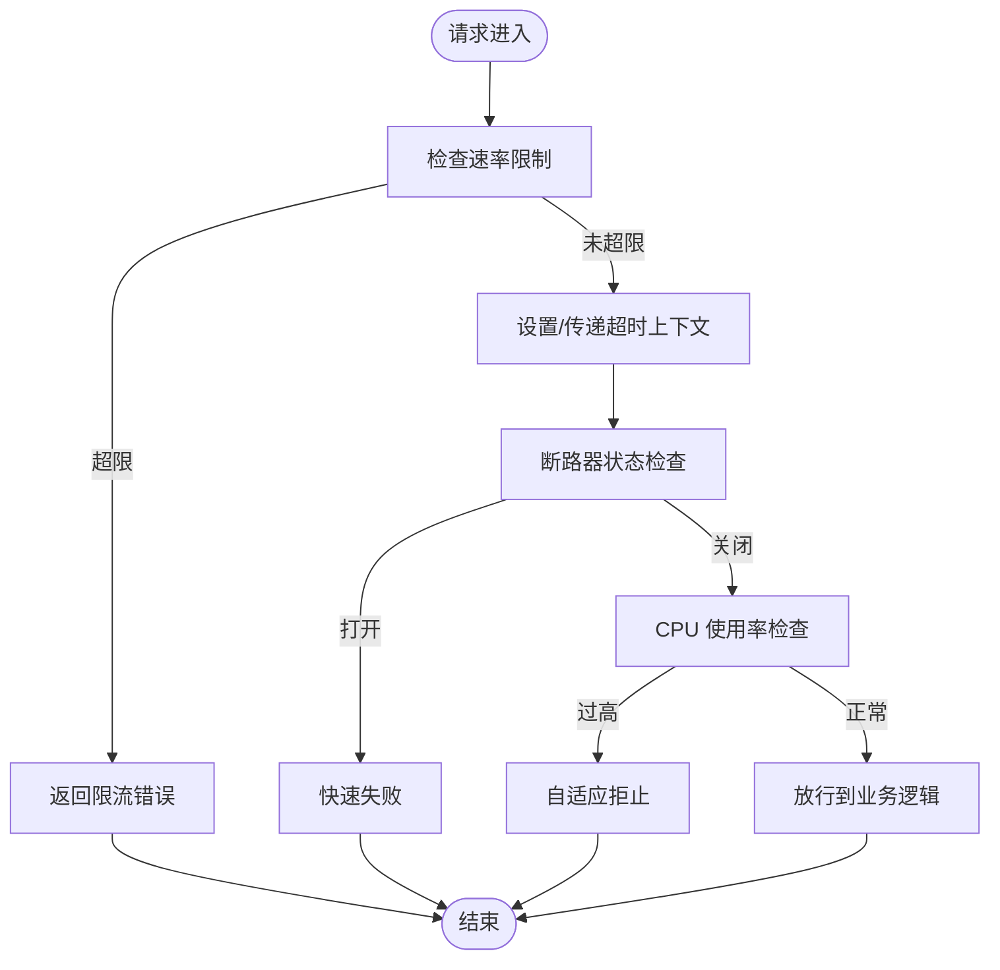
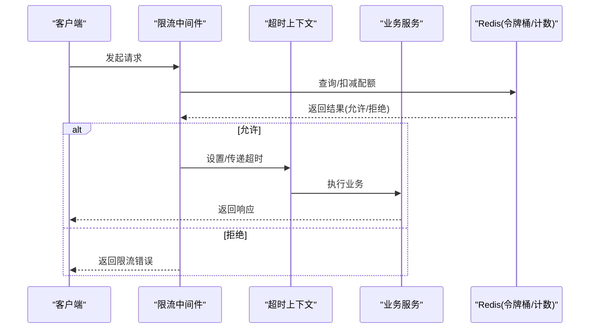
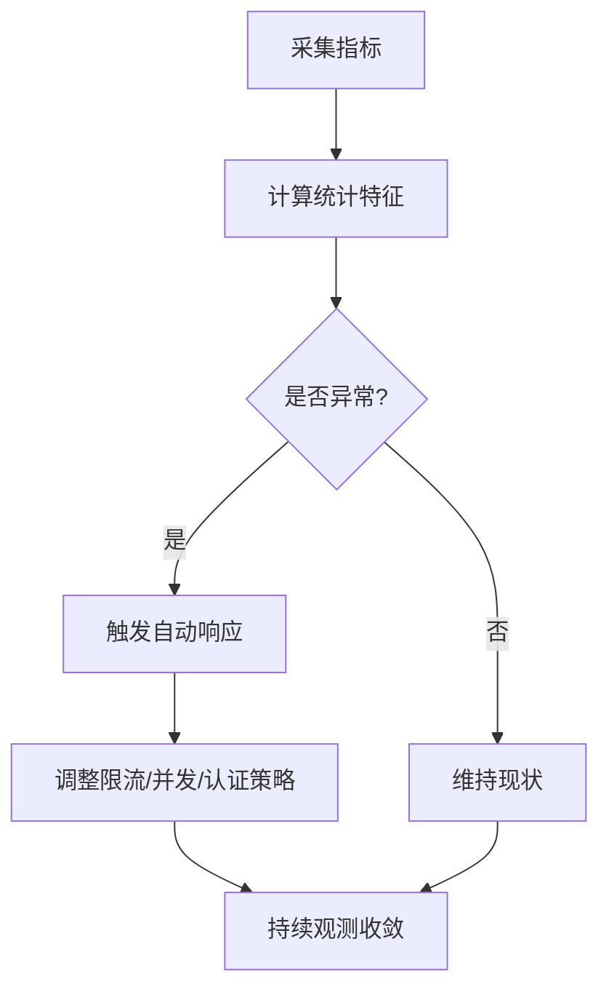
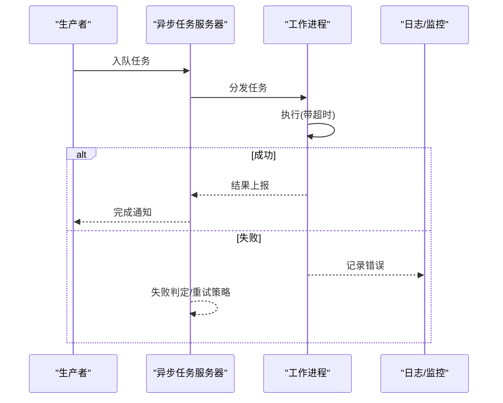
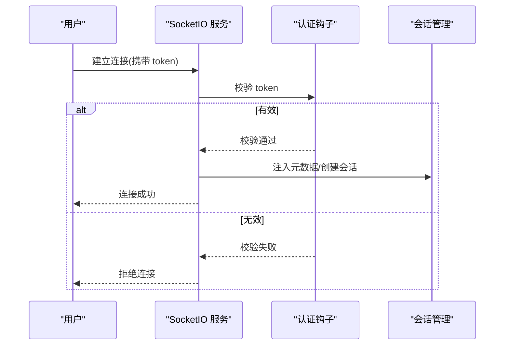
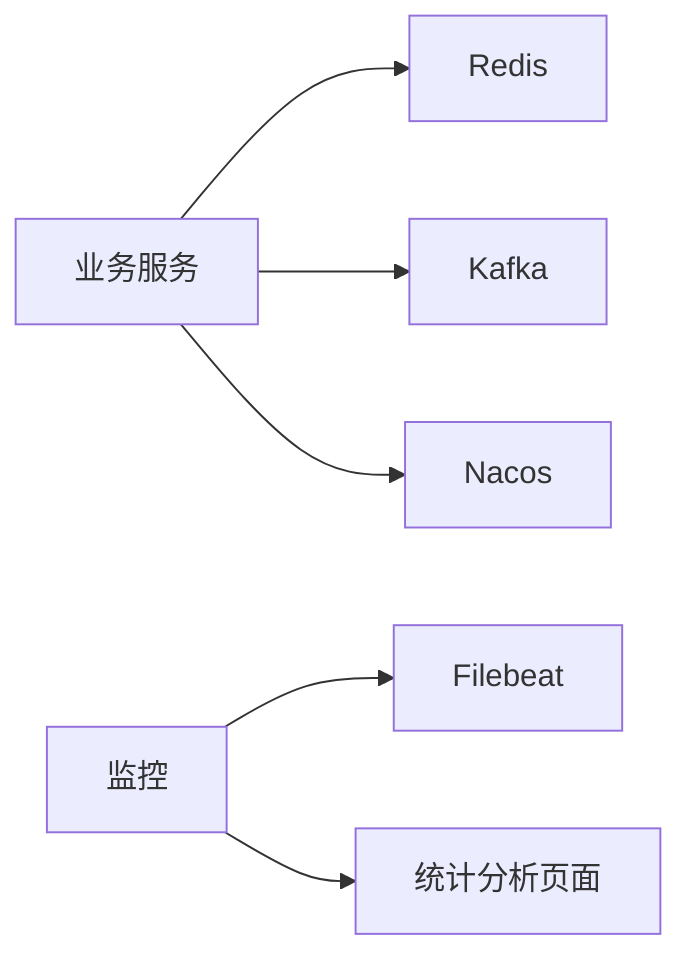

# DDoS 防护机制

<cite>
**本文引用的文件**
- [resilience-patterns.md](file://.trae/skills/zero-skills/references/resilience-patterns.md)
- [asynqClient.go](file://common/asynqx/asynqClient.go)
- [asynqTaskServer.go](file://common/asynqx/asynqTaskServer.go)
- [asynqSchedulerServer.go](file://common/asynqx/asynqSchedulerServer.go)
- [tasktype.go](file://common/asynqx/tasktype.go)
- [socketgtw.proto](file://socketapp/socketgtw/socketgtw/socketgtw.proto)
- [socketgtw.pb.go](file://socketapp/socketgtw/socketgtw/socketgtw.pb.go)
- [socketpush.proto](file://socketapp/socketpush/socketpush.proto)
- [socketpush.pb.go](file://socketapp/socketpush/socketpush.pb.go)
- [server.go](file://common/socketiox/server.go)
- [config.go](file://zerorpc/internal/config/config.go)
- [config.go](file://app/trigger/internal/config/config.go)
- [docker-compose.yml](file://deploy/docker-compose.yml)
- [stat_analyzer.html](file://deploy/stat_analyzer.html)
- [rest-api-patterns.md](file://.trae/skills/zero-skills/references/rest-api-patterns.md)
- [overview.md](file://.trae/skills/zero-skills/best-practices/overview.md)
</cite>

## 目录
1. [引言](#引言)
2. [项目结构](#项目结构)
3. [核心组件](#核心组件)
4. [架构总览](#架构总览)
5. [详细组件分析](#详细组件分析)
6. [依赖分析](#依赖分析)
7. [性能考虑](#性能考虑)
8. [故障排查指南](#故障排查指南)
9. [结论](#结论)
10. [附录](#附录)

## 引言
本文件面向 zero-service 的 DDoS 防护需求，系统化梳理并扩展现有能力，形成“流量清洗策略、速率限制、异常检测、异步任务队列防护、负载均衡与会话安全、缓存层保护、监控告警与应急响应”的综合方案。文档在不直接展示代码的前提下，通过源码路径定位与可视化图示，帮助读者快速理解各模块职责、交互关系与实施要点。

## 项目结构
围绕 DDoS 防护，zero-service 已具备以下关键基础能力：
- 防御纵深：断路器、自适应限流、超时传播、按 CPU 负载主动拒止（load shedding）
- 异步任务：基于 Redis 的异步队列与调度，支持并发与队列优先级
- 事件通道：SocketIO 会话与事件推送，支撑实时通信场景
- 配置与部署：服务配置、Docker Compose 编排、日志采集与可视化分析

图表来源
- [docker-compose.yml:1-110](file://deploy/docker-compose.yml#L1-L110)
- [asynqTaskServer.go:39-64](file://common/asynqx/asynqTaskServer.go#L39-L64)
- [socketgtw.pb.go:924-1110](file://socketapp/socketgtw/socketgtw/socketgtw.pb.go#L924-L1110)
- [socketpush.pb.go:134-177](file://socketapp/socketpush/socketpush.proto#L134-L177)

章节来源
- [docker-compose.yml:1-110](file://deploy/docker-compose.yml#L1-L110)

## 核心组件
- 断路器与自适应限流：go-zero 内建的断路器与多种限流策略，覆盖 RPC、数据库、Redis、HTTP 客户端调用；支持按 IP、用户维度限流，并输出限流头信息。
- 超时传播：服务级、处理器级、操作级多层超时，避免雪崩效应。
- 自适应负载拒止：生产模式下根据 CPU 使用率动态拒绝请求，降低系统过载风险。
- 异步任务队列：基于 Redis 的异步任务服务器，支持并发度、队列优先级、失败判定与日志记录。
- SocketIO 会话与事件：提供认证钩子、会话元数据注入、事件广播等能力，便于构建实时通信场景的安全基座。
- 监控与可视化：Filebeat 收集日志，前端页面解析并展示 CPU、QPS、丢弃数、响应时间等指标。

章节来源
- [resilience-patterns.md:1-690](file://.trae/skills/zero-skills/references/resilience-patterns.md#L1-L690)
- [asynqTaskServer.go:1-87](file://common/asynqx/asynqTaskServer.go#L1-L87)
- [socketgtw.pb.go:1-1130](file://socketapp/socketgtw/socketgtw/socketgtw.pb.go#L1-L1130)
- [socketpush.pb.go:134-177](file://socketapp/socketpush/socketpush.proto#L134-L177)
- [stat_analyzer.html:345-377](file://deploy/stat_analyzer.html#L345-L377)

## 架构总览
下图展示 DDoS 防护在系统中的位置与交互：入口层进行速率限制与超时控制；服务层执行断路器与负载拒止；异步层隔离突发流量；事件层保障会话安全；监控层持续观测与告警。

图表来源
- [resilience-patterns.md:1-690](file://.trae/skills/zero-skills/references/resilience-patterns.md#L1-L690)
- [asynqTaskServer.go:39-64](file://common/asynqx/asynqTaskServer.go#L39-L64)
- [docker-compose.yml:1-110](file://deploy/docker-compose.yml#L1-L110)

## 详细组件分析

### 流量清洗策略
- 异常流量识别：结合速率限制与超时传播，对异常高并发请求进行早期拦截；断路器在后端错误率升高时快速失败，避免级联故障。
- 恶意请求过滤：在网关或路由层引入基于 IP/用户维度的限流与黑名单机制；SocketIO 层可利用认证钩子拒绝无效 token 的连接。
- 正常流量保护：通过自适应负载拒止在 CPU 高占用时主动丢弃请求，保证关键路径可用；异步队列承接突发写入，平滑峰值。

图表来源
- [resilience-patterns.md:158-340](file://.trae/skills/zero-skills/references/resilience-patterns.md#L158-L340)
- [socketgtw.pb.go:924-1110](file://socketapp/socketgtw/socketgtw/socketgtw.pb.go#L924-L1110)

章节来源
- [resilience-patterns.md:158-340](file://.trae/skills/zero-skills/references/resilience-patterns.md#L158-L340)
- [socketgtw.pb.go:924-1110](file://socketapp/socketgtw/socketgtw/socketgtw.pb.go#L924-L1110)

### 速率限制实现
- 请求频率控制：支持按 IP、用户 ID 等键粒度的周期性限流；可输出剩余配额等头部信息，便于客户端自适应退避。
- 连接数限制：在 SocketIO 层通过认证钩子与会话管理控制连接建立；结合服务端并发参数限制瞬时接入压力。
- 并发访问管理：异步任务服务器配置并发度与队列优先级，避免单点过载。

图表来源
- [resilience-patterns.md:158-340](file://.trae/skills/zero-skills/references/resilience-patterns.md#L158-L340)
- [asynqTaskServer.go:39-64](file://common/asynqx/asynqTaskServer.go#L39-L64)

章节来源
- [resilience-patterns.md:158-340](file://.trae/skills/zero-skills/references/resilience-patterns.md#L158-L340)
- [asynqTaskServer.go:39-64](file://common/asynqx/asynqTaskServer.go#L39-L64)

### 异常检测算法
- 流量模式分析：基于历史 QPS、响应时间分位数、CPU 使用率、丢弃数等指标，识别异常波动。
- 攻击行为识别：结合限流触发率、断路器打开次数、队列积压时长等信号，判断是否存在 DDoS 倾向。
- 自动响应机制：当异常阈值被触发，自动提升限流配额收紧策略、临时启用更严格的认证、增加队列优先级或扩大并发以应对突发。

图表来源
- [stat_analyzer.html:862-978](file://deploy/stat_analyzer.html#L862-L978)
- [resilience-patterns.md:621-660](file://.trae/skills/zero-skills/references/resilience-patterns.md#L621-L660)

章节来源
- [stat_analyzer.html:862-978](file://deploy/stat_analyzer.html#L862-L978)
- [resilience-patterns.md:621-660](file://.trae/skills/zero-skills/references/resilience-patterns.md#L621-L660)

### 异步任务队列防护
- 任务积压处理：通过队列优先级与并发度配置，确保关键任务优先执行；对非关键任务降级或延迟处理。
- 超时控制：任务处理函数中使用带超时的上下文，避免阻塞；失败判定统一处理，防止任务堆积。
- 资源保护：限制 Redis 连接池大小与读写超时，避免队列成为瓶颈。

图表来源
- [asynqTaskServer.go:28-87](file://common/asynqx/asynqTaskServer.go#L28-L87)
- [asynqSchedulerServer.go:21-62](file://common/asynqx/asynqSchedulerServer.go#L21-L62)
- [asynqClient.go:17-31](file://common/asynqx/asynqClient.go#L17-L31)
- [tasktype.go:1-9](file://common/asynqx/tasktype.go#L1-L9)

章节来源
- [asynqTaskServer.go:1-87](file://common/asynqx/asynqTaskServer.go#L1-L87)
- [asynqSchedulerServer.go:1-62](file://common/asynqx/asynqSchedulerServer.go#L1-L62)
- [asynqClient.go:1-31](file://common/asynqx/asynqClient.go#L1-L31)
- [tasktype.go:1-9](file://common/asynqx/tasktype.go#L1-L9)

### 负载均衡与会话安全
- 负载均衡：通过服务注册与发现（如 Nacos）实现多实例横向扩展；结合断路器与超时策略，避免热点实例过载。
- 会话管理安全：SocketIO 在连接阶段进行 token 校验与元数据注入，支持按用户/角色维度进行权限控制与限流；连接建立后可限制事件频率与消息大小。

图表来源
- [server.go:337-380](file://common/socketiox/server.go#L337-L380)
- [socketgtw.pb.go:924-1110](file://socketapp/socketgtw/socketgtw/socketgtw.pb.go#L924-L1110)
- [socketpush.pb.go:134-177](file://socketapp/socketpush/socketpush.proto#L134-L177)

章节来源
- [server.go:337-380](file://common/socketiox/server.go#L337-L380)
- [socketgtw.pb.go:924-1110](file://socketapp/socketgtw/socketgtw/socketgtw.pb.go#L924-L1110)
- [socketpush.pb.go:134-177](file://socketapp/socketpush/socketpush.proto#L134-L177)

### 缓存层保护
- 缓存命中率趋势：通过可视化页面观察命中率变化，及时发现缓存穿透或污染。
- 缓存一致性：对热点数据采用短 TTL 与后台刷新策略；对写操作采用先更新数据库再失效缓存的顺序，避免脏读。
- 缓存旁路：在缓存不可用时自动降级直连数据库，配合断路器保护后端。

章节来源
- [stat_analyzer.html:363-377](file://deploy/stat_analyzer.html#L363-L377)
- [config.go:1-25](file://zerorpc/internal/config/config.go#L1-L25)

### 监控告警系统
- 指标采集：CPU 使用率、QPS、丢弃数、响应时间分位数、限流触发数、断路器状态、队列长度等。
- 可视化：前端页面解析日志并绘制趋势图，辅助快速定位异常时段与服务。
- 告警联动：结合限流/断路器/负载拒止阈值，触发自动化处置（如临时收紧限流、扩容实例、切换备用链路）。

章节来源
- [stat_analyzer.html:862-978](file://deploy/stat_analyzer.html#L862-L978)
- [resilience-patterns.md:621-660](file://.trae/skills/zero-skills/references/resilience-patterns.md#L621-L660)

### 攻击溯源分析与应急响应
- 攻击溯源：结合限流日志、断路器事件、SocketIO 连接日志、Kafka 消费进度，回溯攻击路径与峰值时间窗。
- 应急响应：启动临时限流、开启更严格认证、扩大异步队列并发、启用备用缓存节点、切换到只读模式等。

章节来源
- [resilience-patterns.md:621-660](file://.trae/skills/zero-skills/references/resilience-patterns.md#L621-L660)
- [socketgtw.pb.go:924-1110](file://socketapp/socketgtw/socketgtw/socketgtw.pb.go#L924-L1110)

## 依赖分析
- 组件耦合：服务层对 Redis 的依赖主要体现在限流与异步队列；SocketIO 与事件通道相互独立但共享 Redis；监控层依赖日志采集与前端页面。
- 外部依赖：Kafka 用于事件流；Nacos 用于服务注册与发现；Filebeat 用于日志采集。

图表来源
- [docker-compose.yml:1-110](file://deploy/docker-compose.yml#L1-L110)
- [config.go:1-28](file://app/trigger/internal/config/config.go#L1-L28)

章节来源
- [docker-compose.yml:1-110](file://deploy/docker-compose.yml#L1-L110)
- [config.go:1-28](file://app/trigger/internal/config/config.go#L1-L28)

## 性能考虑
- 合理设置超时：服务级超时应大于处理器级超时，避免不必要的等待；对慢查询与外部依赖设置短超时并快速失败。
- 并发与队列：异步任务并发度与队列优先级应与 Redis 连接池大小匹配，避免 IO 竞争导致的尾延迟。
- 缓存策略：热点数据短 TTL、后台刷新；写路径采用最终一致策略，减少锁竞争。
- 观测与回放：通过可视化页面复盘峰值时段的 CPU、QPS、丢弃数与响应时间，指导容量规划与参数调优。

## 故障排查指南
- 限流频繁触发：检查限流配额与键粒度过细；确认是否需要按用户维度限流；查看限流头信息辅助定位。
- 断路器频繁打开：检查下游依赖健康状况；确认是否需要放宽可接受错误类型；关注失败率与延迟。
- 负载拒止：在 CPU 高占用时属正常保护行为；若误拒，适当提高阈值或扩容实例。
- 异步队列积压：检查并发度与队列优先级；确认任务处理耗时与失败重试策略；必要时增加 Redis 连接池。
- SocketIO 连接异常：验证认证钩子逻辑与 token 有效性；检查会话元数据注入与事件广播频率。

章节来源
- [resilience-patterns.md:621-660](file://.trae/skills/zero-skills/references/resilience-patterns.md#L621-L660)
- [asynqTaskServer.go:73-87](file://common/asynqx/asynqTaskServer.go#L73-L87)
- [server.go:337-380](file://common/socketiox/server.go#L337-L380)

## 结论
zero-service 已具备完善的 DDoS 防护基础能力：断路器、限流、超时、负载拒止与异步队列。结合 SocketIO 会话安全、缓存保护与监控可视化，可形成从入口到后端的全链路防护闭环。建议在生产环境中启用自适应负载拒止与分布式限流，配合自动响应与应急流程，持续优化参数与容量，以获得更稳健的抗压表现。

## 附录
- 安全最佳实践：JWT 密钥强度、敏感信息脱敏、错误信息通用化、输入校验与路径清理。
- 中间件模式：鉴权中间件在路由前执行，统一注入用户上下文，便于后续限流与审计。

章节来源
- [overview.md:610-669](file://.trae/skills/zero-skills/best-practices/overview.md#L610-L669)
- [rest-api-patterns.md:197-262](file://.trae/skills/zero-skills/references/rest-api-patterns.md#L197-L262)