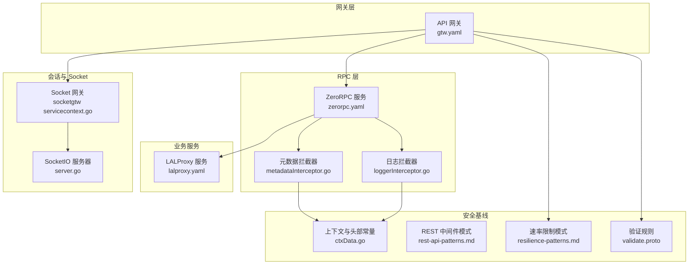
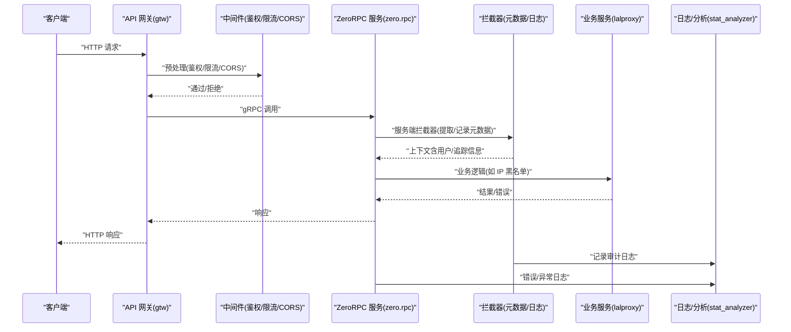
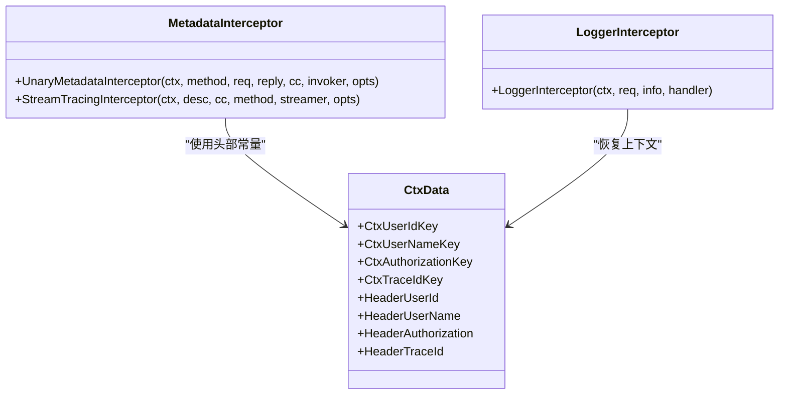
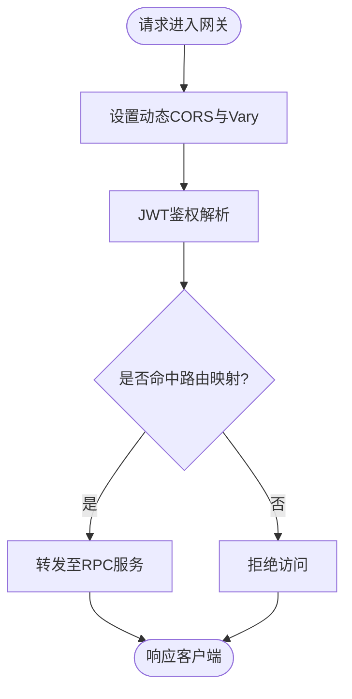
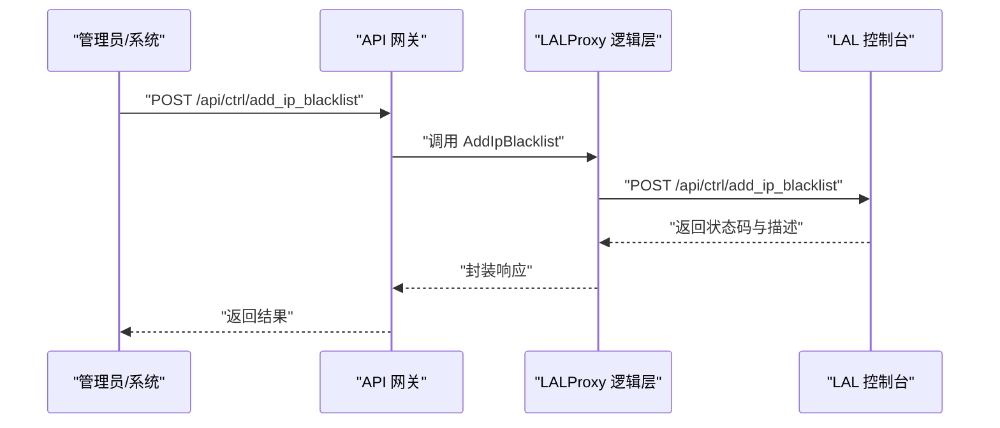
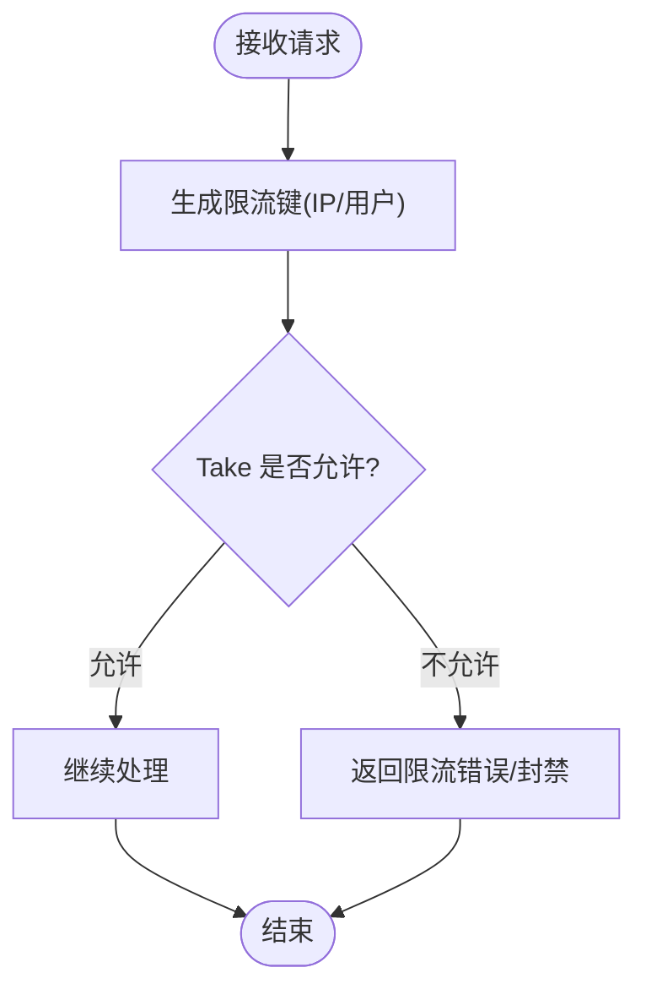
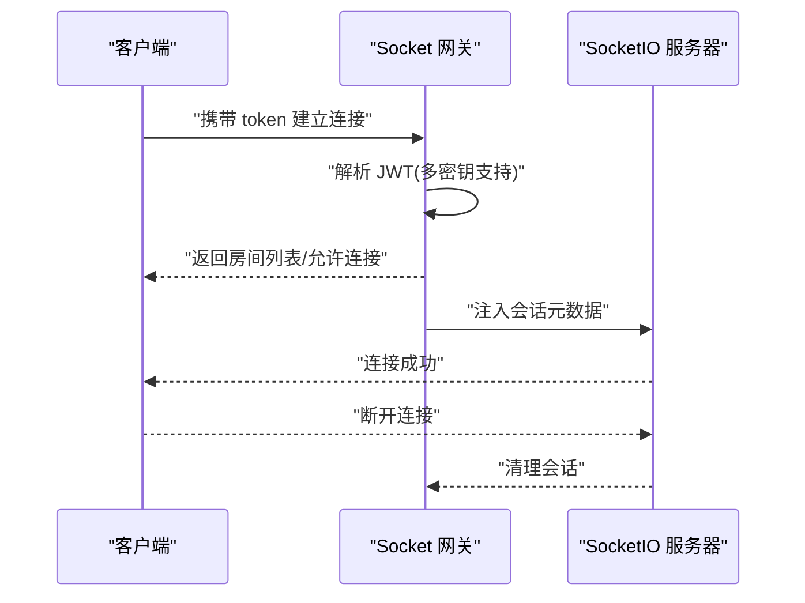
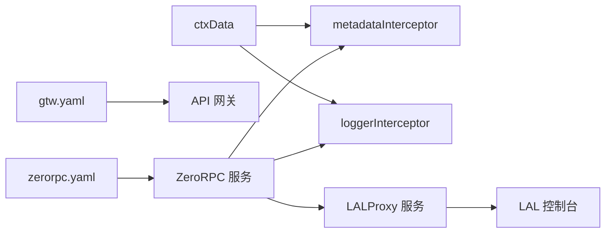

# Web 应用防火墙集成

<cite>
**本文引用的文件**
- [common/Interceptor/rpcclient/metadataInterceptor.go](file://common/Interceptor/rpcclient/metadataInterceptor.go)
- [common/Interceptor/rpcserver/loggerInterceptor.go](file://common/Interceptor/rpcserver/loggerInterceptor.go)
- [common/ctxdata/ctxData.go](file://common/ctxdata/ctxData.go)
- [gtw/etc/gtw.yaml](file://gtw/etc/gtw.yaml)
- [zerorpc/etc/zerorpc.yaml](file://zerorpc/etc/zerorpc.yaml)
- [app/lalproxy/etc/lalproxy.yaml](file://app/lalproxy/etc/lalproxy.yaml)
- [app/lalproxy/internal/logic/addipblacklistlogic.go](file://app/lalproxy/internal/logic/addipblacklistlogic.go)
- [app/lalproxy/lalproxy/lalproxy.pb.go](file://app/lalproxy/lalproxy/lalproxy.pb.go)
- [socketapp/socketgtw/internal/svc/servicecontext.go](file://socketapp/socketgtw/internal/svc/servicecontext.go)
- [common/socketiox/server.go](file://common/socketiox/server.go)
- [deploy/stat_analyzer.html](file://deploy/stat_analyzer.html)
- [.trae/skills/zero-skills/references/rest-api-patterns.md](file://.trae/skills/zero-skills/references/rest-api-patterns.md)
- [.trae/skills/zero-skills/references/resilience-patterns.md](file://.trae/skills/zero-skills/references/resilience-patterns.md)
- [.trae/skills/zero-skills/best-practices/overview.md](file://.trae/skills/zero-skills/best-practices/overview.md)
- [third_party/buf/validate/validate.proto](file://third_party/buf/validate/validate.proto)
</cite>

## 目录
1. [引言](#引言)
2. [项目结构](#项目结构)
3. [核心组件](#核心组件)
4. [架构总览](#架构总览)
5. [详细组件分析](#详细组件分析)
6. [依赖分析](#依赖分析)
7. [性能考虑](#性能考虑)
8. [故障排查指南](#故障排查指南)
9. [结论](#结论)
10. [附录](#附录)

## 引言
本实施文档面向 zero-service 的 Web 应用防火墙（WAF）集成，目标是构建一套可落地的规则化防护体系，覆盖 SQL 注入、XSS、CSRF 等常见威胁，并结合现有中间件与 RPC 拦截器能力，实现异常请求识别、恶意模式匹配与实时阻断。同时，文档提供自动阻断（IP 黑名单、请求频率限制）、API 网关安全控制、路由访问限制、认证授权集成以及日志分析与防护效果评估方案，确保与现有安全体系协同工作。

## 项目结构
围绕 WAF 集成的关键路径与模块如下：
- 网关层：API 网关负责入口流量接入、CORS、鉴权与路由转发
- RPC 层：gRPC 客户端/服务端拦截器负责元数据传递与日志记录
- 业务服务：如 lalproxy 提供 IP 黑名单管理等安全控制能力
- 会话与 Socket：基于 JWT 的连接校验与会话管理
- 安全基线：输入校验、速率限制、最佳实践与验证规则

**图表来源**
- [gtw/etc/gtw.yaml:1-61](file://gtw/etc/gtw.yaml#L1-L61)
- [zerorpc/etc/zerorpc.yaml:1-39](file://zerorpc/etc/zerorpc.yaml#L1-L39)
- [app/lalproxy/etc/lalproxy.yaml:1-19](file://app/lalproxy/etc/lalproxy.yaml#L1-L19)
- [common/Interceptor/rpcclient/metadataInterceptor.go:1-56](file://common/Interceptor/rpcclient/metadataInterceptor.go#L1-L56)
- [common/Interceptor/rpcserver/loggerInterceptor.go:1-45](file://common/Interceptor/rpcserver/loggerInterceptor.go#L1-L45)
- [socketapp/socketgtw/internal/svc/servicecontext.go:59-102](file://socketapp/socketgtw/internal/svc/servicecontext.go#L59-L102)
- [common/socketiox/server.go:337-380](file://common/socketiox/server.go#L337-L380)
- [common/ctxdata/ctxData.go:1-76](file://common/ctxdata/ctxData.go#L1-L76)
- [.trae/skills/zero-skills/references/rest-api-patterns.md:197-262](file://.trae/skills/zero-skills/references/rest-api-patterns.md#L197-L262)
- [.trae/skills/zero-skills/references/resilience-patterns.md:164-294](file://.trae/skills/zero-skills/references/resilience-patterns.md#L164-L294)
- [third_party/buf/validate/validate.proto:3693-3712](file://third_party/buf/validate/validate.proto#L3693-L3712)

**章节来源**
- [gtw/etc/gtw.yaml:1-61](file://gtw/etc/gtw.yaml#L1-L61)
- [zerorpc/etc/zerorpc.yaml:1-39](file://zerorpc/etc/zerorpc.yaml#L1-L39)
- [app/lalproxy/etc/lalproxy.yaml:1-19](file://app/lalproxy/etc/lalproxy.yaml#L1-L19)

## 核心组件
- RPC 元数据拦截器：在 gRPC 客户端/服务端注入与透传用户标识、授权令牌、链路追踪 ID 等关键头部，便于统一鉴权与审计
- 网关与 REST 中间件：通过中间件链实现 CORS、鉴权、速率限制与请求头校验
- 速率限制：基于 Redis 的令牌桶/周期配额实现分布式限流
- 输入验证：利用验证规则与结构体标签进行参数校验
- 会话与 Socket：基于 JWT 的连接校验与会话元数据注入
- IP 黑名单：通过 LALProxy 的 RPC 接口实现对恶意 IP 的封禁与清理

**章节来源**
- [common/Interceptor/rpcclient/metadataInterceptor.go:1-56](file://common/Interceptor/rpcclient/metadataInterceptor.go#L1-L56)
- [common/Interceptor/rpcserver/loggerInterceptor.go:1-45](file://common/Interceptor/rpcserver/loggerInterceptor.go#L1-L45)
- [.trae/skills/zero-skills/references/rest-api-patterns.md:197-262](file://.trae/skills/zero-skills/references/rest-api-patterns.md#L197-L262)
- [.trae/skills/zero-skills/references/resilience-patterns.md:164-294](file://.trae/skills/zero-skills/references/resilience-patterns.md#L164-L294)
- [third_party/buf/validate/validate.proto:3693-3712](file://third_party/buf/validate/validate.proto#L3693-L3712)
- [common/socketiox/server.go:337-380](file://common/socketiox/server.go#L337-L380)
- [socketapp/socketgtw/internal/svc/servicecontext.go:59-102](file://socketapp/socketgtw/internal/svc/servicecontext.go#L59-L102)

## 架构总览
WAF 集成采用“网关前置 + RPC 中间件 + 业务侧联动”的分层防护架构。请求从 API 网关进入，经过鉴权与速率限制后，进入 RPC 服务链路；在 RPC 层通过拦截器完成元数据透传与日志记录；业务服务根据需要执行 IP 黑名单封禁与会话校验；最终输出统一的安全日志与指标，支撑日志分析与效果评估。

**图表来源**
- [gtw/etc/gtw.yaml:1-61](file://gtw/etc/gtw.yaml#L1-L61)
- [zerorpc/etc/zerorpc.yaml:1-39](file://zerorpc/etc/zerorpc.yaml#L1-L39)
- [common/Interceptor/rpcserver/loggerInterceptor.go:1-45](file://common/Interceptor/rpcserver/loggerInterceptor.go#L1-L45)
- [app/lalproxy/etc/lalproxy.yaml:1-19](file://app/lalproxy/etc/lalproxy.yaml#L1-L19)
- [deploy/stat_analyzer.html:1-800](file://deploy/stat_analyzer.html#L1-L800)

## 详细组件分析

### 组件一：RPC 拦截器与请求头验证
- 客户端拦截器：在出站请求中注入用户 ID、用户名、部门编码、授权令牌、追踪 ID 等头部，确保下游服务可获取上下文信息
- 服务端拦截器：从入站元数据恢复上下文，记录错误并统一输出日志，便于审计与追踪

**图表来源**
- [common/Interceptor/rpcclient/metadataInterceptor.go:1-56](file://common/Interceptor/rpcclient/metadataInterceptor.go#L1-L56)
- [common/Interceptor/rpcserver/loggerInterceptor.go:1-45](file://common/Interceptor/rpcserver/loggerInterceptor.go#L1-L45)
- [common/ctxdata/ctxData.go:1-76](file://common/ctxdata/ctxData.go#L1-L76)

**章节来源**
- [common/Interceptor/rpcclient/metadataInterceptor.go:1-56](file://common/Interceptor/rpcclient/metadataInterceptor.go#L1-L56)
- [common/Interceptor/rpcserver/loggerInterceptor.go:1-45](file://common/Interceptor/rpcserver/loggerInterceptor.go#L1-L45)
- [common/ctxdata/ctxData.go:1-76](file://common/ctxdata/ctxData.go#L1-L76)

### 组件二：API 网关安全控制与路由访问限制
- CORS：动态设置允许源、暴露必要头部、避免缓存污染
- 认证授权：通过 JWT 密钥配置与解析，实现路由级鉴权
- 路由映射：明确暴露路径与 RPC 方法映射，减少攻击面

**图表来源**
- [gtw/etc/gtw.yaml:51-56](file://gtw/etc/gtw.yaml#L51-L56)
- [zerorpc/etc/zerorpc.yaml:33-35](file://zerorpc/etc/zerorpc.yaml#L33-L35)

**章节来源**
- [gtw/etc/gtw.yaml:1-61](file://gtw/etc/gtw.yaml#L1-L61)
- [zerorpc/etc/zerorpc.yaml:1-39](file://zerorpc/etc/zerorpc.yaml#L1-L39)

### 组件三：自动阻断与 IP 黑名单管理
- IP 黑名单接口：提供添加黑名单的 RPC 接口与逻辑实现，支持 IP 地址格式校验与过期时间控制
- 与 LALProxy 集成：通过 HTTP API 调用 LAL 控制台接口，实现对 HLS 协议的 IP 封禁

**图表来源**
- [app/lalproxy/internal/logic/addipblacklistlogic.go:31-89](file://app/lalproxy/internal/logic/addipblacklistlogic.go#L31-L89)
- [app/lalproxy/lalproxy/lalproxy.pb.go:1660-1702](file://app/lalproxy/lalproxy/lalproxy.pb.go#L1660-L1702)
- [app/lalproxy/etc/lalproxy.yaml:1-19](file://app/lalproxy/etc/lalproxy.yaml#L1-L19)

**章节来源**
- [app/lalproxy/internal/logic/addipblacklistlogic.go:1-89](file://app/lalproxy/internal/logic/addipblacklistlogic.go#L1-L89)
- [app/lalproxy/lalproxy/lalproxy.pb.go:1660-1702](file://app/lalproxy/lalproxy/lalproxy.pb.go#L1660-L1702)

### 组件四：请求频率限制与实时阻断策略
- 令牌桶/周期配额：基于 Redis 的分布式限流，支持按 IP/用户维度限流
- 中间件模式：在 REST 中间件链中加入限流逻辑，超配额直接拒绝并返回限流头
- 实时阻断：结合 IP 黑名单与限流阈值，实现对异常流量的快速封禁

**图表来源**
- [.trae/skills/zero-skills/references/resilience-patterns.md:164-294](file://.trae/skills/zero-skills/references/resilience-patterns.md#L164-L294)

**章节来源**
- [.trae/skills/zero-skills/references/resilience-patterns.md:164-294](file://.trae/skills/zero-skills/references/resilience-patterns.md#L164-L294)

### 组件五：威胁检测与规则配置
- SQL 注入防护：通过输入验证与参数绑定，避免直接拼接 SQL；对敏感字段进行白名单过滤
- XSS 攻击阻止：对输入输出进行 HTML 转义与内容安全策略（CSP）配合
- CSRF 保护：启用 SameSite Cookie、CSRF Token 校验与来源校验
- 恶意模式匹配：基于正则表达式与关键词库对请求路径、参数、头部进行匹配
- 实时阻断策略：触发阈值后立即封禁 IP 或临时拉黑路径

**章节来源**
- [.trae/skills/zero-skills/best-practices/overview.md:546-608](file://.trae/skills/zero-skills/best-practices/overview.md#L546-L608)
- [.trae/skills/zero-skills/best-practices/overview.md:610-669](file://.trae/skills/zero-skills/best-practices/overview.md#L610-L669)
- [third_party/buf/validate/validate.proto:3693-3712](file://third_party/buf/validate/validate.proto#L3693-L3712)

### 组件六：会话劫持防护与 Socket 鉴权
- JWT 校验：Socket 网关与 SocketIO 服务器均对连接令牌进行校验，注入会话元数据
- 会话生命周期：建立连接时下发房间列表，断开时清理会话，防止会话泄露

**图表来源**
- [socketapp/socketgtw/internal/svc/servicecontext.go:59-102](file://socketapp/socketgtw/internal/svc/servicecontext.go#L59-L102)
- [common/socketiox/server.go:337-380](file://common/socketiox/server.go#L337-L380)

**章节来源**
- [socketapp/socketgtw/internal/svc/servicecontext.go:59-102](file://socketapp/socketgtw/internal/svc/servicecontext.go#L59-L102)
- [common/socketiox/server.go:337-380](file://common/socketiox/server.go#L337-L380)

## 依赖分析
- 组件耦合：RPC 拦截器依赖上下文与头部常量；网关依赖 JWT 配置；LALProxy 依赖外部 LAL 控制台
- 外部依赖：Redis（限流）、LAL 控制台（封禁）、OpenTelemetry（追踪，可选）
- 潜在风险：跨服务追踪头缺失可能导致审计不完整；令牌密钥轮换需同步更新

**图表来源**
- [common/ctxdata/ctxData.go:1-76](file://common/ctxdata/ctxData.go#L1-L76)
- [common/Interceptor/rpcclient/metadataInterceptor.go:1-56](file://common/Interceptor/rpcclient/metadataInterceptor.go#L1-L56)
- [common/Interceptor/rpcserver/loggerInterceptor.go:1-45](file://common/Interceptor/rpcserver/loggerInterceptor.go#L1-L45)
- [gtw/etc/gtw.yaml:1-61](file://gtw/etc/gtw.yaml#L1-L61)
- [zerorpc/etc/zerorpc.yaml:1-39](file://zerorpc/etc/zerorpc.yaml#L1-L39)
- [app/lalproxy/etc/lalproxy.yaml:1-19](file://app/lalproxy/etc/lalproxy.yaml#L1-L19)

**章节来源**
- [common/ctxdata/ctxData.go:1-76](file://common/ctxdata/ctxData.go#L1-L76)
- [gtw/etc/gtw.yaml:1-61](file://gtw/etc/gtw.yaml#L1-L61)
- [zerorpc/etc/zerorpc.yaml:1-39](file://zerorpc/etc/zerorpc.yaml#L1-L39)
- [app/lalproxy/etc/lalproxy.yaml:1-19](file://app/lalproxy/etc/lalproxy.yaml#L1-L19)

## 性能考虑
- 限流成本：Redis 访问与原子操作带来网络与 CPU 开销，建议合理设置配额与窗口
- 中间件链长度：过多中间件会增加延迟，建议按需启用与顺序优化
- 日志落盘：审计日志建议异步写入，避免阻塞主流程
- 缓存命中：对热点键进行缓存，降低限流与鉴权的重复计算

## 故障排查指南
- 鉴权失败：检查 JWT 密钥配置与令牌格式；确认服务端拦截器已正确恢复上下文
- 限流异常：核对 Redis 连接与键空间命名；检查周期/配额设置是否合理
- IP 封禁无效：确认 LAL 控制台可达且接口参数正确；检查响应状态码与描述
- 日志缺失：检查拦截器错误输出与日志级别；确认 stat_analyzer 已接入相应日志源

**章节来源**
- [common/Interceptor/rpcserver/loggerInterceptor.go:40-43](file://common/Interceptor/rpcserver/loggerInterceptor.go#L40-L43)
- [app/lalproxy/internal/logic/addipblacklistlogic.go:54-89](file://app/lalproxy/internal/logic/addipblacklistlogic.go#L54-L89)
- [deploy/stat_analyzer.html:1-800](file://deploy/stat_analyzer.html#L1-L800)

## 结论
通过在网关层引入鉴权与限流、在 RPC 层部署元数据与日志拦截器、在业务层联动 IP 黑名单与 Socket 鉴权，zero-service 可形成完整的 WAF 防护闭环。结合验证规则与最佳实践，能够有效抵御 SQL 注入、XSS、CSRF 等常见威胁，并通过日志分析持续评估防护效果，实现安全与性能的平衡。

## 附录
- 配置要点清单
  - 网关：开启 CORS、配置 JWT 密钥、定义路由映射
  - RPC：启用元数据与日志拦截器、配置 Redis 限流
  - 业务：实现 IP 黑名单接口、完善输入验证与错误处理
  - 日志：接入 stat_analyzer，定期生成攻击统计与防护报告