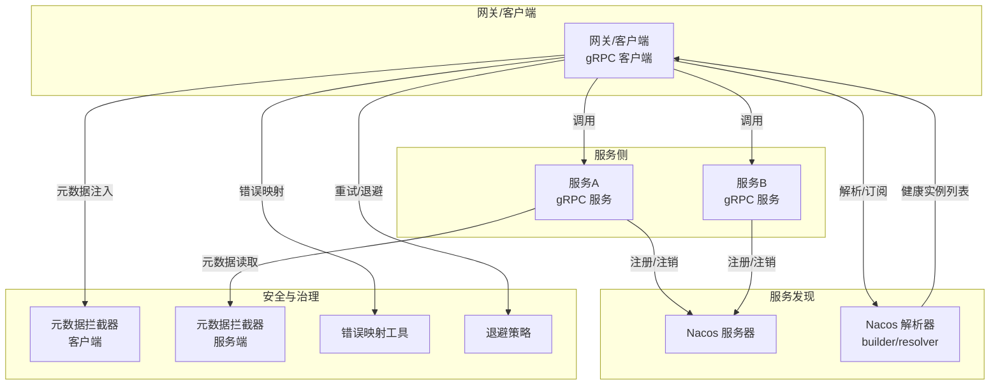
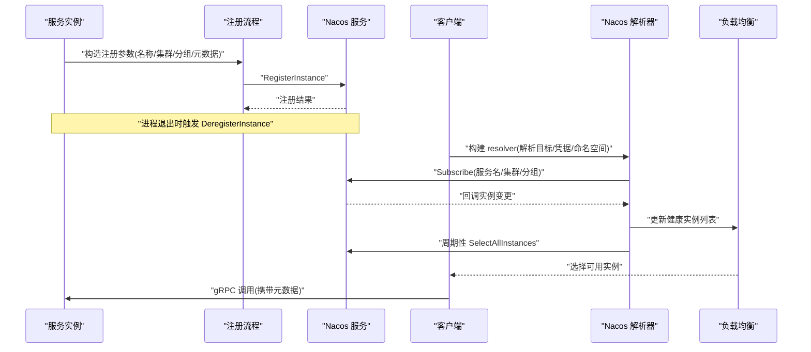
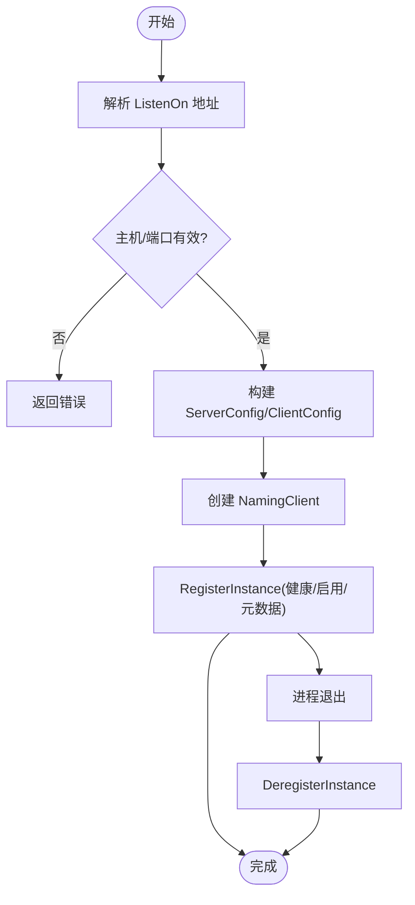
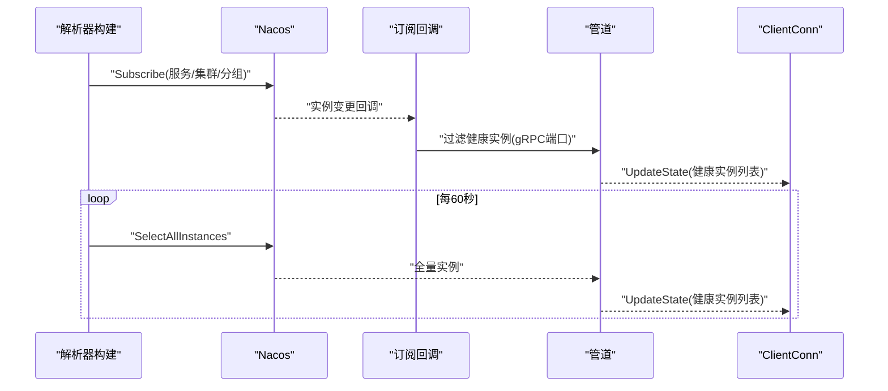
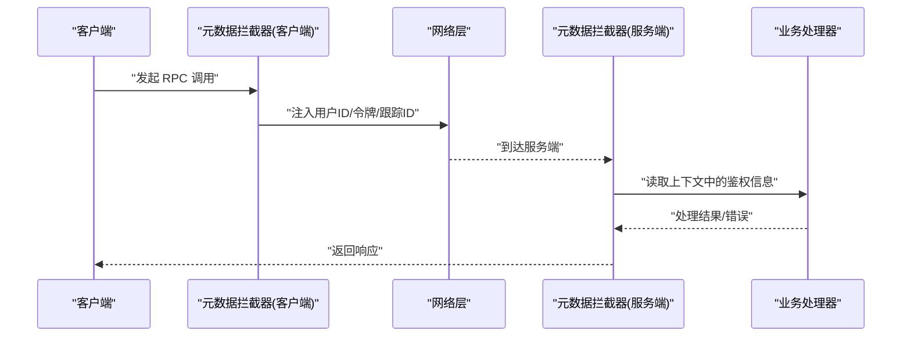
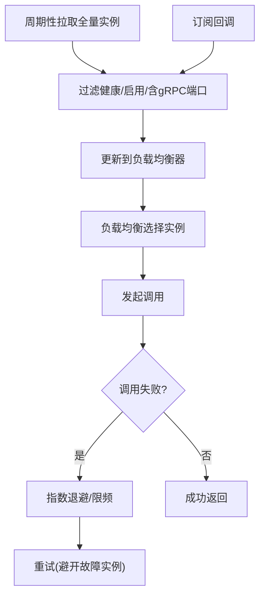
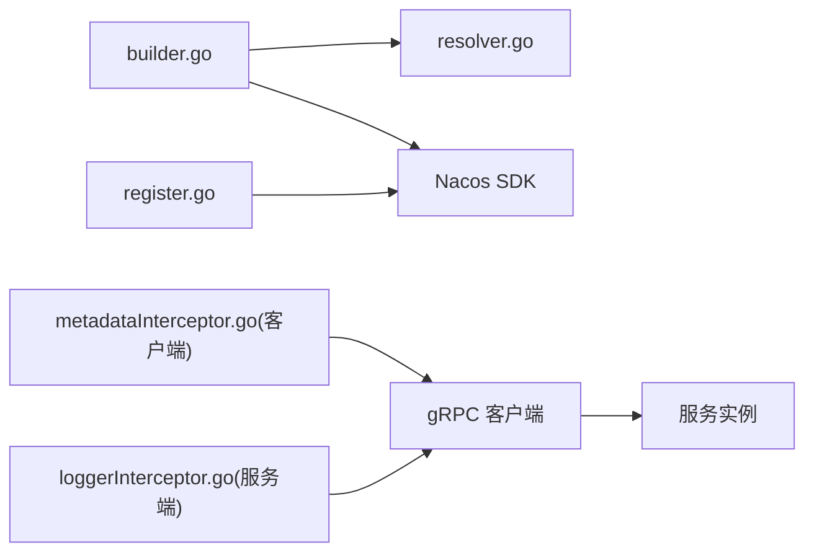

# 服务发现安全

<cite>
**本文引用的文件**
- [common/nacosx/config.go](file://common/nacosx/config.go)
- [common/nacosx/register.go](file://common/nacosx/register.go)
- [common/nacosx/resolver.go](file://common/nacosx/resolver.go)
- [common/nacosx/builder.go](file://common/nacosx/builder.go)
- [common/nacosx/options.go](file://common/nacosx/options.go)
- [common/Interceptor/rpcclient/metadataInterceptor.go](file://common/Interceptor/rpcclient/metadataInterceptor.go)
- [common/Interceptor/rpcserver/loggerInterceptor.go](file://common/Interceptor/rpcserver/loggerInterceptor.go)
- [common/tool/errorutil.go](file://common/tool/errorutil.go)
- [common/tool/backoff.go](file://common/tool/backoff.go)
- [app/bridgegtw/etc/bridgegtw.yaml](file://app/bridgegtw/etc/bridgegtw.yaml)
- [zerorpc/etc/zerorpc.yaml](file://zerorpc/etc/zerorpc.yaml)
</cite>

## 目录
1. [引言](#引言)
2. [项目结构](#项目结构)
3. [核心组件](#核心组件)
4. [架构总览](#架构总览)
5. [详细组件分析](#详细组件分析)
6. [依赖分析](#依赖分析)
7. [性能考虑](#性能考虑)
8. [故障排查指南](#故障排查指南)
9. [结论](#结论)
10. [附录](#附录)

## 引言
本专项文档聚焦 zero-service 的服务发现安全，围绕 Nacos 注册与解析的安全机制展开，系统性阐述服务注册认证、访问控制与权限管理；服务认证机制（客户端身份验证、服务端证书管理、双向 TLS 验证）；健康检查保护（心跳检测安全、异常节点隔离与故障转移）；服务解析安全（DNS 解析保护、目标地址验证、连接池安全）；以及服务间通信加密、消息签名验证与数据完整性保护。同时覆盖服务发现监控、异常行为检测与安全审计，并给出安全配置要点、漏洞防护建议与应急响应策略。

## 项目结构
本项目采用多模块微服务架构，服务通过统一网关或直接 gRPC 客户端消费，Nacos 作为服务注册与发现中心。与服务发现安全直接相关的代码集中在 nacosx 包中，拦截器与工具类提供元数据传递、日志与错误映射能力，应用配置文件承载运行参数与安全开关。

图表来源
- [common/nacosx/builder.go:29-112](file://common/nacosx/builder.go#L29-L112)
- [common/nacosx/resolver.go:47-66](file://common/nacosx/resolver.go#L47-L66)
- [common/nacosx/register.go:21-76](file://common/nacosx/register.go#L21-L76)
- [common/Interceptor/rpcclient/metadataInterceptor.go:11-32](file://common/Interceptor/rpcclient/metadataInterceptor.go#L11-L32)
- [common/Interceptor/rpcserver/loggerInterceptor.go:12-44](file://common/Interceptor/rpcserver/loggerInterceptor.go#L12-L44)
- [common/tool/errorutil.go:12-59](file://common/tool/errorutil.go#L12-L59)
- [common/tool/backoff.go:9-40](file://common/tool/backoff.go#L9-L40)

章节来源
- [common/nacosx/builder.go:18-118](file://common/nacosx/builder.go#L18-L118)
- [common/nacosx/resolver.go:1-74](file://common/nacosx/resolver.go#L1-L74)
- [common/nacosx/register.go:1-99](file://common/nacosx/register.go#L1-L99)
- [common/Interceptor/rpcclient/metadataInterceptor.go:1-56](file://common/Interceptor/rpcclient/metadataInterceptor.go#L1-L56)
- [common/Interceptor/rpcserver/loggerInterceptor.go:1-45](file://common/Interceptor/rpcserver/loggerInterceptor.go#L1-L45)
- [common/tool/errorutil.go:1-91](file://common/tool/errorutil.go#L1-L91)
- [common/tool/backoff.go:1-41](file://common/tool/backoff.go#L1-L41)

## 核心组件
- Nacos 注册与注销：服务启动时向 Nacos 注册自身元数据，进程退出时自动反注册，确保注册表一致性。
- Nacos 解析器与订阅：基于 gRPC resolver 构建器，按服务名、集群、分组订阅实例变更，周期性拉取全量健康实例，输出到负载均衡器。
- 元数据拦截器：在 gRPC 请求上下文中注入用户标识、授权令牌、跟踪 ID 等，便于服务端鉴权与审计。
- 错误映射工具：将业务错误码映射为标准 HTTP/GRPC 错误，辅助安全事件识别与告警。
- 退避策略：对失败触发进行指数退避与上限控制，缓解雪崩与重试风暴风险。

章节来源
- [common/nacosx/register.go:21-76](file://common/nacosx/register.go#L21-L76)
- [common/nacosx/builder.go:29-112](file://common/nacosx/builder.go#L29-L112)
- [common/Interceptor/rpcclient/metadataInterceptor.go:11-32](file://common/Interceptor/rpcclient/metadataInterceptor.go#L11-L32)
- [common/tool/errorutil.go:12-59](file://common/tool/errorutil.go#L12-L59)
- [common/tool/backoff.go:9-40](file://common/tool/backoff.go#L9-L40)

## 架构总览
下图展示从服务注册到客户端解析、调用与安全治理的关键路径。

图表来源
- [common/nacosx/register.go:21-76](file://common/nacosx/register.go#L21-L76)
- [common/nacosx/builder.go:29-112](file://common/nacosx/builder.go#L29-L112)
- [common/nacosx/resolver.go:38-66](file://common/nacosx/resolver.go#L38-L66)
- [common/Interceptor/rpcclient/metadataInterceptor.go:11-32](file://common/Interceptor/rpcclient/metadataInterceptor.go#L11-L32)

## 详细组件分析

### Nacos 注册与注销安全
- 注册参数校验与健壮性：解析监听地址，提取 IP 与端口，支持环境变量与内网 IP 自动推断，避免绑定到不可达地址。
- 健康与启用标记：注册时设置健康与启用标志，结合解析器仅接受健康实例，降低异常节点影响。
- 自动反注册：通过进程关闭钩子执行反注册，防止僵尸实例污染注册表。
- 日志与可观测性：初始化 Nacos SDK 日志，便于定位注册/订阅问题。

图表来源
- [common/nacosx/register.go:21-76](file://common/nacosx/register.go#L21-L76)
- [common/nacosx/config.go:15-37](file://common/nacosx/config.go#L15-L37)

章节来源
- [common/nacosx/register.go:21-76](file://common/nacosx/register.go#L21-L76)
- [common/nacosx/options.go:10-41](file://common/nacosx/options.go#L10-L41)
- [common/nacosx/config.go:15-37](file://common/nacosx/config.go#L15-L37)

### Nacos 解析器与订阅安全
- 目标解析与凭据注入：从 URL 中解析服务名、集群、分组、命名空间、用户名/密码、超时等，支持缓存目录、日志目录与级别。
- 订阅与回调：订阅指定服务的实例变更，回调中过滤非健康/禁用实例，仅保留 gRPC 端口可用的实例。
- 周期性拉取：每分钟轮询全量实例，保证在回调缺失或网络抖动时仍能刷新健康实例列表。
- 实例去重与排序：将实例地址集合化并按字符串排序，避免负载均衡器重复更新相同列表。

图表来源
- [common/nacosx/builder.go:75-112](file://common/nacosx/builder.go#L75-L112)
- [common/nacosx/resolver.go:38-66](file://common/nacosx/resolver.go#L38-L66)
- [common/nacosx/builder.go:120-138](file://common/nacosx/builder.go#L120-L138)

章节来源
- [common/nacosx/builder.go:29-112](file://common/nacosx/builder.go#L29-L112)
- [common/nacosx/resolver.go:13-74](file://common/nacosx/resolver.go#L13-L74)

### 服务认证与访问控制
- 客户端身份验证：通过元数据拦截器将用户 ID、用户名、部门编码、授权令牌、跟踪 ID 注入 gRPC 上下文，服务端可据此进行鉴权与审计。
- 服务端鉴权与审计：服务端拦截器从请求元数据读取上述字段，写入上下文，便于业务逻辑与日志记录。
- 访问控制与权限管理：建议在服务端实现基于授权令牌的鉴权中间件，结合用户角色与资源权限进行细粒度控制。

图表来源
- [common/Interceptor/rpcclient/metadataInterceptor.go:11-32](file://common/Interceptor/rpcclient/metadataInterceptor.go#L11-L32)
- [common/Interceptor/rpcserver/loggerInterceptor.go:12-44](file://common/Interceptor/rpcserver/loggerInterceptor.go#L12-L44)

章节来源
- [common/Interceptor/rpcclient/metadataInterceptor.go:11-32](file://common/Interceptor/rpcclient/metadataInterceptor.go#L11-L32)
- [common/Interceptor/rpcserver/loggerInterceptor.go:12-44](file://common/Interceptor/rpcserver/loggerInterceptor.go#L12-L44)

### 健康检查保护与故障转移
- 健康实例筛选：解析器回调阶段仅保留健康且启用、具备 gRPC 端口的实例，避免将异常节点纳入流量。
- 周期性刷新：定时轮询全量实例，提升在网络分区或回调丢失场景下的恢复能力。
- 故障转移与退避：客户端侧结合退避策略与重试机制，避免对故障实例持续重试导致级联故障。

图表来源
- [common/nacosx/builder.go:87-109](file://common/nacosx/builder.go#L87-L109)
- [common/nacosx/resolver.go:120-138](file://common/nacosx/resolver.go#L120-L138)
- [common/tool/backoff.go:9-40](file://common/tool/backoff.go#L9-L40)

章节来源
- [common/nacosx/builder.go:87-109](file://common/nacosx/builder.go#L87-L109)
- [common/nacosx/resolver.go:120-138](file://common/nacosx/resolver.go#L120-L138)
- [common/tool/backoff.go:9-40](file://common/tool/backoff.go#L9-L40)

### 服务解析安全与目标地址验证
- DNS 解析保护：解析器基于 Nacos 返回的实例地址列表，不依赖外部 DNS；地址来源于注册时上报的 IP 与 gRPC 端口。
- 目标地址验证：仅接受具备 gRPC 端口且健康启用的实例；地址集合化与排序，避免重复与顺序抖动。
- 连接池安全：建议在 gRPC 客户端侧配置合理的连接池大小、超时与重试策略，配合解析器的健康实例列表，减少对异常节点的连接尝试。

章节来源
- [common/nacosx/resolver.go:47-66](file://common/nacosx/resolver.go#L47-L66)
- [common/nacosx/builder.go:120-138](file://common/nacosx/builder.go#L120-L138)

### 服务间通信加密、消息签名与数据完整性
- 传输加密：建议在 Nacos 与 gRPC 之间启用 TLS，确保注册/订阅与调用过程中的数据机密性与完整性。
- 消息签名与完整性：可在业务层引入基于密钥的消息签名与校验，结合元数据拦截器传递签名摘要，服务端进行验证。
- 双向 TLS 验证：为实现强身份鉴别，建议启用客户端证书校验，要求服务端与客户端均持有有效证书并完成握手校验。

（本节为通用安全建议，未直接对应具体源文件）

### 服务发现监控、异常行为检测与安全审计
- 日志与审计：注册/注销、订阅回调、实例更新均产生日志，建议开启 Nacos SDK 日志并集中采集，结合服务端拦截器记录请求上下文，形成完整的审计轨迹。
- 异常行为检测：基于错误映射工具将业务错误标准化，结合日志与指标进行异常模式识别与告警。

章节来源
- [common/nacosx/config.go:15-37](file://common/nacosx/config.go#L15-L37)
- [common/tool/errorutil.go:12-59](file://common/tool/errorutil.go#L12-L59)
- [common/Interceptor/rpcserver/loggerInterceptor.go:12-44](file://common/Interceptor/rpcserver/loggerInterceptor.go#L12-L44)

### 安全配置、漏洞防护与应急响应
- 安全配置要点
  - 在 Nacos 客户端配置中启用用户名/密码认证，避免明文访问。
  - 启用日志级别与日志目录，便于问题定位与审计。
  - 在应用配置中严格管理敏感参数（如 JWT 密钥、数据库连接串），避免泄露。
- 漏洞防护
  - 对外暴露的服务应限制在受控网络内，必要时启用防火墙与 WAF。
  - 定期轮换认证凭据与密钥，缩短泄露窗口。
- 应急响应
  - 发生大规模实例异常下线时，优先检查注册/注销流程与健康检查策略。
  - 利用解析器的周期性拉取能力恢复实例列表，同时观察回调日志定位异常。

章节来源
- [common/nacosx/builder.go:45-65](file://common/nacosx/builder.go#L45-L65)
- [zerorpc/etc/zerorpc.yaml:33-35](file://zerorpc/etc/zerorpc.yaml#L33-L35)
- [app/bridgegtw/etc/bridgegtw.yaml:1-40](file://app/bridgegtw/etc/bridgegtw.yaml#L1-L40)

## 依赖分析
- 组件耦合
  - 解析器与订阅：解析器依赖 Nacos 客户端进行订阅与查询，耦合度高但职责清晰。
  - 注册与注销：注册流程独立于解析器，通过进程钩子保证生命周期一致。
  - 元数据拦截器：横切于 gRPC 流程，与业务解耦，便于统一鉴权与审计。
- 外部依赖
  - Nacos SDK：负责注册、订阅、查询与日志初始化。
  - gRPC resolver：负责将 Nacos 实例列表注入到连接通道。
- 潜在风险
  - 回调丢失：订阅回调可能因网络波动丢失，需依赖周期性拉取兜底。
  - 健康实例漂移：若服务端健康检查不准确，可能导致流量被导向异常实例。

图表来源
- [common/nacosx/builder.go:29-112](file://common/nacosx/builder.go#L29-L112)
- [common/nacosx/resolver.go:1-74](file://common/nacosx/resolver.go#L1-L74)
- [common/nacosx/register.go:1-99](file://common/nacosx/register.go#L1-L99)
- [common/Interceptor/rpcclient/metadataInterceptor.go:1-56](file://common/Interceptor/rpcclient/metadataInterceptor.go#L1-L56)
- [common/Interceptor/rpcserver/loggerInterceptor.go:1-45](file://common/Interceptor/rpcserver/loggerInterceptor.go#L1-L45)

章节来源
- [common/nacosx/builder.go:18-118](file://common/nacosx/builder.go#L18-L118)
- [common/nacosx/resolver.go:1-74](file://common/nacosx/resolver.go#L1-L74)
- [common/nacosx/register.go:1-99](file://common/nacosx/register.go#L1-L99)
- [common/Interceptor/rpcclient/metadataInterceptor.go:1-56](file://common/Interceptor/rpcclient/metadataInterceptor.go#L1-L56)
- [common/Interceptor/rpcserver/loggerInterceptor.go:1-45](file://common/Interceptor/rpcserver/loggerInterceptor.go#L1-L45)

## 性能考虑
- 解析频率与回调：订阅回调与周期性拉取共同保障实例列表更新，建议根据实例规模与变更频率调整拉取周期。
- 健康筛选成本：回调阶段已做健康筛选，可减少下游负载均衡器的无效尝试。
- 退避与重试：结合退避策略限制重试速率，避免对异常实例造成放大效应。

（本节提供一般性指导，未直接分析具体文件）

## 故障排查指南
- 注册/注销失败
  - 检查服务监听地址解析与 POD_IP 环境变量，确认最终注册 IP 正确。
  - 查看 Nacos 日志与 SDK 日志级别，定位连接/认证问题。
- 实例不更新
  - 观察订阅回调日志与周期性拉取日志，确认回调是否触发。
  - 检查健康检查与 gRPC 端口元数据是否正确。
- 调用失败
  - 使用错误映射工具识别业务错误类型，结合服务端拦截器日志定位问题。
  - 启用退避策略，避免对故障实例持续重试。

章节来源
- [common/nacosx/register.go:78-98](file://common/nacosx/register.go#L78-L98)
- [common/nacosx/config.go:15-37](file://common/nacosx/config.go#L15-L37)
- [common/nacosx/resolver.go:38-66](file://common/nacosx/resolver.go#L38-L66)
- [common/tool/errorutil.go:12-59](file://common/tool/errorutil.go#L12-L59)
- [common/tool/backoff.go:9-40](file://common/tool/backoff.go#L9-L40)

## 结论
本专项文档梳理了 zero-service 的服务发现安全实践：以 Nacos 为核心，结合注册/注销、订阅/解析、健康筛选与元数据拦截，形成从“可发现”到“可信任”的安全闭环。建议在现有基础上进一步强化传输加密、双向 TLS 与消息签名，完善访问控制与审计能力，并通过周期性拉取与退避策略提升系统韧性与可观测性。

## 附录
- 关键配置参考
  - JWT 密钥与过期时间：见应用配置文件中的认证相关段落。
  - 网关上游 gRPC 端点与非阻塞策略：见网关配置文件。

章节来源
- [zerorpc/etc/zerorpc.yaml:33-35](file://zerorpc/etc/zerorpc.yaml#L33-L35)
- [app/bridgegtw/etc/bridgegtw.yaml:25-40](file://app/bridgegtw/etc/bridgegtw.yaml#L25-L40)