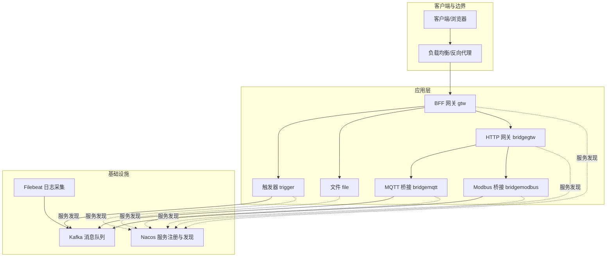
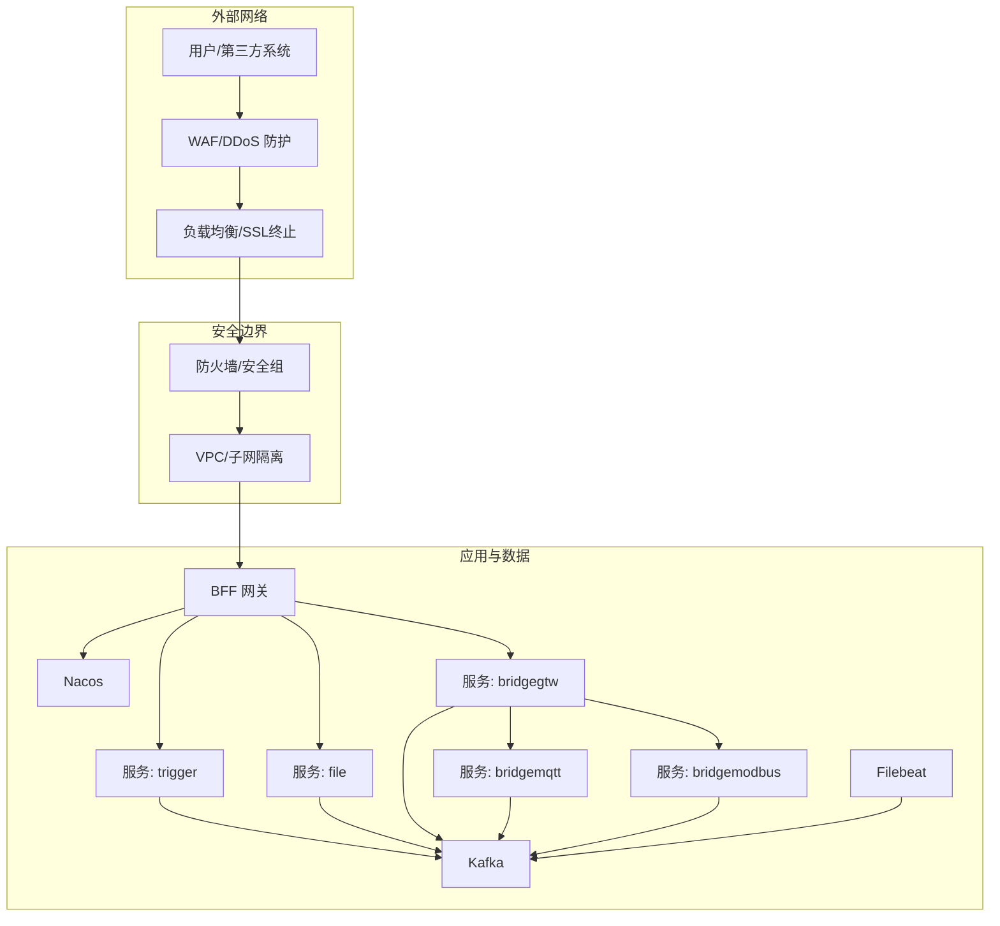
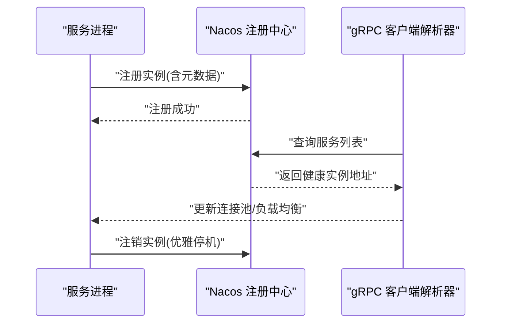
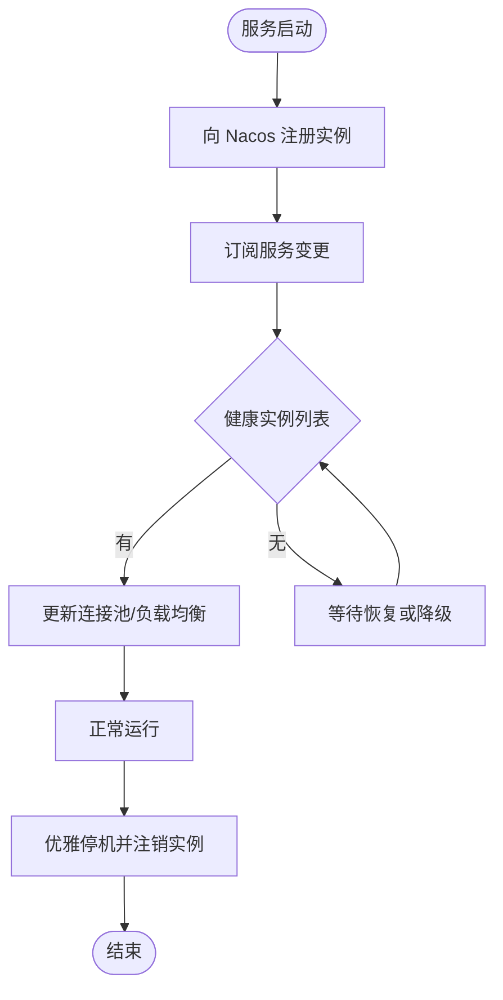
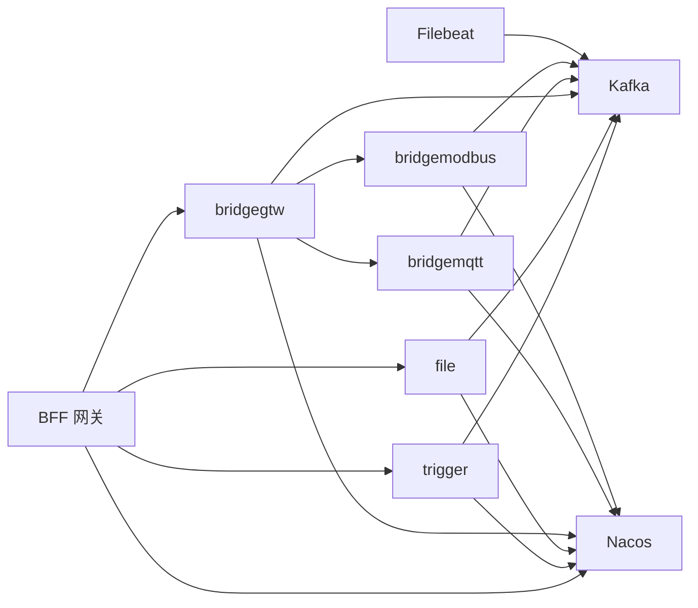

# 网络安全防护

<cite>
**本文引用的文件**
- [README.md](file://README.md)
- [docker-compose.yml](file://deploy/docker-compose.yml)
- [config.go](file://common/nacosx/config.go)
- [register.go](file://common/nacosx/register.go)
- [resolver.go](file://common/nacosx/resolver.go)
- [trigger.yaml](file://app/trigger/etc/trigger.yaml)
- [file.yaml](file://app/file/etc/file.yaml)
- [bridgegtw.yaml](file://app/bridgegtw/etc/bridgegtw.yaml)
- [bridgemqtt.yaml](file://app/bridgemqtt/etc/bridgemqtt.yaml)
- [bridgemodbus.yaml](file://app/bridgemodbus/etc/bridgemodbus.yaml)
</cite>

## 目录
1. [引言](#引言)
2. [项目结构](#项目结构)
3. [核心组件](#核心组件)
4. [架构总览](#架构总览)
5. [详细组件分析](#详细组件分析)
6. [依赖分析](#依赖分析)
7. [性能考虑](#性能考虑)
8. [故障排查指南](#故障排查指南)
9. [结论](#结论)
10. [附录](#附录)

## 引言
本文件面向 zero-service 微服务体系，围绕网络安全防护提出系统化的安全实践建议，重点覆盖以下方面：
- 防火墙配置策略：入站/出站规则与端口管理
- DDoS 防护机制：流量清洗、速率限制与异常检测
- Web 应用防火墙（WAF）集成：规则配置、威胁检测与自动阻断
- 网络隔离策略：VPC 配置、子网划分与安全组设置
- 服务发现安全：Nacos 注册安全、服务认证与健康检查保护
- 负载均衡安全：SSL 终止与连接超时配置
- 网络监控、入侵检测与安全事件响应
- 服务注册与发现的安全实现与目标解析机制

上述内容结合项目中已有的服务配置与组件（如 Nacos、gRPC、Kafka、Filebeat 等），给出可落地的安全加固方案。

## 项目结构
zero-service 采用多微服务架构，核心服务通过 gRPC/HTTP 聚合网关对外提供能力，并借助 Nacos 实现服务注册与发现；消息中间件 Kafka 作为数据通道；Filebeat 用于日志采集与传输。

图表来源
- [README.md](file://README.md)
- [docker-compose.yml](file://deploy/docker-compose.yml)
- [bridgegtw.yaml](file://app/bridgegtw/etc/bridgegtw.yaml)
- [bridgemqtt.yaml](file://app/bridgemqtt/etc/bridgemqtt.yaml)
- [bridgemodbus.yaml](file://app/bridgemodbus/etc/bridgemodbus.yaml)
- [trigger.yaml](file://app/trigger/etc/trigger.yaml)
- [file.yaml](file://app/file/etc/file.yaml)

章节来源
- [README.md](file://README.md)
- [docker-compose.yml](file://deploy/docker-compose.yml)

## 核心组件
- 服务注册与发现（Nacos）
  - 通过 Nacos 客户端进行服务注册与注销，支持集群名、分组名、元数据等参数控制。
  - gRPC 客户端侧通过自定义 resolver 监听 Nacos 服务列表变化，动态更新后端地址集合。
- 网关与协议桥接
  - BFF 网关负责 HTTP/gRPC 聚合与路由；HTTP 网关 bridgegtw 提供 gRPC 到 HTTP 的映射。
  - MQTT/Modbus 桥接服务通过配置连接上游协议端点。
- 消息与日志
  - Kafka 作为核心消息通道；Filebeat 采集容器日志并投递至 Kafka，便于集中审计与分析。

章节来源
- [register.go](file://common/nacosx/register.go)
- [resolver.go](file://common/nacosx/resolver.go)
- [config.go](file://common/nacosx/config.go)
- [bridgegtw.yaml](file://app/bridgegtw/etc/bridgegtw.yaml)
- [bridgemqtt.yaml](file://app/bridgemqtt/etc/bridgemqtt.yaml)
- [bridgemodbus.yaml](file://app/bridgemodbus/etc/bridgemodbus.yaml)
- [trigger.yaml](file://app/trigger/etc/trigger.yaml)
- [file.yaml](file://app/file/etc/file.yaml)

## 架构总览
下图展示 zero-service 的网络与安全边界，以及关键流量路径与安全控制点：

图表来源
- [README.md](file://README.md)
- [docker-compose.yml](file://deploy/docker-compose.yml)
- [bridgegtw.yaml](file://app/bridgegtw/etc/bridgegtw.yaml)
- [bridgemqtt.yaml](file://app/bridgemqtt/etc/bridgemqtt.yaml)
- [bridgemodbus.yaml](file://app/bridgemodbus/etc/bridgemodbus.yaml)
- [trigger.yaml](file://app/trigger/etc/trigger.yaml)
- [file.yaml](file://app/file/etc/file.yaml)

## 详细组件分析

### 防火墙配置策略
- 入站规则
  - 仅开放必要端口：BFF 网关对外端口、各服务监听端口（如 trigger/file/bridgegtw 等）、Kafka 端口、Nacos 端口。
  - 使用源 IP 白名单限制访问来源，优先放通网关与运维出口。
- 出站规则
  - 限制服务仅能访问 Kafka、Nacos、对象存储（OSS）等受控上游组件。
  - 禁止服务主动访问公网，除非有明确业务需求并经审批。
- 端口管理
  - 统一在网关层收敛端口暴露，服务间通信尽量走内网或容器网络。
  - 对外暴露端口应启用最小权限原则，避免使用默认高危端口。

### DDoS 防护机制
- 流量清洗
  - 在边缘前置 DDoS 清洗设备或云厂商 DDoS 防护，清洗后流量进入 WAF/负载均衡。
- 速率限制
  - 在网关层对不同 API 设置限流阈值（如每秒请求数、并发连接数），超过阈值触发熔断或降级。
- 异常检测
  - 结合 Filebeat 与 Kafka，建立异常流量特征库（如异常 UA、路径、频率分布），触发告警与临时封禁。

### Web 应用防火墙（WAF）集成
- 规则配置
  - 基于路径与方法的规则：对敏感接口（如 /api/...）启用严格规则；对静态资源放行。
  - 基于参数的规则：对常见注入攻击（SQL 注入、命令注入、XSS）进行拦截。
- 威胁检测
  - 与 Filebeat/Kafka 集成，将 WAF 日志实时入湖，配合 SIEM 进行关联分析。
- 自动阻断
  - 对命中高风险规则的 IP 或会话，WAF 返回阻断响应并联动防火墙/负载均衡进行封禁。

### 网络隔离策略
- VPC 配置
  - 将核心服务置于私有子网，仅通过 NAT 访问互联网；网关与 WAF 放置于公有子网。
- 子网划分
  - 公有子网：网关、WAF、负载均衡
  - 私有子网：应用服务、数据库、消息队列
- 安全组设置
  - 出站仅允许到 Kafka/Nacos/OSS；入站仅允许来自网关/运维端口；禁止任意出站访问公网。

### 服务发现安全（Nacos）
- 注册安全
  - 为每个服务配置独立的分组与命名空间，避免服务混淆。
  - 在注册时携带元数据（版本、环境、健康检查地址），便于审计与灰度。
- 服务认证
  - Nacos 启用用户名/密码认证；服务侧使用强口令与最小权限账户。
- 健康检查保护
  - 健康检查端口与业务端口分离，防止被恶意探测。
  - 健康检查失败快速摘除，避免流量转发至不健康实例。

图表来源
- [register.go](file://common/nacosx/register.go)
- [resolver.go](file://common/nacosx/resolver.go)

章节来源
- [register.go](file://common/nacosx/register.go)
- [resolver.go](file://common/nacosx/resolver.go)
- [config.go](file://common/nacosx/config.go)

### 负载均衡安全与 SSL 终止
- SSL 终止
  - 在负载均衡层完成 TLS 终止，服务间通信可选择明文或双向 TLS（mTLS）。
- 连接超时配置
  - 设置合理的连接/读写超时时间，避免慢连接与资源耗尽。
- 负载均衡安全
  - 仅允许来自网关的请求；对健康检查与管理端口进行白名单限制。

### 网络监控、入侵检测与安全事件响应
- 监控
  - 通过 Filebeat 将服务日志、网关访问日志、WAF/DNS/防火墙日志统一采集到 Kafka。
- 入侵检测
  - 基于规则与机器学习的异常检测，识别异常登录、暴力破解、扫描行为。
- 响应
  - 自动封禁：WAF/防火墙联动；手动处置：工单与回滚预案。

### 服务注册与发现的安全实现与目标解析机制
- 安全实现
  - 服务启动时向 Nacos 注册，携带权重、健康状态与元数据；优雅停机时注销。
  - gRPC 客户端通过自定义 resolver 订阅 Nacos 服务变更，动态更新后端地址列表。
- 目标解析机制
  - 解析器根据健康实例列表生成排序后的地址集合，避免重复替换导致负载均衡抖动。

图表来源
- [register.go](file://common/nacosx/register.go)
- [resolver.go](file://common/nacosx/resolver.go)

章节来源
- [register.go](file://common/nacosx/register.go)
- [resolver.go](file://common/nacosx/resolver.go)

## 依赖分析
- 服务间依赖
  - BFF 网关聚合多个 RPC 服务；HTTP 网关 bridgegtw 将 gRPC 映射为 HTTP；MQTT/Modbus 桥接服务依赖上游协议端点。
- 基础设施依赖
  - Kafka 作为核心消息通道；Filebeat 采集日志；Nacos 提供服务注册与发现。
- 安全依赖
  - WAF/DDoS 在边缘层；防火墙/安全组在子网层；负载均衡在网关层；服务侧通过 Nacos 与 gRPC 客户端实现安全发现与连接。

图表来源
- [README.md](file://README.md)
- [docker-compose.yml](file://deploy/docker-compose.yml)
- [bridgegtw.yaml](file://app/bridgegtw/etc/bridgegtw.yaml)
- [bridgemqtt.yaml](file://app/bridgemqtt/etc/bridgemqtt.yaml)
- [bridgemodbus.yaml](file://app/bridgemodbus/etc/bridgemodbus.yaml)
- [trigger.yaml](file://app/trigger/etc/trigger.yaml)
- [file.yaml](file://app/file/etc/file.yaml)

章节来源
- [README.md](file://README.md)
- [docker-compose.yml](file://deploy/docker-compose.yml)

## 性能考虑
- 端口与网络
  - 将服务暴露在宿主机网络模式时，确保端口不冲突且仅开放必要端口，减少攻击面。
- 负载均衡
  - 合理设置超时与重试策略，避免级联故障；对热点接口进行限流与缓存。
- 日志与审计
  - Filebeat 与 Kafka 的吞吐需与磁盘 IO 匹配，避免成为瓶颈。

## 故障排查指南
- 服务无法注册到 Nacos
  - 检查 Nacos 地址、账号密码、命名空间与分组是否正确；确认服务监听地址可被注册中心访问。
- gRPC 客户端无法解析服务
  - 检查 resolver 是否收到健康实例列表；确认服务端口与监听地址一致。
- 网关路由异常
  - 检查 bridgegtw 的映射配置与目标服务端口；确认服务已注册到 Nacos 并处于健康状态。
- Kafka 连接问题
  - 检查 advertised.listeners 与容器网络映射；确认 Filebeat 与 Kafka 的连通性。
- 日志采集异常
  - 检查 Filebeat 配置与挂载目录；确认容器日志输出路径正确。

章节来源
- [register.go](file://common/nacosx/register.go)
- [resolver.go](file://common/nacosx/resolver.go)
- [bridgegtw.yaml](file://app/bridgegtw/etc/bridgegtw.yaml)
- [docker-compose.yml](file://deploy/docker-compose.yml)

## 结论
通过在边缘层部署 WAF/DDoS、在子网层实施防火墙/安全组、在应用层强化服务发现与负载均衡安全，并结合 Kafka/Filebeat 的集中化日志与监控，zero-service 可形成“边界防护—网络隔离—服务治理—可观测性”的闭环安全体系。建议在生产环境中进一步引入 mTLS、细粒度 RBAC、动态访问控制与自动化安全编排，持续提升整体安全韧性。

## 附录
- 端口与服务对应参考
  - BFF 网关：对外 HTTP/HTTPS 端口
  - trigger：RPC 端口
  - file：RPC 端口
  - bridgegtw：HTTP 端口
  - bridgemqtt：RPC 端口
  - bridgemodbus：RPC 端口
  - Kafka：对外/容器端口
  - Nacos：服务端口
- 配置要点
  - 各服务配置文件中的监听地址、超时、日志路径、Nacos 连接参数需与安全策略一致。

章节来源
- [trigger.yaml](file://app/trigger/etc/trigger.yaml)
- [file.yaml](file://app/file/etc/file.yaml)
- [bridgegtw.yaml](file://app/bridgegtw/etc/bridgegtw.yaml)
- [bridgemqtt.yaml](file://app/bridgemqtt/etc/bridgemqtt.yaml)
- [bridgemodbus.yaml](file://app/bridgemodbus/etc/bridgemodbus.yaml)
- [docker-compose.yml](file://deploy/docker-compose.yml)