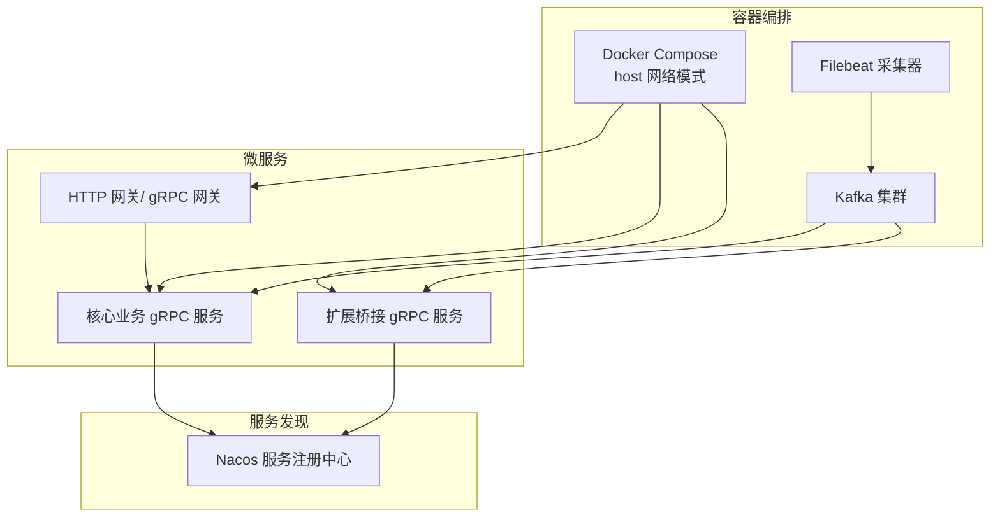
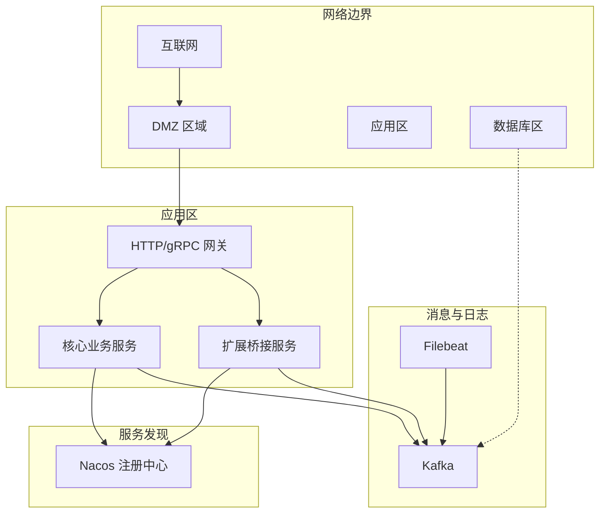
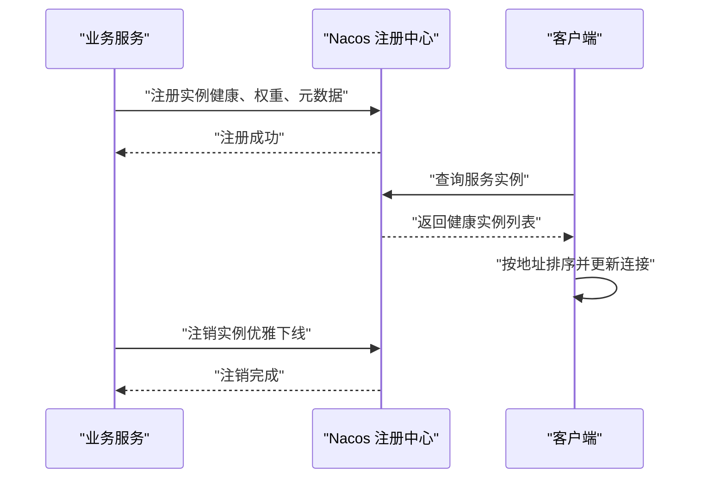
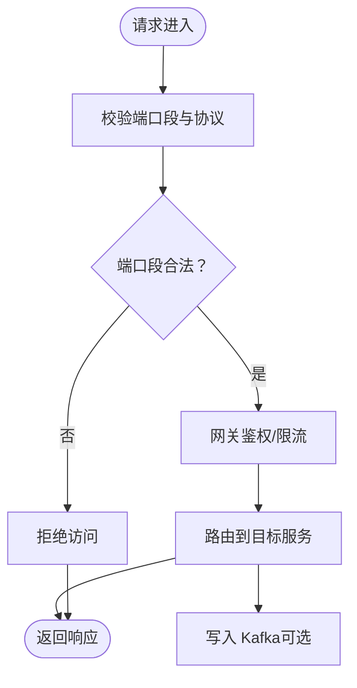
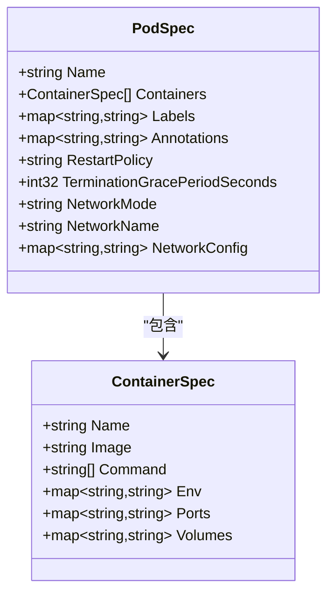
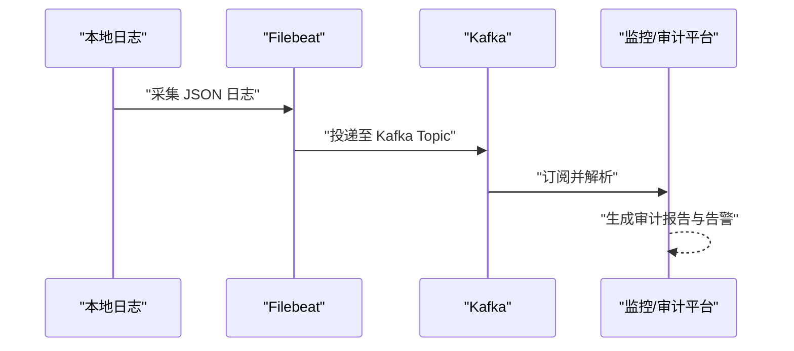
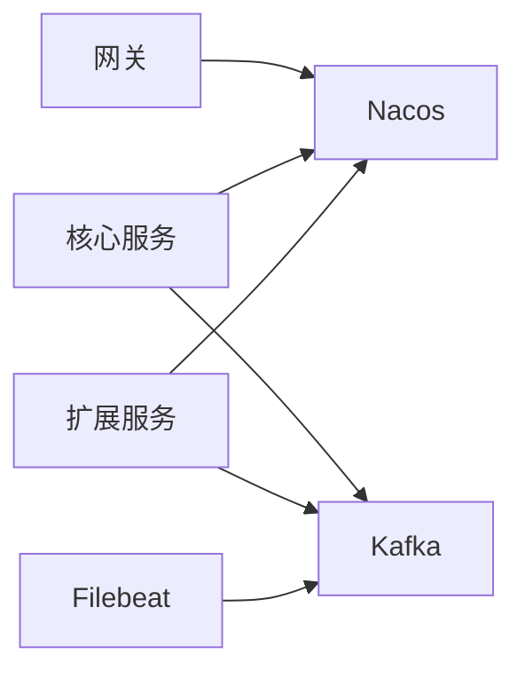

# 网络隔离策略

<cite>
**本文引用的文件**   
- [docker-compose.yml](file://deploy/docker-compose.yml)
- [filebeat.yml](file://deploy/filebeat/conf/filebeat.yml)
- [config.go](file://common/nacosx/config.go)
- [register.go](file://common/nacosx/register.go)
- [resolver.go](file://common/nacosx/resolver.go)
- [zerorpc.yaml](file://zerorpc/etc/zerorpc.yaml)
- [bridgegtw.yaml](file://app/bridgegtw/etc/bridgegtw.yaml)
- [service-ports.md](file://docs/service-ports.md)
- [dockerx.go](file://common/dockerx/dockerx.go)
- [main.go](file://util/dockeru/main.go)
- [podengine.pb.go](file://app/podengine/podengine/podengine.pb.go)
- [podengine.pb.validate.go](file://app/podengine/podengine/podengine.pb.validate.go)
</cite>

## 目录
1. [引言](#引言)
2. [项目结构](#项目结构)
3. [核心组件](#核心组件)
4. [架构总览](#架构总览)
5. [详细组件分析](#详细组件分析)
6. [依赖分析](#依赖分析)
7. [性能考量](#性能考量)
8. [故障排查指南](#故障排查指南)
9. [结论](#结论)
10. [附录](#附录)

## 引言
本文件面向 zero-service 的网络隔离策略，围绕虚拟私有云（VPC）设计、子网划分与路由表、子网隔离（前端/后端/数据库）、安全组规则、服务发现隔离（Nacos 注册与解析）、微服务间通信隔离与流量控制、容器网络隔离（Docker/Kubernetes）以及网络监控与安全事件响应进行系统化阐述。文档以仓库现有配置与代码为依据，结合实际部署形态（Docker Compose + Kafka/Filebeat + Nacos）给出可落地的隔离方案。

## 项目结构
从网络视角梳理与隔离相关的关键位置：
- 容器编排与网络模式：Docker Compose 中多服务采用 host 网络模式，便于跨服务直连与低延迟通信，但需配合安全组与防火墙策略实现隔离。
- 消息通道：Kafka 作为核心消息总线，Filebeat 将本地日志采集至 Kafka，形成“日志-消息”双通道隔离。
- 服务发现：Nacos SDK 提供注册与解析能力，支持 gRPC 实例健康筛选与动态更新。
- 端口与网关：HTTP 网关与 gRPC 网关端口集中，便于统一入口与访问控制。
- 容器网络模型：PodEngine 支持多种网络模式（bridge/host/none），为 Kubernetes 网络策略迁移提供参考。

**图表来源**
- [docker-compose.yml:1-110](file://deploy/docker-compose.yml#L1-L110)
- [filebeat.yml:110-119](file://deploy/filebeat/conf/filebeat.yml#L110-L119)
- [register.go:21-76](file://common/nacosx/register.go#L21-L76)
- [resolver.go:47-66](file://common/nacosx/resolver.go#L47-L66)
- [service-ports.md:1-53](file://docs/service-ports.md#L1-L53)

**章节来源**
- [docker-compose.yml:1-110](file://deploy/docker-compose.yml#L1-L110)
- [filebeat.yml:1-122](file://deploy/filebeat/conf/filebeat.yml#L1-L122)
- [service-ports.md:1-53](file://docs/service-ports.md#L1-L53)

## 核心组件
- Docker Compose 编排与网络模式：多服务使用 host 网络，便于服务间直连；需通过安全组与防火墙实现边界隔离。
- Kafka 消息总线：统一承载异步事件与日志流，提供“生产-消费”的解耦与隔离。
- Filebeat 日志采集：将本地 JSON 文件采集并投递至 Kafka，形成可观测性与审计通道。
- Nacos 服务注册与解析：注册实例、健康检查、动态解析，支撑服务发现隔离与流量治理。
- 网关与端口：HTTP 网关与 gRPC 网关端口集中，便于统一入口与访问控制。
- 容器网络模型：PodEngine 的网络模式字段为 Kubernetes 网络策略迁移提供参考。

**章节来源**
- [docker-compose.yml:54-100](file://deploy/docker-compose.yml#L54-L100)
- [filebeat.yml:110-119](file://deploy/filebeat/conf/filebeat.yml#L110-L119)
- [config.go:15-37](file://common/nacosx/config.go#L15-L37)
- [register.go:21-76](file://common/nacosx/register.go#L21-L76)
- [resolver.go:47-66](file://common/nacosx/resolver.go#L47-L66)
- [service-ports.md:37-47](file://docs/service-ports.md#L37-L47)
- [podengine.pb.go:538-542](file://app/podengine/podengine/podengine.pb.go#L538-L542)

## 架构总览
下图展示 zero-service 的网络隔离架构：容器编排采用 host 网络，服务通过 Nacos 注册与解析；消息通过 Kafka 传输；Filebeat 将日志采集至 Kafka；HTTP/gRPC 网关作为统一入口，端口集中便于访问控制。

**图表来源**
- [docker-compose.yml:54-100](file://deploy/docker-compose.yml#L54-L100)
- [filebeat.yml:110-119](file://deploy/filebeat/conf/filebeat.yml#L110-L119)
- [register.go:21-76](file://common/nacosx/register.go#L21-L76)
- [resolver.go:47-66](file://common/nacosx/resolver.go#L47-L66)
- [service-ports.md:37-47](file://docs/service-ports.md#L37-L47)

## 详细组件分析

### VPC 配置方案与子网划分
- 虚拟私有云设计
  - 边界与隔离：建议将“DMZ 区域”与“应用区/数据库区”物理隔离，DMZ 承载对外网关与只读服务，应用区承载核心业务与扩展服务，数据库区独立子网并仅允许应用区访问。
  - 网络设备：每个子网配置 NAT 网关（若需要出网）、ACL 控制（入/出站规则）、安全组（细粒度端口与协议控制）。
- 子网划分策略
  - DMZ 子网：放置网关与对外只读服务，仅开放必要端口（如 80/443、特定网关端口）。
  - 应用子网：放置核心业务与扩展服务，仅开放网关与服务间互访端口。
  - 数据库子网：仅开放应用区访问，禁止来自 DMZ 的直接访问。
- 路由表配置
  - DMZ 路由表：默认路由指向 NAT 网关（若需要出网），拒绝来自应用区的回注。
  - 应用子网路由表：默认路由指向 NAT 网关；对数据库子网配置专用路由。
  - 数据库子网路由表：默认路由指向应用区网关或专用出口；仅允许应用区访问。

（本节为概念性设计，不直接分析具体文件）

### 子网隔离实现
- 前端子网（DMZ）：仅暴露网关与静态资源，禁止访问后端与数据库。
- 后端子网（应用区）：核心业务与扩展服务，仅允许来自网关与数据库的受控访问。
- 数据库子网：仅允许来自应用区的访问，禁止来自 DMZ 的访问。

（本节为概念性设计，不直接分析具体文件）

### 安全组设置
- 入站规则
  - DMZ：仅允许来自互联网的 80/443 与网关端口；拒绝其他入站。
  - 应用区：仅允许来自 DMZ 的网关入站、来自应用区的互访、来自数据库区的业务访问。
  - 数据库区：仅允许来自应用区的业务访问，拒绝来自 DMZ 的访问。
- 出站规则
  - DMZ：仅允许访问互联网（NTP/更新等最小权限）。
  - 应用区：仅允许访问数据库区与必要的外部服务（Kafka/Nacos/日志系统）。
  - 数据库区：仅允许访问应用区业务访问。
- 端口控制与协议限制
  - 端口：严格遵循“最小端口集”，例如 DMZ 仅开放 80/443/网关端口；应用区开放网关与服务间端口；数据库区仅开放数据库端口。
  - 协议：优先使用 TCP；对 UDP 仅限必要场景（如 IEC 104 设备通信）。

（本节为概念性设计，不直接分析具体文件）

### 服务发现隔离（Nacos 注册与解析）
- 注册隔离
  - 服务在启动时向 Nacos 注册自身实例，携带健康状态与元数据，确保仅注册健康实例。
  - 通过集群名与分组名实现逻辑隔离，避免跨环境误注册。
- 解析隔离
  - 客户端通过 Nacos 解析健康实例列表，按地址排序更新连接状态，避免重复地址。
  - 回调中仅提取健康实例，降低异常实例对流量的影响。
- 健康检查保护
  - 注销时主动从 Nacos 移除实例，避免流量继续转发至已下线实例。
  - 日志级别与输出控制，减少敏感信息泄露。

**图表来源**
- [register.go:21-76](file://common/nacosx/register.go#L21-L76)
- [resolver.go:47-66](file://common/nacosx/resolver.go#L47-L66)

**章节来源**
- [config.go:15-37](file://common/nacosx/config.go#L15-L37)
- [register.go:21-76](file://common/nacosx/register.go#L21-L76)
- [resolver.go:1-74](file://common/nacosx/resolver.go#L1-L74)

### 微服务间通信隔离与流量控制
- 通信隔离
  - 应用区服务仅通过网关对外暴露，内部服务间通过私网直连，减少暴露面。
  - Kafka 作为统一消息总线，实现异步解耦与跨服务隔离。
- 流量控制
  - 端口段规划：HTTP 网关层、gRPC 网关代理、核心业务与扩展服务端口段清晰分离，便于 ACL 与 WAF 策略下发。
  - 网关映射：HTTP 网关将请求映射到对应 gRPC 服务，统一鉴权与限流。

**图表来源**
- [service-ports.md:37-47](file://docs/service-ports.md#L37-L47)
- [bridgegtw.yaml:25-40](file://app/bridgegtw/etc/bridgegtw.yaml#L25-L40)

**章节来源**
- [service-ports.md:1-53](file://docs/service-ports.md#L1-L53)
- [bridgegtw.yaml:1-40](file://app/bridgegtw/etc/bridgegtw.yaml#L1-L40)

### 容器网络隔离（Docker 与 Kubernetes）
- Docker 网络配置
  - 当前 Compose 多数服务使用 host 网络，便于服务间直连；需通过宿主机防火墙与安全组实现隔离。
  - 容器工具函数支持解析端口映射、卷挂载与资源限制，便于审计与合规。
- Kubernetes 网络策略
  - Pod 网络模式：bridge/host/none 三种模式，结合 NetworkPolicy 实现命名空间级隔离与端口白名单。
  - 网络策略建议：仅允许来自网关与应用区的入站；仅允许访问数据库区与必要外部服务；禁止 egress 至未知目的地。

**图表来源**
- [podengine.pb.go:577-638](file://app/podengine/podengine/podengine.pb.go#L577-L638)
- [podengine.pb.validate.go:619-628](file://app/podengine/podengine/podengine.pb.validate.go#L619-L628)

**章节来源**
- [docker-compose.yml:54-100](file://deploy/docker-compose.yml#L54-L100)
- [dockerx.go:1-95](file://common/dockerx/dockerx.go#L1-L95)
- [podengine.pb.go:538-542](file://app/podengine/podengine/podengine.pb.go#L538-L542)
- [podengine.pb.validate.go:600-640](file://app/podengine/podengine/podengine.pb.validate.go#L600-L640)

### 网络监控、流量审计与安全事件响应
- 流量审计
  - Filebeat 将本地 JSON 日志采集并投递至 Kafka，形成审计与溯源通道。
  - Kafka 集群可接入审计平台，实现日志聚合与告警。
- 安全事件响应
  - Nacos 日志级别与输出控制，避免敏感信息泄露。
  - 网关层统一鉴权与限流，异常流量触发告警与熔断。
  - 容器侧通过日志与指标（CPU/内存/网络）监控异常行为。

**图表来源**
- [filebeat.yml:110-119](file://deploy/filebeat/conf/filebeat.yml#L110-L119)

**章节来源**
- [filebeat.yml:1-122](file://deploy/filebeat/conf/filebeat.yml#L1-L122)
- [config.go:15-37](file://common/nacosx/config.go#L15-L37)

## 依赖分析
- 组件耦合
  - 网关依赖服务注册中心（Nacos）进行实例解析与健康检查。
  - 核心与扩展服务通过 Kafka 与 Filebeat 形成日志与事件通道，降低耦合度。
  - Docker Compose 通过 host 网络简化服务间通信，但需配合安全组与防火墙实现隔离。
- 外部依赖
  - Nacos SDK：注册、注销、解析与日志配置。
  - Kafka：消息总线，支持高吞吐与持久化。
  - Filebeat：日志采集与投递。

**图表来源**
- [register.go:21-76](file://common/nacosx/register.go#L21-L76)
- [resolver.go:47-66](file://common/nacosx/resolver.go#L47-L66)
- [docker-compose.yml:54-100](file://deploy/docker-compose.yml#L54-L100)
- [filebeat.yml:110-119](file://deploy/filebeat/conf/filebeat.yml#L110-L119)

**章节来源**
- [register.go:21-76](file://common/nacosx/register.go#L21-L76)
- [resolver.go:1-74](file://common/nacosx/resolver.go#L1-L74)
- [docker-compose.yml:1-110](file://deploy/docker-compose.yml#L1-L110)
- [filebeat.yml:1-122](file://deploy/filebeat/conf/filebeat.yml#L1-L122)

## 性能考量
- 端口段规划：集中端口段便于 ACL/WAF 生效，减少匹配开销。
- 网关层：统一鉴权与限流，避免单点瓶颈；合理配置超时与重试。
- Kafka：分区数量与副本策略平衡吞吐与可用性；压缩与消息大小控制。
- 容器网络：host 模式降低网络栈开销，但需严格隔离；bridge 模式适合多租户隔离。

（本节为通用指导，不直接分析具体文件）

## 故障排查指南
- 服务发现异常
  - 检查 Nacos 注册与注销流程，确认健康状态与元数据正确。
  - 校验解析回调中的健康实例提取逻辑。
- 网关访问失败
  - 核对端口段与协议，确认网关映射与超时配置。
  - 检查 Kafka 连接与分区分配。
- 容器网络问题
  - 使用容器工具脚本查看容器状态、端口映射与日志。
  - 校验 Docker 网络模式与资源限制。

**章节来源**
- [register.go:21-76](file://common/nacosx/register.go#L21-L76)
- [resolver.go:38-66](file://common/nacosx/resolver.go#L38-L66)
- [service-ports.md:37-47](file://docs/service-ports.md#L37-L47)
- [main.go:274-307](file://util/dockeru/main.go#L274-L307)

## 结论
zero-service 在现有部署形态下，通过 host 网络简化服务间通信，结合 Nacos 服务发现与 Kafka 消息总线实现解耦与隔离。建议在 VPC 层面进一步强化子网隔离与安全组策略，完善端口段与协议控制，并在 Kubernetes 环境中引入网络策略与 egress 限制，以实现更严格的网络隔离与可观测性。

## 附录
- 端口段与用途参考：见“端口段规划”与“服务端口清单”。

**章节来源**
- [service-ports.md:37-53](file://docs/service-ports.md#L37-L53)