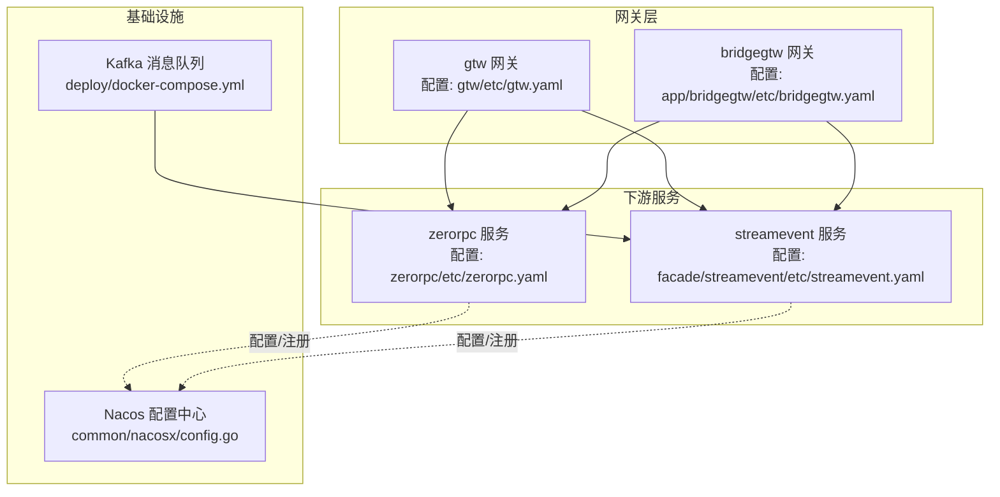
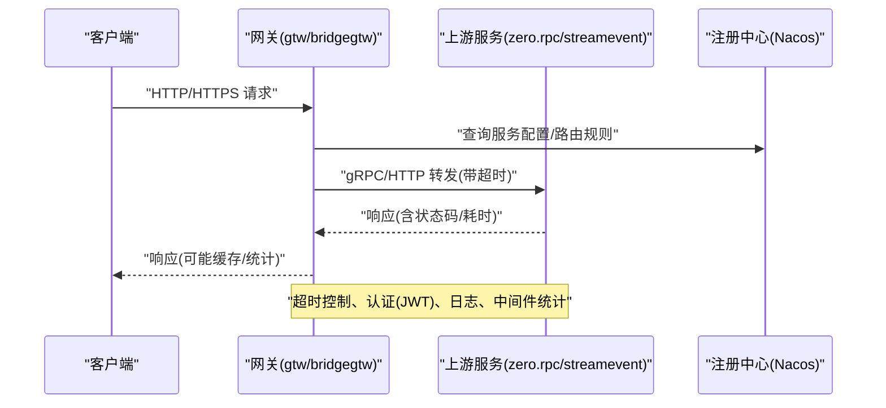
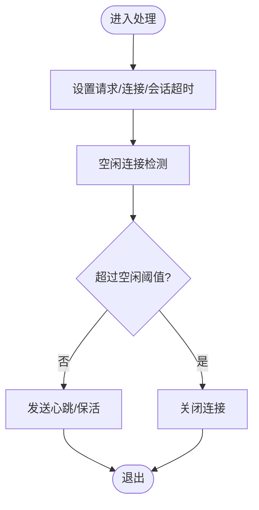
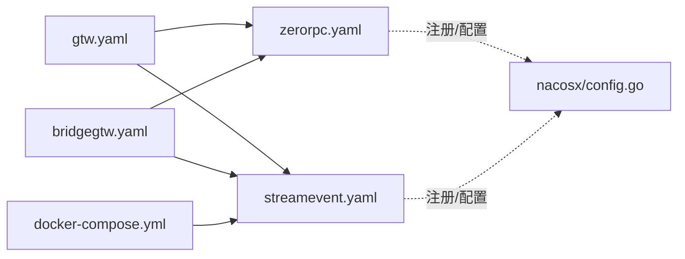

# 负载均衡安全

<cite>
**本文引用的文件**
- [gtw/etc/gtw.yaml](file://gtw/etc/gtw.yaml)
- [app/bridgegtw/etc/bridgegtw.yaml](file://app/bridgegtw/etc/bridgegtw.yaml)
- [zerorpc/etc/zerorpc.yaml](file://zerorpc/etc/zerorpc.yaml)
- [facade/streamevent/etc/streamevent.yaml](file://facade/streamevent/etc/streamevent.yaml)
- [.trae/skills/zero-skills/references/resilience-patterns.md](file://.trae/skills/zero-skills/references/resilience-patterns.md)
- [deploy/docker-compose.yml](file://deploy/docker-compose.yml)
- [common/nacosx/config.go](file://common/nacosx/config.go)
- [common/wsx/client.go](file://common/wsx/client.go)
- [socketapp/socketgtw/socketgtw/socketgtw.pb.go](file://socketapp/socketgtw/socketgtw/socketgtw.pb.go)
- [app/bridgemodbus/bridgemodbus/bridgemodbus.pb.go](file://app/bridgemodbus/bridgemodbus/bridgemodbus.pb.go)
- [deploy/stat_analyzer.html](file://deploy/stat_analyzer.html)
</cite>

## 目录
1. [简介](#简介)
2. [项目结构](#项目结构)
3. [核心组件](#核心组件)
4. [架构总览](#架构总览)
5. [详细组件分析](#详细组件分析)
6. [依赖分析](#依赖分析)
7. [性能考虑](#性能考虑)
8. [故障排查指南](#故障排查指南)
9. [结论](#结论)
10. [附录](#附录)

## 简介
本指南面向 zero-service 中的“负载均衡安全”主题，聚焦于以下方面：
- SSL/TLS 终止与证书管理、加密协议配置与密钥轮换策略
- 连接超时与空闲连接管理、超时检测与自动断开机制
- 负载均衡器安全：健康检查保护、故障转移安全、会话保持
- 流量分发安全：权重配置、优先级管理与故障切换保护
- 反向代理安全：请求转发保护、响应缓存安全
- 监控、性能优化与安全审计
- 负载均衡器配置参数、安全最佳实践与故障排查方法

本指南以仓库中实际存在的配置与实现为依据，结合通用安全原则，给出可落地的安全建议。

## 项目结构
本项目采用多服务微架构，网关层通过 go-zero gateway 提供统一入口，下游服务通过 gRPC 或 HTTP 暴露接口。负载均衡安全涉及网关层配置、下游服务配置、以及运行时环境（如 Nacos 注册中心、Kafka 消息队列等）。

图表来源
- [gtw/etc/gtw.yaml:1-61](file://gtw/etc/gtw.yaml#L1-L61)
- [app/bridgegtw/etc/bridgegtw.yaml:1-40](file://app/bridgegtw/etc/bridgegtw.yaml#L1-L40)
- [zerorpc/etc/zerorpc.yaml:1-39](file://zerorpc/etc/zerorpc.yaml#L1-L39)
- [facade/streamevent/etc/streamevent.yaml:1-28](file://facade/streamevent/etc/streamevent.yaml#L1-L28)
- [common/nacosx/config.go:1-38](file://common/nacosx/config.go#L1-L38)
- [deploy/docker-compose.yml:1-110](file://deploy/docker-compose.yml#L1-L110)

章节来源
- [gtw/etc/gtw.yaml:1-61](file://gtw/etc/gtw.yaml#L1-L61)
- [app/bridgegtw/etc/bridgegtw.yaml:1-40](file://app/bridgegtw/etc/bridgegtw.yaml#L1-L40)
- [zerorpc/etc/zerorpc.yaml:1-39](file://zerorpc/etc/zerorpc.yaml#L1-L39)
- [facade/streamevent/etc/streamevent.yaml:1-28](file://facade/streamevent/etc/streamevent.yaml#L1-L28)
- [deploy/docker-compose.yml:1-110](file://deploy/docker-compose.yml#L1-L110)

## 核心组件
- 网关层（gtw 与 bridgegtw）
  - gtw.yaml 中定义了上游 gRPC 服务列表、非阻塞转发、超时与 JWT 认证等关键参数，是实现负载均衡与安全控制的核心。
  - bridgegtw.yaml 展示了另一种网关配置方式，包含 gRPC 上游映射与超时设置。
- 下游服务
  - zerorpc.yaml 定义了服务监听、超时、日志、缓存与 JWT 配置；streamevent.yaml 包含中间件统计与数据库配置。
- 基础设施
  - Nacosx 提供日志与配置初始化；docker-compose 定义 Kafka 与容器网络模式（host），影响网关与下游通信拓扑。

章节来源
- [gtw/etc/gtw.yaml:1-61](file://gtw/etc/gtw.yaml#L1-L61)
- [app/bridgegtw/etc/bridgegtw.yaml:1-40](file://app/bridgegtw/etc/bridgegtw.yaml#L1-L40)
- [zerorpc/etc/zerorpc.yaml:1-39](file://zerorpc/etc/zerorpc.yaml#L1-L39)
- [facade/streamevent/etc/streamevent.yaml:1-28](file://facade/streamevent/etc/streamevent.yaml#L1-L28)
- [common/nacosx/config.go:1-38](file://common/nacosx/config.go#L1-L38)
- [deploy/docker-compose.yml:1-110](file://deploy/docker-compose.yml#L1-L110)

## 架构总览
下图展示网关到下游服务的典型调用链，以及安全控制点（超时、认证、日志、中间件统计）：

图表来源
- [gtw/etc/gtw.yaml:1-61](file://gtw/etc/gtw.yaml#L1-L61)
- [app/bridgegtw/etc/bridgegtw.yaml:1-40](file://app/bridgegtw/etc/bridgegtw.yaml#L1-L40)
- [zerorpc/etc/zerorpc.yaml:1-39](file://zerorpc/etc/zerorpc.yaml#L1-L39)
- [facade/streamevent/etc/streamevent.yaml:1-28](file://facade/streamevent/etc/streamevent.yaml#L1-L28)
- [common/nacosx/config.go:1-38](file://common/nacosx/config.go#L1-L38)

## 详细组件分析

### 网关层（gtw 与 bridgegtw）安全配置
- 上游 gRPC 配置
  - gtw.yaml 中定义了多个上游 gRPC 端点、非阻塞转发与超时；bridgegtw.yaml 同样包含 gRPC 上游与映射。
  - 安全要点：确保上游端点可信、启用非阻塞转发以避免阻塞；合理设置超时，防止级联故障。
- JWT 认证
  - gtw.yaml 与 zerorpc.yaml 均包含 JwtAuth 字段，用于签名与过期时间控制；建议在网关层统一鉴权，并对敏感路径进行白名单控制。
- 日志与中间件
  - streamevent.yaml 的 Middlewares.StatConf.IgnoreContentMethods 可用于忽略高吞吐日志内容，降低日志风暴风险。

章节来源
- [gtw/etc/gtw.yaml:1-61](file://gtw/etc/gtw.yaml#L1-L61)
- [app/bridgegtw/etc/bridgegtw.yaml:1-40](file://app/bridgegtw/etc/bridgegtw.yaml#L1-L40)
- [zerorpc/etc/zerorpc.yaml:1-39](file://zerorpc/etc/zerorpc.yaml#L1-L39)
- [facade/streamevent/etc/streamevent.yaml:1-28](file://facade/streamevent/etc/streamevent.yaml#L1-L28)

### SSL/TLS 终止与证书管理
- 现状与建议
  - 仓库中未发现显式的 HTTPS/SSL 终止配置示例。若需启用 TLS 终止，应在网关层（gtw/bridgegtw）增加证书与密钥路径配置，并限制加密套件与协议版本。
  - 证书管理：使用受信 CA 签发，定期轮换；密钥存储建议使用硬件安全模块（HSM）或密钥管理服务（KMS）。
  - 加密协议：禁用过时协议（如 TLS1.0/1.1），仅允许 TLS1.2/1.3；限制弱密码套件，优先使用前向保密（PFS）套件。
  - 密钥轮换：采用蓝绿/滚动发布策略，先部署新证书，再切换流量，最后吊销旧证书。

[本节为通用安全建议，不直接分析具体文件，故不附加章节来源]

### 连接超时与空闲连接管理
- 超时配置
  - gtw.yaml 与 bridgegtw.yaml 提供 Timeout 字段；zerorpc.yaml 与 streamevent.yaml 的 Timeout 分别控制服务侧超时。
  - 建议：请求超时 < 连接超时 < 会话超时；在网关层设置较短的读写超时，避免长连接占用资源。
- 空闲连接与自动断开
  - 在下游服务中可通过连接池参数（如最大空闲连接数、空闲超时）限制资源占用；对于 WebSocket/长连接场景，建议在客户端与服务端均实现心跳与超时检测。
- 参考实现
  - wsx 客户端实现了重连、指数退避与心跳循环，可作为长连接健康与断开策略的参考。

图表来源
- [zerorpc/etc/zerorpc.yaml:1-39](file://zerorpc/etc/zerorpc.yaml#L1-L39)
- [facade/streamevent/etc/streamevent.yaml:1-28](file://facade/streamevent/etc/streamevent.yaml#L1-L28)
- [common/wsx/client.go:554-644](file://common/wsx/client.go#L554-L644)

章节来源
- [zerorpc/etc/zerorpc.yaml:1-39](file://zerorpc/etc/zerorpc.yaml#L1-L39)
- [facade/streamevent/etc/streamevent.yaml:1-28](file://facade/streamevent/etc/streamevent.yaml#L1-L28)
- [common/wsx/client.go:554-644](file://common/wsx/client.go#L554-L644)

### 负载均衡器安全（健康检查、故障转移、会话保持）
- 健康检查保护
  - 建议在网关层对上游健康检查端点进行白名单与速率限制；对异常节点进行快速隔离与熔断。
- 故障转移安全
  - gtw.yaml 的 Upstreams 支持多上游端点，建议启用非阻塞转发与超时控制，避免单点故障扩大。
- 会话保持
  - 对于有状态服务，建议使用粘性会话或外部状态存储；对于无状态服务，优先无状态分发，减少会话耦合。

章节来源
- [gtw/etc/gtw.yaml:1-61](file://gtw/etc/gtw.yaml#L1-L61)
- [app/bridgegtw/etc/bridgegtw.yaml:1-40](file://app/bridgegtw/etc/bridgegtw.yaml#L1-L40)

### 流量分发安全（权重、优先级、故障切换）
- 权重与优先级
  - 在 Upstreams 中为不同上游设置权重，优先保障核心服务；对边缘或低优先级服务设置较低权重。
- 故障切换保护
  - 结合超时与熔断策略，当上游不可用时快速切换至备用端点；记录切换事件以便审计与复盘。

章节来源
- [gtw/etc/gtw.yaml:1-61](file://gtw/etc/gtw.yaml#L1-L61)
- [app/bridgegtw/etc/bridgegtw.yaml:1-40](file://app/bridgegtw/etc/bridgegtw.yaml#L1-L40)

### 反向代理安全与请求转发保护
- 请求转发保护
  - 在网关层对上游映射进行严格校验，避免路径穿越与非法方法；对请求体大小进行限制（MaxBytes）。
- 响应缓存安全
  - 对敏感响应避免缓存；对静态资源启用强缓存与 ETag；在网关层统一缓存控制头。

章节来源
- [gtw/etc/gtw.yaml:1-61](file://gtw/etc/gtw.yaml#L1-L61)

### TLS 与加密扩展（Modbus/TLS 场景参考）
- Modbus/TLS 参数
  - bridgemodbus.pb.go 中包含 EnableTls、TlsCertFile、TlsKeyFile、TlsCaFile 等字段，可用于下游设备或子系统的 TLS 加密配置参考。
- 实施建议
  - 在网关层或下游服务中启用 TLS，使用受信 CA 证书；定期轮换证书与密钥；限制加密套件与协议版本。

章节来源
- [app/bridgemodbus/bridgemodbus/bridgemodbus.pb.go:33-40](file://app/bridgemodbus/bridgemodbus/bridgemodbus.pb.go#L33-L40)

### WebSocket/长连接与会话安全
- 心跳与断开
  - wsx 客户端实现心跳循环与断线重连，建议在网关层对 WS 连接设置空闲超时与最大生命周期；对异常断开进行审计。
- 会话元数据
  - socketgtw.pb.go 中包含会话元数据结构，可用于会话标识与审计；建议在网关层记录会话事件与负载指标。

章节来源
- [common/wsx/client.go:554-644](file://common/wsx/client.go#L554-L644)
- [socketapp/socketgtw/socketgtw/socketgtw.pb.go:1-1173](file://socketapp/socketgtw/socketgtw/socketgtw.pb.go#L1-L1173)

## 依赖分析
- 配置依赖
  - 网关层依赖下游服务的监听地址与超时配置；下游服务依赖 Nacos 进行配置与注册。
- 运行时依赖
  - docker-compose 使用 host 网络模式，简化容器间通信；Kafka 作为事件通道，影响流式服务的可用性。

图表来源
- [gtw/etc/gtw.yaml:1-61](file://gtw/etc/gtw.yaml#L1-L61)
- [app/bridgegtw/etc/bridgegtw.yaml:1-40](file://app/bridgegtw/etc/bridgegtw.yaml#L1-L40)
- [zerorpc/etc/zerorpc.yaml:1-39](file://zerorpc/etc/zerorpc.yaml#L1-L39)
- [facade/streamevent/etc/streamevent.yaml:1-28](file://facade/streamevent/etc/streamevent.yaml#L1-L28)
- [common/nacosx/config.go:1-38](file://common/nacosx/config.go#L1-L38)
- [deploy/docker-compose.yml:1-110](file://deploy/docker-compose.yml#L1-L110)

章节来源
- [gtw/etc/gtw.yaml:1-61](file://gtw/etc/gtw.yaml#L1-L61)
- [app/bridgegtw/etc/bridgegtw.yaml:1-40](file://app/bridgegtw/etc/bridgegtw.yaml#L1-L40)
- [zerorpc/etc/zerorpc.yaml:1-39](file://zerorpc/etc/zerorpc.yaml#L1-L39)
- [facade/streamevent/etc/streamevent.yaml:1-28](file://facade/streamevent/etc/streamevent.yaml#L1-L28)
- [common/nacosx/config.go:1-38](file://common/nacosx/config.go#L1-L38)
- [deploy/docker-compose.yml:1-110](file://deploy/docker-compose.yml#L1-L110)

## 性能考虑
- 超时与限流
  - 在网关层设置合理的超时与限流策略，避免慢请求拖垮系统；结合负载削峰与降级策略。
- 中间件统计
  - streamevent.yaml 的 Middlewares.StatConf 可用于忽略高吞吐日志内容，降低日志开销。
- 监控与分析
  - deploy/stat_analyzer.html 提供日志解析与指标统计能力，可用于 QPS、响应时间与丢弃率的观测。

章节来源
- [facade/streamevent/etc/streamevent.yaml:1-28](file://facade/streamevent/etc/streamevent.yaml#L1-L28)
- [deploy/stat_analyzer.html:862-888](file://deploy/stat_analyzer.html#L862-L888)

## 故障排查指南
- 配置核对
  - 确认网关与下游服务的 Timeout、Upstreams、JwtAuth 等配置一致且合理。
- 注册中心与网络
  - 检查 Nacos 配置与服务注册状态；确认 docker-compose 的 host 网络模式下端口可达。
- 日志与指标
  - 关注网关与下游服务的日志级别与输出路径；利用中间件统计与日志分析工具定位问题。
- 重连与心跳
  - 对长连接场景，检查 wsx 客户端的心跳与重连逻辑，确认指数退避与最大重试次数设置。

章节来源
- [zerorpc/etc/zerorpc.yaml:1-39](file://zerorpc/etc/zerorpc.yaml#L1-L39)
- [common/nacosx/config.go:1-38](file://common/nacosx/config.go#L1-L38)
- [deploy/docker-compose.yml:1-110](file://deploy/docker-compose.yml#L1-L110)
- [common/wsx/client.go:554-644](file://common/wsx/client.go#L554-L644)

## 结论
本指南基于仓库中的配置与实现，提出了负载均衡安全的关键实践：在网关层统一超时与认证，在下游服务中完善日志与中间件统计，并通过基础设施（Nacos、Kafka）保障服务治理与可观测性。针对 TLS 终止、连接超时、健康检查与故障转移等主题，建议结合通用安全原则与本项目的实际配置进行落地与持续优化。

## 附录
- 安全最佳实践参考
  - 参考 resilience-patterns.md 中的韧性模式与配置示例，结合本项目的网关与服务配置，形成统一的安全与韧性策略。

章节来源
- [.trae/skills/zero-skills/references/resilience-patterns.md:565-696](file://.trae/skills/zero-skills/references/resilience-patterns.md#L565-L696)