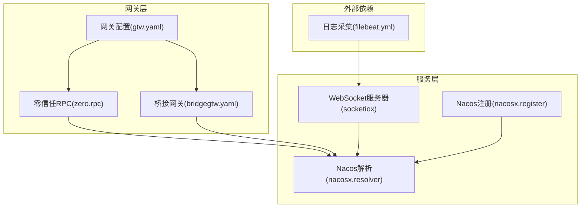
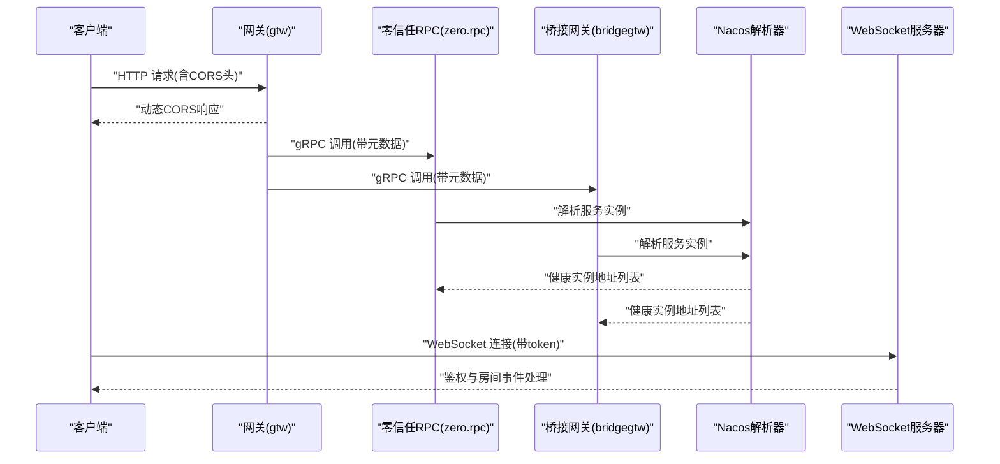
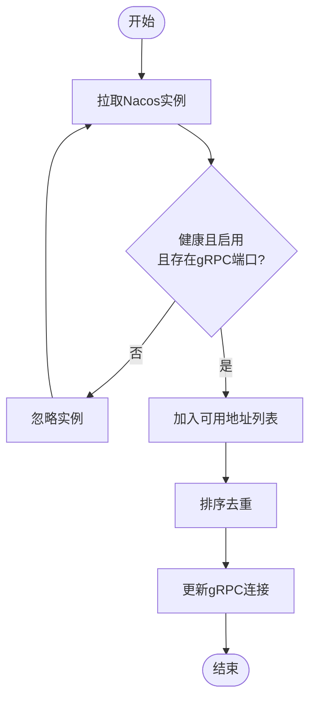
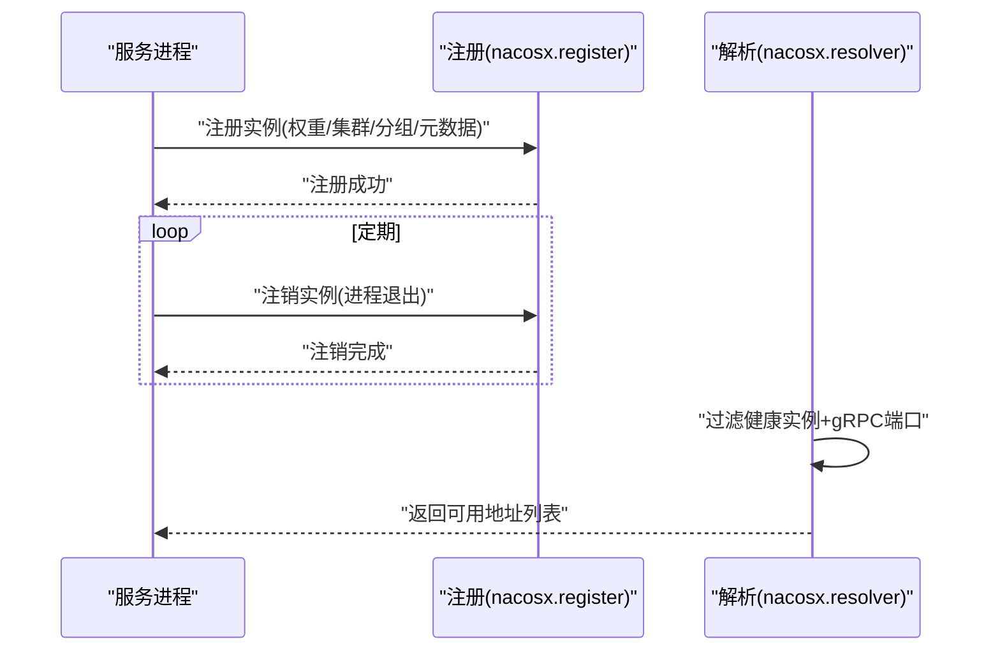
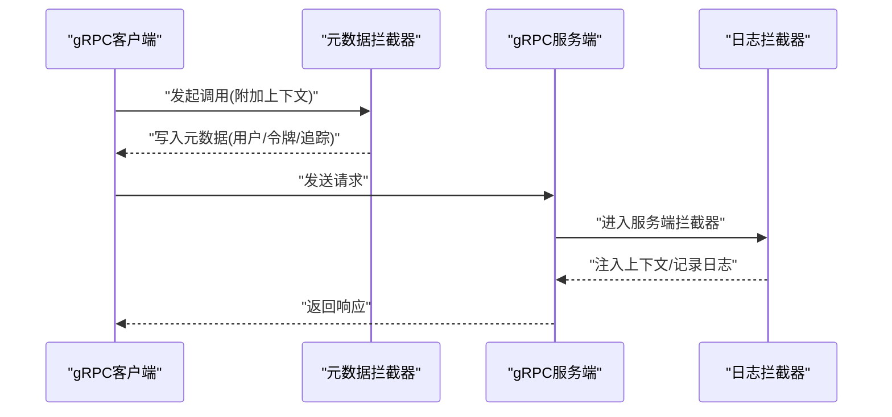
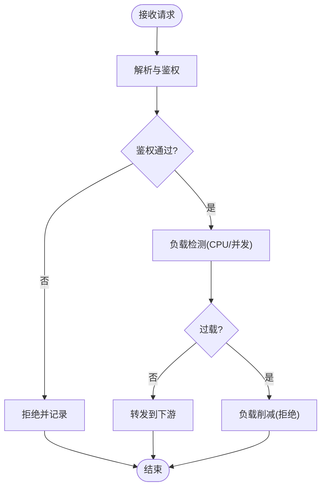
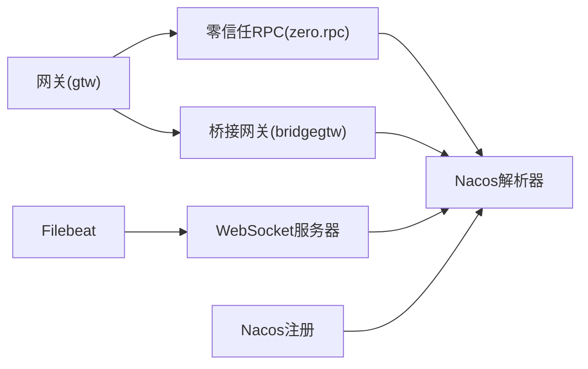

# 防火墙配置策略

<cite>
**本文引用的文件**
- [common/nacosx/register.go](file://common/nacosx/register.go)
- [common/nacosx/options.go](file://common/nacosx/options.go)
- [common/nacosx/resolver.go](file://common/nacosx/resolver.go)
- [common/nacosx/builder.go](file://common/nacosx/builder.go)
- [common/nacosx/container.go](file://common/nacosx/container.go)
- [common/socketiox/server.go](file://common/socketiox/server.go)
- [common/socketiox/container.go](file://common/socketiox/container.go)
- [common/Interceptor/rpcserver/loggerInterceptor.go](file://common/Interceptor/rpcserver/loggerInterceptor.go)
- [common/Interceptor/rpcclient/metadataInterceptor.go](file://common/Interceptor/rpcclient/metadataInterceptor.go)
- [gtw/etc/gtw.yaml](file://gtw/etc/gtw.yaml)
- [zerorpc/etc/zerorpc.yaml](file://zerorpc/etc/zerorpc.yaml)
- [app/bridgegtw/etc/bridgegtw.yaml](file://app/bridgegtw/etc/bridgegtw.yaml)
- [deploy/filebeat/conf/filebeat.yml](file://deploy/filebeat/conf/filebeat.yml)
- [.trae/skills/zero-skills/references/resilience-patterns.md](file://.trae/skills/zero-skills/references/resilience-patterns.md)
</cite>

## 目录
1. [简介](#简介)
2. [项目结构](#项目结构)
3. [核心组件](#核心组件)
4. [架构总览](#架构总览)
5. [详细组件分析](#详细组件分析)
6. [依赖分析](#依赖分析)
7. [性能考虑](#性能考虑)
8. [故障排查指南](#故障排查指南)
9. [结论](#结论)
10. [附录](#附录)

## 简介
本文件面向 zero-service 的防火墙配置策略，围绕入站/出站规则、端口管理、Nacos 注册安全、gRPC/HTTP/WebSocket 安全、跨域与内部隔离、日志与异常检测等维度，提供可落地的策略说明与实现参考。文档以仓库中实际配置与代码为依据，避免臆测，确保策略与实现一致。

## 项目结构
与防火墙相关的关键位置：
- 网关与上游服务配置：gtw、zerorpc、bridgegtw 的 YAML 配置
- 服务注册与发现：Nacos 客户端封装与解析器
- 服务间通信拦截：gRPC 元数据与日志拦截器
- WebSocket 服务：socketiox 服务器与容器化集成
- 日志采集与可视化：Filebeat 配置与前端分析页面
- 弹性与安全模式：resilience-patterns 中的生产模式与限流/熔断/负载削减

图表来源
- [gtw/etc/gtw.yaml:1-61](file://gtw/etc/gtw.yaml#L1-L61)
- [zerorpc/etc/zerorpc.yaml:1-39](file://zerorpc/etc/zerorpc.yaml#L1-L39)
- [app/bridgegtw/etc/bridgegtw.yaml:1-40](file://app/bridgegtw/etc/bridgegtw.yaml#L1-L40)
- [common/nacosx/register.go:21-76](file://common/nacosx/register.go#L21-L76)
- [common/nacosx/resolver.go:47-66](file://common/nacosx/resolver.go#L47-L66)
- [common/socketiox/server.go:337-676](file://common/socketiox/server.go#L337-L676)
- [deploy/filebeat/conf/filebeat.yml:28-49](file://deploy/filebeat/conf/filebeat.yml#L28-L49)

章节来源
- [gtw/etc/gtw.yaml:1-61](file://gtw/etc/gtw.yaml#L1-L61)
- [zerorpc/etc/zerorpc.yaml:1-39](file://zerorpc/etc/zerorpc.yaml#L1-L39)
- [app/bridgegtw/etc/bridgegtw.yaml:1-40](file://app/bridgegtw/etc/bridgegtw.yaml#L1-L40)
- [common/nacosx/register.go:21-76](file://common/nacosx/register.go#L21-L76)
- [common/nacosx/resolver.go:47-66](file://common/nacosx/resolver.go#L47-L66)
- [common/socketiox/server.go:337-676](file://common/socketiox/server.go#L337-L676)
- [deploy/filebeat/conf/filebeat.yml:28-49](file://deploy/filebeat/conf/filebeat.yml#L28-L49)

## 核心组件
- 网关与上游配置：定义监听地址、端口、超时、鉴权、上游映射与路由
- Nacos 注册与解析：服务注册、健康检查、实例筛选、动态解析
- gRPC 拦截器：元数据透传、日志注入、上下文扩展
- WebSocket 服务器：事件绑定、鉴权钩子、房间管理、广播与统计
- 日志采集：Filebeat 监控日志目录并上报

章节来源
- [gtw/etc/gtw.yaml:1-61](file://gtw/etc/gtw.yaml#L1-L61)
- [zerorpc/etc/zerorpc.yaml:1-39](file://zerorpc/etc/zerorpc.yaml#L1-L39)
- [app/bridgegtw/etc/bridgegtw.yaml:1-40](file://app/bridgegtw/etc/bridgegtw.yaml#L1-L40)
- [common/nacosx/register.go:21-76](file://common/nacosx/register.go#L21-L76)
- [common/nacosx/resolver.go:47-66](file://common/nacosx/resolver.go#L47-L66)
- [common/Interceptor/rpcserver/loggerInterceptor.go:12-44](file://common/Interceptor/rpcserver/loggerInterceptor.go#L12-L44)
- [common/Interceptor/rpcclient/metadataInterceptor.go:11-32](file://common/Interceptor/rpcclient/metadataInterceptor.go#L11-L32)
- [common/socketiox/server.go:337-676](file://common/socketiox/server.go#L337-L676)
- [deploy/filebeat/conf/filebeat.yml:28-49](file://deploy/filebeat/conf/filebeat.yml#L28-L49)

## 架构总览
下图展示防火墙相关的关键交互：网关层负责入站访问控制与跨域；服务层通过 Nacos 实现服务注册与解析，保障出站访问可控；gRPC 拦截器在服务间传递上下文与日志；WebSocket 提供受限事件通道与鉴权钩子；Filebeat 采集日志用于异常检测与审计。

图表来源
- [gtw/etc/gtw.yaml:51-56](file://gtw/etc/gtw.yaml#L51-L56)
- [zerorpc/etc/zerorpc.yaml:48-51](file://zerorpc/etc/zerorpc.yaml#L48-L51)
- [app/bridgegtw/etc/bridgegtw.yaml:25-40](file://app/bridgegtw/etc/bridgegtw.yaml#L25-L40)
- [common/nacosx/resolver.go:47-66](file://common/nacosx/resolver.go#L47-L66)
- [common/socketiox/server.go:337-435](file://common/socketiox/server.go#L337-L435)

## 详细组件分析

### 入站规则配置（来源IP、端口范围、协议类型）
- 网关监听与端口
  - 网关：Host/Port 在配置中明确，建议仅暴露必要端口，限制 Host 为内网或受信地址
  - 零信任RPC：ListenOn 指定监听地址与端口，建议仅对内网开放
  - 桥接网关：同样定义 Host/Port，配合上游映射
- 跨域与协议
  - 网关层通过自定义 CORS 头实现动态跨域，Origin 由请求头决定，避免硬编码
  - gRPC 与 HTTP 并存，需分别在网关与服务侧进行访问控制
- 来源IP限制
  - 当前仓库未见显式 IP 白名单配置。建议在网关层增加基于源 IP 的访问控制（如反向代理层或网关中间件），结合生产模式启用的负载削减与限流策略

章节来源
- [gtw/etc/gtw.yaml:1-61](file://gtw/etc/gtw.yaml#L1-L61)
- [zerorpc/etc/zerorpc.yaml:1-39](file://zerorpc/etc/zerorpc.yaml#L1-L39)
- [app/bridgegtw/etc/bridgegtw.yaml:1-40](file://app/bridgegtw/etc/bridgegtw.yaml#L1-L40)
- [.trae/skills/zero-skills/references/resilience-patterns.md:95-143](file://.trae/skills/zero-skills/references/resilience-patterns.md#L95-L143)

### 出站规则设置（对外访问控制、DNS 解析限制、代理配置）
- 对外访问控制
  - 通过 Nacos 客户端订阅服务实例，仅使用健康且启用的实例地址
  - gRPC 客户端连接地址来自 Nacos 解析结果，避免硬编码外部地址
- DNS 解析限制
  - Nacos 解析器按实例健康状态与元数据过滤，确保只选择具备 gRPC 端口且健康的实例
- 代理配置
  - 网关配置中 Upstreams/Endpoints 明确上游 gRPC 地址，建议仅指向内网服务

图表来源
- [common/nacosx/resolver.go:47-66](file://common/nacosx/resolver.go#L47-L66)
- [common/nacosx/builder.go:78-85](file://common/nacosx/builder.go#L78-L85)
- [common/nacosx/container.go:218-241](file://common/nacosx/container.go#L218-L241)

章节来源
- [common/nacosx/resolver.go:47-66](file://common/nacosx/resolver.go#L47-L66)
- [common/nacosx/builder.go:78-85](file://common/nacosx/builder.go#L78-L85)
- [common/nacosx/container.go:218-241](file://common/nacosx/container.go#L218-L241)
- [gtw/etc/gtw.yaml:17-46](file://gtw/etc/gtw.yaml#L17-L46)
- [app/bridgegtw/etc/bridgegtw.yaml:12-40](file://app/bridgegtw/etc/bridgegtw.yaml#L12-L40)

### 端口管理策略（服务端口分配、临时端口管理、安全端口扫描）
- 服务端口分配
  - 网关：Port 11001；零信任RPC：21001；桥接网关：15002
  - 建议：为不同环境（dev/prd/pre）划分独立端口段，避免冲突
- 临时端口管理
  - gRPC 客户端通过 Nacos 动态解析端口，无需硬编码临时端口
- 安全端口扫描
  - Nacos 解析器仅接受带有 gRPC 端口元数据且健康启用的实例，减少无效端口暴露风险

章节来源
- [gtw/etc/gtw.yaml:2-3](file://gtw/etc/gtw.yaml#L2-L3)
- [zerorpc/etc/zerorpc.yaml](file://zerorpc/etc/zerorpc.yaml#L2)
- [app/bridgegtw/etc/bridgegtw.yaml](file://app/bridgegtw/etc/bridgegtw.yaml#L3)
- [common/nacosx/container.go:318-346](file://common/nacosx/container.go#L318-L346)

### Nacos 注册安全配置（服务注册白名单、心跳检测、健康检查保护）
- 服务注册白名单
  - 注册时携带权重、集群、分组、元数据，建议在元数据中加入安全标识（如版本、环境、权限标签）
- 心跳检测
  - 注册为临时实例，进程退出时自动注销，降低僵尸实例风险
- 健康检查保护
  - 解析阶段严格过滤健康且启用的实例，并要求存在 gRPC 端口元数据

图表来源
- [common/nacosx/register.go:41-73](file://common/nacosx/register.go#L41-L73)
- [common/nacosx/resolver.go:47-66](file://common/nacosx/resolver.go#L47-L66)

章节来源
- [common/nacosx/register.go:21-76](file://common/nacosx/register.go#L21-L76)
- [common/nacosx/options.go:11-41](file://common/nacosx/options.go#L11-L41)
- [common/nacosx/resolver.go:47-66](file://common/nacosx/resolver.go#L47-L66)

### gRPC 服务防火墙规则
- 元数据透传与日志注入
  - 客户端拦截器将用户身份、授权令牌、追踪 ID 等写入 gRPC 元数据
  - 服务端拦截器从元数据注入上下文，便于鉴权与审计
- 服务间通信
  - 网关与桥接网关均通过 gRPC 调用下游服务，建议在网关层统一鉴权与限流

图表来源
- [common/Interceptor/rpcclient/metadataInterceptor.go:11-32](file://common/Interceptor/rpcclient/metadataInterceptor.go#L11-L32)
- [common/Interceptor/rpcserver/loggerInterceptor.go:12-44](file://common/Interceptor/rpcserver/loggerInterceptor.go#L12-L44)
- [zerorpc/etc/zerorpc.yaml:48-51](file://zerorpc/etc/zerorpc.yaml#L48-L51)
- [app/bridgegtw/etc/bridgegtw.yaml:25-40](file://app/bridgegtw/etc/bridgegtw.yaml#L25-L40)

章节来源
- [common/Interceptor/rpcclient/metadataInterceptor.go:11-32](file://common/Interceptor/rpcclient/metadataInterceptor.go#L11-L32)
- [common/Interceptor/rpcserver/loggerInterceptor.go:12-44](file://common/Interceptor/rpcserver/loggerInterceptor.go#L12-L44)
- [zerorpc/etc/zerorpc.yaml:48-51](file://zerorpc/etc/zerorpc.yaml#L48-L51)
- [app/bridgegtw/etc/bridgegtw.yaml:25-40](file://app/bridgegtw/etc/bridgegtw.yaml#L25-L40)

### HTTP API 端点保护与跨域访问控制
- 网关层 CORS
  - 动态 Origin 设置，避免固定域名导致的跨域问题；同时设置 Vary 以防止缓存污染
- JWT 鉴权
  - 网关与零信任 RPC 配置了 AccessSecret，建议在网关层统一鉴权中间件，对敏感路径强制校验

章节来源
- [gtw/etc/gtw.yaml:51-56](file://gtw/etc/gtw.yaml#L51-L56)
- [gtw/etc/gtw.yaml:57-59](file://gtw/etc/gtw.yaml#L57-L59)
- [zerorpc/etc/zerorpc.yaml:33-35](file://zerorpc/etc/zerorpc.yaml#L33-L35)

### WebSocket 连接限制与内部网络隔离
- 连接限制
  - 服务器支持 Token 验证与预加入房间钩子，可在接入层进行令牌校验与权限判定
  - 事件名白名单：禁止使用下行专用事件名，避免服务端事件被客户端直接触发
- 内部网络隔离
  - WebSocket 服务器与 Nacos 解析器协同，仅向健康实例转发消息，避免跨网段直连

章节来源
- [common/socketiox/server.go:337-435](file://common/socketiox/server.go#L337-L435)
- [common/socketiox/server.go:678-700](file://common/socketiox/server.go#L678-L700)
- [common/nacosx/resolver.go:47-66](file://common/nacosx/resolver.go#L47-L66)

### 微服务间通信防火墙与内部网络隔离
- 服务发现与解析
  - 通过 Nacos 订阅与定时刷新，确保仅使用健康实例
  - 解析器对实例进行二次过滤，仅接受具备 gRPC 端口且启用的实例
- 内部网络隔离
  - 上游 Endpoints 仅指向本地回环或内网地址，避免暴露至公网

章节来源
- [common/nacosx/builder.go:78-85](file://common/nacosx/builder.go#L78-L85)
- [common/nacosx/container.go:218-241](file://common/nacosx/container.go#L218-L241)
- [gtw/etc/gtw.yaml:17-46](file://gtw/etc/gtw.yaml#L17-L46)
- [app/bridgegtw/etc/bridgegtw.yaml:25-40](file://app/bridgegtw/etc/bridgegtw.yaml#L25-L40)

### 防火墙日志记录、异常流量检测与自动阻断机制
- 日志记录
  - gRPC 服务端拦截器在错误时输出结构化日志，便于审计
  - Filebeat 监控日志目录，支持多行匹配与字段标注，便于后续分析
- 异常流量检测与自动阻断
  - 生产模式下自动启用负载削减，CPU 超阈时拒绝请求，避免雪崩
  - 建议在网关层增加速率限制与黑名单机制，结合日志分析实现自动阻断

图表来源
- [.trae/skills/zero-skills/references/resilience-patterns.md:95-143](file://.trae/skills/zero-skills/references/resilience-patterns.md#L95-L143)
- [common/Interceptor/rpcserver/loggerInterceptor.go:40-42](file://common/Interceptor/rpcserver/loggerInterceptor.go#L40-L42)
- [deploy/filebeat/conf/filebeat.yml:28-49](file://deploy/filebeat/conf/filebeat.yml#L28-L49)

章节来源
- [.trae/skills/zero-skills/references/resilience-patterns.md:95-143](file://.trae/skills/zero-skills/references/resilience-patterns.md#L95-L143)
- [common/Interceptor/rpcserver/loggerInterceptor.go:40-42](file://common/Interceptor/rpcserver/loggerInterceptor.go#L40-L42)
- [deploy/filebeat/conf/filebeat.yml:28-49](file://deploy/filebeat/conf/filebeat.yml#L28-L49)

## 依赖分析
- 组件耦合
  - 网关依赖 gRPC 客户端与 Nacos 解析器；服务端依赖拦截器与日志模块
  - WebSocket 服务器与 Nacos 解析器解耦，通过地址列表动态连接
- 外部依赖
  - Nacos 作为服务发现中心；Filebeat 作为日志采集工具

图表来源
- [gtw/etc/gtw.yaml:17-46](file://gtw/etc/gtw.yaml#L17-L46)
- [zerorpc/etc/zerorpc.yaml:48-51](file://zerorpc/etc/zerorpc.yaml#L48-L51)
- [app/bridgegtw/etc/bridgegtw.yaml:25-40](file://app/bridgegtw/etc/bridgegtw.yaml#L25-L40)
- [common/nacosx/resolver.go:47-66](file://common/nacosx/resolver.go#L47-L66)
- [common/nacosx/register.go:41-73](file://common/nacosx/register.go#L41-L73)
- [deploy/filebeat/conf/filebeat.yml:28-49](file://deploy/filebeat/conf/filebeat.yml#L28-L49)

章节来源
- [gtw/etc/gtw.yaml:17-46](file://gtw/etc/gtw.yaml#L17-L46)
- [zerorpc/etc/zerorpc.yaml:48-51](file://zerorpc/etc/zerorpc.yaml#L48-L51)
- [app/bridgegtw/etc/bridgegtw.yaml:25-40](file://app/bridgegtw/etc/bridgegtw.yaml#L25-L40)
- [common/nacosx/resolver.go:47-66](file://common/nacosx/resolver.go#L47-L66)
- [common/nacosx/register.go:41-73](file://common/nacosx/register.go#L41-L73)
- [deploy/filebeat/conf/filebeat.yml:28-49](file://deploy/filebeat/conf/filebeat.yml#L28-L49)

## 性能考虑
- 负载削减：生产模式自动启用，CPU 超阈时拒绝请求，降低级联故障风险
- 限流与熔断：建议在网关层引入限流策略，结合 Redis 或内置 breaker
- 日志与监控：Filebeat 与结构化日志配合，提升异常定位效率

章节来源
- [.trae/skills/zero-skills/references/resilience-patterns.md:95-143](file://.trae/skills/zero-skills/references/resilience-patterns.md#L95-L143)
- [deploy/filebeat/conf/filebeat.yml:28-49](file://deploy/filebeat/conf/filebeat.yml#L28-L49)

## 故障排查指南
- gRPC 调用失败
  - 检查拦截器是否正确写入/读取元数据
  - 查看服务端拦截器错误日志
- WebSocket 连接异常
  - 核对 Token 验证与房间事件处理逻辑
  - 关注会话清理与统计循环
- Nacos 解析异常
  - 确认实例健康状态与 gRPC 端口元数据
  - 检查订阅回调与地址列表更新

章节来源
- [common/Interceptor/rpcclient/metadataInterceptor.go:11-32](file://common/Interceptor/rpcclient/metadataInterceptor.go#L11-L32)
- [common/Interceptor/rpcserver/loggerInterceptor.go:40-42](file://common/Interceptor/rpcserver/loggerInterceptor.go#L40-L42)
- [common/socketiox/server.go:620-641](file://common/socketiox/server.go#L620-L641)
- [common/nacosx/resolver.go:47-66](file://common/nacosx/resolver.go#L47-L66)

## 结论
本策略以仓库现有配置与代码为基础，明确了入/出站规则、端口管理、Nacos 注册与解析、gRPC/HTTP/WebSocket 安全、跨域与内部隔离、日志与异常检测等关键环节。建议在现有基础上补充源 IP 白名单、速率限制与自动阻断机制，并持续完善日志采集与分析体系，以满足生产环境的高可用与高安全需求。

## 附录
- 端口清单
  - 网关：11001
  - 零信任RPC：21001
  - 桥接网关：15002
- 建议的额外安全措施
  - 网关层：源 IP 白名单、CORS 动态校验、JWT 强制校验
  - 服务层：熔断与限流、健康检查强化、只读账户最小权限
  - 日志：结构化日志、集中存储、告警联动