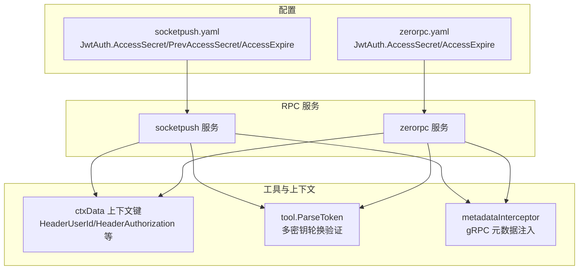
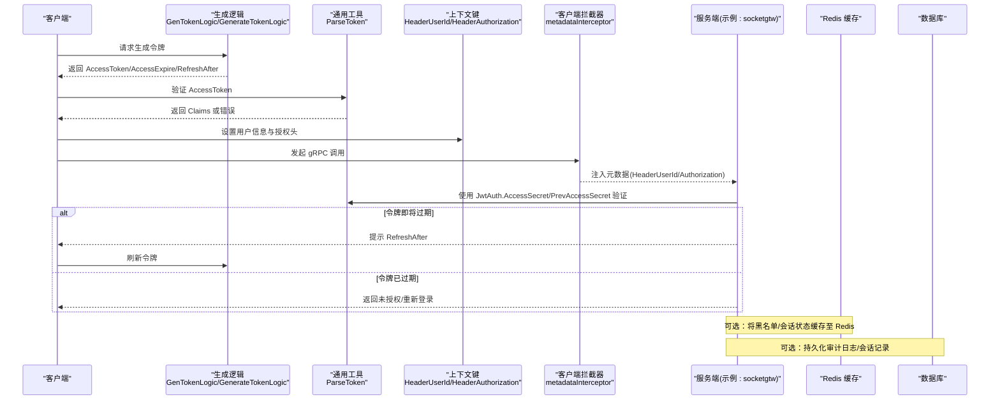
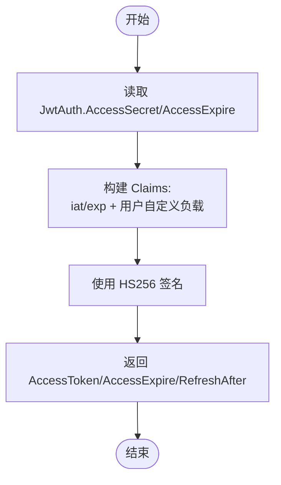
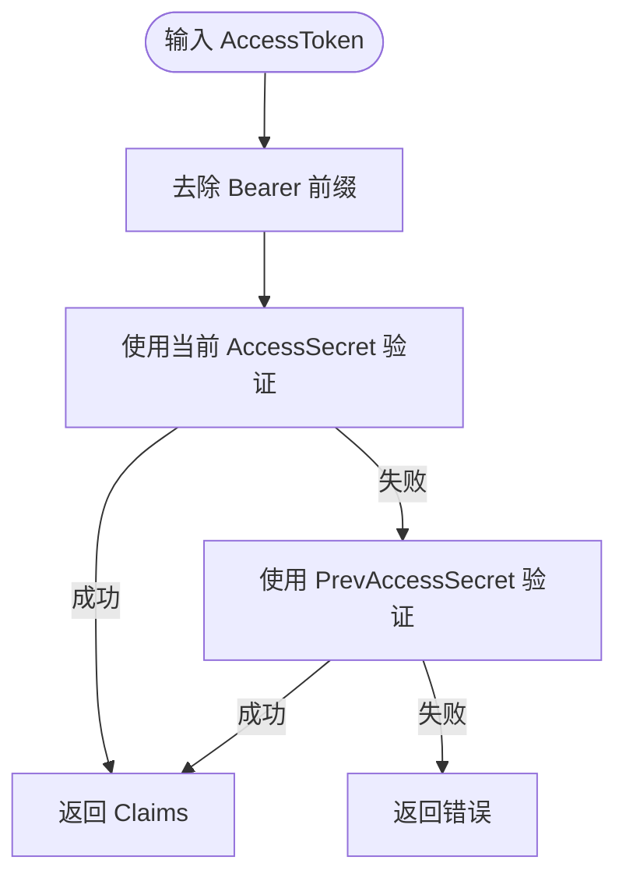
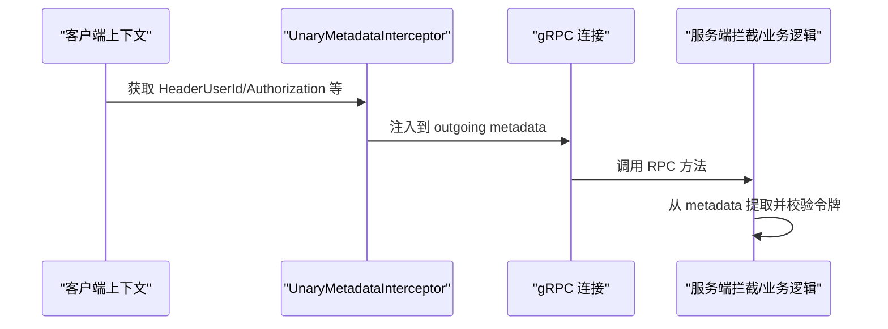
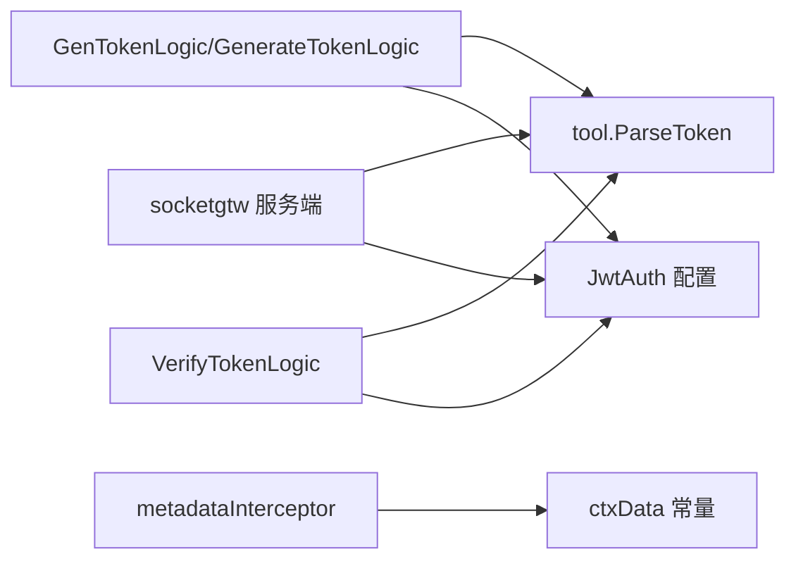

# JWT 令牌管理

<cite>
**本文引用的文件**
- [gentokenlogic.go](file://socketapp/socketpush/internal/logic/gentokenlogic.go)
- [verifytokenlogic.go](file://socketapp/socketpush/internal/logic/verifytokenlogic.go)
- [generatetokenlogic.go](file://zerorpc/internal/logic/generatetokenlogic.go)
- [ctxData.go](file://common/ctxdata/ctxData.go)
- [metadataInterceptor.go](file://common/Interceptor/rpcclient/metadataInterceptor.go)
- [tool.go](file://common/tool/tool.go)
- [socketpush.yaml](file://socketapp/socketpush/etc/socketpush.yaml)
- [zerorpc.yaml](file://zerorpc/etc/zerorpc.yaml)
- [servicecontext.go](file://zerorpc/internal/svc/servicecontext.go)
- [servicecontext.go](file://socketapp/socketgtw/internal/svc/servicecontext.go)
- [server.go](file://common/socketiox/server.go)
</cite>

## 目录
1. [简介](#简介)
2. [项目结构](#项目结构)
3. [核心组件](#核心组件)
4. [架构总览](#架构总览)
5. [详细组件分析](#详细组件分析)
6. [依赖分析](#依赖分析)
7. [性能考虑](#性能考虑)
8. [故障排查指南](#故障排查指南)
9. [结论](#结论)
10. [附录](#附录)

## 简介
本文件系统性阐述 zero-service 中的 JWT 令牌管理方案，覆盖以下主题：
- 令牌生成算法、签名机制与有效期设置
- 令牌解析、验证与刷新流程
- 在 gRPC 元数据中的传递机制（HeaderUserId、HeaderAuthorization 等）
- 令牌存储安全策略（内存、Redis 缓存与数据库持久化）
- 完整的代码示例路径（以源码路径代替具体代码）
- 过期处理、自动刷新与安全注销机制

## 项目结构
围绕 JWT 的相关模块主要分布在如下位置：
- 令牌生成与验证逻辑：socketpush 与 zerorpc 两个 RPC 服务
- gRPC 元数据传递：客户端拦截器
- 工具函数：通用 JWT 解析与上下文键定义
- 配置文件：各服务的 JwtAuth 配置项
- SocketIO 服务端：基于令牌的连接鉴权与会话绑定

图表来源
- [socketpush.yaml:10-13](file://socketapp/socketpush/etc/socketpush.yaml#L10-L13)
- [zerorpc.yaml:33-35](file://zerorpc/etc/zerorpc.yaml#L33-L35)
- [ctxData.go:17-24](file://common/ctxdata/ctxData.go#L17-L24)
- [metadataInterceptor.go:11-32](file://common/Interceptor/rpcclient/metadataInterceptor.go#L11-L32)
- [tool.go:35-65](file://common/tool/tool.go#L35-L65)

章节来源
- [socketpush.yaml:1-28](file://socketapp/socketpush/etc/socketpush.yaml#L1-L28)
- [zerorpc.yaml:1-39](file://zerorpc/etc/zerorpc.yaml#L1-L39)
- [ctxData.go:1-76](file://common/ctxdata/ctxData.go#L1-L76)
- [metadataInterceptor.go:1-56](file://common/Interceptor/rpcclient/metadataInterceptor.go#L1-L56)
- [tool.go:1-469](file://common/tool/tool.go#L1-L469)

## 核心组件
- 令牌生成逻辑
  - socketpush 服务：[GenTokenLogic.GenToken:30-44](file://socketapp/socketpush/internal/logic/gentokenlogic.go#L30-L44)
  - zerorpc 服务：[GenerateTokenLogic.GenerateToken:29-41](file://zerorpc/internal/logic/generatetokenlogic.go#L29-L41)
- 令牌验证逻辑
  - socketpush 服务：[VerifyTokenLogic.VerifyToken:28-49](file://socketapp/socketpush/internal/logic/verifytokenlogic.go#L28-L49)
  - 通用工具：[tool.ParseToken:35-65](file://common/tool/tool.go#L35-L65)
- gRPC 元数据传递
  - 客户端拦截器：[UnaryMetadataInterceptor/StreamTracingInterceptor:11-55](file://common/Interceptor/rpcclient/metadataInterceptor.go#L11-L55)
  - 上下文键常量：[HeaderUserId/HeaderAuthorization 等:17-24](file://common/ctxdata/ctxData.go#L17-L24)
- 配置项
  - socketpush：[JwtAuth.AccessSecret/PrevAccessSecret/AccessExpire:10-13](file://socketapp/socketpush/etc/socketpush.yaml#L10-L13)
  - zerorpc：[JwtAuth.AccessSecret/AccessExpire:33-35](file://zerorpc/etc/zerorpc.yaml#L33-L35)

章节来源
- [gentokenlogic.go:29-78](file://socketapp/socketpush/internal/logic/gentokenlogic.go#L29-L78)
- [generatetokenlogic.go:29-52](file://zerorpc/internal/logic/generatetokenlogic.go#L29-L52)
- [verifytokenlogic.go:28-49](file://socketapp/socketpush/internal/logic/verifytokenlogic.go#L28-L49)
- [tool.go:35-65](file://common/tool/tool.go#L35-L65)
- [metadataInterceptor.go:11-32](file://common/Interceptor/rpcclient/metadataInterceptor.go#L11-L32)
- [ctxData.go:17-24](file://common/ctxdata/ctxData.go#L17-L24)
- [socketpush.yaml:10-13](file://socketapp/socketpush/etc/socketpush.yaml#L10-L13)
- [zerorpc.yaml:33-35](file://zerorpc/etc/zerorpc.yaml#L33-L35)

## 架构总览
下图展示了从生成到验证再到 gRPC 传递的整体流程。

图表来源
- [gentokenlogic.go:30-44](file://socketapp/socketpush/internal/logic/gentokenlogic.go#L30-L44)
- [generatetokenlogic.go:29-41](file://zerorpc/internal/logic/generatetokenlogic.go#L29-L41)
- [verifytokenlogic.go:28-49](file://socketapp/socketpush/internal/logic/verifytokenlogic.go#L28-L49)
- [tool.go:35-65](file://common/tool/tool.go#L35-L65)
- [metadataInterceptor.go:11-32](file://common/Interceptor/rpcclient/metadataInterceptor.go#L11-L32)
- [servicecontext.go:59-74](file://socketapp/socketgtw/internal/svc/servicecontext.go#L59-L74)

## 详细组件分析

### 令牌生成算法与签名机制
- 签名算法：采用 HS256（对称密钥）
- 核心 Claims：
  - exp：过期时间（当前时间 + AccessExpire）
  - iat：签发时间（当前时间）
  - 自定义键：支持附加负载（除标准保留键外）
- 生成流程要点：
  - 读取配置 JwtAuth.AccessSecret 与 AccessExpire
  - 计算 AccessExpire 与 RefreshAfter（通常为过半时触发刷新）
  - 使用 AccessSecret 对 Claims 进行签名

参考实现路径
- [socketpush 生成逻辑:30-44](file://socketapp/socketpush/internal/logic/gentokenlogic.go#L30-L44)
- [zerorpc 生成逻辑:29-41](file://zerorpc/internal/logic/generatetokenlogic.go#L29-L41)
- [Claims 构造与签名:57-78](file://socketapp/socketpush/internal/logic/gentokenlogic.go#L57-L78)

图表来源
- [gentokenlogic.go:30-44](file://socketapp/socketpush/internal/logic/gentokenlogic.go#L30-L44)
- [generatetokenlogic.go:29-41](file://zerorpc/internal/logic/generatetokenlogic.go#L29-L41)
- [gentokenlogic.go:57-78](file://socketapp/socketpush/internal/logic/gentokenlogic.go#L57-L78)

章节来源
- [gentokenlogic.go:29-78](file://socketapp/socketpush/internal/logic/gentokenlogic.go#L29-L78)
- [generatetokenlogic.go:29-52](file://zerorpc/internal/logic/generatetokenlogic.go#L29-L52)

### 令牌解析与验证
- 支持多密钥轮换验证：优先使用当前密钥，失败则尝试 PrevAccessSecret
- 解析流程：
  - 去除 Bearer 前缀（如存在）
  - 依次使用 AccessSecret 与 PrevAccessSecret 验证
  - 成功则返回 Claims；否则返回错误

参考实现路径
- [socketpush 验证逻辑:28-49](file://socketapp/socketpush/internal/logic/verifytokenlogic.go#L28-L49)
- [通用 ParseToken:35-65](file://common/tool/tool.go#L35-L65)
- [socketgtw 服务端验证:59-74](file://socketapp/socketgtw/internal/svc/servicecontext.go#L59-L74)

图表来源
- [verifytokenlogic.go:28-49](file://socketapp/socketpush/internal/logic/verifytokenlogic.go#L28-L49)
- [tool.go:35-65](file://common/tool/tool.go#L35-L65)
- [servicecontext.go:59-74](file://socketapp/socketgtw/internal/svc/servicecontext.go#L59-L74)

章节来源
- [verifytokenlogic.go:28-49](file://socketapp/socketpush/internal/logic/verifytokenlogic.go#L28-L49)
- [tool.go:35-65](file://common/tool/tool.go#L35-L65)
- [servicecontext.go:59-74](file://socketapp/socketgtw/internal/svc/servicecontext.go#L59-L74)

### 令牌有效期设置与刷新策略
- 有效期：由 JwtAuth.AccessExpire 决定（秒）
- 刷新提示：服务端返回 RefreshAfter（通常为过半时）
- 刷新流程：
  - 客户端在 RefreshAfter 到来前发起刷新请求
  - 服务端重新签发新令牌并返回

参考实现路径
- [socketpush 返回 RefreshAfter:30-44](file://socketapp/socketpush/internal/logic/gentokenlogic.go#L30-L44)
- [zerorpc 返回 RefreshAfter:29-41](file://zerorpc/internal/logic/generatetokenlogic.go#L29-L41)

章节来源
- [gentokenlogic.go:30-44](file://socketapp/socketpush/internal/logic/gentokenlogic.go#L30-L44)
- [generatetokenlogic.go:29-41](file://zerorpc/internal/logic/generatetokenlogic.go#L29-L41)

### gRPC 元数据传递机制
- 客户端拦截器将上下文中的用户信息与授权头注入到 gRPC 元数据中：
  - HeaderUserId、HeaderUserName、HeaderDeptCode、HeaderAuthorization、HeaderTraceId
- 服务端可从元数据中提取并校验令牌（结合 JwtAuth.AccessSecret/PrevAccessSecret）

参考实现路径
- [metadataInterceptor 注入逻辑:11-32](file://common/Interceptor/rpcclient/metadataInterceptor.go#L11-L32)
- [Header 常量定义:17-24](file://common/ctxdata/ctxData.go#L17-L24)
- [服务端验证示例:59-74](file://socketapp/socketgtw/internal/svc/servicecontext.go#L59-L74)

图表来源
- [metadataInterceptor.go:11-32](file://common/Interceptor/rpcclient/metadataInterceptor.go#L11-L32)
- [ctxData.go:17-24](file://common/ctxdata/ctxData.go#L17-L24)
- [servicecontext.go:59-74](file://socketapp/socketgtw/internal/svc/servicecontext.go#L59-L74)

章节来源
- [metadataInterceptor.go:11-32](file://common/Interceptor/rpcclient/metadataInterceptor.go#L11-L32)
- [ctxData.go:17-24](file://common/ctxdata/ctxData.go#L17-L24)
- [servicecontext.go:59-74](file://socketapp/socketgtw/internal/svc/servicecontext.go#L59-L74)

### 令牌存储安全策略
- 内存存储
  - 适用于短期会话与轻量场景
  - 优点：低延迟、易部署
  - 风险：重启丢失、无法跨实例共享
- Redis 缓存
  - 推荐用于黑名单、会话状态、限流等
  - 优势：分布式共享、持久化可选、原子操作
  - 实践：将过期令牌加入黑名单集合；会话状态与权限映射缓存
- 数据库持久化
  - 适合审计日志、登录历史、会话明细
  - 建议：敏感字段加密存储；索引优化查询（如用户 ID、令牌哈希）
- 与项目现有能力的结合
  - 服务上下文已内置 Redis 客户端，便于扩展黑名单与会话缓存
  - 参考：[zerorpc 服务上下文 Redis 初始化:36-93](file://zerorpc/internal/svc/servicecontext.go#L36-L93)

章节来源
- [servicecontext.go:36-93](file://zerorpc/internal/svc/servicecontext.go#L36-L93)

### SocketIO 令牌鉴权与会话绑定
- 服务端支持基于令牌的连接鉴权与会话元数据绑定
- 关键点：
  - 从握手参数或上下文中提取 token
  - 可选：使用带 Claims 的验证器，将指定键注入会话元数据
  - 可选：连接钩子向下游事件推送会话元数据

参考实现路径
- [SocketIO 服务端鉴权与会话绑定:337-380](file://common/socketiox/server.go#L337-L380)

章节来源
- [server.go:337-380](file://common/socketiox/server.go#L337-L380)

## 依赖分析
- 组件耦合
  - 生成与验证均依赖 JwtAuth 配置与工具函数
  - gRPC 元数据传递依赖 ctxData 常量
  - 服务端验证依赖工具函数与配置
- 外部依赖
  - golang-jwt/jwt/v4：JWT 生成与解析
  - go-zero：配置加载、Redis/SQLX、拦截器框架

图表来源
- [gentokenlogic.go:30-44](file://socketapp/socketpush/internal/logic/gentokenlogic.go#L30-L44)
- [generatetokenlogic.go:29-41](file://zerorpc/internal/logic/generatetokenlogic.go#L29-L41)
- [verifytokenlogic.go:28-49](file://socketapp/socketpush/internal/logic/verifytokenlogic.go#L28-L49)
- [tool.go:35-65](file://common/tool/tool.go#L35-L65)
- [metadataInterceptor.go:11-32](file://common/Interceptor/rpcclient/metadataInterceptor.go#L11-L32)
- [ctxData.go:17-24](file://common/ctxdata/ctxData.go#L17-L24)
- [servicecontext.go:59-74](file://socketapp/socketgtw/internal/svc/servicecontext.go#L59-L74)

章节来源
- [gentokenlogic.go:29-78](file://socketapp/socketpush/internal/logic/gentokenlogic.go#L29-L78)
- [generatetokenlogic.go:29-52](file://zerorpc/internal/logic/generatetokenlogic.go#L29-L52)
- [verifytokenlogic.go:28-49](file://socketapp/socketpush/internal/logic/verifytokenlogic.go#L28-L49)
- [tool.go:35-65](file://common/tool/tool.go#L35-L65)
- [metadataInterceptor.go:11-32](file://common/Interceptor/rpcclient/metadataInterceptor.go#L11-L32)
- [ctxData.go:17-24](file://common/ctxdata/ctxData.go#L17-L24)
- [servicecontext.go:59-74](file://socketapp/socketgtw/internal/svc/servicecontext.go#L59-L74)

## 性能考虑
- 密钥轮换验证：多密钥顺序尝试，避免单点失败带来的抖动
- 令牌有效期：合理设置 AccessExpire，平衡安全性与刷新频率
- gRPC 元数据：仅注入必要字段，减少传输开销
- 缓存策略：将频繁访问的令牌状态放入 Redis，降低数据库压力
- 并发与幂等：刷新与注销操作需保证幂等与一致性

## 故障排查指南
- 常见问题
  - 令牌为空：检查客户端是否正确设置 HeaderAuthorization
  - 验证失败：确认 JwtAuth.AccessSecret 与 PrevAccessSecret 是否正确配置
  - gRPC 未携带用户信息：检查 metadataInterceptor 是否生效
- 排查步骤
  - 生成阶段：核对 AccessToken/AccessExpire/RefreshAfter 返回值
  - 验证阶段：逐个密钥尝试，定位密钥轮换问题
  - 服务端：确认从元数据提取并校验令牌的逻辑

章节来源
- [verifytokenlogic.go:28-49](file://socketapp/socketpush/internal/logic/verifytokenlogic.go#L28-L49)
- [tool.go:35-65](file://common/tool/tool.go#L35-L65)
- [metadataInterceptor.go:11-32](file://common/Interceptor/rpcclient/metadataInterceptor.go#L11-L32)
- [servicecontext.go:59-74](file://socketapp/socketgtw/internal/svc/servicecontext.go#L59-L74)

## 结论
本方案以 HS256 对称签名为核心，结合多密钥轮换验证与 gRPC 元数据传递，实现了简洁可靠的令牌管理闭环。配合 Redis 与数据库的分层存储，可在性能与安全之间取得良好平衡。建议在生产环境进一步完善黑名单、审计日志与自动化刷新策略。

## 附录
- 配置示例路径
  - [socketpush.yaml JwtAuth:10-13](file://socketapp/socketpush/etc/socketpush.yaml#L10-L13)
  - [zerorpc.yaml JwtAuth:33-35](file://zerorpc/etc/zerorpc.yaml#L33-L35)
- 关键实现路径
  - [生成逻辑:30-44](file://socketapp/socketpush/internal/logic/gentokenlogic.go#L30-L44)
  - [验证逻辑:28-49](file://socketapp/socketpush/internal/logic/verifytokenlogic.go#L28-L49)
  - [gRPC 元数据注入:11-32](file://common/Interceptor/rpcclient/metadataInterceptor.go#L11-L32)
  - [通用 JWT 解析:35-65](file://common/tool/tool.go#L35-L65)
  - [SocketIO 鉴权与会话绑定:337-380](file://common/socketiox/server.go#L337-L380)