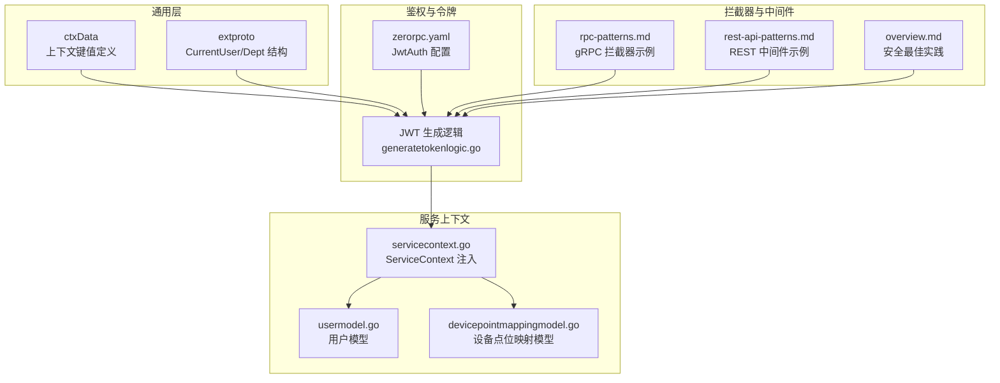
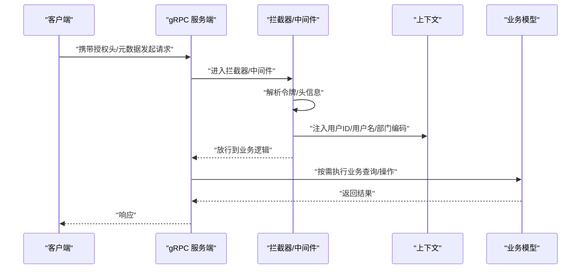
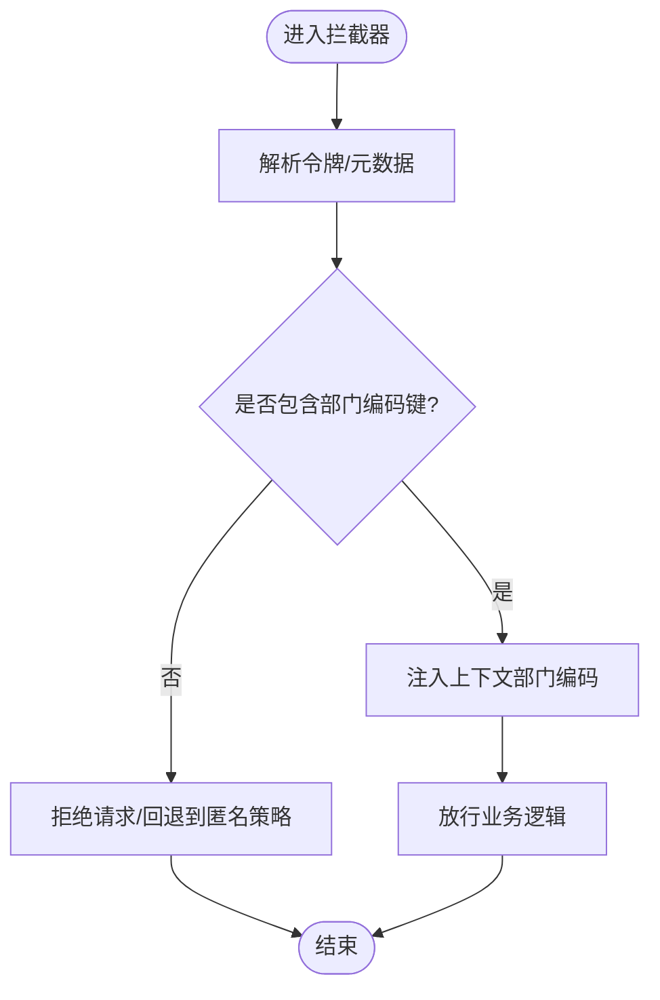
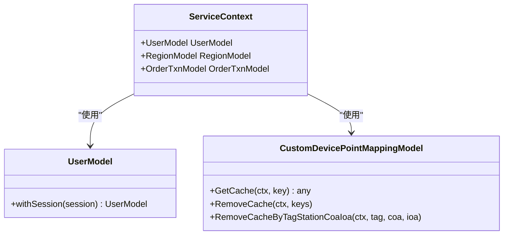
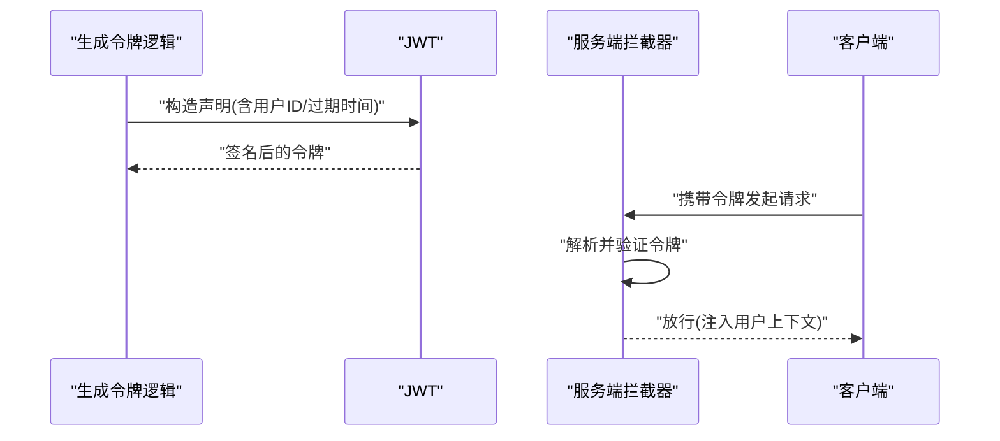
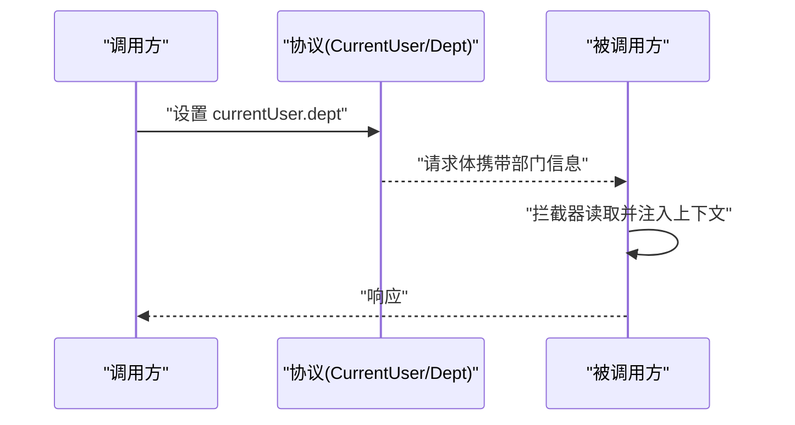
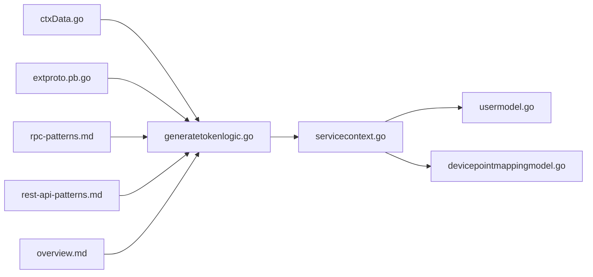

# RBAC 权限控制

<cite>
**本文引用的文件**   
- [ctxData.go](file://common/ctxdata/ctxData.go)
- [extproto.pb.go](file://third_party/extproto/extproto.pb.go)
- [zerorpc.yaml](file://zerorpc/etc/zerorpc.yaml)
- [servicecontext.go](file://zerorpc/internal/svc/servicecontext.go)
- [generatetokenlogic.go](file://zerorpc/internal/logic/generatetokenlogic.go)
- [rpc-patterns.md](file://.trae/skills/zero-skills/references/rpc-patterns.md)
- [rest-api-patterns.md](file://.trae/skills/zero-skills/references/rest-api-patterns.md)
- [overview.md](file://.trae/skills/zero-skills/best-practices/overview.md)
- [usermodel.go](file://model/usermodel.go)
- [devicepointmappingmodel.go](file://model/devicepointmappingmodel.go)
- [devicepointmappingmodel_gen.go](file://model/devicepointmappingmodel_gen.go)
- [ieccaller.proto](file://app/ieccaller/ieccaller/ieccaller.proto)
- [ieccaller.pb.go](file://app/ieccaller/ieccaller/ieccaller.pb.go)
</cite>

## 目录
1. [简介](#简介)
2. [项目结构](#项目结构)
3. [核心组件](#核心组件)
4. [架构总览](#架构总览)
5. [组件详解](#组件详解)
6. [依赖关系分析](#依赖关系分析)
7. [性能考量](#性能考量)
8. [故障排查指南](#故障排查指南)
9. [结论](#结论)
10. [附录](#附录)

## 简介
本文件面向 zero-service 的 RBAC 权限控制设计与实现，围绕以下目标展开：
- 角色定义、权限分配与访问控制列表的设计模式
- 用户角色映射机制（角色继承与权限叠加规则）
- 权限检查实现（静态权限检查与动态权限评估）
- 部门权限隔离机制（通过 CtxDeptCodeKey 实现组织级权限控制）
- 权限缓存策略与权限更新同步机制
- 完整的权限控制代码示例与最佳实践指南

## 项目结构
与 RBAC 相关的关键模块分布如下：
- 上下文与元数据：在公共模块中统一定义用户标识、部门标识、授权头等键值，便于跨服务传递
- 协议扩展：通过第三方协议扩展定义当前用户与部门信息，用于跨服务传递上下文
- 令牌签发：在零信任 RPC 服务中生成 JWT，并将用户与部门信息写入令牌声明
- 模型与缓存：用户模型与设备点位映射模型均具备缓存能力，支撑权限查询与快速校验
- 中间件与拦截器：REST 与 gRPC 的认证中间件/拦截器模式可作为权限拦截的参考实现

**图表来源**
- [ctxData.go:9-24](file://common/ctxdata/ctxData.go#L9-L24)
- [extproto.pb.go:143-270](file://third_party/extproto/extproto.pb.go#L143-L270)
- [generatetokenlogic.go:29-52](file://zerorpc/internal/logic/generatetokenlogic.go#L29-L52)
- [zerorpc.yaml:33-35](file://zerorpc/etc/zerorpc.yaml#L33-L35)
- [servicecontext.go:19-33](file://zerorpc/internal/svc/servicecontext.go#L19-L33)
- [usermodel.go:10-18](file://model/usermodel.go#L10-L18)
- [devicepointmappingmodel.go:39-68](file://model/devicepointmappingmodel.go#L39-L68)
- [rpc-patterns.md:370-415](file://.trae/skills/zero-skills/references/rpc-patterns.md#L370-L415)
- [rest-api-patterns.md:197-262](file://.trae/skills/zero-skills/references/rest-api-patterns.md#L197-L262)
- [overview.md:610-645](file://.trae/skills/zero-skills/best-practices/overview.md#L610-L645)

**章节来源**
- [ctxData.go:9-24](file://common/ctxdata/ctxData.go#L9-L24)
- [extproto.pb.go:143-270](file://third_party/extproto/extproto.pb.go#L143-L270)
- [generatetokenlogic.go:29-52](file://zerorpc/internal/logic/generatetokenlogic.go#L29-L52)
- [zerorpc.yaml:33-35](file://zerorpc/etc/zerorpc.yaml#L33-L35)
- [servicecontext.go:19-33](file://zerorpc/internal/svc/servicecontext.go#L19-L33)
- [usermodel.go:10-18](file://model/usermodel.go#L10-L18)
- [devicepointmappingmodel.go:39-68](file://model/devicepointmappingmodel.go#L39-L68)
- [rpc-patterns.md:370-415](file://.trae/skills/zero-skills/references/rpc-patterns.md#L370-L415)
- [rest-api-patterns.md:197-262](file://.trae/skills/zero-skills/references/rest-api-patterns.md#L197-L262)
- [overview.md:610-645](file://.trae/skills/zero-skills/best-practices/overview.md#L610-L645)

## 核心组件
- 上下文键值与元数据
  - 用户标识键、用户名键、部门编码键、授权头键、追踪 ID 键等在公共模块集中定义，确保跨服务一致
  - gRPC 元数据头键采用小写规范，便于拦截器读取
- 当前用户与部门信息
  - 第三方协议扩展定义了 CurrentUser 与 Dept 结构，支持多部门集合，便于在请求中携带组织级上下文
- 令牌签发与声明
  - 在令牌中写入用户标识与过期时间等标准声明，结合自定义键值实现角色与部门信息的传递
- 服务上下文与模型
  - ServiceContext 注入用户模型与各类业务模型；用户模型接口化，设备点位映射模型具备缓存封装
- 拦截器与中间件
  - 提供 gRPC 与 REST 的认证拦截器/中间件示例，可作为权限拦截的参考实现

**章节来源**
- [ctxData.go:9-24](file://common/ctxdata/ctxData.go#L9-L24)
- [extproto.pb.go:143-270](file://third_party/extproto/extproto.pb.go#L143-L270)
- [generatetokenlogic.go:29-52](file://zerorpc/internal/logic/generatetokenlogic.go#L29-L52)
- [servicecontext.go:19-33](file://zerorpc/internal/svc/servicecontext.go#L19-L33)
- [usermodel.go:10-18](file://model/usermodel.go#L10-L18)
- [devicepointmappingmodel.go:39-68](file://model/devicepointmappingmodel.go#L39-L68)
- [rpc-patterns.md:370-415](file://.trae/skills/zero-skills/references/rpc-patterns.md#L370-L415)
- [rest-api-patterns.md:197-262](file://.trae/skills/zero-skills/references/rest-api-patterns.md#L197-L262)

## 架构总览
RBAC 在 zero-service 中的总体流程：
- 登录与令牌签发：用户登录后生成 JWT，其中包含用户标识与过期时间等声明
- 请求传递：客户端在请求头中携带授权信息；gRPC 使用元数据头，REST 使用 Authorization 头
- 服务端拦截：服务端拦截器/中间件解析令牌，提取用户与部门信息并注入到上下文
- 权限检查：根据上下文中的用户与部门信息，结合角色与权限映射进行静态或动态校验
- 数据访问：在需要组织隔离的场景，查询时以部门编码为过滤条件，确保数据边界

**图表来源**
- [generatetokenlogic.go:29-52](file://zerorpc/internal/logic/generatetokenlogic.go#L29-L52)
- [ctxData.go:9-24](file://common/ctxdata/ctxData.go#L9-L24)
- [rpc-patterns.md:370-415](file://.trae/skills/zero-skills/references/rpc-patterns.md#L370-L415)
- [rest-api-patterns.md:197-262](file://.trae/skills/zero-skills/references/rest-api-patterns.md#L197-L262)

## 组件详解

### 角色定义与权限映射
- 角色与权限映射建议采用“角色-权限”二维表与“用户-角色”关联表设计，配合“角色-角色”继承表实现层级继承
- 权限表达式可采用布尔表达式或规则引擎，支持动态评估
- 建议在令牌中携带角色集合或角色编码，便于服务端快速判断

[本节为概念性说明，不直接分析具体文件，故不附加“章节来源”]

### 用户角色映射与继承
- 用户角色映射：用户与角色之间为多对多关系，支持批量授予与撤销
- 角色继承：角色可继承其他角色的权限，形成权限叠加；继承链应避免循环依赖
- 权限叠加规则：同名权限按“允许集”合并，冲突时以显式拒绝为准

[本节为概念性说明，不直接分析具体文件，故不附加“章节来源”]

### 权限检查实现
- 静态权限检查：在拦截器/中间件中读取令牌中的角色集合，快速匹配白名单/黑名单
- 动态权限评估：针对复杂权限表达式，结合上下文变量（如部门编码、资源属性）进行实时计算
- 组织级隔离：在需要按部门隔离的接口中，强制要求请求上下文中包含部门编码键值

[本节为概念性说明，不直接分析具体文件，故不附加“章节来源”]

### 部门权限隔离机制（CtxDeptCodeKey）
- 在上下文键值定义中提供部门编码键，服务端拦截器/中间件从令牌或元数据中提取该键并注入上下文
- 业务逻辑在执行敏感操作时，优先从上下文中读取部门编码，作为数据查询的过滤条件
- 对于跨服务调用，可通过协议扩展 CurrentUser/Dept 字段在请求中传递部门信息

**图表来源**
- [ctxData.go:9-24](file://common/ctxdata/ctxData.go#L9-L24)
- [extproto.pb.go:143-270](file://third_party/extproto/extproto.pb.go#L143-L270)
- [rpc-patterns.md:370-415](file://.trae/skills/zero-skills/references/rpc-patterns.md#L370-L415)
- [rest-api-patterns.md:197-262](file://.trae/skills/zero-skills/references/rest-api-patterns.md#L197-L262)

**章节来源**
- [ctxData.go:9-24](file://common/ctxdata/ctxData.go#L9-L24)
- [extproto.pb.go:143-270](file://third_party/extproto/extproto.pb.go#L143-L270)

### 权限缓存策略与更新同步
- 缓存对象
  - 用户角色与权限映射：按用户维度缓存，键为用户标识
  - 部门-资源映射：按部门维度缓存，键为部门编码
  - 设备点位映射：已具备缓存封装，可用于快速定位资源归属
- 缓存失效
  - 角色变更、权限变更、继承关系变更时，主动清理对应用户的缓存
  - 部门变更时，清理该用户的部门相关缓存
- 同步机制
  - 事件驱动：通过消息队列广播权限变更事件，各服务节点本地刷新缓存
  - 强制刷新：在高并发场景下，可采用带版本号的缓存键，读取时校验版本

**图表来源**
- [usermodel.go:10-18](file://model/usermodel.go#L10-L18)
- [devicepointmappingmodel.go:39-68](file://model/devicepointmappingmodel.go#L39-L68)
- [servicecontext.go:19-33](file://zerorpc/internal/svc/servicecontext.go#L19-L33)

**章节来源**
- [usermodel.go:10-18](file://model/usermodel.go#L10-L18)
- [devicepointmappingmodel.go:39-68](file://model/devicepointmappingmodel.go#L39-L68)
- [devicepointmappingmodel_gen.go:39-68](file://model/devicepointmappingmodel_gen.go#L39-L68)

### 令牌签发与拦截器/中间件参考
- 令牌签发：在逻辑层生成 JWT，包含用户标识与过期时间等声明
- gRPC 拦截器：从元数据中读取授权头，验证令牌并注入用户信息
- REST 中间件：从请求头中读取授权头，验证令牌并注入用户信息

**图表来源**
- [generatetokenlogic.go:29-52](file://zerorpc/internal/logic/generatetokenlogic.go#L29-L52)
- [rpc-patterns.md:370-415](file://.trae/skills/zero-skills/references/rpc-patterns.md#L370-L415)
- [rest-api-patterns.md:197-262](file://.trae/skills/zero-skills/references/rest-api-patterns.md#L197-L262)
- [overview.md:610-645](file://.trae/skills/zero-skills/best-practices/overview.md#L610-L645)

**章节来源**
- [generatetokenlogic.go:29-52](file://zerorpc/internal/logic/generatetokenlogic.go#L29-L52)
- [rpc-patterns.md:370-415](file://.trae/skills/zero-skills/references/rpc-patterns.md#L370-L415)
- [rest-api-patterns.md:197-262](file://.trae/skills/zero-skills/references/rest-api-patterns.md#L197-L262)
- [overview.md:610-645](file://.trae/skills/zero-skills/best-practices/overview.md#L610-L645)

### 跨服务传递组织上下文
- 在协议中使用 CurrentUser/Dept 字段，确保部门信息随请求一起传递
- 服务端在拦截器/中间件中读取该字段，注入到上下文中，供后续权限检查使用

**图表来源**
- [extproto.pb.go:143-270](file://third_party/extproto/extproto.pb.go#L143-L270)
- [ieccaller.proto:472-507](file://app/ieccaller/ieccaller/ieccaller.proto#L472-L507)
- [ieccaller.pb.go:1133-1256](file://app/ieccaller/ieccaller/ieccaller.pb.go#L1133-L1256)

**章节来源**
- [extproto.pb.go:143-270](file://third_party/extproto/extproto.pb.go#L143-L270)
- [ieccaller.proto:472-507](file://app/ieccaller/ieccaller/ieccaller.proto#L472-L507)
- [ieccaller.pb.go:1133-1256](file://app/ieccaller/ieccaller/ieccaller.pb.go#L1133-L1256)

## 依赖关系分析
- 上下文键值与协议扩展共同构成权限控制的“输入”
- 令牌签发与拦截器/中间件构成权限控制的“入口”
- 服务上下文与模型构成权限控制的“执行与存储”
- 缓存封装与失效策略构成权限控制的“性能与一致性”

**图表来源**
- [ctxData.go:9-24](file://common/ctxdata/ctxData.go#L9-L24)
- [extproto.pb.go:143-270](file://third_party/extproto/extproto.pb.go#L143-L270)
- [generatetokenlogic.go:29-52](file://zerorpc/internal/logic/generatetokenlogic.go#L29-L52)
- [servicecontext.go:19-33](file://zerorpc/internal/svc/servicecontext.go#L19-L33)
- [usermodel.go:10-18](file://model/usermodel.go#L10-L18)
- [devicepointmappingmodel.go:39-68](file://model/devicepointmappingmodel.go#L39-L68)
- [rpc-patterns.md:370-415](file://.trae/skills/zero-skills/references/rpc-patterns.md#L370-L415)
- [rest-api-patterns.md:197-262](file://.trae/skills/zero-skills/references/rest-api-patterns.md#L197-L262)
- [overview.md:610-645](file://.trae/skills/zero-skills/best-practices/overview.md#L610-L645)

**章节来源**
- [ctxData.go:9-24](file://common/ctxdata/ctxData.go#L9-L24)
- [extproto.pb.go:143-270](file://third_party/extproto/extproto.pb.go#L143-L270)
- [generatetokenlogic.go:29-52](file://zerorpc/internal/logic/generatetokenlogic.go#L29-L52)
- [servicecontext.go:19-33](file://zerorpc/internal/svc/servicecontext.go#L19-L33)
- [usermodel.go:10-18](file://model/usermodel.go#L10-L18)
- [devicepointmappingmodel.go:39-68](file://model/devicepointmappingmodel.go#L39-L68)
- [rpc-patterns.md:370-415](file://.trae/skills/zero-skills/references/rpc-patterns.md#L370-L415)
- [rest-api-patterns.md:197-262](file://.trae/skills/zero-skills/references/rest-api-patterns.md#L197-L262)
- [overview.md:610-645](file://.trae/skills/zero-skills/best-practices/overview.md#L610-L645)

## 性能考量
- 缓存命中率：将用户角色与部门映射放入热点缓存，减少数据库访问
- 批量查询：权限检查可批量加载用户角色，降低多次往返
- 过期与刷新：合理设置令牌与缓存过期时间，结合事件驱动刷新
- 降级策略：在权限服务不可用时，采用宽松或严格降级策略，保证系统可用性

[本节为通用性能建议，不直接分析具体文件，故不附加“章节来源”]

## 故障排查指南
- 令牌无效
  - 检查令牌签名密钥与过期时间配置
  - 确认客户端是否正确携带授权头/元数据
- 上下文缺失
  - 拦截器/中间件未正确解析令牌或未注入用户/部门信息
  - 协议中未携带 CurrentUser/Dept
- 权限误判
  - 缓存未及时失效导致旧权限生效
  - 继承链存在环或叠加规则未按预期处理
- 数据越权
  - 查询未使用部门编码过滤条件
  - 跨服务调用未传递部门信息

**章节来源**
- [zerorpc.yaml:33-35](file://zerorpc/etc/zerorpc.yaml#L33-L35)
- [generatetokenlogic.go:29-52](file://zerorpc/internal/logic/generatetokenlogic.go#L29-L52)
- [ctxData.go:9-24](file://common/ctxdata/ctxData.go#L9-L24)
- [extproto.pb.go:143-270](file://third_party/extproto/extproto.pb.go#L143-L270)

## 结论
zero-service 已具备 RBAC 的基础能力：统一的上下文键值、协议扩展的组织上下文、令牌签发与拦截器/中间件模式。在此基础上，建议补充角色-权限映射、继承与叠加规则、缓存与失效策略以及跨服务权限传播机制，即可形成完整的 RBAC 权限控制体系。

[本节为总结性内容，不直接分析具体文件，故不附加“章节来源”]

## 附录
- 最佳实践要点
  - 令牌中仅包含必要声明，避免过度膨胀
  - 严格区分静态检查与动态评估，前者优先
  - 组织级隔离必须强制执行，不得绕过
  - 缓存与同步需配套设计，保证一致性与性能

**章节来源**
- [overview.md:610-645](file://.trae/skills/zero-skills/best-practices/overview.md#L610-L645)