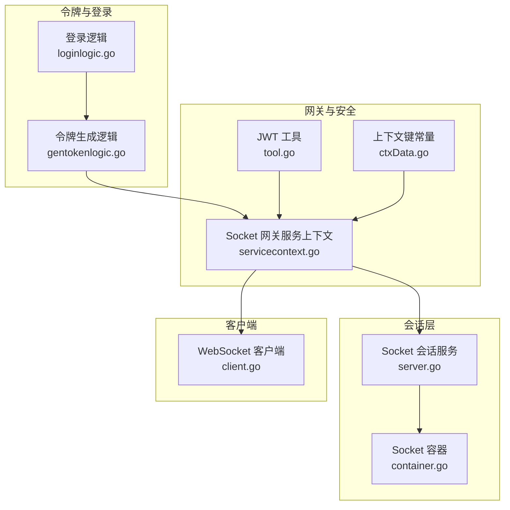
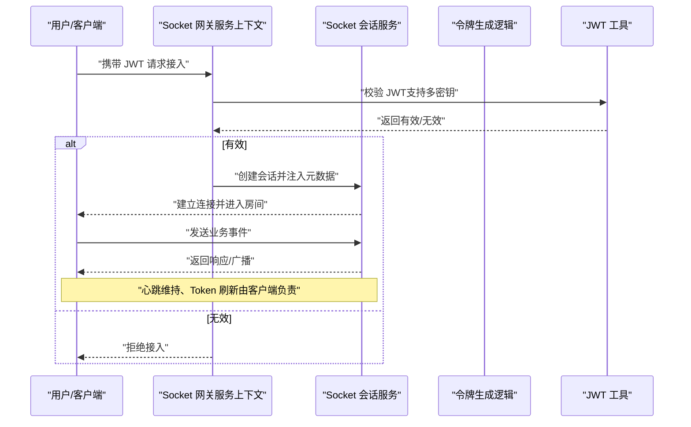
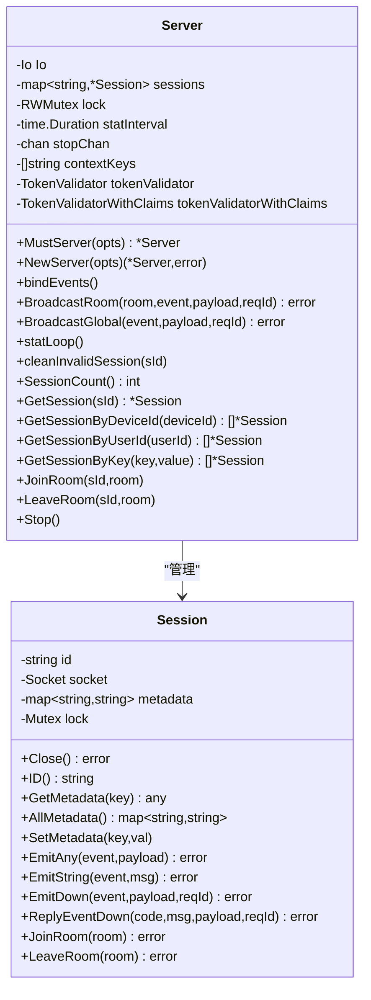
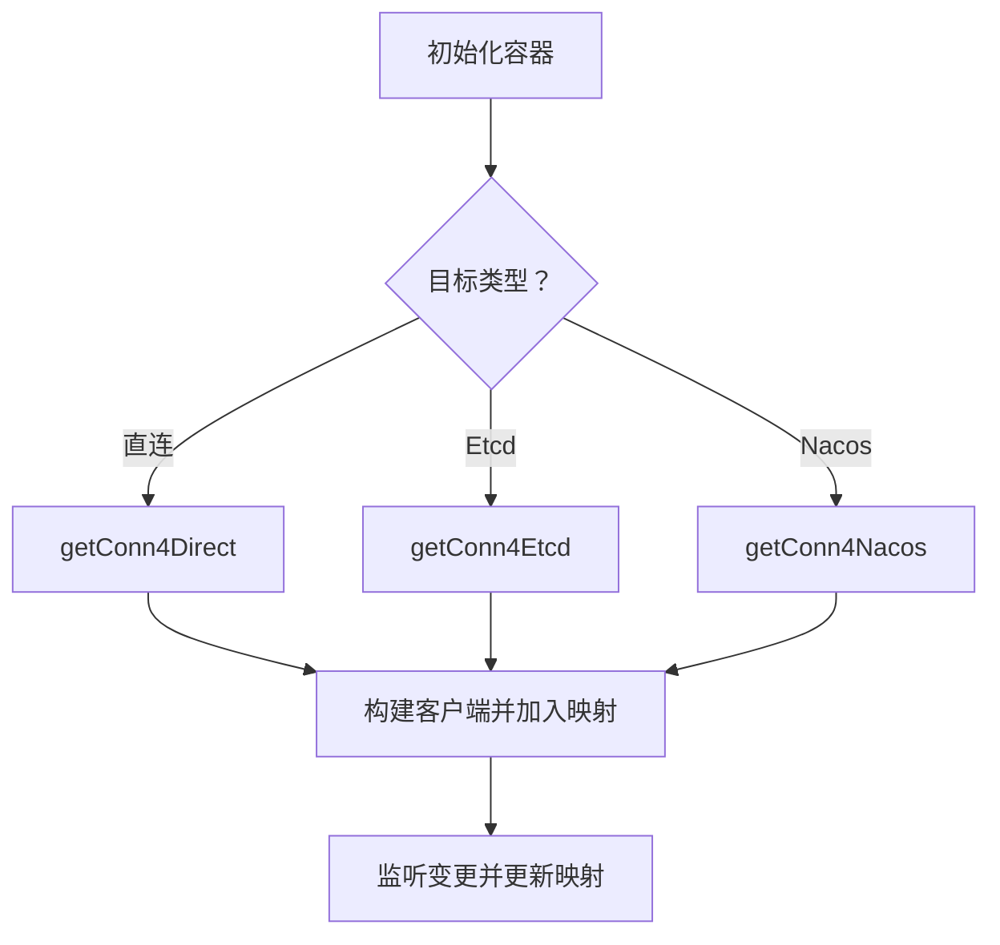
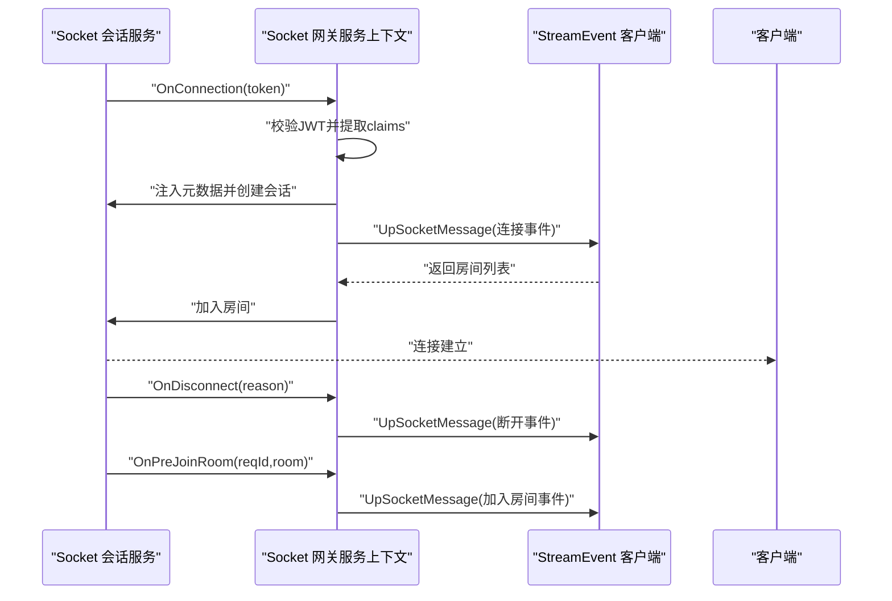
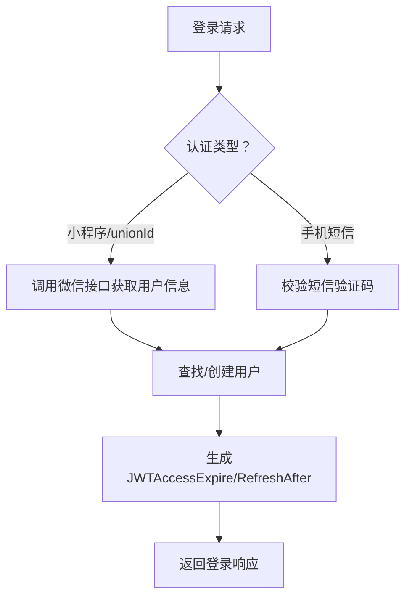
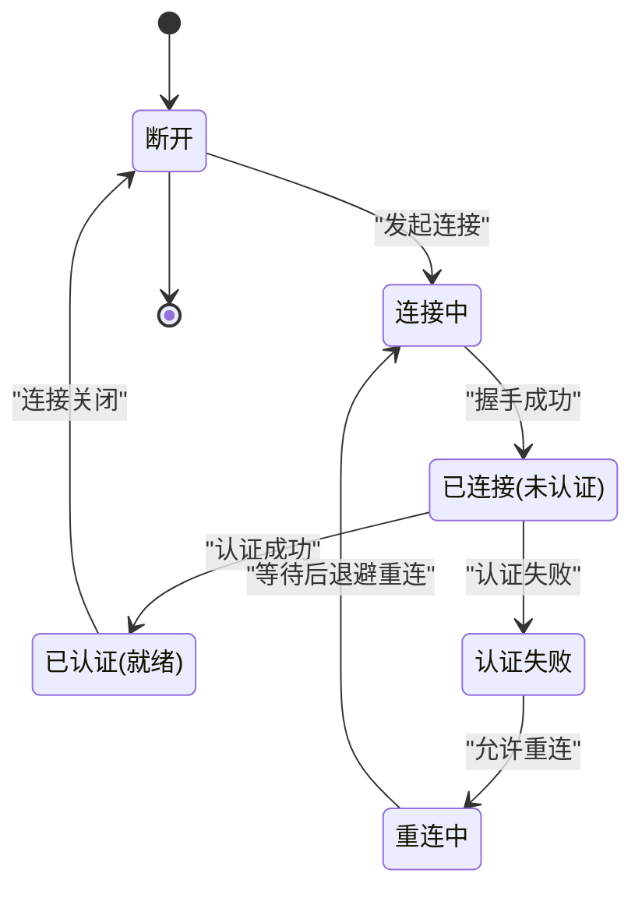
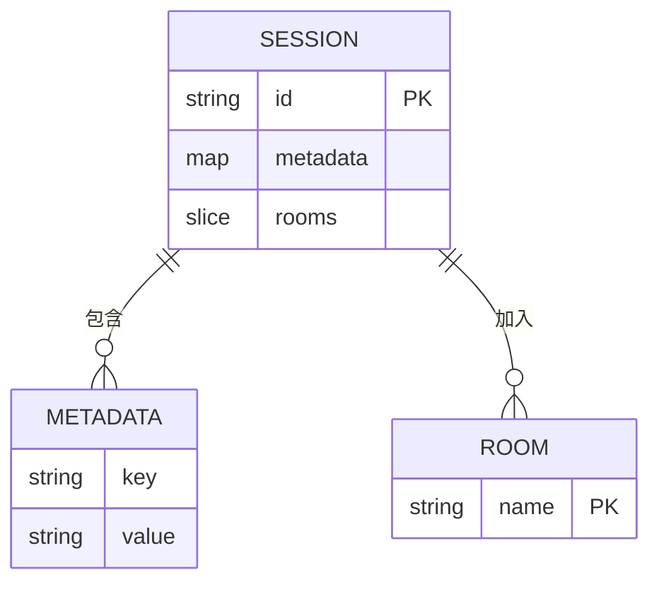
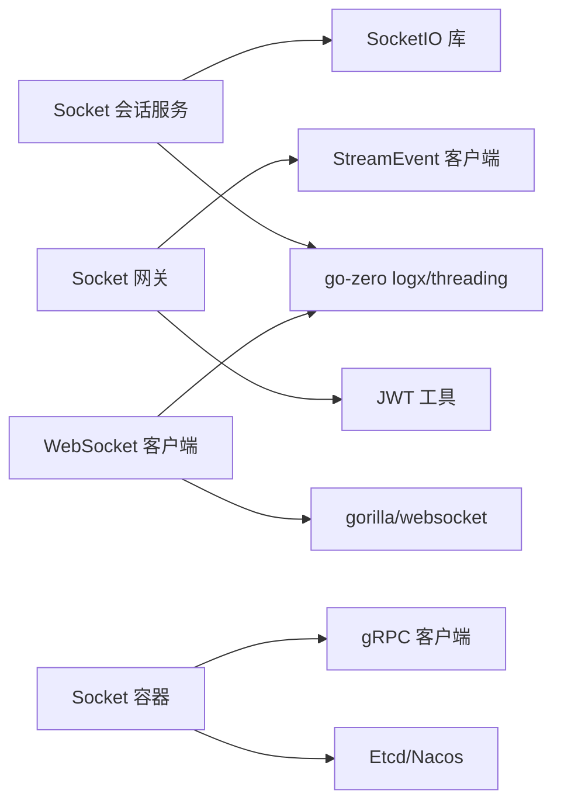

# 会话管理

<cite>
**本文引用的文件**
- [common/socketiox/server.go](file://common/socketiox/server.go)
- [common/socketiox/container.go](file://common/socketiox/container.go)
- [socketapp/socketgtw/internal/svc/servicecontext.go](file://socketapp/socketgtw/internal/svc/servicecontext.go)
- [socketapp/socketpush/internal/logic/gentokenlogic.go](file://socketapp/socketpush/internal/logic/gentokenlogic.go)
- [zerorpc/internal/logic/loginlogic.go](file://zerorpc/internal/logic/loginlogic.go)
- [common/wsx/client.go](file://common/wsx/client.go)
- [common/ctxdata/ctxData.go](file://common/ctxdata/ctxData.go)
- [common/tool/tool.go](file://common/tool/tool.go)
</cite>

## 目录
1. [引言](#引言)
2. [项目结构](#项目结构)
3. [核心组件](#核心组件)
4. [架构总览](#架构总览)
5. [详细组件分析](#详细组件分析)
6. [依赖分析](#依赖分析)
7. [性能考量](#性能考量)
8. [故障排查指南](#故障排查指南)
9. [结论](#结论)
10. [附录](#附录)

## 引言
本文件围绕 zero-service 的会话管理系统，系统性阐述会话的创建、维护与销毁流程；会话状态存储方案（内存、分布式缓存、数据库）；会话超时与自动续期策略；会话安全（防会话固定与会话劫持）；多设备登录与并发控制；以及会话数据结构设计（用户信息、权限信息、上下文数据）。文档同时给出关键实现路径与最佳实践，帮助开发者在不直接阅读源码的情况下理解与扩展会话能力。

## 项目结构
会话管理涉及以下模块：
- 通用 Socket 会话服务：负责会话生命周期、事件处理、房间管理与统计上报
- Socket 容器：负责与上游服务的动态发现与连接池管理
- Socket 网关服务上下文：负责 JWT 校验、会话元数据注入、连接/断开钩子
- 令牌生成与登录：负责 JWT 生成、刷新时机与登录流程
- WebSocket 客户端：负责心跳、重连、Token 刷新与认证超时
- 上下文与工具：负责跨服务传递的授权上下文与 JWT 解析

**图表来源**
- [common/socketiox/server.go](file://common/socketiox/server.go)
- [common/socketiox/container.go](file://common/socketiox/container.go)
- [socketapp/socketgtw/internal/svc/servicecontext.go](file://socketapp/socketgtw/internal/svc/servicecontext.go)
- [socketapp/socketpush/internal/logic/gentokenlogic.go](file://socketapp/socketpush/internal/logic/gentokenlogic.go)
- [zerorpc/internal/logic/loginlogic.go](file://zerorpc/internal/logic/loginlogic.go)
- [common/wsx/client.go](file://common/wsx/client.go)
- [common/ctxdata/ctxData.go](file://common/ctxdata/ctxData.go)
- [common/tool/tool.go](file://common/tool/tool.go)

**章节来源**
- [common/socketiox/server.go](file://common/socketiox/server.go)
- [common/socketiox/container.go](file://common/socketiox/container.go)
- [socketapp/socketgtw/internal/svc/servicecontext.go](file://socketapp/socketgtw/internal/svc/servicecontext.go)
- [socketapp/socketpush/internal/logic/gentokenlogic.go](file://socketapp/socketpush/internal/logic/gentokenlogic.go)
- [zerorpc/internal/logic/loginlogic.go](file://zerorpc/internal/logic/loginlogic.go)
- [common/wsx/client.go](file://common/wsx/client.go)
- [common/ctxdata/ctxData.go](file://common/ctxdata/ctxData.go)
- [common/tool/tool.go](file://common/tool/tool.go)

## 核心组件
- 会话服务（Socket 会话服务）：提供会话对象、事件处理、房间管理、统计上报与会话清理
- 会话容器（Socket 容器）：负责与上游服务的动态发现、连接管理与客户端映射
- 网关服务上下文（Socket 网关）：负责 JWT 校验、会话元数据注入、连接/断开/加入房间钩子
- 令牌生成与登录：负责 JWT 生成、刷新时机与登录流程
- WebSocket 客户端：负责心跳、重连、Token 刷新与认证超时
- 上下文与工具：负责跨服务传递的授权上下文与 JWT 解析

**章节来源**
- [common/socketiox/server.go](file://common/socketiox/server.go)
- [common/socketiox/container.go](file://common/socketiox/container.go)
- [socketapp/socketgtw/internal/svc/servicecontext.go](file://socketapp/socketgtw/internal/svc/servicecontext.go)
- [socketapp/socketpush/internal/logic/gentokenlogic.go](file://socketapp/socketpush/internal/logic/gentokenlogic.go)
- [zerorpc/internal/logic/loginlogic.go](file://zerorpc/internal/logic/loginlogic.go)
- [common/wsx/client.go](file://common/wsx/client.go)
- [common/ctxdata/ctxData.go](file://common/ctxdata/ctxData.go)
- [common/tool/tool.go](file://common/tool/tool.go)

## 架构总览
会话管理采用“服务端会话 + 客户端自动续期”的双轨模式：
- 服务端侧：Socket 会话服务维护内存中的会话表，结合 JWT 校验与钩子完成连接/断开/房间管理
- 客户端侧：WebSocket 客户端内置心跳、重连、Token 刷新与认证超时，保障长连接稳定与安全

**图表来源**
- [socketapp/socketgtw/internal/svc/servicecontext.go](file://socketapp/socketgtw/internal/svc/servicecontext.go)
- [common/socketiox/server.go](file://common/socketiox/server.go)
- [socketapp/socketpush/internal/logic/gentokenlogic.go](file://socketapp/socketpush/internal/logic/gentokenlogic.go)
- [common/tool/tool.go](file://common/tool/tool.go)

## 详细组件分析

### 会话服务（Socket 会话服务）
- 会话对象：封装 socket 连接、元数据、房间集合与互斥锁
- 事件处理：统一处理连接、断开、加入/离开房间、全局/房间广播、业务事件
- 统计上报：定时向会话推送统计信息（房间数、每秒消息数、元数据）
- 会话清理：断开连接时删除内存中的会话记录
- 并发控制：通过 RWMutex 保护会话表，按设备/用户维度查询会话

**图表来源**
- [common/socketiox/server.go](file://common/socketiox/server.go)

**章节来源**
- [common/socketiox/server.go](file://common/socketiox/server.go)

### 会话容器（Socket 容器）
- 动态发现：支持直连、Etcd、Nacos 三种方式
- 客户端映射：维护目标地址到客户端的映射，支持订阅更新
- 负载均衡：对实例集合做子集抽样，避免过大映射

**图表来源**
- [common/socketiox/container.go](file://common/socketiox/container.go)

**章节来源**
- [common/socketiox/container.go](file://common/socketiox/container.go)

### 网关服务上下文（Socket 网关）
- JWT 校验：支持当前密钥与历史密钥，兼容轮换
- 元数据注入：从 JWT 中提取上下文键，注入会话元数据
- 钩子机制：连接/断开/加入房间前的钩子，用于拉取房间列表与事件上报
- 与上游交互：通过 StreamEvent 客户端上报连接/断开/房间事件

**图表来源**
- [socketapp/socketgtw/internal/svc/servicecontext.go](file://socketapp/socketgtw/internal/svc/servicecontext.go)
- [common/socketiox/server.go](file://common/socketiox/server.go)

**章节来源**
- [socketapp/socketgtw/internal/svc/servicecontext.go](file://socketapp/socketgtw/internal/svc/servicecontext.go)
- [common/socketiox/server.go](file://common/socketiox/server.go)

### 令牌生成与登录
- 登录流程：根据认证类型（小程序、手机短信、unionId）完成用户识别与落库，随后生成 JWT
- 令牌生成：设置 iat/exp/uid 等标准声明，并允许自定义负载
- 刷新时机：返回 AccessExpire 与 RefreshAfter，指导客户端提前刷新

**图表来源**
- [zerorpc/internal/logic/loginlogic.go](file://zerorpc/internal/logic/loginlogic.go)
- [socketapp/socketpush/internal/logic/gentokenlogic.go](file://socketapp/socketpush/internal/logic/gentokenlogic.go)

**章节来源**
- [zerorpc/internal/logic/loginlogic.go](file://zerorpc/internal/logic/loginlogic.go)
- [socketapp/socketpush/internal/logic/gentokenlogic.go](file://socketapp/socketpush/internal/logic/gentokenlogic.go)

### WebSocket 客户端
- 心跳：周期性发送心跳，维持长连接
- 重连：支持指数退避、最大重连间隔与最大重连次数
- 认证超时：认证阶段设置超时，失败可选择是否重连
- Token 刷新：周期性触发刷新回调，失败可选择是否断开并重连
- 状态管理：连接中、已连接（未认证）、已认证、认证失败、重连中、断开

**图表来源**
- [common/wsx/client.go](file://common/wsx/client.go)

**章节来源**
- [common/wsx/client.go](file://common/wsx/client.go)

### 会话数据结构设计
- 会话标识：基于 socket.Id 的会话 ID
- 元数据：从 JWT 中提取的上下文键（如用户ID、部门编码等），注入到会话元数据
- 房间集合：会话加入/离开房间，支持房间广播
- 统计信息：房间列表、每秒消息数、元数据与房间加载错误

**图表来源**
- [common/socketiox/server.go](file://common/socketiox/server.go)
- [common/ctxdata/ctxData.go](file://common/ctxdata/ctxData.go)

**章节来源**
- [common/socketiox/server.go](file://common/socketiox/server.go)
- [common/ctxdata/ctxData.go](file://common/ctxdata/ctxData.go)

## 依赖分析
- 会话服务依赖 SocketIO 库与 go-zero 日志/并发工具
- 网关服务上下文依赖 JWT 工具与 StreamEvent 客户端
- 会话容器依赖 Etcd/Nacos 与 gRPC 客户端
- WebSocket 客户端依赖 gorilla/websocket 与 go-zero 并发/计时工具

**图表来源**
- [common/socketiox/server.go](file://common/socketiox/server.go)
- [socketapp/socketgtw/internal/svc/servicecontext.go](file://socketapp/socketgtw/internal/svc/servicecontext.go)
- [common/socketiox/container.go](file://common/socketiox/container.go)
- [common/wsx/client.go](file://common/wsx/client.go)

**章节来源**
- [common/socketiox/server.go](file://common/socketiox/server.go)
- [socketapp/socketgtw/internal/svc/servicecontext.go](file://socketapp/socketgtw/internal/svc/servicecontext.go)
- [common/socketiox/container.go](file://common/socketiox/container.go)
- [common/wsx/client.go](file://common/wsx/client.go)

## 性能考量
- 会话表内存占用：按连接数线性增长，建议限制单节点会话规模并配合水平扩展
- 广播性能：房间广播与全局广播均走 SocketIO 广播，注意消息大小与频率
- 心跳与重连：合理设置心跳间隔与重连退避，避免频繁抖动
- Token 刷新：避免过于频繁的刷新，减少上游压力
- 动态发现：Nacos/Etcd 订阅与实例抽样，降低大规模映射带来的开销

[本节为通用指导，无需列出具体文件来源]

## 故障排查指南
- 会话数量不匹配：服务端会定期比对会话数与底层 SocketIO 连接数，若不一致需检查会话清理逻辑
- 认证失败：确认 JWT 密钥配置与轮换策略，检查 OnAuthentication 回调
- 房间加载错误：连接钩子返回的房间列表解析失败时，会在会话中记录错误
- 客户端重连：关注重连次数与退避策略，必要时调整最大重连间隔
- Token 刷新失败：检查刷新回调与上游接口可用性

**章节来源**
- [common/socketiox/server.go](file://common/socketiox/server.go)
- [socketapp/socketgtw/internal/svc/servicecontext.go](file://socketapp/socketgtw/internal/svc/servicecontext.go)
- [common/wsx/client.go](file://common/wsx/client.go)

## 结论
zero-service 的会话管理以“服务端内存会话 + 客户端自动续期”为核心，结合 JWT 校验、钩子机制与动态发现，实现了高可用、可观测且可扩展的会话体系。通过明确的超时与续期策略、安全的认证与上下文传递，以及对多设备与并发的控制，满足了复杂场景下的会话需求。

[本节为总结性内容，无需列出具体文件来源]

## 附录
- 会话状态存储方案
  - 内存会话：Socket 会话服务在内存中维护会话表，适合单节点部署与低延迟场景
  - 分布式缓存：可通过会话容器与上游服务集成 Redis/其他缓存，实现跨节点共享
  - 数据库会话：可在登录与会话生命周期钩子中持久化会话元数据，实现审计与恢复
- 会话超时与自动续期
  - 服务端：Socket 会话服务不主动驱逐会话，依赖客户端心跳与断开事件
  - 客户端：心跳维持、认证超时与 Token 刷新循环，失败时可触发重连
- 会话安全
  - 防会话固定：通过 JWT 轮换密钥与严格校验，避免历史密钥滥用
  - 防会话劫持：基于授权上下文与 Header 传递，结合 TLS 传输
- 多设备登录与并发控制
  - 通过会话元数据区分设备/用户，结合房间与广播实现定向推送
  - 在钩子中实现房间权限校验与并发控制

[本节为概念性内容，无需列出具体文件来源]