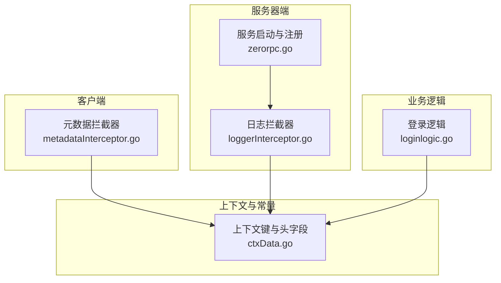
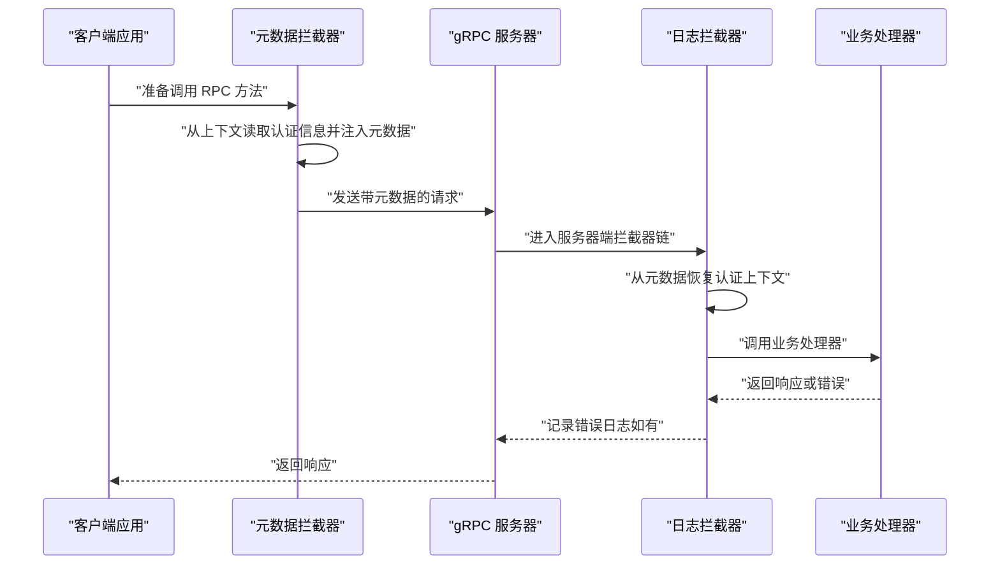
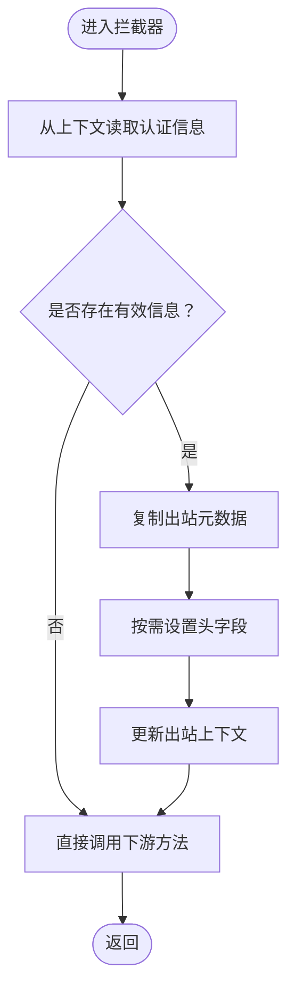
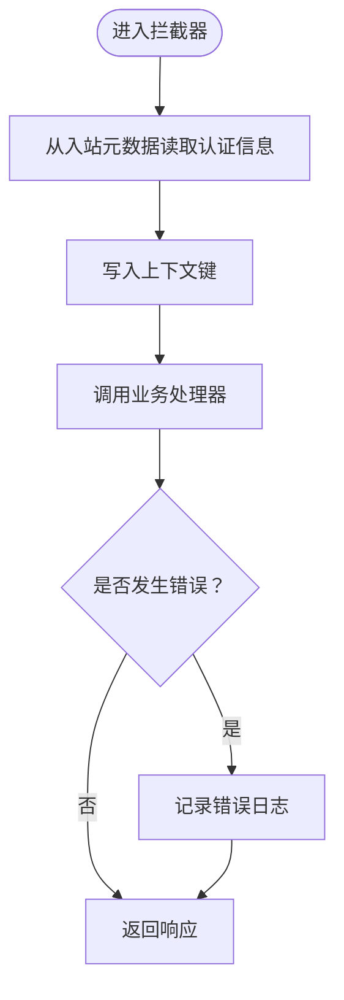
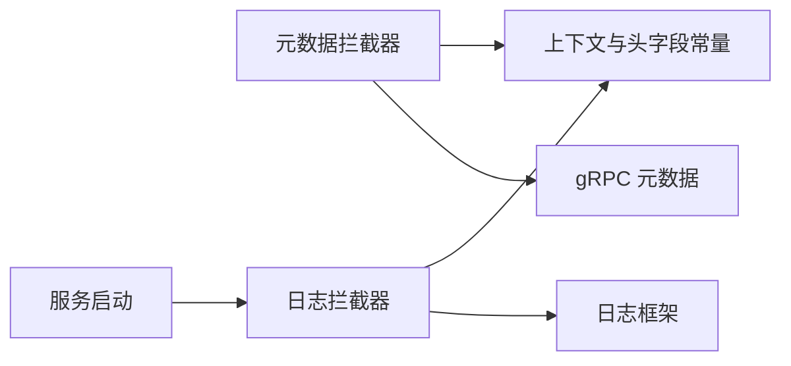

# 认证中间件与拦截器

<cite>
**本文引用的文件**   
- [metadataInterceptor.go](file://common/Interceptor/rpcclient/metadataInterceptor.go)
- [loggerInterceptor.go](file://common/Interceptor/rpcserver/loggerInterceptor.go)
- [ctxData.go](file://common/ctxdata/ctxData.go)
- [zerorpc.go](file://zerorpc/zerorpc.go)
- [loginlogic.go](file://zerorpc/internal/logic/loginlogic.go)
- [rpc-patterns.md](file://.trae/skills/zero-skills/references/rpc-patterns.md)
- [rest-api-patterns.md](file://.trae/skills/zero-skills/references/rest-api-patterns.md)
- [overview.md](file://.trae/skills/zero-skills/best-practices/overview.md)
- [log.go](file://common/asynqx/log.go)
</cite>

## 目录
1. [引言](#引言)
2. [项目结构](#项目结构)
3. [核心组件](#核心组件)
4. [架构总览](#架构总览)
5. [详细组件分析](#详细组件分析)
6. [依赖分析](#依赖分析)
7. [性能考虑](#性能考虑)
8. [故障排查指南](#故障排查指南)
9. [结论](#结论)
10. [附录](#附录)

## 引言
本文件面向 zero-service 的 RPC 服务，系统化梳理认证中间件与拦截器的设计与实现，重点覆盖：
- RPC 客户端与服务器端的认证拦截器设计
- 元数据拦截器如何在请求链路中传递与注入认证信息
- 日志拦截器中的认证上下文记录机制
- 拦截器链的执行顺序与错误处理策略
- 自定义拦截器的开发指南与最佳实践
- 完整的拦截器实现代码示例与配置说明
- 认证失败的处理流程与安全审计日志记录

## 项目结构
围绕认证与拦截器的关键目录与文件如下：
- 客户端元数据拦截器：common/Interceptor/rpcclient/metadataInterceptor.go
- 服务器端日志拦截器：common/Interceptor/rpcserver/loggerInterceptor.go
- 上下文与头字段常量：common/ctxdata/ctxData.go
- 服务启动与拦截器注册：zerorpc/zerorpc.go
- 登录与令牌生成逻辑：zerorpc/internal/logic/loginlogic.go
- 参考模式与最佳实践：.trae/skills/zero-skills/references/rpc-patterns.md、rest-api-patterns.md、best-practices/overview.md
- 异步任务日志适配：common/asynqx/log.go

图表来源
- [metadataInterceptor.go:1-56](file://common/Interceptor/rpcclient/metadataInterceptor.go#L1-L56)
- [loggerInterceptor.go:1-45](file://common/Interceptor/rpcserver/loggerInterceptor.go#L1-L45)
- [ctxData.go:1-76](file://common/ctxdata/ctxData.go#L1-L76)
- [zerorpc.go:26-59](file://zerorpc/zerorpc.go#L26-L59)
- [loginlogic.go:1-110](file://zerorpc/internal/logic/loginlogic.go#L1-L110)

章节来源
- [metadataInterceptor.go:1-56](file://common/Interceptor/rpcclient/metadataInterceptor.go#L1-L56)
- [loggerInterceptor.go:1-45](file://common/Interceptor/rpcserver/loggerInterceptor.go#L1-L45)
- [ctxData.go:1-76](file://common/ctxdata/ctxData.go#L1-L76)
- [zerorpc.go:26-59](file://zerorpc/zerorpc.go#L26-L59)
- [loginlogic.go:1-110](file://zerorpc/internal/logic/loginlogic.go#L1-L110)

## 核心组件
- 元数据拦截器（客户端）
  - 功能：从上下文读取用户标识、部门编码、授权令牌、追踪 ID 等，注入到 gRPC 元数据中，随请求发送至服务器端。
  - 关键点：仅在上下文存在有效值时才写入对应头字段；对出站上下文进行复制，避免并发问题。
- 日志拦截器（服务器端）
  - 功能：从入站元数据读取认证上下文，写回到请求上下文中，并在处理完成后记录错误日志。
  - 关键点：将认证信息映射为统一的上下文键，便于后续业务逻辑读取；异常时输出统一格式的错误日志。
- 上下文与头字段常量
  - 功能：集中定义认证相关的上下文键与 gRPC 头字段名，确保客户端与服务器端一致。
- 服务启动与拦截器注册
  - 功能：在服务启动时注册服务器端拦截器，形成拦截器链。

章节来源
- [metadataInterceptor.go:11-32](file://common/Interceptor/rpcclient/metadataInterceptor.go#L11-L32)
- [metadataInterceptor.go:34-55](file://common/Interceptor/rpcclient/metadataInterceptor.go#L34-L55)
- [loggerInterceptor.go:12-44](file://common/Interceptor/rpcserver/loggerInterceptor.go#L12-L44)
- [ctxData.go:9-24](file://common/ctxdata/ctxData.go#L9-L24)
- [zerorpc.go:44-44](file://zerorpc/zerorpc.go#L44-L44)

## 架构总览
下图展示了零信任的认证与拦截器链路：客户端在发起请求前通过元数据拦截器注入认证信息；服务器端在进入业务处理前通过日志拦截器解析并记录认证上下文；异常时统一记录错误日志。

图表来源
- [metadataInterceptor.go:11-32](file://common/Interceptor/rpcclient/metadataInterceptor.go#L11-L32)
- [loggerInterceptor.go:12-44](file://common/Interceptor/rpcserver/loggerInterceptor.go#L12-L44)
- [zerorpc.go:44-44](file://zerorpc/zerorpc.go#L44-L44)

## 详细组件分析

### 元数据拦截器（客户端）
- 设计要点
  - 读取上下文中的用户 ID、用户名、部门编码、授权令牌、追踪 ID。
  - 将这些信息以 gRPC 元数据的形式写入出站上下文，随请求发送。
  - 对元数据进行复制，避免并发修改导致的数据竞争。
- 适用场景
  - 跨服务调用时携带认证上下文，便于下游服务进行鉴权与审计。
- 与上下文的协作
  - 通过统一的上下文键与头字段常量，保证客户端与服务器端的一致性。

图表来源
- [metadataInterceptor.go:11-32](file://common/Interceptor/rpcclient/metadataInterceptor.go#L11-L32)
- [ctxData.go:9-24](file://common/ctxdata/ctxData.go#L9-L24)

章节来源
- [metadataInterceptor.go:11-32](file://common/Interceptor/rpcclient/metadataInterceptor.go#L11-L32)
- [metadataInterceptor.go:34-55](file://common/Interceptor/rpcclient/metadataInterceptor.go#L34-L55)
- [ctxData.go:9-24](file://common/ctxdata/ctxData.go#L9-L24)

### 日志拦截器（服务器端）
- 设计要点
  - 从入站元数据读取认证上下文，写回到请求上下文中，供业务逻辑使用。
  - 在业务处理后，若发生错误，统一记录错误日志，便于审计与排障。
- 与上下文的协作
  - 使用统一的上下文键，确保后续逻辑可稳定读取认证信息。
- 错误处理
  - 捕获异常并输出统一格式的日志，便于监控系统采集。

图表来源
- [loggerInterceptor.go:12-44](file://common/Interceptor/rpcserver/loggerInterceptor.go#L12-L44)
- [ctxData.go:9-24](file://common/ctxdata/ctxData.go#L9-L24)

章节来源
- [loggerInterceptor.go:12-44](file://common/Interceptor/rpcserver/loggerInterceptor.go#L12-L44)
- [ctxData.go:9-24](file://common/ctxdata/ctxData.go#L9-L24)

### 上下文与头字段常量
- 统一定义
  - 上下文键：用户 ID、用户名、部门编码、授权令牌、追踪 ID。
  - 头字段名：与 gRPC 元数据约定一致的小写形式。
- 作用
  - 避免硬编码差异导致的认证信息丢失或错位。
  - 保证客户端与服务器端对同一字段的读写一致。

章节来源
- [ctxData.go:9-24](file://common/ctxdata/ctxData.go#L9-L24)

### 服务启动与拦截器注册
- 注册位置
  - 在服务启动时，将日志拦截器注册为服务器端的拦截器。
- 影响范围
  - 所有进入服务器的 gRPC 请求都会经过该拦截器链，实现统一的认证上下文注入与错误日志记录。

章节来源
- [zerorpc.go:44-44](file://zerorpc/zerorpc.go#L44-L44)

### 登录与令牌生成逻辑
- 登录流程
  - 支持多种认证方式（如小程序、短信验证码等），最终生成访问令牌。
- 令牌与上下文
  - 令牌生成后可通过统一的上下文键与头字段进行传递，供后续拦截器读取与记录。

章节来源
- [loginlogic.go:30-109](file://zerorpc/internal/logic/loginlogic.go#L30-L109)

### 参考模式与最佳实践
- gRPC 拦截器模式
  - 提供了标准的服务器端与客户端拦截器参考实现，包括元数据读取、令牌校验、上下文注入与日志记录。
- REST 中间件模式
  - 展示了 HTTP 场景下的中间件链式处理思路，可借鉴到 gRPC 的拦截器设计中。
- JWT 最佳实践
  - 包含 JWT 生成与校验的参考实现，有助于理解令牌生命周期与安全策略。

章节来源
- [rpc-patterns.md:370-466](file://.trae/skills/zero-skills/references/rpc-patterns.md#L370-L466)
- [rest-api-patterns.md:197-262](file://.trae/skills/zero-skills/references/rest-api-patterns.md#L197-L262)
- [overview.md:610-669](file://.trae/skills/zero-skills/best-practices/overview.md#L610-L669)

## 依赖分析
- 客户端元数据拦截器依赖
  - 上下文与头字段常量：用于读取与写入统一的认证字段。
  - gRPC 元数据：用于构建与更新出站上下文。
- 服务器端日志拦截器依赖
  - 上下文与头字段常量：用于从入站元数据恢复认证上下文。
  - 日志框架：用于统一记录错误日志。
- 服务启动依赖
  - 拦截器注册：将日志拦截器加入服务器端拦截器链。

图表来源
- [metadataInterceptor.go:11-32](file://common/Interceptor/rpcclient/metadataInterceptor.go#L11-L32)
- [loggerInterceptor.go:12-44](file://common/Interceptor/rpcserver/loggerInterceptor.go#L12-L44)
- [ctxData.go:9-24](file://common/ctxdata/ctxData.go#L9-L24)
- [zerorpc.go:44-44](file://zerorpc/zerorpc.go#L44-L44)

章节来源
- [metadataInterceptor.go:11-32](file://common/Interceptor/rpcclient/metadataInterceptor.go#L11-L32)
- [loggerInterceptor.go:12-44](file://common/Interceptor/rpcserver/loggerInterceptor.go#L12-L44)
- [ctxData.go:9-24](file://common/ctxdata/ctxData.go#L9-L24)
- [zerorpc.go:44-44](file://zerorpc/zerorpc.go#L44-L44)

## 性能考虑
- 元数据拦截器
  - 仅在上下文存在有效值时写入元数据，避免不必要的头部开销。
  - 对元数据进行复制，减少并发风险，同时保持较低的内存分配。
- 日志拦截器
  - 仅在发生错误时记录日志，降低正常请求的 I/O 压力。
  - 使用统一的日志格式，便于日志系统的聚合与检索。
- 令牌生成
  - 登录流程中的令牌生成应尽量复用已有密钥与算法，避免重复计算。

## 故障排查指南
- 认证信息缺失
  - 现象：服务器端无法从元数据读取用户 ID 或授权令牌。
  - 排查：确认客户端是否正确注入认证信息；检查上下文键与头字段是否一致。
- 认证失败
  - 现象：业务处理返回未认证或权限不足。
  - 排查：检查令牌有效性与过期时间；核对服务器端拦截器是否正确解析元数据。
- 错误日志
  - 现象：统一错误日志未出现或格式不一致。
  - 排查：确认日志拦截器已注册；检查日志框架配置与级别。
- 异步任务日志
  - 现象：异步任务日志未输出或输出异常。
  - 排查：确认日志适配器实现与全局日志配置一致。

章节来源
- [loggerInterceptor.go:40-42](file://common/Interceptor/rpcserver/loggerInterceptor.go#L40-L42)
- [log.go:12-36](file://common/asynqx/log.go#L12-L36)

## 结论
本方案通过“客户端元数据拦截器 + 服务器端日志拦截器”的组合，实现了认证信息在 gRPC 请求链路中的自动传递与统一记录。配合统一的上下文键与头字段常量，以及服务启动时的拦截器注册，形成了清晰、可扩展、可审计的认证与拦截器体系。建议在实际部署中结合业务需求，补充服务器端认证拦截器以实现更严格的鉴权控制。

## 附录

### 拦截器链执行顺序与错误处理策略
- 执行顺序
  - 客户端：元数据拦截器 → 实际 RPC 调用
  - 服务器端：日志拦截器 → 业务处理器
- 错误处理
  - 服务器端拦截器在业务处理后捕获错误并记录统一格式日志，便于监控与审计。

章节来源
- [metadataInterceptor.go:11-32](file://common/Interceptor/rpcclient/metadataInterceptor.go#L11-L32)
- [loggerInterceptor.go:12-44](file://common/Interceptor/rpcserver/loggerInterceptor.go#L12-L44)
- [rpc-patterns.md:344-368](file://.trae/skills/zero-skills/references/rpc-patterns.md#L344-L368)

### 自定义拦截器开发指南与最佳实践
- 开发步骤
  - 明确拦截目标：客户端注入认证信息、服务器端解析与记录。
  - 统一上下文键与头字段：确保客户端与服务器端一致。
  - 编写拦截器：遵循拦截器签名，正确读取与写入上下文。
  - 注册拦截器：在服务启动时注册到拦截器链。
- 最佳实践
  - 仅在必要时写入元数据，避免冗余头部。
  - 统一日志格式，便于检索与告警。
  - 将认证逻辑与业务逻辑解耦，提升可维护性。

章节来源
- [rpc-patterns.md:370-466](file://.trae/skills/zero-skills/references/rpc-patterns.md#L370-L466)
- [rest-api-patterns.md:197-262](file://.trae/skills/zero-skills/references/rest-api-patterns.md#L197-L262)
- [overview.md:610-669](file://.trae/skills/zero-skills/best-practices/overview.md#L610-L669)

### 完整拦截器实现代码示例与配置说明
- 客户端元数据拦截器
  - 示例路径：[元数据拦截器实现:11-32](file://common/Interceptor/rpcclient/metadataInterceptor.go#L11-L32)
  - 示例路径：[流式拦截器实现:34-55](file://common/Interceptor/rpcclient/metadataInterceptor.go#L34-L55)
- 服务器端日志拦截器
  - 示例路径：[日志拦截器实现:12-44](file://common/Interceptor/rpcserver/loggerInterceptor.go#L12-L44)
- 服务启动与拦截器注册
  - 示例路径：[拦截器注册:44-44](file://zerorpc/zerorpc.go#L44-L44)
- 上下文与头字段常量
  - 示例路径：[上下文键与头字段:9-24](file://common/ctxdata/ctxData.go#L9-L24)
- 登录与令牌生成逻辑
  - 示例路径：[登录逻辑:30-109](file://zerorpc/internal/logic/loginlogic.go#L30-L109)