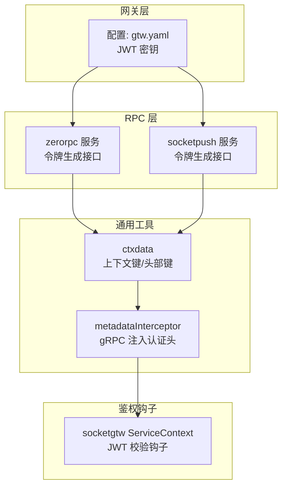
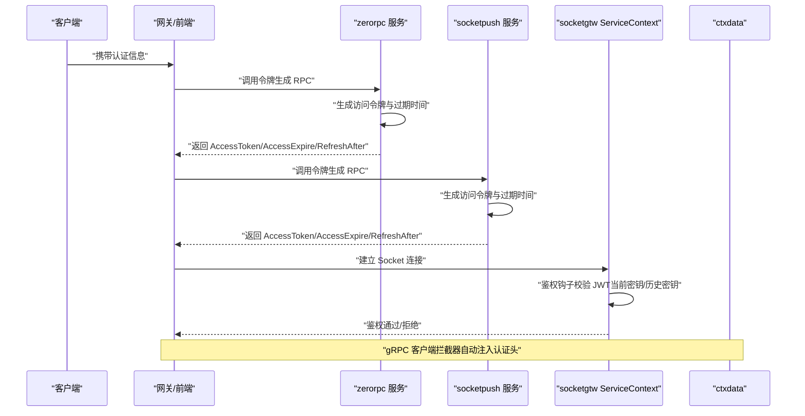
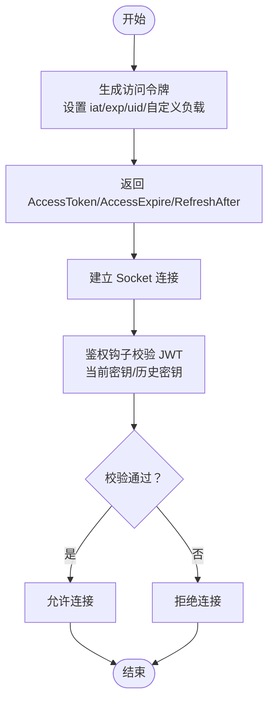
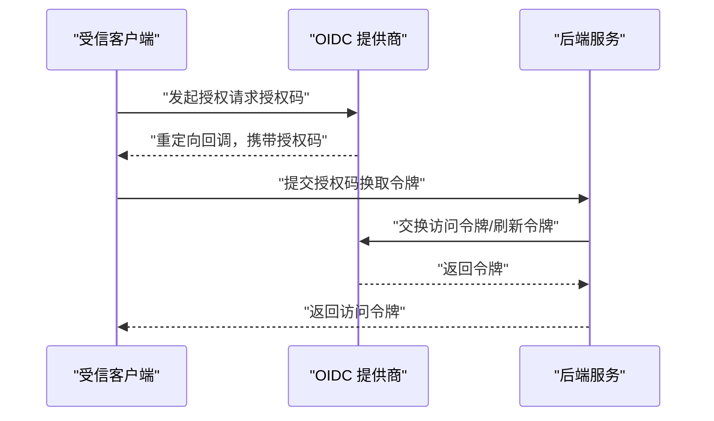
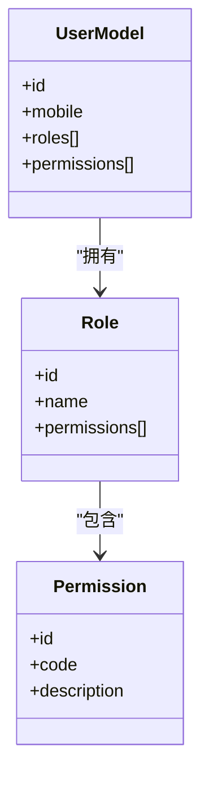
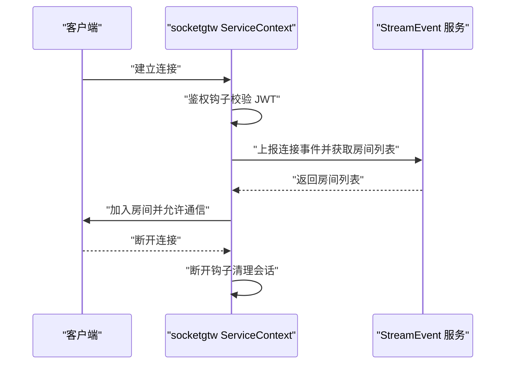
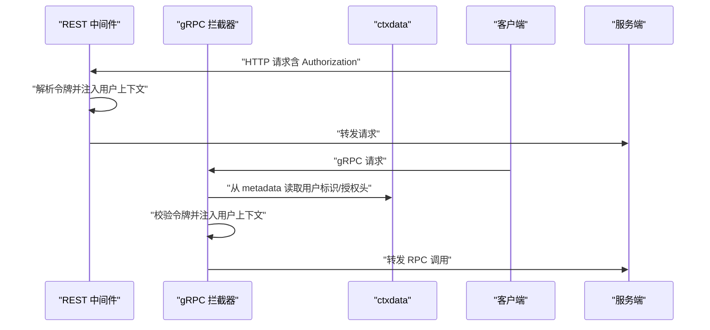
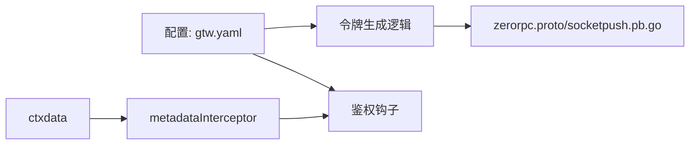

# 身份认证与授权

<cite>
**本文引用的文件**
- [gentokenlogic.go](file://socketapp/socketpush/internal/logic/gentokenlogic.go)
- [generatetokenlogic.go](file://zerorpc/internal/logic/generatetokenlogic.go)
- [ctxData.go](file://common/ctxdata/ctxData.go)
- [servicecontext.go](file://socketapp/socketgtw/internal/svc/servicecontext.go)
- [metadataInterceptor.go](file://common/Interceptor/rpcclient/metadataInterceptor.go)
- [rpc-patterns.md](file://.trae/skills/zero-skills/references/rpc-patterns.md)
- [rest-api-patterns.md](file://.trae/skills/zero-skills/references/rest-api-patterns.md)
- [openapiv2.proto](file://third_party/protoc-gen-openapiv2/options/openapiviv2.proto)
- [zerorpc.proto](file://zerorpc/zerorpc.proto)
- [socketpush.pb.go](file://socketapp/socketpush/socketpush/socketpush.pb.go)
- [gtw.yaml](file://gtw/etc/gtw.yaml)
- [usermodel_gen.go](file://model/usermodel_gen.go)
</cite>

## 目录
1. [简介](#简介)
2. [项目结构](#项目结构)
3. [核心组件](#核心组件)
4. [架构总览](#架构总览)
5. [详细组件分析](#详细组件分析)
6. [依赖分析](#依赖分析)
7. [性能考虑](#性能考虑)
8. [故障排查指南](#故障排查指南)
9. [结论](#结论)
10. [附录](#附录)

## 简介
本文件面向 zero-service 的“身份认证与授权”安全实践，围绕以下目标展开：
- JWT 令牌管理：生成、验证、刷新与过期处理
- OAuth2 集成：授权码流程、客户端凭证、资源所有者密码凭据
- RBAC 权限控制：角色定义、权限分配与访问控制
- 会话管理：会话创建、状态维护与安全销毁
- 多因素认证（MFA）与单点登录（SSO）集成建议
- 令牌存储安全、权限缓存与权限检查
- 认证中间件与权限拦截器设计

在本仓库中，已具备 JWT 令牌生成与校验的基础能力，并通过 gRPC 元数据传递认证信息。RBAC、OAuth2、MFA/SSO、权限缓存等模块可在此基础上扩展。

## 项目结构
与认证授权直接相关的模块与文件如下：
- JWT 令牌生成与使用
  - socketapp/socketpush 内部逻辑：生成访问令牌与过期时间
  - zerorpc 内部逻辑：生成访问令牌
- 上下文与元数据
  - common/ctxdata：统一的上下文键与 gRPC 头部键
  - common/Interceptor/rpcclient/metadataInterceptor.go：在 gRPC 请求中注入认证头
  - socketapp/socketgtw/internal/svc/servicecontext.go：基于 JWT 的鉴权钩子
- 配置
  - gtw/etc/gtw.yaml：JWT 密钥配置示例
- 接口定义
  - zerorpc/zerorpc.proto：令牌生成 RPC 接口
  - socketapp/socketpush/socketpush/socketpush.pb.go：令牌生成请求/响应消息结构
- 参考模式
  - .trae/skills/zero-skills/references/rpc-patterns.md：gRPC 拦截器模式
  - .trae/skills/zero-skills/references/rest-api-patterns.md：REST 中间件模式
  - third_party/protoc-gen-openapiv2/options/openapiv2.proto：OpenAPI 安全方案类型

**图表来源**
- [gtw.yaml:57-59](file://gtw/etc/gtw.yaml#L57-L59)
- [generatetokenlogic.go:29-42](file://zerorpc/internal/logic/generatetokenlogic.go#L29-L42)
- [gentokenlogic.go:30-45](file://socketapp/socketpush/internal/logic/gentokenlogic.go#L30-L45)
- [ctxData.go:9-24](file://common/ctxdata/ctxData.go#L9-L24)
- [metadataInterceptor.go:11-32](file://common/Interceptor/rpcclient/metadataInterceptor.go#L11-L32)
- [servicecontext.go:59-74](file://socketapp/socketgtw/internal/svc/servicecontext.go#L59-L74)

**章节来源**
- [gtw.yaml:57-59](file://gtw/etc/gtw.yaml#L57-L59)
- [generatetokenlogic.go:29-42](file://zerorpc/internal/logic/generatetokenlogic.go#L29-L42)
- [gentokenlogic.go:30-45](file://socketapp/socketpush/internal/logic/gentokenlogic.go#L30-L45)
- [ctxData.go:9-24](file://common/ctxdata/ctxData.go#L9-L24)
- [metadataInterceptor.go:11-32](file://common/Interceptor/rpcclient/metadataInterceptor.go#L11-L32)
- [servicecontext.go:59-74](file://socketapp/socketgtw/internal/svc/servicecontext.go#L59-L74)

## 核心组件
- JWT 令牌生成
  - 生成访问令牌与过期时间，支持自定义负载字段（除标准声明外）
  - 提供刷新提示时间点，便于前端在半生命周期内触发刷新
- JWT 令牌验证
  - 支持当前密钥与历史密钥（轮换）双重校验
  - 在 Socket 连接钩子中进行鉴权
- 认证上下文与元数据
  - 统一的用户标识、授权令牌、跟踪 ID 等上下文键
  - gRPC 客户端拦截器自动注入认证头，便于跨服务传递
- 配置
  - 通过配置文件设置 JWT 密钥，支持密钥轮换

**章节来源**
- [gentokenlogic.go:30-45](file://socketapp/socketpush/internal/logic/gentokenlogic.go#L30-L45)
- [generatetokenlogic.go:29-42](file://zerorpc/internal/logic/generatetokenlogic.go#L29-L42)
- [ctxData.go:9-24](file://common/ctxdata/ctxData.go#L9-L24)
- [servicecontext.go:59-74](file://socketapp/socketgtw/internal/svc/servicecontext.go#L59-L74)
- [gtw.yaml:57-59](file://gtw/etc/gtw.yaml#L57-L59)

## 架构总览
下图展示了从客户端到服务端的认证与授权路径，以及 gRPC 元数据传递与 Socket 鉴权钩子的交互。

**图表来源**
- [generatetokenlogic.go:29-42](file://zerorpc/internal/logic/generatetokenlogic.go#L29-L42)
- [gentokenlogic.go:30-45](file://socketapp/socketpush/internal/logic/gentokenlogic.go#L30-L45)
- [servicecontext.go:59-74](file://socketapp/socketgtw/internal/svc/servicecontext.go#L59-L74)
- [metadataInterceptor.go:11-32](file://common/Interceptor/rpcclient/metadataInterceptor.go#L11-L32)

## 详细组件分析

### JWT 令牌管理机制
- 令牌生成
  - 生成访问令牌与过期时间戳，支持附加自定义负载（忽略标准声明键）
  - 返回 RefreshAfter 时间点，用于前端在半生命周期内发起刷新
- 令牌验证
  - 支持当前密钥与历史密钥（PrevAccessSecret）校验，实现密钥轮换
  - 在 Socket 连接钩子中执行，确保连接建立时即完成鉴权
- 刷新与过期
  - 前端可在 RefreshAfter 到达后发起刷新流程，避免过期导致的频繁登录
  - 过期时间由 AccessExpire 控制，结合 RefreshAfter 实现平滑过渡

**图表来源**
- [gentokenlogic.go:30-45](file://socketapp/socketpush/internal/logic/gentokenlogic.go#L30-L45)
- [generatetokenlogic.go:29-42](file://zerorpc/internal/logic/generatetokenlogic.go#L29-L42)
- [servicecontext.go:59-74](file://socketapp/socketgtw/internal/svc/servicecontext.go#L59-L74)

**章节来源**
- [gentokenlogic.go:30-45](file://socketapp/socketpush/internal/logic/gentokenlogic.go#L30-L45)
- [generatetokenlogic.go:29-42](file://zerorpc/internal/logic/generatetokenlogic.go#L29-L42)
- [servicecontext.go:59-74](file://socketapp/socketgtw/internal/svc/servicecontext.go#L59-L74)

### OAuth2 集成方案
- 授权码流程
  - 使用第三方 OIDC 提供商，前端引导用户至授权端点，回调携带授权码
  - 后端以授权码换取访问令牌与刷新令牌，保存于安全介质
- 客户端凭证
  - 用于服务到服务调用，颁发受限访问令牌，配合密钥轮换与最小权限
- 资源所有者密码凭据
  - 适用于受信客户端，直接以用户名/密码换取访问令牌，严格限制使用场景

[本图为概念性流程，不直接映射具体源文件，故不附“图表来源”]

### RBAC 权限控制系统
- 角色定义
  - 用户模型中包含用户标识，可扩展角色字段或关联角色表
- 权限分配
  - 将权限与角色绑定，再将角色赋予用户
- 访问控制
  - 在 gRPC/REST 中间件中读取用户角色与权限，进行细粒度校验

[本图为概念性类图，不直接映射具体源文件，故不附“图表来源”]

**章节来源**
- [usermodel_gen.go:21-46](file://model/usermodel_gen.go#L21-L46)

### 会话管理策略
- 会话创建
  - 建立 Socket 连接时触发鉴权钩子，通过 JWT 校验后加入房间或通道
- 状态维护
  - 通过 metadataInterceptor 在 gRPC 请求中携带用户标识与授权信息
- 安全销毁
  - 断开连接时触发断开钩子，清理会话状态与订阅

**图表来源**
- [servicecontext.go:75-96](file://socketapp/socketgtw/internal/svc/servicecontext.go#L75-L96)
- [metadataInterceptor.go:11-32](file://common/Interceptor/rpcclient/metadataInterceptor.go#L11-L32)

**章节来源**
- [servicecontext.go:75-96](file://socketapp/socketgtw/internal/svc/servicecontext.go#L75-L96)
- [metadataInterceptor.go:11-32](file://common/Interceptor/rpcclient/metadataInterceptor.go#L11-L32)

### 多因素认证（MFA）与单点登录（SSO）
- MFA 集成
  - 在登录阶段增加二次验证（短信/邮件/硬件令牌），成功后发放访问令牌
- SSO 实施
  - 通过 OIDC/SAML 与企业身份提供商对接，统一会话与注销流程

[本节为实施建议，不直接分析具体源文件，故不附“章节来源”]

### 令牌存储安全、权限缓存与权限检查
- 令牌存储安全
  - 建议将刷新令牌存储于安全容器（如 KMS 或硬件安全模块），访问令牌置于内存或短生命周期缓存
- 权限缓存
  - 将用户权限映射缓存于本地或分布式缓存，设置合理 TTL 并在权限变更时失效
- 权限检查
  - 在 gRPC/REST 中间件中读取用户权限，进行白名单/黑名单校验

[本节为通用实践，不直接分析具体源文件，故不附“章节来源”]

### 认证中间件与权限拦截器设计
- REST 中间件
  - 在路由注册前挂载认证中间件，解析 Authorization 头并注入用户上下文
- gRPC 拦截器
  - 服务端拦截器从 metadata 中提取授权信息，校验令牌并注入用户标识
  - 客户端拦截器自动注入用户标识与授权头，保证跨服务一致

**图表来源**
- [rest-api-patterns.md:203-244](file://.trae/skills/zero-skills/references/rest-api-patterns.md#L203-L244)
- [rpc-patterns.md:375-415](file://.trae/skills/zero-skills/references/rpc-patterns.md#L375-L415)
- [metadataInterceptor.go:11-32](file://common/Interceptor/rpcclient/metadataInterceptor.go#L11-L32)
- [ctxData.go:9-24](file://common/ctxdata/ctxData.go#L9-L24)

**章节来源**
- [rest-api-patterns.md:203-244](file://.trae/skills/zero-skills/references/rest-api-patterns.md#L203-L244)
- [rpc-patterns.md:375-415](file://.trae/skills/zero-skills/references/rpc-patterns.md#L375-L415)
- [metadataInterceptor.go:11-32](file://common/Interceptor/rpcclient/metadataInterceptor.go#L11-L32)
- [ctxData.go:9-24](file://common/ctxdata/ctxData.go#L9-L24)

## 依赖分析
- 组件耦合
  - 令牌生成逻辑依赖配置中的密钥与上下文键
  - 鉴权钩子依赖配置中的密钥与解析工具
  - gRPC 拦截器依赖 ctxdata 的头部键，确保跨服务一致传递
- 外部依赖
  - JWT 解析与签名库
  - OpenAPI 安全方案类型（用于文档与规范）

**图表来源**
- [gtw.yaml:57-59](file://gtw/etc/gtw.yaml#L57-L59)
- [generatetokenlogic.go:29-42](file://zerorpc/internal/logic/generatetokenlogic.go#L29-L42)
- [gentokenlogic.go:30-45](file://socketapp/socketpush/internal/logic/gentokenlogic.go#L30-L45)
- [servicecontext.go:59-74](file://socketapp/socketgtw/internal/svc/servicecontext.go#L59-L74)
- [metadataInterceptor.go:11-32](file://common/Interceptor/rpcclient/metadataInterceptor.go#L11-L32)
- [zerorpc.proto:153-156](file://zerorpc/zerorpc.proto#L153-L156)
- [socketpush.pb.go:143-194](file://socketapp/socketpush/socketpush/socketpush.pb.go#L143-L194)

**章节来源**
- [gtw.yaml:57-59](file://gtw/etc/gtw.yaml#L57-L59)
- [generatetokenlogic.go:29-42](file://zerorpc/internal/logic/generatetokenlogic.go#L29-L42)
- [gentokenlogic.go:30-45](file://socketapp/socketpush/internal/logic/gentokenlogic.go#L30-L45)
- [servicecontext.go:59-74](file://socketapp/socketgtw/internal/svc/servicecontext.go#L59-L74)
- [metadataInterceptor.go:11-32](file://common/Interceptor/rpcclient/metadataInterceptor.go#L11-L32)
- [zerorpc.proto:153-156](file://zerorpc/zerorpc.proto#L153-L156)
- [socketpush.pb.go:143-194](file://socketapp/socketpush/socketpush/socketpush.pb.go#L143-L194)

## 性能考虑
- 令牌生成
  - 使用 HS256 快速签名，避免复杂算法带来的 CPU 开销
- 鉴权钩子
  - 优先使用内存缓存的密钥列表，减少磁盘/网络查询
- gRPC 元数据
  - 仅注入必要字段，避免过大头部影响传输效率
- 权限检查
  - 将权限映射缓存于本地，设置合理 TTL，降低数据库压力

[本节提供通用指导，不直接分析具体源文件，故不附“章节来源”]

## 故障排查指南
- 令牌无效
  - 检查密钥是否正确配置，确认当前密钥与历史密钥均可用
  - 核对 iat/exp 是否正确，避免时钟偏差导致的过期
- 鉴权失败
  - 确认 gRPC 客户端拦截器是否注入了授权头
  - 检查 Socket 连接钩子的鉴权逻辑是否被触发
- 权限不足
  - 核对用户角色与权限映射，确认权限缓存是否已更新

**章节来源**
- [servicecontext.go:59-74](file://socketapp/socketgtw/internal/svc/servicecontext.go#L59-L74)
- [metadataInterceptor.go:11-32](file://common/Interceptor/rpcclient/metadataInterceptor.go#L11-L32)
- [ctxData.go:9-24](file://common/ctxdata/ctxData.go#L9-L24)

## 结论
本仓库已具备 JWT 令牌生成与验证、gRPC 元数据传递与 Socket 鉴权钩子的基础能力。在此基础上，可进一步完善 OAuth2、RBAC、MFA/SSO、权限缓存与拦截器设计，形成完整的身份认证与授权体系。建议在生产环境中启用密钥轮换、严格的令牌存储与传输加密，并持续监控与审计访问日志。

## 附录
- OpenAPI 安全方案类型
  - 支持 basic、apiKey、oauth2 等类型，可用于 API 文档与规范约束

**章节来源**
- [openapiv2.proto:665-690](file://third_party/protoc-gen-openapiv2/options/openapiv2.proto#L665-L690)