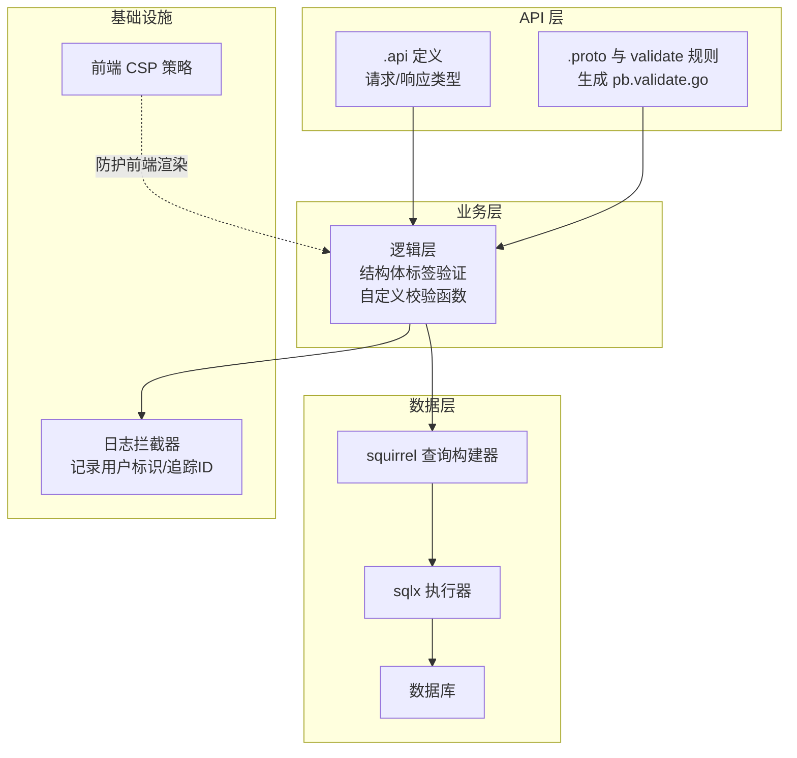
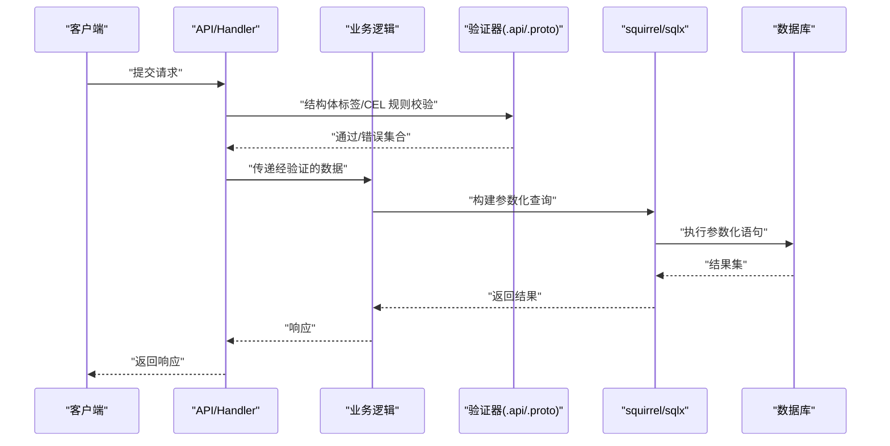
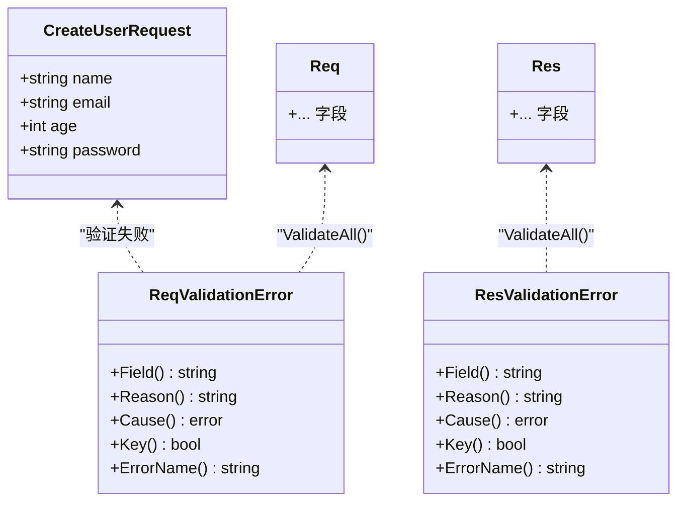
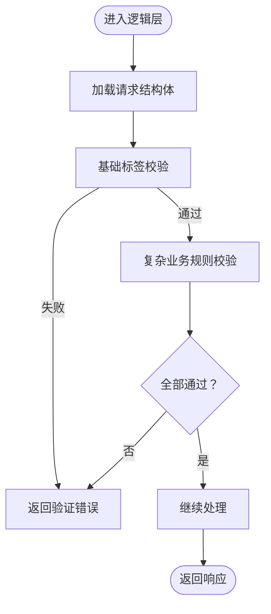
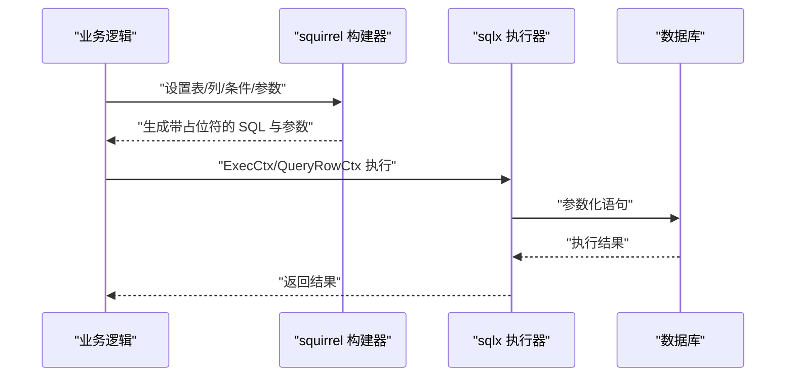
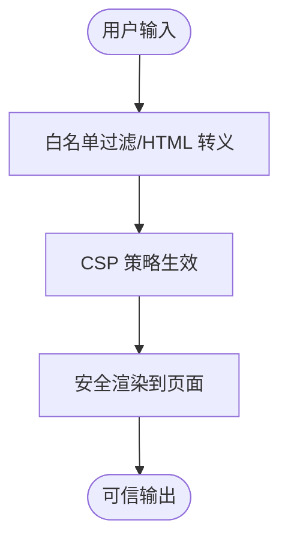
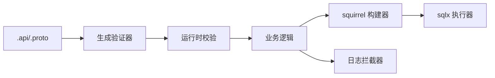

# 输入验证与数据清理

<cite>
**本文引用的文件**   
- [overview.md](file://.trae/skills/zero-skills/best-practices/overview.md)
- [rest-api-patterns.md](file://.trae/skills/zero-skills/references/rest-api-patterns.md)
- [validate.proto](file://third_party/buf/validate/validate.proto)
- [lalproxy.pb.validate.go](file://app/lalproxy/lalproxy/lalproxy.pb.validate.go)
- [xfusionmock.pb.validate.go](file://app/xfusionmock/xfusionmock/xfusionmock.pb.validate.go)
- [dbx.go](file://common/dbx/dbx.go)
- [modbusslaveconfigmodel_gen.go](file://model/modbusslaveconfigmodel_gen.go)
- [loggerInterceptor.go](file://common/Interceptor/rpcserver/loggerInterceptor.go)
- [start.html](file://app/lalhook/start.html)
</cite>

## 目录
1. [简介](#简介)
2. [项目结构](#项目结构)
3. [核心组件](#核心组件)
4. [架构总览](#架构总览)
5. [详细组件分析](#详细组件分析)
6. [依赖分析](#依赖分析)
7. [性能考虑](#性能考虑)
8. [故障排查指南](#故障排查指南)
9. [结论](#结论)
10. [附录](#附录)

## 简介
本文件面向 zero-service 的输入验证与数据清理安全实践，系统性梳理参数验证机制（结构体标签验证、自定义验证函数、嵌套对象验证）、SQL 注入防护（参数化查询、ORM 使用、动态 SQL 安全处理）、XSS 防范（HTML 转义、CSP、输入白名单过滤）、路径遍历防护（文件路径清理、相对路径限制、安全文件操作）、数据类型验证与格式约束，并总结常见场景的最佳实践与反模式。

## 项目结构
围绕输入验证与数据清理的关键位置：
- 请求/响应类型定义与验证规则：在 .api 文件与生成的 pb.validate.go 中体现
- 结构体字段级验证：通过 validate 标签与自定义校验函数
- 数据访问层：统一使用 squirrel 构建器与 sqlx 执行，确保参数化查询
- 日志与拦截器：记录上下文信息，便于审计与追踪
- 前端播放页：涉及前端渲染与资源链接，需注意 CSP 与输入来源

**图示来源**
- [rest-api-patterns.md:264-322](file://.trae/skills/zero-skills/references/rest-api-patterns.md#L264-L322)
- [validate.proto:1-200](file://third_party/buf/validate/validate.proto#L1-L200)
- [lalproxy.pb.validate.go:1-200](file://app/lalproxy/lalproxy/lalproxy.pb.validate.go#L1-L200)
- [xfusionmock.pb.validate.go:70-215](file://app/xfusionmock/xfusionmock/xfusionmock.pb.validate.go#L70-L215)
- [modbusslaveconfigmodel_gen.go:152-192](file://model/modbusslaveconfigmodel_gen.go#L152-L192)
- [loggerInterceptor.go:12-44](file://common/Interceptor/rpcserver/loggerInterceptor.go#L12-L44)
- [start.html:164-335](file://app/lalhook/start.html#L164-L335)

**章节来源**
- [.trae/skills/zero-skills/references/rest-api-patterns.md:264-322](file://.trae/skills/zero-skills/references/rest-api-patterns.md#L264-L322)
- [.trae/skills/zero-skills/best-practices/overview.md:546-608](file://.trae/skills/zero-skills/best-practices/overview.md#L546-L608)

## 核心组件
- 结构体标签验证：在 .api 与 .proto 中定义字段约束，结合 validate 标签与生成的验证器进行快速校验
- 自定义验证函数：在逻辑层对复杂业务规则进行补充校验
- ORM/查询构建：统一使用 squirrel 构建器与 sqlx 执行，确保参数化查询
- 日志与追踪：通过拦截器注入用户标识与追踪 ID，便于审计
- 前端渲染：播放页对资源链接与渲染逻辑进行安全处理

**章节来源**
- [.trae/skills/zero-skills/best-practices/overview.md:546-608](file://.trae/skills/zero-skills/best-practices/overview.md#L546-L608)
- [validate.proto:165-200](file://third_party/buf/validate/validate.proto#L165-L200)
- [lalproxy.pb.validate.go:38-139](file://app/lalproxy/lalproxy/lalproxy.pb.validate.go#L38-L139)
- [xfusionmock.pb.validate.go:70-215](file://app/xfusionmock/xfusionmock/xfusionmock.pb.validate.go#L70-L215)
- [modbusslaveconfigmodel_gen.go:152-192](file://model/modbusslaveconfigmodel_gen.go#L152-L192)
- [loggerInterceptor.go:12-44](file://common/Interceptor/rpcserver/loggerInterceptor.go#L12-L44)

## 架构总览
输入验证与数据清理贯穿 API、业务与数据三层，形成“声明式规则 + 运行时校验 + 参数化执行”的闭环。

**图示来源**
- [rest-api-patterns.md:264-322](file://.trae/skills/zero-skills/references/rest-api-patterns.md#L264-L322)
- [validate.proto:165-200](file://third_party/buf/validate/validate.proto#L165-L200)
- [lalproxy.pb.validate.go:38-139](file://app/lalproxy/lalproxy/lalproxy.pb.validate.go#L38-L139)
- [xfusionmock.pb.validate.go:70-215](file://app/xfusionmock/xfusionmock/xfusionmock.pb.validate.go#L70-L215)
- [modbusslaveconfigmodel_gen.go:152-192](file://model/modbusslaveconfigmodel_gen.go#L152-L192)

## 详细组件分析

### 结构体标签验证与嵌套对象验证
- 在 .api 中定义请求/响应类型，使用 validate 标签声明最小/最大长度、必填、范围等规则
- 在 .proto 中通过扩展选项与 CEL 表达式定义字段与消息级约束，生成的 pb.validate.go 提供编译期与运行时校验
- 嵌套对象验证：通过消息级 ValidateAll 返回多错误集合，便于一次性反馈所有违规项

**图示来源**
- [rest-api-patterns.md:264-322](file://.trae/skills/zero-skills/references/rest-api-patterns.md#L264-L322)
- [validate.proto:165-200](file://third_party/buf/validate/validate.proto#L165-L200)
- [lalproxy.pb.validate.go:38-139](file://app/lalproxy/lalproxy/lalproxy.pb.validate.go#L38-L139)
- [xfusionmock.pb.validate.go:70-215](file://app/xfusionmock/xfusionmock/xfusionmock.pb.validate.go#L70-L215)

**章节来源**
- [.trae/skills/zero-skills/references/rest-api-patterns.md:264-322](file://.trae/skills/zero-skills/references/rest-api-patterns.md#L264-L322)
- [.trae/skills/zero-skills/best-practices/overview.md:546-570](file://.trae/skills/zero-skills/best-practices/overview.md#L546-L570)
- [validate.proto:165-200](file://third_party/buf/validate/validate.proto#L165-L200)
- [lalproxy.pb.validate.go:38-139](file://app/lalproxy/lalproxy/lalproxy.pb.validate.go#L38-L139)
- [xfusionmock.pb.validate.go:70-215](file://app/xfusionmock/xfusionmock/xfusionmock.pb.validate.go#L70-L215)

### 自定义验证函数与复杂业务规则
- 在逻辑层对跨字段、跨实体的复杂规则进行补充校验
- 对于需要运行时计算的规则（如范围联动、依赖状态），优先在逻辑层实现
- 建议将验证结果统一包装为结构化的错误对象，便于上层处理与前端展示

**图示来源**
- [.trae/skills/zero-skills/best-practices/overview.md:546-570](file://.trae/skills/zero-skills/best-practices/overview.md#L546-L570)

**章节来源**
- [.trae/skills/zero-skills/best-practices/overview.md:546-570](file://.trae/skills/zero-skills/best-practices/overview.md#L546-L570)

### SQL 注入防护：参数化查询、ORM 使用与动态 SQL 安全
- 统一使用 squirrel 查询构建器生成 SQL，并通过 sqlx 执行，确保参数化查询
- 不拼接用户输入到 SQL 字符串；必要时使用占位符与参数数组
- 针对不同数据库类型（MySQL/PostgreSQL/SQLite/TAOS）自动选择方言与占位符格式

**图示来源**
- [modbusslaveconfigmodel_gen.go:152-192](file://model/modbusslaveconfigmodel_gen.go#L152-L192)
- [modbusslaveconfigmodel_gen.go:323-353](file://model/modbusslaveconfigmodel_gen.go#L323-L353)
- [dbx.go:46-64](file://common/dbx/dbx.go#L46-L64)

**章节来源**
- [modbusslaveconfigmodel_gen.go:152-192](file://model/modbusslaveconfigmodel_gen.go#L152-L192)
- [modbusslaveconfigmodel_gen.go:323-353](file://model/modbusslaveconfigmodel_gen.go#L323-L353)
- [dbx.go:46-64](file://common/dbx/dbx.go#L46-L64)

### XSS 攻击防范：HTML 转义、CSP 与输入白名单过滤
- 后端渲染场景：对输出到模板/HTML 的数据进行 HTML 转义，避免脚本注入
- 前端资源：在播放页中对资源链接与渲染逻辑进行安全处理，避免不受信任的外部资源
- 内容安全策略（CSP）：在服务端响应头中设置严格的 CSP，限制脚本执行来源与内联脚本
- 输入白名单：仅允许预定义字符集与格式，拒绝未知或危险字符

**图示来源**
- [start.html:164-335](file://app/lalhook/start.html#L164-L335)

**章节来源**
- [start.html:164-335](file://app/lalhook/start.html#L164-L335)

### 路径遍历攻击防护：文件路径清理、相对路径限制与安全文件操作
- 对用户提供的文件路径进行清理与规范化，禁止使用相对路径穿越（如 ..）
- 限定文件操作在受控目录范围内，避免越权访问
- 对文件名与路径进行白名单校验，拒绝特殊字符与协议

**章节来源**
- [.trae/skills/zero-skills/best-practices/overview.md:647-669](file://.trae/skills/zero-skills/best-practices/overview.md#L647-L669)

### 数据类型验证、长度限制、范围检查与格式验证
- 数据类型：明确字段类型（字符串/整数/布尔），避免隐式转换带来的歧义
- 长度限制：通过 validate 标签限制最小/最大长度
- 范围检查：数值范围（gte/lte）、时间范围等
- 格式验证：邮箱、URL、正则表达式等，可在 .proto 中通过 CEL 预定义规则实现

**章节来源**
- [.trae/skills/zero-skills/references/rest-api-patterns.md:264-322](file://.trae/skills/zero-skills/references/rest-api-patterns.md#L264-L322)
- [validate.proto:3693-3712](file://third_party/buf/validate/validate.proto#L3693-L3712)

## 依赖分析
- 验证规则来源：.api 与 .proto 的 validate 扩展，生成 pb.validate.go
- 执行链路：API 层 -> 逻辑层 -> 数据层（squirrel + sqlx）
- 追踪与审计：日志拦截器注入用户标识与追踪 ID

**图示来源**
- [rest-api-patterns.md:264-322](file://.trae/skills/zero-skills/references/rest-api-patterns.md#L264-L322)
- [validate.proto:165-200](file://third_party/buf/validate/validate.proto#L165-L200)
- [lalproxy.pb.validate.go:38-139](file://app/lalproxy/lalproxy/lalproxy.pb.validate.go#L38-L139)
- [xfusionmock.pb.validate.go:70-215](file://app/xfusionmock/xfusionmock/xfusionmock.pb.validate.go#L70-L215)
- [modbusslaveconfigmodel_gen.go:152-192](file://model/modbusslaveconfigmodel_gen.go#L152-L192)
- [loggerInterceptor.go:12-44](file://common/Interceptor/rpcserver/loggerInterceptor.go#L12-L44)

**章节来源**
- [rest-api-patterns.md:264-322](file://.trae/skills/zero-skills/references/rest-api-patterns.md#L264-L322)
- [validate.proto:165-200](file://third_party/buf/validate/validate.proto#L165-L200)
- [lalproxy.pb.validate.go:38-139](file://app/lalproxy/lalproxy/lalproxy.pb.validate.go#L38-L139)
- [xfusionmock.pb.validate.go:70-215](file://app/xfusionmock/xfusionmock/xfusionmock.pb.validate.go#L70-L215)
- [modbusslaveconfigmodel_gen.go:152-192](file://model/modbusslaveconfigmodel_gen.go#L152-L192)
- [loggerInterceptor.go:12-44](file://common/Interceptor/rpcserver/loggerInterceptor.go#L12-L44)

## 性能考虑
- 验证阶段尽量轻量：优先使用结构体标签与生成的验证器，减少昂贵的自定义校验
- 查询阶段保持参数化：避免动态拼接 SQL，降低解析与注入风险
- 缓存与批处理：对只读数据使用缓存，批量操作减少往返次数

## 故障排查指南
- 验证失败：查看验证器返回的错误集合，定位具体字段与原因
- 数据库错误：确认是否使用了参数化查询，检查占位符与参数顺序
- 日志与追踪：通过拦截器注入的用户标识与追踪 ID 快速定位问题上下文

**章节来源**
- [lalproxy.pb.validate.go:71-88](file://app/lalproxy/lalproxy/lalproxy.pb.validate.go#L71-L88)
- [xfusionmock.pb.validate.go:170-188](file://app/xfusionmock/xfusionmock/xfusionmock.pb.validate.go#L170-L188)
- [loggerInterceptor.go:12-44](file://common/Interceptor/rpcserver/loggerInterceptor.go#L12-L44)

## 结论
通过“声明式验证 + 运行时校验 + 参数化执行 + 安全渲染”的整体设计，zero-service 在输入验证与数据清理方面形成了完整的安全闭环。建议持续完善复杂业务规则的自定义校验、强化前端 CSP 与白名单策略，并在团队内推广最佳实践与反模式清单，以提升整体安全性与可维护性。

## 附录
- 常见输入验证场景最佳实践
  - 必填字段：使用 required 标签
  - 长度限制：min/max
  - 数值范围：gte/lte
  - 格式校验：email/url/regex
  - 嵌套对象：使用 ValidateAll 获取完整错误列表
- 反模式
  - 直接拼接用户输入到 SQL 字符串
  - 在日志中输出敏感信息
  - 忽视错误处理与上下文包装
  - 直接信任前端传参，绕过后端校验