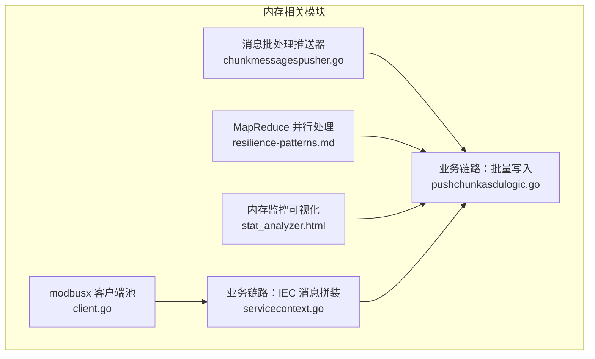
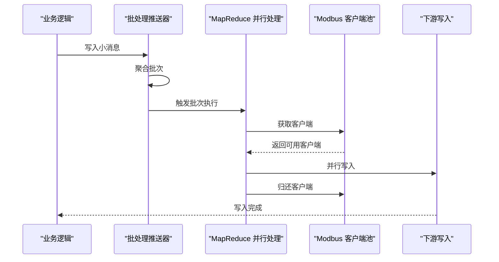
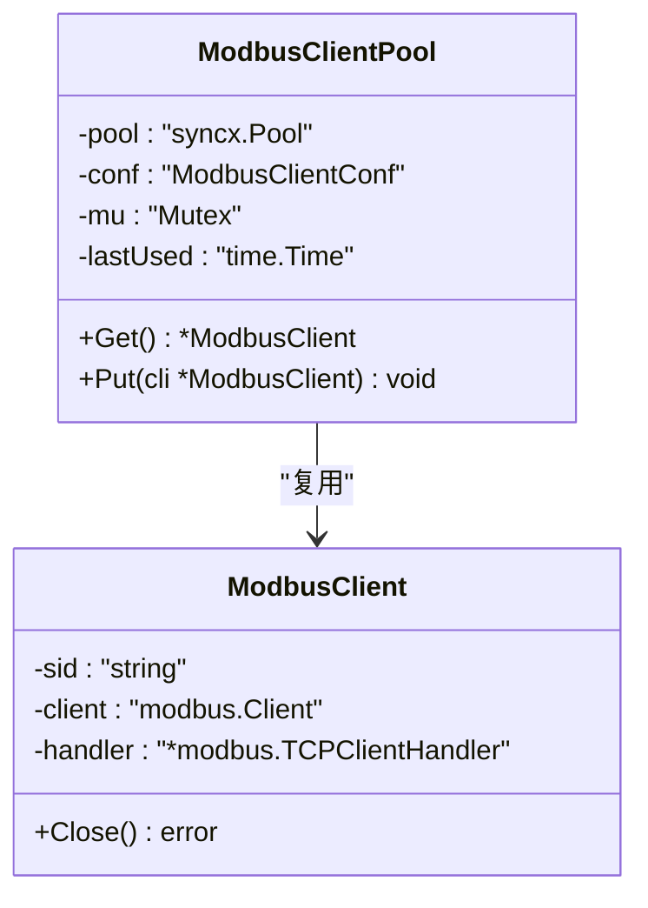
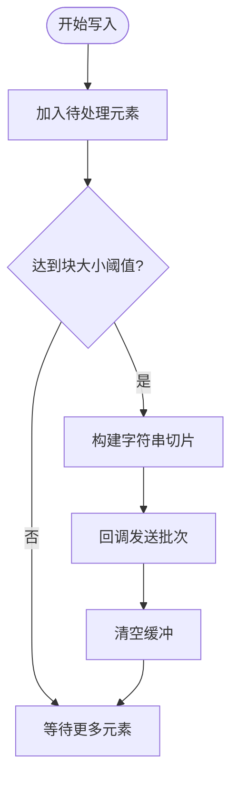
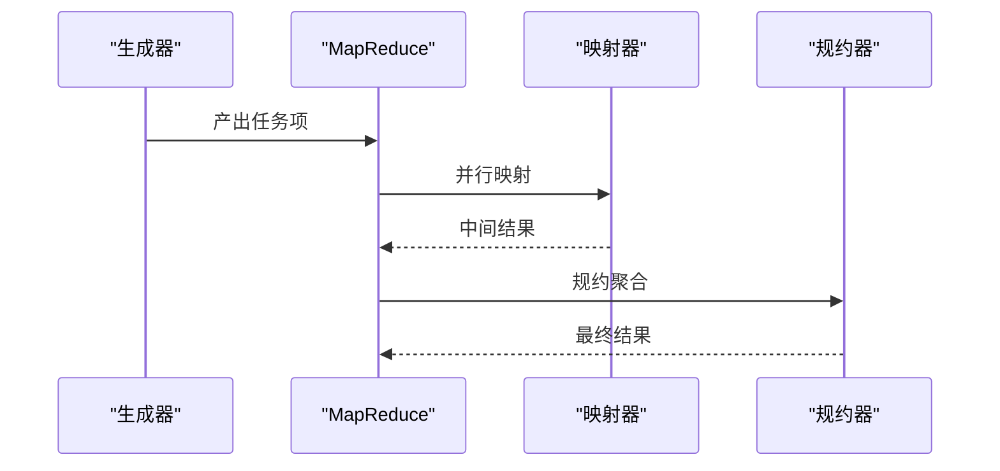
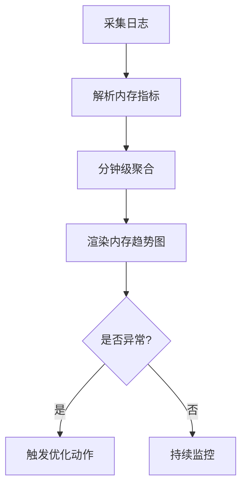
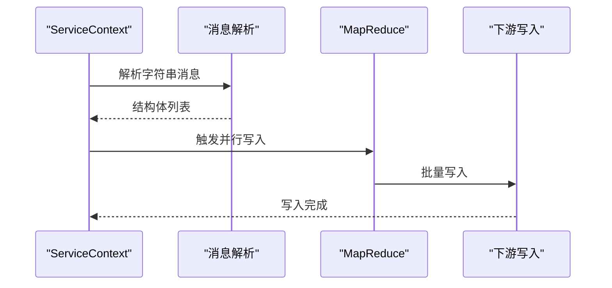
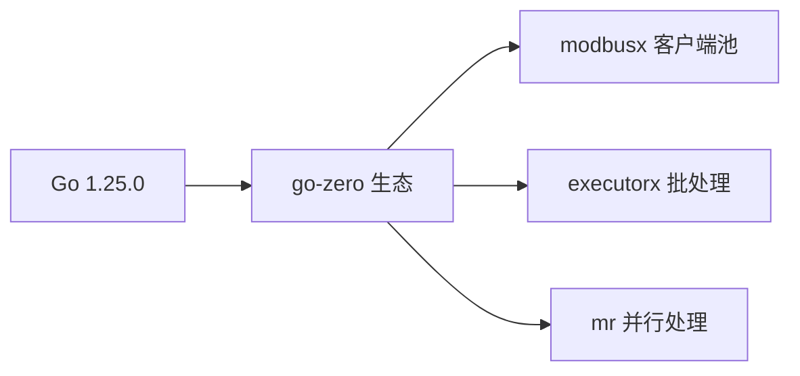

# 内存管理优化

<cite>
**本文引用的文件**
- [go.mod](file://go.mod)
- [common/modbusx/client.go](file://common/modbusx/client.go)
- [common/executorx/chunkmessagespusher.go](file://common/executorx/chunkmessagespusher.go)
- [deploy/stat_analyzer.html](file://deploy/stat_analyzer.html)
- [facade/streamevent/internal/logic/pushchunkasdulogic.go](file://facade/streamevent/internal/logic/pushchunkasdulogic.go)
- [app/ieccaller/internal/svc/servicecontext.go](file://app/ieccaller/internal/svc/servicecontext.go)
- [.trae/skills/zero-skills/references/resilience-patterns.md](file://.trae/skills/zero-skills/references/resilience-patterns.md)
</cite>

## 目录
1. [引言](#引言)
2. [项目结构](#项目结构)
3. [核心组件](#核心组件)
4. [架构总览](#架构总览)
5. [详细组件分析](#详细组件分析)
6. [依赖分析](#依赖分析)
7. [性能考量](#性能考量)
8. [故障排查指南](#故障排查指南)
9. [结论](#结论)
10. [附录](#附录)

## 引言
本指南面向 zero-service 项目的内存管理优化，围绕 Go 语言的内存分配机制、堆栈与堆的区别、垃圾回收器工作原理进行系统梳理；结合项目中的连接池、对象复用、批处理与并发模式，总结内存泄漏预防、内存池与对象复用、大对象处理与内存碎片治理、内存监控与分析工具、以及最佳实践与性能调优建议。文档力求以循序渐进的方式呈现，既适合初学者理解基础概念，也便于资深工程师在生产环境中落地优化。

## 项目结构
从内存管理视角，以下模块与文件对内存使用有直接影响：
- 连接池与对象复用：modbusx 客户端池、消息批处理推送器
- 并发与批处理：MapReduce 并行处理框架
- 内存监控与可视化：部署侧内存趋势分析页面
- 业务链路：IEC 侧消息拼装与批量写入

**图表来源**
- [common/modbusx/client.go:145-191](file://common/modbusx/client.go#L145-L191)
- [common/executorx/chunkmessagespusher.go:17-44](file://common/executorx/chunkmessagespusher.go#L17-L44)
- [.trae/skills/zero-skills/references/resilience-patterns.md:519-563](file://.trae/skills/zero-skills/references/resilience-patterns.md#L519-L563)
- [deploy/stat_analyzer.html:297-1372](file://deploy/stat_analyzer.html#L297-L1372)
- [app/ieccaller/internal/svc/servicecontext.go:76-110](file://app/ieccaller/internal/svc/servicecontext.go#L76-L110)
- [facade/streamevent/internal/logic/pushchunkasdulogic.go:118-222](file://facade/streamevent/internal/logic/pushchunkasdulogic.go#L118-L222)

**章节来源**
- [go.mod:1-245](file://go.mod#L1-L245)

## 核心组件
- Modbus 客户端连接池：通过池化减少频繁创建/销毁带来的分配压力与 GC 压力，支持最大年龄与归还回收。
- 消息批处理推送器：将小消息聚合成批次，降低切片扩容与临时对象数量，提升吞吐并降低内存峰值。
- MapReduce 并行处理：在高吞吐场景下，将任务拆分、并行映射与规约，控制并发度，避免一次性产生大量中间对象。
- 内存监控可视化：从日志中提取 Alloc/Sys/NumGC 等指标，形成内存趋势图，辅助定位异常波动。

**章节来源**
- [common/modbusx/client.go:145-191](file://common/modbusx/client.go#L145-L191)
- [common/executorx/chunkmessagespusher.go:17-44](file://common/executorx/chunkmessagespusher.go#L17-L44)
- [.trae/skills/zero-skills/references/resilience-patterns.md:519-563](file://.trae/skills/zero-skills/references/resilience-patterns.md#L519-L563)
- [deploy/stat_analyzer.html:297-1372](file://deploy/stat_analyzer.html#L297-L1372)

## 架构总览
下面的序列图展示了典型内存优化链路：业务侧将小消息聚合，经由批处理推送器形成批次，再通过 MapReduce 并行处理写入下游，期间连接池复用底层资源，监控页面持续观测内存指标。

**图表来源**
- [common/executorx/chunkmessagespusher.go:26-44](file://common/executorx/chunkmessagespusher.go#L26-L44)
- [common/modbusx/client.go:180-191](file://common/modbusx/client.go#L180-L191)
- [.trae/skills/zero-skills/references/resilience-patterns.md:519-563](file://.trae/skills/zero-skills/references/resilience-patterns.md#L519-L563)

## 详细组件分析

### 组件一：Modbus 客户端连接池
- 设计要点
  - 使用带最大年龄的池化，避免长期占用导致资源泄漏。
  - 获取/归还流程严格成对，确保资源生命周期可控。
  - 池内对象关闭时主动释放底层句柄，防止 FD 泄漏。
- 内存影响
  - 减少频繁创建/销毁带来的堆分配与 GC 抖动。
  - 降低切片扩容与临时对象数量，稳定内存曲线。
- 优化建议
  - 结合业务并发与超时配置，动态调整池大小与最大年龄。
  - 在高抖动场景下，考虑池内对象预热与健康检查。

**图表来源**
- [common/modbusx/client.go:145-191](file://common/modbusx/client.go#L145-L191)
- [common/modbusx/client.go:20-27](file://common/modbusx/client.go#L20-L27)

**章节来源**
- [common/modbusx/client.go:145-191](file://common/modbusx/client.go#L145-L191)

### 组件二：消息批处理推送器
- 设计要点
  - 基于 ChunkExecutor 将不定长字符串聚合成固定字节块，减少切片扩容与临时对象。
  - 写入路径加锁，保证并发安全；执行回调中统一转换为字符串切片，避免类型断言开销。
- 内存影响
  - 显著降低频繁 append 与扩容造成的内存峰值。
  - 将零散对象合并为批次，减少 GC 频率与碎片。
- 优化建议
  - 根据下游吞吐与延迟目标调整块大小，平衡内存与延迟。
  - 对于超大批次，考虑分段处理，避免单次分配过大。

**图表来源**
- [common/executorx/chunkmessagespusher.go:26-44](file://common/executorx/chunkmessagespusher.go#L26-L44)

**章节来源**
- [common/executorx/chunkmessagespusher.go:17-44](file://common/executorx/chunkmessagespusher.go#L17-L44)

### 组件三：MapReduce 并行处理
- 设计要点
  - 通过 MapReduce 控制并发度，避免一次性生成过多中间结果。
  - 生成器、映射器、规约器职责清晰，便于内存回收与 GC 协调。
- 内存影响
  - 并行映射阶段产生的中间对象在完成后可被 GC 回收，降低峰值。
  - 规约阶段集中处理，减少重复拷贝与临时对象。
- 优化建议
  - 合理设置 worker 数量，避免过度并发导致内存压力。
  - 对映射器输出进行就地复用或复用池，减少对象分配。

**图表来源**
- [.trae/skills/zero-skills/references/resilience-patterns.md:519-563](file://.trae/skills/zero-skills/references/resilience-patterns.md#L519-L563)

**章节来源**
- [.trae/skills/zero-skills/references/resilience-patterns.md:519-563](file://.trae/skills/zero-skills/references/resilience-patterns.md#L519-L563)

### 组件四：内存监控与可视化
- 设计要点
  - 从日志中解析 Alloc/Sys/NumGC 等字段，形成内存趋势图与统计面板。
  - 支持分钟级聚合与多指标综合展示，便于发现异常波动。
- 内存影响
  - 及时发现内存增长、GC 次数异常与系统内存上升，指导优化方向。
- 优化建议
  - 将关键链路打点纳入日志，形成闭环监控。
  - 结合业务时段特征，设定告警阈值与基线。

**图表来源**
- [deploy/stat_analyzer.html:297-1372](file://deploy/stat_analyzer.html#L297-L1372)

**章节来源**
- [deploy/stat_analyzer.html:297-1372](file://deploy/stat_analyzer.html#L297-L1372)

### 业务链路：IEC 消息拼装与批量写入
- 设计要点
  - 将字符串消息解析为结构体列表，统一构造下游所需字段，减少重复解析。
  - 通过 MapReduce 并行写入，降低单点瓶颈与内存堆积。
- 内存影响
  - 结构体复用与就地填充，减少临时对象与拷贝。
  - 并行写入缩短处理时延，降低队列积压与内存占用。
- 优化建议
  - 对热点字段采用对象池或复用器，避免重复分配。
  - 控制批次大小与并发度，避免内存峰值过高。

**图表来源**
- [app/ieccaller/internal/svc/servicecontext.go:76-110](file://app/ieccaller/internal/svc/servicecontext.go#L76-L110)
- [facade/streamevent/internal/logic/pushchunkasdulogic.go:118-222](file://facade/streamevent/internal/logic/pushchunkasdulogic.go#L118-L222)

**章节来源**
- [app/ieccaller/internal/svc/servicecontext.go:76-110](file://app/ieccaller/internal/svc/servicecontext.go#L76-L110)
- [facade/streamevent/internal/logic/pushchunkasdulogic.go:118-222](file://facade/streamevent/internal/logic/pushchunkasdulogic.go#L118-L222)

## 依赖分析
- 运行时版本与依赖
  - 项目使用较新的 Go 版本，配合 go-zero 生态的并发与批处理能力，有利于内存优化落地。
  - 第三方库如 modbus、executors、mr 等为内存优化提供了基础设施。

**图表来源**
- [go.mod:1-245](file://go.mod#L1-L245)

**章节来源**
- [go.mod:1-245](file://go.mod#L1-L245)

## 性能考量
- 堆栈分配与内存布局
  - 小对象优先栈上分配，避免逃逸至堆；函数局部变量尽量复用，减少临时对象。
  - 大对象与长生命周期对象尽量堆上分配，配合池化与复用。
- 垃圾回收器工作原理
  - 通过池化与复用降低分配频率，减少 GC 触发频次与停顿时间。
  - 控制对象存活期，避免长尾对象滞留。
- 内存使用优化
  - 连接池与对象池：控制池大小与最大年龄，避免资源泄漏。
  - 批处理：统一聚合，减少扩容与拷贝。
  - 并发控制：合理设置并发度，避免内存峰值过高。
- 大对象处理与内存碎片
  - 大对象尽量复用或复用池，避免频繁分配与释放。
  - 对热点字段采用对象池，减少碎片与分配压力。
- 监控与分析
  - 通过日志指标与可视化图表，持续观察 Alloc/Sys/NumGC，建立基线与告警。

[本节为通用性能讨论，不直接分析具体文件]

## 故障排查指南
- 常见问题
  - 连接池未正确归还：检查获取/归还配对，确保异常路径也能归还。
  - 批处理块大小不当：过大导致峰值过高，过小导致吞吐下降。
  - 并发度过高：导致内存峰值与 GC 压力上升。
- 排查步骤
  - 采集日志指标，确认 Alloc/Sys/NumGC 趋势。
  - 定位热点链路，核对 MapReduce 并发度与批处理阈值。
  - 检查连接池配置与最大年龄，避免资源泄漏。
- 工具与手段
  - 日志解析与可视化：用于发现异常波动。
  - 并发与批处理参数：用于快速验证优化效果。

**章节来源**
- [deploy/stat_analyzer.html:297-1372](file://deploy/stat_analyzer.html#L297-L1372)
- [common/modbusx/client.go:180-191](file://common/modbusx/client.go#L180-L191)
- [common/executorx/chunkmessagespusher.go:17-44](file://common/executorx/chunkmessagespusher.go#L17-L44)

## 结论
通过对连接池、批处理、并行处理与监控体系的系统性优化，zero-service 可显著降低内存峰值、减少 GC 压力并提升整体吞吐。建议在生产环境中持续监控内存指标，结合业务特征动态调整池大小、批处理阈值与并发度，形成“可观测—可优化—可回归”的闭环。

[本节为总结性内容，不直接分析具体文件]

## 附录
- 最佳实践清单
  - 使用连接池与对象池，避免频繁创建/销毁。
  - 采用批处理与聚合，减少临时对象与扩容。
  - 控制并发度，避免内存峰值过高。
  - 建立内存监控与可视化，持续观测 Alloc/Sys/NumGC。
  - 对热点字段与大对象采用对象池与复用策略。
  - 在异常路径确保资源归还与释放。

[本节为通用建议，不直接分析具体文件]