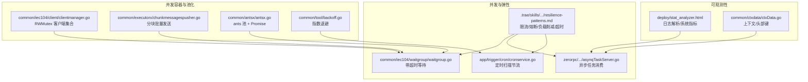
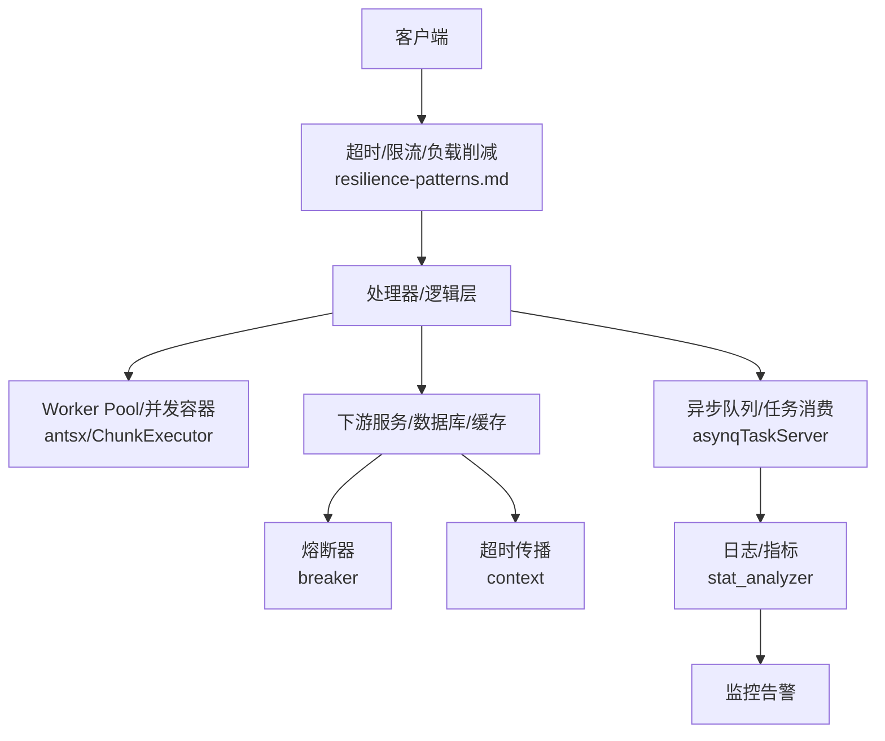
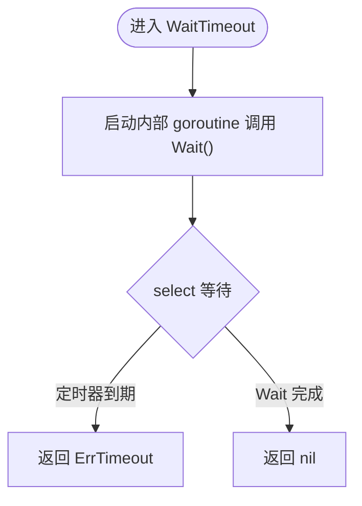
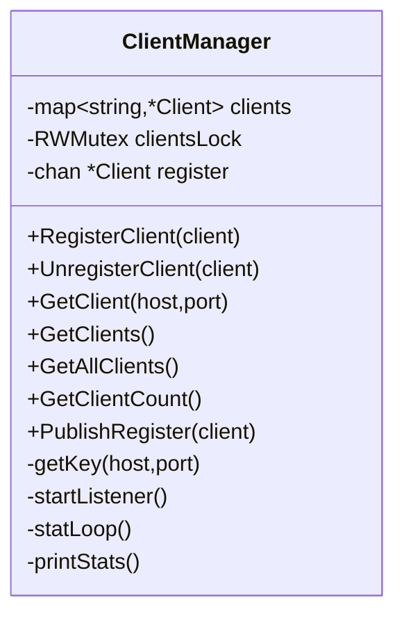
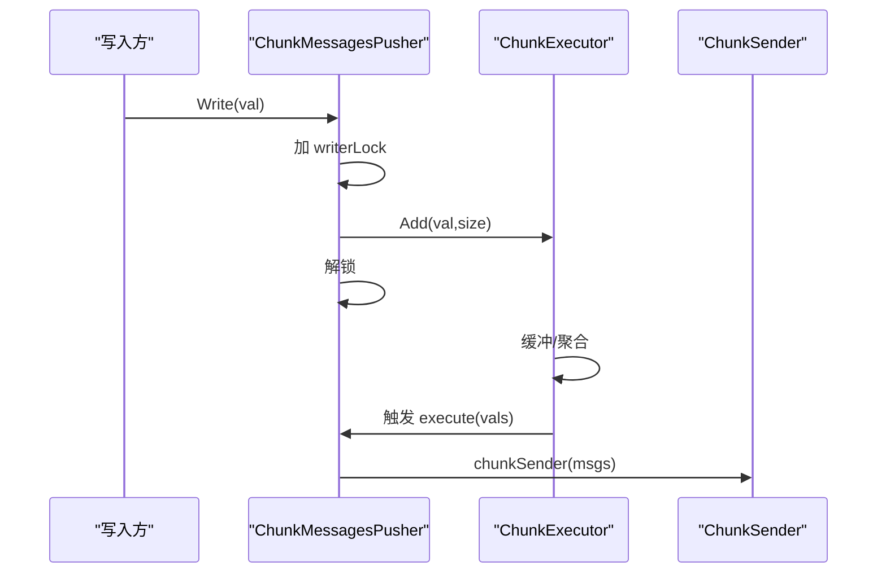
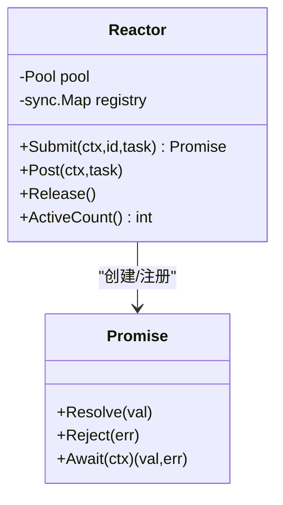
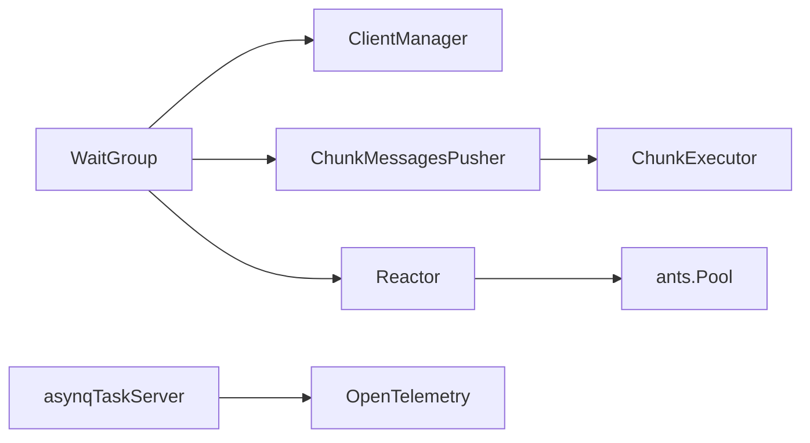

# 并发处理优化

<cite>
**本文引用的文件**
- [resilience-patterns.md](file://.trae/skills/zero-skills/references/resilience-patterns.md)
- [waitgroup.go](file://common/iec104/waitgroup/waitgroup.go)
- [clientmanager.go](file://common/iec104/client/clientmanager.go)
- [chunkmessagespusher.go](file://common/executorx/chunkmessagespusher.go)
- [antsx.go](file://common/antsx/antsx.go)
- [backoff.go](file://common/tool/backoff.go)
- [cronservice.go](file://app/trigger/cron/cronservice.go)
- [asynqTaskServer.go](file://zerorpc/internal/svc/asynqTaskServer.go)
- [stat_analyzer.html](file://deploy/stat_analyzer.html)
- [ctxData.go](file://common/ctxdata/ctxData.go)
</cite>

## 目录
1. [引言](#引言)
2. [项目结构](#项目结构)
3. [核心组件](#核心组件)
4. [架构总览](#架构总览)
5. [详细组件分析](#详细组件分析)
6. [依赖分析](#依赖分析)
7. [性能考虑](#性能考虑)
8. [故障排查指南](#故障排查指南)
9. [结论](#结论)
10. [附录](#附录)

## 引言
本指南面向 zero-service 项目的并发处理优化，围绕以下主题展开：goroutine 池与 worker pool 模式、goroutine 数量控制与资源限制、并发安全编程（互斥锁、读写锁、无锁思路）、限流与熔断（令牌桶、漏桶、Hystrix 熔断器）、并发性能优化（模式设计、锁竞争降低、上下文切换优化）、并发监控与调试（goroutine 状态、死锁检测、性能分析工具）、以及最佳实践与常见陷阱。文档结合仓库内现有实现与通用模式进行说明，并提供可视化图示帮助理解。

## 项目结构
从并发角度，以下模块与路径与本指南密切相关：
- 限流与弹性：resilience-patterns.md（令牌桶、周期配额、熔断、负载削减、超时）
- 并发同步与等待：common/iec104/waitgroup/waitgroup.go（带超时的 WaitGroup 包装）
- 客户端管理与并发容器：common/iec104/client/clientmanager.go（RWMutex 保护的客户端集合）
- 分块批量发送：common/executorx/chunkmessagespusher.go（ChunkExecutor + 写锁）
- 自定义 goroutine 池：common/antsx/antsx.go（基于 ants 的 Reactor/Promise 模式）
- 背压与退避：common/tool/backoff.go（指数退避与上限）
- 异步任务与消费链路：zerorpc/internal/svc/asynqTaskServer.go（日志中间件、消费 span）
- 定时扫描与节流：app/trigger/cron/cronservice.go（自适应睡眠与定时器）
- 统计分析与可观测性：deploy/stat_analyzer.html（日志解析与系统指标统计）
- 上下文与传播：common/ctxdata/ctxData.go（gRPC 头部键、上下文键）

**图表来源**
- [resilience-patterns.md](file://.trae/skills/zero-skills/references/resilience-patterns.md)
- [waitgroup.go](file://common/iec104/waitgroup/waitgroup.go)
- [clientmanager.go](file://common/iec104/client/clientmanager.go)
- [chunkmessagespusher.go](file://common/executorx/chunkmessagespusher.go)
- [antsx.go](file://common/antsx/antsx.go)
- [backoff.go](file://common/tool/backoff.go)
- [cronservice.go](file://app/trigger/cron/cronservice.go)
- [asynqTaskServer.go](file://zerorpc/internal/svc/asynqTaskServer.go)
- [stat_analyzer.html](file://deploy/stat_analyzer.html)
- [ctxData.go](file://common/ctxdata/ctxData.go)

**章节来源**
- [resilience-patterns.md](file://.trae/skills/zero-skills/references/resilience-patterns.md)
- [waitgroup.go](file://common/iec104/waitgroup/waitgroup.go)
- [clientmanager.go](file://common/iec104/client/clientmanager.go)
- [chunkmessagespusher.go](file://common/executorx/chunkmessagespusher.go)
- [antsx.go](file://common/antsx/antsx.go)
- [backoff.go](file://common/tool/backoff.go)
- [cronservice.go](file://app/trigger/cron/cronservice.go)
- [asynqTaskServer.go](file://zerorpc/internal/svc/asynqTaskServer.go)
- [stat_analyzer.html](file://deploy/stat_analyzer.html)
- [ctxData.go](file://common/ctxdata/ctxData.go)

## 核心组件
- 带超时等待的 WaitGroup：在等待 goroutine 完成时增加超时保护，避免阻塞导致泄漏。
- RWMutex 客户端管理器：读多写少场景下的高并发客户端注册/查询。
- 分块批量发送器：将小消息聚合成批次，减少调用次数与锁竞争。
- 自定义 goroutine 池（Reactor）：基于 ants 的池化执行与 Promise 结果收集。
- 指数退避：对失败重试进行指数增长延迟，防止级联故障。
- 异步任务消费链路：日志中间件、消费 span、上下文字段记录。
- 定时扫描与节流：根据处理结果动态调整轮询间隔，降低空转开销。
- 统计分析与可观测性：日志解析脚本提取 QPS、内存、GC 等指标；上下文键用于跨服务追踪。

**章节来源**
- [waitgroup.go](file://common/iec104/waitgroup/waitgroup.go)
- [clientmanager.go](file://common/iec104/client/clientmanager.go)
- [chunkmessagespusher.go](file://common/executorx/chunkmessagespusher.go)
- [antsx.go](file://common/antsx/antsx.go)
- [backoff.go](file://common/tool/backoff.go)
- [asynqTaskServer.go](file://zerorpc/internal/svc/asynqTaskServer.go)
- [cronservice.go](file://app/trigger/cron/cronservice.go)
- [stat_analyzer.html](file://deploy/stat_analyzer.html)
- [ctxData.go](file://common/ctxdata/ctxData.go)

## 架构总览
下图展示并发处理在请求生命周期中的关键节点：入口层（超时/限流/负载削减）、业务层（worker pool/并发容器）、下游（熔断/超时）、异步队列（异步任务消费）与观测（日志/指标）。

**图表来源**
- [resilience-patterns.md](file://.trae/skills/zero-skills/references/resilience-patterns.md)
- [antsx.go](file://common/antsx/antsx.go)
- [chunkmessagespusher.go](file://common/executorx/chunkmessagespusher.go)
- [asynqTaskServer.go](file://zerorpc/internal/svc/asynqTaskServer.go)
- [stat_analyzer.html](file://deploy/stat_analyzer.html)

## 详细组件分析

### 组件A：带超时等待的 WaitGroup（等待与泄漏防护）
- 设计要点
  - 包装 sync.WaitGroup，提供 WaitTimeout/Await/AwaitWithError，避免无限等待导致 goroutine 泄漏。
  - 通过内部 goroutine + select 实现超时控制，返回 ErrTimeout 或正常完成。
- 并发安全
  - WaitTimeout 内部 goroutine 与 Wait() 协作，select 保证超时优先。
- 性能影响
  - 额外 goroutine 与 channel 开销较小，换取稳定性与可恢复性。
- 使用建议
  - 对可能阻塞的批量操作（如批量写入、批量关闭）使用 WaitTimeout。
  - 在 goroutine 泄漏风险高的场景（如热重启、异常分支）务必设置超时。

**图表来源**
- [waitgroup.go](file://common/iec104/waitgroup/waitgroup.go)

**章节来源**
- [waitgroup.go](file://common/iec104/waitgroup/waitgroup.go)

### 组件B：RWMutex 客户端管理器（读写锁优化）
- 设计要点
  - 使用 sync.RWMutex 保护客户端映射，读多写少场景下提升并发度。
  - 注册/注销/查询均通过锁保护，统计循环每分钟打印连接状态。
- 并发安全
  - 读路径使用 RLock/RUnlock，写路径使用 Lock/Unlock，避免写饥饿。
- 性能影响
  - 读写分离显著降低热点写锁竞争；统计循环独立于业务路径。
- 使用建议
  - 对频繁查询、低频变更的数据结构优先采用读写锁。
  - 将统计/巡检等非关键路径放入独立 goroutine，避免阻塞主流程。

**图表来源**
- [clientmanager.go](file://common/iec104/client/clientmanager.go)

**章节来源**
- [clientmanager.go](file://common/iec104/client/clientmanager.go)

### 组件C：分块批量发送器（减少锁竞争与系统调用）
- 设计要点
  - 基于 executors.ChunkExecutor 将小消息聚合成批次，降低调用次数。
  - writerLock.Mutex 保护 inserter.Add，避免并发写入冲突。
- 并发安全
  - 写路径加锁，执行回调在池化执行器中进行，避免阻塞写入线程。
- 性能影响
  - 批处理显著降低网络/IO 调用次数；锁粒度小，适合高频写入场景。
- 使用建议
  - 合理设置分块字节阈值，平衡吞吐与延迟。
  - 对不可聚合的小对象，考虑引入无锁队列或 ring buffer。

**图表来源**
- [chunkmessagespusher.go](file://common/executorx/chunkmessagespusher.go)

**章节来源**
- [chunkmessagespusher.go](file://common/executorx/chunkmessagespusher.go)

### 组件D：自定义 goroutine 池（Reactor/Promise）
- 设计要点
  - 基于 ants.NewPool 创建固定大小池，Submit 提交任务。
  - Promise 模式用于任务去中心化结果收集，注册表避免重复 id。
  - Fire-and-forget 提供 Post 接口，简化无结果任务。
- 并发安全
  - registry 使用 sync.Map，提交/删除在池化 goroutine 中进行，避免竞态。
- 性能影响
  - 固定池大小限制并发度，避免资源耗尽；Promise 降低回调地狱。
- 使用建议
  - 对批处理/IO 密集任务优先使用 Reactor。
  - 注意池容量与任务类型匹配，避免长任务占用资源。

**图表来源**
- [antsx.go](file://common/antsx/antsx.go)

**章节来源**
- [antsx.go](file://common/antsx/antsx.go)

### 组件E：指数退避与触发时间计算
- 设计要点
  - 根据失败次数计算下次触发时间，超过阈值采用上限，防止无限膨胀。
  - 支持字符串格式化输出，便于日志与告警。
- 并发安全
  - 仅使用纯函数与时间计算，无共享状态。
- 使用建议
  - 与重试策略配合，避免雪崩效应。
  - 对不同任务设定不同默认超时与上限。

**章节来源**
- [backoff.go](file://common/tool/backoff.go)

### 组件F：异步任务消费链路（日志中间件与消费 span）
- 设计要点
  - LoggingMiddleware 记录任务开始/结束与耗时，统一日志字段。
  - StartAsynqConsumerSpan 为消费任务创建 span，便于链路追踪。
- 并发安全
  - 日志写入为顺序 IO，无共享状态；span 属性设置线程安全。
- 使用建议
  - 在任务处理前后打点，结合指标系统定位瓶颈。
  - 对异常任务记录错误堆栈与耗时，辅助排障。

**章节来源**
- [asynqTaskServer.go](file://zerorpc/internal/svc/asynqTaskServer.go)

### 组件G：定时扫描与自适应节流
- 设计要点
  - 根据扫描结果动态调整 sleepDuration，空闲时随机抖动，避免忙等。
  - 使用 time.Timer 与 select 控制退出与休眠。
- 并发安全
  - cancelChan 用于优雅退出，Stop 防止 timer 触发。
- 使用建议
  - 对高频扫描任务采用指数退避或自适应策略。
  - 与背压/限速结合，避免 CPU 空转。

**章节来源**
- [cronservice.go](file://app/trigger/cron/cronservice.go)

### 组件H：统计分析与可观测性
- 设计要点
  - 日志解析脚本提取 Alloc/TotalAlloc/Sys/NumGC/QPS 等指标。
  - 通过上下文键与 gRPC 头部键实现跨服务追踪。
- 使用建议
  - 将关键路径耗时与错误率纳入监控看板。
  - 对高延迟任务开启采样日志，避免日志风暴。

**章节来源**
- [stat_analyzer.html](file://deploy/stat_analyzer.html)
- [ctxData.go](file://common/ctxdata/ctxData.go)

## 依赖分析
- 组件耦合
  - WaitGroup 与各并发组件解耦，提供通用等待能力。
  - RWMutex 客户端管理器与业务查询路径解耦，统计循环独立。
  - ChunkExecutor 与发送器解耦，Promises 与池解耦。
- 外部依赖
  - ants.Pool 提供 goroutine 池能力。
  - executors.ChunkExecutor 提供分块执行能力。
  - OpenTelemetry 提供链路追踪与 span。
- 循环依赖
  - 未发现循环导入；各模块职责清晰。

**图表来源**
- [waitgroup.go](file://common/iec104/waitgroup/waitgroup.go)
- [clientmanager.go](file://common/iec104/client/clientmanager.go)
- [chunkmessagespusher.go](file://common/executorx/chunkmessagespusher.go)
- [antsx.go](file://common/antsx/antsx.go)
- [asynqTaskServer.go](file://zerorpc/internal/svc/asynqTaskServer.go)

**章节来源**
- [waitgroup.go](file://common/iec104/waitgroup/waitgroup.go)
- [clientmanager.go](file://common/iec104/client/clientmanager.go)
- [chunkmessagespusher.go](file://common/executorx/chunkmessagespusher.go)
- [antsx.go](file://common/antsx/antsx.go)
- [asynqTaskServer.go](file://zerorpc/internal/svc/asynqTaskServer.go)

## 性能考虑
- 并发模式设计
  - 读多写少场景优先使用 RWMutex；写少读多场景可考虑读写分离。
  - 批处理优先：ChunkExecutor/分块发送器降低系统调用与锁竞争。
- 锁竞争减少
  - 将统计/巡检放入独立 goroutine，避免阻塞主业务路径。
  - 使用 sync.Map 与无锁结构（如原子计数）替代全局互斥。
- 上下文切换优化
  - 固定大小 goroutine 池限制并发度，避免过多上下文切换。
  - 自适应扫描与背压策略降低无效轮询。
- 资源限制策略
  - 通过池大小、分块阈值、超时时间三要素控制资源占用。
  - 对下游使用熔断与限流，避免级联故障。

[本节为通用指导，无需列出具体文件来源]

## 故障排查指南
- goroutine 状态监控
  - 使用 WaitTimeout/Await 检测长时间阻塞；结合日志定位阻塞点。
  - 通过 asynq 日志中间件观察任务耗时与错误分布。
- 死锁检测
  - RWMutex 使用建议：读写分离、避免在持有写锁期间发起写操作。
  - 对注册/注销流程增加超时与重试，避免死锁窗口。
- 性能分析工具使用
  - 使用 stat_analyzer.html 提取 QPS、内存、GC 指标，定位异常时段。
  - 结合 OpenTelemetry span 与上下文键，追踪慢请求路径。
- 常见问题
  - 无限等待：统一使用 WaitTimeout。
  - 资源耗尽：限制池大小与分块阈值，启用熔断与负载削减。
  - 雪崩效应：指数退避 + 限速 + 背压。

**章节来源**
- [waitgroup.go](file://common/iec104/waitgroup/waitgroup.go)
- [asynqTaskServer.go](file://zerorpc/internal/svc/asynqTaskServer.go)
- [stat_analyzer.html](file://deploy/stat_analyzer.html)
- [ctxData.go](file://common/ctxdata/ctxData.go)

## 结论
zero-service 在并发处理方面提供了较为完善的基础设施：带超时等待的 WaitGroup、RWMutex 客户端管理、分块批量发送、ants 池化执行、指数退避、异步任务消费与可观测性工具。结合 resilience-patterns.md 中的限流、熔断、负载削减与超时策略，可在生产环境中构建稳定、可扩展且可观察的并发体系。建议在新增并发功能时遵循“池化、批处理、超时、可观测”的原则，并持续以指标驱动优化。

[本节为总结性内容，无需列出具体文件来源]

## 附录
- 最佳实践清单
  - 使用 worker pool 控制并发度，避免无界 goroutine。
  - 读多写少场景使用 RWMutex，写路径尽量短小。
  - 批处理优先，减少系统调用与锁竞争。
  - 为所有外部调用配置超时与熔断。
  - 为关键路径添加日志与 span，统一上下文键。
  - 对高频扫描采用自适应节流与背压。
- 常见陷阱
  - 忽视 Wait() 超时，导致 goroutine 泄漏。
  - 在持有写锁期间执行写操作，引发死锁。
  - 未设置池大小与分块阈值，造成资源耗尽。
  - 忽略熔断与限流，导致级联故障。
  - 未记录慢请求与错误堆栈，难以定位问题。

[本节为通用指导，无需列出具体文件来源]