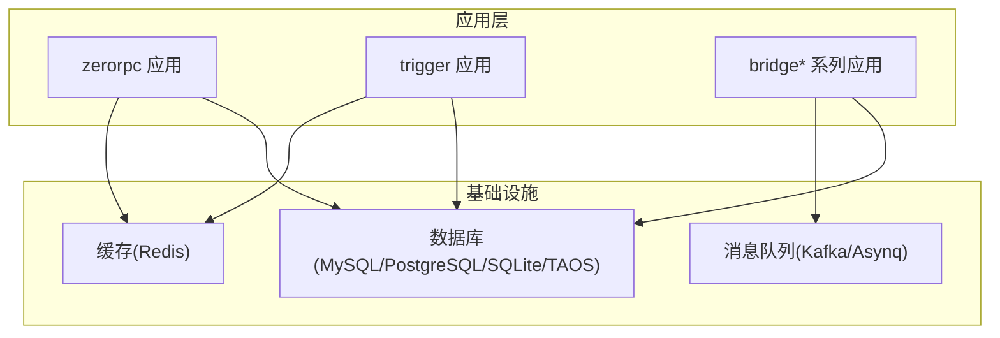
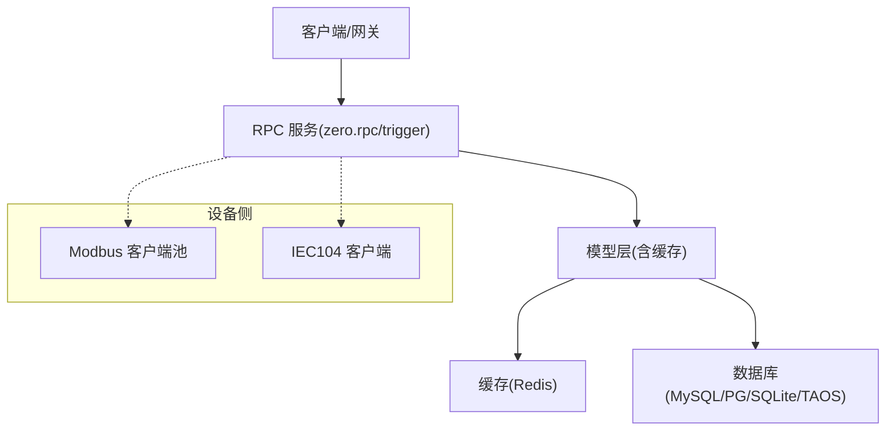
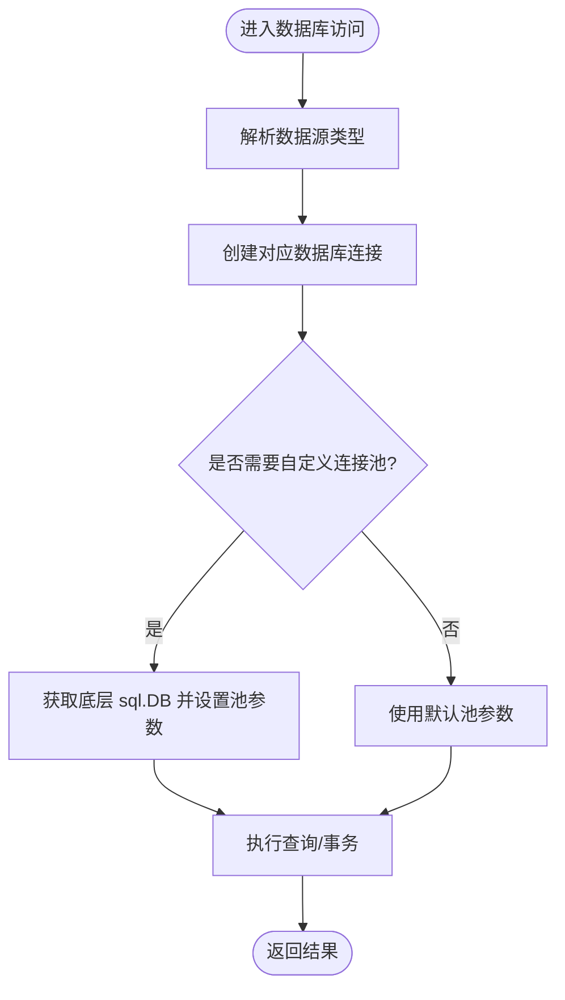
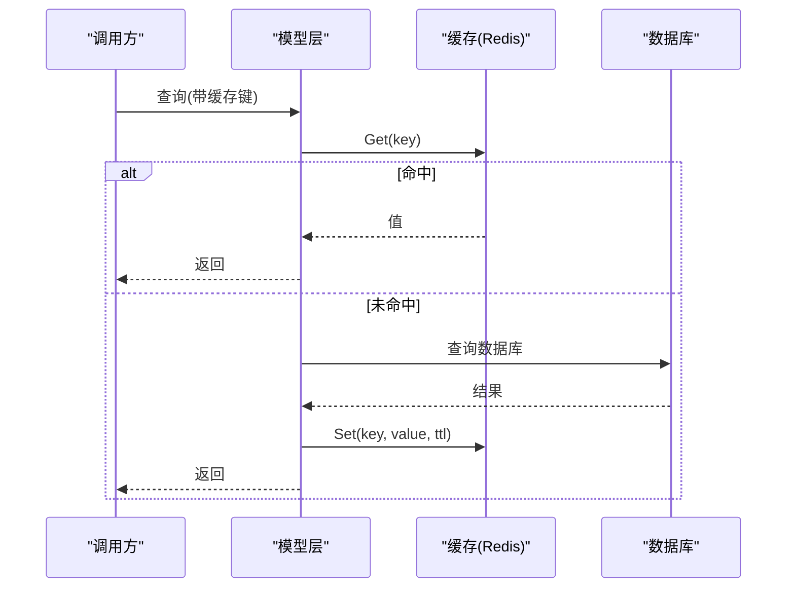
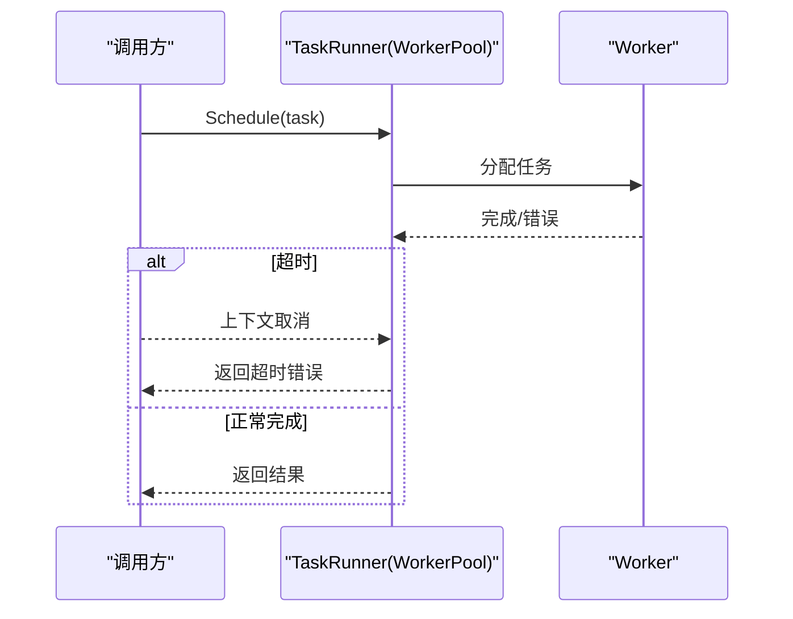
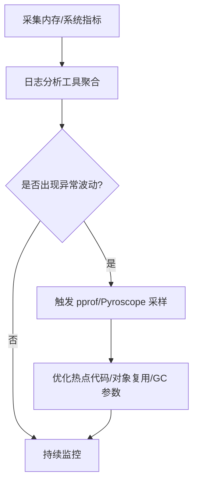
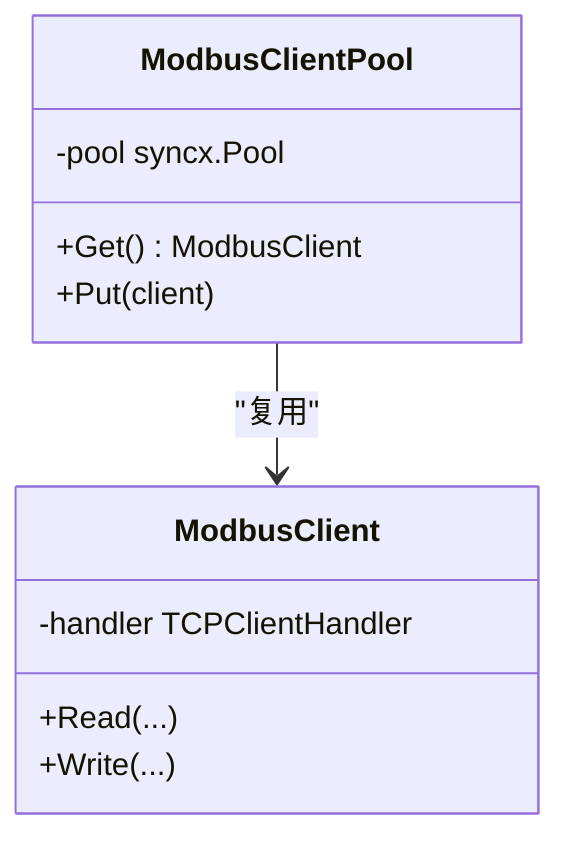
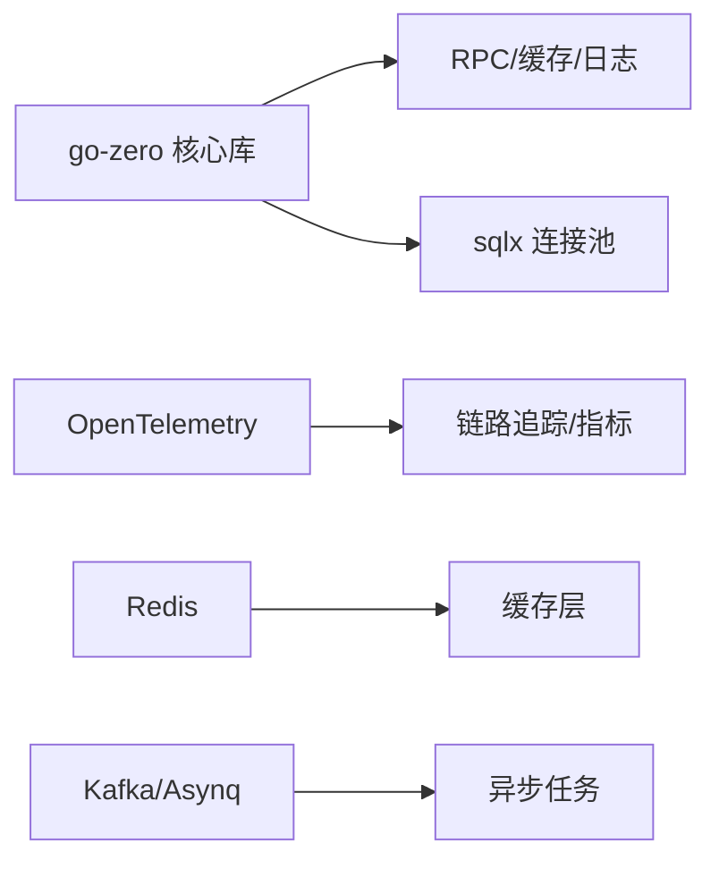

# 性能优化实践

<cite>
**本文引用的文件**
- [go.mod](file://go.mod)
- [go.sum](file://go.sum)
- [common/dbx/dbx.go](file://common/dbx/dbx.go)
- [zerorpc/internal/config/config.go](file://zerorpc/internal/config/config.go)
- [app/trigger/internal/config/config.go](file://app/trigger/internal/config/config.go)
- [app/trigger/etc/trigger.yaml](file://app/trigger/etc/trigger.yaml)
- [zerorpc/etc/zerorpc.yaml](file://zerorpc/etc/zerorpc.yaml)
- [.trae/skills/zero-skills/references/database-patterns.md](file://.trae/skills/zero-skills/references/database-patterns.md)
- [.trae/skills/zero-skills/references/resilience-patterns.md](file://.trae/skills/zero-skills/references/resilience-patterns.md)
- [common/modbusx/config.go](file://common/modbusx/config.go)
- [common/modbusx/client.go](file://common/modbusx/client.go)
- [common/iec104/client/core.go](file://common/iec104/client/core.go)
- [common/iec104/waitgroup/waitgroup.go](file://common/iec104/waitgroup/waitgroup.go)
- [deploy/stat_analyzer.html](file://deploy/stat_analyzer.html)
- [model/devicepointmappingmodel.go](file://model/devicepointmappingmodel.go)
</cite>

## 目录
1. [简介](#简介)
2. [项目结构](#项目结构)
3. [核心组件](#核心组件)
4. [架构总览](#架构总览)
5. [详细组件分析](#详细组件分析)
6. [依赖分析](#依赖分析)
7. [性能考量](#性能考量)
8. [故障排查指南](#故障排查指南)
9. [结论](#结论)
10. [附录](#附录)

## 简介
本指南面向 zero-service 项目的性能优化与工程落地，围绕数据库查询优化、缓存策略、并发处理、内存与 GC、网络优化、性能监控与指标采集、性能测试与基准实践等方面，结合仓库中的实际实现与配置，给出可操作的最佳实践建议。

## 项目结构
- 项目采用多应用模块化组织，每个子应用（如 trigger、zerorpc、bridge* 等）均包含独立的配置文件与服务入口，便于按需启用与隔离。
- 数据库访问通过统一适配层封装，支持 MySQL、PostgreSQL、SQLite、TDengine 等多种后端；缓存配置在各应用配置中集中体现。
- 通过 go-zero 生态提供的连接池、缓存模型、RPC 网关等能力，形成一致的性能基线。

**章节来源**
- [go.mod:1-245](file://go.mod#L1-L245)

## 核心组件
- 数据库适配与连接池
  - 统一解析数据源类型并创建连接，支持 MySQL、PostgreSQL、SQLite、TDengine。
  - 提供基于 go-zero 的连接池默认值与自定义扩展能力。
- 缓存配置与模型
  - 在应用配置中声明缓存集群，模型层自动启用缓存读写与失效。
  - 支持自定义缓存键与手动缓存操作。
- 并发与限流
  - 使用 go-zero 的 worker pool 控制并发任务数量。
  - 结合等待组与超时控制，避免 goroutine 泄漏。
- 设备协议与网络
  - Modbus/TCP 客户端连接池与参数调优。
  - IEC104 客户端连接管理与自动重连策略。
- 性能监控与可视化
  - 内置日志分析工具，支持内存趋势、QPS、限流状态、缓存命中率等指标可视化。

**章节来源**
- [common/dbx/dbx.go:1-155](file://common/dbx/dbx.go#L1-L155)
- [zerorpc/internal/config/config.go:1-25](file://zerorpc/internal/config/config.go#L1-L25)
- [app/trigger/internal/config/config.go:1-28](file://app/trigger/internal/config/config.go#L1-L28)
- [.trae/skills/zero-skills/references/database-patterns.md:448-480](file://.trae/skills/zero-skills/references/database-patterns.md#L448-L480)
- [.trae/skills/zero-skills/references/resilience-patterns.md:491-517](file://.trae/skills/zero-skills/references/resilience-patterns.md#L491-L517)
- [common/modbusx/config.go:78-124](file://common/modbusx/config.go#L78-L124)
- [common/modbusx/client.go:106-151](file://common/modbusx/client.go#L106-L151)
- [common/iec104/client/core.go:177-311](file://common/iec104/client/core.go#L177-L311)
- [deploy/stat_analyzer.html:1224-1352](file://deploy/stat_analyzer.html#L1224-L1352)

## 架构总览
- 数据访问路径：应用逻辑 -> 模型层 -> 缓存 -> 数据库；更新时自动失效缓存。
- 并发控制：worker pool 限制并发，配合等待组与超时控制。
- 协议接入：Modbus/IEC104 通过连接池与参数调优提升稳定性与吞吐。
- 监控可视化：日志分析工具聚合内存、QPS、限流、缓存命中等指标。

**图表来源**
- [zerorpc/etc/zerorpc.yaml:1-39](file://zerorpc/etc/zerorpc.yaml#L1-L39)
- [app/trigger/etc/trigger.yaml:1-37](file://app/trigger/etc/trigger.yaml#L1-L37)
- [common/dbx/dbx.go:46-64](file://common/dbx/dbx.go#L46-L64)

## 详细组件分析

### 数据库查询优化与连接池
- 自动数据库类型识别与连接创建，确保不同后端的一致使用体验。
- 默认连接池参数由 go-zero 提供，可通过 RawDB 获取底层 sql.DB 进行自定义调整。
- 建议：
  - 明确区分读写分离与热点表，针对热点表开启缓存。
  - 合理设置 MaxOpenConns、MaxIdleConns、ConnMaxLifetime，避免连接抖动。
  - 对高频查询建立合适索引，避免全表扫描；对复杂查询使用 EXPLAIN 分析执行计划。

**图表来源**
- [common/dbx/dbx.go:31-64](file://common/dbx/dbx.go#L31-L64)
- [.trae/skills/zero-skills/references/database-patterns.md:450-479](file://.trae/skills/zero-skills/references/database-patterns.md#L450-L479)

**章节来源**
- [common/dbx/dbx.go:1-155](file://common/dbx/dbx.go#L1-L155)
- [.trae/skills/zero-skills/references/database-patterns.md:448-480](file://.trae/skills/zero-skills/references/database-patterns.md#L448-L480)

### 缓存策略设计与实现
- 应用配置中声明缓存集群，模型层自动启用缓存读写与失效。
- 支持自定义缓存键与手动缓存操作，满足复杂查询场景。
- 建议：
  - 优先使用主键/唯一索引命中缓存，减少数据库压力。
  - 对热点数据设置合理过期时间，避免缓存雪崩。
  - 使用缓存预热与异步失效，降低突发流量冲击。
  - 防范缓存穿透：对空结果也写入短 TTL 的占位条目。

**图表来源**
- [.trae/skills/zero-skills/references/database-patterns.md:367-429](file://.trae/skills/zero-skills/references/database-patterns.md#L367-L429)
- [zerorpc/internal/config/config.go:20-24](file://zerorpc/internal/config/config.go#L20-L24)

**章节来源**
- [zerorpc/internal/config/config.go:1-25](file://zerorpc/internal/config/config.go#L1-L25)
- [.trae/skills/zero-skills/references/database-patterns.md:367-429](file://.trae/skills/zero-skills/references/database-patterns.md#L367-L429)
- [model/devicepointmappingmodel.go:66-107](file://model/devicepointmappingmodel.go#L66-L107)

### 并发处理优化（Worker Pool 与等待组）
- 使用 worker pool 限制并发，避免资源耗尽。
- 通过等待组与超时控制，保证 goroutine 不泄漏并及时响应。
- 建议：
  - 为不同任务类型划分独立的 worker pool，避免相互影响。
  - 对批量任务进行分片与背压控制，防止瞬时洪峰。
  - 使用上下文取消与超时，确保异常场景快速恢复。

**图表来源**
- [.trae/skills/zero-skills/references/resilience-patterns.md:491-517](file://.trae/skills/zero-skills/references/resilience-patterns.md#L491-L517)
- [common/iec104/waitgroup/waitgroup.go:57-112](file://common/iec104/waitgroup/waitgroup.go#L57-L112)

**章节来源**
- [.trae/skills/zero-skills/references/resilience-patterns.md:491-517](file://.trae/skills/zero-skills/references/resilience-patterns.md#L491-L517)
- [common/iec104/waitgroup/waitgroup.go:57-112](file://common/iec104/waitgroup/waitgroup.go#L57-L112)

### 内存管理与垃圾回收优化
- 通过日志分析工具观察内存分配与系统指标，定位 GC 抖动与内存泄漏风险。
- 建议：
  - 减少临时对象创建，优先复用缓冲区与对象池。
  - 合理设置 GOGC 与 GOMAXPROCS，结合 automaxprocs 自动调优。
  - 使用 pprof/Pyroscope 进行采样分析，识别热点函数与逃逸分配。

**图表来源**
- [deploy/stat_analyzer.html:1224-1352](file://deploy/stat_analyzer.html#L1224-L1352)
- [go.sum:561-603](file://go.sum#L561-L603)

**章节来源**
- [deploy/stat_analyzer.html:1224-1352](file://deploy/stat_analyzer.html#L1224-L1352)
- [go.sum:561-603](file://go.sum#L561-L603)

### 网络优化（连接复用、HTTP/2、TCP 参数）
- Modbus/TCP 客户端通过连接池复用，减少握手与重建开销。
- IEC104 客户端支持自动重连与参数调优，提升长连接稳定性。
- 建议：
  - 合理设置连接超时、空闲超时与重连间隔。
  - 对高并发场景启用连接池上限与排队策略。
  - 结合系统 TCP 参数调优（如 keepalive、拥塞控制），提升吞吐与延迟表现。

**图表来源**
- [common/modbusx/config.go:78-124](file://common/modbusx/config.go#L78-L124)
- [common/modbusx/client.go:106-151](file://common/modbusx/client.go#L106-L151)

**章节来源**
- [common/modbusx/config.go:78-124](file://common/modbusx/config.go#L78-L124)
- [common/modbusx/client.go:106-151](file://common/modbusx/client.go#L106-L151)
- [common/iec104/client/core.go:177-311](file://common/iec104/client/core.go#L177-L311)

## 依赖分析
- go-zero 提供 RPC、缓存、连接池、日志等基础能力，是性能优化的基石。
- OpenTelemetry 生态用于链路追踪与指标导出，便于跨服务观测。
- Redis、Kafka/Asynq 等中间件支撑缓存与异步任务，需关注其性能参数与容量规划。

**图表来源**
- [go.mod:50-61](file://go.mod#L50-L61)
- [go.sum:565-587](file://go.sum#L565-L587)

**章节来源**
- [go.mod:1-245](file://go.mod#L1-L245)
- [go.sum:561-603](file://go.sum#L561-L603)

## 性能考量
- 数据库
  - 索引设计：覆盖查询字段、避免隐式转换；对高基数字段建立唯一索引。
  - 查询计划：定期 EXPLAIN 分析慢查询，优化 JOIN 顺序与过滤条件。
  - 批量操作：使用批量插入/更新，减少往返次数；注意单次批量大小与锁竞争。
- 缓存
  - 多级缓存：本地 L1 + 远程 L2；热点数据双写一致性。
  - 失效策略：TTL + 主动失效；对写放大场景采用延迟双删。
  - 预热：启动阶段加载热点键；穿透防护：空结果短 TTL 占位。
- 并发
  - Worker Pool：按任务类型拆分池；动态扩缩容结合队列长度。
  - 限流与熔断：令牌桶/漏桶限流；失败率阈值触发熔断。
- 内存与 GC
  - 对象池：ByteBuffer、结构体复用；避免频繁小对象分配。
  - GC 调优：结合指标调整 GOGC、GOMAXPROCS；关注停顿时间。
- 网络
  - 连接复用：HTTP/2 多路复用、连接池上限；TCP 参数优化。
  - 带宽管理：QoS 与限速策略，保障关键链路。

## 故障排查指南
- 缓存命中率低
  - 检查缓存键生成规则与过期时间；确认热点数据是否被正确缓存。
  - 使用日志分析工具查看命中率趋势与 QPM 变化。
- 数据库连接抖动
  - 核对 MaxOpenConns/MaxIdleConns/ConnMaxLifetime 设置；观察慢查询与锁等待。
- 并发阻塞或超时
  - 检查 worker pool 配置与任务粒度；确认等待组与超时控制是否生效。
- 设备侧通信异常
  - 校验 Modbus/IEC104 的连接参数与自动重连配置；关注网络抖动与超时设置。

**章节来源**
- [deploy/stat_analyzer.html:1224-1352](file://deploy/stat_analyzer.html#L1224-L1352)
- [common/modbusx/config.go:78-124](file://common/modbusx/config.go#L78-L124)
- [common/iec104/client/core.go:177-311](file://common/iec104/client/core.go#L177-L311)

## 结论
通过统一的数据库适配层、缓存模型、并发控制与网络参数优化，结合 OpenTelemetry 与日志分析工具，zero-service 能够在多协议、多数据源、高并发场景下保持稳定与高性能。建议在上线前完成索引与查询计划评估、缓存策略验证、并发与限流参数校准，并持续以指标驱动优化迭代。

## 附录
- 关键性能指标（KPI）
  - QPS、P95/P99 延迟、错误率、缓存命中率、数据库连接池利用率、GC 暂停时间、设备侧连接成功率。
- APM 工具集成
  - OpenTelemetry 导出到 Zipkin/Jaeger/OTLP；结合 Pyroscope 进行火焰图分析。
- 性能测试与基准
  - 使用压测工具模拟峰值流量，验证限流、熔断与缓存策略；记录回归指标，形成基线。