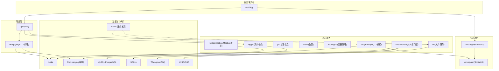
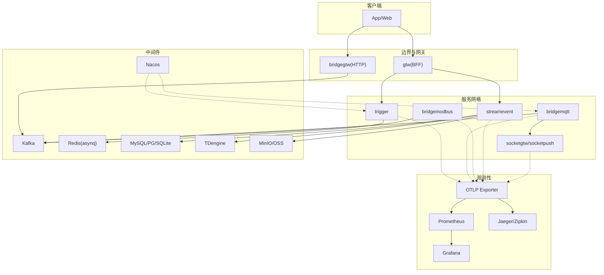
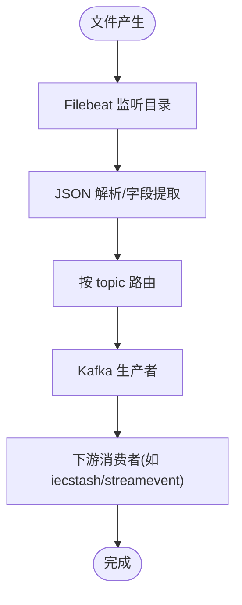
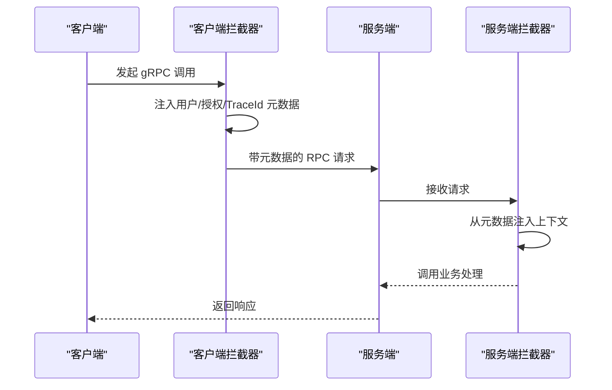
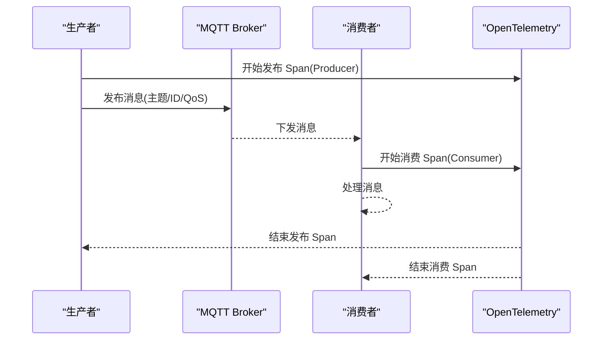
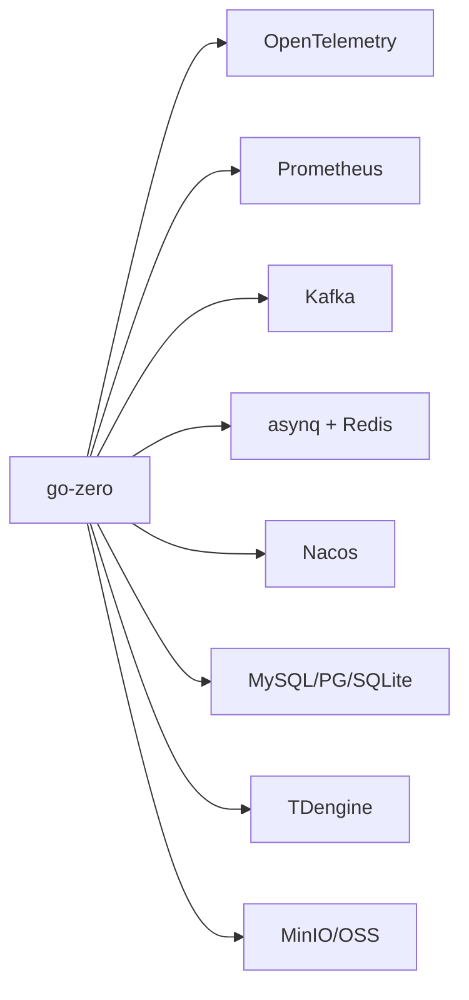

# 性能监控与分析

<cite>
**本文引用的文件**
- [README.md](file://README.md)
- [go.mod](file://go.mod)
- [go.sum](file://go.sum)
- [deploy/docker-compose.yml](file://deploy/docker-compose.yml)
- [deploy/filebeat/conf/filebeat.yml](file://deploy/filebeat/conf/filebeat.yml)
- [deploy/stat_analyzer.html](file://deploy/stat_analyzer.html)
- [common/Interceptor/rpcserver/loggerInterceptor.go](file://common/Interceptor/rpcserver/loggerInterceptor.go)
- [common/Interceptor/rpcclient/metadataInterceptor.go](file://common/Interceptor/rpcclient/metadataInterceptor.go)
- [common/mqttx/mqttx.go](file://common/mqttx/mqttx.go)
- [app/trigger/etc/trigger.yaml](file://app/trigger/etc/trigger.yaml)
- [app/ieccaller/etc/ieccaller.yaml](file://app/ieccaller/etc/ieccaller.yaml)
- [app/bridgemqtt/etc/bridgemqtt.yaml](file://app/bridgemqtt/etc/bridgemqtt.yaml)
</cite>

## 目录
1. [简介](#简介)
2. [项目结构](#项目结构)
3. [核心组件](#核心组件)
4. [架构总览](#架构总览)
5. [详细组件分析](#详细组件分析)
6. [依赖分析](#依赖分析)
7. [性能考虑](#性能考虑)
8. [故障排查指南](#故障排查指南)
9. [结论](#结论)
10. [附录](#附录)

## 简介
本指南围绕 zero-service 的性能监控与分析进行系统化设计与落地说明，目标包括：
- 定义关键性能指标（KPI），涵盖响应时间、吞吐量、错误率与资源利用率
- 设计监控体系，集成 Prometheus、Grafana 与 Jaeger/Zipkin 等链路追踪
- 提供性能瓶颈识别方法（CPU、内存、I/O）
- 规范性能测试与基准测试实践（负载、压力、容量规划）
- 构建性能数据分析与报告生成流程（趋势、异常检测、优化建议）
- 提供监控告警配置与性能优化决策支持

## 项目结构
zero-service 采用 go-zero 微服务架构，结合 gRPC、Kafka、asynq、MQTT、SocketIO 等技术栈，形成“协议接入 + 异步任务 + 实时通信 + 容器管理”的工业级脚手架。项目已内置 OpenTelemetry 与 Prometheus 相关依赖，便于后续扩展监控与可观测性。

图表来源
- [README.md](file://README.md)
- [deploy/docker-compose.yml](file://deploy/docker-compose.yml)

章节来源
- [README.md](file://README.md)
- [deploy/docker-compose.yml](file://deploy/docker-compose.yml)

## 核心组件
- 网关层：gtw 提供 HTTP/gRPC 聚合入口；bridgegtw 提供 HTTP 代理转发
- 实时通信：socketgtw + socketpush 提供 SocketIO 网关与推送
- 异步任务：trigger 基于 asynq + Redis，支持定时/延时任务与回调
- 协议桥接：bridgemodbus、bridgemqtt 将工业协议与消息系统打通
- 对外接口层：streamevent 提供跨语言流数据事件协议
- 数据与中间件：Kafka、Redis、MySQL/PostgreSQL、TDengine、MinIO、Nacos

章节来源
- [README.md](file://README.md)

## 架构总览
下图展示零信任与可观测性视角下的系统交互，强调 gRPC、MQTT、Kafka 与 OpenTelemetry 的集成点。

图表来源
- [README.md](file://README.md)
- [go.mod](file://go.mod)

## 详细组件分析

### 组件A：日志与指标采集（Filebeat + Kafka）
- 作用：将 bridgedump 产生的 JSON 文本文件采集并投递至 Kafka，支撑后续数据处理与监控分析
- 关键点：
  - Filebeat 输入监听多个目录，按 topic 字段动态路由到 Kafka
  - 使用 JSON 解析与字段清洗，确保下游消费稳定
  - Kafka 输出配置包含压缩与分区策略，兼顾吞吐与延迟

图表来源
- [deploy/filebeat/conf/filebeat.yml](file://deploy/filebeat/conf/filebeat.yml)

章节来源
- [deploy/filebeat/conf/filebeat.yml](file://deploy/filebeat/conf/filebeat.yml)
- [deploy/docker-compose.yml](file://deploy/docker-compose.yml)

### 组件B：gRPC 请求链路与上下文传递
- 作用：通过拦截器在 gRPC 请求中注入用户标识、授权信息与 TraceId，便于链路追踪与审计
- 关键点：
  - 服务端拦截器从入站元数据读取并注入上下文
  - 客户端拦截器在出站请求中携带上下文信息
  - 与 OpenTelemetry 结合，可自动采集 Span 并输出到 OTLP

图表来源
- [common/Interceptor/rpcclient/metadataInterceptor.go](file://common/Interceptor/rpcclient/metadataInterceptor.go)
- [common/Interceptor/rpcserver/loggerInterceptor.go](file://common/Interceptor/rpcserver/loggerInterceptor.go)

章节来源
- [common/Interceptor/rpcclient/metadataInterceptor.go](file://common/Interceptor/rpcclient/metadataInterceptor.go)
- [common/Interceptor/rpcserver/loggerInterceptor.go](file://common/Interceptor/rpcserver/loggerInterceptor.go)

### 组件C：MQTT 消费与发布 Span（OpenTelemetry）
- 作用：在 MQTT 消费/发布的关键路径上创建 Span，标注主题、消息 ID、QoS 等属性，便于端到端追踪
- 关键点：
  - 消费端与发布端分别标记 Consumer/Producer Span
  - 属性包含客户端 ID、主题、QoS、动作类型等
  - 与 OTLP Exporter 集成，支持 Jaeger/Zipkin 可视化

图表来源
- [common/mqttx/mqttx.go](file://common/mqttx/mqttx.go)

章节来源
- [common/mqttx/mqttx.go](file://common/mqttx/mqttx.go)

### 组件D：配置与资源限制（Docker Compose）
- 作用：通过 compose 为核心服务设置内存上限与网络模式，便于压测与资源隔离
- 关键点：
  - bridgegtw/bridgedump/ieccaller/iecstash 设置 mem_limit
  - network_mode: host 降低网络开销
  - kafka/filebeat 独立服务，便于扩展与调试

章节来源
- [deploy/docker-compose.yml](file://deploy/docker-compose.yml)

## 依赖分析
- 监控与追踪依赖：
  - OpenTelemetry SDK、Exporter（OTLP/Zipkin/HTTP）
  - Prometheus 客户端与模型
- 服务发现与注册：
  - Nacos（示例配置中存在）
- 消息与任务：
  - Kafka、asynq + Redis
- 数据库与对象存储：
  - MySQL/PostgreSQL/SQLite、TDengine、MinIO

图表来源
- [go.mod](file://go.mod)
- [go.sum](file://go.sum)

章节来源
- [go.mod](file://go.mod)
- [go.sum](file://go.sum)

## 性能考虑
- 响应时间
  - gRPC 调用链路：通过拦截器传递 TraceId，结合 OTLP Exporter 采集端到端延迟
  - 消息路径：MQTT 消费/发布 Span 标注，定位慢节点
- 吞吐量
  - Kafka 分区与压缩配置影响吞吐；Filebeat 多输入与并发扫描提升采集效率
  - Redis 队列长度与任务批处理大小影响任务吞吐
- 错误率
  - 服务端拦截器记录 RPC 错误日志，便于统计错误率与错误分布
- 资源利用率
  - Docker Compose 中对关键服务设置内存上限，便于压测与资源隔离
  - Prometheus 抓取进程指标（CPU/内存/GC 等）与业务指标（QPS/响应时间）

章节来源
- [deploy/docker-compose.yml](file://deploy/docker-compose.yml)
- [common/Interceptor/rpcserver/loggerInterceptor.go](file://common/Interceptor/rpcserver/loggerInterceptor.go)
- [common/mqttx/mqttx.go](file://common/mqttx/mqttx.go)

## 故障排查指南
- 链路追踪
  - 确认 gRPC 拦截器正确注入/透传 TraceId
  - 检查 OTLP Exporter 地址与协议（HTTP/GRPC）
  - 在 MQTT 客户端侧检查消费/发布 Span 是否创建
- 指标采集
  - 校验 Prometheus 抓取配置与目标服务端口
  - 确认业务指标导出与命名空间一致
- 日志与消息
  - Filebeat 输入路径与字段清洗规则是否匹配实际日志
  - Kafka 消费组与分区分配是否合理
- 资源与稳定性
  - 通过 Docker Compose 的 mem_limit 与 host 网络模式定位资源瓶颈
  - 结合 GC 指标与 QPS/响应时间曲线定位热点

章节来源
- [common/Interceptor/rpcclient/metadataInterceptor.go](file://common/Interceptor/rpcclient/metadataInterceptor.go)
- [common/Interceptor/rpcserver/loggerInterceptor.go](file://common/Interceptor/rpcserver/loggerInterceptor.go)
- [common/mqttx/mqttx.go](file://common/mqttx/mqttx.go)
- [deploy/filebeat/conf/filebeat.yml](file://deploy/filebeat/conf/filebeat.yml)
- [deploy/docker-compose.yml](file://deploy/docker-compose.yml)

## 结论
zero-service 已具备可观测性的基础能力（OpenTelemetry、Prometheus、Kafka、asynq/Redis），通过本文的监控体系设计与实践建议，可在现有基础上快速落地性能监控与分析闭环，覆盖关键 KPI、瓶颈识别、测试与报告生成，并提供告警与优化决策支持。

## 附录

### A. 关键性能指标（KPI）定义与监控清单
- 响应时间
  - 指标：平均响应时间、中位数、P90/P99/P999
  - 来源：gRPC/HTTP 调用链路、MQTT 消费/发布 Span
- 吞吐量
  - 指标：QPS、消息速率（Kafka）
  - 来源：Prometheus 指标、业务埋点
- 错误率
  - 指标：RPC 错误率、MQTT 消息丢失率、任务失败率
  - 来源：服务端拦截器日志、Kafka 消费失败计数
- 资源利用率
  - 指标：CPU、内存、GC 次数/暂停时间、磁盘 I/O、网络带宽
  - 来源：Prometheus node_exporter、容器资源限制

章节来源
- [common/Interceptor/rpcserver/loggerInterceptor.go](file://common/Interceptor/rpcserver/loggerInterceptor.go)
- [common/mqttx/mqttx.go](file://common/mqttx/mqttx.go)

### B. APM 工具集成建议
- Prometheus
  - 抓取目标：各服务端口导出的指标（含业务指标）
  - 告警规则：基于 QPS、响应时间、错误率、资源阈值
- Grafana
  - 仪表板：服务健康、链路耗时、任务队列深度、Kafka 消费 lag
- Jaeger/Zipkin
  - 链路追踪：OTLP Exporter 接入，结合 gRPC/MQTT Span

章节来源
- [go.mod](file://go.mod)
- [go.sum](file://go.sum)

### C. 性能测试与基准测试实践
- 负载测试
  - 使用压测工具对 gRPC/HTTP 接口施压，观察 QPS、P99 延迟与错误率
  - 对比不同 Kafka 分区数与 Filebeat 扫描频率的影响
- 压力测试
  - 逐步提高并发与消息速率，定位 Kafka/Redis/数据库瓶颈
- 容量规划
  - 基于 CPU/内存/GC 指标与 QPS 曲线，确定服务实例数量与资源配额

章节来源
- [deploy/docker-compose.yml](file://deploy/docker-compose.yml)
- [deploy/filebeat/conf/filebeat.yml](file://deploy/filebeat/conf/filebeat.yml)

### D. 性能数据分析与报告
- 趋势分析：基于 Grafana 时间序列，识别周期性波动与异常尖峰
- 异常检测：基于阈值与统计模型（如滑动窗口均值±Nσ）识别异常
- 报告模板：包含 KPI 指标、瓶颈定位、优化建议与回归验证

章节来源
- [deploy/stat_analyzer.html](file://deploy/stat_analyzer.html)

### E. 监控告警配置与优化决策
- 告警维度
  - 服务可用性（Down Alert）
  - 性能退化（P99 延迟/错误率/资源超限）
  - 业务异常（Kafka lag、任务堆积）
- 决策支持
  - 基于链路追踪定位慢调用
  - 基于资源指标与 QPS 关联分析，决定扩容或优化

章节来源
- [app/trigger/etc/trigger.yaml](file://app/trigger/etc/trigger.yaml)
- [app/ieccaller/etc/ieccaller.yaml](file://app/ieccaller/etc/ieccaller.yaml)
- [app/bridgemqtt/etc/bridgemqtt.yaml](file://app/bridgemqtt/etc/bridgemqtt.yaml)