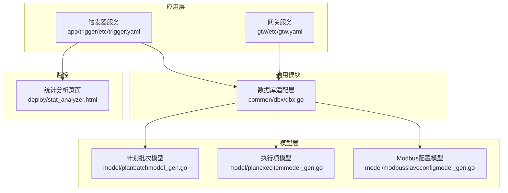
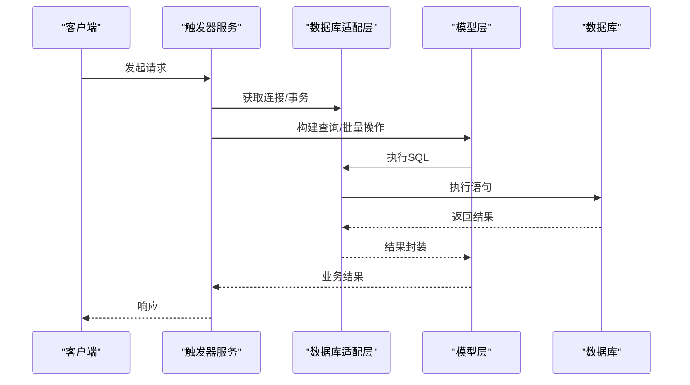
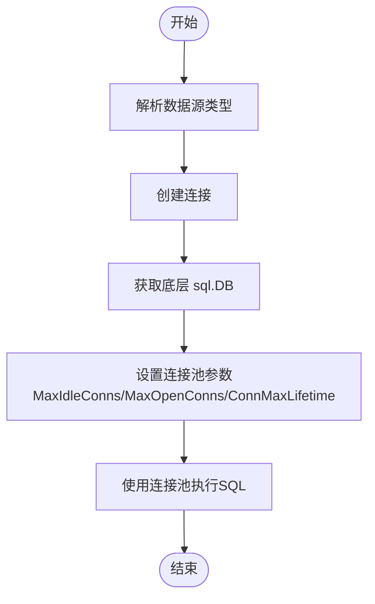
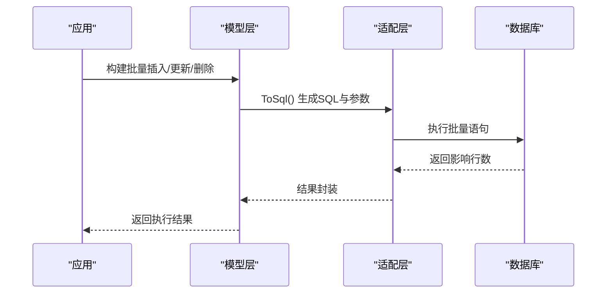
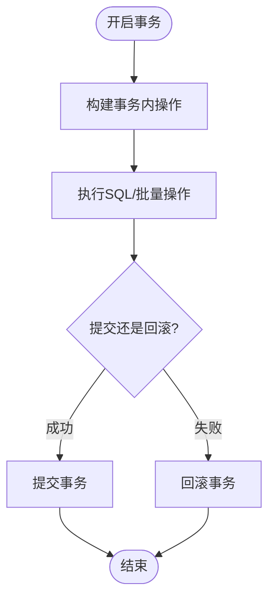
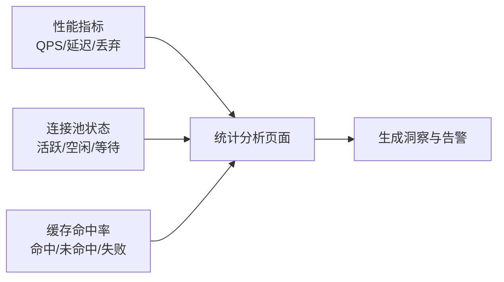
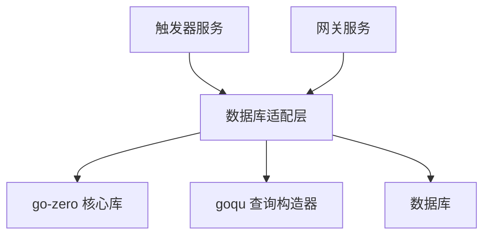

# 数据库优化

<cite>
**本文引用的文件**
- [common/dbx/dbx.go](file://common/dbx/dbx.go)
- [.trae/skills/zero-skills/references/database-patterns.md](file://.trae/skills/zero-skills/references/database-patterns.md)
- [model/planbatchmodel_gen.go](file://model/planbatchmodel_gen.go)
- [model/planexecitemmodel_gen.go](file://model/planexecitemmodel_gen.go)
- [model/modbusslaveconfigmodel_gen.go](file://model/modbusslaveconfigmodel_gen.go)
- [model/sql/modbus.sql](file://model/sql/modbus.sql)
- [deploy/stat_analyzer.html](file://deploy/stat_analyzer.html)
- [app/trigger/etc/trigger.yaml](file://app/trigger/etc/trigger.yaml)
- [gtw/etc/gtw.yaml](file://gtw/etc/gtw.yaml)
</cite>

## 目录
1. [简介](#简介)
2. [项目结构](#项目结构)
3. [核心组件](#核心组件)
4. [架构总览](#架构总览)
5. [详细组件分析](#详细组件分析)
6. [依赖分析](#依赖分析)
7. [性能考量](#性能考量)
8. [故障排查指南](#故障排查指南)
9. [结论](#结论)
10. [附录](#附录)

## 简介
本指南面向 zero-service 项目的数据库优化需求，围绕连接池配置与管理、SQL 查询优化、批量操作优化、事务管理、监控与诊断以及配置调优等方面进行系统性梳理。文档结合项目现有实现与最佳实践，提供可落地的优化建议与可视化图示，帮助在保证稳定性的同时提升数据库吞吐与响应质量。

## 项目结构
- 数据库连接与适配层位于通用模块，统一抽象不同数据库类型的连接与查询能力。
- 模型层采用 go-zero 自动生成的 CRUD 代码，支持 MySQL/PostgreSQL 等方言与 Builder 构造器。
- 应用配置文件集中定义数据源、日志、缓存等运行参数，便于统一治理。
- 监控侧通过前端页面对系统指标进行聚合展示，辅助定位性能瓶颈。

**图表来源**
- [app/trigger/etc/trigger.yaml:25-28](file://app/trigger/etc/trigger.yaml#L25-L28)
- [gtw/etc/gtw.yaml:1-61](file://gtw/etc/gtw.yaml#L1-L61)
- [common/dbx/dbx.go:31-64](file://common/dbx/dbx.go#L31-L64)
- [model/planbatchmodel_gen.go:136-196](file://model/planbatchmodel_gen.go#L136-L196)
- [model/planexecitemmodel_gen.go:299-343](file://model/planexecitemmodel_gen.go#L299-L343)
- [model/modbusslaveconfigmodel_gen.go:71-81](file://model/modbusslaveconfigmodel_gen.go#L71-L81)
- [deploy/stat_analyzer.html:1145-1253](file://deploy/stat_analyzer.html#L1145-L1253)

**章节来源**
- [app/trigger/etc/trigger.yaml:1-37](file://app/trigger/etc/trigger.yaml#L1-L37)
- [gtw/etc/gtw.yaml:1-61](file://gtw/etc/gtw.yaml#L1-L61)
- [common/dbx/dbx.go:1-155](file://common/dbx/dbx.go#L1-L155)
- [model/planbatchmodel_gen.go:136-196](file://model/planbatchmodel_gen.go#L136-L196)
- [model/planexecitemmodel_gen.go:299-343](file://model/planexecitemmodel_gen.go#L299-L343)
- [model/modbusslaveconfigmodel_gen.go:71-81](file://model/modbusslaveconfigmodel_gen.go#L71-L81)
- [deploy/stat_analyzer.html:1145-1253](file://deploy/stat_analyzer.html#L1145-L1253)

## 核心组件
- 数据库连接与适配
  - 自动解析数据源类型，统一创建连接；提供适配器封装底层 sql.DB 能力，支持事务、预编译、查询等。
  - 支持 MySQL/PostgreSQL/SQLite/TAOS 等多种数据库类型，便于在不同环境切换。
- 模型与查询构造
  - 自动生成的模型支持 Insert/Update/Delete/Select 等基础操作，同时提供 SelectBuilder/UpdateBuilder/DeleteBuilder/InsertBuilder，便于构建复杂查询与批量操作。
  - 对 PostgreSQL 使用 Dollar 占位符格式，确保跨数据库兼容。
- 应用配置
  - 通过 YAML 配置数据源、日志、缓存、Redis 等，集中管理运行参数。
- 监控与诊断
  - 统计页面聚合 QPS、延迟、缓存命中率、系统资源等指标，辅助定位问题。

**章节来源**
- [common/dbx/dbx.go:31-64](file://common/dbx/dbx.go#L31-L64)
- [common/dbx/dbx.go:66-104](file://common/dbx/dbx.go#L66-L104)
- [model/planbatchmodel_gen.go:521-551](file://model/planbatchmodel_gen.go#L521-L551)
- [model/planexecitemmodel_gen.go:488-507](file://model/planexecitemmodel_gen.go#L488-L507)
- [app/trigger/etc/trigger.yaml:25-28](file://app/trigger/etc/trigger.yaml#L25-L28)
- [deploy/stat_analyzer.html:1145-1253](file://deploy/stat_analyzer.html#L1145-L1253)

## 架构总览
下图展示了数据库优化涉及的关键交互：应用通过统一适配层访问数据库，模型层负责 SQL 构造与执行，配置层提供数据源与运行参数，监控层提供性能指标观测。

**图表来源**
- [common/dbx/dbx.go:82-104](file://common/dbx/dbx.go#L82-L104)
- [model/planbatchmodel_gen.go:157-196](file://model/planbatchmodel_gen.go#L157-L196)
- [model/planexecitemmodel_gen.go:488-507](file://model/planexecitemmodel_gen.go#L488-L507)
- [app/trigger/etc/trigger.yaml:25-28](file://app/trigger/etc/trigger.yaml#L25-L28)

## 详细组件分析

### 连接池配置与管理
- 默认行为
  - go-zero 提供合理的默认连接池参数，适用于一般场景。
- 自定义配置
  - 可通过获取底层 sql.DB 并设置最大空闲连接数、最大打开连接数、连接最大生命周期等参数，以适配高并发或长连接场景。
- 实践要点
  - 根据实例规格与负载峰值调整 MaxOpenConns，避免连接数过多导致数据库压力过大。
  - 合理设置 ConnMaxLifetime，平衡连接复用与资源回收。
  - 在高并发写入场景下，适当提高 MaxIdleConns，减少连接获取开销。

**图表来源**
- [common/dbx/dbx.go:52-64](file://common/dbx/dbx.go#L52-L64)
- [.trae/skills/zero-skills/references/database-patterns.md:450-480](file://.trae/skills/zero-skills/references/database-patterns.md#L450-L480)

**章节来源**
- [.trae/skills/zero-skills/references/database-patterns.md:450-480](file://.trae/skills/zero-skills/references/database-patterns.md#L450-L480)
- [common/dbx/dbx.go:52-64](file://common/dbx/dbx.go#L52-L64)

### SQL 查询优化
- 索引设计原则
  - 为高频过滤字段、关联字段、排序字段建立合适索引，避免全表扫描。
  - 对于组合条件查询，优先考虑最左前缀匹配的复合索引。
- 查询计划分析
  - 使用 EXPLAIN/EXPLAIN ANALYZE 分析执行计划，关注 rows、filtered、Extra 等关键指标。
  - 避免在 WHERE 子句中对列进行函数运算或隐式转换，防止索引失效。
- 执行计划优化
  - 将选择性高的条件放在 WHERE 前部，减少中间结果集规模。
  - 避免 SELECT *，仅返回必要字段，降低 IO 与网络传输。
- 慢查询识别
  - 结合监控页面的延迟分位指标与应用日志，定位慢查询 SQL 与热点接口。
  - 对慢查询进行参数化与索引优化，必要时拆分查询或引入物化视图。

**章节来源**
- [.trae/skills/zero-skills/references/database-patterns.md:24-37](file://.trae/skills/zero-skills/references/database-patterns.md#L24-L37)
- [deploy/stat_analyzer.html:1145-1253](file://deploy/stat_analyzer.html#L1145-L1253)

### 批量操作优化
- 批量插入
  - 使用模型提供的 InsertBuilder/批量参数化插入，减少往返次数。
  - 对 PostgreSQL 使用 RETURNING 获取自增主键，避免额外查询。
- 批量更新/删除
  - 使用 UpdateBuilder/DeleteBuilder 构建条件，避免循环逐条更新。
  - 控制单批数量，避免单次事务过大导致锁竞争与超时。
- 最佳实践
  - 分批处理大数据集，结合进度与事务边界控制内存占用。
  - 写入前进行幂等校验，避免重复写入造成脏数据。

**图表来源**
- [model/planbatchmodel_gen.go:497-519](file://model/planbatchmodel_gen.go#L497-L519)
- [model/planexecitemmodel_gen.go:488-507](file://model/planexecitemmodel_gen.go#L488-L507)
- [common/dbx/dbx.go:90-104](file://common/dbx/dbx.go#L90-L104)

**章节来源**
- [model/planbatchmodel_gen.go:157-196](file://model/planbatchmodel_gen.go#L157-L196)
- [model/planbatchmodel_gen.go:497-519](file://model/planbatchmodel_gen.go#L497-L519)
- [model/planexecitemmodel_gen.go:488-507](file://model/planexecitemmodel_gen.go#L488-L507)

### 事务管理
- 事务隔离级别
  - 根据业务一致性要求选择合适隔离级别，避免过度串行化影响吞吐。
- 死锁预防
  - 固定顺序访问资源，避免循环等待；短事务、尽早提交。
- 事务性能优化
  - 将无关逻辑移出事务，减少锁持有时间；批量提交减少事务次数。
  - 对高并发写入场景，合理拆分热点数据，降低冲突概率。

**图表来源**
- [.trae/skills/zero-skills/references/database-patterns.md:271-365](file://.trae/skills/zero-skills/references/database-patterns.md#L271-L365)
- [common/dbx/dbx.go:82-88](file://common/dbx/dbx.go#L82-L88)

**章节来源**
- [.trae/skills/zero-skills/references/database-patterns.md:271-365](file://.trae/skills/zero-skills/references/database-patterns.md#L271-L365)
- [common/dbx/dbx.go:82-88](file://common/dbx/dbx.go#L82-L88)

### 数据库监控与诊断
- 性能指标监控
  - 关注 QPS、平均/中位/分位延迟、丢弃率等，结合业务高峰时段进行对比分析。
- 连接池状态监控
  - 观察活跃连接数、空闲连接数、等待时间，判断是否存在连接泄漏或池过小。
- 查询性能分析
  - 结合监控页面与数据库慢日志，定位热点 SQL 与异常延迟。
- 缓存命中率
  - 通过监控页面查看缓存命中率与失效率，评估缓存策略有效性。

**图表来源**
- [deploy/stat_analyzer.html:1145-1253](file://deploy/stat_analyzer.html#L1145-L1253)

**章节来源**
- [deploy/stat_analyzer.html:1145-1253](file://deploy/stat_analyzer.html#L1145-L1253)

### 数据库配置调优参数与最佳实践
- 数据源配置
  - 在应用配置中明确数据源 URL，支持 MySQL/PostgreSQL 等，确保时区与时效参数正确。
- 日志与可观测性
  - 合理设置日志级别与输出路径，避免生产环境产生过多 IO。
- 缓存与 Redis
  - 通过配置启用缓存与限流，结合监控页面观察命中率与系统负载。
- 连接池参数
  - 根据实例规格与业务峰值调整 MaxOpenConns、MaxIdleConns、ConnMaxLifetime。
- 事务与批量
  - 采用事务包裹原子性操作，批量操作分批提交，避免长时间锁持有。

**章节来源**
- [app/trigger/etc/trigger.yaml:1-37](file://app/trigger/etc/trigger.yaml#L1-L37)
- [gtw/etc/gtw.yaml:1-61](file://gtw/etc/gtw.yaml#L1-L61)
- [.trae/skills/zero-skills/references/database-patterns.md:450-480](file://.trae/skills/zero-skills/references/database-patterns.md#L450-L480)

## 依赖分析
- 模块耦合
  - 应用服务依赖通用适配层，模型层依赖适配层与数据库方言，形成清晰的分层。
- 外部依赖
  - go-zero 提供连接池、缓存、事务等基础设施；goqu 提供跨数据库的查询构造器。
- 配置依赖
  - 数据源、日志、缓存等配置集中于 YAML 文件，便于统一管理与热更新。

**图表来源**
- [common/dbx/dbx.go:3-20](file://common/dbx/dbx.go#L3-L20)
- [app/trigger/etc/trigger.yaml:25-28](file://app/trigger/etc/trigger.yaml#L25-L28)

**章节来源**
- [common/dbx/dbx.go:3-20](file://common/dbx/dbx.go#L3-L20)

## 性能考量
- 连接池
  - 高并发场景下适度提高 MaxOpenConns，但需考虑数据库最大连接限制。
  - 设置合理的 ConnMaxLifetime，避免连接老化导致的抖动。
- 查询优化
  - 优先使用覆盖索引，减少回表；避免在 WHERE 中对列进行函数运算。
- 批量操作
  - 合理控制单批大小，避免事务过大；对写入密集场景采用异步批量提交。
- 事务
  - 缩短事务时间，避免在事务中执行耗时逻辑；对热点数据进行分片或分区。

## 故障排查指南
- 连接池问题
  - 现象：连接不足、等待时间过长。
  - 排查：检查 MaxOpenConns、MaxIdleConns 设置；观察监控页面连接池状态。
- 事务死锁
  - 现象：请求超时、重试失败。
  - 排查：确认事务内资源访问顺序；缩短事务时间；减少锁粒度。
- 慢查询
  - 现象：延迟升高、QPS 下降。
  - 排查：结合监控页面与数据库慢日志定位热点 SQL；优化索引与查询计划。
- 缓存异常
  - 现象：缓存命中率低、数据库压力大。
  - 排查：检查缓存键策略、过期时间与失效机制；评估缓存穿透与击穿风险。

**章节来源**
- [deploy/stat_analyzer.html:1145-1253](file://deploy/stat_analyzer.html#L1145-L1253)
- [.trae/skills/zero-skills/references/database-patterns.md:482-545](file://.trae/skills/zero-skills/references/database-patterns.md#L482-L545)

## 结论
通过对连接池、SQL 查询、批量操作、事务管理与监控诊断的系统化优化，可在保证系统稳定性的前提下显著提升数据库性能与整体吞吐。建议结合项目实际负载与数据库规格，持续迭代调优参数，并通过监控页面与日志进行闭环验证。

## 附录
- Modbus 配置与连接池
  - Modbus 配置表包含连接恢复、协议重试、TLS 开关等参数，可用于指导设备侧连接池与超时策略的设定。
- 数据库类型解析
  - 适配层根据数据源字符串自动识别数据库类型，确保连接与方言正确。

**章节来源**
- [model/modbusslaveconfigmodel_gen.go:71-81](file://model/modbusslaveconfigmodel_gen.go#L71-L81)
- [model/sql/modbus.sql:14-25](file://model/sql/modbus.sql#L14-L25)
- [common/dbx/dbx.go:31-44](file://common/dbx/dbx.go#L31-L44)