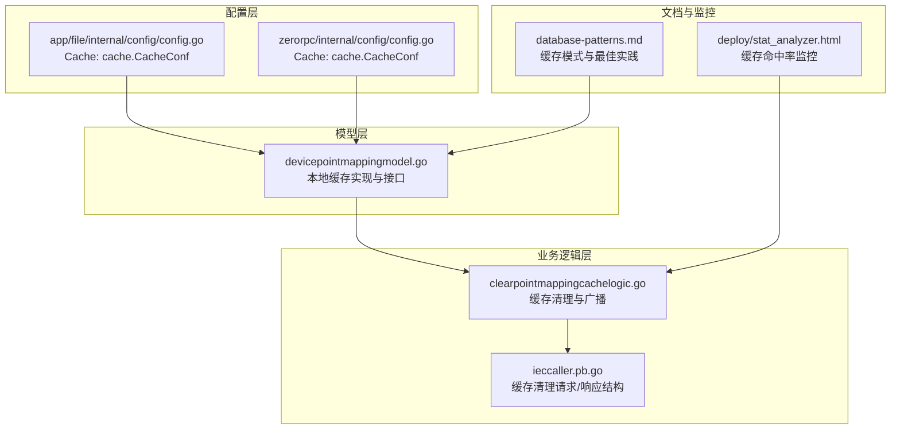
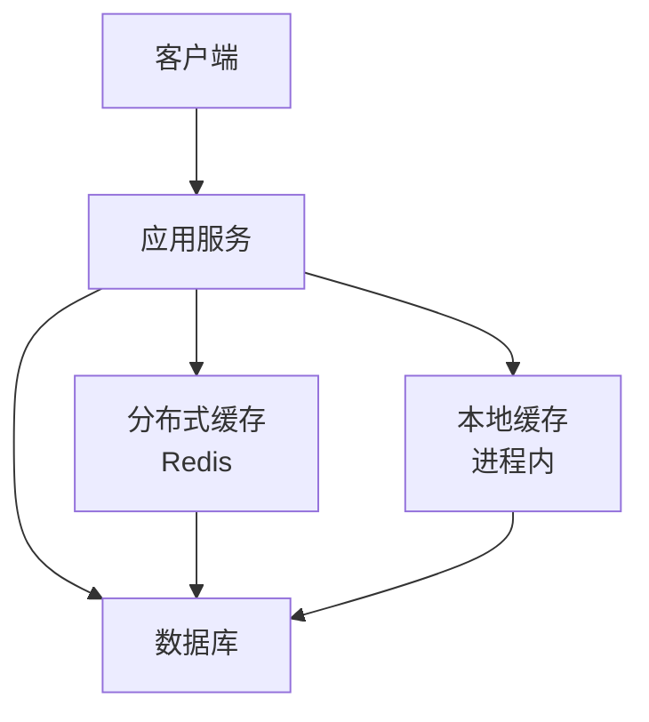
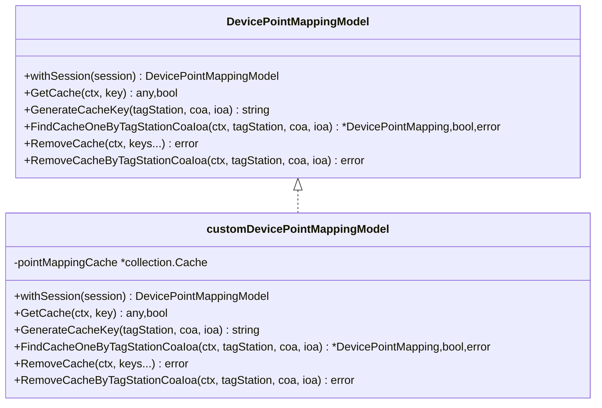
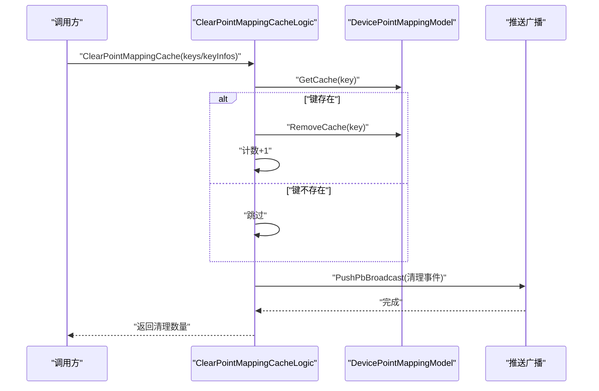
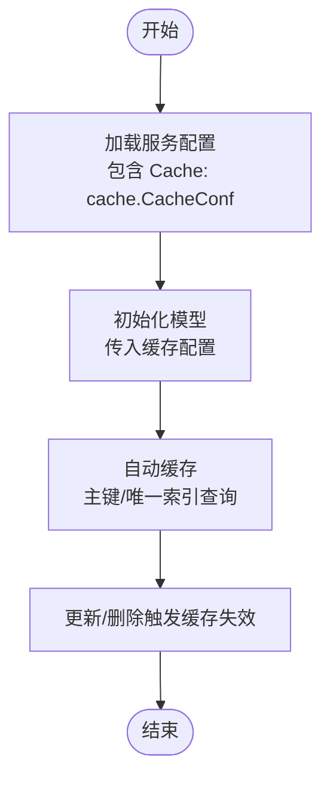
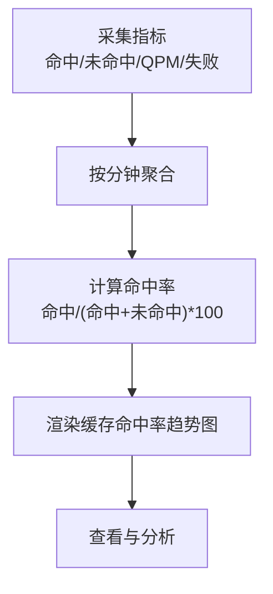
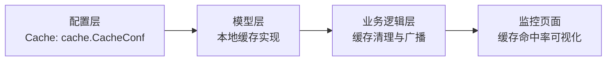

# 缓存策略

<cite>
**本文档引用的文件**
- [devicepointmappingmodel.go](file://model/devicepointmappingmodel.go)
- [clearpointmappingcachelogic.go](file://app/ieccaller/internal/logic/clearpointmappingcachelogic.go)
- [ieccaller.pb.go](file://app/ieccaller/ieccaller/ieccaller.pb.go)
- [config.go](file://app/file/internal/config/config.go)
- [config.go](file://zerorpc/internal/config/config.go)
- [database-patterns.md](file://.trae/skills/zero-skills/references/database-patterns.md)
- [stat_analyzer.html](file://deploy/stat_analyzer.html)
</cite>

## 目录
1. [引言](#引言)
2. [项目结构](#项目结构)
3. [核心组件](#核心组件)
4. [架构总览](#架构总览)
5. [详细组件分析](#详细组件分析)
6. [依赖关系分析](#依赖关系分析)
7. [性能考量](#性能考量)
8. [故障排查指南](#故障排查指南)
9. [结论](#结论)
10. [附录](#附录)

## 引言
本指南围绕 zero-service 的缓存体系，提供从多级缓存架构设计、缓存算法与淘汰策略、一致性保障、性能优化到监控与调优的完整实践路径。项目中已内置基于 go-zero 的本地缓存与 Redis 分布式缓存能力，并通过监控页面对缓存命中率进行可视化追踪，便于持续优化。

## 项目结构
与缓存相关的关键位置：
- 模型层：本地缓存实现与缓存访问接口定义
- 业务逻辑层：缓存清理与广播
- 配置层：Redis 缓存配置结构
- 文档参考：缓存模式与最佳实践
- 监控页面：缓存命中率趋势与统计

**图表来源**
- [devicepointmappingmodel.go:1-108](file://model/devicepointmappingmodel.go#L1-L108)
- [clearpointmappingcachelogic.go:1-61](file://app/ieccaller/internal/logic/clearpointmappingcachelogic.go#L1-L61)
- [ieccaller.pb.go:1133-1228](file://app/ieccaller/ieccaller/ieccaller.pb.go#L1133-L1228)
- [config.go:1-31](file://app/file/internal/config/config.go#L1-L31)
- [config.go:1-25](file://zerorpc/internal/config/config.go#L1-L25)
- [database-patterns.md:367-429](file://.trae/skills/zero-skills/references/database-patterns.md#L367-L429)
- [stat_analyzer.html:1224-1252](file://deploy/stat_analyzer.html#L1224-L1252)

**章节来源**
- [devicepointmappingmodel.go:1-108](file://model/devicepointmappingmodel.go#L1-L108)
- [clearpointmappingcachelogic.go:1-61](file://app/ieccaller/internal/logic/clearpointmappingcachelogic.go#L1-L61)
- [ieccaller.pb.go:1133-1228](file://app/ieccaller/ieccaller/ieccaller.pb.go#L1133-L1228)
- [config.go:1-31](file://app/file/internal/config/config.go#L1-L31)
- [config.go:1-25](file://zerorpc/internal/config/config.go#L1-L25)
- [database-patterns.md:367-429](file://.trae/skills/zero-skills/references/database-patterns.md#L367-L429)
- [stat_analyzer.html:1224-1252](file://deploy/stat_analyzer.html#L1224-L1252)

## 核心组件
- 本地缓存实现与接口
  - 在模型层定义了本地缓存接口与实现，包含缓存获取、删除、按键生成、带回调的取用等能力。
  - 默认过期时间与缓存名称可配置，适用于热点数据的快速读取。
- 缓存清理逻辑
  - 提供按键列表与键信息集合的批量清理能力，并在清理后进行广播，确保集群内一致性。
- 缓存配置
  - 服务配置中包含 Redis 缓存配置结构，用于启用分布式缓存。
- 监控与可视化
  - 监控页面对缓存命中率、QPM、命中/未命中次数以及数据库失败次数进行聚合与展示。

**章节来源**
- [devicepointmappingmodel.go:17-108](file://model/devicepointmappingmodel.go#L17-L108)
- [clearpointmappingcachelogic.go:26-60](file://app/ieccaller/internal/logic/clearpointmappingcachelogic.go#L26-L60)
- [config.go:26-26](file://app/file/internal/config/config.go#L26-L26)
- [config.go:23-23](file://zerorpc/internal/config/config.go#L23-L23)
- [stat_analyzer.html:1224-1252](file://deploy/stat_analyzer.html#L1224-L1252)

## 架构总览
多级缓存分层示意（概念性）：
- 应用本地缓存（进程内）：降低数据库压力，提升热点数据访问速度
- 分布式缓存（Redis）：跨实例共享，支持水平扩展与高可用
- CDN 缓存（概念性）：静态资源与边缘节点缓存，减少源站负载

[此图为概念性架构示意，不直接映射具体代码文件]

## 详细组件分析

### 组件A：本地缓存模型与接口
- 职责
  - 定义缓存接口（获取、删除、生成键、带回调取用）
  - 实现默认过期时间与缓存名称配置
  - 提供按标签站/COA/IOA组合生成唯一键的能力
- 关键流程
  - Take 回调加载：当缓存缺失时，自动回源查询并写入缓存
  - 类型断言与空值处理：对缓存条目进行安全转换
  - 复制与返回：对命中结果进行深拷贝，避免外部修改

**图表来源**
- [devicepointmappingmodel.go:17-108](file://model/devicepointmappingmodel.go#L17-L108)

**章节来源**
- [devicepointmappingmodel.go:17-108](file://model/devicepointmappingmodel.go#L17-L108)

### 组件B：缓存清理与广播
- 职责
  - 支持按键列表与键信息集合批量清理
  - 清理前检查缓存是否存在，存在则删除并计数
  - 清理完成后进行广播，确保集群内一致
- 关键流程
  - 逐键清理：若存在则删除
  - 键信息清理：根据 tagStation/coa/ioa 生成键并清理
  - 广播通知：通过推送通道广播清理事件

**图表来源**
- [clearpointmappingcachelogic.go:26-60](file://app/ieccaller/internal/logic/clearpointmappingcachelogic.go#L26-L60)
- [devicepointmappingmodel.go:54-68](file://model/devicepointmappingmodel.go#L54-L68)
- [ieccaller.pb.go:1133-1228](file://app/ieccaller/ieccaller/ieccaller.pb.go#L1133-L1228)

**章节来源**
- [clearpointmappingcachelogic.go:26-60](file://app/ieccaller/internal/logic/clearpointmappingcachelogic.go#L26-L60)
- [ieccaller.pb.go:1133-1228](file://app/ieccaller/ieccaller/ieccaller.pb.go#L1133-L1228)

### 组件C：缓存配置与启用
- 配置结构
  - 服务配置中包含 Redis 缓存配置字段，用于启用分布式缓存
- 启用方式
  - 将缓存配置注入到模型层，即可获得自动缓存与失效能力（如主键/唯一索引查询自动缓存）

**图表来源**
- [config.go:26-26](file://app/file/internal/config/config.go#L26-L26)
- [config.go:23-23](file://zerorpc/internal/config/config.go#L23-L23)
- [database-patterns.md:391-408](file://.trae/skills/zero-skills/references/database-patterns.md#L391-L408)

**章节来源**
- [config.go:26-26](file://app/file/internal/config/config.go#L26-L26)
- [config.go:23-23](file://zerorpc/internal/config/config.go#L23-L23)
- [database-patterns.md:391-408](file://.trae/skills/zero-skills/references/database-patterns.md#L391-L408)

### 组件D：缓存监控与可视化
- 监控内容
  - 缓存命中率、QPM、命中/未命中次数、数据库失败次数
- 数据聚合
  - 按分钟聚合，支持累计与重算命中率
- 可视化
  - 提供缓存命中率趋势图与相关指标图表

**图表来源**
- [stat_analyzer.html:1224-1252](file://deploy/stat_analyzer.html#L1224-L1252)
- [stat_analyzer.html:2717-2734](file://deploy/stat_analyzer.html#L2717-L2734)

**章节来源**
- [stat_analyzer.html:1224-1252](file://deploy/stat_analyzer.html#L1224-L1252)
- [stat_analyzer.html:2717-2734](file://deploy/stat_analyzer.html#L2717-L2734)

## 依赖关系分析
- 模型层依赖本地缓存库与数据库连接
- 业务逻辑层依赖模型层提供的缓存接口
- 配置层提供 Redis 缓存配置，驱动分布式缓存启用
- 监控页面消费运行时指标，形成闭环

**图表来源**
- [config.go:26-26](file://app/file/internal/config/config.go#L26-L26)
- [config.go:23-23](file://zerorpc/internal/config/config.go#L23-L23)
- [devicepointmappingmodel.go:17-108](file://model/devicepointmappingmodel.go#L17-L108)
- [clearpointmappingcachelogic.go:26-60](file://app/ieccaller/internal/logic/clearpointmappingcachelogic.go#L26-L60)
- [stat_analyzer.html:1224-1252](file://deploy/stat_analyzer.html#L1224-L1252)

**章节来源**
- [config.go:26-26](file://app/file/internal/config/config.go#L26-L26)
- [config.go:23-23](file://zerorpc/internal/config/config.go#L23-L23)
- [devicepointmappingmodel.go:17-108](file://model/devicepointmappingmodel.go#L17-L108)
- [clearpointmappingcachelogic.go:26-60](file://app/ieccaller/internal/logic/clearpointmappingcachelogic.go#L26-L60)
- [stat_analyzer.html:1224-1252](file://deploy/stat_analyzer.html#L1224-L1252)

## 性能考量
- 命中率提升
  - 热点键命名规范与复用（见键生成策略）
  - 合理设置过期时间，避免冷数据占用空间
  - 对于读多写少场景，优先使用本地缓存+分布式缓存双层
- 缓存穿透防护
  - 对空结果也进行短时缓存，避免重复回源
  - 使用布隆过滤器或白名单策略（概念性建议）
- 缓存雪崩预防
  - 为不同键设置随机过期时间
  - 采用多级缓存与降级策略（概念性建议）
- 缓存一致性
  - 写操作触发缓存失效（模型层自动失效能力）
  - 批量清理与广播确保多实例一致性

[本节为通用性能指导，不直接分析具体文件]

## 故障排查指南
- 缓存清理无效
  - 检查键是否正确生成与存在
  - 确认广播是否成功，避免单实例清理导致的不一致
- 命中率异常
  - 查看监控页面的命中率趋势与 QPM 变化
  - 分析是否存在大量空命中导致的误判
- 缓存配置问题
  - 确认服务配置中的缓存字段是否正确加载
  - 校验 Redis 连接参数与网络连通性

**章节来源**
- [clearpointmappingcachelogic.go:26-60](file://app/ieccaller/internal/logic/clearpointmappingcachelogic.go#L26-L60)
- [stat_analyzer.html:1224-1252](file://deploy/stat_analyzer.html#L1224-L1252)
- [config.go:26-26](file://app/file/internal/config/config.go#L26-L26)

## 结论
zero-service 已具备完善的本地缓存与分布式缓存基础，结合缓存清理与广播机制，能够满足多实例环境下的缓存一致性需求。配合监控页面的命中率可视化，可实现持续优化与容量规划。建议在实际生产中进一步完善缓存算法选择、穿透与雪崩防护策略，并结合业务特征进行容量与过期时间的精细化调优。

## 附录
- 缓存算法与淘汰策略（概念性建议）
  - LRU：适合热点数据稳定变化的场景
  - LFU：适合访问频率差异较大的场景
  - FIFO：实现简单，适合临时缓存
  - 选择依据：访问模式、内存预算、实现复杂度
- 缓存一致性策略（概念性建议）
  - 读写一致性：先写数据库再失效缓存
  - 广播一致性：通过消息或广播同步清理
  - 版本号/时间戳：用于判断缓存有效性
- 缓存容量规划（概念性建议）
  - 基于峰值 QPS 与平均响应时间估算缓存命中率目标
  - 通过监控页面观察命中率与失败率，动态调整容量与过期时间

[本节为通用实践建议，不直接分析具体文件]