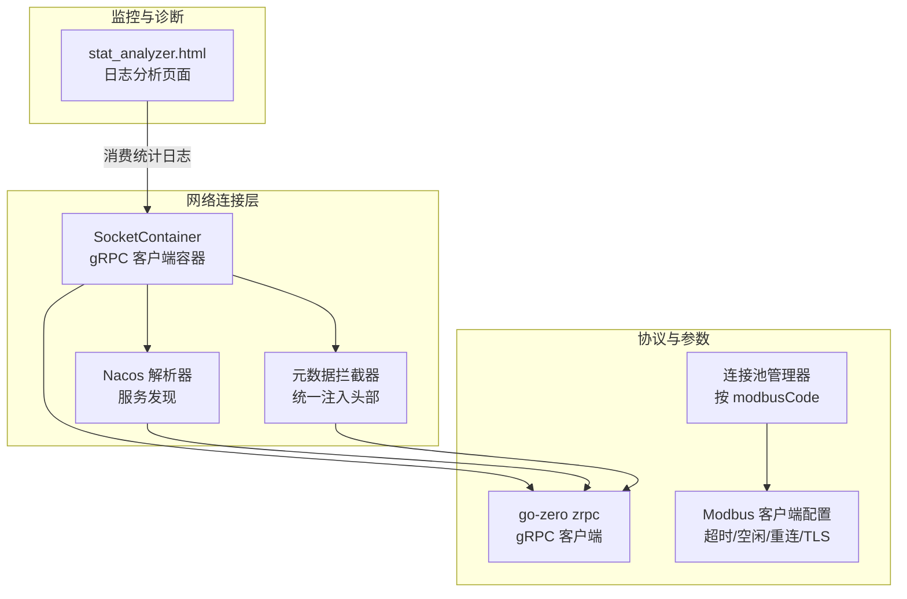
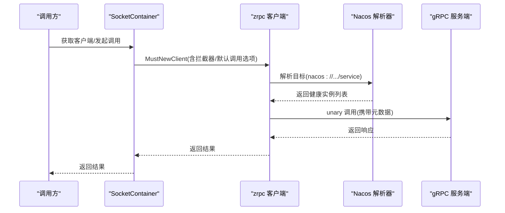
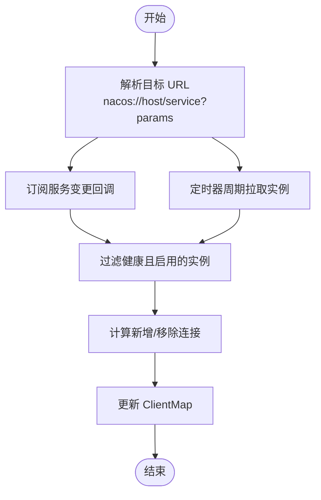
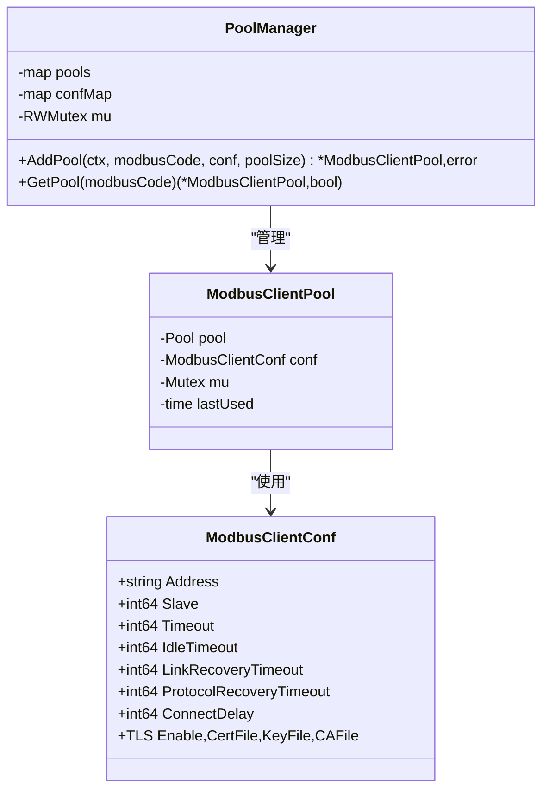
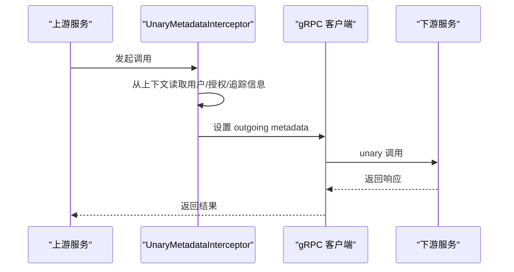
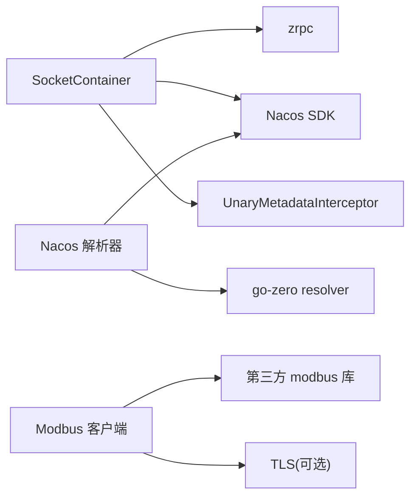

# 网络优化

<cite>
**本文引用的文件**
- [common/socketiox/container.go](file://common/socketiox/container.go)
- [common/nacosx/builder.go](file://common/nacosx/builder.go)
- [common/modbusx/config.go](file://common/modbusx/config.go)
- [common/modbusx/client.go](file://common/modbusx/client.go)
- [common/Interceptor/rpcclient/metadataInterceptor.go](file://common/Interceptor/rpcclient/metadataInterceptor.go)
- [app/bridgemodbus/etc/bridgemodbus.yaml](file://app/bridgemodbus/etc/bridgemodbus.yaml)
- [deploy/stat_analyzer.html](file://deploy/stat_analyzer.html)
- [.trae/skills/zero-skills/best-practices/overview.md](file://.trae/skills/zero-skills/best-practices/overview.md)
</cite>

## 目录
1. [简介](#简介)
2. [项目结构](#项目结构)
3. [核心组件](#核心组件)
4. [架构总览](#架构总览)
5. [详细组件分析](#详细组件分析)
6. [依赖分析](#依赖分析)
7. [性能考量](#性能考量)
8. [故障排查指南](#故障排查指南)
9. [结论](#结论)
10. [附录](#附录)

## 简介
本指南面向 zero-service 的网络优化需求，围绕连接复用、协议优化、参数调优、带宽与流量控制、监控与诊断等方面，结合仓库现有实现进行系统化梳理与落地建议。重点覆盖：
- 连接复用：gRPC 连接池、Nacos 服务发现与连接更新、Modbus TCP 连接池与超时策略
- 协议优化：gRPC 最大消息尺寸、拦截器注入、Modbus/TLS 配置
- 参数调优：超时、空闲、重连间隔等关键参数
- 带宽与流量控制：限流状态、丢弃统计、QPS/响应时间分析
- 监控与诊断：系统指标、服务性能明细、可视化分析工具

## 项目结构
与网络优化直接相关的核心模块与文件如下：
- gRPC 连接与服务发现
  - SocketContainer：基于 go-zero zrpc 的 gRPC 客户端容器，支持直连、Etcd、Nacos 三种接入方式，并维护连接池与动态更新
  - Nacos 解析器：注册自定义 resolver，拉取健康实例并输出 gRPC 地址列表
  - 元数据拦截器：统一注入用户、授权、追踪等头部，便于链路追踪与鉴权
- Modbus 网络优化
  - Modbus 客户端配置：超时、空闲、重连间隔、TLS 等
  - 连接池管理：按 modbusCode 维度管理连接池，支持并发安全
- 监控与诊断
  - 统计分析页面：解析 Go-Zero stat 日志，展示 QPS、丢弃、限流状态、内存/CPU 等指标

**图表来源**
- [common/socketiox/container.go:35-61](file://common/socketiox/container.go#L35-L61)
- [common/nacosx/builder.go:29-112](file://common/nacosx/builder.go#L29-L112)
- [common/Interceptor/rpcclient/metadataInterceptor.go:11-32](file://common/Interceptor/rpcclient/metadataInterceptor.go#L11-L32)
- [common/modbusx/config.go:32-61](file://common/modbusx/config.go#L32-L61)
- [deploy/stat_analyzer.html:397-460](file://deploy/stat_analyzer.html#L397-L460)

**章节来源**
- [common/socketiox/container.go:35-61](file://common/socketiox/container.go#L35-L61)
- [common/nacosx/builder.go:29-112](file://common/nacosx/builder.go#L29-L112)
- [common/Interceptor/rpcclient/metadataInterceptor.go:11-32](file://common/Interceptor/rpcclient/metadataInterceptor.go#L11-L32)
- [common/modbusx/config.go:32-61](file://common/modbusx/config.go#L32-L61)
- [deploy/stat_analyzer.html:397-460](file://deploy/stat_analyzer.html#L397-L460)

## 核心组件
- SocketContainer：负责根据配置创建/维护 gRPC 客户端连接，支持直连、Etcd、Nacos 三种模式；对 gRPC 默认调用选项进行统一配置（如最大消息尺寸），并对连接集合进行动态更新
- Nacos 解析器：注册自定义 resolver，订阅服务实例变更，过滤健康且带有 gRPC 端口的实例，周期性刷新实例列表
- 元数据拦截器：在每次 gRPC 调用前注入用户、用户名、部门、授权、追踪 ID 等头部，便于跨服务追踪与鉴权
- Modbus 客户端配置与连接池：提供超时、空闲、重连间隔、TLS 等参数；通过连接池管理器按 modbusCode 维度管理连接池，支持并发安全

**章节来源**
- [common/socketiox/container.go:132-154](file://common/socketiox/container.go#L132-L154)
- [common/socketiox/container.go:267-316](file://common/socketiox/container.go#L267-L316)
- [common/nacosx/builder.go:75-112](file://common/nacosx/builder.go#L75-L112)
- [common/Interceptor/rpcclient/metadataInterceptor.go:11-32](file://common/Interceptor/rpcclient/metadataInterceptor.go#L11-L32)
- [common/modbusx/config.go:32-61](file://common/modbusx/config.go#L32-L61)
- [common/modbusx/config.go:78-107](file://common/modbusx/config.go#L78-L107)

## 架构总览
下图展示了零拷贝/低开销的连接复用与服务发现流程，以及 gRPC 调用链中的元数据注入。

**图表来源**
- [common/socketiox/container.go:141-149](file://common/socketiox/container.go#L141-L149)
- [common/nacosx/builder.go:75-112](file://common/nacosx/builder.go#L75-L112)
- [common/Interceptor/rpcclient/metadataInterceptor.go:11-32](file://common/Interceptor/rpcclient/metadataInterceptor.go#L11-L32)

## 详细组件分析

### gRPC 连接复用与服务发现
- 目标解析与连接创建
  - 支持直连、Etcd、Nacos 三种接入方式；Nacos 通过自定义 scheme 注册解析器，订阅服务实例并输出 gRPC 地址
  - 对 gRPC 默认调用选项进行统一配置，例如最大消息尺寸限制
- 动态更新机制
  - Nacos 订阅回调与定时器定期拉取实例列表，过滤健康且启用的实例，计算新增/移除连接并更新 ClientMap
  - Etcd 通过订阅器监听地址变化，按需增删连接
- 连接状态与健康检查
  - 仅使用健康且启用的实例；忽略缺少 gRPC 端口的实例
  - 支持子集采样，避免实例过多导致的抖动

**图表来源**
- [common/socketiox/container.go:209-241](file://common/socketiox/container.go#L209-L241)
- [common/socketiox/container.go:267-316](file://common/socketiox/container.go#L267-L316)
- [common/nacosx/builder.go:75-112](file://common/nacosx/builder.go#L75-L112)

**章节来源**
- [common/socketiox/container.go:132-154](file://common/socketiox/container.go#L132-L154)
- [common/socketiox/container.go:267-316](file://common/socketiox/container.go#L267-L316)
- [common/nacosx/builder.go:120-138](file://common/nacosx/builder.go#L120-L138)

### Modbus 连接池与超时策略
- 配置项
  - 超时、空闲超时、TCP 出错重连间隔、协议异常重连间隔、连接建立后等待时间、TLS 开关与证书路径
- 连接池管理
  - 按 modbusCode 维度创建/获取连接池；并发安全；支持池大小校验与错误返回
- 客户端创建
  - 基于配置创建 Modbus TCP 客户端，支持 TLS；设置超时、空闲、重连间隔、连接延迟与日志器

**图表来源**
- [common/modbusx/config.go:32-61](file://common/modbusx/config.go#L32-L61)
- [common/modbusx/config.go:63-107](file://common/modbusx/config.go#L63-L107)
- [common/modbusx/client.go:106-151](file://common/modbusx/client.go#L106-L151)

**章节来源**
- [common/modbusx/config.go:32-61](file://common/modbusx/config.go#L32-L61)
- [common/modbusx/config.go:78-107](file://common/modbusx/config.go#L78-L107)
- [common/modbusx/client.go:106-151](file://common/modbusx/client.go#L106-L151)
- [app/bridgemodbus/etc/bridgemodbus.yaml:23-26](file://app/bridgemodbus/etc/bridgemodbus.yaml#L23-L26)

### 元数据拦截器与 gRPC 调用链
- 在每次 gRPC 调用前，从上下文提取用户、用户名、部门、授权、追踪 ID 等信息，注入到 outgoing metadata 中
- 适用于 unary 与 stream 调用，确保跨服务链路可追踪与鉴权一致

**图表来源**
- [common/Interceptor/rpcclient/metadataInterceptor.go:11-32](file://common/Interceptor/rpcclient/metadataInterceptor.go#L11-L32)

**章节来源**
- [common/Interceptor/rpcclient/metadataInterceptor.go:11-32](file://common/Interceptor/rpcclient/metadataInterceptor.go#L11-L32)

## 依赖分析
- SocketContainer 依赖
  - go-zero zrpc：用于创建 gRPC 客户端
  - Nacos SDK：用于服务发现与订阅
  - 自定义拦截器：统一注入元数据
- Nacos 解析器依赖
  - Nacos SDK：订阅服务实例
  - go-zero resolver 接口：注册自定义解析器
- Modbus 客户端依赖
  - 第三方 modbus 库：创建 TCP 客户端处理器
  - TLS：可选，按配置启用

**图表来源**
- [common/socketiox/container.go:14-28](file://common/socketiox/container.go#L14-L28)
- [common/nacosx/builder.go:3-16](file://common/nacosx/builder.go#L3-L16)
- [common/modbusx/client.go:106-135](file://common/modbusx/client.go#L106-L135)

**章节来源**
- [common/socketiox/container.go:14-28](file://common/socketiox/container.go#L14-L28)
- [common/nacosx/builder.go:3-16](file://common/nacosx/builder.go#L3-L16)
- [common/modbusx/client.go:106-135](file://common/modbusx/client.go#L106-L135)

## 性能考量
- 连接复用与池化
  - gRPC：通过 SocketContainer 维护连接集合，减少频繁拨号开销；Nacos 订阅与定时刷新保证实例变更及时反映
  - Modbus：通过连接池按 modbusCode 管理连接，降低握手与认证成本
- 超时与空闲
  - gRPC：通过默认调用选项设置最大消息尺寸，避免过大消息导致内存压力
  - Modbus：合理设置超时、空闲、重连间隔与连接延迟，提升稳定性与吞吐
- 传输层优化
  - Modbus/TLS：在需要加密的场景启用 TLS，平衡安全性与性能
- 监控与限流
  - 使用 stat_analyzer.html 解析 Go-Zero stat 日志，关注 QPS、丢弃、限流状态、内存/CPU 等指标，辅助容量规划与限流策略调整

**章节来源**
- [common/socketiox/container.go:113-117](file://common/socketiox/container.go#L113-L117)
- [common/modbusx/config.go:39-52](file://common/modbusx/config.go#L39-L52)
- [deploy/stat_analyzer.html:436-453](file://deploy/stat_analyzer.html#L436-L453)

## 故障排查指南
- 连接无法建立/频繁断开
  - 检查 Nacos 实例健康状态与 gRPC 端口配置；确认订阅回调与定时刷新是否正常工作
  - 查看 SocketContainer 的连接更新日志，定位新增/移除连接数量
- 调用超时
  - 调整 gRPC 默认调用选项中的超时参数；检查下游服务处理耗时
  - 对于 Modbus，适当增大 Timeout、IdleTimeout、LinkRecoveryTimeout
- 丢弃与限流
  - 使用 stat_analyzer.html 观察“丢弃数”“限流状态”等指标，结合 QPS 与响应时间分析瓶颈
- 链路追踪与鉴权
  - 确认元数据拦截器正确注入用户、授权、追踪 ID 等头部，便于跨服务定位问题

**章节来源**
- [common/socketiox/container.go:267-316](file://common/socketiox/container.go#L267-L316)
- [common/nacosx/builder.go:120-138](file://common/nacosx/builder.go#L120-L138)
- [common/modbusx/config.go:39-52](file://common/modbusx/config.go#L39-L52)
- [deploy/stat_analyzer.html:436-453](file://deploy/stat_analyzer.html#L436-L453)
- [common/Interceptor/rpcclient/metadataInterceptor.go:11-32](file://common/Interceptor/rpcclient/metadataInterceptor.go#L11-L32)

## 结论
通过在零服务中引入连接复用、服务发现与动态更新、统一元数据注入、合理的超时与空闲策略，以及完善的监控与诊断工具，可以显著提升系统的网络性能与稳定性。建议在生产环境中：
- 启用 Nacos 服务发现与 SocketContainer 的动态更新能力
- 为 gRPC 设置合适的最大消息尺寸与超时策略
- 为 Modbus 合理配置超时、空闲与重连间隔，并在需要时启用 TLS
- 借助 stat_analyzer.html 持续观测 QPS、丢弃与限流状态，指导容量与限流策略

## 附录
- 最佳实践要点
  - 保持处理器薄逻辑厚，使用结构化日志与上下文
  - 明确错误处理与输入验证
  - 使用连接池与缓存，避免在处理器中创建连接
  - 监控生产指标，禁用生产环境的弹性特性
  - 避免阻塞无超时、创建无界 goroutine、信任未经验证的用户输入

**章节来源**
- [.trae/skills/zero-skills/best-practices/overview.md:756-781](file://.trae/skills/zero-skills/best-practices/overview.md#L756-L781)