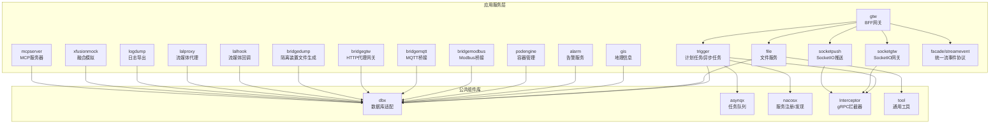
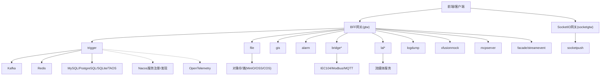
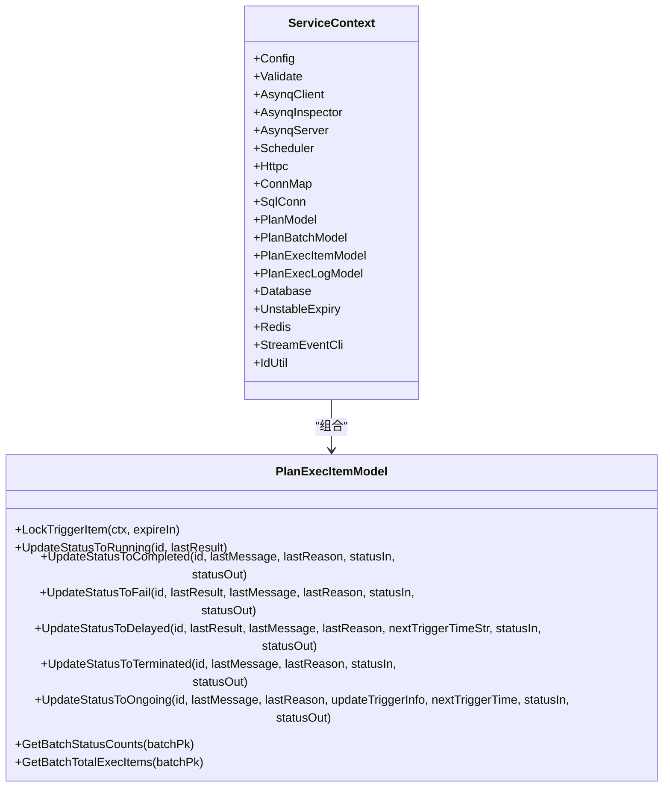
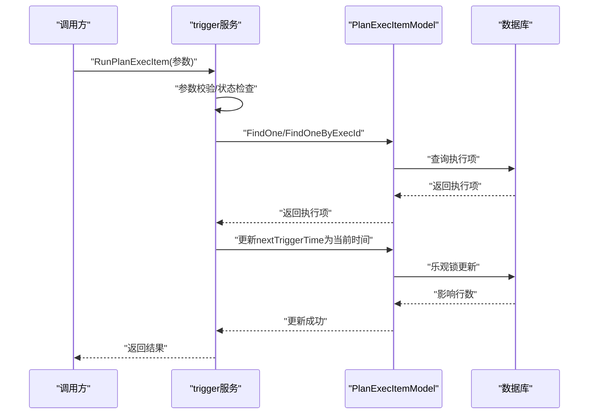
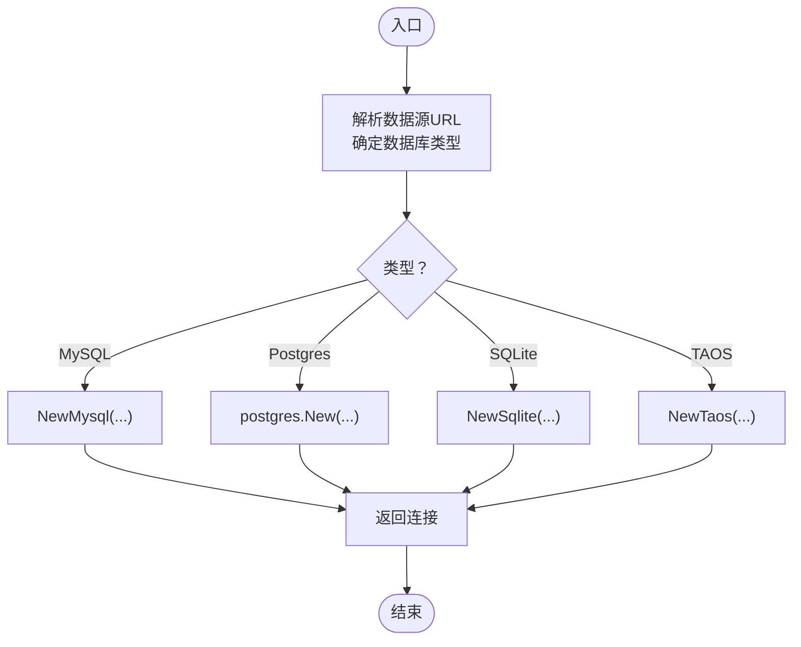
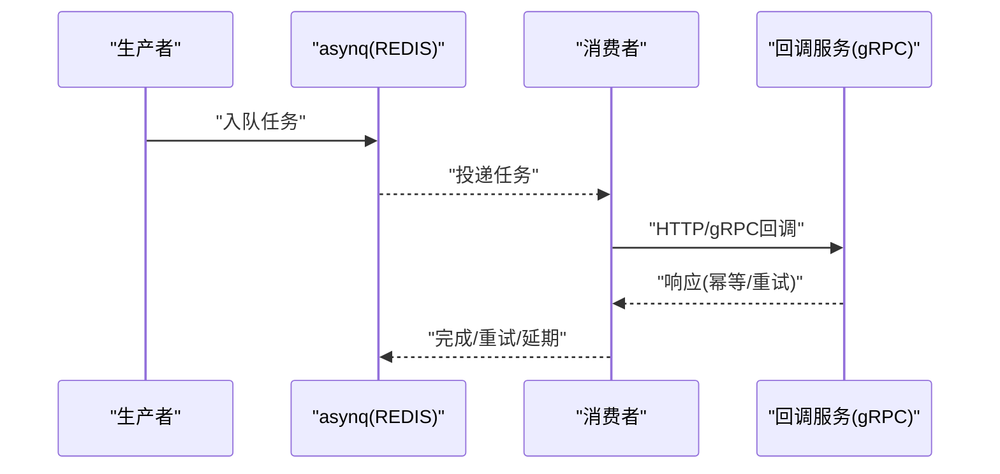
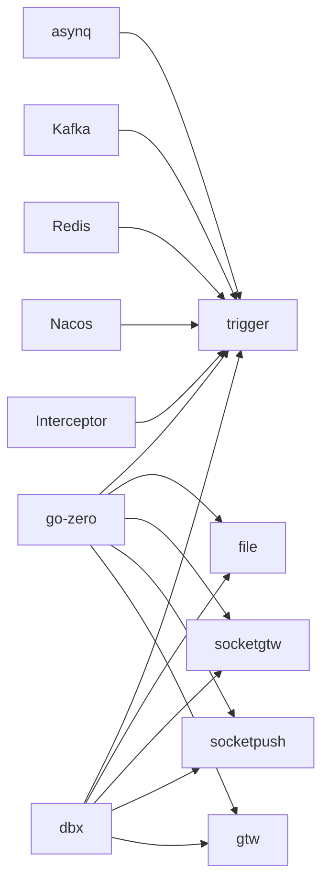
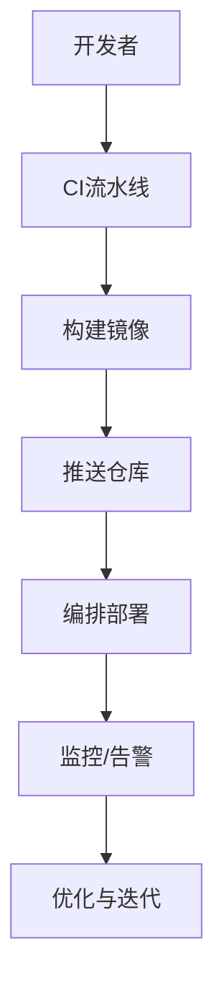

# 最佳实践

<cite>
**本文引用的文件**
- [README.md](file://README.md)
- [go.mod](file://go.mod)
- [deploy/docker-compose.yml](file://deploy/docker-compose.yml)
- [app/trigger/internal/config/config.go](file://app/trigger/internal/config/config.go)
- [app/trigger/internal/svc/servicecontext.go](file://app/trigger/internal/svc/servicecontext.go)
- [app/trigger/internal/logic/runplanexecitemlogic.go](file://app/trigger/internal/logic/runplanexecitemlogic.go)
- [common/dbx/dbx.go](file://common/dbx/dbx.go)
- [common/asynqx/asynqClient.go](file://common/asynqx/asynqClient.go)
- [common/nacosx/config.go](file://common/nacosx/config.go)
- [common/Interceptor/rpcserver/loggerInterceptor.go](file://common/Interceptor/rpcserver/loggerInterceptor.go)
- [zerorpc/etc/zerorpc.yaml](file://zerorpc/etc/zerorpc.yaml)
- [app/alarm/etc/alarm.yaml](file://app/alarm/etc/alarm.yaml)
- [model/planexecitemmodel.go](file://model/planexecitemmodel.go)
- [util/main.go](file://util/main.go)
</cite>

## 目录
1. [简介](#简介)
2. [项目结构](#项目结构)
3. [核心组件](#核心组件)
4. [架构总览](#架构总览)
5. [详细组件分析](#详细组件分析)
6. [依赖分析](#依赖分析)
7. [性能考量](#性能考量)
8. [安全与合规](#安全与合规)
9. [可扩展性设计](#可扩展性设计)
10. [监控与告警](#监控与告警)
11. [代码质量保障](#代码质量保障)
12. [运维自动化与 DevOps](#运维自动化与-devops)
13. [结论](#结论)

## 简介
本指南面向 zero-service 项目，围绕微服务拆分策略、服务间通信设计、数据一致性、性能优化、安全防护、可扩展性、监控告警、代码质量与 DevOps 实践，提供系统化的最佳实践建议。项目基于 go-zero 构建，覆盖 IEC 104 数采、异步任务调度、实时通信、容器管理、地理信息、协议桥接等场景，具备高并发、低延迟与强一致性的工程化能力。

## 项目结构
项目采用“按领域/协议/能力”分层的微服务组织方式，核心模块包括：
- 应用服务层：trigger、file、gis、alarm、podengine、bridgemodbus、bridgemqtt、bridgegtw、bridgedump、lalhook、lalproxy、logdump、xfusionmock、mcpserver、socketgtw、socketpush、gtw、facade/streamevent
- 公共组件库：iec104、socketiox、asynqx、nacosx、modbusx、mqttx、ossx、dbx、gisx、dockerx、imagex、tool、Interceptor 等
- 模型与脚本：model 目录存放数据库模型与 SQL 脚本
- 部署与编排：deploy 目录提供 docker-compose 编排
- 文档与示例：docs、swagger、third_party 等

图表来源
- [README.md](file://README.md)
- [go.mod](file://go.mod)

章节来源
- [README.md](file://README.md)
- [go.mod](file://go.mod)

## 核心组件
- 微服务框架：go-zero，提供 RPC、Web、Gateway、缓存、数据库、队列等基础设施
- 任务队列：asynq + Redis，支持定时/延时任务、回调、重试与生命周期管理
- 消息队列：Kafka（go-queue），用于 IEC 104 数据汇聚与跨系统解耦
- 实时通信：SocketIO（fork），支持房间、广播、MQTT 桥接与 Token 鉴权
- 协议适配：IEC 104（go-iecp5）、Modbus（grid-x/modbus）、MQTT（paho.mqtt）
- 数据库：MySQL/PostgreSQL/SQLite/TAOS（TDengine），统一通过 dbx 适配
- 服务治理：Nacos（服务注册/发现），gRPC 拦截器与链路追踪
- 对外接口：facade/streamevent 提供跨语言 gRPC 协议，统一 IEC 104、MQTT、WebSocket、Kafka 等事件入口

章节来源
- [README.md](file://README.md)
- [go.mod](file://go.mod)

## 架构总览
整体架构分为三层：
- 网关层：gtw（BFF）聚合 gRPC/HTTP，socketgtw/socketpush 提供实时通信入口
- 服务层：trigger、file、gis、alarm、podengine、bridgemodbus、bridgemqtt、bridgegtw、bridgedump、lalhook、lalproxy、logdump、xfusionmock、mcpserver、facade/streamevent
- 基础设施层：Kafka、Redis、MySQL/PostgreSQL/SQLite/TAOS、Nacos、OpenTelemetry/Prometheus

图表来源
- [README.md](file://README.md)
- [deploy/docker-compose.yml](file://deploy/docker-compose.yml)

章节来源
- [README.md](file://README.md)
- [deploy/docker-compose.yml](file://deploy/docker-compose.yml)

## 详细组件分析

### 触发与计划任务引擎（trigger）
- 设计要点
  - 两套调度模式：基于 asynq 的分布式任务队列（Redis）与自研计划任务管理（数据库扫描）
  - 三层模型：Plan -> Batch -> ExecItem，状态机完备（WAITING/RUNNING/COMPLETED/FAILED/DELAYED/ONGOING/TERMINATED）
  - 分布式锁防重、执行日志追踪、批次/计划自动状态聚合
- 关键实现
  - 配置解析与服务上下文初始化，包含 Redis、数据库、asynq 客户端/服务器/调度器、HTTP 客户端、StreamEvent gRPC 客户端
  - 执行项锁定与状态更新，支持随机/轮询选择，结合版本号乐观锁与回滚
  - 立即执行计划项逻辑，校验参数与状态，更新下次触发时间
- 性能与可靠性
  - 使用 Unstable 随机抖动避免惊群，合理设置重试间隔
  - 通过 goqu 适配不同数据库方言，统一 SQL 构造
  - gRPC 最大消息尺寸配置，满足大数据回调需求

图表来源
- [app/trigger/internal/svc/servicecontext.go](file://app/trigger/internal/svc/servicecontext.go)
- [model/planexecitemmodel.go](file://model/planexecitemmodel.go)

图表来源
- [app/trigger/internal/logic/runplanexecitemlogic.go](file://app/trigger/internal/logic/runplanexecitemlogic.go)
- [model/planexecitemmodel.go](file://model/planexecitemmodel.go)

章节来源
- [app/trigger/internal/config/config.go](file://app/trigger/internal/config/config.go)
- [app/trigger/internal/svc/servicecontext.go](file://app/trigger/internal/svc/servicecontext.go)
- [app/trigger/internal/logic/runplanexecitemlogic.go](file://app/trigger/internal/logic/runplanexecitemlogic.go)
- [model/planexecitemmodel.go](file://model/planexecitemmodel.go)

### 数据库适配与查询优化（dbx + goqu）
- 设计要点
  - 自动识别数据库类型（MySQL/PostgreSQL/SQLite/TAOS），统一连接与方言
  - 通过 goqu 构造 SQL，支持占位符格式化与日志记录
  - 提供事务适配器，兼容原生 sql.DB
- 性能建议
  - 合理使用索引与分区（结合业务表结构）
  - 控制查询范围与排序，避免全表扫描
  - 使用连接池参数与超时控制，避免阻塞

图表来源
- [common/dbx/dbx.go](file://common/dbx/dbx.go)

章节来源
- [common/dbx/dbx.go](file://common/dbx/dbx.go)

### 任务队列与回调（asynq + gRPC）
- 设计要点
  - asynq 客户端/检查器/服务器/调度器集中初始化
  - 生产者 Span 注入，结合 OpenTelemetry 追踪
  - gRPC 客户端最大消息尺寸配置，满足大数据回调
- 建议
  - 任务粒度拆分，避免单任务过重
  - 回调幂等设计，结合唯一键与状态机

图表来源
- [common/asynqx/asynqClient.go](file://common/asynqx/asynqClient.go)
- [app/trigger/internal/svc/servicecontext.go](file://app/trigger/internal/svc/servicecontext.go)

章节来源
- [common/asynqx/asynqClient.go](file://common/asynqx/asynqClient.go)
- [app/trigger/internal/svc/servicecontext.go](file://app/trigger/internal/svc/servicecontext.go)

### 服务注册与发现（Nacos）
- 设计要点
  - 初始化 Nacos 日志配置，统一日志级别与输出
  - 通过 go-zero 与 Nacos 集成，实现服务注册/发现
- 建议
  - 合理设置命名空间与服务名，区分环境
  - 配置健康检查与权重，提升可用性

章节来源
- [common/nacosx/config.go](file://common/nacosx/config.go)
- [app/trigger/internal/config/config.go](file://app/trigger/internal/config/config.go)

### gRPC 拦截器与链路追踪
- 设计要点
  - 服务端拦截器从 metadata 中提取用户标识、部门、授权、TraceId，注入上下文
  - 统一错误日志输出，便于定位问题
- 建议
  - 在网关层统一注入 TraceId，贯穿全链路
  - 结合 OpenTelemetry exporter 输出到 Zipkin/Jaeger

章节来源
- [common/Interceptor/rpcserver/loggerInterceptor.go](file://common/Interceptor/rpcserver/loggerInterceptor.go)

### 配置与密钥管理
- JWT 与小程序配置：zerorpc.yaml 包含 JWT 密钥、过期时间、小程序 AppId/Secret
- 告警服务配置：alarm.yaml 包含 Redis、Telemetry、企业微信相关参数
- 建议
  - 使用环境变量或密钥管理服务替换明文配置
  - 分环境分仓，最小权限原则

章节来源
- [zerorpc/etc/zerorpc.yaml](file://zerorpc/etc/zerorpc.yaml)
- [app/alarm/etc/alarm.yaml](file://app/alarm/etc/alarm.yaml)

## 依赖分析
- 外部依赖
  - go-zero：微服务框架与生态
  - asynq：分布式任务队列
  - Kafka：消息队列
  - SocketIO：实时通信
  - IEC 104/Modbus/MQTT：工业协议
  - OpenTelemetry/Prometheus：可观测性
- 内部依赖
  - common/dbx、common/asynqx、common/nacosx、common/Interceptor 等公共组件被多个服务复用
  - model 层为各服务提供统一的数据访问抽象

图表来源
- [go.mod](file://go.mod)
- [README.md](file://README.md)

章节来源
- [go.mod](file://go.mod)
- [README.md](file://README.md)

## 性能考量
- 数据库查询优化
  - 使用 goqu 构造 SQL，避免硬编码；针对 PostgreSQL/MySQL 分别使用占位符格式
  - 合理使用索引与分区，避免全表扫描；对高频查询建立复合索引
  - 控制查询范围与排序，必要时使用分页或游标
- 缓存策略
  - Redis 作为任务队列与缓存，建议设置合理的过期时间与淘汰策略
  - 对热点数据进行本地缓存，降低数据库压力
- 连接池配置
  - 数据库连接池大小与超时应根据实例规格与 QPS 调优
  - Kafka/HTTP 客户端连接池与并发度需与吞吐匹配
- 并发处理
  - asynq worker 并发度与队列深度平衡，避免内存峰值
  - SocketIO 连接数与房间广播需限流与背压

## 安全与合规
- 认证授权
  - JWT 令牌签发与校验，建议使用短期有效令牌与刷新机制
  - 网关层统一鉴权，服务间通过 Token 或双向 TLS
- 数据加密
  - 敏感配置使用密钥管理服务或环境变量
  - 传输层使用 TLS，服务间通信建议 mTLS
- 访问控制
  - 基于角色的访问控制（RBAC），限制 API 与资源访问
  - 网关层限流与黑白名单
- 安全审计
  - 记录关键操作日志，保留审计轨迹
  - 配置告警规则，及时发现异常行为

## 可扩展性设计
- 水平扩展
  - 无状态服务可直接横向扩展，结合负载均衡
  - 有状态服务（如数据库）采用主从/分片/时序库分离
- 负载均衡
  - gRPC 内置负载均衡，结合 Nacos 服务发现
  - 网关层（Nginx/Ingress）实现流量分发
- 服务发现
  - Nacos 注册中心，动态感知服务上下线
- 容错机制
  - 降级与熔断：超时/错误率触发
  - 重试与退避：指数退避与抖动
  - 失败隔离：不同业务线程池/队列隔离

## 监控与告警
- 指标收集
  - OpenTelemetry + Prometheus，采集 CPU、内存、请求时延、错误率、队列长度
  - Kafka/Redis 指标：堆积量、消费者 lag、连接数
- 告警规则
  - 基于阈值与趋势的规则，结合业务 SLA
  - 多级告警（P0-P3），联动钉钉/飞书
- 故障自愈
  - 自动扩缩容与重启策略
  - 任务重试与死信队列处理

## 代码质量保障
- 代码审查
  - 统一代码风格与提交规范，强制 CI 校验
- 单元测试与集成测试
  - 模型与逻辑层充分覆盖边界条件与异常分支
- 持续集成
  - 自动化构建、测试、打包与部署流水线
- 文档与示例
  - Swagger 文档与 proto 定义保持同步
  - 示例项目与教程，降低上手成本

## 运维自动化与 DevOps
- 编排与部署
  - docker-compose 一键启动核心服务，支持主机网络模式
  - 容器镜像构建与分发，CI/CD 自动化
- 远程运维
  - 提供远程容器交互与日志查看工具，支持批量操作
- 监控与可观测性
  - 集成 OpenTelemetry 与 Prometheus/Grafana
  - 告警通道与值班机制

图表来源
- [deploy/docker-compose.yml](file://deploy/docker-compose.yml)
- [util/main.go](file://util/main.go)

章节来源
- [deploy/docker-compose.yml](file://deploy/docker-compose.yml)
- [util/main.go](file://util/main.go)

## 结论
zero-service 通过 go-zero 微服务框架与丰富的中间件生态，实现了工业级物联网场景的高效、稳定与可扩展。遵循本文最佳实践，可在保证性能与安全的前提下，快速迭代与规模化交付。建议在实际落地中结合业务规模与合规要求，持续完善监控、安全与运维体系。