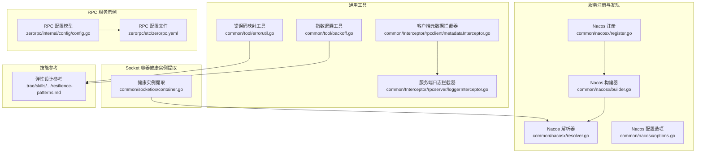
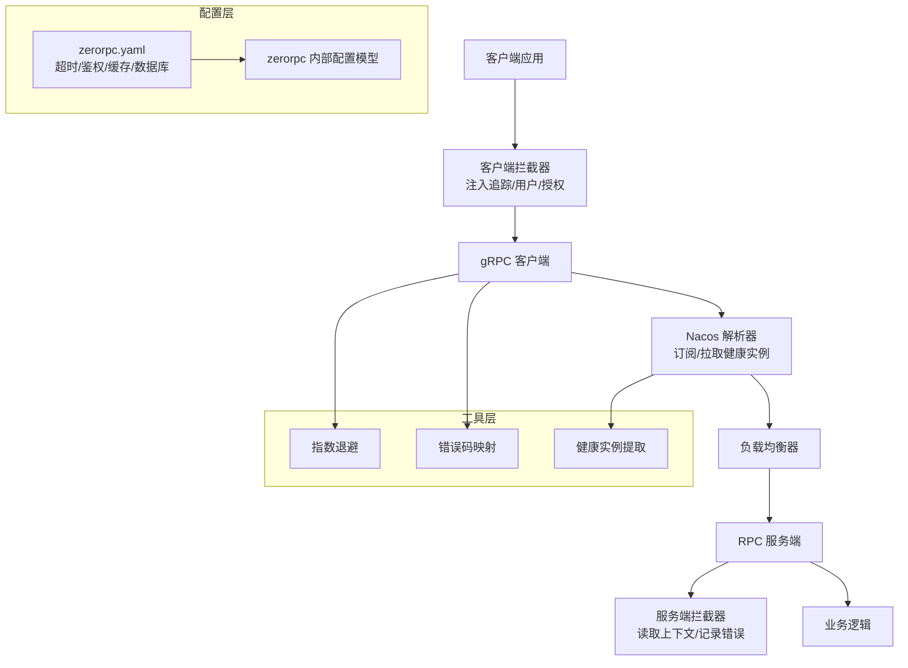
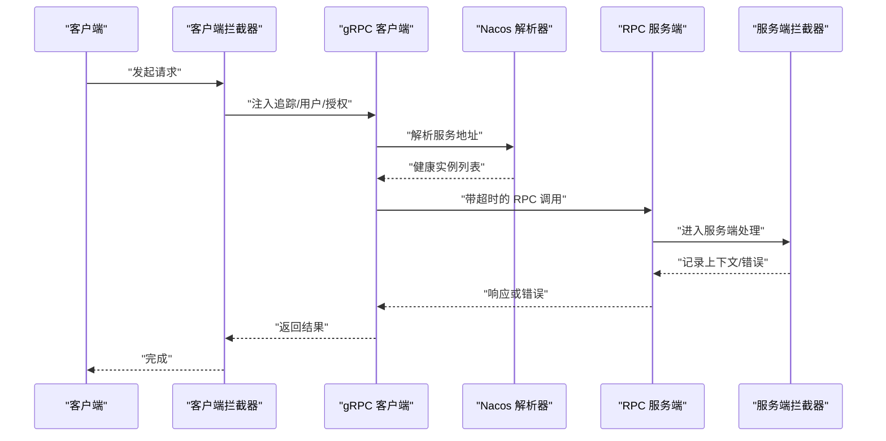
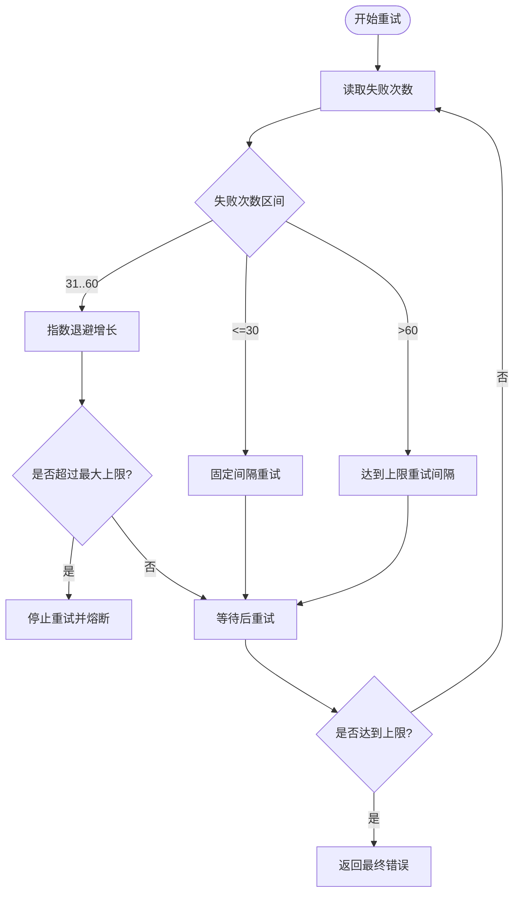
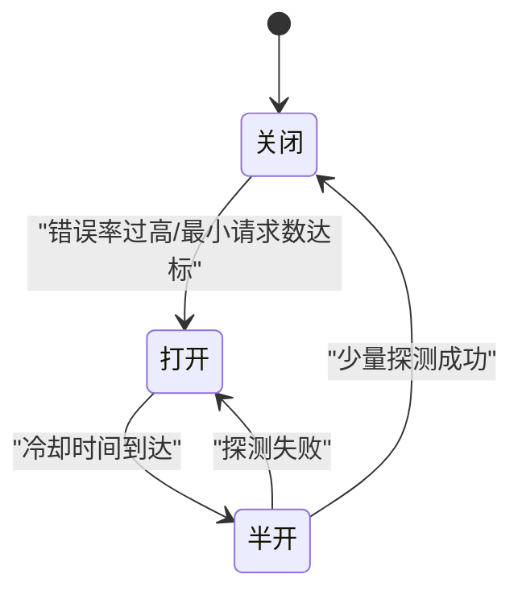
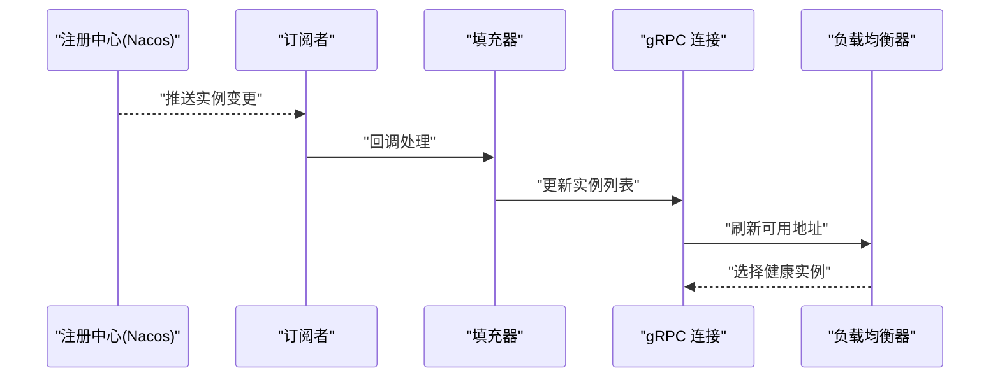
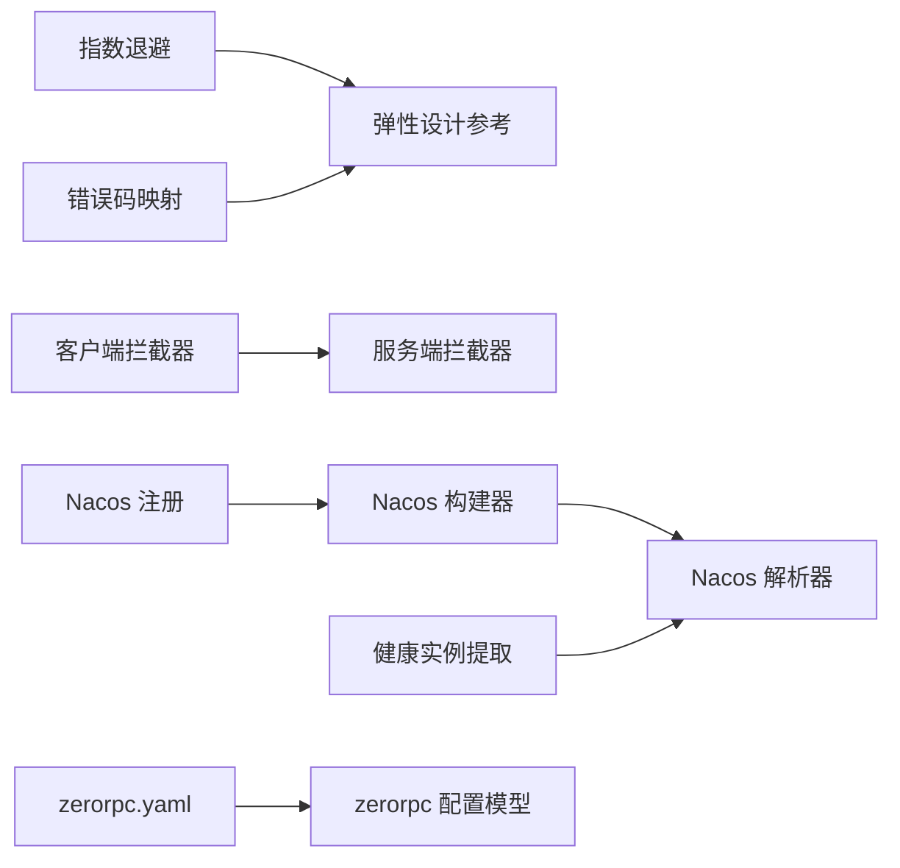

# 分布式系统容错设计

<cite>
**本文引用的文件**
- [backoff.go](file://common/tool/backoff.go)
- [errorutil.go](file://common/tool/errorutil.go)
- [metadataInterceptor.go](file://common/Interceptor/rpcclient/metadataInterceptor.go)
- [loggerInterceptor.go](file://common/Interceptor/rpcserver/loggerInterceptor.go)
- [register.go](file://common/nacosx/register.go)
- [resolver.go](file://common/nacosx/resolver.go)
- [builder.go](file://common/nacosx/builder.go)
- [options.go](file://common/nacosx/options.go)
- [container.go](file://common/socketiox/container.go)
- [config.go](file://zerorpc/internal/config/config.go)
- [zerorpc.yaml](file://zerorpc/etc/zerorpc.yaml)
- [resilience-patterns.md](file://.trae/skills/zero-skills/references/resilience-patterns.md)
</cite>

## 目录
1. [引言](#引言)
2. [项目结构](#项目结构)
3. [核心组件](#核心组件)
4. [架构总览](#架构总览)
5. [详细组件分析](#详细组件分析)
6. [依赖分析](#依赖分析)
7. [性能考虑](#性能考虑)
8. [故障排查指南](#故障排查指南)
9. [结论](#结论)
10. [附录](#附录)

## 引言
本指南面向 zero-service 的分布式系统，围绕容错设计提供权威实践，覆盖超时控制、重试机制、熔断降级、隔离策略、故障转移与健康检查、以及监控告警与诊断。内容基于仓库中实际实现与技能文档，帮助读者在不深入源码的前提下掌握可落地的设计与最佳实践。

## 项目结构
本项目采用多模块微服务架构，围绕 go-zero 框架组织，结合 Nacos 服务注册与发现、gRPC 元数据拦截器、错误码映射工具、指数退避重试与负载均衡策略，形成完整的容错闭环。

**图表来源**
- [backoff.go:1-41](file://common/tool/backoff.go#L1-L41)
- [errorutil.go:1-91](file://common/tool/errorutil.go#L1-L91)
- [metadataInterceptor.go:1-56](file://common/Interceptor/rpcclient/metadataInterceptor.go#L1-L56)
- [loggerInterceptor.go:1-45](file://common/Interceptor/rpcserver/loggerInterceptor.go#L1-L45)
- [register.go:1-99](file://common/nacosx/register.go#L1-L99)
- [builder.go:1-139](file://common/nacosx/builder.go#L1-L139)
- [resolver.go:1-74](file://common/nacosx/resolver.go#L1-L74)
- [options.go:1-72](file://common/nacosx/options.go#L1-L72)
- [container.go:318-356](file://common/socketiox/container.go#L318-L356)
- [config.go:1-25](file://zerorpc/internal/config/config.go#L1-L25)
- [zerorpc.yaml:1-39](file://zerorpc/etc/zerorpc.yaml#L1-L39)
- [resilience-patterns.md:64-690](file://.trae/skills/zero-skills/references/resilience-patterns.md#L64-L690)

**章节来源**
- [backoff.go:1-41](file://common/tool/backoff.go#L1-L41)
- [errorutil.go:1-91](file://common/tool/errorutil.go#L1-L91)
- [metadataInterceptor.go:1-56](file://common/Interceptor/rpcclient/metadataInterceptor.go#L1-L56)
- [loggerInterceptor.go:1-45](file://common/Interceptor/rpcserver/loggerInterceptor.go#L1-L45)
- [register.go:1-99](file://common/nacosx/register.go#L1-L99)
- [builder.go:1-139](file://common/nacosx/builder.go#L1-L139)
- [resolver.go:1-74](file://common/nacosx/resolver.go#L1-L74)
- [options.go:1-72](file://common/nacosx/options.go#L1-L72)
- [container.go:318-356](file://common/socketiox/container.go#L318-L356)
- [config.go:1-25](file://zerorpc/internal/config/config.go#L1-L25)
- [zerorpc.yaml:1-39](file://zerorpc/etc/zerorpc.yaml#L1-L39)
- [resilience-patterns.md:64-690](file://.trae/skills/zero-skills/references/resilience-patterns.md#L64-L690)

## 核心组件
- 指数退避与重试：提供基于失败次数的指数退避策略与超限保护，配合业务侧幂等性实现稳健重试。
- 错误码映射：将自定义枚举错误码映射为标准 HTTP/GRPC 错误，便于统一处理与可观测。
- gRPC 元数据与链路追踪：通过拦截器注入用户、授权、追踪等上下文信息，支撑端到端可观测。
- 服务注册与发现：基于 Nacos 的注册、订阅与解析，自动过滤健康实例并排序更新至负载均衡器。
- Socket 容器健康实例提取：从 Nacos 实例集合中筛选 gRPC 可用实例，支持日志统计与子集选择。
- RPC 配置与运行参数：集中管理服务超时、鉴权、缓存、数据库连接等关键参数。

**章节来源**
- [backoff.go:9-35](file://common/tool/backoff.go#L9-L35)
- [errorutil.go:12-59](file://common/tool/errorutil.go#L12-L59)
- [metadataInterceptor.go:11-32](file://common/Interceptor/rpcclient/metadataInterceptor.go#L11-L32)
- [loggerInterceptor.go:12-44](file://common/Interceptor/rpcserver/loggerInterceptor.go#L12-L44)
- [register.go:21-76](file://common/nacosx/register.go#L21-L76)
- [builder.go:29-112](file://common/nacosx/builder.go#L29-L112)
- [resolver.go:38-66](file://common/nacosx/resolver.go#L38-L66)
- [container.go:318-356](file://common/socketiox/container.go#L318-L356)
- [config.go:8-24](file://zerorpc/internal/config/config.go#L8-L24)
- [zerorpc.yaml:1-39](file://zerorpc/etc/zerorpc.yaml#L1-L39)

## 架构总览
下图展示零信任、低耦合的容错架构：客户端通过拦截器注入上下文，gRPC 连接经由 Nacos 解析器获取健康实例；服务端拦截器记录请求与错误；工具层提供退避、错误映射与健康实例筛选；配置层统一超时与鉴权。

**图表来源**
- [metadataInterceptor.go:11-32](file://common/Interceptor/rpcclient/metadataInterceptor.go#L11-L32)
- [loggerInterceptor.go:12-44](file://common/Interceptor/rpcserver/loggerInterceptor.go#L12-L44)
- [builder.go:75-112](file://common/nacosx/builder.go#L75-L112)
- [resolver.go:47-66](file://common/nacosx/resolver.go#L47-L66)
- [container.go:318-356](file://common/socketiox/container.go#L318-L356)
- [backoff.go:9-35](file://common/tool/backoff.go#L9-L35)
- [errorutil.go:12-59](file://common/tool/errorutil.go#L12-L59)
- [zerorpc.yaml:1-39](file://zerorpc/etc/zerorpc.yaml#L1-L39)
- [config.go:8-24](file://zerorpc/internal/config/config.go#L8-L24)

## 详细组件分析

### 超时控制机制
- 客户端超时设置
  - 在配置层集中设置服务超时与 RPC 超时，确保跨服务调用的一致性与可预期性。
  - 示例路径：[zerorpc.yaml:1-39](file://zerorpc/etc/zerorpc.yaml#L1-L39)，[config.go:8-24](file://zerorpc/internal/config/config.go#L8-L24)
- 服务端超时处理
  - 服务端通过拦截器读取上下文中的超时信息，结合业务逻辑进行短路与快速失败，避免资源耗尽。
  - 示例路径：[loggerInterceptor.go:12-44](file://common/Interceptor/rpcserver/loggerInterceptor.go#L12-L44)
- 链路超时计算策略
  - 建议采用“分层超时 + 剩余时间保护”策略：上游预留缓冲时间，下游按剩余时间执行，防止超时级联。
  - 参考技能文档中的超时与重试实践：[resilience-patterns.md:415-488](file://.trae/skills/zero-skills/references/resilience-patterns.md#L415-L488)

**图表来源**
- [metadataInterceptor.go:11-32](file://common/Interceptor/rpcclient/metadataInterceptor.go#L11-L32)
- [resolver.go:38-66](file://common/nacosx/resolver.go#L38-L66)
- [loggerInterceptor.go:12-44](file://common/Interceptor/rpcserver/loggerInterceptor.go#L12-L44)
- [zerorpc.yaml:1-39](file://zerorpc/etc/zerorpc.yaml#L1-L39)

**章节来源**
- [zerorpc.yaml:1-39](file://zerorpc/etc/zerorpc.yaml#L1-L39)
- [config.go:8-24](file://zerorpc/internal/config/config.go#L8-L24)
- [loggerInterceptor.go:12-44](file://common/Interceptor/rpcserver/loggerInterceptor.go#L12-L44)
- [resilience-patterns.md:415-488](file://.trae/skills/zero-skills/references/resilience-patterns.md#L415-L488)

### 重试机制设计
- 指数退避算法
  - 失败次数在不同区间采用线性增长与指数增长组合，并设置最大上限，防止雪崩。
  - 示例路径：[backoff.go:9-35](file://common/tool/backoff.go#L9-L35)
- 幂等性保证
  - 重试前需确保操作幂等，或引入去重键与状态机，避免重复执行造成副作用。
  - 参考技能文档中的幂等与重试建议：[resilience-patterns.md:423-488](file://.trae/skills/zero-skills/references/resilience-patterns.md#L423-L488)
- 重试上限控制
  - 设置最大重试次数与最长等待时间，超过阈值直接失败并上报，避免无限重试。
  - 示例路径：[backoff.go:29-34](file://common/tool/backoff.go#L29-L34)

**图表来源**
- [backoff.go:9-35](file://common/tool/backoff.go#L9-L35)

**章节来源**
- [backoff.go:9-35](file://common/tool/backoff.go#L9-L35)
- [resilience-patterns.md:423-488](file://.trae/skills/zero-skills/references/resilience-patterns.md#L423-L488)

### 熔断降级策略
- 熔断器模式
  - 状态包括关闭（正常）、打开（快速失败）、半开（试探恢复），依据错误率与最小请求数触发。
  - 参考技能文档中的熔断器状态与配置：[resilience-patterns.md:64-93](file://.trae/skills/zero-skills/references/resilience-patterns.md#L64-L93)
- 快速失败机制
  - 在熔断打开时立即返回错误，避免对下游造成更大压力。
  - 参考技能文档中的快速失败与日志记录：[resilience-patterns.md:644-659](file://.trae/skills/zero-skills/references/resilience-patterns.md#L644-L659)
- 优雅降级方案
  - 提供备用数据源、静态回退、延迟补偿等策略，保障用户体验与系统稳定。
  - 参考技能文档中的降级与测试建议：[resilience-patterns.md:95-157](file://.trae/skills/zero-skills/references/resilience-patterns.md#L95-L157)

**图表来源**
- [resilience-patterns.md:64-93](file://.trae/skills/zero-skills/references/resilience-patterns.md#L64-L93)

**章节来源**
- [resilience-patterns.md:64-93](file://.trae/skills/zero-skills/references/resilience-patterns.md#L64-L93)
- [resilience-patterns.md:644-659](file://.trae/skills/zero-skills/references/resilience-patterns.md#L644-L659)
- [resilience-patterns.md:95-157](file://.trae/skills/zero-skills/references/resilience-patterns.md#L95-L157)

### 隔离策略实现
- 线程池隔离
  - 对外部依赖使用独立线程池，避免线程饥饿与级联阻塞。
  - 参考技能文档中的隔离与限流建议：[resilience-patterns.md:158-200](file://.trae/skills/zero-skills/references/resilience-patterns.md#L158-L200)
- 信号量隔离
  - 控制并发访问数量，防止瞬时洪峰压垮下游。
  - 参考技能文档中的信号量与速率限制：[resilience-patterns.md:158-200](file://.trae/skills/zero-skills/references/resilience-patterns.md#L158-L200)
- 舱壁模式
  - 为不同下游服务分配独立资源池，降低相互影响。
  - 参考技能文档中的舱壁与资源隔离：[resilience-patterns.md:200-300](file://.trae/skills/zero-skills/references/resilience-patterns.md#L200-L300)

**章节来源**
- [resilience-patterns.md:158-200](file://.trae/skills/zero-skills/references/resilience-patterns.md#L158-L200)
- [resilience-patterns.md:200-300](file://.trae/skills/zero-skills/references/resilience-patterns.md#L200-L300)

### 故障转移机制
- 服务发现
  - 通过 Nacos 注册与订阅，动态感知实例变化，自动剔除不健康节点。
  - 示例路径：[register.go:21-76](file://common/nacosx/register.go#L21-L76)，[builder.go:75-112](file://common/nacosx/builder.go#L75-L112)
- 负载均衡
  - 解析器将健康实例排序并更新至 gRPC 连接，确保流量均匀分布。
  - 示例路径：[resolver.go:47-66](file://common/nacosx/resolver.go#L47-L66)
- 健康检查协同
  - 健康实例提取函数过滤不可用实例，输出 gRPC 地址集合。
  - 示例路径：[container.go:318-356](file://common/socketiox/container.go#L318-L356)

**图表来源**
- [register.go:21-76](file://common/nacosx/register.go#L21-L76)
- [builder.go:75-112](file://common/nacosx/builder.go#L75-L112)
- [resolver.go:47-66](file://common/nacosx/resolver.go#L47-L66)
- [container.go:318-356](file://common/socketiox/container.go#L318-L356)

**章节来源**
- [register.go:21-76](file://common/nacosx/register.go#L21-L76)
- [builder.go:75-112](file://common/nacosx/builder.go#L75-L112)
- [resolver.go:47-66](file://common/nacosx/resolver.go#L47-L66)
- [container.go:318-356](file://common/socketiox/container.go#L318-L356)

### 监控告警与故障诊断
- 关键指标
  - 熔断器事件、负载降级、速率限制、超时与延迟等指标应纳入监控体系。
  - 参考技能文档中的指标清单与日志规范：[resilience-patterns.md:621-659](file://.trae/skills/zero-skills/references/resilience-patterns.md#L621-L659)
- 日志与追踪
  - 服务端拦截器统一记录错误与上下文，客户端拦截器注入追踪 ID，便于端到端定位。
  - 示例路径：[loggerInterceptor.go:12-44](file://common/Interceptor/rpcserver/loggerInterceptor.go#L12-L44)，[metadataInterceptor.go:11-32](file://common/Interceptor/rpcclient/metadataInterceptor.go#L11-L32)
- 告警策略
  - 基于错误率、超时率、CPU 使用率与队列长度设置阈值告警，结合熔断与降级动作联动。

**章节来源**
- [resilience-patterns.md:621-659](file://.trae/skills/zero-skills/references/resilience-patterns.md#L621-L659)
- [loggerInterceptor.go:12-44](file://common/Interceptor/rpcserver/loggerInterceptor.go#L12-L44)
- [metadataInterceptor.go:11-32](file://common/Interceptor/rpcclient/metadataInterceptor.go#L11-L32)

## 依赖分析
- 组件内聚与耦合
  - 工具层（退避、错误映射）与拦截器低耦合，便于复用。
  - Nacos 解析器与负载均衡器解耦，通过接口传递地址列表。
- 外部依赖
  - Nacos SDK、gRPC、go-zero 核心库、Carbon 时间库等。
- 循环依赖
  - 当前文件未见循环导入，模块边界清晰。

**图表来源**
- [backoff.go:1-41](file://common/tool/backoff.go#L1-L41)
- [errorutil.go:1-91](file://common/tool/errorutil.go#L1-L91)
- [metadataInterceptor.go:1-56](file://common/Interceptor/rpcclient/metadataInterceptor.go#L1-L56)
- [loggerInterceptor.go:1-45](file://common/Interceptor/rpcserver/loggerInterceptor.go#L1-L45)
- [builder.go:1-139](file://common/nacosx/builder.go#L1-L139)
- [resolver.go:1-74](file://common/nacosx/resolver.go#L1-L74)
- [register.go:1-99](file://common/nacosx/register.go#L1-L99)
- [container.go:318-356](file://common/socketiox/container.go#L318-L356)
- [zerorpc.yaml:1-39](file://zerorpc/etc/zerorpc.yaml#L1-L39)
- [config.go:1-25](file://zerorpc/internal/config/config.go#L1-L25)

**章节来源**
- [backoff.go:1-41](file://common/tool/backoff.go#L1-L41)
- [errorutil.go:1-91](file://common/tool/errorutil.go#L1-L91)
- [metadataInterceptor.go:1-56](file://common/Interceptor/rpcclient/metadataInterceptor.go#L1-L56)
- [loggerInterceptor.go:1-45](file://common/Interceptor/rpcserver/loggerInterceptor.go#L1-L45)
- [builder.go:1-139](file://common/nacosx/builder.go#L1-L139)
- [resolver.go:1-74](file://common/nacosx/resolver.go#L1-L74)
- [register.go:1-99](file://common/nacosx/register.go#L1-L99)
- [container.go:318-356](file://common/socketiox/container.go#L318-L356)
- [zerorpc.yaml:1-39](file://zerorpc/etc/zerorpc.yaml#L1-L39)
- [config.go:1-25](file://zerorpc/internal/config/config.go#L1-L25)

## 性能考虑
- 超时与重试
  - 合理设置超时与退避上限，避免放大延迟与抖动。
- 负载均衡
  - 健康实例排序与去重，减少无效连接尝试。
- 资源隔离
  - 独立线程池与信号量，避免共享资源争用。
- 监控与采样
  - 关键路径埋点与采样，避免观测成本过高。

## 故障排查指南
- 链路追踪
  - 通过客户端拦截器注入的追踪 ID，在服务端拦截器日志中定位请求生命周期。
  - 示例路径：[metadataInterceptor.go:11-32](file://common/Interceptor/rpcclient/metadataInterceptor.go#L11-L32)，[loggerInterceptor.go:12-44](file://common/Interceptor/rpcserver/loggerInterceptor.go#L12-L44)
- 错误码映射
  - 使用错误码映射工具将自定义错误转换为标准错误，便于统一告警与处理。
  - 示例路径：[errorutil.go:12-59](file://common/tool/errorutil.go#L12-L59)
- 服务发现异常
  - 检查 Nacos 注册与订阅流程，确认健康实例过滤逻辑与地址格式。
  - 示例路径：[register.go:21-76](file://common/nacosx/register.go#L21-L76)，[builder.go:75-112](file://common/nacosx/builder.go#L75-L112)，[resolver.go:38-66](file://common/nacosx/resolver.go#L38-L66)，[container.go:318-356](file://common/socketiox/container.go#L318-L356)
- 配置核对
  - 确认 zerorpc.yaml 中的超时、鉴权、缓存与数据库配置是否正确。
  - 示例路径：[zerorpc.yaml:1-39](file://zerorpc/etc/zerorpc.yaml#L1-L39)，[config.go:8-24](file://zerorpc/internal/config/config.go#L8-L24)

**章节来源**
- [metadataInterceptor.go:11-32](file://common/Interceptor/rpcclient/metadataInterceptor.go#L11-L32)
- [loggerInterceptor.go:12-44](file://common/Interceptor/rpcserver/loggerInterceptor.go#L12-L44)
- [errorutil.go:12-59](file://common/tool/errorutil.go#L12-L59)
- [register.go:21-76](file://common/nacosx/register.go#L21-L76)
- [builder.go:75-112](file://common/nacosx/builder.go#L75-L112)
- [resolver.go:38-66](file://common/nacosx/resolver.go#L38-L66)
- [container.go:318-356](file://common/socketiox/container.go#L318-L356)
- [zerorpc.yaml:1-39](file://zerorpc/etc/zerorpc.yaml#L1-L39)
- [config.go:8-24](file://zerorpc/internal/config/config.go#L8-L24)

## 结论
本指南基于 zero-service 的实际实现，总结了超时、重试、熔断、隔离、故障转移与监控告警的关键设计与最佳实践。通过配置层统一超时、工具层提供退避与错误映射、拦截器贯穿链路追踪、Nacos 动态健康实例与负载均衡，形成闭环的容错体系。建议在生产环境启用自动负载降级与熔断器，并持续完善监控与演练。

## 附录
- 相关参考
  - 弹性设计与容错模式参考：[resilience-patterns.md:64-690](file://.trae/skills/zero-skills/references/resilience-patterns.md#L64-L690)
- 配置要点
  - 服务超时、鉴权密钥、缓存与数据库连接等参数集中管理，便于一致性与审计。
  - 示例路径：[zerorpc.yaml:1-39](file://zerorpc/etc/zerorpc.yaml#L1-L39)，[config.go:8-24](file://zerorpc/internal/config/config.go#L8-L24)