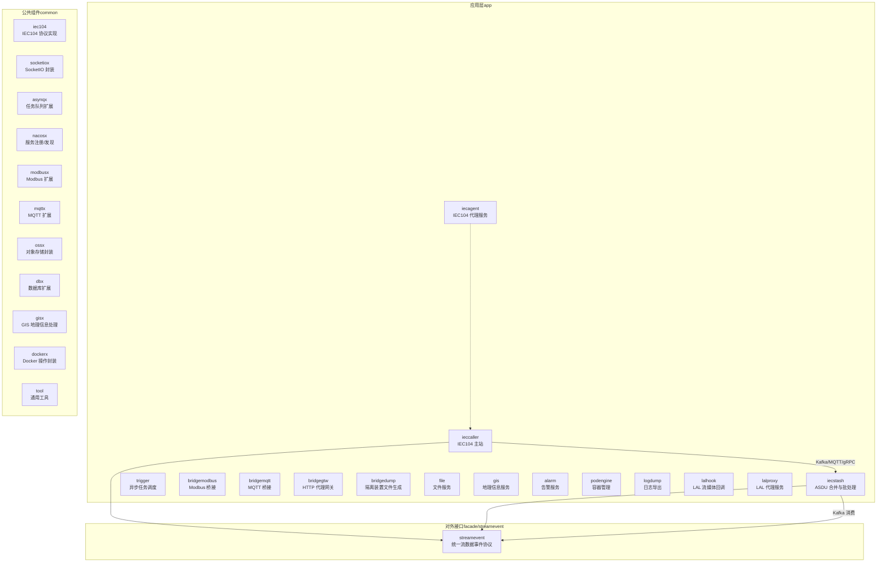
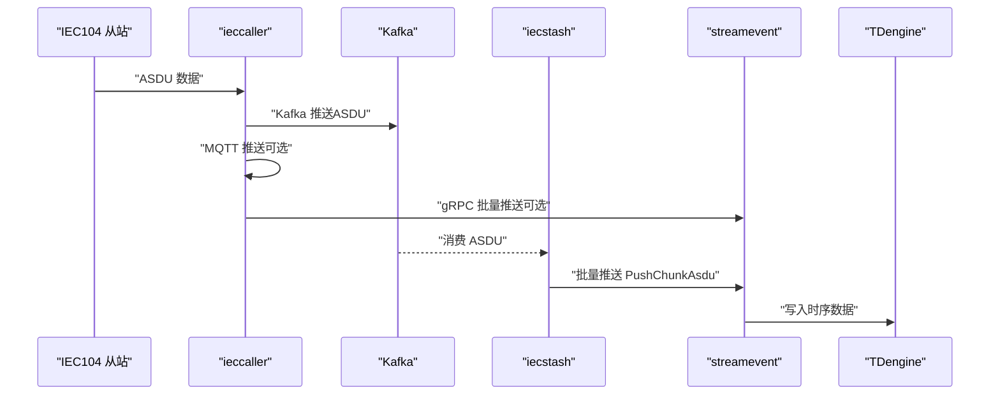
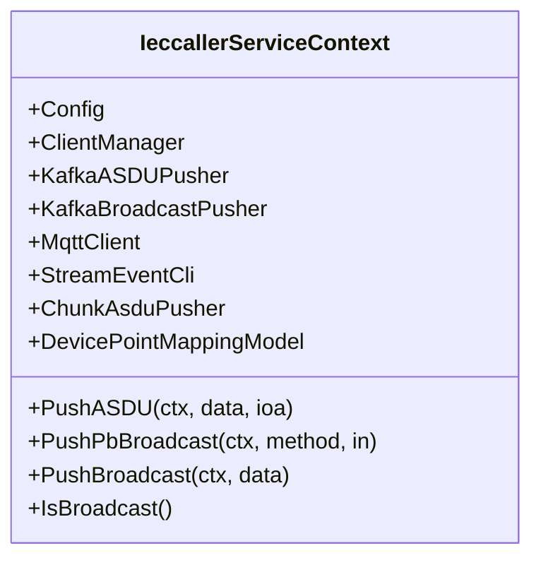
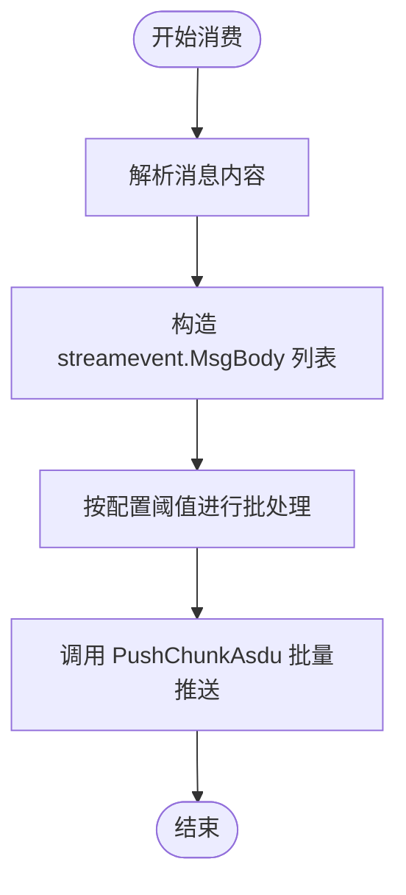
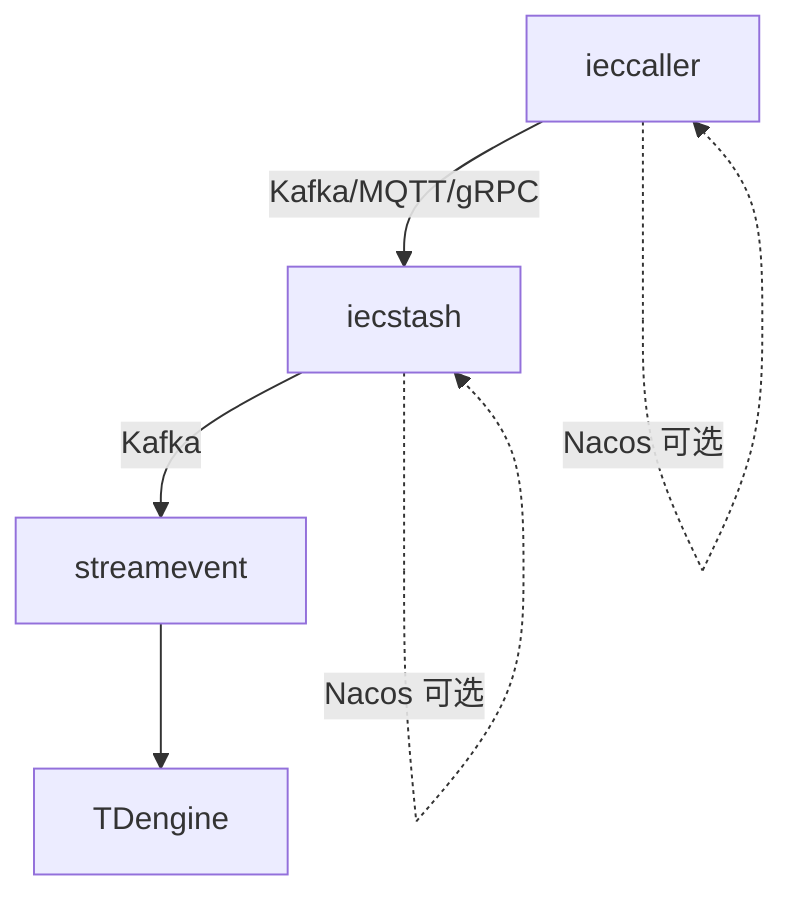

# 微服务拆分与边界设计

<cite>
**本文引用的文件**   
- [README.md](file://README.md)
- [ieccaller.go](file://app/ieccaller/ieccaller.go)
- [iecagent.go](file://app/iecagent/iecagent.go)
- [iecstash.go](file://app/iecstash/iecstash.go)
- [types.go](file://common/iec104/types/types.go)
- [config.go（ieccaller）](file://app/ieccaller/internal/config/config.go)
- [config.go（iecstash）](file://app/iecstash/internal/config/config.go)
- [config.go（iecagent）](file://app/iecagent/internal/config/config.go)
- [ieccaller.yaml](file://app/ieccaller/etc/ieccaller.yaml)
- [iecstash.yaml](file://app/iecstash/etc/iecstash.yaml)
- [servicecontext.go（ieccaller）](file://app/ieccaller/internal/svc/servicecontext.go)
- [servicecontext.go（iecstash）](file://app/iecstash/internal/svc/servicecontext.go)
- [servicecontext.go（iecagent）](file://app/iecagent/internal/svc/servicecontext.go)
- [asdu.go（iecstash）](file://app/iecstash/kafka/asdu.go)
</cite>

## 目录
1. [引言](#引言)
2. [项目结构](#项目结构)
3. [核心组件](#核心组件)
4. [架构总览](#架构总览)
5. [详细组件分析](#详细组件分析)
6. [依赖分析](#依赖分析)
7. [性能考虑](#性能考虑)
8. [故障排查指南](#故障排查指南)
9. [结论](#结论)
10. [附录](#附录)

## 引言
本指南围绕 zero-service 的 IEC 104 数采平台，系统阐述基于领域驱动设计（DDD）的微服务拆分与边界设计方法论，重点包括：
- 聚合根定义与实体边界划分
- 限界上下文设计
- 服务粒度控制策略与常见陷阱
- 业务能力边界、数据边界与技术边界的识别方法
- 具体拆分案例：ieccaller、iecstash、iecagent 的架构考量
- 服务间依赖关系、接口设计原则与演化路径规划

目标是帮助读者在保持系统一致性的同时，实现高内聚、低耦合、可演进的微服务体系。

## 项目结构
zero-service 采用“按功能域分层”的组织方式，核心服务集中在 app/ 目录下，公共能力沉淀在 common/，对外统一通过 facade/streamevent 提供跨语言 gRPC 接口，整体结构清晰、职责明确。

图表来源
- [README.md:15-108](file://README.md#L15-L108)

章节来源
- [README.md:59-108](file://README.md#L59-L108)

## 核心组件
本节聚焦 IEC 104 数采平台的三大核心服务：ieccaller、iecstash、streamevent（通过 facade/streamevent 提供），它们分别承担“采集主站”“数据合并与批处理”“统一事件落库”的职责，并通过 Kafka、MQTT、gRPC 构建松耦合的数据通道。

- ieccaller：IEC 104 主站，负责多从站并发通信、Kafka/MQTT/gRPC 三协议推送、动态配置与弱校验模式，具备广播与集群部署能力。
- iecstash：Kafka 消费者，负责 ASDU 压缩合并、Chunk 批量处理、下游 RPC 转发至 streamevent。
- streamevent（facade 层）：统一跨语言流数据事件协议，接收来自 ieccaller/iecstash 的 ASDU，进行点位配置管理与 TDengine 时序存储。

章节来源
- [README.md:112-131](file://README.md#L112-L131)
- [ieccaller.go:1-123](file://app/ieccaller/ieccaller.go#L1-L123)
- [iecstash.go:1-85](file://app/iecstash/iecstash.go#L1-L85)
- [servicecontext.go（ieccaller）:33-43](file://app/ieccaller/internal/svc/servicecontext.go#L33-L43)
- [servicecontext.go（iecstash）:19-23](file://app/iecstash/internal/svc/servicecontext.go#L19-L23)

## 架构总览
IEC 104 数采平台的数据流如下：IEC 104 从站 → ieccaller → Kafka → iecstash → streamevent → TDengine；同时支持 MQTT/gRPC 三路推送，满足不同下游系统的接入需求。

图表来源
- [README.md:122-127](file://README.md#L122-L127)
- [ieccaller.yaml:35-57](file://app/ieccaller/etc/ieccaller.yaml#L35-L57)
- [iecstash.yaml:18-35](file://app/iecstash/etc/iecstash.yaml#L18-L35)
- [servicecontext.go（ieccaller）:144-244](file://app/ieccaller/internal/svc/servicecontext.go#L144-L244)
- [servicecontext.go（iecstash）:36-84](file://app/iecstash/internal/svc/servicecontext.go#L36-L84)

## 详细组件分析

### DDD 边界设计与聚合根
- 限界上下文划分
  - IEC104 主站上下文：ieccaller 负责与多个 IEC 从站交互、命令下发、数据汇聚与多协议推送，是该上下文的边界入口。
  - 数据合并与批处理上下文：iecstash 负责 Kafka 消费、ASDU 压缩合并、Chunk 批量处理，作为上游 ieccaller 的下游消费者。
  - 统一事件落库上下文：facade/streamevent（streamevent）统一接收多源数据，完成点位配置与 TDengine 写入。
- 聚合根与实体边界
  - 聚合根：以“点位映射”为核心聚合，贯穿 ieccaller 的点位查询与下发、iecstash 的合并与转发、streamevent 的落库决策。
  - 实体边界：ieccaller 侧维护设备/点位映射缓存与推送开关；iecstash 侧仅负责数据聚合与转发；streamevent 侧负责最终落库与配置管理。
- 业务能力边界
  - ieccaller：主站通信、命令调度、多协议推送、广播与集群模式。
  - iecstash：Kafka 消费、ASDU 合并、Chunk 批处理、下游转发。
  - streamevent：跨协议事件聚合、点位配置、时序数据库写入。

章节来源
- [types.go:31-40](file://common/iec104/types/types.go#L31-L40)
- [servicecontext.go（ieccaller）:144-180](file://app/ieccaller/internal/svc/servicecontext.go#L144-L180)
- [servicecontext.go（iecstash）:36-65](file://app/iecstash/internal/svc/servicecontext.go#L36-L65)

### 服务粒度控制策略
- 避免过度拆分
  - 将 ieccaller 的“主站通信 + 多协议推送 + 广播”整合在一个服务中，减少跨服务调用带来的复杂性与延迟。
  - iecstash 专注于 Kafka 消费与批处理，避免与 ieccaller 的业务逻辑耦合。
- 避免拆分不足
  - 将“点位映射”从 ieccaller 中剥离，形成独立的配置与缓存机制，便于横向扩展与独立演进。
- 服务边界识别方法
  - 业务能力边界：以“主站通信”“数据合并”“事件落库”划分。
  - 数据边界：以“点位映射”为中心，确保跨服务一致的读写路径。
  - 技术边界：以“Kafka/MQTT/gRPC”为传输通道，确保服务间解耦。

章节来源
- [README.md:112-131](file://README.md#L112-L131)
- [config.go（ieccaller）:18-58](file://app/ieccaller/internal/config/config.go#L18-L58)
- [config.go（iecstash）:10-28](file://app/iecstash/internal/config/config.go#L10-L28)

### 服务间依赖关系与接口设计
- 依赖关系
  - ieccaller → Kafka/MQTT/gRPC → iecstash
  - iecstash → streamevent（PushChunkAsdu）
  - streamevent → TDengine（时序写入）
- 接口设计原则
  - 以 gRPC 为主，统一跨语言协议（facade/streamevent）。
  - 使用 Chunk 批量推送，降低调用频次与网络开销。
  - 通过配置控制是否启用 Kafka/MQTT/gRPC 推送，保证灵活性。
- 演化路径规划
  - 逐步引入更强的配置中心与版本化协议，确保向后兼容。
  - 在 streamevent 侧增加数据校验与回放能力，提升可靠性。

章节来源
- [ieccaller.yaml:35-64](file://app/ieccaller/etc/ieccaller.yaml#L35-L64)
- [iecstash.yaml:18-42](file://app/iecstash/etc/iecstash.yaml#L18-L42)
- [servicecontext.go（ieccaller）:112-131](file://app/ieccaller/internal/svc/servicecontext.go#L112-L131)
- [servicecontext.go（iecstash）:67-84](file://app/iecstash/internal/svc/servicecontext.go#L67-L84)

### ieccaller：主站通信与多协议推送
- 职责
  - 多从站并行通信、命令调度、Kafka/MQTT/gRPC 推送、广播与集群模式。
- 关键实现要点
  - 通过 ServiceContext 统一管理 Kafka/MQTT/gRPC 客户端与 Chunk 批处理器。
  - 支持点位映射缓存与推送开关，确保只推送有效数据。
  - 提供广播推送能力，配合集群部署模式使用。

图表来源
- [servicecontext.go（ieccaller）:33-43](file://app/ieccaller/internal/svc/servicecontext.go#L33-L43)
- [servicecontext.go（ieccaller）:144-244](file://app/ieccaller/internal/svc/servicecontext.go#L144-L244)

章节来源
- [ieccaller.go:1-123](file://app/ieccaller/ieccaller.go#L1-L123)
- [config.go（ieccaller）:18-58](file://app/ieccaller/internal/config/config.go#L18-L58)
- [ieccaller.yaml:1-79](file://app/ieccaller/etc/ieccaller.yaml#L1-L79)
- [servicecontext.go（ieccaller）:33-142](file://app/ieccaller/internal/svc/servicecontext.go#L33-L142)

### iecstash：Kafka 消费与批处理
- 职责
  - Kafka 消费 ASDU，进行压缩合并与 Chunk 批处理，统一推送至 streamevent。
- 关键实现要点
  - 通过 Asdu 消费器将消息写入 Chunk 批处理器。
  - 通过 ServiceContext 构造 gRPC 客户端，批量推送 PushChunkAsdu。

图表来源
- [asdu.go（iecstash）:20-24](file://app/iecstash/kafka/asdu.go#L20-L24)
- [servicecontext.go（iecstash）:36-84](file://app/iecstash/internal/svc/servicecontext.go#L36-L84)

章节来源
- [iecstash.go:1-85](file://app/iecstash/iecstash.go#L1-L85)
- [config.go（iecstash）:10-28](file://app/iecstash/internal/config/config.go#L10-L28)
- [iecstash.yaml:1-46](file://app/iecstash/etc/iecstash.yaml#L1-L46)
- [asdu.go（iecstash）:1-25](file://app/iecstash/kafka/asdu.go#L1-L25)
- [servicecontext.go（iecstash）:19-92](file://app/iecstash/internal/svc/servicecontext.go#L19-L92)

### iecagent：IEC104 代理管理
- 职责
  - 提供 IEC104 代理服务，作为从站侧的桥接或代理节点。
- 关键实现要点
  - 通过 ServiceContext 注册 IEC Server，处理来自上游的请求。

章节来源
- [iecagent.go:1-59](file://app/iecagent/iecagent.go#L1-L59)
- [config.go（iecagent）:1-14](file://app/iecagent/internal/config/config.go#L1-L14)
- [servicecontext.go（iecagent）:1-14](file://app/iecagent/internal/svc/servicecontext.go#L1-L14)

## 依赖分析
- 服务间依赖
  - ieccaller 依赖 Kafka/MQTT/gRPC 与 streamevent；iecstash 依赖 Kafka 与 streamevent；iecagent 作为独立代理服务，可与 ieccaller 协同工作。
- 外部依赖
  - Kafka：消息队列，承载 ieccaller 与 iecstash 的数据通道。
  - TDengine：时序数据库，承载 streamevent 的最终落库。
  - Nacos：服务注册与发现（部分服务启用）。
- 内聚与耦合
  - ieccaller 与 iecstash 通过 Kafka 解耦，降低强耦合风险。
  - streamevent 作为统一出口，集中处理点位配置与落库，提升内聚性。

图表来源
- [ieccaller.yaml:35-64](file://app/ieccaller/etc/ieccaller.yaml#L35-L64)
- [iecstash.yaml:18-42](file://app/iecstash/etc/iecstash.yaml#L18-L42)
- [servicecontext.go（ieccaller）:64-75](file://app/ieccaller/internal/svc/servicecontext.go#L64-L75)
- [servicecontext.go（iecstash）:26-34](file://app/iecstash/internal/svc/servicecontext.go#L26-L34)

章节来源
- [README.md:15-51](file://README.md#L15-L51)
- [ieccaller.go:60-82](file://app/ieccaller/ieccaller.go#L60-L82)
- [iecstash.go:54-72](file://app/iecstash/iecstash.go#L54-L72)

## 性能考虑
- 批量推送与阈值控制
  - 通过 PushAsduChunkBytes 控制批量大小，平衡吞吐与延迟。
- 并发与资源利用
  - ieccaller 的 TaskConcurrency 与 iecstash 的 Conns/Consumers/Processors 参数应与 CPU 核数匹配，避免资源浪费或瓶颈。
- 网络与 IO
  - Kafka 的 MinBytes/MaxBytes 应结合网络与磁盘性能调优，提升吞吐。
- 超时与优雅退出
  - GracePeriod 与超时控制确保服务在关闭时能完成未决任务，避免数据丢失。

章节来源
- [ieccaller.yaml:77-79](file://app/ieccaller/etc/ieccaller.yaml#L77-L79)
- [iecstash.yaml:24-35](file://app/iecstash/etc/iecstash.yaml#L24-L35)
- [servicecontext.go（ieccaller）:50-56](file://app/ieccaller/internal/svc/servicecontext.go#L50-L56)
- [servicecontext.go（iecstash）:26-34](file://app/iecstash/internal/svc/servicecontext.go#L26-L34)

## 故障排查指南
- 常见问题定位
  - Kafka 推送失败：检查 brokers、topic、权限与网络连通性。
  - MQTT 推送失败：确认 broker 地址、用户名密码与订阅主题。
  - gRPC 调用失败：检查 endpoints/target、超时设置与最大消息大小配置。
  - 点位映射缺失：确认 DevicePointMappingModel 的缓存与数据库配置。
- 日志与指标
  - 启用详细日志与监控，关注 PushChunkAsdu 的耗时与成功率。
- 优雅退出与资源回收
  - 确保 GracePeriod 设置合理，Close 方法正确释放 Kafka/MQTT 客户端与连接。

章节来源
- [servicecontext.go（ieccaller）:186-244](file://app/ieccaller/internal/svc/servicecontext.go#L186-L244)
- [servicecontext.go（iecstash）:67-84](file://app/iecstash/internal/svc/servicecontext.go#L67-L84)
- [servicecontext.go（ieccaller）:291-311](file://app/ieccaller/internal/svc/servicecontext.go#L291-L311)
- [servicecontext.go（iecstash）:86-92](file://app/iecstash/internal/svc/servicecontext.go#L86-L92)

## 结论
通过对 IEC 104 数采平台的深入分析，本指南总结了基于 DDD 的微服务拆分与边界设计方法：以“点位映射”为核心聚合，划分“主站通信—数据合并—事件落库”三层上下文，借助 Kafka/MQTT/gRPC 实现解耦；通过配置化与批量推送优化性能；通过统一的 facade/streamevent 提升跨语言与跨系统的一致性。该方案既避免了过度拆分导致的复杂性，也避免了拆分不足造成的耦合，为后续演进提供了清晰路径。

## 附录
- 配置参考
  - ieccaller.yaml：Kafka/MQTT/gRPC 推送开关、广播配置、点位映射数据库配置等。
  - iecstash.yaml：Kafka 消费参数、批量推送阈值、服务发现配置等。
- 协议与类型
  - types.go：MsgBody、PointMapping、ASDU 信息体类型等核心数据结构。

章节来源
- [ieccaller.yaml:1-79](file://app/ieccaller/etc/ieccaller.yaml#L1-L79)
- [iecstash.yaml:1-46](file://app/iecstash/etc/iecstash.yaml#L1-L46)
- [types.go:11-40](file://common/iec104/types/types.go#L11-L40)