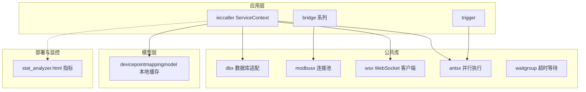
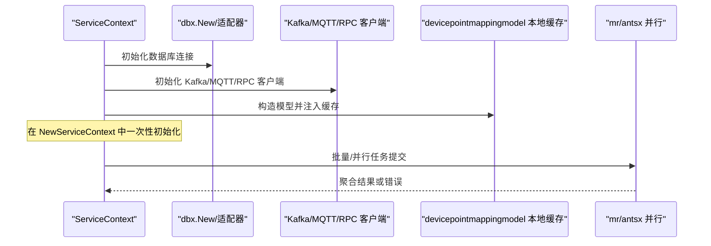
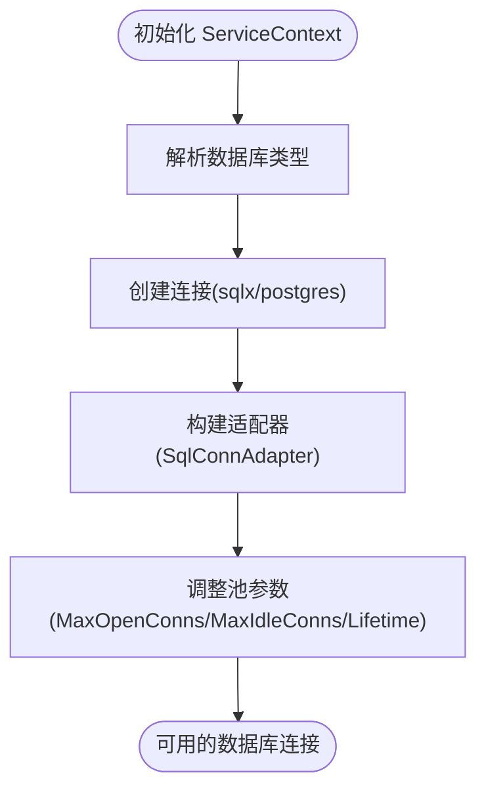
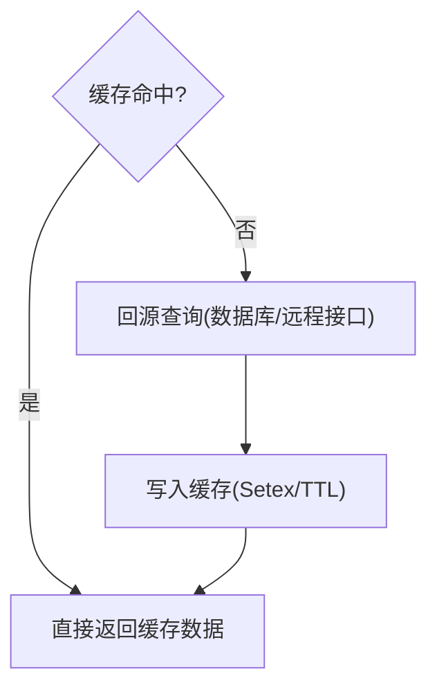
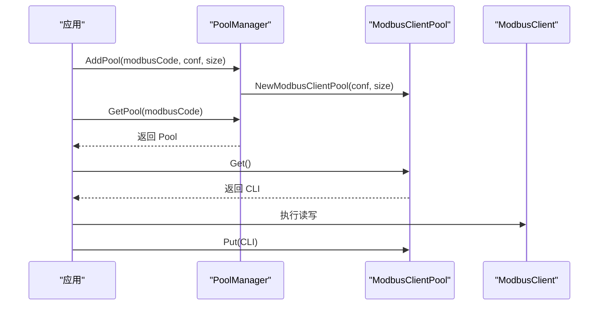
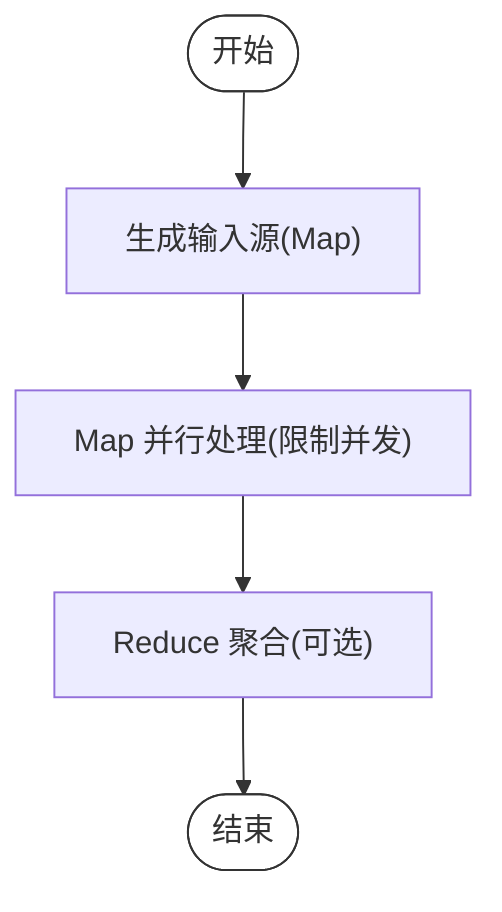
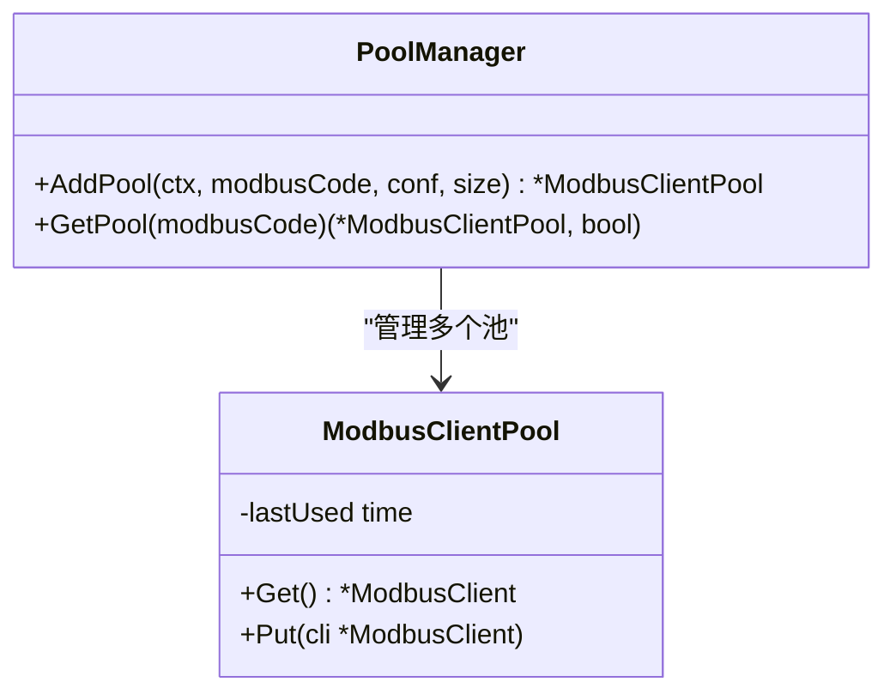
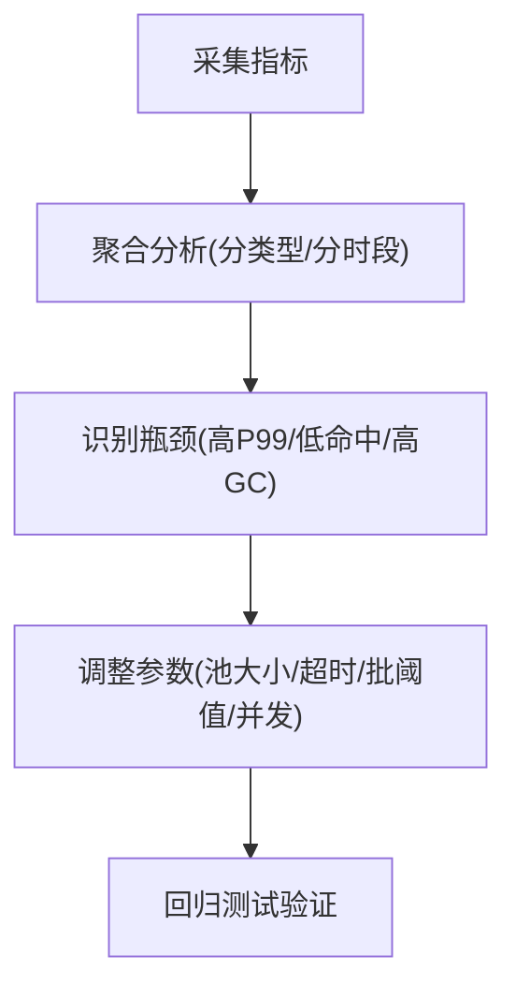
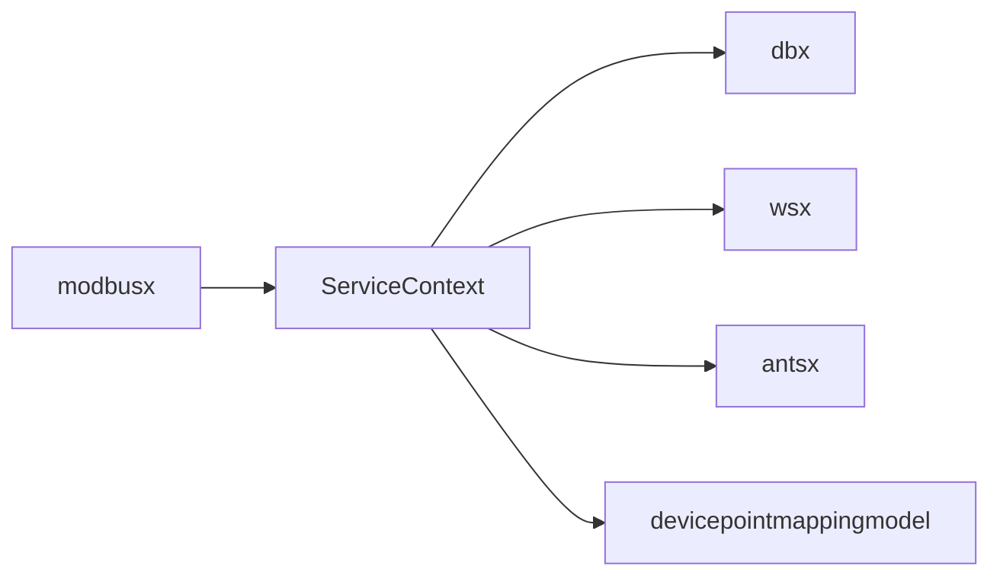

# 性能优化与资源管理

<cite>
**本文引用的文件**
- [overview.md](file://.trae/skills/zero-skills/best-practices/overview.md)
- [resilience-patterns.md](file://.trae/skills/zero-skills/references/resilience-patterns.md)
- [database-patterns.md](file://.trae/skills/zero-skills/references/database-patterns.md)
- [dbx.go](file://common/dbx/dbx.go)
- [config.go](file://app/ieccaller/internal/config/config.go)
- [servicecontext.go](file://app/ieccaller/internal/svc/servicecontext.go)
- [client.go](file://common/wsx/client.go)
- [config.go](file://common/modbusx/config.go)
- [client.go](file://common/modbusx/client.go)
- [devicepointmappingmodel.go](file://model/devicepointmappingmodel.go)
- [antsx.go](file://common/antsx/antsx.go)
- [waitgroup.go](file://common/iec104/waitgroup/waitgroup.go)
- [stat_analyzer.html](file://deploy/stat_analyzer.html)
</cite>

## 目录
1. [简介](#简介)
2. [项目结构](#项目结构)
3. [核心组件](#核心组件)
4. [架构总览](#架构总览)
5. [详细组件分析](#详细组件分析)
6. [依赖分析](#依赖分析)
7. [性能考量](#性能考量)
8. [故障排查指南](#故障排查指南)
9. [结论](#结论)
10. [附录](#附录)

## 简介
本指南面向 zero-service 的性能优化与资源管理，围绕连接池管理（数据库、Redis、HTTP/WS/Modbus）、缓存策略（多级缓存、失效与预热）、批量操作（批量查询/写入、MapReduce 并行）、内存与并发控制（对象池、goroutine 限制、死锁预防）、以及性能监控与调优展开。文档结合仓库中的最佳实践与实现代码，提供可落地的建议与可视化图示。

## 项目结构
- 应用层：ieccaller、bridge 系列、trigger 等模块在内部通过 ServiceContext 统一注入共享资源（数据库、MQTT/Kafka、RPC 客户端、批处理推送器等）。
- 公共库：dbx 提供数据库连接与适配；modbusx 提供 Modbus 客户端连接池；wsx 提供 WebSocket 客户端生命周期与认证流程；antsx 提供基于 ants 的 Reactor/Promise 并行执行模型；waitgroup 提供带超时的等待工具。
- 模型层：devicepointmappingmodel 提供基于本地缓存的读取与键生成。
- 部署与监控：stat_analyzer.html 展示了系统指标采集与聚合，便于性能分析。

**图表来源**
- [servicecontext.go:45-142](file://app/ieccaller/internal/svc/servicecontext.go#L45-L142)
- [dbx.go:46-64](file://common/dbx/dbx.go#L46-L64)
- [client.go:242-596](file://common/wsx/client.go#L242-L596)
- [config.go:63-124](file://common/modbusx/config.go#L63-L124)
- [client.go:153-197](file://common/modbusx/client.go#L153-L197)
- [devicepointmappingmodel.go:66-107](file://model/devicepointmappingmodel.go#L66-L107)
- [antsx.go:150-214](file://common/antsx/antsx.go#L150-L214)
- [waitgroup.go:1-112](file://common/iec104/waitgroup/waitgroup.go#L1-L112)
- [stat_analyzer.html:1145-1327](file://deploy/stat_analyzer.html#L1145-L1327)

**章节来源**
- [servicecontext.go:45-142](file://app/ieccaller/internal/svc/servicecontext.go#L45-L142)
- [dbx.go:46-64](file://common/dbx/dbx.go#L46-L64)

## 核心组件
- 连接池与资源管理
  - 数据库连接：统一在 ServiceContext 中初始化，dbx 根据数据源自动选择驱动类型，并提供适配器封装。
  - Modbus 客户端连接池：PoolManager 按 modbusCode 管理连接池，支持并发安全获取与归还，内置资源最大存活时间。
  - WebSocket 客户端：连接管理器负责拨号、认证、心跳、重连与清理，支持超时与状态变更回调。
- 缓存策略
  - 本地缓存：devicepointmappingmodel 提供键生成与缓存读取，命中后复制数据返回。
  - 手动缓存：best-practices 展示了基于 Redis 的手动缓存读写与过期策略。
- 并行与批量
  - 并行执行：antsx 基于 ants 的 Reactor/Promise，支持任务提交、链式 Then/Catch、FireAndForget。
  - MapReduce：best-practices 展示了 MapReduce 并行处理与工作池限制。
- 并发控制
  - goroutine 限制：threading.NewTaskRunner 限制并发；waitgroup 提供 WaitTimeout 防止阻塞泄漏。
- 监控与调优
  - 指标采集：stat_analyzer.html 展示 QPS、响应时间、缓存命中率、GC 等关键指标。

**章节来源**
- [dbx.go:46-64](file://common/dbx/dbx.go#L46-L64)
- [config.go:63-124](file://common/modbusx/config.go#L63-L124)
- [client.go:153-197](file://common/modbusx/client.go#L153-L197)
- [client.go:242-596](file://common/wsx/client.go#L242-L596)
- [devicepointmappingmodel.go:66-107](file://model/devicepointmappingmodel.go#L66-L107)
- [overview.md:490-544](file://.trae/skills/zero-skills/best-practices/overview.md#L490-L544)
- [antsx.go:150-214](file://common/antsx/antsx.go#L150-L214)
- [waitgroup.go:1-112](file://common/iec104/waitgroup/waitgroup.go#L1-L112)
- [stat_analyzer.html:1145-1327](file://deploy/stat_analyzer.html#L1145-L1327)

## 架构总览
下图展示了服务启动时的资源初始化与调用链，体现连接池、缓存与并行执行的关键交互。

**图表来源**
- [servicecontext.go:45-142](file://app/ieccaller/internal/svc/servicecontext.go#L45-L142)
- [dbx.go:46-64](file://common/dbx/dbx.go#L46-L64)
- [devicepointmappingmodel.go:66-107](file://model/devicepointmappingmodel.go#L66-L107)
- [overview.md:490-544](file://.trae/skills/zero-skills/best-practices/overview.md#L490-L544)

## 详细组件分析

### 数据库连接池管理策略
- 设计原则
  - 单例化：在 ServiceContext 中一次性初始化，避免在 handler 或 logic 中重复创建。
  - 自适应：dbx.ParseDatabaseType 根据数据源自动识别类型，统一走 sqlx/postgres 适配。
  - 可观测：RawDB 获取底层 sql.DB 后可设置 MaxOpenConns、MaxIdleConns、ConnMaxLifetime。
- 最佳实践
  - 使用默认池参数或根据负载调整；对高并发场景适当提升 MaxOpenConns 与 MaxIdleConns。
  - 设置合理的 ConnMaxLifetime，避免连接老化导致的抖动。
- 反模式
  - 循环中逐条查询引发 N+1；应改为批量查询或合并查询。

**图表来源**
- [dbx.go:31-64](file://common/dbx/dbx.go#L31-L64)
- [servicecontext.go:133-140](file://app/ieccaller/internal/svc/servicecontext.go#L133-L140)

**章节来源**
- [dbx.go:31-64](file://common/dbx/dbx.go#L31-L64)
- [servicecontext.go:133-140](file://app/ieccaller/internal/svc/servicecontext.go#L133-L140)
- [database-patterns.md:448-480](file://.trae/skills/zero-skills/references/database-patterns.md#L448-L480)
- [overview.md:426-448](file://.trae/skills/zero-skills/best-practices/overview.md#L426-L448)

### Redis 客户端连接池与缓存策略
- 设计原则
  - 单例化：在 ServiceContext 中初始化 Redis 客户端，避免在业务逻辑中频繁创建。
  - 多级缓存：本地缓存（模型层）+ 远程缓存（Redis）组合，降低热点数据的后端压力。
  - 失效策略：热点数据短 TTL，冷数据长 TTL；复杂查询采用手动缓存，支持删除与更新。
  - 预热机制：启动阶段或定时任务加载热点键到缓存，减少首查延迟。
- 实现要点
  - 模型层缓存：devicepointmappingmodel 提供键生成与 Take 回源逻辑。
  - 手动缓存：best-practices 展示了 Get/Setex 的典型用法与过期时间设定。

**图表来源**
- [devicepointmappingmodel.go:66-107](file://model/devicepointmappingmodel.go#L66-L107)
- [overview.md:450-488](file://.trae/skills/zero-skills/best-practices/overview.md#L450-L488)

**章节来源**
- [devicepointmappingmodel.go:66-107](file://model/devicepointmappingmodel.go#L66-L107)
- [overview.md:450-488](file://.trae/skills/zero-skills/best-practices/overview.md#L450-L488)

### HTTP/WS/Modbus 连接池与生命周期
- WebSocket 客户端
  - 生命周期：拨号 -> 连接成功 -> 认证 -> 就绪 -> 关闭 -> 清理 -> 可选重连。
  - 超时与状态：performAuthentication 使用超时控制；状态变更通过回调通知。
  - 重连策略：shouldReconnect 控制次数与间隔，支持退避与最大间隔。
- Modbus 客户端连接池
  - 按 modbusCode 管理多个池，新增池时若已存在则复用并避免泄漏。
  - 池内资源：NewPool 创建固定大小池，支持最大存活时间，空闲自动销毁。
  - 并发安全：AddPool/GetPool 使用互斥锁保护，避免竞态。

**图表来源**
- [config.go:78-124](file://common/modbusx/config.go#L78-L124)
- [client.go:153-197](file://common/modbusx/client.go#L153-L197)

**章节来源**
- [client.go:386-596](file://common/wsx/client.go#L386-L596)
- [config.go:78-124](file://common/modbusx/config.go#L78-L124)
- [client.go:153-197](file://common/modbusx/client.go#L153-L197)

### 批量操作与并行处理
- 批量查询/写入
  - 批量查询：避免循环逐条查询，改为批量接口或合并查询。
  - 批量写入：使用批处理器（如 ChunkMessagesPusher）聚合消息，降低网络开销。
- MapReduce 并行
  - 使用 mr.MapReduce 对大数据集进行 Map/Reduce 并行处理，通过 WithWorkers 控制并发度。
- 并行执行模型（antsx）
  - Reactor 基于 ants 池，Submit 返回 Promise，支持 Then/Catch/Resolve/Reject。
  - FireAndForget 用于无需结果的任务异步执行。

**图表来源**
- [overview.md:490-544](file://.trae/skills/zero-skills/best-practices/overview.md#L490-L544)
- [servicecontext.go:186-242](file://app/ieccaller/internal/svc/servicecontext.go#L186-L242)
- [antsx.go:150-214](file://common/antsx/antsx.go#L150-L214)

**章节来源**
- [overview.md:490-544](file://.trae/skills/zero-skills/best-practices/overview.md#L490-L544)
- [servicecontext.go:186-242](file://app/ieccaller/internal/svc/servicecontext.go#L186-L242)
- [antsx.go:150-214](file://common/antsx/antsx.go#L150-L214)

### 内存管理与并发控制
- 对象池与内存复用
  - Modbus 客户端池：NewPool 支持资源创建与销毁回调，配合 WithMaxAge 控制生命周期。
  - 本地缓存：Take 回源时使用缓存条目包装，避免重复分配。
- goroutine 限制与死锁预防
  - 限制并发：threading.NewTaskRunner 或 ants.NewPool 控制最大并发。
  - 超时等待：WaitTimeout 防止 WaitGroup 阻塞；Await/AwaitWithError 提供统一等待接口。
  - 上下文传播：所有外部调用均使用带超时的 context，确保快速失败与资源释放。

**图表来源**
- [config.go:63-124](file://common/modbusx/config.go#L63-L124)
- [client.go:153-197](file://common/modbusx/client.go#L153-L197)

**章节来源**
- [client.go:153-197](file://common/modbusx/client.go#L153-L197)
- [waitgroup.go:1-112](file://common/iec104/waitgroup/waitgroup.go#L1-L112)
- [resilience-patterns.md:491-517](file://.trae/skills/zero-skills/references/resilience-patterns.md#L491-L517)

### 性能监控指标与调优
- 关键指标
  - QPS、丢弃数、响应时间分布（avg/med/p90/p99/p999）、缓存命中率（qpm、hit/miss、dbFails）、CPU/内存/GC。
- 调优方法
  - 基于 stat_analyzer.html 的统计口径，观察不同类型的 QPS 与响应时间，定位瓶颈。
  - 结合数据库连接池参数、缓存 TTL、批处理阈值、并行度等进行 A/B 测试。

**图表来源**
- [stat_analyzer.html:1145-1327](file://deploy/stat_analyzer.html#L1145-L1327)

**章节来源**
- [stat_analyzer.html:1145-1327](file://deploy/stat_analyzer.html#L1145-L1327)
- [resilience-patterns.md:621-641](file://.trae/skills/zero-skills/references/resilience-patterns.md#L621-L641)

## 依赖分析
- 组件耦合
  - ServiceContext 对外提供统一入口，集中初始化数据库、MQTT/Kafka、RPC 客户端与批处理推送器，降低上层逻辑对底层细节的感知。
  - 模型层通过缓存接口与 dbx 适配器解耦具体存储实现。
- 外部依赖
  - dbx 依赖 go-zero 的 sqlx/postgres 与 goqu；modbusx 依赖自定义 syncx.NewPool；antsx 依赖 panjf2000/ants。
- 潜在风险
  - 连接池泄漏：需确保归还资源（Modbus Pool、MQTT/Kafka Pusher）。
  - 超时缺失：对外部调用必须设置超时，避免阻塞导致的资源耗尽。

**图表来源**
- [servicecontext.go:45-142](file://app/ieccaller/internal/svc/servicecontext.go#L45-L142)
- [dbx.go:46-64](file://common/dbx/dbx.go#L46-L64)
- [devicepointmappingmodel.go:66-107](file://model/devicepointmappingmodel.go#L66-L107)
- [config.go:63-124](file://common/modbusx/config.go#L63-L124)

**章节来源**
- [servicecontext.go:45-142](file://app/ieccaller/internal/svc/servicecontext.go#L45-L142)
- [config.go:63-124](file://common/modbusx/config.go#L63-L124)

## 性能考量
- 连接池
  - 数据库：根据并发与事务时长调整 MaxOpenConns、MaxIdleConns、ConnMaxLifetime。
  - Modbus：按设备组（modbusCode）隔离池，避免跨设备竞争；合理设置池大小与最大存活时间。
  - WebSocket：控制重连次数与间隔，避免风暴式重连。
- 缓存
  - 热点键短 TTL，冷数据长 TTL；复杂查询手动缓存并定期刷新。
  - 本地缓存与远程缓存双写，回源失败时降级读取。
- 并行与批处理
  - MapReduce/Worker Pool 限制并发，避免 CPU/IO 抖动。
  - 批处理阈值（PushAsduChunkBytes）按吞吐与延迟权衡。
- 监控
  - 持续采集 QPS、P99、缓存命中率、GC 指标，建立告警阈值。

[本节为通用指导，无需列出章节来源]

## 故障排查指南
- 连接池问题
  - 症状：连接数飙升、超时增多。
  - 排查：检查 MaxOpenConns/MaxIdleConns 设置；确认资源是否正确归还；查看连接存活时间。
- 缓存问题
  - 症状：缓存击穿/穿透/雪崩。
  - 排查：核对 TTL、热点键预热、手动缓存的删除与更新时机。
- 并发问题
  - 症状：goroutine 泄漏、长时间阻塞。
  - 排查：使用 WaitTimeout/WaitErrorer；确保每个 goroutine 都有超时；避免无界并发。
- 监控异常
  - 症状：P99 持续升高、缓存命中率骤降。
  - 排查：对比 stat_analyzer.html 的分类型统计，定位异常类型与时间段，回溯最近变更。

**章节来源**
- [waitgroup.go:1-112](file://common/iec104/waitgroup/waitgroup.go#L1-L112)
- [resilience-patterns.md:342-401](file://.trae/skills/zero-skills/references/resilience-patterns.md#L342-L401)
- [stat_analyzer.html:1145-1327](file://deploy/stat_analyzer.html#L1145-L1327)

## 结论
通过“单例化连接池、多级缓存、并行与批处理、严格的超时与并发限制、持续监控”的体系化优化，zero-service 能够在高并发与复杂外部依赖场景下保持稳定与高性能。建议在生产环境按本文策略进行参数校准与压测验证，并结合 stat_analyzer.html 的指标持续迭代。

[本节为总结性内容，无需列出章节来源]

## 附录
- 配置参考
  - 数据库连接池参数：MaxOpenConns、MaxIdleConns、ConnMaxLifetime。
  - Modbus 连接池参数：按设备组划分、池大小、最大存活时间。
  - 并行度与批处理阈值：根据吞吐与延迟目标动态调整。
- 常用工具
  - 并行执行：antsx.Reactor/Promise。
  - 超时等待：WaitTimeout/Await/AwaitWithError。
  - 监控采集：stat_analyzer.html 指标面板。

[本节为概览性内容，无需列出章节来源]