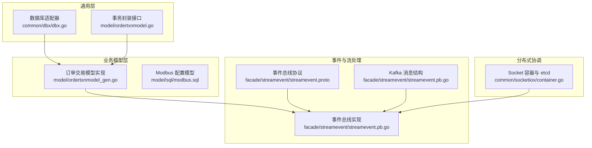
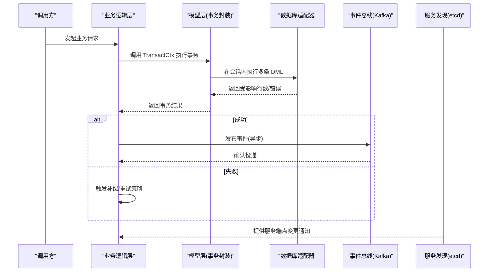
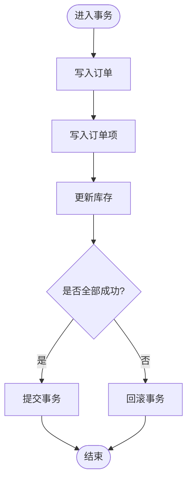
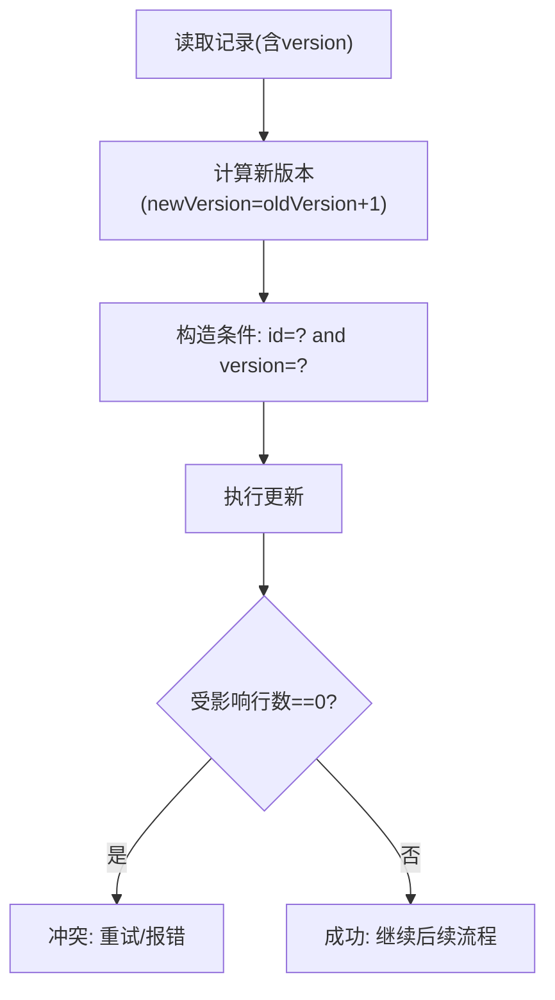
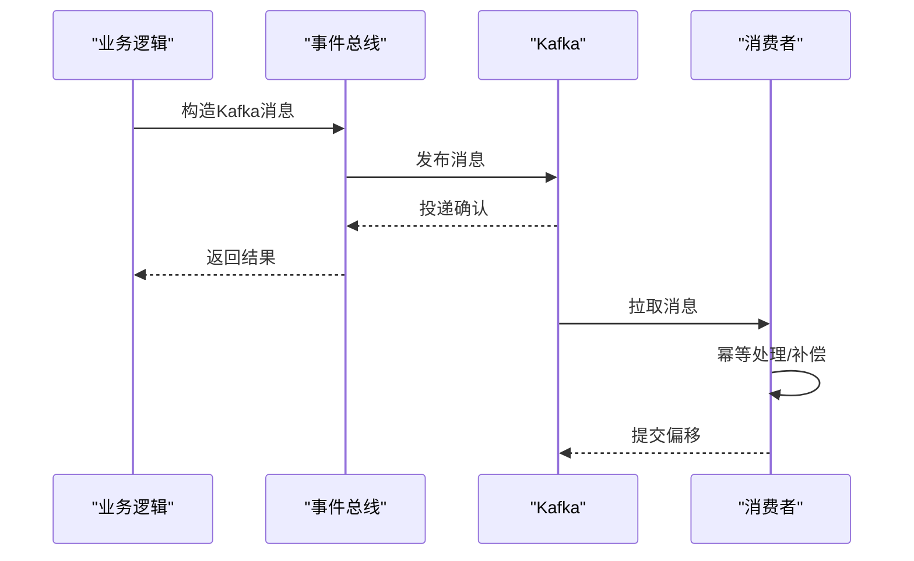
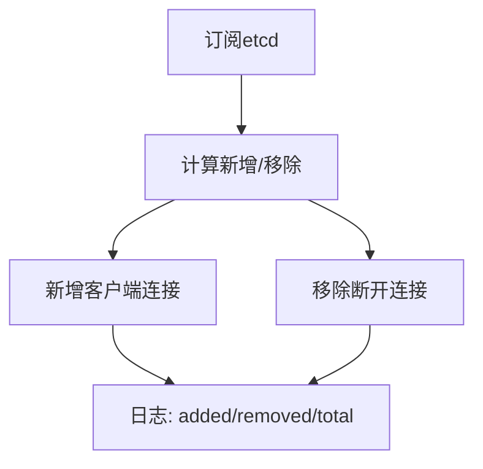
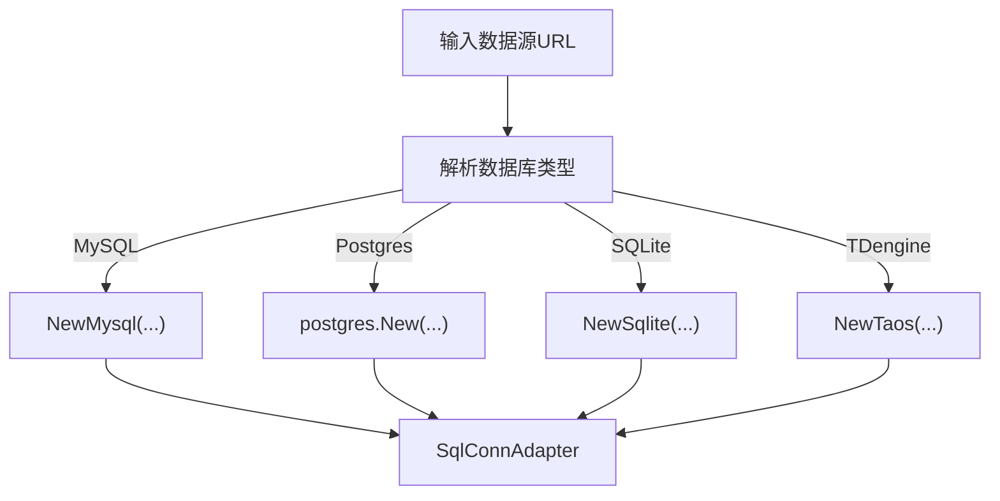
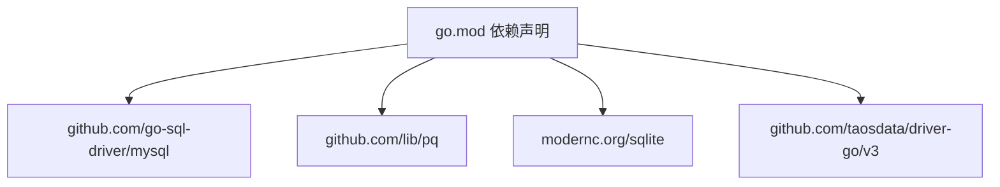

# 数据一致性保障机制

<cite>
**本文引用的文件**
- [go.mod](file://go.mod)
- [数据库模式参考](file://.trae/skills/zero-skills/references/database-patterns.md)
- [通用数据库适配器](file://common/dbx/dbx.go)
- [订单交易模型接口](file://model/ordertxnmodel.go)
- [订单交易模型实现](file://model/ordertxnmodel_gen.go)
- [PostgreSQL 初始化脚本](file://model/sql/postgres.sql)
- [Modbus 配置表初始化脚本](file://model/sql/modbus.sql)
- [事件总线服务定义](file://facade/streamevent/streamevent.proto)
- [事件总线服务实现](file://facade/streamevent/streamevent/streamevent.pb.go)
- [Kafka 消息结构:435-470](file://facade/streamevent/streamevent/streamevent.pb.go#L435-L470)
- [Socket 容器与 etcd 集成](file://common/socketiox/container.go)
</cite>

## 目录
1. [简介](#简介)
2. [项目结构](#项目结构)
3. [核心组件](#核心组件)
4. [架构总览](#架构总览)
5. [详细组件分析](#详细组件分析)
6. [依赖分析](#依赖分析)
7. [性能考虑](#性能考虑)
8. [故障排查指南](#故障排查指南)
9. [结论](#结论)
10. [附录](#附录)

## 简介
本设计指南围绕 zero-service 的数据一致性保障机制展开，结合现有代码库中的事务模式、版本控制、事件驱动与分布式协调能力，系统化地提出以下内容：
- 分布式事务处理：两阶段提交（TCC）、补偿事务与 Saga 模式的落地建议
- 最终一致性模型：事件驱动的数据更新、补偿机制与冲突解决策略
- 强一致性方案：分布式锁、共识算法与读写分离策略
- 数据分区与复制：主从复制、多主复制与一致性级别选择
- 数据版本控制、冲突检测与自动恢复机制的设计模式

## 项目结构
本项目采用多模块微服务架构，围绕统一的 go-zero 框架与多种存储后端（MySQL、PostgreSQL、SQLite、TDengine）。核心与一致性相关的能力分布如下：
- 通用数据库适配与查询构建：common/dbx/dbx.go
- 业务模型与事务封装：model/ordertxnmodel*.go
- 事件驱动与流式处理：facade/streamevent/*（含 Kafka 消息结构）
- 分布式协调与服务发现：common/socketiox/container.go（etcd 集成）

图表来源
- [通用数据库适配器:1-155](file://common/dbx/dbx.go#L1-L155)
- [订单交易模型接口:1-32](file://model/ordertxnmodel.go#L1-L32)
- [订单交易模型实现:1-421](file://model/ordertxnmodel_gen.go#L1-L421)
- [事件总线服务定义](file://facade/streamevent/streamevent.proto)
- [事件总线服务实现:392-470](file://facade/streamevent/streamevent/streamevent.pb.go#L392-L470)
- [Socket 容器与 etcd 集成:79-130](file://common/socketiox/container.go#L79-L130)

章节来源
- [go.mod:1-245](file://go.mod#L1-L245)

## 核心组件
- 数据库适配与查询构建：支持 MySQL、PostgreSQL、SQLite、TDengine，提供统一的连接与日志记录能力，并封装事务执行上下文。
- 事务封装接口：通过 TransactCtx 提供跨模型的事务边界管理，便于在复杂业务中保证原子性。
- 版本控制与乐观锁：订单交易模型内置 version 字段与 UpdateWithVersion 方法，基于“id+version”条件更新，实现并发写入的冲突检测与自动回退。
- 事件驱动与最终一致性：事件总线服务定义了 Kafka 消息结构，支持异步事件广播；结合业务逻辑可实现补偿与重试。
- 分布式协调与服务发现：Socket 容器通过 etcd 订阅服务端点变化，动态维护连接集合，为一致性约束下的服务治理提供基础。

章节来源
- [通用数据库适配器:1-155](file://common/dbx/dbx.go#L1-L155)
- [订单交易模型接口:1-32](file://model/ordertxnmodel.go#L1-L32)
- [订单交易模型实现:172-199](file://model/ordertxnmodel_gen.go#L172-L199)
- [事件总线服务实现:435-470](file://facade/streamevent/streamevent/streamevent.pb.go#L435-L470)
- [Socket 容器与 etcd 集成:79-130](file://common/socketiox/container.go#L79-L130)

## 架构总览
下图展示了从应用层到数据库与事件系统的整体一致性保障路径：

图表来源
- [数据库模式参考:271-365](file://.trae/skills/zero-skills/references/database-patterns.md#L271-L365)
- [通用数据库适配器:82-104](file://common/dbx/dbx.go#L82-L104)
- [订单交易模型实现:406-412](file://model/ordertxnmodel_gen.go#L406-L412)
- [事件总线服务实现:435-470](file://facade/streamevent/streamevent/streamevent.pb.go#L435-L470)
- [Socket 容器与 etcd 集成:83-129](file://common/socketiox/container.go#L83-L129)

## 详细组件分析

### 组件A：事务封装与多模型协作
- 设计要点
  - 使用 TransactCtx 在单个事务中完成多个模型的读写，避免部分提交导致的状态不一致。
  - 通过 Session 传递事务上下文，确保跨表/跨模型操作在同一连接上执行。
- 典型流程
  - 开启事务 -> 写入订单 -> 写入订单项 -> 更新库存 -> 提交事务
  - 任一步骤失败则回滚，保证 ACID 原子性。

图表来源
- [数据库模式参考:311-365](file://.trae/skills/zero-skills/references/database-patterns.md#L311-L365)

章节来源
- [数据库模式参考:271-365](file://.trae/skills/zero-skills/references/database-patterns.md#L271-L365)
- [订单交易模型实现:406-412](file://model/ordertxnmodel_gen.go#L406-L412)

### 组件B：版本控制与乐观锁
- 设计要点
  - 模型内置 version 字段与 UpdateWithVersion 方法，采用“id+version”条件更新，若受影响行数为 0 则判定并发冲突。
  - 适用于高并发写入但冲突概率较低的场景，降低悲观锁带来的性能损耗。
- 典型流程
  - 读取当前记录及其 version
  - 修改数据并 version+1
  - 条件更新 id=? and version=?
  - 若受影响行数为 0，则重试或返回冲突错误

图表来源
- [订单交易模型实现:172-199](file://model/ordertxnmodel_gen.go#L172-L199)

章节来源
- [订单交易模型实现:55-88](file://model/ordertxnmodel_gen.go#L55-L88)
- [订单交易模型实现:172-199](file://model/ordertxnmodel_gen.go#L172-L199)

### 组件C：事件驱动与最终一致性
- 设计要点
  - 事件总线服务定义 Kafka 消息结构，支持批量消息投递与确认。
  - 业务完成后发布事件，下游消费者异步处理，实现最终一致性。
  - 结合补偿机制与幂等设计，确保在失败或重复投递时仍能保持一致。
- 关键结构
  - KafkaMessage：包含 sessionId、topic、group、key、value、sendTime 等字段，用于事件溯源与去重。

图表来源
- [事件总线服务实现:435-470](file://facade/streamevent/streamevent/streamevent.pb.go#L435-L470)
- [事件总线服务实现:392-470](file://facade/streamevent/streamevent/streamevent.pb.go#L392-L470)

章节来源
- [事件总线服务实现:435-470](file://facade/streamevent/streamevent/streamevent.pb.go#L435-L470)

### 组件D：分布式协调与服务发现
- 设计要点
  - Socket 容器通过 etcd 订阅服务端点，动态维护客户端连接集合。
  - 当服务实例发生增删时，自动调整连接池，减少因节点变更导致的一致性抖动。
- 关键流程
  - 订阅 etcd -> 计算新增/移除集合 -> 动态增删客户端连接 -> 日志输出

图表来源
- [Socket 容器与 etcd 集成:83-129](file://common/socketiox/container.go#L83-L129)

章节来源
- [Socket 容器与 etcd 集成:79-130](file://common/socketiox/container.go#L79-L130)

### 组件E：数据库类型识别与连接适配
- 设计要点
  - 根据数据源 URL 自动识别数据库类型（MySQL、PostgreSQL、SQLite、TDengine），并创建相应连接。
  - 提供统一的 SqlConnAdapter，兼容 sqlx.SqlConn 与原生 sql.DB，便于扩展与测试。
- 应用场景
  - 在多数据库环境下统一事务与查询构建，减少环境差异带来的问题。

图表来源
- [通用数据库适配器:31-64](file://common/dbx/dbx.go#L31-L64)
- [通用数据库适配器:66-104](file://common/dbx/dbx.go#L66-L104)

章节来源
- [通用数据库适配器:1-155](file://common/dbx/dbx.go#L1-L155)

## 依赖分析
- 存储后端
  - MySQL、PostgreSQL、SQLite、TDengine：通过 go-zero 的 sqlx 与 postgres 组件提供连接与事务支持。
- 事件系统
  - Kafka 消息结构由事件总线服务定义，支持批量消息投递与确认。
- 协调与发现
  - etcd 作为服务发现与配置中心，Socket 容器动态维护连接集合。

图表来源
- [go.mod:5-61](file://go.mod#L5-L61)

章节来源
- [go.mod:1-245](file://go.mod#L1-L245)

## 性能考虑
- 事务批量化：尽量将相关写操作放入同一事务，减少事务拆分带来的锁竞争与日志开销。
- 乐观锁优化：对高并发写入场景优先使用版本控制，避免长时间持有排他锁。
- 事件异步化：将非关键路径的写操作异步化，降低主流程延迟。
- 连接池与适配：根据数据库类型选择合适的连接池参数，避免过度连接导致资源争用。
- 读写分离：在允许最终一致性的场景下，将只读查询路由至从库，减轻主库压力。

## 故障排查指南
- 事务失败
  - 现象：事务中途报错，部分写入成功。
  - 排查：检查 TransactCtx 内部的 DML 是否存在约束冲突或死锁；确认回滚分支是否正确执行。
  - 参考：事务模式示例与实现位置。
- 版本冲突
  - 现象：UpdateWithVersion 返回受影响行数为 0。
  - 排查：确认并发写入是否频繁；考虑增加重试次数与退避策略；必要时降级为悲观锁。
  - 参考：版本控制方法与模型字段定义。
- 事件丢失/重复
  - 现象：下游消费者缺失或重复处理事件。
  - 排查：校验 Kafka 消息的 key 与去重策略；确认消费者的幂等处理逻辑；检查偏移提交时机。
  - 参考：Kafka 消息结构与事件总线实现。
- 服务发现抖动
  - 现象：客户端连接频繁增删，影响稳定性。
  - 排查：检查 etcd 订阅回调频率与阈值；确认服务端点变更是否合理；适当增大订阅更新间隔。
  - 参考：Socket 容器与 etcd 集成。

章节来源
- [数据库模式参考:271-365](file://.trae/skills/zero-skills/references/database-patterns.md#L271-L365)
- [订单交易模型实现:172-199](file://model/ordertxnmodel_gen.go#L172-L199)
- [事件总线服务实现:435-470](file://facade/streamevent/streamevent/streamevent.pb.go#L435-L470)
- [Socket 容器与 etcd 集成:83-129](file://common/socketiox/container.go#L83-L129)

## 结论
zero-service 已具备事务封装、版本控制与事件驱动的基础能力。在此基础上，建议进一步完善：
- 分布式事务：在跨服务边界引入 Saga 或 TCC 模式，并配套补偿与重试策略。
- 最终一致性：强化事件幂等与去重、补偿与回放机制，明确冲突解决策略。
- 强一致性：在关键节点引入分布式锁与共识算法，结合读写分离提升吞吐。
- 数据复制：按业务特性选择主从或多主复制，明确一致性级别与分区策略。
- 自动恢复：将冲突检测与自动恢复纳入统一框架，形成闭环。

## 附录
- 数据库初始化脚本
  - PostgreSQL：包含 version 字段与触发器示例，体现时间戳更新与版本控制思路。
  - Modbus 配置表：展示唯一索引、注释与触发器的使用方式，便于理解一致性约束的落地。
- 协议与消息
  - 事件总线协议与实现文件提供了 Kafka 消息结构的完整定义，可用于事件驱动的数据一致性设计。

章节来源
- [PostgreSQL 初始化脚本:452-525](file://model/sql/postgres.sql#L452-L525)
- [Modbus 配置表初始化脚本:1-32](file://model/sql/modbus.sql#L1-L32)
- [事件总线服务定义](file://facade/streamevent/streamevent.proto)
- [事件总线服务实现:392-470](file://facade/streamevent/streamevent/streamevent.pb.go#L392-L470)