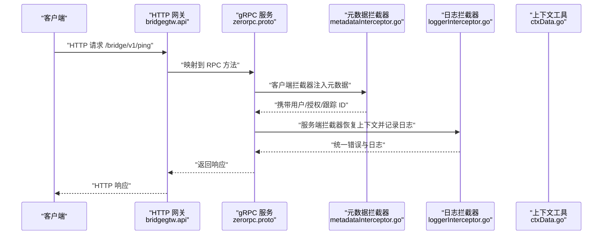
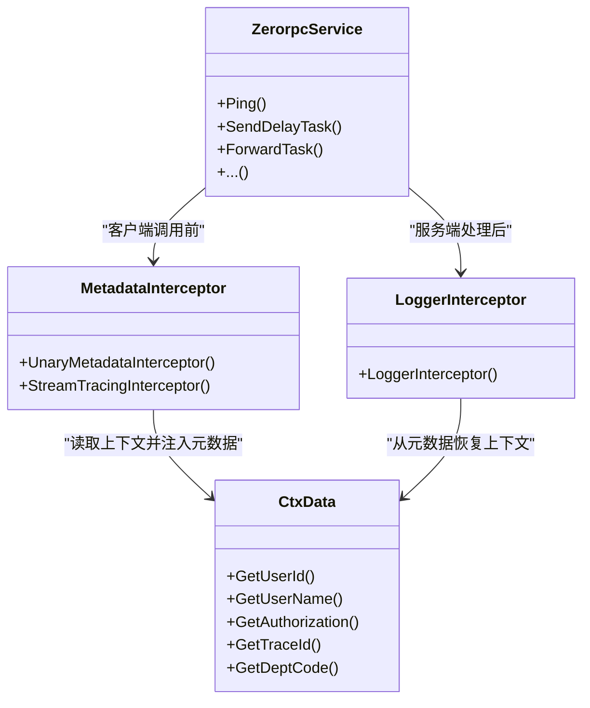
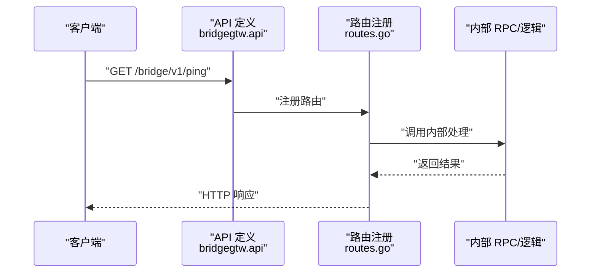
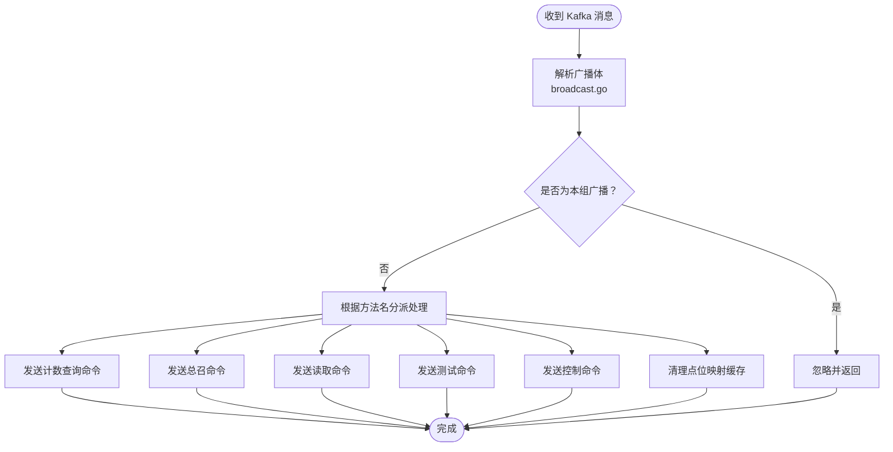
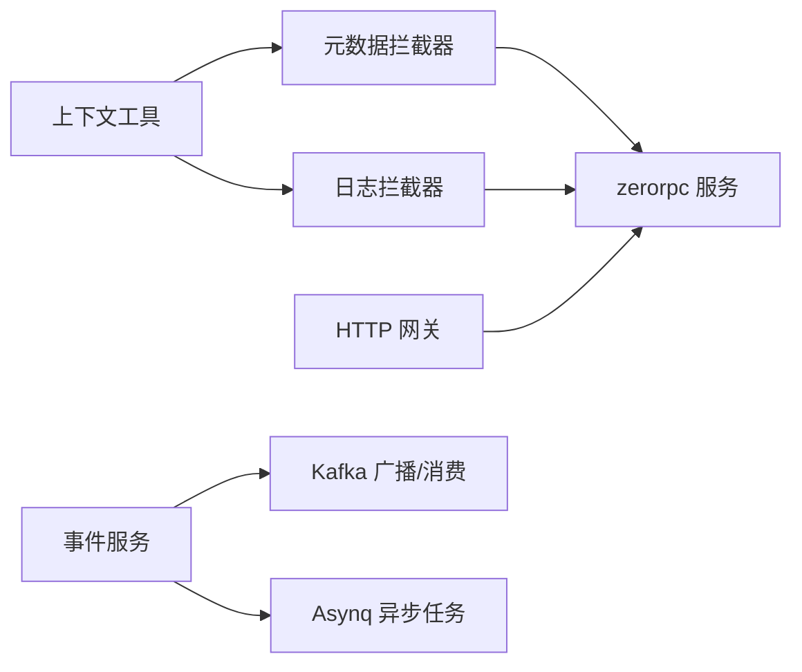

# 服务通信设计模式

<cite>
**本文引用的文件**
- [metadataInterceptor.go](file://common/Interceptor/rpcclient/metadataInterceptor.go)
- [loggerInterceptor.go](file://common/Interceptor/rpcserver/loggerInterceptor.go)
- [ctxData.go](file://common/ctxdata/ctxData.go)
- [zerorpc.proto](file://zerorpc/zerorpc.proto)
- [zerorpc.yaml](file://zerorpc/etc/zerorpc.yaml)
- [zerorpc.go](file://zerorpc/zerorpc.go)
- [pinglogic.go](file://zerorpc/internal/logic/pinglogic.go)
- [bridgegtw.api](file://app/bridgegtw/bridgegtw.api)
- [routes.go](file://app/bridgegtw/internal/handler/routes.go)
- [bridgegtw.yaml](file://app/bridgegtw/etc/bridgegtw.yaml)
- [streamevent.proto](file://facade/streamevent/streamevent.proto)
- [streamevent.yaml](file://facade/streamevent/etc/streamevent.yaml)
- [receivekafkamessagelogic.go](file://facade/streamevent/internal/logic/receivekafkamessagelogic.go)
- [broadcast.go](file://app/ieccaller/kafka/broadcast.go)
- [asynqClient.go](file://common/asynqx/asynqClient.go)
</cite>

## 目录
1. [引言](#引言)
2. [项目结构](#项目结构)
3. [核心组件](#核心组件)
4. [架构总览](#架构总览)
5. [详细组件分析](#详细组件分析)
6. [依赖分析](#依赖分析)
7. [性能考量](#性能考量)
8. [故障排查指南](#故障排查指南)
9. [结论](#结论)
10. [附录](#附录)

## 引言
本指南围绕 zero-service 的实际实现，系统梳理服务间通信设计模式，覆盖同步与异步两类通信范式，并结合项目中已落地的 gRPC、HTTP REST、事件驱动与消息发布订阅实践，给出可操作的设计原则、中间件与协议选择建议，帮助在微服务架构中做出更稳健的通信决策。

## 项目结构
从通信视角看，项目主要由以下几类模块构成：
- 同步 RPC 服务：基于 gRPC 的零拷贝、强类型接口，典型如 zerorpc。
- HTTP 网关与 REST：通过 go-zero REST 生成路由，桥接到内部 RPC 或逻辑层。
- 事件与消息：通过 streamevent 提供统一事件通道；IEC 场景下通过 Kafka 广播与消费；异步任务通过 Asynq。
- 中间件：gRPC 客户端/服务端拦截器负责元数据透传与日志记录；上下文工具负责跨进程上下文传递。

```mermaid
graph TB
subgraph "客户端"
GW["HTTP 网关<br/>bridgegtw.api"]
end
subgraph "同步 RPC"
ZR["gRPC 服务<br/>zerorpc.proto"]
end
subgraph "事件与消息"
SE["事件服务<br/>streamevent.proto"]
KF["Kafka 广播/消费<br/>broadcast.go"]
AQ["异步任务<br/>asynqClient.go"]
end
subgraph "中间件"
MD["元数据拦截器<br/>metadataInterceptor.go"]
LG["日志拦截器<br/>loggerInterceptor.go"]
CTX["上下文工具<br/>ctxData.go"]
end
GW --> ZR
ZR <- --> MD
ZR <- --> LG
ZR --> CTX
SE --> KF
SE --> AQ
```

图表来源
- [bridgegtw.api:13-21](file://app/bridgegtw/bridgegtw.api#L13-L21)
- [zerorpc.proto:140-166](file://zerorpc/zerorpc.proto#L140-L166)
- [streamevent.proto:10-25](file://facade/streamevent/streamevent.proto#L10-L25)
- [metadataInterceptor.go:11-32](file://common/Interceptor/rpcclient/metadataInterceptor.go#L11-L32)
- [loggerInterceptor.go:12-44](file://common/Interceptor/rpcserver/loggerInterceptor.go#L12-L44)
- [ctxData.go:9-24](file://common/ctxdata/ctxData.go#L9-L24)
- [broadcast.go:24-148](file://app/ieccaller/kafka/broadcast.go#L24-L148)
- [asynqClient.go:17-30](file://common/asynqx/asynqClient.go#L17-L30)

章节来源
- [bridgegtw.api:13-21](file://app/bridgegtw/bridgegtw.api#L13-L21)
- [zerorpc.proto:140-166](file://zerorpc/zerorpc.proto#L140-L166)
- [streamevent.proto:10-25](file://facade/streamevent/streamevent.proto#L10-L25)
- [metadataInterceptor.go:11-32](file://common/Interceptor/rpcclient/metadataInterceptor.go#L11-L32)
- [loggerInterceptor.go:12-44](file://common/Interceptor/rpcserver/loggerInterceptor.go#L12-L44)
- [ctxData.go:9-24](file://common/ctxdata/ctxData.go#L9-L24)
- [broadcast.go:24-148](file://app/ieccaller/kafka/broadcast.go#L24-L148)
- [asynqClient.go:17-30](file://common/asynqx/asynqClient.go#L17-L30)

## 核心组件
- gRPC 元数据拦截器：在客户端侧将用户、授权、跟踪 ID 等上下文注入到 gRPC 元数据；在服务端侧从元数据恢复到上下文，统一日志与错误处理。
- HTTP 网关与路由：通过 go-zero API 定义路由，映射到具体处理器，支持前缀与分组。
- 事件服务：统一接收 MQTT/WS/Kafka/IEC 等多源事件，抽象为一组 RPC 接口，便于上层编排。
- Kafka 广播：在 IEC 场景中，通过广播消息在集群节点间同步指令与缓存清理。
- 异步任务：基于 Asynq 的生产者/消费者模型，支持 Redis 存储与 OpenTelemetry 追踪。

章节来源
- [metadataInterceptor.go:11-32](file://common/Interceptor/rpcclient/metadataInterceptor.go#L11-L32)
- [loggerInterceptor.go:12-44](file://common/Interceptor/rpcserver/loggerInterceptor.go#L12-L44)
- [bridgegtw.api:13-21](file://app/bridgegtw/bridgegtw.api#L13-L21)
- [routes.go:15-27](file://app/bridgegtw/internal/handler/routes.go#L15-L27)
- [streamevent.proto:10-25](file://facade/streamevent/streamevent.proto#L10-L25)
- [broadcast.go:24-148](file://app/ieccaller/kafka/broadcast.go#L24-L148)
- [asynqClient.go:17-30](file://common/asynqx/asynqClient.go#L17-L30)

## 架构总览
下图展示从 HTTP 到 gRPC、再到事件与消息的典型调用链路与数据流。



图表来源
- [bridgegtw.api:13-21](file://app/bridgegtw/bridgegtw.api#L13-L21)
- [routes.go:15-27](file://app/bridgegtw/internal/handler/routes.go#L15-L27)
- [zerorpc.proto:140-166](file://zerorpc/zerorpc.proto#L140-L166)
- [metadataInterceptor.go:11-32](file://common/Interceptor/rpcclient/metadataInterceptor.go#L11-L32)
- [loggerInterceptor.go:12-44](file://common/Interceptor/rpcserver/loggerInterceptor.go#L12-L44)
- [ctxData.go:9-24](file://common/ctxdata/ctxData.go#L9-L24)

## 详细组件分析

### 同步通信模式：gRPC 直连调用
- 设计要点
  - 使用 proto 定义强类型接口，确保契约稳定与工具链友好。
  - 在客户端拦截器中统一注入用户、授权、跟踪 ID 等元数据，避免在各业务层重复处理。
  - 在服务端拦截器中从元数据恢复上下文，集中记录日志与错误，便于可观测性与问题定位。
  - 通过上下文工具在进程边界传递关键字段，保证跨服务一致性。
- 关键实现路径
  - gRPC 服务定义：[zerorpc.proto:140-166](file://zerorpc/zerorpc.proto#L140-L166)
  - 客户端元数据拦截器：[metadataInterceptor.go:11-32](file://common/Interceptor/rpcclient/metadataInterceptor.go#L11-L32)
  - 服务端日志拦截器：[loggerInterceptor.go:12-44](file://common/Interceptor/rpcserver/loggerInterceptor.go#L12-L44)
  - 上下文与头字段常量：[ctxData.go:9-24](file://common/ctxdata/ctxData.go#L9-L24)
  - 服务配置示例：[zerorpc.yaml:1-39](file://zerorpc/etc/zerorpc.yaml#L1-L39)
  - 示例逻辑：[pinglogic.go:25-27](file://zerorpc/internal/logic/pinglogic.go#L25-L27)



图表来源
- [metadataInterceptor.go:11-32](file://common/Interceptor/rpcclient/metadataInterceptor.go#L11-L32)
- [loggerInterceptor.go:12-44](file://common/Interceptor/rpcserver/loggerInterceptor.go#L12-L44)
- [ctxData.go:42-75](file://common/ctxdata/ctxData.go#L42-L75)
- [zerorpc.proto:140-166](file://zerorpc/zerorpc.proto#L140-L166)

章节来源
- [zerorpc.proto:140-166](file://zerorpc/zerorpc.proto#L140-L166)
- [metadataInterceptor.go:11-32](file://common/Interceptor/rpcclient/metadataInterceptor.go#L11-L32)
- [loggerInterceptor.go:12-44](file://common/Interceptor/rpcserver/loggerInterceptor.go#L12-L44)
- [ctxData.go:9-24](file://common/ctxdata/ctxData.go#L9-L24)
- [zerorpc.yaml:1-39](file://zerorpc/etc/zerorpc.yaml#L1-L39)
- [pinglogic.go:25-27](file://zerorpc/internal/logic/pinglogic.go#L25-L27)

### 同步通信模式：HTTP REST API
- 设计要点
  - 使用 go-zero API 定义路由与处理器，支持前缀与分组，便于版本化与模块化。
  - 将 HTTP 映射到内部 RPC 或逻辑层，保持对外接口简洁与对内能力复用。
- 关键实现路径
  - API 定义：[bridgegtw.api:13-21](file://app/bridgegtw/bridgegtw.api#L13-L21)
  - 路由注册：[routes.go:15-27](file://app/bridgegtw/internal/handler/routes.go#L15-L27)
  - 网关配置：[bridgegtw.yaml:12-40](file://app/bridgegtw/etc/bridgegtw.yaml#L12-L40)



图表来源
- [bridgegtw.api:13-21](file://app/bridgegtw/bridgegtw.api#L13-L21)
- [routes.go:15-27](file://app/bridgegtw/internal/handler/routes.go#L15-L27)
- [bridgegtw.yaml:12-40](file://app/bridgegtw/etc/bridgegtw.yaml#L12-L40)

章节来源
- [bridgegtw.api:13-21](file://app/bridgegtw/bridgegtw.api#L13-L21)
- [routes.go:15-27](file://app/bridgegtw/internal/handler/routes.go#L15-L27)
- [bridgegtw.yaml:12-40](file://app/bridgegtw/etc/bridgegtw.yaml#L12-L40)

### 同步通信模式：请求-响应设计原则
- 响应体结构：建议统一包装响应体，包含状态码、消息与数据载体，便于前端与网关解析。
- 错误传播：服务端拦截器统一捕获错误并记录，客户端根据约定进行重试或降级。
- 超时控制：在网关与 RPC 配置中设置合理超时，避免级联阻塞。
- 参考实现路径
  - 日志与错误处理：[loggerInterceptor.go:39-43](file://common/Interceptor/rpcserver/loggerInterceptor.go#L39-L43)
  - 网关超时配置：[bridgegtw.yaml](file://app/bridgegtw/etc/bridgegtw.yaml#L11)
  - RPC 超时配置：[zerorpc.yaml](file://zerorpc/etc/zerorpc.yaml#L3)

章节来源
- [loggerInterceptor.go:39-43](file://common/Interceptor/rpcserver/loggerInterceptor.go#L39-L43)
- [bridgegtw.yaml](file://app/bridgegtw/etc/bridgegtw.yaml#L11)
- [zerorpc.yaml](file://zerorpc/etc/zerorpc.yaml#L3)

### 异步通信模式：Kafka 消息队列与事件驱动
- 设计要点
  - 事件服务统一入口：通过 streamevent 接收多种来源事件，屏蔽底层差异。
  - 广播与消费：在 IEC 场景中，通过 Kafka 广播实现跨节点同步；消费端根据方法名路由到具体处理逻辑。
  - 事件聚合：对于高吞吐事件（如 MQTT/Kafka），建议在消费端做聚合与批处理，降低下游压力。
- 关键实现路径
  - 事件服务接口：[streamevent.proto:10-25](file://facade/streamevent/streamevent.proto#L10-L25)
  - Kafka 广播消费：[broadcast.go:24-148](file://app/ieccaller/kafka/broadcast.go#L24-L148)
  - 事件服务配置：[streamevent.yaml:11-13](file://facade/streamevent/etc/streamevent.yaml#L11-L13)



图表来源
- [broadcast.go:24-148](file://app/ieccaller/kafka/broadcast.go#L24-L148)

章节来源
- [streamevent.proto:10-25](file://facade/streamevent/streamevent.proto#L10-L25)
- [broadcast.go:24-148](file://app/ieccaller/kafka/broadcast.go#L24-L148)
- [streamevent.yaml:11-13](file://facade/streamevent/etc/streamevent.yaml#L11-L13)

### 异步通信模式：消息发布订阅与事件驱动架构
- 设计要点
  - 事件解耦：上游只负责发布事件，下游订阅感兴趣的主题，降低耦合度。
  - 幂等与去重：在消费端实现幂等处理，结合消息键与去重策略，避免重复处理。
  - 流控与背压：通过限速、批处理与分区策略控制消费速率，避免下游过载。
- 参考实现路径
  - 事件服务接口：[streamevent.proto:10-25](file://facade/streamevent/streamevent.proto#L10-L25)
  - 事件服务配置：[streamevent.yaml:1-28](file://facade/streamevent/etc/streamevent.yaml#L1-L28)

章节来源
- [streamevent.proto:10-25](file://facade/streamevent/streamevent.proto#L10-L25)
- [streamevent.yaml:1-28](file://facade/streamevent/etc/streamevent.yaml#L1-L28)

### CQRS（命令查询职责分离）在微服务中的应用
- 设计要点
  - 读写分离：通过事件服务与消息队列实现写入事件的异步投递，查询侧独立读库，提升读性能。
  - 事件溯源：将所有状态变更记录为事件，便于审计、回放与重建。
  - 聚合根设计：围绕业务实体划分聚合边界，聚合内强一致，聚合间通过事件解耦。
- 参考实现路径
  - 事件服务接口：[streamevent.proto:10-25](file://facade/streamevent/streamevent.proto#L10-L25)
  - 计划任务事件：[streamevent.proto:501-550](file://facade/streamevent/streamevent.proto#L501-L550)

章节来源
- [streamevent.proto:10-25](file://facade/streamevent/streamevent.proto#L10-L25)
- [streamevent.proto:501-550](file://facade/streamevent/streamevent.proto#L501-L550)

### 通信协议选择指南：gRPC vs HTTP、同步 vs 异步
- gRPC 优势
  - 强类型、IDL 明确，适合服务间直连与低延迟场景。
  - 内置元数据、拦截器与日志，便于统一治理。
- HTTP 优势
  - 生态广泛、浏览器友好，适合作为外部网关与第三方集成。
  - 版本化与缓存友好，便于演进。
- 同步 vs 异步
  - 同步：请求-响应，适合实时交互与事务一致性要求高的场景。
  - 异步：事件驱动，适合高吞吐、最终一致性与削峰填谷场景。
- 参考实现路径
  - gRPC 服务与拦截器：[zerorpc.proto:140-166](file://zerorpc/zerorpc.proto#L140-L166)、[metadataInterceptor.go:11-32](file://common/Interceptor/rpcclient/metadataInterceptor.go#L11-L32)、[loggerInterceptor.go:12-44](file://common/Interceptor/rpcserver/loggerInterceptor.go#L12-L44)
  - HTTP 网关：[bridgegtw.api:13-21](file://app/bridgegtw/bridgegtw.api#L13-L21)、[routes.go:15-27](file://app/bridgegtw/internal/handler/routes.go#L15-L27)

章节来源
- [zerorpc.proto:140-166](file://zerorpc/zerorpc.proto#L140-L166)
- [metadataInterceptor.go:11-32](file://common/Interceptor/rpcclient/metadataInterceptor.go#L11-L32)
- [loggerInterceptor.go:12-44](file://common/Interceptor/rpcserver/loggerInterceptor.go#L12-L44)
- [bridgegtw.api:13-21](file://app/bridgegtw/bridgegtw.api#L13-L21)
- [routes.go:15-27](file://app/bridgegtw/internal/handler/routes.go#L15-L27)

### 中间件设计：元数据传递、日志拦截器与错误传播
- 元数据传递
  - 客户端拦截器：从上下文读取用户、授权、跟踪 ID 等，注入到 gRPC 元数据。
  - 服务端拦截器：从元数据恢复到上下文，统一记录日志与错误。
- 日志拦截器
  - 记录请求与错误，便于问题定位与审计。
- 错误传播
  - 服务端拦截器统一捕获错误并记录，客户端根据约定进行重试或降级。
- 参考实现路径
  - 元数据拦截器：[metadataInterceptor.go:11-32](file://common/Interceptor/rpcclient/metadataInterceptor.go#L11-L32)
  - 日志拦截器：[loggerInterceptor.go:12-44](file://common/Interceptor/rpcserver/loggerInterceptor.go#L12-L44)
  - 上下文工具：[ctxData.go:9-24](file://common/ctxdata/ctxData.go#L9-L24)

章节来源
- [metadataInterceptor.go:11-32](file://common/Interceptor/rpcclient/metadataInterceptor.go#L11-L32)
- [loggerInterceptor.go:12-44](file://common/Interceptor/rpcserver/loggerInterceptor.go#L12-L44)
- [ctxData.go:9-24](file://common/ctxdata/ctxData.go#L9-L24)

## 依赖分析
- 组件耦合
  - gRPC 服务依赖拦截器与上下文工具，形成横切关注点的统一处理。
  - HTTP 网关依赖路由注册与处理器，映射到内部 RPC/逻辑层。
  - 事件服务作为统一入口，连接 Kafka/WS/MQTT 等下游。
- 外部依赖
  - gRPC 与 go-zero 提供 RPC/REST 能力。
  - Kafka/Asynq 提供消息与异步任务能力。
  - OpenTelemetry 提供链路追踪能力（在 Asynq 客户端中体现）。



图表来源
- [metadataInterceptor.go:11-32](file://common/Interceptor/rpcclient/metadataInterceptor.go#L11-L32)
- [loggerInterceptor.go:12-44](file://common/Interceptor/rpcserver/loggerInterceptor.go#L12-L44)
- [ctxData.go:9-24](file://common/ctxdata/ctxData.go#L9-L24)
- [bridgegtw.api:13-21](file://app/bridgegtw/bridgegtw.api#L13-L21)
- [zerorpc.proto:140-166](file://zerorpc/zerorpc.proto#L140-L166)
- [streamevent.proto:10-25](file://facade/streamevent/streamevent.proto#L10-L25)
- [broadcast.go:24-148](file://app/ieccaller/kafka/broadcast.go#L24-L148)
- [asynqClient.go:17-30](file://common/asynqx/asynqClient.go#L17-L30)

章节来源
- [metadataInterceptor.go:11-32](file://common/Interceptor/rpcclient/metadataInterceptor.go#L11-L32)
- [loggerInterceptor.go:12-44](file://common/Interceptor/rpcserver/loggerInterceptor.go#L12-L44)
- [ctxData.go:9-24](file://common/ctxdata/ctxData.go#L9-L24)
- [bridgegtw.api:13-21](file://app/bridgegtw/bridgegtw.api#L13-L21)
- [zerorpc.proto:140-166](file://zerorpc/zerorpc.proto#L140-L166)
- [streamevent.proto:10-25](file://facade/streamevent/streamevent.proto#L10-L25)
- [broadcast.go:24-148](file://app/ieccaller/kafka/broadcast.go#L24-L148)
- [asynqClient.go:17-30](file://common/asynqx/asynqClient.go#L17-L30)

## 性能考量
- 同步调用
  - 合理设置超时与重试，避免级联阻塞；在网关与 RPC 层分别设置超时阈值。
  - 对热点接口进行缓存与批处理，减少数据库压力。
- 异步处理
  - Kafka 分区与批处理策略影响吞吐；根据数据量与处理能力调整分区数与批大小。
  - Asynq 任务并发与队列优先级，结合业务 SLA 进行配置。
- 参考实现路径
  - 网关超时配置：[bridgegtw.yaml](file://app/bridgegtw/etc/bridgegtw.yaml#L11)
  - RPC 超时配置：[zerorpc.yaml](file://zerorpc/etc/zerorpc.yaml#L3)
  - 事件统计忽略配置：[streamevent.yaml:12-13](file://facade/streamevent/etc/streamevent.yaml#L12-L13)

章节来源
- [bridgegtw.yaml](file://app/bridgegtw/etc/bridgegtw.yaml#L11)
- [zerorpc.yaml](file://zerorpc/etc/zerorpc.yaml#L3)
- [streamevent.yaml:12-13](file://facade/streamevent/etc/streamevent.yaml#L12-L13)

## 故障排查指南
- gRPC 调用失败
  - 检查拦截器是否正确注入/恢复上下文；查看服务端日志拦截器输出的错误信息。
  - 核对元数据头字段是否符合约定（用户、授权、跟踪 ID）。
- HTTP 网关映射异常
  - 检查 API 定义与路由注册是否匹配；确认网关配置中的映射关系。
- Kafka 广播未生效
  - 检查广播组配置与消息体中的组 ID 是否一致；核对消费端方法名分派逻辑。
- 异步任务未执行
  - 检查 Asynq 客户端配置与 Redis 连接；确认任务类型与消费者注册情况。
- 参考实现路径
  - 日志拦截器错误记录：[loggerInterceptor.go:39-43](file://common/Interceptor/rpcserver/loggerInterceptor.go#L39-L43)
  - 元数据注入/恢复：[metadataInterceptor.go:11-32](file://common/Interceptor/rpcclient/metadataInterceptor.go#L11-L32)、[loggerInterceptor.go:12-28](file://common/Interceptor/rpcserver/loggerInterceptor.go#L12-L28)
  - 广播消费逻辑：[broadcast.go:24-148](file://app/ieccaller/kafka/broadcast.go#L24-L148)
  - Asynq 客户端初始化：[asynqClient.go:17-19](file://common/asynqx/asynqClient.go#L17-L19)

章节来源
- [loggerInterceptor.go:39-43](file://common/Interceptor/rpcserver/loggerInterceptor.go#L39-L43)
- [metadataInterceptor.go:11-32](file://common/Interceptor/rpcclient/metadataInterceptor.go#L11-L32)
- [loggerInterceptor.go:12-28](file://common/Interceptor/rpcserver/loggerInterceptor.go#L12-L28)
- [broadcast.go:24-148](file://app/ieccaller/kafka/broadcast.go#L24-L148)
- [asynqClient.go:17-19](file://common/asynqx/asynqClient.go#L17-L19)

## 结论
zero-service 在同步与异步通信方面提供了清晰的实现路径：gRPC 用于服务间直连与低延迟场景，HTTP 网关用于外部接入与生态兼容；事件服务与 Kafka/Asynq 提供了高吞吐与最终一致性的异步能力。通过拦截器与上下文工具，实现了跨进程的元数据传递与统一日志记录，为微服务的可观测性与可维护性提供了基础。

## 附录
- 关键配置参考
  - gRPC 服务配置：[zerorpc.yaml:1-39](file://zerorpc/etc/zerorpc.yaml#L1-L39)
  - HTTP 网关配置：[bridgegtw.yaml:1-40](file://app/bridgegtw/etc/bridgegtw.yaml#L1-L40)
  - 事件服务配置：[streamevent.yaml:1-28](file://facade/streamevent/etc/streamevent.yaml#L1-L28)
- 关键接口参考
  - gRPC 服务接口：[zerorpc.proto:140-166](file://zerorpc/zerorpc.proto#L140-L166)
  - 事件服务接口：[streamevent.proto:10-25](file://facade/streamevent/streamevent.proto#L10-L25)
- 关键逻辑参考
  - HTTP 路由注册：[routes.go:15-27](file://app/bridgegtw/internal/handler/routes.go#L15-L27)
  - Kafka 广播消费：[broadcast.go:24-148](file://app/ieccaller/kafka/broadcast.go#L24-L148)
  - Asynq 客户端初始化：[asynqClient.go:17-19](file://common/asynqx/asynqClient.go#L17-L19)